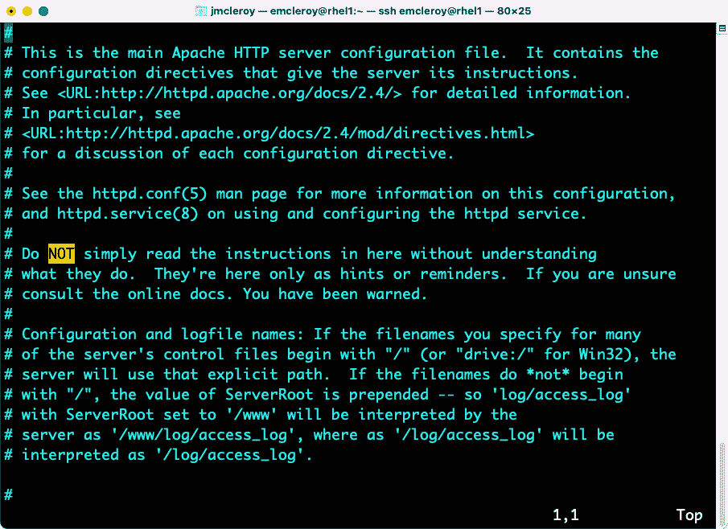
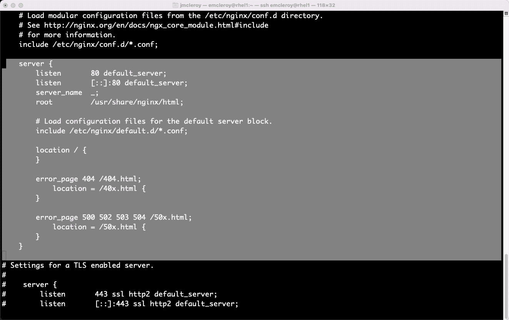

# 第八章：Web 服务器和 Web 流量 – 学习如何创建和控制流量

本章中，我们将概述什么是 web 服务器并安装它。我们将深入讨论如何保护 web 服务器，以确保在客户访问时数据的安全。我们还将讨论如何使用 Ansible 自动化来实现这一过程。如果没有良好的 web 服务器设置，可能会限制公司增长。提供访问您产品的能力至关重要，保护客户信息同样重要。让我们一起进入 web 服务器的世界吧。

本章中，我们将讨论以下主要内容：

+   开始了解 web 服务器和流量控制

+   学习手动设置 web 服务器并控制流量

+   学习使用 Ansible 自动化来自动化 web 服务器和流量控制

# 技术要求

本章中的技术要求在以下章节中进行介绍。

## 设置 GitHub 访问

请参考*第一章*中的说明，*块存储 – 学习如何在 Red Hat Enterprise Linux 上配置块存储*，以获得 GitHub 访问权限，您还可以通过以下链接找到本章的 Ansible 自动化剧本：[`github.com/PacktPublishing/Red-Hat-Certified-Specialist-in-Services-Management-and-Automation-EX358-Exam-Guide/tree/main/Chapter08`](https://github.com/PacktPublishing/Red-Hat-Certified-Specialist-in-Services-Management-and-Automation-EX358-Exam-Guide/tree/main/Chapter08)。请记住，这些是建议的剧本，并不是唯一的写法，您可以根据需要编写剧本使其适合您。

你始终可以使用原始的 shell 或 cmd 来更改它们，达到相同的结果，但我们展示的是实现目标的最佳方式。此外，请记住，我们没有使用未来版本 Ansible 中所需的 FCQN，因为该版本在考试中不会被支持，因为它是基于 Ansible 2.9 测试的。

# 开始了解 web 服务器和流量控制

设置和运行自己 web 服务器的能力对大多数公司来说都很重要。在这个数字时代，你必须跟上快速发展的世界需求。如果没有一个强大的网站向客户提供你的产品或服务，你将大大阻碍销售潜力。尤其是要在国际市场上发展业务，这是大多数创业者的梦想。在 RHEL 8 上设置 web 服务器非常简单，使用 Apache httpd 或 NGINX 可以轻松完成，但在实施规则保护自己的时候可能会变得复杂。

保持这些资源的安全对于任何企业来说都是必须的。能够阻止恶意流量或欺骗攻击对于确保公司与客户之间的良好关系至关重要。例如，作为 web 服务器管理员，您需要做好应对**分布式拒绝服务攻击**（**DDoS**）等威胁的准备。在未来的章节中，我们将深入探讨如何防止来自第三方的不必要访问，这些第三方可能试图为恶意目的获取您的信息。

我们将展示如何使用 Apache httpd 和 NGINX 安装 web 服务器，并配置它以确保系统的安全性。我们还将展示如何在一台物理服务器上托管多个 web 服务器端点。接下来，我们将演示如何在服务器启动并运行后访问它。我们将使用配置文件来定制从 web 服务器显示的内容。最后，我们将使用 Ansible 自动化来自动执行所有这些操作，从而消除需要反复进行的部署工作带来的困扰。

# 学习手动设置 web 服务器并控制流量

我们将从 Apache httpd 开始。我们将首先安装服务并配置文件。在以下截图中，我们可以看到 Apache httpd 的安装过程：


图 8.1 – 安装 Apache httpd web 服务

我们将查看默认的 `httpd.conf` 文件，以展示 Apache httpd 的开箱即用设置。我们可以在以下截图中看到 `/etc/httpd/conf/httpd.conf` 文件的布局：



图 8.2 – 截断的 /etc/httpd/conf/httpd.conf 文件

如前面截图所示，关于如何设置 web 服务器的信息可以在 Apache httpd 的 `/etc/httpd/conf/httpd.conf` 文件中找到，该文件也是查找帮助和提醒的好地方，但不要仅仅依赖它。

接下来，我们将利用从 man 页面和 `httpd.conf` 文件中学到的知识，在 `/etc/httpd/conf.d/` 目录中创建一个 `.conf` 文件。这将允许我们创建一个满足我们需求的 web 服务器。我们将设置 Apache httpd 中的虚拟主机，并使用 `/etc/httpd/conf.d/` 目录来存储我们的网站。在此之前，我们必须确保在默认的 `httpd.conf` 文件中设置了 web 服务器，我们需要检查以下代码：

```
ServerRoot "/etc/httpd"
Listen 80
User apache
Group apache
```

上面的代码指出 `ServerRoot` 为 `/etc/httpd/`，web 服务器的 `Listen` 端口为 `80`，并且 web 服务器的 `User` 设置为 `apache`。这些设置确保了当将 web 服务器提供给公众时，文件的所有权是正确的，并告诉服务器监听哪个端口，在此情况下为 `80` 端口，或者我们通常使用的 HTTP，或更安全的 HTTPS。目前，我们将保持这个基本配置。

接下来，我们将使用 `website.conf` 文件来构建虚拟服务器的配置，文件将保存到 `/etc/httpd/conf.d/website.conf`。我们可以在下图中看到 `website.conf` 文件的内容，它展示了设置 Web 服务器所需的最小参数：


图 8.3 – 用于配置虚拟 Web 服务器的 website.conf 文件

在前面的截图中，我们可以看到我们正在为文件定义一个目录，服务器的 IP 地址以及监听端口 `80`，并指定了网站名称。这将允许我们在 `/srv/website/www` 中创建诸如 `index.html` 之类的文件，以便控制 Web 服务器的内容。我们需要创建一个 `index.html` 文件，然后启动并启用该服务。在下图中，你可以看到我已经在 `/srv/website/www/` 中创建了一个简单的 `index.html` 文件：


图 8.4 – Apache httpd Web 服务器的 index.html 文件

接下来，我们将启动并启用 httpd，如下图所示：


图 8.5 – 启动、启用和 Apache httpd 的状态

现在，我们需要打开防火墙规则。作为一个建议，我建议你养成这个习惯，我们将为 HTTP 和 HTTPS 开放端口，这样如果需要访问我们的 Web 服务器，可以使用 `80` 和 `443` 端口。在下图中，我们可以看到我们正在打开防火墙规则，并将其设为永久生效，然后重新加载防火墙：


图 8.6 – 为 Apache httpd 开放防火墙规则

接下来，我们将恢复 SELinux 策略，以便 Web 服务器能够展示正确的信息，具体内容可以在下图中看到：


图 8.7 – 恢复目录权限的 SELinux 命令

最后，我们将浏览该网站，如下图所示：


图 8.8 – 成功浏览 Web 服务器的 index.html 文件

到目前为止，我们已经成功地将 Web 服务器对外开放。通过在负载均衡器后面部署多个服务器，你可以通过负载均衡器的配置来改变流量的去向。

接下来，我们将故障排除 Apache httpd 中的虚拟主机。我们将向您展示如何缩小设置虚拟主机时的常见问题，并如何轻松识别和解决它们。首先，让我们创建一个 Apache httpd 虚拟主机。需要注意的一点是 SELinux 结构以及如何恢复它。了解这一点的关键在于，如果您看到正常的 Apache httpd 资源页面，如下截图所示，那么您就能明确问题的根源：


图 8.9 – 默认的 Apache httpd 页面

在使用以下命令操作您作为服务器根目录的目录后，您应该会看到**Testing for** **EX358book!!!** 消息：

```
[emcleroy@rhel1 html]$ sudo restorecon -rv /var/
```

接下来，您需要查看 `/etc/httpd/conf.d/<服务器名称>.conf` 中的 VirtualHost 信息，了解虚拟主机的默认文件所在位置，以防它们不在默认的 `/var/www/html` 中。这样，您就知道在哪里恢复 SELinux 上下文以解决问题。

接下来，确保在目录中包含 `Required all granted` 命令行；否则，您将无法看到任何内容，因为默认情况下它们对外界隐藏。可以在以下虚拟主机截图中观察到这一点：


图 8.10 – httpd 虚拟主机示例

我们可以利用这些信息来了解恢复 SELinux 上下文的位置。

最后，检查防火墙规则，确保此实例中的 `443` 已被允许，如下截图所示：


图 8.11 – 防火墙规则显示 HTTP (80) 和 HTT`PS` (443) 都已打开

在确保防火墙规则到位后，Web 服务器应该能够正常工作。您可以通过状态检查确保 httpd 正在运行，如下截图所示：


图 8.12 – Apache httpd 状态显示它已启用并正在运行

在检查并根据需要修正系统状态、防火墙规则和 SELinux 后，您的 Web 服务器应该能够正常工作。

接下来，我们将设置一个带有 TLS 证书的 Apache Web 服务器。为此，我们将使用 `mod_ssl`。我们将首先通过以下命令安装 `mod_ssl`：

```
[emcleroy@rhel1 ~]$ sudo dnf install mod_ssl -y
```

安装完 `mod_ssl` 后，您需要修改证书的存储位置，以使其与您保存证书的位置匹配。这可以在 `/etc/httpd/conf.d/ssl.conf` 配置文件中设置。需要修改的部分可以在以下截图中看到：


图 8.13 – mod_ssl HTTP Web 服务器的关键位置

这将使 Web 服务器默认使用 TLS HTTPS。

我们现在将使用 NGINX 来搭建 Web 服务器。这是配置 Web 服务器的一种略有不同的方法，我们将详细讲解如何完成此操作。

首先，让我们移除 httpd 和防火墙规则，以便我们可以使用一个全新的服务器进行操作，以下截图展示了这一过程：


图 8.14 – 移除 Apache httpd 和防火墙规则

现在 Apache httpd 已经被移除，我们可以从全新的 NGINX 安装开始。我们将使用以下截图中的命令来安装 NGINX：


图 8.15 – 安装 NGINX Web 服务器

接下来，我们将使用以下文件来配置 NGINX Web 服务器，这些文件的配置方式与 Apache httpd 类似。我们将分别查看主配置文件和服务器配置文件。主配置文件位于`/etc/nginx/nginx.conf`，服务器配置文件位于`/etc/nginx/conf.d`目录中，并且使用`.conf`命名约定。这些文件的配置与 Apache httpd 的配置略有不同，正如下面截图所示：



图 8.16 – NGINX Web 服务器的配置示例

如你所见，布局有所不同，我们需要相应地进行调整。接下来，我们将创建一个`website.conf`文件并将其保存在`/etc/nginx/conf.d`目录中。以下截图展示了 NGINX 的 Web 服务器设置示例：


图 8.17 – NGINX Web 服务器配置文件示例（适用于 rhel1）

在保存了`website.conf`文件之后，我们将按之前指定的路径，在`/var/www/html`目录中创建`index.html`文件，如下图所示：


图 8.18 – NGINX Web 服务器的 index.html 文件

接下来，我们将在`/var/`目录下运行以下命令，以修复任何 SELinux 问题：

```
[emcleroy@rhel1 ~]$ sudo restorecon -Rv /var/
Relabeled /var/log/dnf.librepo.log from system_u:object_r:rpm_log_t:s0 to system_u:object_r:var_log_t:s0
Relabeled /var/log/dnf.rpm.log from system_u:object_r:rpm_log_t:s0 to system_u:object_r:var_log_t:s0
Relabeled /var/log/Xorg.9.log.old from system_u:object_r:var_log_t:s0 to system_u:object_r:xserver_log_t:s0
Relabeled /var/log/Xorg.9.log from system_u:object_r:var_log_t:s0 to system_u:object_r:xserver_log_t:s0
Relabeled /var/log/dnf.log.1 from system_u:object_r:rpm_log_t:s0 to system_u:object_r:var_log_t:s0
Relabeled /var/log/dnf.log from system_u:object_r:rpm_log_t:s0 to system_u:object_r:var_log_t:s0
```

接下来，我们将启动、启用并根据需要打开防火墙规则，就像这是一个全新服务器一样，以下截图展示了相关步骤：


图 8.19 – 启动、启用并打开 NGINX Web 服务器的防火墙规则

现在，我们可以成功地访问新的 Web 服务器，如下图所示：


图 8.20 – 成功浏览到 NGINX Web 服务器

在我们设置好 Web 服务器后，我们将使用 HAProxy 来控制流量。HAProxy 提供了负载均衡功能，使我们能够确定当前轮换中的服务器，用于 `roundrobin`，这使得每个新连接会随机分配给不同的 Web 主机。例如，使用 HAProxy 可以减少维护期间的停机时间，并确保在服务器故障时仍然具有高可用性。

我们将首先安装 HAProxy，如下图所示：


图 8.21 – 安装 HAProxy

安装完成后，我们将启用并启动服务，如下图所示：


图 8.22 – 启动并启用 HAProxy

当服务启动并运行后，我们将配置控制 HAProxy 的主文件，即 `/etc/haproxy/haproxy.cfg` 文件，如下图所示：


图 8.23 – /etc/haproxy/haproxy.cfg 文件

通过对配置文件的回顾，可以得出一个结论：前端的监听端口已经更改为 `80`，这是 HTTP 流量的正常端口。后端服务器是我们应该放置我们想要控制访问的 Web 服务器的位置。最后，轮询负载均衡设置为 `roundrobin`，这将轮流选择每次用户尝试访问 Web 服务器时所连接的后端服务器。

从 HAProxy 中可以学到的一点是，默认情况下，SELinux 允许许多端口直接使用，例如 `80` 和 `443`。但是，如果你想更改为不是常见的 HTTP 或 HTTPS 端口，你需要确保运行以下命令，以通过 SELinux 允许 HAProxy 使用其他端口：

```
[emcleroy@rhel1 ~]$ sudo setsebool -P haproxy_connect_any on
```

在本节中，我们学习了如何设置 Apache httpd、NGINX 以及如何使用 HAProxy 作为负载均衡器。接下来，我们将致力于自动化这些部分，无论你选择部署 Apache 还是 NGINX，HAProxy 都能够将它们作为后端服务器。

# 学习如何使用 Ansible 自动化来自动化 Web 服务器并控制流量

我们将设置一个多任务的 playbook，允许在服务器 rhel1 上安装 Apache httpd，并在 rhel2 上安装 NGINX。之后，我们将安装 HAProxy，并将这两台服务器设置为 `roundrobin` 负载均衡，所有这些都通过 Ansible 自动化完成。

让我们从库存文件开始，其中将包括 httpd Web 服务器、NGINX Web 服务器和 HAProxy 服务器，如下图所示：


图 8.24 – Ansible 自动化库存文件

接下来，我们将编写实现这一目标所需的剧本和文件。为此，首先我们将编写如下所示的第一个服务器的剧本的开始部分：

```
---
- name: Install and configure Apache httpd
  hosts: rhel1.example.com
  become: true
  become_method: sudo
  tasks:
    - name: Install Apache httpd
      package:
        name: httpd
        state: latest
    - name: Copy Apache httpd web server configuration
      template:
        src: httpd.j2
        dest: /etc/httpd/conf.d/website.conf
    - name: Copy Apache httpd web server index.html
      template:
        src: httpd_html.j2
        dest: /var/www/html/index.html
    - name: Restore SELinux
      command:
        cmd: restorecon -rv /var/
    - name: Add firewall rules
      firewalld:
        service: http
        state: enabled
        permanent: true
    - name: Reload firewall
      command:
        cmd: firewall-cmd --reload
    - name: Start and enable Apache httpd
      service:
        name: httpd
        state: started
        enabled: true
```

用于复制的文件在以下截图中显示：


图 8.25 – httpd.j2

在以下截图中，我们可以看到用于配置 Web 主机时进行 `httpd_html` 转换的 `.j2` 模板文件：


图 8.26 – httpd_html.j2

接下来，我们将在同一个剧本中配置 NGINX Web 服务器，具体见以下代码：

```
        state: started
        enabled: true
- name: Install and configure nginx
  hosts: rhel2.example.com
  become: true
  become_method: sudo
  tasks:
    - name: Install Nginx
      package:
        name: nginx
        state: latest
    - name: Create web server directory
      file:
        path: /srv/website/www
        state: directory
        mode: '0755'
    - name: Copy Nginx web server configuration
      template:
        src: nginx.j2
        dest: /etc/nginx/conf.d/website.conf
    - name: Copy Nginx web server index.html
      template:
        src: nginx_html.j2
        dest: /srv/website/www/index.html
    - name: Restore SELinux
      command:
        cmd: restorecon -rv /srv/
    - name: Add firewall rules
      firewalld:
        service: http
        state: enabled
        permanent: true
    - name: Reload firewall
      command:
        cmd: firewall-cmd --reload
    - name: Start and enable Nginx
      service:
        name: nginx
        state: started
        enabled: true
```

在这一部分剧本中使用的文件可以在以下截图中找到：


图 8.27 – nginx.j2

在以下截图中，我们可以看到 `.j2` 文件，它允许我们复制 NGINX Web 服务器的配置：


图 8.28 – nginx_html.j2

在这些 Web 服务器配置完成后，我们还需要设置 HAProxy，正如剧本剩余部分所示：

```
    - name: Start and enable Nginx
      service:
        name: nginx
        state: started
        enabled: true
- name: Install and configure haproxy
  hosts: rhel3.example.com
  become: true
  become_method: sudo
  tasks:
    - name: Install haproxy
      package:
        name: haproxy
        state: latest
    - name: Copy configuration file for haproxy
      template:
        src: haproxy.j2
        dest: /etc/haproxy/haproxy.cfg
    - name: Add firewall rules
      firewalld:
        service: http
        state: enabled
        permanent: true
    - name: Reload firewall
      command:
        cmd: firewall-cmd --reload
    - name: Start and enable haproxy
      service:
        name: haproxy
        state: started
        enabled: true
```

用于配置 HAProxy 的文件可以在以下截图中找到：


图 8.29 – haproxy.j2

在创建好剧本和支持文件后，我们按如下方式运行剧本：

```
ansible-playbook -i inventory web_servers.yml -u emcleroy -k --ask-become
```

如以下截图所示，我们已成功运行剧本：


图 8.30 – Ansible 自动化剧本成功运行

在剧本成功运行后，我们可以浏览到 `rhel3.example.com`，它将通过两个后端服务器进行轮询。

在本节中，我们学习了如何创建 Apache httpd Web 服务器和 NGINX Web 服务器。我们还学习了如何配置 HAProxy 以实现负载均衡和为 Web 服务器提供高可用性。这使得我们能够在不让客户察觉的情况下将服务器从轮询中移除，所有这些都是通过 Ansible 自动化剧本实现的。

# 摘要

在本章中，我们学习了 Web 服务器以及如何创建不同版本的 Apache 和 NGINX。我们学习了如何控制服务器访问，并解决了在配置过程中遇到的问题。通过 HAProxy，我们学习了如何通过负载均衡引导流量，确保我们始终有服务器为最终用户提供服务。在下一章中，我们将总结本书所学的内容，并进行概览，之后是实践考试题。这将帮助你为考试做好准备，并巩固你在学习本书过程中所学的信息。在下一章中，我们将通过模拟考试题为考试日做准备。我期待着在那儿见到你们，并帮助你们成功通过 EX358 认证考试。
