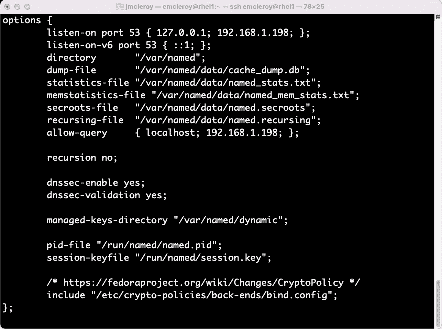

# 第九章：综合复习与模拟考试问题

在本章中，我们将回顾整个书籍中所学的内容。我们将通过模拟考试题目，帮助你熟悉考试中可能遇到的题型格式。我们将尽量覆盖根据 Red Hat 公开的考试目标可能出现在考试中的所有内容，详情请见：[`www.redhat.com/en/services/training/ex358-red-hat-certified-specialist-services-management-automation-exam?section=Objectives`](https://www.redhat.com/en/services/training/ex358-red-hat-certified-specialist-services-management-automation-exam?section=Objectives)。

本章的目标是帮助你充分准备考试，增强信心，并提供你通过考试所需的信息。我们将讨论一些直到现在本书中未涉及的内容，并在进行每个主题时进行详细解释。我们还将讨论如何手动完成每个问题的请求，并使用 Ansible 自动化完成这些任务。我们开始吧。

在本章中，我们将涵盖以下内容：

+   对所有考试目标的综合复习，以及模拟考试，帮助你测试新学到的技能

# 技术要求

我们将使用*第一章*中所用的系统配置，*块存储——学习如何在 Red Hat Enterprise Linux 上配置块存储*。我们将结合*第三章*中的附加**网络接口控制器**（**NICs**）配置，用于团队合作练习。该内容可以在*第三章*中找到，*链路聚合创建——创建你自己的链路并掌握网络领域*。这将使你能够像在考试环境中一样使用所有即将出现的问题。

## 设置 GitHub 访问权限

请参考*第一章*的说明，*块存储——学习如何在 Red Hat Enterprise Linux 上配置块存储*，以便访问本书的 GitHub 仓库。你可以在以下链接找到本章的 Ansible 自动化剧本：[`github.com/PacktPublishing/Red-Hat-Certified-Specialist-in-Services-Management-and-Automation-EX358-Exam-Guide/tree/main/Chapter09`](https://github.com/PacktPublishing/Red-Hat-Certified-Specialist-in-Services-Management-and-Automation-EX358-Exam-Guide/tree/main/Chapter09)。记住，这些是建议的剧本，并不是你实现目标的唯一方法。

你可以随时使用`raw`、`shell`或`cmd`来改变它们，以实现相同的结果，但我们演示的是完成目标的最佳方法。此外，请记住，我们没有使用 Ansible 未来版本中所需的 FCQN，因为在考试中不会支持它，考试是基于 Ansible 2.9 版本的。

# 对所有考试目标和模拟考试的全面复习，帮助你测试新学到的技能

我们将呈现一个结合了你在整本书中学到的技能的模拟考试。我们将根据你在考试中可能遇到的项目深入讨论细节。这将帮助你准备参加 EX358 考试。这些不是官方问题；否则，它们不会出现在本书中。相反，它们是你可能遇到的理论场景，具有不同的信息。请按照章节开头所述设置你的配置，然后记录下你的 IP 地址、系统名称等信息。这样，在考试时你可以快速获取所需的信息，以免被拖慢速度，因为你只有 4 个小时。

让我们开始考试吧。我们将从我的实验室的信息开始，给你一个如何为你的设置编写文档的概念：

```
Username: emcleroy
Password: redhat
Admin username: root
Admin password: redhat
Node1: rhel1.example.com 192.168.1.198
Node2: rhel2.example.com 192.168.1.133
Node3: rhel3.example.com 192.168.1.53   Ansible control node
```

你可以看到我已经获得了所需的信息。如果你配置了 DNS 或主机文件来使用主机名，那么你可以轻松连接到你的设备。这也使得在 Ansible 清单中使用清单文件变得稍微简单一些，因为你不需要添加 `ansible_host` 参数。为了我们的目的，我仍将在我的清单文件中使用 `ansible_host`。

另一个让一切变得更简单的方法是设置 RSA 密钥并在系统间共享它们，而不是使用密码。这个过程在*第一章*，*块存储—学习如何在红帽企业 Linux 上配置块存储*中也有展示。这样做使得运行 playbooks 更加容易，因为它们不需要使用 `-u emcleroy -k --ask-become` 这一命令部分来传递 SSH 和提升权限的密码。我们将使用带有额外参数的命令，以确保你理解如何在考试中使用完整命令（如果需要的话）。

在你按照要求设置好系统后，我们将开始模拟考试，并通过每个主题复习我们所学的内容。问题将按照红帽在目标页面上列出的顺序呈现，页面地址是：[`www.redhat.com/en/services/training/ex358-red-hat-certified-specialist-services-management-automation-exam?section=Objectives`](https://www.redhat.com/en/services/training/ex358-red-hat-certified-specialist-services-management-automation-exam?section=Objectives)。

问题如下。答案将直接跟在问题后面，但请尝试在不查看答案的情况下回答问题。我建议在查看答案之前先自己尝试回答这些问题。如果你感到卡住了，可以随时查看答案并阅读解决方案以刷新记忆。

## 管理网络服务

管理网络服务是我们考试的第一个目标，正如红帽所指出的那样。

首先，我们将设置网络接口的 IP 连通性。

*问题 1* – 对于这个问题，我们希望你为服务器上的网卡配置静态地址。使用 DHCP 分配的 IP 地址时，我们希望你更改为开始时所注明的静态 IP 地址。（这些地址会根据你的网络而有所不同）：

```
Rhel1 DHCP IP: 192.168.1.81
Rhel2 DHCP IP: 192.168.1.65
Rhel1 Static IP: 192.168.1.198
Rhel2 Static IP: 192.168.1.133
The subnet is 192.168.1.0/24
```

一旦这些设置为静态，你应该能够在这两者之间进行路由。

*答案 1* – 要手动设置静态 IP，我们需要通过 SSH 使用 DHCP 分配的 IP 地址连接到设备，然后将其修改为静态地址。

首先，我们将使用`nmtui`命令：


图 9.1 – NetworkManager TUI 初始显示

然后，我们将选择编辑连接，从那里你将看到可用的接口，如下图所示：


图 9.2 – NMTUI 接口选择

选择要更改的接口后，我们将继续进行设置，启用静态 IP，如下图所示：


图 9.3 – 为选定接口选择手动设置

然后，我们将配置所需的设置，例如静态 IP、网关和 DNS 服务器，如下图所示：


图 9.4 – 静态 IP、网关和 DNS 设置

保存这些设置后，我们需要重新启动网络接口，以便它切换到新配置的 IP。我们将使用以下命令来完成此操作：

```
[emcleroy@rhel1 ~]$ sudo systemctl restart NetworkManager
```

接下来，我们将测试以确保新地址可达，如下图所示，使用`ping`测试：


图 9.5 – IP ping 测试以确保连通性

接下来，我们将深入了解为之前配置的网络接口设置 IPv6 地址的配置。

*问题 2* – 对于这个问题，我们希望你为已经配置的网卡设置 IPv6 地址，同时保持 IPv4 连接：

```
Rhel1 IPv6: fc65:8956:7254:6321::a7/64
Rhel2 IPv6: fc65:8956:7254:6321::a8/64
Subnet: fc65:8956:7254:6321::/64
```

这些应该是可路由的，并且一旦更改完成，你应该也能保持 IPv4 的可路由连通性。

*答案 2* – 我们将使用`nmtui`命令来设置此项：


图 9.6 – NMTUI 网络菜单

在启动`nmtui`菜单后，我们将选择编辑连接，这会将你带到以下截图所示的菜单：


图 9.7 – NMTUI 接口选择界面

在选择正确的接口后——在我们的情况下是**enp0s3**，但在你的设置中，可能会有所不同——我们将能够进行配置更改，如下图所示：


图 9.8 – NMTUI 接口配置设置

选择**手动**配置**IPv6 配置**后，我们可以编辑 IPv6 地址和网关的值，具体如下截图所示：


图 9.9 – IPv6 接口设置

配置设置完成后，我们将保存配置。为了使更改生效，我们需要运行以下命令来刷新连接：

```
[emcleroy@rhel1 ~]$ sudo systemctl restart NetworkManager
```

在两个服务器配置完成后，我们可以运行 IPv6 `ping` 测试，检查两端接口的连通性，具体如下截图所示：


图 9.10 – IPv6 ping 测试

我们已经展示了解决配置网络问题的一种方法。接下来，我们将处理防火墙服务。

## 管理防火墙服务

在本节中，我们将讨论如何设置防火墙规则。我们将讨论 rich 规则以及其他可能阻止特定连接并允许尚未允许的网络流量的项。

*问题 1* – 对于此问题，我们希望您允许通过防火墙访问服务和端口。这将允许连接到可能在您的生产服务器上运行的 Web 服务。请打开以下访问权限：

```
Services: http and https
```

请手动执行此操作，并在 Ansible 自动化剧本中进行设置。

*答案 1* – 我们将使用以下命令设置防火墙，允许连接到这些服务：


图 9.11 – 用于允许服务连接的防火墙命令

设置`firewalld`服务的 Ansible 剧本如下：

```
- name: firewalld configuration
  hosts: all
  become: true
  become_method: sudo
  tasks:
    - name: Enable Firewalld services
      firewalld:
        permanent: yes
        immediate: yes
        service: "{{ item }}"
        state: enabled
      loop:
        - http
        - https
    - name: Reload firewall
      command:
        cmd: firewall-cmd --reload
    - name: Show open services and ports
      command:
        cmd: firewall-cmd --list-all
```

请参见以下截图，参考您的清单：


图 9.12 – 所有实验室的剧本清单

在我们使用`ansible-playbook -i inventory firewalld.yml -u emcleroy -k --ask-become -v`设置并运行剧本后，屏幕截图中将显示以下输出：


图 9.13 – 成功完成 Ansible 剧本

*问题 2* – 对于这个问题，我们希望您通过`192.168.1.0`/`24`网络域提供 HTTP 访问，但阻止通过`172.16.1.0/24`网络域的访问。

请手动执行此操作，并在 Ansible 自动化剧本中进行设置。

*答案 2* – 我们将使用`firewall-cmd`的 rich 规则来完成这一更改。我们将使用以下命令成功完成此操作：

```
[emcleroy@rhel1 ~]$ sudo firewall-cmd --permanent --add-rich-rule='rule family=ipv4 source address=192.168.1.0/24 service name=http accept'
success
[emcleroy@rhel1 ~]$ sudo firewall-cmd --permanent --add-rich-rule='rule family=ipv4 source address=172.16.1.0/24 service name=http reject'
success
[emcleroy@rhel1 ~]$ sudo firewall-cmd --list-rich-rules
rule family="ipv4" source address="192.168.1.0/24" service name="http" accept
rule family="ipv4" source address="172.16.1.0/24" service name="http" reject
[emcleroy@rhel1 ~]$ sudo firewall-cmd --reload
success
```

现在，让我们创建一个 Ansible 剧本，执行相同的防火墙规则更改，见以下剧本：

```
- name: Firewalld Rich Rule
  hosts: all
  become: true
  become_method: sudo
  tasks:
    - name: Set rich rules up on firewall
      firewalld:
        permanent: yes
        immediate: yes
        rich_rule: "{{ item }}"
        state: enabled
      loop:
       - 'rule family=ipv4 source address=192.168.1.0/24 service name="http"  accept'
       - 'rule family=ipv4 source address=172.16.1.0/24 service name="http" reject'
    - name: Show rich rules
      command:
        cmd: firewall-cmd --list-rich-rules
    - name: Reload firewall
      command:
        cmd: firewall-cmd --reload
```

在我们使用`ansible-playbook -i inventory richrule.yml -u emcleroy -k –ask-become -v`运行 playbook 后，我们将看到以下截图中的输出：


图 9.14 – 成功完成 Ansible playbook 的输出

## 管理 SELinux

在本节中，我们将致力于解决在创建文件和文件夹时的 SELinux 问题，以确保没有权限问题。

*问题 1* – 对于这个问题，我们希望你在根目录创建一个文件夹和一个文本文件，然后修复 SELinux 上下文，确保权限正确：

```
Folder: /srv/test
File: /srv/test/text.txt
File body: Testing SELinux contexts.
```

请手动执行此操作，并且将其设置在 Ansible 自动化 playbook 中。

*答案 1* – 我们将使用以下命令成功创建并解决任何 SELinux 上下文问题：

```
[emcleroy@rhel1 ~]$ sudo mkdir /srv/test
[emcleroy@rhel1 ~]$ sudo vi /srv/test/text.txt
[emcleroy@rhel1 ~]$ restorecon -Rv /srv/test
[emcleroy@rhel1 ~]$ ls -lZ /srv/test
total 4
-rw-r--r--. 1 root root unconfined_u:object_r:var_t:s0 33 Oct  8 09:16 text.txt
```

接下来，我们将使用 Ansible playbook 完成此操作，如下所示：

```
- name: SELinux training
  hosts: all
  become: true
  become_method: sudo
  tasks:
    - name: Create directory
      file:
        path: /srv/test
        state: directory
        mode: '0755'
    - name: Create a file in the directory
      copy:
        dest: "/srv/test/text.txt"
        content: |
          Thank you for reading my book!!!
    - name: Restore any SELinux issues if they exist
      command:
        cmd: restorecon -Rv /srv/test
    - name: View attributes
      command:
        cmd: ls -lZ /srv/test
```

创建完 Ansible playbook 后，我们将使用以下命令运行它：`ansible-playbook -i inventory selinux.yml -u emcleroy -k --ask-become -v`。你可以在以下截图中看到运行结果：


图 9.15 – 成功运行 Ansible 自动化 playbook 的输出

本节中我们学习了如何通过简单易记的命令解决 SELinux 在处理文件和文件夹时的问题，这些命令应该可以解决你在考试中遇到的问题。接下来，我们将展示如何控制在服务器上运行的系统进程。

## 管理系统进程

在本节中，我们将启动并启用服务。我们还将安装所需的包，以便启动和启用尚未运行的服务。我们以`postgresql`为例，但这适用于所有你安装的服务，如 DHCP、DNS 和 SMB。

*问题 1* – 对于这个问题，我们希望你在`rhel1`上安装`postgresql`并启动和启用它。

请手动执行此操作，并且将其设置在 Ansible 自动化 playbook 中。

*答案 1* – 我们将使用以下命令在`rhel1`上安装、启用并启动`postgresql`：

```
[emcleroy@rhel1 ~]$ sudo dnf install @postgresql
[emcleroy@rhel1 ~]$ sudo systemctl enable postgresql
[emcleroy@rhel1 ~]$ sudo postgresql-setup --initdb
 * Initializing database in '/var/lib/pgsql/data'
 * Initialized, logs are in /var/lib/pgsql/initdb_postgresql.log
[emcleroy@rhel1 ~]$ sudo systemctl start postgresql
```

在我们手动完成`postgresql`的安装和启动后，需要卸载`postgresql`，以便 Ansible 可以重新安装它。我们将使用以下命令从`rhel1`中删除`postgresql`：

```
sudo dnf remove @postgresql
```

一旦`postgresql`被移除，我们将设置一个 Ansible playbook，按照以下步骤安装、启用并启动`postgresql`服务：

```
- name: Install package, enable and start it.
  hosts: rhel1.example.com
  become: true
  become_method: sudo
  tasks:
    - name: Install postgresql
      command:
        cmd: "dnf install @postgresql -y"
    - name: Initialize the database
      command:
        cmd: postgresql-setup --initdb
      ignore_errors: true
    - name: Enable and start postgresql service
      service:
        name: postgresql
        state: started
        enabled: true
    - name: Check to ensure service is started
      command:
        cmd: systemctl status postgresql
```

我们在初始化步骤中添加了`ignore_errors`，这是因为可能出现一些不影响启动或启用服务的失败。

完成 playbook 编写后，我们将使用`ansible-playbook -i inventory postgresql.yml -u emcleroy -k --ask-become -v`命令运行它。运行 playbook 的结果如下面的截图所示：


图 9.16 – 成功运行 postgresql playbook

在本节中，我们学习了如何使用`postgresql`服务为例安装、启动和启用服务。这些命令可以用于你在 RHEL 8.1 系统上安装的所有服务。在下一节中，我们将深入探讨网络团队配置。

## 管理链路聚合

在本节中，我们将设置网络团队：

*问题 1* —— 对于这个问题，我们希望你在设置过程中为额外的网卡配置网络团队：

```
Rhel1 IPv4: 192.168.1.225
Rhel2 IPv4: 192.168.1.226
```

我的设置中，网卡是**enp0s8**和**enp0s9**——你的设置可能会有所不同，具体取决于你的配置。将连接设置为循环轮询（round-robin）方式。设置完成后，你应该能够通过这些 IP 连接到每台服务器。无论两个网卡都正常工作，还是其中一个网卡发生故障，你都应该能与网络团队保持连接。你的主 SSH IP 应该始终保持连接。

请手动完成此操作，并将其也设置为 Ansible 自动化的 playbook。

*答案 1* —— 我们将使用以下命令在两台系统上设置团队。请确保为每台服务器使用正确的 IPv4 地址：

```
[emcleroy@rhel1 ~]$ sudo nmcli con add type team con-name team1 ifname team1 team.runner roundrobin
Connection 'team1' (58770e3c-89bf-4a87-9b26-e9ad581ef978) successfully added.
[emcleroy@rhel1 ~]$ sudo nmcli con add type ethernet slave-type team con-name team1-enp0s8 ifname enp0s8 master team1
Connection 'team1-enp0s8' (3886d9f8-2db6-4269-9d9b-2973b24f74ce) successfully added.
[emcleroy@rhel1 ~]$ sudo nmcli con add type ethernet slave-type team con-name team1-enp0s9 ifname enp0s9 master team1
Connection 'team1-enp0s9' (d845c4e1-b354-4c58-904d-f9cf0c3d1e59) successfully added.
[emcleroy@rhel1 ~]$ sudo nmcli con mod team1 ipv4.addresses 192.168.1.225/24
[emcleroy@rhel1 ~]$ sudo nmcli con mod team1 ipv4.method manual
[emcleroy@rhel1 ~]$ sudo ifdown team1
Connection 'team1' successfully deactivated (D-Bus active path: /org/freedesktop/NetworkManager/ActiveConnection/2)
[emcleroy@rhel1 ~]$ sudo ifup team1
Connection successfully activated (master waiting for slaves) (D-Bus active path: /org/freedesktop/NetworkManager/ActiveConnection/5)
[emcleroy@rhel1 ~]$ ifconfig
team1: flags=4163<UP,BROADCAST,RUNNING,MULTICAST>  mtu 1500
        inet 192.168.1.225  netmask 255.255.255.0  broadcast 192.168.1.255
        inet6 fe80::4036:4e32:d1af:fd0a  prefixlen 64  scopeid 0x20<link>
        ether 08:00:27:ad:b3:d8  txqueuelen 1000  (Ethernet)
        RX packets 159  bytes 8184 (7.9 KiB)
        RX errors 0  dropped 30  overruns 0  frame 0
        TX packets 8  bytes 688 (688.0 B)
        TX errors 0  dropped 0 overruns 0  carrier 0  collisions 0
```

现在，重复相同的过程为`Rhel2`。完成后，你应该有一个正常运行的`team1`接口，并且使用`roundrobin`方式进行连接。你可以使用`ping`命令测试接口，如下图所示：


图 9.17 – ping 测试，确保连接到新设置的团队

手动完成团队创建后，我们将设置一个 Ansible playbook，如下所示，用于创建团队：

```
- name: Create a network team
  hosts: rhel1.example.com, rhel2.example.com
  become: true
  become_method: sudo
  tasks:
    - name: Create network team
      command:
        cmd: nmcli con add type team con-name team1 ifname team1 team.runner roundrobin
    - name: Add slave interfaces
      command:
        cmd: 'nmcli con add type ethernet slave-type team con-name team1-"{{ item }}" ifname "{{ item }}" master team1'
      loop:
        - enp0s8
        - enp0s9
    - name: Add Static IP to team1
      command:
        cmd: nmcli con mod team1 ipv4.addresses "{{ team_ip }}"
    - name: Add interface method
      command:
        cmd: nmcli con mod team1 ipv4.method manual
```

然后，我们将向库存中添加主机变量，以便每台服务器都能获得正确的 IP，如下图所示：


图 9.18 – 更新后的库存文件，包含主机变量

创建完 playbook 后，我们可以使用`ansible-playbook -i inventory networkteam.yml -u emcleroy -k --ask-become -v`命令运行它——部分输出如下图所示：


图 9.19 – 成功的网络团队 playbook 运行

在本节中，我们学习了如何将网络接口组合在一起，以提供多个网卡的冗余。接下来的章节中，我们将设置和管理 DNS 服务。

## 管理 DNS

在本节中，我们将设置一个 DNS 服务器。

*问题 1* —— 对于这个问题，我们希望你设置一个 DNS 服务器。我们希望你为 IPv4 添加正向和反向记录。我们将在`rhel1.example.com`上设置 DNS 服务器。

正向和反向（即 PTR）记录将使用以下信息：

```
rhel1.example.com – 192.168.1.198
rhel2.example.com – 192.168.1.133
rhel3.example.com – 192.168.1.53
```

*答案 1* —— 我们将首先安装`bind`包：

```
[emcleroy@rhel1 ~]$ sudo dnf install bind -y
```

接下来，我们将设置防火墙规则，以允许连接并传递 DNS 记录：

```
[emcleroy@rhel1 ~]$ sudo firewall-cmd --permanent --add-service=dns
success
[emcleroy@rhel1 ~]$ sudo firewall-cmd --reload
Success
```

从安装软件包到设置防火墙规则，我们现在将配置 DNS 文件`/etc/named.conf`。该文件应该像以下截图所示：



图 9.20 – 配置示例设置

确保在配置文件中包含新的区域，如下截图所示：


图 9.21 – 配置文件中的区域信息

接下来，我们需要在`/var/named`目录中创建区域文件。这些文件将包括`192.168.1.zone`和`example.com.zone`的正向和反向区域记录。我们可以在以下截图中看到每个文件的示例：


图 9.22 – DNS 区域文件设置

在设置完正向区域后，我们将设置反向区域，如以下截图所示：


图 9.23 – 反向区域文件

接下来，我们将启动并启用`bind`包安装的`named`服务，用于运行 DNS 服务器：

```
[root@rhel1 named]# systemctl enable named
Created symlink /etc/systemd/system/multi-user.target.wants/named.service → /usr/lib/systemd/system/named.service.
[root@rhel1 named]# systemctl start named
```

然后，我们将进行查找，以确保获取到正确的地址：

```
[root@rhel1 named]# nslookup rhel2.example.com 192.168.1.198
Server:          192.168.1.198
Address:  192.168.1.198#53
Name: rhel2.example.com
Address: 192.168.1.133
```

接下来，我们将使用 Ansible 自动化通过以下剧本和模板进行安装：

```
---
- name: Install and configure DNS
  hosts: rhel1.example.com
  become: true
  become_method: sudo
  tasks:
    - name: Install DNS server
      package:
        name: bind
        state: latest
    - name: Move bind configuration to named.conf
      template:
        src: "{{ playbook_dir }}/named.conf.j2"
        dest: "/etc/named.conf"
    - name: Move example.com.zone and 192.168.1.zone to /var/named
      template:
        src: "{{ playbook_dir}}/{{ item }}.j2"
        dest: "/var/named/{{ item }}"
      loop:
        - 'example.com.zone'
        - '192.168.1.zone'
    - name: Set firewall rules
      firewalld:
        service: dns
        permanent: true
        state: enabled
    - name: Reload firewall
      command:
        cmd: firewall-cmd --reload
    - name: Start and enable the DNS service
      service:
        name: named
        state: restarted
        enabled: true
```

以下是需要在剧本执行过程中成功修改配置文件的模板。首先是`named.conf.j2`配置文件：

```
//
// named.conf
//
// Provided by Red Hat bind package to configure the ISC BIND named(8) DNS
// server as a caching only nameserver (as a localhost DNS resolver only).
//
// See /usr/share/doc/bind*/sample/ for example named configuration files.
//
options {
     listen-on port 53 { 127.0.0.1; 192.168.1.198; };
     listen-on-v6 port 53 { ::1; };
     directory  "/var/named";
     dump-file  "/var/named/data/cache_dump.db";
     statistics-file "/var/named/data/named_stats.txt";
     memstatistics-file "/var/named/data/named_mem_stats.txt";
     secroots-file   "/var/named/data/named.secroots";
     recursing-file  "/var/named/data/named.recursing";
     allow-query     { localhost; 192.168.1.198; };
     recursion no;
     dnssec-enable yes;
     dnssec-validation yes;
     managed-keys-directory "/var/named/dynamic";
     pid-file "/run/named/named.pid";
     session-keyfile "/run/named/session.key";
     /* https://fedoraproject.org/wiki/Changes/CryptoPolicy */
     include "/etc/crypto-policies/back-ends/bind.config";
};
logging {
        channel default_debug {
                file "data/named.run";
                severity dynamic;
        };
};
zone "example.com" IN {
        type master;
        file "example.com.zone";
        forwarders {};
};
zone "192.168.1.in-addr.arpa" IN {
        type master;
        file "192.168.1.zone";
        forwarders {};
};
zone "." IN {
     type hint;
     file "named.ca";
};
include "/etc/named.rfc1912.zones";
include "/etc/named.root.key";
```

然后，我们需要提供 DNS 记录的区域文件。首先是`example.com.zone.j2`文件：

```
$TTL 3H
@       IN SOA rhel1.example.com. admin.example.com (
2; serial
65; refresh
75; retry
8000; expire
60) ; minimum
        NS      rhel1
        A       127.0.0.1
        AAAA    ::1
rhel1        IN  A 192.168.1.198
rhel2        IN  A 192.168.1.133
rhel3        IN  A 192.168.1.53
```

最后，我们将为**指针记录**（**PTR**）记录添加`192.168.1.zone.j2`，也就是反向查找区域文件：

```
$TTL 3H
@       IN SOA rhel1.example.com. admin.example.com. (
                                        2       ; serial
                                        8000      ; refresh
                                        9000      ; retry
                                        10000      ; expire
                                        5000)    ; minimum
        NS      rhel1.example.com.
198        IN  PTR  rhel1.example.com.
133        IN  PTR  rhel2.example.com.
53         IN  PTR  rhel3.example.com.
```

在创建完剧本后，我们运行命令`ansible-playbook -i /home/emcleroy/playbooks/inventory dns.yml -u emcleroy -k --ask-become -v`，并可以在以下截图中看到成功的输出：


图 9.24 – 通过 Ansible 自动化成功部署 DNS 服务器

## 管理 DHCP

在本节中，我们将设置一个 DHCP 服务器。

*问题 1* – 对于这个问题，我们希望你在`rhel1.example.com`上设置一个 DHCP 服务器，服务`192.168.1.0`/`24`子网，提供可用的 IP 范围`192.168.1.100` – `192.168.1.220`。DNS 服务器是`192.168.1.198`或你的`rhel1.example.com` IP 地址。我们希望以下静态条目：

```
rhel4.example.com MAC Address: 08:00:27:AB:81:10 IP: 192.168.1.120
rhel5.example.com MAC Address: 08:00:27:AB:81:11 IP: 192.168.1.121
```

*答案 1* – 我们将首先安装`dhcp-server`软件包，如下所示：

```
[emcleroy@rhel1 ~]$ sudo dnf install dhcp-server -y
```

接下来，我们将设置`dhcp`文件，以便在`/etc/dhcp/dhcpd.conf`中提供 IP 范围，如以下截图所示：


图 9.25 – DHCP 服务器配置文件

请记住，无需记住所有行，因为安装后提供了一个示例，您可以在此找到：`/usr/share/doc/dhcp-server/dhcpd.conf.example`。设置完 DHCP 配置文件后，我们将开放防火墙规则，并启动和启用服务器上的`dhcp`服务：

```
[emcleroy@rhel1 ~]$ sudo firewall-cmd --permanent --add-service=dhcp
[emcleroy@rhel1 ~]$ firewall-cmd –reload
[emcleroy@rhel1 ~]$ sudo systemctl start dhcpd
[emcleroy@rhel1 ~]$ sudo systemctl enable dhcpd
Created symlink /etc/systemd/system/multi-user.target.wants/dhcpd.service → /usr/lib/systemd/system/dhcpd.service.
```

现在，让我们使用 Ansible 自动化设置 DHCP 服务器。我们将从以下 playbook 开始：

```
---
- name: Install and configure DHCP
  hosts: rhel1.example.com
  become: true
  become_method: sudo
  tasks:
    - name: Install dhcp server
      package:
        name: dhcp-server
        state: latest
    - name: Copy the dhcpd.conf file to the server
      template:
        src: "{{ playbook_dir }}/dhcpd.conf.j2"
        dest: /etc/dhcp/dhcpd.conf
    - name: Open firewall rules
      firewalld:
        service: dhcp
        permanent: true
        state: enabled
    - name: Reload firewall rules
      command:
        cmd: firewall-cmd --reload
    - name: Start and enable dhcp server
      service:
        name: dhcpd
        enabled: true
        state: restarted
```

以下代码显示`dhcpd.conf.j2`文件的内容：

```
#
# DHCP Server Configuration file.
#   see /usr/share/doc/dhcp-server/dhcpd.conf.example
#   see dhcpd.conf(5) man page
#
authoritative;
subnet 192.168.1.0 netmask 255.255.255.0 {
  range 192.168.1.100 192.168.1.220;
  option broadcast-address 192.168.1.255;
  option domain-name-servers 192.168.1.198;
}
host rhel4 {
  hardware ethernet 08:00:27:AB:81:10;
  fixed-address 192.168.1.120;
}
host rhel5 {
  hardware ethernet 08:00:27:AB:81:11;
  fixed-address 192.168.1.121;
}
```

创建完 playbook 后，我们可以使用`ansible-playbook -i inventory dhcp.yml -u emcleroy -k --ask-become -v`命令成功运行 Ansible playbook，如下截图所示：


图 9.26 – 成功的 DHCP 服务器 playbook 运行

本节中，我们学习了如何设置 DHCP 服务器，包括配置文件中的静态条目。在下一节中，我们将处理您在家或工作中的网络打印机。

## 打印机管理

本节中，我们将管理网络打印机。

*问题 1* – 对于这个问题，我们希望您在`rhel1.example.com`上设置一个网络打印机。请设置一个名为`myqueue`的打印队列。如果您有网络打印机，您可以进行测试。如果没有，您将无法测试该解决方案/答案。

*答案 1* – 我们将从在系统上安装`cups`开始：

```
[emcleroy@rhel1 ~]$ sudo dnf install cups -y
```

然后，我们将启用并启动`cups`打印服务：

```
[emcleroy@rhel1 ~]$ sudo systemctl enable cups
[emcleroy@rhel1 ~]$ sudo systemctl start cups
```

接下来，我们将允许`mdns`防火墙规则，允许访问打印服务：

```
[emcleroy@rhel1 ~]$ sudo firewall-cmd --permanent --add-service=mdns
success
[emcleroy@rhel1 ~]$ sudo firewall-cmd --reload
success
```

我们将使用`ippfind`命令查找可用的打印机。以我为例，我将使用`Brother`：

```
[emcleroy@rhel1 ~]$ ippfind -T 5
ipp://BRW9C305BC2B044.local:631/ipp/print
ipp://BRW9C305BC2B044.local:631/ipp/print
```

接下来，我们将使用`ipp`地址创建打印队列`myqueue`，并将打印机添加到队列中：

```
[emcleroy@rhel1 ~]$ lpadmin -p myqueue -v ipp://BRW9C305BC2B044.local:631/ipp/print -m everywhere -E
```

如果遇到`lpadmin: Unable to connect to "BRW9C305BC2B044.local:631": Name or service not known`错误，请确保您的 DNS 能够解析该本地地址。如果不能，请在`/etc/hosts`文件中添加主机记录，将短名称或 URL 映射到 IP 地址。

最后，我们将设置打印的默认队列目标：

```
[emcleroy@rhel1 ~]$ lpadmin -d myqueue
```

接下来，我们将使用以下 playbook 通过 Ansible 自动化设置打印机：

```
---
- name: Install cups, print queue, and printer
  hosts: rhel1.example.com
  become: true
  become_method: sudo
  tasks:
    - name: Install cups
      package:
        name: cups
        state: latest
    - name: Enable firewall rules
      firewalld:
        permanent: true
        state: enabled
        service: mdns
    - name: Reload Firewall
      command:
        cmd: firewall-cmd --reload
    - name: Start and enable cups
      service:
        name: cups
        state: started
        enabled: true
    - name: Create print queue
      command:
        cmd: lpadmin -p myqueue -v ipp://BRW9C305BC2B044.local:631/ipp/print -m everywhere -E
    - name: Set default print destination
      command:
        cmd: lpadmin -d myqueue
```

创建完 playbook 后，我们可以使用`ansible-playbook -i inventory cups.yml -u emcleroy -k --ask-become -v`命令成功运行 Ansible playbook，如下截图所示：


图 9.27 – 成功的 cups playbook 运行

本节中，我们学习了如何连接到可用的网络打印机，供日常工作使用。在下一节中，我们将向您展示如何在服务器上设置电子邮件服务。

## 电子邮件服务管理

本节中，我们将在服务器上创建电子邮件服务。

*问题 1* – 对于此问题，我们希望你在`rhel1.example.com`上创建一个空客户端。我们希望所有本地递送的邮件都能转发到`rhel2.example.com`，并正常送达邮件服务：

```
myorigin: example.com
relayhost: rhel2.example.com
```

*答案 1* – 我们将首先安装`postfix`，然后设置问题中提到的正确参数，确保邮件服务器不接受外部或内部邮件：

```
[root@rhel1 ~]# sudo dnf install postfix -y
[root@rhel1 ~]# sudo postconf -e "inet_interfaces = loopback-only"
[root@rhel1 ~]# sudo postconf -e "myorigin = example.com"
[root@rhel1 ~]# sudo postconf -e "inet_protocols = ipv4"
[root@rhel1 ~]# sudo postconf -e "mydestination ="
[root@rhel1 ~]# sudo postconf -e "mynetworks = 127.0.0.0/8"
[root@rhel1 ~]# sudo postconf -e "local_transport = error: no local delivery"
[root@rhel1 ~]# sudo postconf -e "relayhost = [rhel2.example.com]"
[root@rhel1 ~]# sudo systemctl start postfix
[root@rhel1 ~]# sudo systemctl enable postfix
Created symlink /etc/systemd/system/multi-user.target.wants/postfix.service → /usr/lib/systemd/system/postfix.service.
```

请记住，如果考试要求你为 IPv6 进行设置，请确保同时为 IPv4 和 IPv6 设置`inet_protocols`。

接下来，我们将创建一个 Ansible 剧本来完成这个过程：

```
 ---
- name: Configure Null Client Email Service
  become: true
  hosts: rhel1.example.com
  vars:
    postfix_conf:
      relayhost: "[??.example.com]"
      inet_interfaces: "loopback-only"
      mynetworks: "127.0.0.0/8"
      myorigin: "example.com"
      mydestination: ""
  roles:
    - linux-system-roles.postfix
```

在我们创建剧本后，我们将使用`ansible-playbook -i inventory email.yml -u emcleroy -k --ask-become -v`命令，并成功运行 Ansible 剧本，如下图所示：


图 9.28 – 成功运行的 Ansible 剧本，用于邮件服务

在本节中，我们向你展示了如何修改邮件服务，并提供了设置空客户端配置的示例。在下一节中，我们将讨论 MariaDB 配置和管理。

## 管理 MariaDB 数据库服务器

在本节中，我们将安装 MariaDB，添加表，备份，恢复之前存储在列和表中的内容，并搜索数据库。

*问题 1* – 对于此问题，我们将安装并安全设置 MariaDB，使得`root`只能本地访问，并且`root`的密码是`redhat`。我们还将执行以下操作：

+   创建一个名为`available_stock`的数据库

+   创建用户`fred`，设置密码`redhat`，并赋予其在数据库清单上的完全用户权限

+   创建数据库清单的备份

+   恢复数据库清单的备份

*答案 1* – 我们将首先安装`mariadb`服务器，启动并启用它，然后进行安全安装：

```
[emcleroy@rhel1 ~]$ sudo dnf install @mariadb -y
[root@rhel1 ~]# systemctl start mariadb
[root@rhel1 ~]# systemctl enable mariadb
Created symlink /etc/systemd/system/mysql.service → /usr/lib/systemd/system/mariadb.service.
Created symlink /etc/systemd/system/mysqld.service → /usr/lib/systemd/system/mariadb.service.
Created symlink /etc/systemd/system/multi-user.target.wants/mariadb.service → /usr/lib/systemd/system/mariadb.service.
[root@rhel1 ~]# mysql_secure_installation
```

我们将在安全安装过程中选择仅允许本地的`root`用户。我们将选择删除测试数据库，并在此时为`root`设置密码。

在启动 MariaDB 并进行安全安装后，我们将登录并创建数据库和用户：

```
[root@rhel1 ~]# mysql -u root -p
MariaDB [(none)]> CREATE DATABASE available_stock;
Query OK, 1 row affected (0.000 sec)
MariaDB [(none)]> USE  available_stock;
Database changed
MariaDB [available_stock]> CREATE USER fred@localhost identified by 'redhat';
Query OK, 0 rows affected (0.000 sec)
MariaDB [available_stock]> GRANT INSERT, UPDATE, DELETE, SELECT on available_stock.* to fred@localhost;
Query OK, 0 rows affected (0.000 sec)
```

接下来，我们将备份数据库：

```
[root@rhel1 ~]# mysqldump available_stock -u root -p
> test.dump
Finally, to restore the dump we are going to simply change the direction of the symbol:
[root@rhel1 ~]# mysqldump -u root -p available_stock
< test.dump
```

对于 Ansible 剧本，我们将对其进行修改，并以稍有不同的方式，仅设置数据库。我们将通过如下所示的 Ansible 自动化剧本来设置 MariaDB 数据库：

```
---
- name: MariaDB install and configuration
  hosts: rhel2.example.com
  become: true
  become_method: sudo
  tasks:
    - name: Install MariaDB server
      package:
        name: '@mariadb:10.3/server'
        state: present
    - name: Install MariaDB client
      package:
        name: mariadb
        state: latest
    - name: Start and enable MariaDB
      service:
        name: mariadb
        state: started
        enabled: true
    - name: Open firewall rules for MariaDB
      firewalld:
        service: mysql
        permanent: true
        state: enabled
    - name: Reload firewall
      command:
        cmd: firewall-cmd --reload
    - name: Set root password for MariaDB
      mysql_user:
        name: root
        host_all: true
        update_password: always
        password: redhat
      no_log: true
      ignore_errors: true
```

在我们完成创建剧本之后，我们将运行`ansible-playbook -i inventory mariadb.yml -u emcleroy -k --ask-become -v`命令，并在以下截图中查看剧本的成功输出：


图 9.29 – 成功运行的 MariaDB 剧本

本节我们学习了如何配置 MariaDB，包括为数据库设置用户。下一节将介绍如何设置 Web 服务器。

## 管理 Web 访问

在本节中，我们将使用 Apache 设置 Web 主机。

*问题 1* – 对于这个问题，您需要设置一个 Apache 网络主机，通过端口 `80` 在浏览器中显示 `rhel1.example.com` 服务器。

*答案 1* – 我们将首先通过以下命令在 `rhel1.example.com` 服务器上安装 Apache，使用 `httpd` 包：

```
[emcleroy@rhel1 ~]$ sudo dnf install httpd -y
```

在 `httpd` 安装成功后，我们将在默认的网页位置 `/var/www/html/index.html` 创建 `index.html` 文件。使用您喜欢的文本编辑器，创建文件并写入 **此服务器正在 Apache 上运行!!!**。创建文件后，我们将启动并启用服务，如下命令所示：

```
[emcleroy@rhel1 html]$ sudo systemctl enable httpd
[emcleroy@rhel1 html]$ sudo systemctl start httpd
```

在启动并启用服务后，我们需要打开防火墙规则，以便通过 HTTP 进行连接，使用以下命令：

```
[emcleroy@rhel1 html]$ sudo firewall-cmd --permanent --add-service=http
success
[emcleroy@rhel1 html]$ sudo firewall-cmd --reload
Success
```

一旦我们打开防火墙规则，就可以通过浏览器访问网页来确认是否成功。以下截图展示了成功部署 Apache `httpd`：


图 9.30 – 成功的网络主机正在提供 index.html 文件

现在，我们将通过 Ansible 自动化设置 Apache `httpd`，使用以下 playbook：

```
---
- name: Install and configure apache
  hosts: rhel1.example.com
  become: true
  become_method: sudo
  tasks:
    - name: Install apache httpd
      package:
        name: httpd
        state: latest
    - name: Ensure default directory exists
      file:
        path: /var/www/html
        state: directory
        recurse: yes
    - name: Copy index template
      template:
        src: "{{ playbook_dir }}/index.html.j2"
        dest: /var/www/html/index.html
    - name: Restore SELinux contexts
      sefcontext:
        target: /var/www/html
        setype: httpd_sys_content_t
        state: present
    - name: Open firewall rules
      command:
        cmd: firewall-cmd –permanent –add-service=http
    - name: Reload firewall
      command:
        cmd: firewall-cmd --reload
    - name: Start and enable apache httpd service
      service:
        name: httpd
        state: restarted
        enabled: true
```

请确保 `index.html.j2` 位于您的 playbook 目录中，以便成功复制。

我们将使用以下命令运行 playbook：

```
ansible-playbook -i inventory apache_server.yml -u emcleroy -k --ask-become -v
```

本节中，我们设置了 Web 服务器访问。下一节将介绍如何使用 NFS 文件共享。

## 管理 NFS

本节将介绍 NFS。

*问题 1* – 对于这个问题，您需要在 `rhel1.example.com` 上创建一个 NFS 导出，将 `/test` 文件夹以只读权限导出到 `192.168.1.0/24` 网络，并且对 `172.16.1.0/24` 网络没有访问权限。

*问题 2* – 对于这个问题，您需要将 `rhel1.example.com` 上的 `/test` 挂载到 `rhel2.example.com` 的 `/mnt/test` 目录下，并确保它在启动时自动挂载。

*答案 1* – 我们将首先使用以下命令安装 `nfs-utils`：

```
[emcleroy@rhel1 ~]$ sudo dnf install nfs-utils
```

安装 `nfs-utils` 后，我们需要启用并启动服务。然后，我们将使用以下命令确保它正在运行：

```
[emcleroy@rhel1 ~]$ sudo systemctl enable nfs-server
Created symlink /etc/systemd/system/multi-user.target.wants/nfs-server.service → /usr/lib/systemd/system/nfs-server.service.
[emcleroy@rhel1 ~]$ sudo systemctl start nfs-server
[emcleroy@rhel1 ~]$ sudo systemctl status nfs-server
● nfs-server.service - NFS server and services
   Loaded: loaded (/usr/lib/systemd/system/nfs-server.service; enabled; vendor >
   Active: active (exited) since Thu 2022-10-27 12:33:28 EDT; 10s ago
  Process: 71257 ExecStart=/bin/sh -c if systemctl -q is-active gssproxy; then >
  Process: 71245 ExecStart=/usr/sbin/rpc.nfsd (code=exited, status=0/SUCCESS)
  Process: 71244 ExecStartPre=/usr/sbin/exportfs -r (code=exited, status=0/SUCC>
 Main PID: 71257 (code=exited, status=0/SUCCESS)
Oct 27 12:33:28 rhel1.example.com systemd[1]: Starting NFS server and services.>
Oct 27 12:33:28 rhel1.example.com systemd[1]: Started NFS server and services.
lines 1-10/10 (END)
```

然后，我们将使用以下命令创建 `/test` 目录：

```
[emcleroy@rhel1 ~]$ sudo mkdir /test
```

之后，我们将把文件夹添加到 `/etc/exports` 文件中，以便以适当的权限导出它，允许来自 `192.168.1.0/24` 域的访问，并默认阻止来自其他网络的访问，具体如以下截图所示：


图 9.31 – 用于 NFS 共享的 exports 文件

在我们将文件夹添加到`exports`列表后，我们将使用以下命令暴露 NFS 共享：

```
[emcleroy@rhel1 /]$ sudo exportfs -rav
exporting 192.168.1.0/24:/test
```

然后，我们将打开防火墙规则，以允许 NFS 服务向外部世界提供服务，使用以下命令：

```
[emcleroy@rhel1 /]$ sudo firewall-cmd --permanent --add-service=nfs
success
[emcleroy@rhel1 /]$ sudo firewall-cmd --reload
success
```

对于 Ansible 解决方案，我们将创建以下 playbook 来完成这些手动任务的自动化版本：

```
---
- name: Configure nfs and share folder deployment
  hosts: rhel1.example.com
  become: true
  become_method: sudo
  tasks:
    - name: Install nfs-utils
      package:
        name: nfs-utils
        state: present
    - name: Start and enable nfs-server
      service:
        name: nfs-server
        state: started
        enabled: true
    - name: Firewall rules for nfs-server
      firewalld:
        service: nfs
        permanent: true
        state: enabled
    - name: Reload firewall
      command:
        cmd: firewall-cmd --reload
    - name: Create directory
      file:
        path: /test
        state: directory
        mode: '0755'
    - name: Add directory to exports list
      lineinfile:
        path: /etc/exports
        state: present
        line: '/test 192.168.1.0/24(ro)'
    - name: Export nfs shares
      command:
        cmd: exportfs -rav
```

我们将使用以下命令运行`ansible-playbook -i inventory nfs_server.yml -u emcleroy -k --ask-become -v` playbook，以下截图显示了 Ansible playbook 的成功执行：


图 9.32 – 成功运行的 playbook 创建 NFS 共享

*答案 2* – 在完成*问题 1*后，我们可以开始将`share`文件夹附加到新机器上。在`Rhel2`上，我们将首先打开防火墙，以允许 NFS 连接，如下命令所示：

```
[emcleroy@rhel2 ~]$ sudo firewall-cmd --permanent --add-service=nfs
success
[emcleroy@rhel2 ~]$ sudo firewall-cmd --reload
success
```

接下来，我们将创建挂载点文件夹，以便将共享添加到`/etc/fstab`并进行挂载：

```
[emcleroy@rhel2 ~]$ sudo mkdir /mnt/test
```

之后，我们将把 NFS 共享添加到`/etc/fstab`文件中，以便它在启动时自动挂载。该文件应该如下截图所示，但根据你的测试环境设置，可能会有所不同：


图 9.33 – 显示启动时运行的挂载项的 fstab

一旦将其添加到`fstab`中，我们将使用以下命令挂载`fstab`中的项目：

```
[emcleroy@rhel2 ~]$ sudo mount -a -v
/                        : ignored
/boot                    : already mounted
swap                     : ignored
/mnt/test                : mounted
```

现在，为了测试这个是否有效，请使用以下命令向`rhel1`上的`test`目录添加一个文件：

```
[emcleroy@rhel1 /]$ sudo touch /test/test.txt
```

完成后，导航到`/mnt/test`的文件夹挂载点，并确保你可以从`rhel2`查看文件，使用以下命令：

```
[emcleroy@rhel2 ~]$ cd /mnt/test
[emcleroy@rhel2 test]$ ls -l
total 0
-rw-r--r--. 1 root root 0 Oct 27 13:05 test.txt
[emcleroy@rhel2 test]$
```

如你所见，你能够查看文件。现在，尝试向`rhel2`上的`/mnt/test`文件夹添加一个文件，你应该会收到一条错误信息，如下截图所示，因为这是一个只读共享：


图 9.34 – 演示无法从服务器外部写入共享中的任何文件

现在，你已经成功挂载了只读共享，它将通过重启持续存在，因为`fstab`会在启动时挂载列出的挂载项。

接下来，我们将使用 Ansible 自动化完成这些手动任务。我们将使用以下 playbook 来完成共享的挂载：

```
---
- name: Mount nfs share
  hosts: rhel2.example.com
  become: true
  become_method: sudo
  tasks:
    - name: Create mount directory
      file:
        path: /mnt/test
        state: directory
        mode: '0755'
    - name: Add fstab mount information
      lineinfile:
        path: /etc/fstab
        state: present
        line: '192.168.1.198:/test /mnt/test nfs defaults 0 0'
    - name: Remount fstab shares
      command:
        cmd: mount -a -v
```

在我们创建了 playbook 后，我们将使用`ansible-playbook -i inventory nfs_client.yml -u emcleroy -k --ask-become -v`命令运行它。以下截图显示了 playbook 成功执行：


图 9.35 – 成功运行的 playbook 挂载 NFS 共享

# 总结

在本章中，我们为你呈现了一些模拟考试题，这些题目可能以某种形式出现在实际考试中。通过这次全面的复习，我们回顾了本书中所学的内容。同时，我们还展示了完成任务的新方法，以便你进一步提高答题能力，轻松应对考试。在下一章，我们将分享一些考试技巧，帮助你在考试中节省时间，减轻压力。我们将讨论不同的应试策略，帮助你有效地应对考试要求并顺利通过。我期待提供这些技巧和经验，并希望你能从中受益，尤其是我多年来参加这些考试的经验。
