# 第十章：帮助应对考试的提示和技巧

在本章中，我们将介绍我在多年来参加 Red Hat 考试时学到的各种技巧和窍门。虽然不会分享实际考试的内容，但会分享一些技术快捷方式和可能使您生活更轻松的实用技巧。结合本书中您迄今为止学到的内容和模拟考试问题的学习，我相信您一定会成功，但再加上几句建议，我们可以让考试当天减少一些压力。这些建议只是一些可以在考试期间让生活更轻松的做法，但并非通过考试的必要条件。那么，废话少说，让我们开始吧！

本章将涵盖以下主题：

+   安排考试

+   考试技巧和窍门

# 技术要求

我们将使用在*第一章*中提到的系统设置，*块存储——如何在 Red Hat Enterprise Linux 上配置块存储*。我们将结合使用该设置和额外网卡团队练习中使用的设置，该内容可以在*第二章*中找到，*网络文件存储——扩展您共享数据的知识*。这将使我们能够像在实际考试环境中一样解决所有即将出现的问题。

# 安排考试

首先，在进入考试技巧之前，您需要先预约考试。这可以通过 Red Hat 考试网站进行，网址为 [`www.redhat.com/en/services/certification/individual-exams`](https://www.redhat.com/en/services/certification/individual-exams)。通过此网站，您可以选择通过注册并支付两张培训学分或 400 美元来预约考试。您可以选择在附近的考试中心参加考试，或选择远程考试。远程考试允许您在安全的地点使用笔记本电脑或台式机进行考试。您需要记住，在考试期间不能有任何干扰，否则考试将被中止，您将失去费用。远程考试需要以下物品：

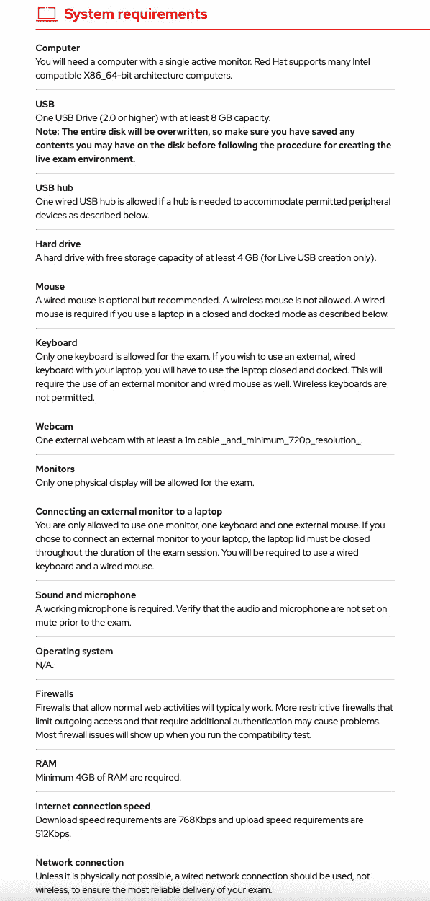

图 10.1 – 远程考试要求

在下图中，您可以看到参加远程考试的剩余要求：

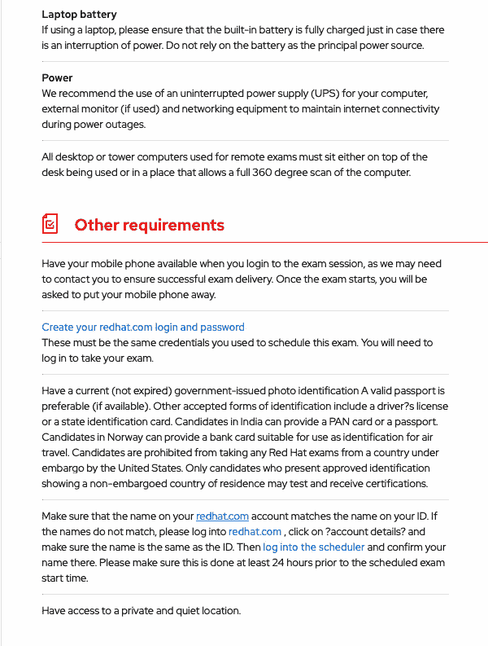

图 10.2 – 额外的远程考试要求

在购买考试后，您可以使用调度程序来安排您的考试，可以选择远程考试或在您附近的考试中心。如您在调度程序中所见，我有一个可供安排的考试：

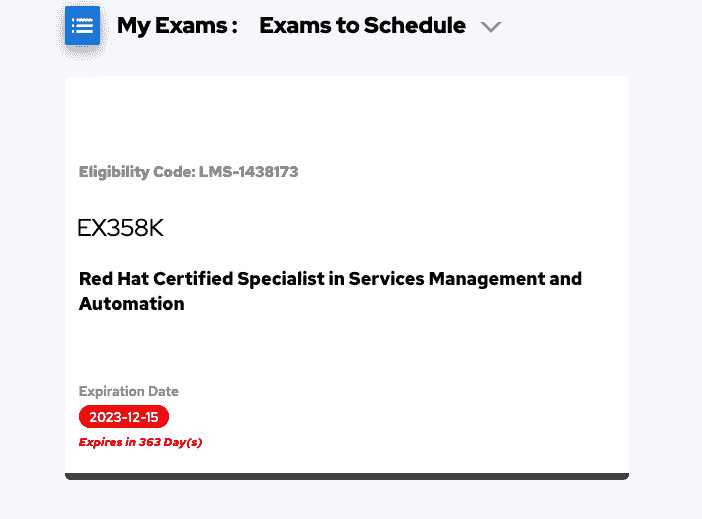

图 10.3 – 在 Red Hat 考试调度器中可安排的考试

选择好考试后，接下来会出现以下屏幕，提供地点选项，如美国，以及选择考试类型，是在考试中心进行还是远程考试：

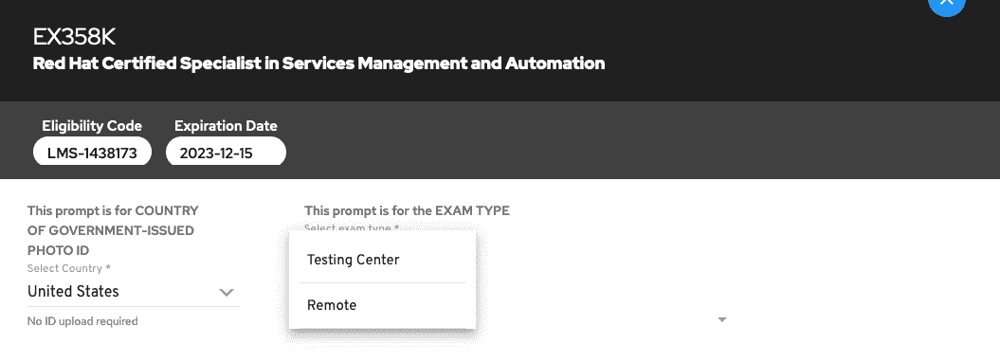

图 10.4 – 选择你的考试类型

在我的情况下，我选择了远程考试选项：

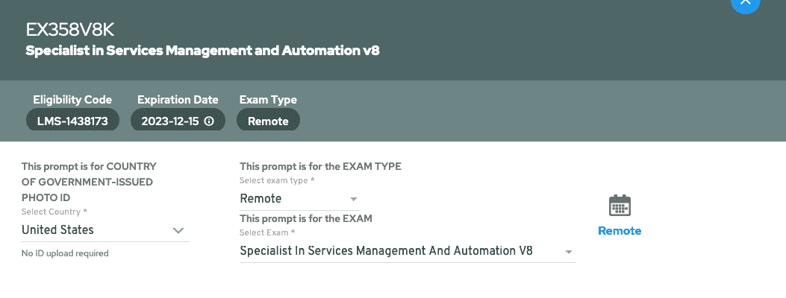

图 10.5 – 远程考试设置

以下截图展示了设置远程考试时你需要提供的下一个项目：

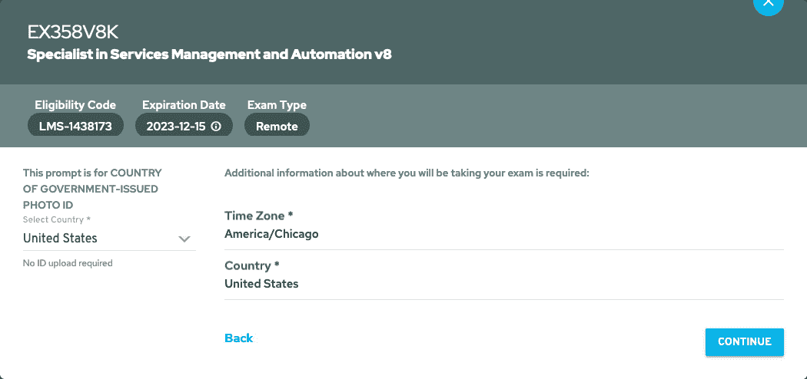

图 10.6 – 安排考试的额外信息

在你提供了所需信息之后，你将进入考试安排页面，显示可用的时间段。如果你没有看到你想要的时间段，请不要担心，通过重新加载页面并按照前面的步骤操作，可能会有人取消并释放出一个时间段，你希望选择的时间段就有可能被开放。请注意，你必须在 24 小时窗口之前取消或重新安排你的考试，否则，你将无法更改时间并且会失去付款。在这个截图中，你可以看到可用的时间段示例：

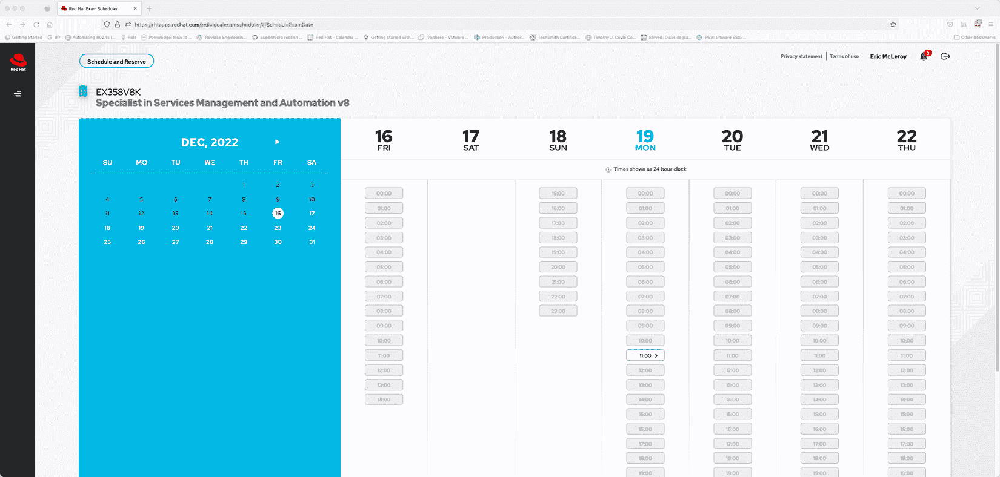

图 10.7 – 可预约考试的时间段

我选择了一个可用的时间段，在我的情况下是上午 11:15。这是一个 24 小时制时钟，请在安排考试时注意这一点。如果你想在下午 4:00 开始考试，你需要选择 16:00，而不是 4:00，因为那样会把考试安排在凌晨 4:00，如果安排错误，你可能会接到一个早晨的电话。

最后，一旦你选择了时间段，你将需要添加一些额外的详细信息来安排考试。你需要提供一个电话号码，如果你有，可以提供一个**认证 ID**，这样它就可以与您的认证资料关联。我们可以在下面的截图中看到所需的字段：

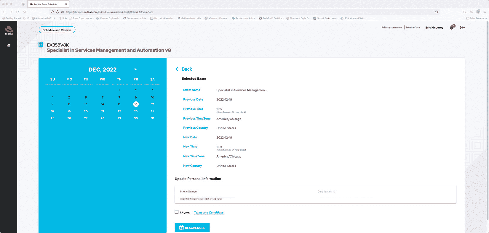

图 10.8 – 安排考试并同意条款和条件

一旦你完成了所有这些设置并同意条款和条件，你的考试将被安排。

考试当天，你需要处于一个没有书写物的地方，周围不能有纸张或铅笔以及你的工作站之外的其他电子设备。监考员会告诉你考试期间哪些物品是可以和不可以带入的。你需要将手机放在远离你的地方，并调至静音状态，以防监考员需要通过屏幕提示与你联系而无法联系到你。考试期间，你的身份证在验证后也需要放在视线外。你可以在考试期间喝饮料；但是，监考员会检查饮料容器，因此确保容器上没有书写，以便获得最佳的考试体验。你也可以在监考员提供的时间段内使用洗手间。请注意，如果你选择在 1 小时 55 分钟时上洗手间，可能就不需要进行第二次房间检查，除了因休息而进行的检查。

我为自己在其中一个小屋里设置了一个安静的地方，确保隐私性和完全的网络连接。如推荐所示，我已将以太网电缆布置到小屋，并为我的笔记本电脑配备了**不间断电源**（**UPS**）。我发现使用笔记本电脑屏幕有些困难，因为它比我习惯的要小，因此我建议使用一个你自己习惯的显示器，因为你只能使用一个显示器，因此你需要最大化你的空间。这意味着如果你使用笔记本电脑，它必须保持关闭并连接到显示器，因为你不能使用两个显示器。

一旦你设置好一个安静的地方来安全地参加考试，你应该在考试环境中进行兼容性测试（此图像链接将在你安排考试后通过电子邮件发送给你），以确保所有设备符合推荐的设置。如果你选择使用内置摄像头的笔记本屏幕，确保它已启用。如果你同时启用了笔记本和外接摄像头，监考员会更容易看到一切，同时你也能更轻松地调整有线摄像头的位置。兼容性信息可以在以下截图中找到：

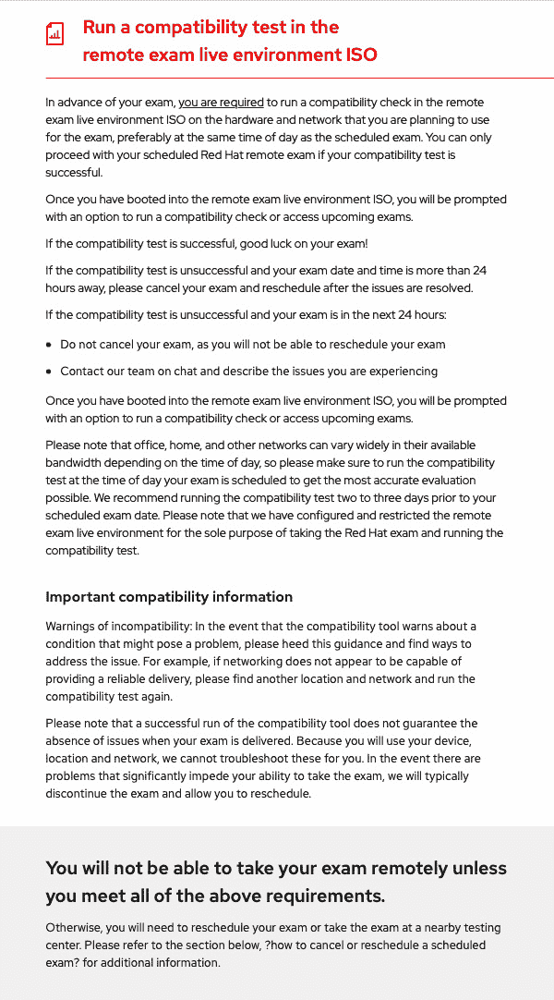

图 10.9 – 远程考试兼容性测试信息

在你完成兼容性测试并确保所有设备符合要求后，你就可以放松，知道自己可以在安排的时间和日期安全地参加考试。这将使你能够在考试前安心准备，不必担心远程考试期间的设备设置问题。

在考试当天，您将能够使用您的 Red Hat 登录信息登录，并在您选择的时间开始您的考试。监考人员将指导您在考试期间需要做的事情。这将帮助您了解在远程考试中要求您完成的所有内容，从而使您能够在自己家中按自己方便的时间顺利完成考试。

一旦所有设置完成，我们将继续分享一些关于如何进行考试的技巧，帮助您让自己更加轻松和舒适。

# 在考试过程中可以帮助您的技巧和窍门

首先，让我们从一件可以让您从一开始就轻松应对的事情入手。请从头到尾阅读所有说明。我之所以这么说，是因为如果说明告诉您可以省略某些重复的操作，比如只在特定的服务器上执行某些任务，那么这样可以节省您的时间。它还会告诉您考试的评分标准。通过阅读说明，您将更好地理解测试环境，并做好充分准备，深入学习材料。任何可以节省时间的地方，都是一次胜利。

说到时间，充分利用考试的 4 小时。不要试图匆忙结束；除非是在这 4 小时的时间窗口内，您不会因为花费时间长短而受到评分限制。考试结束时，计时器归零，您将失去对考试的访问权限。不要让某个问题占用您的时间。如果您擅长其他项目，先做这些，之后再回到难度较大的问题，确保您能尽可能多地覆盖内容。

另一个节省时间的提示是：做所有没有明确指定给某个特定用户的任务时，请以 root 用户身份执行。您始终可以使用`restorecon -Rv <directory>`恢复可能因用户而导致错误上下文的 SELinux 上下文。通过使用 root 用户，您将避免忘记使用 sudo 命令的问题，作为 root 用户，查找文件也变得非常轻松，因为您可以访问整个文件结构。只需小心，因为这可能会导致文件和文件夹的权限问题，因此如果考试要求您为某个操作使用特定用户，请遵循此要求。虽然在日常生活中这不是最佳实践，但在考试中可以节省时间。

接下来，如果您习惯使用 GUI 界面，比如说，CLI 对您来说不够快捷，您可以做一些事情来让生活变得更轻松。您可以在将要进行更改的服务器上安装 GUI。让我们一起看看如何在 RHEL 8.1 服务器上安装 GUI，以便如果它更适合您的需求时，您能够轻松应对。

首先，我们将在需要 GUI 的服务器上安装*带 GUI 的服务器*软件包。这些服务器可以同时运行，因此您不必等待一台服务器完成后再进行下一台，如下图所示：

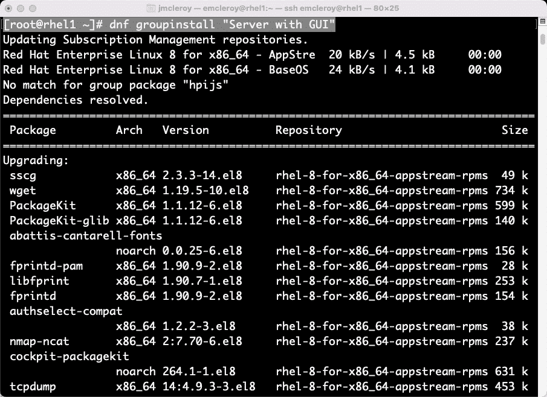

图 10.10 – 安装带有图形用户界面的服务器命令

在你运行安装*带图形用户界面的服务器*包的命令后，你将看到最终结果，如下图所示：

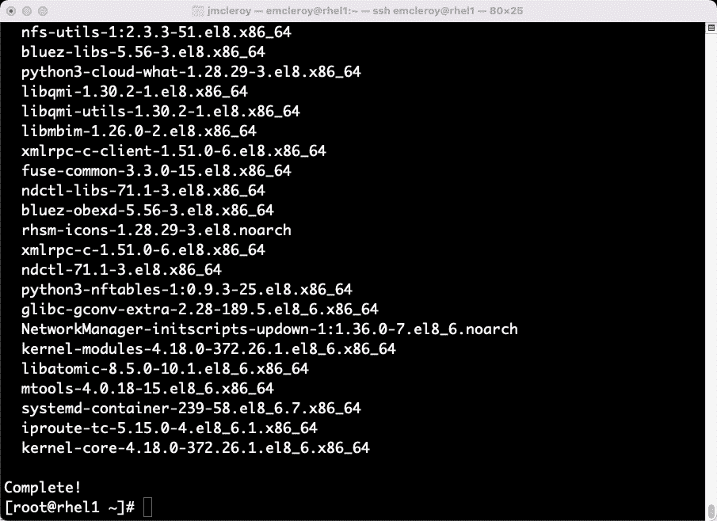

图 10.11 – 完成的图形用户界面安装

接下来，我们将设置服务器从图形界面启动并重启，以便你可以从控制台访问它，如下图所示：

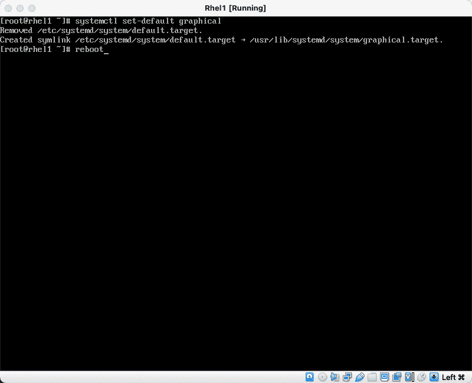

图 10.12 – 设置图形界面为默认启动的命令

重启后，系统应该会启动进入图形用户界面，如下图所示：

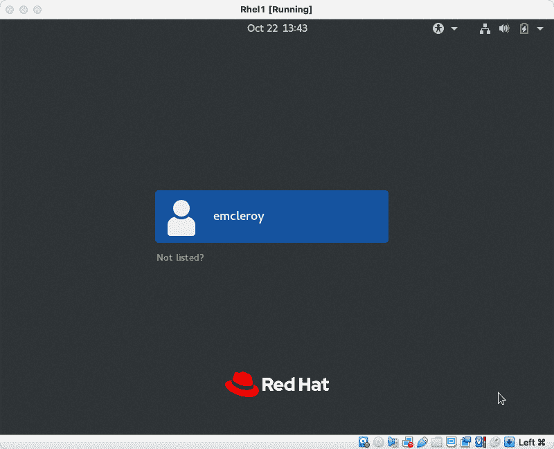

图 10.13 – RHEL 8.1 的图形用户界面登录屏幕

接下来我希望你记住的是，如果你遇到困难，你不仅可以访问`/usr/share`文件夹，如下图所示：

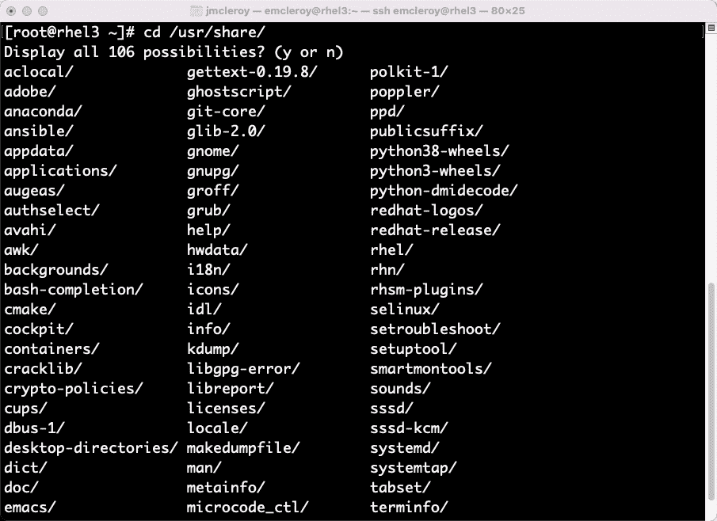

图 10.14 – 包含已安装软件包文档的文件夹

该目录包含系统上已安装的软件包的信息。因此，如果你在某个问题上遇到困难，比如**域名系统**（**DNS**）或**动态主机配置协议**（**DHCP**），你可以查阅相关主题的信息，帮助自己重新激活思维。当你觉得自己忘记了之前学习的所有内容，准备考试时，这会非常有帮助。

接下来是手册页，它包含了你可以使用不同软件包执行的命令和进程的详细信息。你还可以在手册页目录中搜索条目，当你在`/usr/share/man/`目录中看到 gzip 文件时，它将提供你需要访问的手册页名称，以获取更多信息。我们可以在下图中看到对 DHCP 信息的搜索：

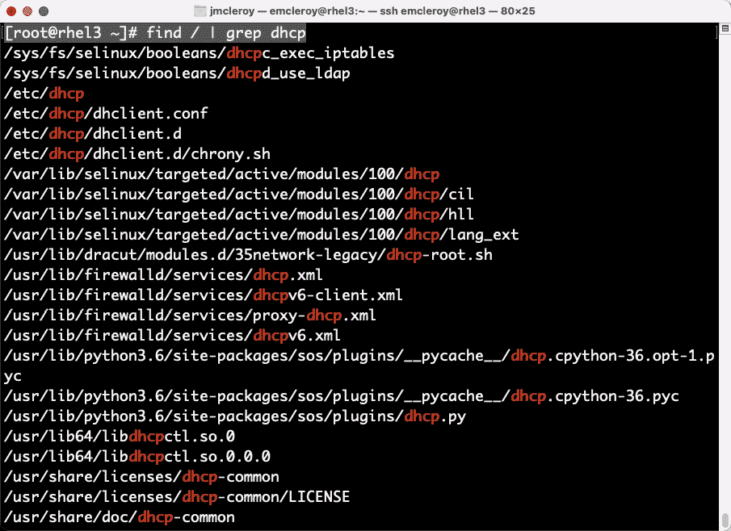

图 10.15 – 搜索包含 DHCP 的文件

你可以在以下截图中的文件夹中看到，你有多个包含 DHCP 信息的手册页：

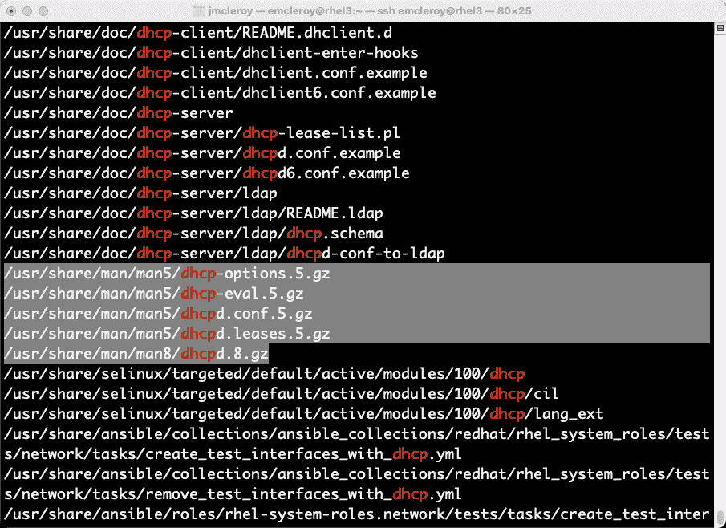

图 10.16 – DHCP 手册页名称

现在，你可以看到有多个包含`dhcpd`的手册页，你可以打开一个手册页来查看进一步的文档，如下图所示：

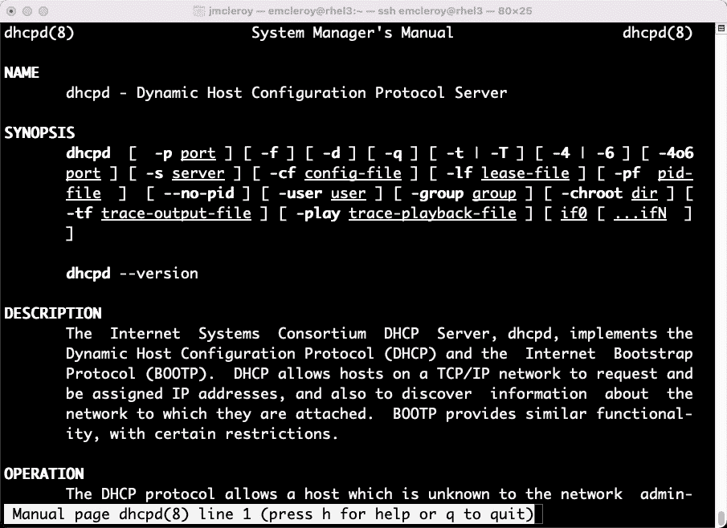

图 10.17 – 一个 dhcpd 手册页

这些 gzip 文件如果你对手册页的名称感到困惑，并且需要一种快速的方式来查找包含`dhcp`的所有手册页，会非常有帮助。

请注意，完成考试时，所有的更改必须是持久的。系统将重新启动并擦除所有 Ansible 节点，以便它们可以用于运行新的 playbook。

# 总结

最后，我们来到了这本书的旅程终点。我要感谢你们选择与我一起进入 Red Hat Enterprise Linux 的世界。我非常高兴能够写这本书，希望能帮助尽可能多的人实现成为 **Red Hat 认证服务管理与自动化专家**（**EX358**）的目标。这场考试是获得 **Red Hat 认证架构师**（**RHCA**）资格所需的五个额外考试之一，同时也需要通过 **Red Hat 认证专家**（**RHCE**）考试。我希望你们能从中获得一些如何完成任务的洞察。然而，重要的是你要知道，这些并不是你完成这些任务以实现认证目标的唯一方法，而是众多方法中的一些，希望它们能激励你走向胜利之路。
