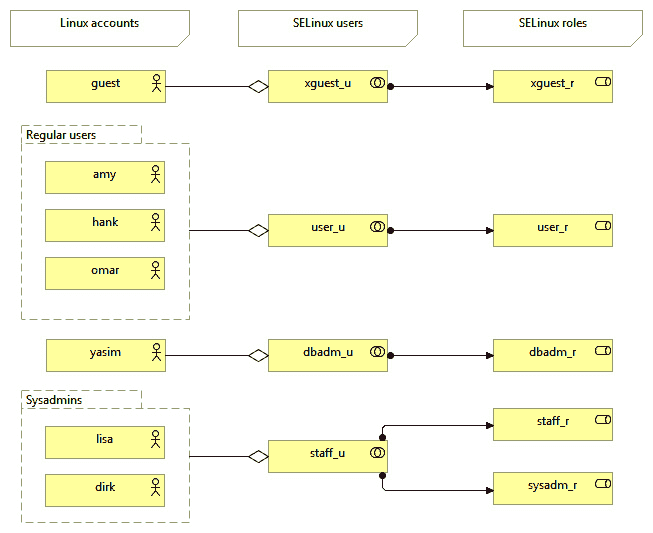

# *第一章*：基本的 SELinux 概念

**增强安全的 Linux (SELinux)** 为你的 Linux 系统带来额外的安全措施，进一步保护其资源。作为 Linux 内核的一部分，它是一个由主要 Linux 发行版支持的强制访问控制系统。在本书中，我们涵盖了 SELinux 的各个方面，从基本原理到解决 SELinux 问题，配置应用程序以处理 SELinux，甚至编写我们自己的策略。

在我们深入探讨 SELinux 的细节之前，让我们首先介绍一下这项技术的概念：为什么 SELinux 使用标签来识别资源，SELinux 与传统 Linux 访问控制的不同，SELinux 如何执行安全规则，以及 Linux 内核中支持的其他强制访问控制系统。我们还将看到 SELinux 强制执行的访问控制规则是如何通过策略文件提供的。在本章的最后，我们将概述不同 Linux 发行版中 SELinux 实现的差异。

本章将涵盖以下主要主题：

+   为 Linux 提供更多的安全性

+   对所有资源和对象进行标签化

+   定义和分发策略

+   区分不同的策略

# 技术要求

查看以下视频，了解代码的实际应用：[`bit.ly/2FFaUdm`](https://bit.ly/2FFaUdm)

# 为 Linux 提供更多的安全性

经验丰富的 Linux 管理员和安全工程师已经知道，为了保持系统的安全性，他们需要对系统的用户和进程给予一定的信任。这部分是因为用户可能会尝试利用系统上运行的软件中的漏洞，但这一信任度的主要原因是系统的安全状态依赖于用户的行为。具有访问敏感信息的 Linux 用户可能会轻易将其泄露给公众，操控他们启动的应用程序行为，甚至做出许多其他影响系统安全的行为。常规 Linux 系统上默认的访问控制是**自主**的；访问控制如何行为由用户决定。

Linux 的`/etc/shadow`文件，包含本地 Linux 账户的密码和账户信息：

```
$ ls -l /etc/shadow 
-rw-r-----. 1 root root 1019 Nov 28 20:44 /etc/shadow
```

如果没有额外的访问控制机制，这个文件对任何由`root`用户拥有的进程都是可读和可写的，无论该进程在系统上的用途是什么。`shadow`文件是一个典型的敏感文件，我们不希望它被泄露或以其他方式滥用。然而，一旦某人有了对该文件的访问权限，该用户可以将其复制到其他地方，例如复制到主目录，甚至将其邮件发送到另一台计算机并尝试攻击其中存储的密码哈希值。

另一个需要用户信任的 Linux DAC 示例是数据库服务器的配置。数据库文件本身（希望如此）只对 `root` 用户的运行时账户可访问。妥善安全的系统将仅向受信任的用户授予对这些文件的访问权限（例如，通过 `sudo`），允许他们将其有效用户 ID 从个人用户更改为数据库运行时用户，甚至是 `root` 账户，但仅限于系统管理员事先配置的一组特定命令。这些用户同样可以分析数据库文件，并访问数据库中可能的机密信息，而无需通过数据库管理系统（DBMS）。管理员往往不得不将大量信任寄托在这些用户身上，以保证系统的安全，而不是能够强制执行这些安全控制。

然而，普通用户并不是保障系统安全的唯一原因。许多软件守护进程以 Linux `root` 用户身份运行，或者在系统上具有重要权限。这些守护进程中的错误可能很容易导致信息泄漏，甚至可能导致可以远程利用的漏洞。备份软件、监控软件、变更管理软件、调度软件等等：它们通常都以在普通 Linux 系统上可能拥有的最高权限账户运行。即使管理员不允许特权用户，其与守护进程的交互仍然会引入潜在的安全风险。因此，用户仍然被信任能够正确地与这些应用程序交互，以确保系统正常运行。通过这种方式，管理员将系统的安全性交给了其（众多）用户的*自行判断*。

这时，SELinux 就应运而生，它为标准 Linux DAC 机制提供了一个额外的访问控制层。SELinux 提供了一种**强制访问控制（MAC）**系统，不像 DAC 机制那样，它使管理员能够完全控制系统上什么是允许的，什么是不允许的。它通过支持基于策略的方法来确定哪些进程可以做，哪些进程不能做，并通过 Linux 内核强制执行这些策略来实现这一点。

**强制**意味着操作系统执行访问控制，这些控制规则仅由系统管理员（或安全管理员）启用的策略规则定义。用户和进程没有权限更改安全规则，因此它们无法绕过访问控制；安全性不再交给他们的自行判断。

以关系数据库为例，强制访问控制系统将不再要求管理员信任某些用户，因为它完全控制这些用户可以做什么和不能做什么。正如我们将在 *第八章* 中看到的，*SEPostgreSQL – 通过 SELinux 扩展 PostgreSQL*，它可以与 SELinux 子系统交互，使管理员能够对数据访问进行全面控制，甚至在数据库内部也能实现这一点。

这里的*强制*一词，与之前的*自主*一词一样，并不是偶然选择用来描述访问控制系统的能力：这两个词在安全研究领域都是已知的术语。许多安全出版物使用这些术语，包括**可信计算机系统评估标准**（**TSEC**）（[`csrc.nist.gov/publications/history/dod85.pdf`](http://csrc.nist.gov/publications/history/dod85.pdf)）标准（也称为**橙皮书**），该标准由美国国防部于 1985 年发布。此出版物已促成了计算机安全认证的通用标准（ISO/IEC 15408），详情请见[`www.commoncriteriaportal.org/cc/`](http://www.commoncriteriaportal.org/cc/)。

接下来，我们将描述 Linux 内核如何负责 SELinux 的实现。

## 介绍 Linux 安全模块（LSM）

再考虑一下`shadow`文件的示例。一个 MAC 系统可以配置为仅允许有限数量的进程读取和写入该文件。在这种特定配置的系统上，作为`root`用户登录的用户无法直接访问该文件，甚至无法移动该文件。他们甚至不能更改文件的属性：

```
# id
uid=0(root) gid=0(root) groups=0(root),1(bin),2(daemon),3(sys),
4(adm),6(disk),10(wheel),11(floppy),26(tape),27(video) context=sysadm_u:sysadm_r:sysadm_t:s0-s0:c0.c1023
# cat /etc/shadow
cat: /etc/shadow: Permission denied
# chmod a+r /etc/shadow
chmod: changing permissions of '/etc/shadow': Permission denied
```

系统通过规则强制执行这些内容，这些规则描述了何时可以读取该文件的内容，或者何时可以更改其属性。在 SELinux 中，这些规则在 SELinux 策略中定义，并在系统启动时加载。正是 Linux 内核本身负责执行这些规则。

强制访问控制系统，如 SELinux，支持通过**Linux 安全模块**（**LSM**）集成到 Linux 内核中，这是一个在处理用户空间请求之前被调用的 Linux 子系统。此类请求称为**系统调用**，Linux 支持超过 100 种系统调用。


图 1.1 – LSM 如何集成到 Linux 内核中的高层次概述

LSM 自 2.6 版本以来已在 Linux 内核中可用，该版本于 2003 年 12 月发布。它是一个框架，在 Linux 内核的多个位置提供钩子，包括系统调用入口点。当这些钩子被触发时，已注册的安全实现，如 SELinux，会自动执行其功能。在 SELinux 中，这些功能会在返回许可/拒绝之前检查策略和其他信息。LSM 本身不提供任何安全功能；相反，它依赖于执行繁重任务的安全实现：该框架是*模块化*的。

在 LSM 框架内，存在两种类型的安全模块：独占模块和非独占模块。两个独占模块不能同时启用：每个独占的 LSM 模块需要对一些内核对象（通常是与安全上下文相关的对象）进行独占控制，并且无法处理其他也需要这些对象的 LSM 模块。非独占模块没有这个需求，可以随意组合（也叫做 *堆叠*），无论是否启用了独占 LSM 模块。

堆叠 LSM 模块的一个主要用例是启用系统中运行的容器内的不同安全模型。目前，在 Linux 容器中无法实现不同的安全模块，容器内的安全性会回退到宿主机的安全模块。为了支持这一点，越来越多的独占 LSM 实现（如 SELinux）正在努力将其实现改为非独占，我们可以预期在明年内这一领域会有所进展。

SELinux 是使用 LSM 的一种实现方式。还有其他几种实现存在：

+   **AppArmor** 是一个强制访问控制系统，专注于应用级别的保护（称为配置文件），主要基于文件系统路径。这使得 AppArmor 对管理员来说易于理解和实现，因为它不像 SELinux 那样需要抽象规则到标签中，因此没有那么复杂。在 *标记所有资源和对象* 部分中，我们解释了为什么 SELinux 使用标签。在撰写本文时，AppArmor 是一个独占的 LSM 模块，但很可能很快会变为非独占模块。

+   **Smack** 是一个强制访问控制系统，使用标签来标记进程和资源。这些标签包含由 Smack 解释的安全标识符，用于强制实施访问控制，要求 Smack 中的访问规则比 SELinux 少（与 SELinux 不同，SELinux 不对标签进行解释——除了敏感性之外——因此需要更多的策略规则）。Smack 是一个独占的 LSM 模块。

+   **TOMOYO Linux** 是一个强制访问控制系统，但其访问控制机制也易于进行系统分析。它会根据应用行为自动构建策略，类似于 AppArmor，它的策略主要使用路径而非标签。TOMOYO Linux（及其分支 **AKARI**）是一个非独占的 LSM 模块。

+   **LoadPin** 是一个 LSM 模块，确保 Linux 内核资源（如内核模块和固件）都从一个不可写的单一文件系统加载。LoadPin 是一个非独占的 LSM 模块。

+   `ptrace`）。Yama 是一个非独占的 LSM 模块。

+   `setuid`（切换到另一个用户）允许切换到另一个用户。与直接授权使用 `setuid` 不同，SafeSetId 可以限制哪些用户可以进行此操作。这样，即使工具如 `sudo` 存在漏洞或配置错误，也能保证其仍然受到限制。SafeSetId 是一个非独占的 LSM 模块。

+   **Lockdown** 是一个 LSM 模块，保护 Linux 内核内存。它有两种模式：在完整性模式下，它防止从用户空间修改内核对象（如直接内存访问或 PCI 访问）；在机密性模式下，它还防止从内核对象提取潜在的机密信息。Lockdown 是一个非独占的 LSM 模块。

+   **capability** LSM 模块在系统上默认启用，并支持 Linux 能力（授予用户的权限集，当用户被分配某种能力时）。它是一个非独占的 LSM 模块。

要查询系统上活动的 LSM 模块列表，可以读取`/sys/kernel/security/lsm`：

```
$ cat /sys/kernel/security/lsm
capability,selinux
```

接下来，我们将解释 SELinux 如何在常规 Linux 访问控制之上工作。

## 使用 SELinux 扩展常规 DAC

SELinux 不会改变 Linux 的 DAC 实现，也无法覆盖由 Linux DAC 权限做出的拒绝。如果一个普通的系统（没有 SELinux）阻止了某个访问，SELinux 无法覆盖这一决定。这是因为 LSM 钩子是在常规 DAC 权限检查执行*之后*触发的，这是 LSM 项目的一个设计决策。

例如，如果你需要允许另一个用户访问某个文件，你不能通过添加 SELinux 策略来实现。相反，你需要查看 Linux 的其他功能，例如使用 POSIX 访问控制列表。通过 `setfacl` 和 `getfacl` 命令，用户可以为文件和目录设置额外的权限，允许其他用户或组访问选定的资源。

例如，使用 `setfacl` 命令授予 `admin` 用户对文件的读写权限：

```
$ setfacl -m u:admin:rw /srv/backup/setup.conf
```

同样，要查看应用于文件的当前 POSIX ACL，可以使用此命令：

```
$ getfacl /srv/backup/setup.conf
getfacl: Removing leading '/' from absolute path names
# file: srv/backup/setup.conf
# owner: root
# group: root
user::rw-
user::admin:rw-
group::r--
mask::rw-
other::r—
```

这显示该文件不仅可以由文件所有者写入，还可以由 `admin` 用户写入。

## 限制 root 权限

常规 Linux DAC 允许一个全能用户：`root`。与系统中的其他大多数用户不同，登录的 `root` 用户拥有完全管理整个系统所需的所有权限，从覆盖访问控制到控制审计、改变用户 ID、管理网络等。这是通过一个叫做 `man capabilities` 的安全概念支持的。SELinux 也能以细粒度的方式限制对这些能力的访问。

由于 SELinux 细粒度授权的特点，即使是`root`用户也可以被限制，而不会影响系统的操作。之前访问`/etc/shadow`的例子只是一个示例，展示了像`root`这样的强大用户由于 SELinux 的访问控制可能无法执行某些操作。

## 减少漏洞的影响

如果要强调 SELinux 的一个好处，那就是它能够减少漏洞的影响。但这种漏洞减少往往也被误解。

正确编写的 SELinux 政策将限制应用程序的行为，使其允许的活动减少到最小范围。这个**最小特权模型**确保不仅能够检测并审计异常的应用程序行为，还能够防止这种行为。许多应用程序的漏洞可以被利用来执行应用程序原本不应执行的任务。当这种情况发生时，SELinux 将加以防止。

然而，有两个关于 SELinux 防止漏洞攻击能力的误解，即政策的影响和漏洞本身。

如果政策没有遵循最小特权模型，那么 SELinux 可能会将这种非标准行为视为正常，并允许这些操作继续进行。对于政策编写者来说，这意味着他们的政策规则必须非常细致。不幸的是，这使得编写政策变得非常耗时：由于 SELinux 已知的有 130 多类和 250 多种权限，政策规则必须考虑到每次交互中所有这些类和权限。

结果是，政策往往变得复杂，且更难维护。一些政策编写者会使政策比实际必要的更加宽松，这可能导致即使某些行为不是应用程序预期的行为，漏洞也能成功利用。一些应用程序政策明确标记为“无限制”（我们在*第十四章*中讨论，“处理新应用程序”），这表明它们在允许的权限上非常宽松。Fedora、CentOS 和 Red Hat Enterprise Linux 甚至将应用程序的政策起初设为宽松，只有在经过几个版本的发布（和额外的测试）后，才会开始对这些应用程序实施访问控制。

第二个误解是关于漏洞本身。如果应用程序的漏洞允许未经身份验证的用户以普通授权用户的身份使用应用程序服务，那么 SELinux 将无法减少漏洞的影响；它只会注意到应用程序本身的行为，而不是应用程序内部会话的行为。只要应用程序本身的行为符合预期（例如访问自己的文件，而不是乱动其他文件系统），SELinux 将允许这些操作发生。

只有当应用程序开始表现异常时，SELinux 才会阻止漏洞攻击的继续。SELinux 将防止诸如**远程命令执行（RCE）**等攻击，防止那些不应该执行任意命令的应用程序（如数据库管理系统或 Web 服务器，排除类似 CGI 的功能）被攻击，而会话劫持或 SQL 注入攻击是无法通过 SELinux 政策控制的。

## 启用 SELinux 支持

在 Linux 系统上启用 SELinux 不仅仅是启用 Linux 内核中的 SELinux LSM 模块。

一个 SELinux 的实现包含以下内容：

+   SELinux 内核子系统，通过 LSM 实现在 Linux 内核中

+   应用程序用来与 SELinux 交互的库

+   管理员用来与 SELinux 进行交互的实用程序

+   定义访问控制本身的策略

这些库和实用程序由 SELinux 用户空间项目捆绑提供（[`github.com/SELinuxProject/selinux`](https://github.com/SELinuxProject/selinux)）。除了 SELinux 用户空间项目提供的应用程序和库之外，Linux 系统上的各个组件也会通过 SELinux 特定的代码进行更新，包括 `init` 系统和一些核心实用程序。

由于 SELinux 不仅仅是一个需要切换的开关，支持 SELinux 的 Linux 发行版通常会预定义并加载 SELinux：Fedora、CentOS 和 Red Hat 企业版 Linux（以及其衍生版本，如 Oracle Linux）是众所周知的例子。其他支持 SELinux 的发行版可能不会自动启用 SELinux，但可以通过安装额外的软件包轻松支持 SELinux（例如 Debian 和 Ubuntu），还有一些发行版有文档说明如何将系统转换为 SELinux（例如 Gentoo 和 Arch Linux）。

在本书中，我们将展示 Gentoo 和 CentOS 8 的示例（CentOS 8 基于 Red Hat 企业版 Linux 发行版的自由软件，并由 Red Hat 赞助）。这两个发行版具有不同的实现细节，这使我们能够展示 SELinux 的全部潜力。为了确保本书中使用的命令可用，可能需要安装一些 SELinux 支持工具。

在 Gentoo Linux 上，至少需要安装以下软件包：

```
# emerge app-admin/setools sys-apps/policycoreutils
```

在 CentOS Linux 上，至少需要安装以下软件包：

```
# yum install setools-console policycoreutils-python-utils
```

由于软件包可能会随时间变化，查看某个特定命令提供哪个软件包是明智的做法。

重要说明

如果提到的软件包不再存在或未覆盖所有命令，请查阅您发行版的文档，了解需要安装哪些软件包。大多数发行版也允许搜索最合适的软件包，例如 Gentoo 中的 `e-file` 或 CentOS 或相关发行版中的 `yum whatprovides`。

介绍了 SELinux 的主要功能后，让我们来看看 SELinux 如何了解系统上的内容，以及它使用哪种抽象方法来允许为广泛的用户群体制定策略。

# 为所有资源和对象打上标签

当 SELinux 必须决定是否允许或拒绝某个特定操作时，它会根据 **主体**（谁发起了操作）和 **客体**（操作的目标）之间的上下文做出决定。这些上下文（或上下文的一部分）在 SELinux 强制执行的策略规则中有所提及。

**进程的上下文**是 SELinux 用来识别进程的。SELinux 并不关心 Linux 进程的所有权，也不关心进程是如何命名的，它的进程 ID 是什么，或者该进程以什么账户运行。它只关心该进程的上下文是什么，这一上下文向用户和管理员展示为一个**标签**。*标签*和*上下文*通常可以互换使用，尽管它们之间有技术上的区别（一个是另一个的表现形式），但我们不会在此深入讨论。

让我们看一个示例标签——当前用户的上下文：

```
$ id -Z 
sysadm_u:sysadm_r:sysadm_t:s0-s0:c0.c1023
```

`id`命令返回当前用户的信息，显示了使用`-Z`选项执行的情况（这是一个常见的选项，用于显示从基于 LSM 的安全子系统获取的附加安全信息）。它显示了当前用户的上下文（实际上是`id`进程在执行时的上下文）。如我们所见，上下文有一个字符串表示，看起来似乎有五个字段（实际上没有，它有四个字段——最后一个字段只是恰好包含了一个冒号字符）。

SELinux 的开发者决定使用标签而不是实际的进程和文件（或其他资源）元数据来进行访问控制。这与像 AppArmor 这样的 MAC 系统不同，后者使用二进制文件的路径（因此是进程名称）和资源的路径来进行权限检查。以下原因促使了 SELinux 采用基于标签的强制访问控制：

+   使用路径可能对管理员更容易理解，但这并不能让我们将上下文信息保持在资源附近。如果文件或目录移动或重新挂载，或者如果进程在不同的命名空间下查看文件，那么访问控制可能会表现不同，因为它们查看的是路径而非文件。通过基于标签的上下文，系统可以保留这些信息，并持续正确控制资源的访问。

+   上下文很好地揭示了这个过程的目的。相同的二进制应用程序可以在不同的上下文中启动，具体取决于它是如何启动的。上下文值（例如前面在`id -Z`输出中看到的那个）正是管理员所需要的。有了它，他们可以知道每个运行实例的权限，但也能从中推断出该进程是如何启动的，以及它的目的是什么。

+   上下文还对对象本身进行了抽象。我们习惯于讨论进程和文件，但上下文也适用于一些不太具体的资源，如管道（进程间通信）或数据库对象。基于路径的标识只有在你能够写出路径时才有效。

作为一个例子，考虑以下策略声明：

+   允许`httpd`进程绑定到 TCP 端口`80`。

+   允许标记为`httpd_t`的进程绑定到标记为`http_port_t`的 TCP 端口。

在第一个示例中，当 Web 服务器进程不使用`httpd`二进制文件（可能因为已重命名或者不是 Apache 而是另一个 Web 服务器）或者当我们希望在不同端口上具有 HTTP 访问时，我们不能轻松地重用此策略。使用标记方法，二进制文件可以称为`apache2`或`MyWebServer.py`；只要进程以`httpd_t`标记，策略就适用。端口定义也是如此：您可以使用`http_port_t`标记端口`8080`，从而允许 Web 服务器绑定到该端口，而无需编写另一个策略语句。

## 解析 SELinux 上下文

要达到上下文，SELinux 使用至少三个，有时是四个值。让我们以 SSH 服务器的上下文为例：

```
$ ps -eZ | grep sshd
system_u:system_r:sshd_t:s0-s0:c0.c1023 2629 ? 00:00:00 sshd
```

如我们所见，进程被分配一个包含以下字段的上下文：

+   SELinux 用户`system_u`

+   SELinux 角色`system_r`

+   SELinux 类型（当我们查看运行中进程时也称为域）`sshd_t`

+   敏感级别`s0-s0:c0.c1023`

当我们使用 SELinux 时，了解上下文非常重要。在大多数情况下，第三个字段（称为**domain**或**type**）最重要，因为超过 99%的 SELinux 策略规则涉及两个类型之间的交互（而不涉及角色、用户或敏感级别）。

SELinux 上下文与 LSM 安全属性对齐，并以标准化的方式向用户空间公开（与多个 LSM 实现兼容），允许最终用户和应用程序轻松查询上下文。这些属性呈现的一个方便获取的位置是在`/proc`伪文件系统中。

在每个进程的`/proc/<pid>`位置，我们可以找到一个名为`attr`的子目录，在其中可以找到以下文件：

```
$ ls /proc/$$/attr
current  exec  fscreate  keycreate  prev  sockcreate
```

所有这些文件，如果阅读，要么显示为空，要么显示一个 SELinux 上下文。如果为空，则意味着该应用程序未明确为该特定目的设置上下文，SELinux 上下文将从策略中推断或从其父级继承。

文件的含义如下：

+   `current`文件显示进程当前的 SELinux 上下文。

+   `exec`文件显示由此应用程序执行的下一个应用程序执行分配的 SELinux 上下文。通常为空。

+   `fscreate`文件显示由应用程序编写的下一个文件分配的 SELinux 上下文。通常为空。

+   `keycreate`文件显示将由此应用程序在内核中缓存的密钥分配的 SELinux 上下文。通常为空。

+   `prev`文件显示此特定进程的先前 SELinux 上下文。通常是其父应用程序的上下文。

+   `sockcreate`文件显示将由应用程序创建的下一个套接字分配的 SELinux 上下文。通常为空。

如果一个应用程序有多个子任务，那么相同的信息可以在每个子任务目录中找到，路径为`/proc/<pid>/task/<taskid>/attr`。

## 通过类型强制执行访问控制

进程的 SELinux 类型（SELinux 上下文的第三部分）（称为**领域**）是该进程与自己及其他类型（可以是进程、文件、套接字、网络接口等）之间精细粒度访问控制的基础。在大多数 SELinux 文献中，SELinux 的标签基础访问控制机制被微调为 SELinux 是一个**类型强制**的强制访问控制系统：当某些操作被拒绝时，（类型层面的）精细粒度访问控制的缺失很可能是原因所在。

通过类型强制，SELinux 可以根据应用程序最初是如何执行的来控制其行为：由用户启动的 Web 服务器将与通过 `init` 系统执行的 Web 服务器使用不同的类型，即使它们的进程二进制文件和路径相同。通过 `init` 系统启动的 Web 服务器最有可能被信任（因此允许执行 Web 服务器应该做的任何操作），而手动启动的 Web 服务器则不太可能被视为*正常行为*，因此将具有不同的权限。

重要提示

大多数 SELinux 的在线资源都集中在类型上。尽管 SELinux 类型只是 SELinux 上下文的第三部分，但对于大多数管理员来说，它是最重要的一部分。大多数文档甚至会只谈论像`sshd_t`这样的类型，而不是完整的 SELinux 上下文。

看一下以下 `dbus-daemon` 进程：

```
# ps -eZ | grep dbus-daemon
swift_u:swift_r:swift_dbusd_t:s0-s0:c0.c512 571 ? 00:00:01 dbus-daemon
swift_u:swift_r:swift_dbusd_t:s0-s0:c0.c512 649 ? 00:00:00 dbus-daemon
system_u:system_r:system_dbusd_t:s0-s0:c0.c1023 2498 ? 00:00:00 dbus-daemon
```

在这个例子中，一个 `dbus-daemon` 进程是运行的系统 D-Bus 守护进程，使用了恰如其名的 `system_dbusd_t` 类型，而另外两个则使用了 `swift_dbusd_t` 类型。尽管它们的二进制文件相同，但它们在系统中的作用不同，因此分配了不同的类型。SELinux 然后使用该类型来管理进程对其他类型的操作，包括 `system_dbusd_t` 如何与 `swift_dbusd_t` 进行交互。

SELinux 类型按照约定以 `_t` 结尾，尽管这并非强制要求。

## 通过角色授予领域访问权限

SELinux 角色（SELinux 上下文的第二部分）允许 SELinux 支持基于角色的访问控制。尽管类型强制是 SELinux 中最常用（且最知名）的部分，基于角色的访问控制仍然是确保系统安全的重要方法，尤其是防止恶意用户尝试。SELinux 角色定义了当前上下文可以访问哪些类型（领域）。这些类型（领域）又定义了权限。因此，SELinux 角色有助于定义一个用户（有权访问一个或多个角色）能做什么以及不能做什么。

按约定，SELinux 角色定义时以 `_r` 结尾。在大多数启用 SELinux 的系统中，管理员可以为用户分配以下 SELinux 角色：

+   `user_r`角色用于受限用户。这个角色只允许具有特定于端用户应用程序的类型的进程。不允许使用特权类型，包括用于切换到另一个 Linux 用户的类型。

+   `staff_r`角色用于非关键操作。这个角色通常受限于与受限用户相同的应用程序，但具有切换角色的能力。这是操作员拥有的默认角色（以尽可能保持用户在最低特权角色下的状态）。

+   `sysadm_r`角色用于系统管理员。这个角色非常特权，能够执行各种系统管理任务。但是，某些端用户应用程序类型可能不受支持（特别是如果这些类型用于潜在的易受攻击或不受信任的软件），以保持系统免受感染。

+   `secadm_r`角色用于安全管理员。这个角色允许更改 SELinux 策略并操作 SELinux 控制。通常在需要系统管理员和系统策略管理之间进行职责分离时使用。

+   `system_r`角色用于守护进程和后台进程。这个角色非常特权，支持各种守护进程和系统进程类型。然而，不允许使用此角色进行端用户应用程序类型和其他管理类型的操作。

+   `unconfined_r`角色用于端用户。这个角色允许有限数量的类型，但这些类型非常特权，因为它们允许以几乎无限制的方式运行用户（或另一个未受限制的进程）启动的任何应用程序（不受 SELinux 规则限制）。因此，只有当系统管理员希望保护某些进程（主要是守护进程）而保持系统其余操作几乎不受 SELinux 限制时，才会提供此角色。

其他角色可能存在，例如`guest_r`和`xguest_r`，具体取决于发行版。建议查阅发行版文档获取更多关于支持角色的信息。最常用的获取可用角色概览的方法是使用`seinfo`命令：

```
# seinfo –-role
Roles: 9
   auditadm_r
   object_r
   secadm_r
   …
   user_r
```

识别了 SELinux 角色后，让我们看看如何将角色分配给用户。

## 通过用户限制角色

SELinux 用户（SELinux 上下文的第一部分）并非与 Linux（账户）用户相同。与 Linux 用户信息不同的是，SELinux 策略可以（并且通常会）强制保持 SELinux 用户即使 Linux 用户自身已更改也保持不变。由于 SELinux 用户的不可变状态，我们可以实施特定的访问控制，以确保用户无法绕过授予他们的权限集，即使他们获得特权访问也是如此。

这种访问控制的一个示例是某些 Linux 发行版（可选）启用的**基于用户的访问控制**（**UBAC**）功能，阻止用户在即使那些用户尝试使用 Linux DAC 控制来授予对彼此文件的访问时，访问不同 SELinux 用户的文件。

然而，SELinux 用户最重要的特性是，SELinux 用户定义限制了（Linux）用户可以承担的角色。Linux 用户首先被分配给一个 SELinux 用户，且该用户不需要唯一：多个 Linux 用户可以分配给同一个 SELinux 用户。一旦设置，该用户不能切换到未与该 SELinux 用户关联的 SELinux 角色。

下图展示了 SELinux 的基于角色的访问控制实现：



图 1.2 – 将 Linux 账户映射到 SELinux 用户

`_u` 后缀，尽管这不是强制性的。大多数发行版中可用的 SELinux 用户名称是根据它们所代表的角色命名的，但它们的结尾是 `_u`，而不是 `_r`。例如，对于 `sysadm_r` 角色，我们有 `sysadm_u` SELinux 用户。

## 通过敏感性控制信息流

SELinux 上下文的第四部分是敏感性，这部分并非总是存在（某些 Linux 发行版默认不启用敏感性标签，但大多数会启用）。标签的这一部分对于 `s` 和一个类别值（前缀为 `c`）是必要的。

在许多较大的组织和公司中，文档被标记为内部、机密或严格机密。SELinux 可以为这些资源分配进程的某些安全级别。通过 MLS，我们可以配置 SELinux 以遵循**贝尔-拉帕杜拉**模型，这是一种以*禁止向上读取，禁止向下写入*为特征的安全模型：根据进程的安全级别，该进程不能读取任何具有更高机密性级别的内容，也不能写入（或与之通信）任何具有较低机密性级别的资源。SELinux 不使用内部、机密和其他标签，而是使用从零（最低机密性）到系统管理员定义的最高值的数字（这是可配置的，并且在构建 SELinux 策略时设置）。

分类使我们能够为资源分配一个或多个类别，并定义跨类别的访问控制。使用分类的一个功能是支持多租户（例如，为多个客户托管应用程序的系统）在 Linux 系统中的实现。多租户通过为一个租户的进程和资源分配一组类别来提供，而另一个租户的进程和资源则获得不同的类别。当进程没有分配正确的类别时，它无法访问具有其他类别的资源（或其他进程）。

重要说明

在 SELinux 的世界里，有一个不成文的约定，那就是（至少）使用两种类别来区分不同的租户。通过让服务在预定义的类别集中随机选择两个类别来为租户分配，同时确保每个租户都有独特的组合，这些服务实现了适当的隔离。使用两种类别并不是强制性的，但像 sVirt 和 Docker 这样的服务成功地实现了这一方法。

从这个角度来看，类别就像标签，只在进程和目标资源的标签匹配时才允许访问。由于多级安全性并不常用，仅使用类别的好处被保留在所谓的 `s0` 中。

现在我们知道 SELinux 策略如何使用标签，让我们来看看 SELinux 策略是如何定义和分发的。

# 定义和分发策略

启用 SELinux 并不会自动开始执行访问控制。如果 SELinux 被启用但找不到策略，它将拒绝启动，因为策略定义了系统的行为（SELinux 应该允许什么）。SELinux 策略通常以编译后的形式分发（就像软件一样），作为策略模块。这些模块随后会被聚合到一个单独的策略存储区，并加载到内存中，以便 SELinux 在系统上执行策略规则。

重要提示

Gentoo，一个基于源代码的元发行版，将 SELinux 策略分发为（源）代码，在安装时编译和构建，就像它处理其他软件一样。

下图显示了 **策略规则**（**策略代码**）、**策略模块**和 **策略包**（通常是与 **策略存储** 一一映射）之间的关系：


图 1.3 – 策略规则（代码）、策略模块和策略存储的关系

正如我们所看到的，策略首先被编写，然后编译成模块，之后这些模块被打包并分发。接下来的几个部分将详细描述这些阶段的过程。

## 编写 SELinux 策略

SELinux 策略编写者可以使用三种可能的语言编写策略规则：

+   在标准的 SELinux 源格式中 —— 这是一种人类可读且已广泛应用的编写 SELinux 策略的语言

+   使用参考策略样式，它通过 M4 宏扩展了标准的 SELinux 源格式，以促进策略的开发

+   使用 SELinux **通用中间语言** (**CIL**) —— 这是一个计算机可读（并且经过一定努力后可供人类阅读）的 SELinux 策略格式

大多数支持 SELinux 的发行版基于参考策略（[`github.com/SELinuxProject/refpolicy/`](https://github.com/SELinuxProject/refpolicy/)）编写其策略，这是一个完全功能的 SELinux 策略集，作为自由软件项目进行管理。这使得发行版可以携带一个功能完整的策略集，而无需自己编写一个。许多项目贡献者是发行版开发者，他们试图将自己发行版的更改推送到参考策略项目中，这些更改会经过同行评审，以确保不会引入可能危及任何平台安全的规则。在没有参考策略项目提供的丰富 M4 宏集的情况下编写策略是困难的，这就是为什么参考策略已经成为政策的事实标准来源。

SELinux CIL 格式相对较新，尽管它已经在广泛使用（SELinux 用户空间在后台将一切转换为 CIL），但策略编写者直接使用它的情况尚不常见。

为了展示这三种语言之间的差异，考虑我们之前讨论过的 Web 服务器规则，方便起见再重复一遍：允许标记为`httpd_t`的进程绑定到标记为`http_port_t`的 TCP 端口。

在标准 SELinux 源格式中，我们将其写为如下：

```
allow httpd_t http_port_t : tcp_socket { name_bind };
```

使用参考策略风格，这个规则是以下宏调用的一部分：

```
corenet_tcp_bind_http_port(httpd_t)
```

在 CIL 语言中，规则表达式如下：

```
(allow httpd_t http_port_t (tcp_socket (name_bind)))
```

在大多数表示中，我们可以看到规则的内容：

+   主体（谁在执行操作）；在此情况下，这是标记为`httpd_t`类型的进程集合。

+   目标资源或对象（行动的目标）；在此情况下，它是标记为`http_port_t`类型的 TCP 套接字（`tcp_socket`）。在参考策略风格中，这是通过函数名称隐含的。

+   行动或权限；在此情况下，它是绑定端口的操作（`name_bind`）。在参考策略风格中，这是通过函数名称隐含的。

+   策略将强制执行的结果；在此情况下，它是允许执行该操作（`allow`）。在参考策略风格中，这是通过函数名称隐含的。

策略通常是为一个应用程序或一组应用程序编写的。因此，前面的示例将成为为 Web 服务器编写的策略的一部分。

策略编写者通常会为每个应用程序或应用程序集创建三个文件：

+   一个`.te`文件，包含类型强制规则。

+   一个`.if`文件，包含接口和模板定义，允许策略编写者轻松使用新生成的策略规则来增强其他策略。你可以将其与其他编程语言中的头文件进行比较。

+   一个`.fc`文件，包含文件上下文表达式。这些是将标签分配给文件系统资源的规则。

完成的策略随后会打包成 SELinux 策略模块。

## 通过模块分发策略

最初，SELinux 使用单一的、单体的策略方法：所有可能的访问控制规则都保存在一个单一的策略文件中。很快就显而易见，这种方式从长远来看无法管理，于是开发模块化策略的方法应运而生。

在模块化方法中，策略开发者可以为特定应用程序（或应用程序集）、角色等编写独立的策略集。然后，这些策略将被构建并作为策略模块分发。需要为特定应用程序提供访问控制的平台会加载定义该应用程序访问规则的 SELinux 策略模块。

下图展示了策略模块的构建过程。它还展示了即使策略规则本身不是用 CIL 编写的，CIL 也如何发挥作用：


图 1.4 – 从策略规则到策略存储的构建过程

二进制 `*.pp` 文件（即 SELinux 策略模块）被认为是用**高级语言**（**HLL**）编写的。但不要以为这意味着它们是人类可读的：这些文件是二进制文件。这里的考虑是，SELinux 希望支持以多种格式编写 SELinux 策略，这些格式被称为高级语言，只要有一个能够将文件转换为 CIL 的解析器。将二进制模块格式（在早期版本的 SELinux 中，这些是加载到内存中的二进制块）标记为高级语言，允许 SELinux 项目以向后兼容的方式引入高级语言和 CIL 之间的区别。

在分发 SELinux 策略模块时，大多数 Linux 发行版会将 `*.pp` SELinux 策略模块放置在 `/usr/share/selinux` 中，通常是在一个以策略存储名称命名的子目录中（如 `targeted`）。在这里，这些模块准备好供管理员激活。

在激活模块时，`semodule` 命令会将这些模块复制到一个专用目录（`/var/lib/selinux/mcs/active/modules`）。当所有模块聚集在一个位置时，最终的策略二进制文件会被编译，生成 `/etc/selinux/targeted/policy/policy.32`（或其他某个编号），并加载到内存中。

在 CentOS 上，SELinux 策略由 `selinux-policy-targeted`（或 `-minimum` 或 `-mls`）包提供。在 Gentoo 上，它们由不同的 `sec-policy/selinux-*` 包提供（Gentoo 为每个模块使用独立的包，减少了加载到系统上的 SELinux 策略数量）。

## 在策略存储中捆绑模块

**策略存储**包含一个完整的策略，并且在任何时候，系统上只能激活一个策略。管理员可以切换策略存储，尽管这通常需要重新启动系统，甚至可能需要重新标记整个系统（重新标记是指重置系统中所有文件和资源的上下文）。

系统上当前的活动策略可以通过以下方式使用 `sestatus`（SELinux 状态）查询：

```
# sestatus | grep "Loaded policy name"
Loaded policy name:     mcs
```

在此示例中，`mcs` 是当前加载的策略（存储）。SELinux 在下一次重启时使用的策略名称在 `/etc/selinux/config` 配置文件中定义，作为 `SELINUXTYPE` 参数。

系统的 `init` 系统（无论是兼容 `SysV` 的 `init` 系统还是 `systemd`）通常负责加载 SELinux 策略，实际上是在系统上激活 SELinux 支持。`init` 系统读取配置文件，找到策略存储并将策略文件加载到内存中。如果 `init` 系统不支持此功能（即它不支持 SELinux），则应通过 `load_policy` 命令加载策略。

现在我们对策略开发和分发流程有了更好的了解，接下来看看 Linux 发行版如何区分它们的 SELinux 提供。

# 区分策略

最常见的 SELinux 策略存储名称是 `strict`、`targeted`、`mcs` 和 `mls`。然而，分配给策略存储的名称并不是固定的，所以这只是一个约定。因此，我们建议查阅发行版文档，以验证正确的策略名称应该是什么。不过，名称通常提供了一些关于通过策略启用的 SELinux 选项的信息。

## 支持 MLS

可以启用的选项之一是 MLS 支持。如果禁用此选项，SELinux 上下文将不会包含带有敏感信息的第四个字段，从而使进程和文件的上下文如下所示：

```
staff_u:sysadm_r:sysadm_t
```

要检查 MLS 是否启用，只需查看进程上下文是否包含第四个字段。另一种方法是检查 `sestatus` 输出中的 `Policy MLS Status` 行：

```
# sestatus | grep MLS
Policy MLS status:       enabled
```

另一种方法是查看伪文件 `/sys/fs/selinux/mls`。值 `0` 表示禁用，而值 `1` 表示启用：

```
# cat /sys/fs/selinux/mls
1
```

启用 MLS 的策略存储通常是 `targeted`、`mcs` 和 `mls`，而 `strict` 通常禁用 MLS。

## 处理未知权限

权限（如读取、打开和锁定）在 Linux 内核和策略本身中都有定义。然而，有时较新的 Linux 内核支持当前策略尚未理解的权限。

以 `block_suspend` 权限（用于阻止系统挂起）为例。如果 Linux 内核支持（并检查）该权限，但已加载的 SELinux 策略尚不理解该权限，那么 SELinux 必须决定如何处理该权限。我们可以配置 SELinux 执行以下操作之一：

+   允许与未知权限相关的所有操作（`allow`）。

+   拒绝与未知权限相关的所有操作（`deny`）。

+   当检查到未知权限时，停止并终止系统（`reject`）。

我们通过`deny_unknown`值来配置此设置。要查看未知权限的状态，请在`sestatus`中查找`Policy deny_unknown status`行：

```
# sestatus | grep deny_unknown
Policy deny_unknown status:      allowed
```

管理员可以通过`/etc/selinux/semanage.conf`文件中的`handle-unknown`变量（取值为`allow`、`deny`或`reject`）来为自己设置此项。

## 支持 unconfined 域

一个 SELinux 策略可以非常严格，将应用程序的行为限制得尽可能接近实际情况，但它也可以在允许应用程序执行的操作上非常宽松。许多 SELinux 策略中都有 unconfined 域的概念。当启用时，这意味着某些 SELinux 域（进程上下文）可以几乎做任何它们想做的事情（当然，仍然会受到常规 Linux DAC 权限的限制），而只有少数域在其行为上受到真正的限制（约束）。

引入 unconfined 域是为了让 SELinux 在桌面和服务器上保持活跃，这些系统中管理员不希望完全限制整个系统，而仅仅是限制系统上少数几个应用程序。通常，这些实现专注于约束面向网络的服务（如 Web 服务器和数据库管理系统），同时允许最终用户和管理员在不受限制的情况下自由活动。

对于其他 MAC 系统，如 AppArmor，*解限*是系统设计的固有部分，因为它们只限制特定应用程序或用户的行为。然而，SELinux 旨在成为一个全面的强制访问控制系统，因此即使对于那些不是安全管理员主要关注的应用程序，也需要提供访问控制规则。通过将这些应用程序标记为 unconfined，几乎不会对 SELinux 施加任何限制。

我们可以通过`seinfo`查看系统是否启用了 unconfined 域，通过查询策略并询问是否定义了`unconfined_t` SELinux 类型。在支持 unconfined 域的系统上，此类型将是可用的：

```
# seinfo -t unconfined_t
Types: 1
  unconfined_t
```

对于不支持 unconfined 域的系统，该类型将不包含在策略中：

```
# seinfo -t unconfined_t
Types: 0
```

大多数启用 unconfined 域的发行版将其策略称为`targeted`，但这种约定并不总是被遵循。因此，最好始终使用`seinfo`查询策略。CentOS 启用 unconfined 域，而 Gentoo 则通过`unconfined USE`标志来配置此设置。

## 限制跨用户共享

当启用 UBAC 时，某些 SELinux 类型将受到额外的约束。这将确保一个 SELinux 用户不能访问另一个用户的文件（或其他特定资源），即使这些用户通过常规 Linux 权限共享他们的数据。UBAC 提供了对资源之间信息流的额外控制，但它远非完美。其本质是将 SELinux 用户相互隔离开来。

重要说明

SELinux 中的约束是一个访问控制规则，它利用上下文的所有部分来做出决策。与仅基于类型的类型强制规则不同，约束可以考虑 SELinux 用户、SELinux 角色或敏感性标签。约束通常只开发一次，之后不会再更改——大多数策略编写者在开发过程中不会触碰约束。

许多 Linux 发行版，包括 CentOS，禁用了 UBAC。Gentoo 允许用户通过 Gentoo `ubac USE` 标志（默认启用）来决定是否启用 UBAC。

## 增量的策略版本

在检查`sestatus`的输出时，我们看到也有对策略版本的引用：

```
# sestatus | grep version
Max kernel policy version:       32
```

该版本与策略规则的版本控制无关，而是与当前运行的内核支持的 SELinux 特性有关。在前面的输出中，32 是当前内核支持的最高策略版本。每次向 SELinux 中添加新特性时，版本号都会增加。我们可以在`/etc/selinux/targeted/policy`中找到策略文件本身（该文件包含系统在启动时加载的所有 SELinux 规则）（其中，targeted 是使用的策略存储区的名称，因此如果系统使用名为`mcs`的策略存储区，则路径将为`/etc/selinux/mcs/policy`）。

如果存在多个策略文件，使用`seinfo`来查找正在使用的策略版本文件：

```
# seinfo | grep Version
Policy version:                  31 (MLS enabled)
```

接下来提供了一个策略功能增强列表，以及该功能引入的 Linux 内核版本。许多特性仅对策略开发者相关，但了解特性的发展有助于我们更好地理解 SELinux 的演变：

+   版本 12 代表 SELinux 的“旧 API”，现已被弃用。

+   版本 15，在 Linux 2.6.0 中引入，提供了新的 SELinux API。

+   版本 16，在 Linux 2.6.5 中引入，增加了对条件策略扩展的支持。

+   版本 17，在 Linux 2.6.6 中引入，增加了对 IPv6 的支持。

+   版本 18，在 Linux 2.6.8 中引入，增加了对精细化的 netlink 套接字权限的支持。

+   版本 19，在 Linux 2.6.12 中引入，增加了对 MLS 的支持。

+   版本 20，在 Linux 2.6.14 中引入，减少了访问向量表的大小。

+   版本 21，在 Linux 2.6.19 中引入，增加了对 MLS 范围转换的支持。

+   版本 22，在 Linux 2.6.25 中引入，增加了对策略能力的支持。

+   版本 23，在 Linux 2.6.26 中引入，增加了对每个域宽松模式的支持。

+   版本 24，在 Linux 2.6.28 中引入，增加了对显式层次结构（类型边界）的支持。

+   版本 25，在 Linux 2.6.39 中引入，增加了对基于文件名的转换的支持。

+   版本 26，在 Linux 3.0 中引入，增加了对非进程类的角色转换支持，以及对角色属性的支持。

+   版本 27，在 Linux 3.5 中引入，增加了对新创建对象的 SELinux 用户和 SELinux 角色的灵活继承支持。

+   版本 28，首次在 Linux 3.5 中引入，增加了对新创建对象的 SELinux 类型灵活继承的支持。

+   版本 29，首次在 Linux 3.14 中引入，增加了对 SELinux 限制内属性的支持。

+   版本 30，首次在 Linux 4.3 中引入，增加了对扩展权限的支持，首先在 ioctl 控制上实现。它还引入了增强的 SELinux Xen 支持。

+   版本 31，首次在 Linux 4.13 中引入，增加了对 InfiniBand 访问控制的支持。

+   版本 32，首次在 Linux 5.5 中引入，增加了对自动推断敏感标签交集的支持，这被称为**最小下界，最大上界** (**glblub**)。

默认情况下，当 SELinux 策略构建时，会使用由 Linux 内核和 `libsepol`（负责构建 SELinux 策略二进制文件的库）定义的最高支持版本。管理员可以使用 `/etc/selinux/semanage.conf` 中的 `policy-version` 参数强制版本降级。

## 不同的策略内容

除了前一节中描述的策略功能外，策略（和发行版）之间的主要区别是策略内容本身。我们已经讨论过，大多数发行版基于参考策略项目来构建他们的策略。尽管参考策略项目被视为大多数发行版的*主策略*，但每个发行版都有自己对这一主策略集的偏离。

许多发行版对策略进行了大量增强，但并未直接将策略提交给上游参考策略项目。这样做可能有几个原因：

+   策略的增强或新增仍不成熟：Fedora、CentOS 和 Red Hat 最初使用的是主动的宽松策略，这意味着策略并未强制执行。相反，SELinux 会记录它本应阻止的操作，并根据这些日志进一步增强策略。这意味着一个策略只有在发布几个版本后才算准备好。

+   策略的增强或新增过于特定于发行版：如果一个策略集不能在其他发行版中重用，那么一些发行版会选择将这些策略保留给自己，因为将更改推送到*上游*项目需要付出相当大的努力。

+   策略的增强或新增没有遵循上游规则和指南：参考策略有一套策略需要遵循的指南。如果一个策略集不符合这些规则，那么参考策略将不接受该贡献。

+   策略的增强或新增并未实现参考策略项目所期望的相同安全模型：由于 SELinux 是一个非常广泛的强制访问控制系统，因此可以编写完全不同的策略。

+   发行版没有足够的时间或资源将更改提交到上游。

这意味着 SELinux 策略在不同的发行版之间（甚至同一发行版的不同版本之间）可能会有所不同。

通过这一点，我们可以总结出各个发行版在 SELinux 策略中的一些差异：它们可以选择启用或禁用 MLS 支持，允许或拒绝未知权限，添加发行版提供的未受限域，支持基于用户的访问控制，和/或偏离参考策略项目以适应发行版的原则。

# 总结

在本章中，我们看到 SELinux 在 Linux 访问控制之上提供了更细粒度的访问控制机制。SELinux 通过 Linux 安全模块实现，并使用标签根据所有权（用户）、角色、类型，甚至资源的安全敏感性和分类来识别其资源和进程。我们介绍了 SELinux 策略在 SELinux 启用系统中的处理方式，并简要讨论了策略编写者如何构建策略。

Linux 发行版实现了 SELinux 策略，这些策略在不同发行版之间可能会有所不同，具体取决于支持的功能，例如敏感度标签、未知权限的默认行为、对限制级别的支持，或施加的特定约束，如 UBAC。然而，大多数策略规则本身是相似的，甚至基于相同的上游参考策略项目。

切换 SELinux 执行模式以及理解 SELinux 在禁止某些访问时创建的日志事件，是我们下一章的主题。在其中，我们还将介绍如何处理常听到的禁用 SELinux 的要求，以及为什么这样做是错误的方向。

# 问题

1.  DAC 和 MAC 系统之间最重要的区别是什么？

1.  Linux 如何支持不同的 MAC 技术？

1.  SELinux 上下文由哪四个字段构成？

1.  SELinux 如何支持基于角色的访问控制？

1.  为什么不同的 Linux 发行版没有统一的 SELinux 策略？
