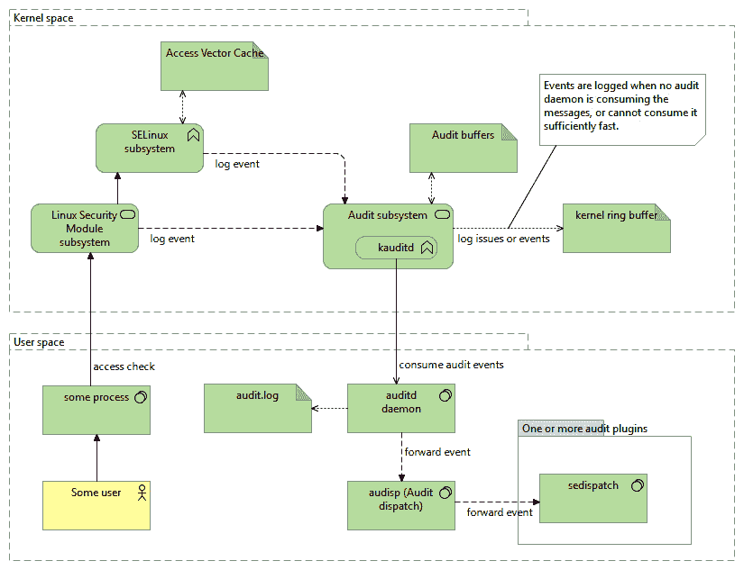

# *第二章*：理解 SELinux 决策和日志记录

一旦我们在系统上启用 SELinux，它就会启动其访问控制功能，如上一章所述。一旦启动，管理员需要密切关注其行为，并且通常需要处理如果一个或多个应用程序未按照 SELinux 策略运行时的意外行为。通过 SELinux 日志记录，我们了解 SELinux 如何对系统上的应用程序执行其策略。

管理员需要了解如何在 SELinux 的完全强制模式（类似于基于主机的入侵防御系统）与其宽容日志记录模式之间切换，并使用其各种方法切换 SELinux 的状态（启用或禁用；宽容或强制）。此外，我们还应了解如何禁用 SELinux 对单个域的强制执行，而不是整个系统，并学习如何解释 SELinux 日志事件，这些事件描述了 SELinux 阻止了哪些活动。最后，我们将介绍一些常见的方法，用于在日常操作中分析这些日志事件。

在本章中，我们将涵盖以下主要主题：

+   开启和关闭 SELinux

+   SELinux 日志记录与审计

+   获取拒绝请求的帮助

# 技术要求

查看以下视频，了解代码的实际操作：[`bit.ly/3dFaUXm`](https://bit.ly/3dFaUXm)

# 开启和关闭 SELinux

这也许是一个奇怪的开始部分，但禁用 SELinux 是一个常见的请求活动。一些供应商不支持其应用程序在启用 SELinux 的平台上运行，因为这些供应商没有开发 SELinux 策略的专业能力，或者无法培训自己的支持团队来处理 SELinux。

此外，系统管理员通常不愿使用他们不理解或觉得过于复杂的安全控制。幸运的是，SELinux 正在成为多个 Linux 发行版中的事实标准技术，这增加了其在管理员中的曝光度和理解。SELinux 还能够选择性地禁用其访问控制，仅针对系统的一部分，而不是要求我们禁用整个系统。

## 设置全局 SELinux 状态

SELinux 支持三种主要的状态：`disabled`、`permissive`和`enforcing`。这些状态通过`/etc/selinux/config`文件中的`SELINUX`变量进行设置，如以下代码片段所示：

```
$ grep ^SELINUX= /etc/selinux/config
SELINUX=enforcing
```

当`init`系统进程加载 SELinux 策略时，SELinux 代码会检查管理员配置的状态。各个状态的描述如下：

+   如果状态为`disabled`，则 SELinux 代码会禁用进一步的支持，系统启动时不会激活 SELinux。

+   如果状态是`宽容`，则表示 SELinux 处于活动状态，但不会强制执行其政策。相反，SELinux 会报告任何违反政策的行为，但不会阻止这些行为本身。这有时被称为**主机入侵检测**，因为它仅在报告模式下工作。

+   如果状态是`强制`，则表示 SELinux 处于活动状态，并将强制执行其政策。违反规则的行为会被报告并拒绝。这有时被称为**主机入侵防护**，因为它在执行规则的同时记录其采取的操作。

我们可以使用`getenforce`命令或`sestatus`命令获取 SELinux 当前状态的信息，如下所示：

```
$ sestatus | grep mode
Current mode:	enforcing
$ getenforce
Enforcing
```

也可以查询`/sys/fs/selinux/enforce`伪文件来获取类似的信息。如果该文件返回`1`，则 SELinux 处于强制模式。如果返回`0`，则处于宽容模式。以下代码片段显示 SELinux 处于强制模式：

```
$ cat /sys/fs/selinux/enforce
1
```

当我们修改`/etc/selinux/config`文件时，需要重启系统以使更改生效。然而，如果我们启动一个不支持 SELinux 的系统（`禁用`），仅重新启用 SELinux 支持是不够的：管理员还需要确保系统上的所有文件都已重新标记（所有文件的上下文需要被设置）。如果没有 SELinux 支持，Linux 会创建和更新文件，但不会更新或设置这些文件的 SELinux 标签。当系统后来重新启动并启用 SELinux 支持时，除非重新设置标签，否则 SELinux 将无法知道文件的上下文。

文件系统重新标记的内容在*第四章*，*使用文件上下文和进程域*中有介绍。

在很多情况下，当管理员发现 SELinux 阻止某些任务时，他们常常想禁用 SELinux。这样做至少可以说是草率的，原因如下：

+   SELinux 是一个安全组件——操作系统的一部分。禁用 SELinux 就像禁用防火墙，因为它在阻止某些通信。虽然禁用 SELinux 可能帮助快速让某些功能恢复工作，但这实际上是在移除本来是为了保护你的安全措施。

+   就像防火墙一样，SELinux 是通过规则进行配置的。如果某个应用程序无法正常工作，我们需要更新该应用程序的规则，就像更新额外的防火墙规则以启用特定的网络流量一样。我们将在*第五章*，*控制网络通信*中开始更新 SELinux 策略规则。

+   在最坏的情况下，当我们希望无条件允许应用程序执行的每一个操作时，我们仍然可以保持 SELinux 启用，并将该应用程序运行在一个不受限制的 SELinux 域中，称为*宽容*域。

各个发行版在将 SELinux 集成到产品中付出了大量的努力，并且提供了优秀的支持渠道，以防万一一切失败时帮助你。

## 切换到宽容模式或强制模式

大多数发行版提供的 Linux 内核允许通过一个简单的管理命令在强制模式和宽松模式之间切换。这个功能被称为`CONFIG_SECURITY_SELINUX_DEVELOP`内核配置参数。如果启用该内核参数，Linux 内核也会首先以宽松模式启动，除非设置了特定的启动选项（`enforcing=1`）。

尽管我们可以认为这种开发模式存在风险（恶意用户只需要将 SELinux 切换到宽松模式就能禁用其访问控制），但切换模式需要强大的管理权限（例如`root`用户拥有的权限），而大多数应用程序领域并不具备这种权限。

切换宽松模式和强制模式的命令是`setenforce`命令。它接受一个参数：`0`（宽松模式）或`1`（强制模式）。该命令也允许使用`permissive`和`enforcing`字符串。

改动会立即生效。例如，我们可以使用以下命令切换到宽松模式：

```
# setenforce 0
```

`setenforce`的效果与将正确的整数值写入`/sys/fs/selinux/enforce`伪文件的效果相同，如下代码片段所示：

```
# echo 0 > /sys/fs/selinux/enforce
```

在修改系统以正确使用 SELinux 时，切换宽松模式和强制模式可能对策略开发人员或系统管理员很有用。我们也可以用它来快速验证应用程序警告或错误是否由于 SELinux 访问控制引起—假设该应用程序没有 SELinux 感知，我们将在*理解 SELinux 感知的应用程序*部分讨论这个问题。

在生产系统上，可能需要禁用切换到宽松模式的能力。禁用此功能通常需要重新编译 Linux 内核，但 SELinux 策略开发人员也考虑了另一种不允许用户切换 SELinux 状态的方法。用户切换到宽松模式所需的权限是有条件的，系统管理员可以轻松切换此条件来禁用从强制模式切换回宽松模式的操作。这个条件是通过名为`secure_mode_policyload`的 SELinux 布尔值实现的，默认值为`off`（意味着允许切换 SELinux 状态）。

`on`或`off`（虽然`true`/`false`和`1`/`0`也是有效值），并操作活动的 SELinux 策略的部分。条件的值可以被持久化（意味着它们在重启后依然有效）或仅在当前启动会话期间有效。我们可以通过在`setsebool`命令中添加`-P`来使值在重启后持久化，如下所示：

```
# setsebool -P secure_mode_policyload on
```

SELinux 布尔值将在*第十二章*，*调优 SELinux 策略*中详细介绍。

使用`secure_mode_policyload` SELinux 布尔值允许管理员限制从强制模式切换回宽松模式。这并不会完全禁用 SELinux，只是切换它是否会执行其策略。

从禁用状态切换到运行状态是不被支持的。然而，反向操作是可能的，但只有在以下条件下：如果 Linux 内核是使用 `SECURITY_SELINUX_DISABLE` 内核配置参数构建的，那么像 `init` 这样的服务可以有效地在运行时禁用 SELinux，但前提是尚未加载 SELinux 策略。然而，这个功能并不推荐主动使用，它只为那些启动选项难以使用的平台引入。最近的内核将此功能标记为已弃用，因为此类平台数量很少。

## 使用内核启动参数

使用 `setenforce` 命令是有意义的，当我们希望在与系统交互时切换到宽松或强制模式。但如果我们需要在系统启动时设置呢？如果由于 SELinux 访问控制系统无法正常启动，我们就无法编辑 `/etc/selinux/config` 文件。幸运的是，我们还可以通过其他方式更改 SELinux 状态。

解决方案是使用内核启动参数。我们可以使用一个或两个启动参数来启动 Linux 系统，这些参数会优先于 `/etc/selinux/config` 设置，如下所示：

+   `selinux=0`：这通知系统完全禁用 SELinux，其效果与在配置文件中设置`SELINUX=disabled`相同。设置后，不会考虑其他参数（如`enforcing`）。请记住，启动一个禁用 SELinux 的系统意味着要再次启用它时，我们需要重新标记文件系统上的所有文件和资源。`selinux=` 参数通过 `CONFIG_SECURITY_SELINUX_BOOTPARAM` 内核配置得到支持。

+   `enforcing=0`：这通知系统以宽松模式运行 SELinux，其效果与在配置文件中设置`SELINUX=permissive`相同。

+   `enforcing=1`：这通知系统以强制模式运行 SELinux，其效果与在配置文件中设置`SELINUX=enforcing`相同。

假设有一个使用 GRUB2 作为引导加载程序的 Linux 系统，我们希望将 `enforcing=0` 添加到启动项中。为此，我们执行以下步骤：

1.  重启系统，直到 GRUB2 启动屏幕出现。

1.  使用箭头键导航到需要更改 SELinux 状态的启动项。这通常是默认的启动项，应该已经被选中。

1.  按 *E* 键编辑启动项行。在 GRUB2 倒计时归零之前进行此操作；否则，系统将继续启动。

1.  使用箭头键移动到以`options`开头的行的末尾。如果没有这样的行，请转到以`linux`、`linux16`或`linuxefi`开头的行的末尾。

1.  将 `enforcing=0` 添加到该行的末尾。

1.  按 *Ctrl* + *X* 或 *F10* 启动该项。

其他引导加载程序有类似的方式来更改启动行，但不会在每次重启时保持更改。有关更多详细信息，请参考您的发行版文档。

除了 SELinux 特定的参数外，还有一些与**Linux 安全模块**（**LSM**）相关的启动参数，尤其是在将多个 LSM 模块组合到同一系统中时，这些参数非常有用。它们的详细信息如下：

+   `lsm.debug`启动参数启用 LSM 初始化调试输出，显示实际启用或忽略了哪些 LSM 模块，以及哪些 LSM 模块被认为是排他的。

+   `lsm=lsm1,…,lsmN`选项选择 LSM 初始化的顺序。例如，要在锁定之前初始化 SELinux，可以使用`lsm=selinux,lockdown`。

+   `security=`启动参数启用选择活动的主要/独占 LSM 模块。然而，这个参数已经被弃用，推荐使用`lsm=`参数。

在生产环境中使用 SELinux 时，可能需要妥善保护启动菜单——例如，通过密码保护菜单并定期验证启动菜单文件的完整性。

## 禁用单个服务的 SELinux 保护

从版本 23（随 Linux 2.6.26 发布）开始，SELinux 还支持在宽松模式和强制模式之间更细粒度的切换方法：使用宽松领域。如前所述，域是 SELinux 用于指派给进程的类型（标签）的术语。通过**宽松领域**，我们可以将一个或多个领域标记为宽松（因此不受 SELinux 规则的强制执行），即使系统的其他部分仍在强制模式下运行。

要使某个领域变为宽松，可以使用`semanage`命令，方法如下：

```
# semanage permissive -a minidlna_t
```

使用相同的`semanage`命令，我们可以列出当前定义的宽松领域，如下所示：

```
# semanage permissive -l
Builtin Permissive Types
Customized Permissive Types
minidlna_t
```

在之前的示例中，你会注意到也有为*内建*的宽松类型留有空间。这些是由 Linux 发行版的政策开发者标记为宽松的领域。有些发行版选择首先以宽松模式引入新的应用政策，允许用户在强制执行之前测试这些政策。当这种情况发生时，你可以在`Builtin Permissive Types`下找到这些宽松领域。

列出自定义宽松类型（那些没有通过发行版标记为宽松的类型）的另一种方法是使用`semodule`命令。在前一章中，我们在讨论 SELinux 政策模块时简要提到过该命令。我们可以使用它列出名称中包含`permissive_`的 SELinux 政策模块，因为`semanage permissive`命令会生成一个小的 SELinux 政策模块，将域标记为宽松，下面的代码片段展示了这一过程：

```
# semodule -l | grep permissive_
permissive_minidlna_t
```

要从领域中移除宽松模式，可以将`-d`参数传递给`semanage`命令。不过，这只有在系统管理员将该领域标记为宽松时才可行——通过这种方式，无法将发行版提供的宽松领域切换为强制模式。下面的代码片段展示了这一点：

```
# semanage permissive -d minidlna_t
```

当一个域被标记为宽松模式时，应用程序的行为应该就像系统上没有启用 SELinux 一样（SELinux 不会强制执行该特定应用程序/域的任何操作），这使得我们更容易发现 SELinux 是否真的引发了权限问题。不过，请注意，其他域（包括与宽松域交互的域）仍然受到 SELinux 访问控制的管理和强制执行。

## 理解 SELinux 感知应用程序

大多数应用程序本身并不知道它们正在运行在启用了 SELinux 的系统上。没有这一信息，宽松模式实际上意味着应用程序的行为就像最初没有启用 SELinux 一样。然而，一些应用程序积极依赖 SELinux 策略来做出访问控制决策，或与 SELinux 交互以获取更多信息。我们将这些应用程序称为**SELinux 感知**应用程序，因为它们会根据可用的 SELinux 相关信息改变其行为。

可惜的是，许多这些 SELinux 感知的应用程序并没有正确验证它们是否在宽松模式下运行。因此，在宽松域中运行这些应用程序（或整个系统处于宽松模式）通常不会导致应用程序的行为像 SELinux 没有启用一样。

这类应用程序的示例包括`init`系统、一些 cron 守护进程以及几个核心 Linux 实用程序（如`ls`和`id`）。即使 SELinux 没有处于强制模式，它们也可能会根据 SELinux 策略显示权限失败或不同的行为。

我们可以通过检查应用程序是否动态链接`libselinux`库来判断它是否是 SELinux 感知的。可以使用`readelf`、`ldd`或`objdump`进行此类检查，如下所示：

```
$ readelf -d /bin/ls | grep selinux
0x0000000000000001 (NEEDED)		Shared library: [libselinux.so.1]
$ ldd /bin/ls | grep selinux
libselinux.so.1 => /lib64/libselinux.so.1 (0x00005d415f3f03f0)
$ objdump -x /bin/ls | grep selinux
NEEDED	libselinux.so.1
```

知道一个应用程序是否是 SELinux 感知的，有助于故障排除，因为应用程序的行为在 SELinux 被禁用状态和宽松 SELinux 状态下可能仍然不同。

直到现在，我们一直关注启用或禁用 SELinux，从而关注的是细粒度或粗粒度的设置。但一旦启用 SELinux，它与管理员的交互将通过策略执行和日志记录来进行。那么，接下来让我们看看 SELinux 如何处理日志记录。

# SELinux 日志记录和审计

SELinux 开发人员明白，像 SELinux 这样的面向安全的子系统只有在具备增强的日志记录甚至调试能力时才能成功。SELinux 所执行的每个动作，作为它实现的 LSM 钩子的一部分，都应该是可审计的。拒绝（SELinux 阻止的操作）应始终记录下来，以便管理员采取相应的措施。SELinux 的调优和更改，例如加载新策略或更改 SELinux 布尔值，应该始终触发一个审计事件。

## 跟踪审计事件

默认情况下，SELinux 会将其消息发送到 Linux 审计子系统（假设 Linux 内核已配置为启用审计子系统，且通过`CONFIG_AUDIT`内核配置启用）。在那里，消息将被 Linux 审计守护进程（`auditd`）接收并记录在`/var/log/audit/audit.log`文件中。发行版和管理员可以通过配置审计调度进程（`audisp`）来定义额外的处理规则，该进程负责接收审计事件并将它们分发给一个或多个单独的进程。SELinux 故障排除守护进程（`setroubleshootd`），一个用于帮助故障排除 SELinux 事件的可选服务，通过此方式获取审计事件。

审计事件流在该图中展示：



图 2.1 – SELinux 生成的审计事件流

启用 SELinux 后，（几乎）每个导致拒绝的权限检查都会被记录。当启用 Linux 审计时，这些拒绝将默认通过审计守护进程记录在`audit.log`文件中。如果审计守护进程不可用，事件将存储在 Linux 内核消息缓冲区中，我们可以通过`dmesg`命令查看。内核消息缓冲区中的事件也常常通过系统日志记录器捕获。

如果安装了 SELinux 故障排除守护进程，则审计守护进程除了记录日志外，还会通过审计调度系统将事件分发到`sedispatch`命令。该命令将进一步处理事件，并通过 D-Bus（Linux 系统上流行的系统总线实现）将其发送到 SELinux 故障排除守护进程。该守护进程将分析事件，并可能向管理员建议一个或多个修复方案。我们将在*获取拒绝帮助*部分中介绍 SELinux 故障排除守护进程。

每当 SELinux 验证特定的访问时，它并不总是遍历整个策略。相反，它有一个**访问向量缓存**（**AVC**），在其中存储之前访问尝试的结果。这个缓存确保 SELinux 能够快速响应活动，同时对性能的影响很小。我们注意到这个缓存的缩写作为大多数 SELinux 事件的消息类型，如以下示例开始时所示：

```
type=AVC msg=audit(03/22/2020 12:15:38.557:2331): avc: denied { read } for pid=12569 comm="dmesg" name="xterm-256color" dev="sdb2" ino=131523 scontext=sysadm_u:sysadm_r:dmesg_t:s0-s0:c0.c1023 tcontext=system_u:object_r:etc_t:s0 tclass=file permissive=0
```

当 Linux 内核检查权限请求时，这个请求被表示为*访问向量*，然后会查询缓存以快速找到合适的响应。如果缓存中有正确的访问向量，则决策来自缓存；否则，SELinux 子系统会查阅策略并更新缓存。当然，当加载新的策略或动态调整策略时，SELinux 会使缓存无效。这确保了所有的权限检查都符合活动的策略。

SELinux 的内部工作原理与大多数管理员关系不大，但至少现在我们知道了术语*AVC*的来源。

## 调整 AVC

可以通过设置缓存或相关表的大小来稍微调整 AVC。

我们可以通过 `/sys/fs/selinux/avc/cache_threshold` 伪文件（如果设置了 `CONFIG_SECURITY_SELINUX_AVC_STATS` 内核配置）来配置缓存大小。例如，要将缓存大小增加到 768 条目（默认值为 512），可以使用以下命令：

```
# echo 768 > /sys/fs/selinux/avc/cache_threshold
```

要确认缓存阈值，请读取文件，如下所示：

```
# cat /sys/fs/selinux/avc/cache_threshold
768
```

AVC 哈希统计信息可以通过 `hash_stats` 伪文件访问，如以下代码片段所示：

```
$ cat /sys/fs/selinux/avc/hash_stats
entries: 506
buckets used: 233/512
longest chain: 5
```

如果你怀疑系统性能下降是由于 SELinux，建议你查看 `hash_stats` 中的 `longest chain` 输出。如果它大于 10，则可能会影响性能，更新缓存大小可能有助于解决问题。

`avcstat` 命令显示缓存随时间变化的情况（第一个数字是自启动以来的总数）。当缓存未命中次数很高或波动，或者回收次数（淘汰最旧的缓存条目并将其重新用于新条目）波动时，可能需要增加缓存大小。命令如以下代码片段所示：

```
$ avcstat 5
lookups	hits		misses	allocs	reclaims	frees
58396334	58382324	14010		14010		10736		13511
591		591		0		0		0		0
1657		1653		4		4		0		0
```

最近的内核还允许通过内核配置参数设置使用的桶数（`CONFIG_SECURITY_SELINUX_SIDTAB_HASH_BITS`），其缓存统计信息可以通过 `/sys/fs/selinux/ss/sidtab_hash_stats` 伪文件查看，如以下代码片段所示：

```
$ cat /sys/fs/selinux/ss/sidtab_hash_stats
entries: 285
buckets use: 55/512
longest chain: 3
```

另一个性能参数是内部 `CONFIG_SECURITY_SELINUX_SID2STR_CACHE_SIZE` 设置的大小。

## 开启更多日志记录

有一个重要的 SELinux 策略指令可以控制哪些操作被（不）审计，那就是 `dontaudit`。SELinux 策略中的 `dontaudit` 规则告诉 SELinux 访问拒绝不应该被记录。这是唯一一个 SELinux 不会记录拒绝的例子——SELinux 策略编写者明确禁用了事件的审计。这通常是为了减少日志的杂乱，隐藏那些对系统安全没有影响的外观性拒绝。

`seinfo` 工具可以告诉我们当前有多少条这些规则，以及其兄弟规则 `auditallow`（即使政策允许，也记录事件），如以下代码片段所示：

```
$ seinfo | grep -i audit
Auditallow:	1	Dontaudit:		5559
Auditallowxperm:	0	Dontauditxperm:	   0
```

幸运的是，我们可以随意禁用这些 `dontaudit` 规则。通过以下 `semodule` 命令，这些规则将从活动策略中移除：

```
# semodule –-disable_dontaudit –-build
```

这些参数也可以分别缩写为 `-D` 和 `-B`。要重新启用 `dontaudit` 规则，只需像下面这样重新构建策略：

```
# semodule -B
```

禁用 `dontaudit` 规则有时有助于排查那些没有产生有用审计事件的故障。然而，通常情况下，策略编写者标记为外观性的审计事件并不是故障的原因。

## 配置 Linux 审计

当 Linux 内核审计子系统未配置或 Linux 审计守护程序未运行时，SELinux 将尝试使用审计子系统并退回到常规系统日志记录。

对于 Linux 审计，通常不需要配置任何东西，因为 SELinux AVC 拒绝默认会被记录。您会在审计日志文件（`/var/log/audit/audit.log`）中找到这些拒绝信息，通常与同一操作相关的系统调用和其他事件消息一起记录，如下面的代码片段所示：

```
type=PROCTITLE msg=audit(...) : proctitle=ping 8.8.8.8 
type=SYSCALL msg=audit(...) : arch=x86_64 syscall=socket success=no exit=EACCES(Permission denied) a0=inet a1=SOCK_DGRAM a2=icmp a3=0x7fffac013050 items=0 ppid=2685 pid=17292 auid=admin uid=root gid=root euid=root suid=root fsuid=root egid=root sgid=root fsgid=root tty=tty1 ses=1 comm=ping exe=/bin/ping subj=sysadm_u:sysadm_r:ping_t:s0-s0:c0.c1023 key=(null) 
 type=AVC msg=audit(...) : avc:  denied  { create } for  pid=17292 comm=ping scontext=sysadm_u:sysadm_r:ping_t:s0-s0:c0.c1023 tcontext=sysadm_u:sysadm_r:ping_t:s0-s0:c0.c1023 tclass=icmp_socket permissive=0 
```

要配置审计系统的目标日志文件，请在`/etc/audit/auditd.conf`中使用`log_file`参数。

要启用远程审计日志记录（将多个主机的审计事件集中到单个系统上），您可以选择启用 Syslog 转发或启用`audisp-remote`插件。

使用 Syslog 转发时，配置审计调度守护程序将审计事件发送到本地系统记录器。然后，管理员需要配置本地系统记录器以向远程系统传递事件。

信息提示

使用 Syslog 转发的优点是在服务器上集中其日志事件时不需要额外的软件部署和守护程序。因此，即使在环境中引入了硬化设备，该设置也可以重复使用。当然，还存在其他可以监视日志事件并将其发送到中央服务器的日志管理解决方案。但是，这些解决方案需要更多的配置，并引入额外的软件代理进行安装。

编辑`/etc/audit/plugins.d/syslog.conf`文件，并将`active`设置为`yes`，如下所示：

```
# vi /etc/audit/plugins.d/syslog.conf
active = yes
direction = out
path = /sbin/audisp-syslog
type = always
args = LOG_INFO
format = string
```

尽管使用系统记录器来集中审计事件可能不是最佳选择，因为系统记录器通常使用未加密的——甚至未保证——数据传递。通过`audisp-remote`插件，我们甚至可以使用加密通道发送审计事件，并向远程的`auditd`服务器提供保证的传递。

首先，在目标（日志）服务器上配置审计守护程序，使其能够通过在端口`60`上启用审计守护程序来接收来自远程主机的审计日志。我们还将事件格式设置为丰富值，并向事件添加主机名，以便区分来自多个主机的事件，如下所示：

```
# vi /etc/audit/auditd.conf
tcp_listen_port = 60
log_format = ENRICHED
name_format = HOSTNAME
audisp-remote plugin to connect to the target server's audit daemon, as follows:
# vi /etc/audit/audisp-remote.conf
remote_server = <targethostname>
port = 60
```

最后，启用`audisp-remote`插件，如下所示：

```
# vi /etc/audit/plugins.d/au-remote.conf
active = yes
```

不要忘记重新启动审计守护程序，以使更改生效。

我们强烈建议您始终使用 Linux 审计子系统。它不仅与故障排除实用工具很好地集成；管理员还可以使用审计工具查询审计日志，甚至生成报告，例如使用`aureport`，如下面的代码片段所示：

```
# aureport --avc --start recent
AVC Report
===============================================================
# date time comm subj syscall class permission obj result event
===============================================================
...
7\. 03/21/2020 19:40:55 sudo sysadm_u:sysadm_r:sysadm_sudo_t:s0-s0:c0.c1023 257 dir search sysadm_u:sysadm_r:sysadm_t:s0-s0:c0.c1023 denied 1067
...
10\. 03/21/2020 19:48:19 dmesg sysadm_u:sysadm_r:dmesg_t:s0-s0:c0.c1023 21 file read system_u:object_r:etc_t:s0 denied 1080
```

Linux 审计系统是 Linux 管理员的重要助手，不仅限于 SELinux 故障排除。除了 Linux 审计系统之外，事件还可以被定向到本地系统日志记录器，下面将进一步解释。

## 配置本地系统日志记录器

当审计未启用，或 Linux 审计守护进程未运行时，系统日志记录器负责捕获 SELinux 事件。系统日志记录器将通过内核日志设施（`kern.*`）记录这些事件。大多数系统日志记录器会将这些内核日志事件保存到一个通用日志文件中，例如`/var/log/messages`。

我们可以配置系统日志记录器，将 SELinux AVC 消息定向到它自己的日志文件，例如`/var/log/avc.log`。例如，对于`rsyslog`系统日志记录器，我们可以在`/etc/rsyslog.d`目录下添加一个名为`99-selinux.conf`的配置条目，内容如下：

```
# vi /etc/rsyslog.d/99-selinux.conf
:msg, contains, "avc: "	-/var/log/avc.log
```

重启系统日志记录器后，关于 AVC 的相关信息将会出现在`/var/log/avc.log`文件中。

当本地系统日志记录器处理 SELinux 日志时，快速获取最新的 AVC 拒绝信息（或其他信息）的一种简单方法是通过`dmesg`命令，如下所示的代码片段所示：

```
# dmesg | grep avc | tail
```

但是要注意，与审计日志不同，许多系统允许普通用户读取`dmesg`内容。这可能导致一些信息泄漏给不受信任的用户。因此，一些 SELinux 策略不允许普通用户访问内核环形缓冲区（因此也无法使用`dmesg`），除非`user_dmesg` SELinux 布尔值设置为`on`，如下所示的代码片段所示：

```
# setsebool user_dmesg on
```

然而，`user_dmesg` SELinux 布尔值在 CentOS 上不可用。在 CentOS 中，只有标准的非限制用户类型和管理员用户类型可以访问内核环形缓冲区。为了防止其他用户读取这些信息，您需要将这些用户映射到非管理员的 SELinux 用户，例如`user_u`或`(x)guest_u`，这将在本书后续部分进一步描述。

## 阅读 SELinux 拒绝信息

每个人在使用 SELinux 系统时，都会多次读取和解释 SELinux 拒绝信息。当 SELinux 禁止访问并且没有`dontaudit`规则来隐藏它时，SELinux 会记录该信息。如果没有任何记录，可能不是 SELinux 导致了失败。请记住：SELinux 在 Linux**自愿访问控制**（**DAC**）检查之后执行，因此如果常规权限不允许某项活动，SELinux 就不会被咨询。

当 SELinux 阻止某些访问发生时，SELinux 拒绝信息会被记录。处于强制模式时，应用程序通常会返回**权限被拒绝**的错误，尽管有时可能会更加模糊。以下代码片段展示了一个例子：

```
$ ls /proc/1
ls: cannot access '/proc/1': Permission denied
# ls -ldZ /proc/1
dr-xr-xr-x. 9 root system_u:system_r:init_t:s0 0 Mar 21 10:54 /proc/1
```

那么，拒绝信息是什么样子的呢？以下命令输出展示了来自审计子系统的拒绝信息，我们可以通过`ausearch`命令进行查询：

```
# ausearch -m avc -ts recent -i
type=AVC msg=audit(03/22/2020 12:15:38.557:2331): avc: denied { read } for pid=12569 comm="dmesg" name="xterm-256color" dev="sdb2" ino=131523 scontext=sysadm_u:sysadm_r:dmesg_t:s0-s0:c0.c1023 tcontext=system_u:object_r:etc_t:s0 tclass=file permissive=0
```

让我们将这个拒绝日志分解成各个组成部分。以下列表提供了关于每个部分的更多信息。作为管理员，学会如何阅读拒绝日志非常重要，所以要花足够的时间学习：

+   `enforcing` 模式。通常是 `denied`，尽管某些操作会明确标记为审计操作，也会导致 `granted`。例如：`denied`

+   `{ read }`

+   `pid=12569`

+   `comm="dmesg"`

+   `name="xterm-256color"`

+   `dev="sdb2"`

+   `ino=131523`

+   `scontext=sysadm_u:sysadm_r:dmesg_t:s0-s0:c0.c1023`

+   `tcontext=system_u:object_r:etc_t:s0`

+   `tclass=file`

+   `0`，表示 SELinux 处于强制模式；否则，它处于宽容模式（无论是对系统还是对特定域）。例如：`permissive=0`

我们可以这样解读前面的拒绝：SELinux 拒绝了 `dmesg` 命令读取名为 "`xterm-256color`" 的文件。该文件在设备 `/dev/sdb2` 上的 inode 编号是 `131523`，并被标记为 `etc_t`。`dmesg` 命令的 PID 是 `12569`，并被标记为 `dmesg_t`。`dmesg_t` 域并未处于宽容模式。

根据操作和目标类别，SELinux 使用不同的字段提供我们解决问题所需的所有信息。考虑以下拒绝：

```
type=AVC msg=audit(03/22/20 18:12:52.177:2326): avc:  denied  { name_bind } for  pid=15983 comm="nginx" src=89 scontext=system_u:system_r:httpd_t:s0 tcontext=system_u:object_r:reserved_port_t:s0 tclass=tcp_socket permissive=0
```

前面的拒绝发生是因为 nginx web 服务器被配置为监听非默认端口（使用 89 而不是默认的 80）。

识别问题是理解操作方式并正确阅读拒绝日志的问题。拒绝日志给了我们足够的信息，可以帮助我们入手，并清楚地了解被拒绝的内容。

管理员可能希望更新 SELinux 策略以允许特定操作（通过向 SELinux 策略中添加 `allow` 规则，如本书后面所述）。然而，这并不总是正确的做法，因为还有其他选项，通常更好，例如：

+   为目标资源提供正确的标签（通常当目标是非默认端口、非默认位置等时会出现）

+   切换布尔值（标志，用于操作 SELinux 策略）以允许额外的权限

+   为源进程提供正确的标签（通常当操作的应用程序不是通过发行版包管理器安装时会出现）

+   按预期使用应用程序，而不是通过其他方式使用（因为 SELinux 只允许预期行为），例如通过服务启动守护进程（`init` 脚本或 systemd 单元），而不是通过命令行操作

如果前面的 nginx 示例是想要的配置（使用非默认端口），那么我们应该将该端口标记为 `httpd_t` 域，以便绑定到（许多）其他端口。

## 其他与 SELinux 相关的事件类型

虽然大多数 SELinux 日志事件与 AVC 相关，但它们并不是管理员必须处理的唯一事件类型。大多数审计事件会将 SELinux 信息作为事件的一部分显示，尽管 SELinux 与事件本身关系不大，但一些审计事件类型与 SELinux 直接相关。

提示

所有可能的审计事件的完整列表可以在`linux/audit.h`头文件中找到，该文件位于`/usr/include`目录下。

### USER_AVC

`USER_AVC`事件类似于常规的 AVC 审计事件，但源头是一个用户空间对象管理器。这些是使用 SELinux 策略规则的应用程序，但它们自己执行这些规则，而不是通过内核。

以下示例是由 D-Bus 生成的这样的事件：

```
type=USER_AVC msg=audit(03/22/2020 11:25:56.123:154) : pid=540 uid=dbus auid=unset ses=unset subj=system_u:system_r:system_dbusd_t:s0-s0:c0.c1023 msg='avc:  denied  { acquire_svc } for service=com.redhat.tuned spid=1460 scontext=system_u:system_r:tuned_t:s0 tcontext=system_u:system_r:tunned_t:s0 tclass=dbus permissive=0  exe=/usr/bin/dbus-daemon sauid=dbus hostname=? addr=? terminal=?'
```

该事件有两个部分。直到`msg=`字符串之前的所有内容都是关于生成该事件的用户空间对象管理器的信息，是事件的第一部分。实际事件本身（即第二部分）存储在`msg=`部分，其中包括与常规 AVC 类似的字段。

### SELINUX_ERR

当 SELinux 检测到一般的策略违规而不是访问控制违规时，会产生一个`SELINUX_ERR`事件。仅通过允许操作，SELinux 策略编写者无法解决此问题。这些事件通常指向应用程序和服务的误用，而这些应用程序和服务并非根据策略来完成的，以下代码片段展示了一个示例：

```
type=PATH msg=audit(03/22/2020 12:25:53.104:2364) : item=0 name=/usr/sbin/rpc.nfsd inode=3019958 dev=08:12 mode=file,755 ouid=root ogid=root rdev=00:00 obj=system_u:object_r:nfsd_exec_t:s0 nametype=NORMAL cap_fp=none cap_fi=none cap_fe=0 cap_fver=0 cap_frootid=0
type=SELINUX_ERR msg=audit(03/22/2020 12:25:53.104:2364) : op=security_compute_sid invalid_context=sysadm_u:sysadm_r:nfsd_t:s0-s0:c0.c1023 scontext=sysadm_u:sysadm_r:sysadm_t:s0-s0:c0.c1023 tcontext=system_u:object_r:nfsd_exec_t:s0 tclass=process 
```

在上述示例中，一个用户（运行在`sysadm_t`域中）正在执行`rpc.nfsd`（标签为`nfsd_exec_t`），而策略希望过渡到`nfsd_t`域。然而，这导致了一个完整的上下文`sysadm_u:sysadm_r:nfsd_t:s0-s0:c0.c1023`，这是一个无效的上下文。`sysadm_r` SELinux 角色不支持`nfsd_t`域。

### MAC_POLICY_LOAD

每当系统将新的 SELinux 策略加载到内存中时，都会发生`MAC_POLICY_LOAD`事件。这通常发生在管理员加载新的或更新的 SELinux 策略模块、重新构建策略并禁用`dontaudit`规则，或切换管理员希望在重启后持续生效的 SELinux 布尔值时。这样的事件如下代码片段所示：

```
type=MAC_POLICY_LOAD msg=audit(03/22/2020 12:28:17.077:2368) : auid=admin ses=1 lsm=selinux res=yes
```

当发生`MAC_POLICY_LOAD`事件时，您可能会注意到随后会有一个`USER_MAC_POLICY_LOAD`事件。这发生在用户空间对象管理器检测到 SELinux 策略更新并采取行动时。请注意，并非所有用户空间对象管理器都会发送此事件：某些对象管理器会查询实时策略，因此，在加载新策略时不需要采取任何行动。

### MAC_CONFIG_CHANGE

当 SELinux 布尔值发生变化但未保持时，会触发`MAC_CONFIG_CHANGE`事件。这告诉管理员，活动策略已被指示稍微改变其行为，但仍在现有加载策略的范围内。这样的事件如下代码片段所示：

```
type=MAC_CONFIG_CHANGE msg=audit(03/22/2020 12:29:49.564:2370) : bool=virt_use_nfs val=0 old_val=1 auid=admin ses=1
```

在上述示例中，`virt_use_nfs` SELinux 布尔值从 1（开启）更改为 0（关闭）。

### MAC_STATUS

当 SELinux 执行状态发生变化时，会出现`MAC_STATUS`事件。例如，当管理员使用`setenforce 0`将 SELinux 置于宽容模式时，就会发生以下事件：

```
type=MAC_STATUS msg=audit(03/22/2020 12:30:45.200:2372) : enforcing=0 old_enforcing=1 auid=admin ses=1 enabled=1 old-enabled=1 lsm=selinux res=yes
```

`MAC_STATUS`还用于通知管理员，当 SELinux 状态本身（启用或禁用）发生变化时。

### NetLabel 事件

NetLabel 是一个 Linux 内核项目，旨在支持标记的网络数据包，允许诸如 SELinux 上下文之类的安全上下文在主机之间传递。Linux 中 NetLabel 实现支持的协议之一是**公共 IP 安全选项**（**CIPSO**）标记，我们将在*第五章*中详细讲解，*控制网络通信*。

以下审计事件与 NetLabel 功能相关：

+   `MAC_UNLBL_STCADD`和`MAC_UNLBL_STCDEL`事件在添加或删除静态标签时触发。静态标签意味着，如果数据包被接收或发送时没有标签，则会分配这个“默认”静态标签。

+   `MAC_MAP_ADD`和`MAC_MAP_DEL`事件在将标记协议（如 CIPSO）与其针对 LSM（SELinux）域的参数之间的映射添加或从配置中删除时触发。

+   `MAC_CIPSOV4_ADD`和`MAC_CIPSOV4_DEL`事件在添加或删除 CIPSO（IPv4）配置时触发。

### 标记的 IPsec 事件

Linux 支持的另一个标记网络协议是**标记的 IPsec**，其中**IPsec**是**信息协议安全**的缩写。通过这个协议，源进程的 SELinux 上下文（通过 IPsec 隧道与目标资源通信）会被 IPsec 守护进程在隧道的两端所知晓。此外，SELinux 将包含关于哪些域可以通过 IPsec 隧道进行通信，哪些域可以在网络上互相通信的规则。

以下审计事件与 IPsec 相关：

+   `MAC_IPSEC_ADDSA`和`MAC_IPSEC_DELSA`事件在添加或删除安全关联时使用（定义或删除新的 IPsec 隧道）。

+   `MAC_IPSEC_ADDSPD`和`MAC_IPSEC_DELSPD`事件在添加或删除安全策略定义时使用。安全策略通常描述网络数据包是否需要通过 IPsec 进行处理，如果是的话，通过哪个安全关联进行处理。

+   `MAC_IPSEC_EVENT`事件是 IPsec 审计消息的通用事件。

本书后续将进一步描述 SELinux 对标记的 IPsec 的支持。

## 使用 ausearch

`ausearch`命令是 Linux 审计框架的一部分，是查询存储在系统上的审计事件的常用命令。在我们第一次查看 AVC 拒绝时已简要介绍过它，但简单提及并不能充分体现它的作用。

使用`ausearch`，我们可以搜索在选定时间段内或之后发生的事件。我们过去使用了`-ts recent`（时间起始）选项，它显示过去 10 分钟内发生的事件。该参数也可以是时间戳。其他支持的简写值如下：

+   `today`，表示从当天午夜 1 秒钟开始

+   `yesterday`，表示从前一天午夜 1 秒钟开始

+   `this-week`，`this-month`，或`this-year`，意味着从当前周、当前月或当前年第一天的午夜 1 秒开始

+   `checkpoint`，使用在前一次运行时创建的检查点文件中的时间戳

+   `boot`，意味着只显示自系统启动以来的事件

+   `week-ago`，意味着从正好 7 天前的午夜 1 秒开始

使用`checkpoint`尤其在排查 SELinux 问题时非常有用，因为它允许我们显示自上次调用`ausearch`命令以来的拒绝事件（及其他 SELinux 事件）。下面的代码片段中进行了说明：

```
# ausearch --checkpoint /root/ausearch-checkpoint.txt -ts checkpoint
```

这使得管理员能够进行小范围的调整并重现问题，只查看从那时起发生的事件，而不是一次又一次地查看所有事件。

默认情况下，`ausearch`命令会显示存储在审计日志中的所有事件。在繁忙的系统中，这可能会导致显示过于冗长的信息，并且可能会出现不需要的事件。幸运的是，用户可以通过`ausearch`命令限制查询事件的类型。

对于 SELinux 故障排除，使用`avc,user_avc,selinux_err`可以将事件精确地限制在处理工作所需的范围内，如下面的代码片段所示：

```
# ausearch -m avc,user_avc,selinux_err -ts recent
```

如果字段如用户 ID 和时间戳的数字显示过于混乱，那么`ausearch`可以查找并转换用户 ID 为用户名，时间戳为格式化的时间字段。添加`-i`选项到`ausearch`命令，它将解释这些字段并显示已解释的值。

在本节中，我们已了解 SELinux 如何通过日志事件通知系统其操作，以及这些日志事件存储的位置。在下一节中，我们将探讨如何处理这些事件。

# 获取关于拒绝的帮助

在某些发行版中，提供了额外的支持工具，帮助我们识别拒绝的原因。这些工具具有一些常见错误的知识（例如，设置文件的正确上下文以允许 Web 服务器读取它们）。其他发行版则要求我们凭借经验做出正确的决定，通过发行版的邮件列表、错误跟踪网站以及其他合作渠道（例如**Internet Relay Chat**（**IRC**））提供支持。

## 使用 setroubleshoot 进行故障排除

在 CentOS（以及其他**Red Hat Enterprise Linux**（**RHEL**）相关发行版，如 Fedora）中，提供了额外的工具，帮助我们排除拒绝问题。这些工具协同工作，捕捉拒绝事件，寻找合理的解决方案，并向管理员报告拒绝及其建议的解决方法。

在图形工作站上使用时，拒绝事件甚至会弹出提示，要求管理员立即查看。安装`setroubleshoot`包以获得此支持。在没有图形环境的服务器上，管理员可以在系统日志中查看信息，或者甚至可以配置系统通过电子邮件发送 SELinux 拒绝消息。安装`setroubleshoot-server`包以获得此支持。

在后台，触发审计事件调度程序应用程序（`audispd`）的是审计守护进程。这个应用程序支持插件功能，SELinux 团队十分感激地实现了这一点。他们构建了一个名为`sedispatch`的应用程序，它将作为`audispd`的插件。`sedispatch`应用程序会检查审计事件是否为 SELinux 拒绝事件，如果是，它会将事件转发到 D-Bus。D-Bus 然后将事件转发给`setroubleshootd`应用程序（如果该应用程序尚未运行，则启动它），该应用程序分析拒绝事件并为管理员提供反馈。

在工作站上运行时，会触发`seapplet`，在管理员的工作站上显示弹出窗口。管理员可以选择**显示**以查看更多详情。不过，管理员无需图形用户界面也能得知 SELinux 问题。你可以在文件系统中找到已分析的反馈，并且在系统日志中可以阅读如何轻松访问这些信息，如下面的代码片段所示：

```
Mar 22 11:40:35 ppubssa3ed setroubleshoot[1544]: SELinux is preventing /usr/sbin/nginx from name_bind access on the tcp_socket port 89\. For complete SELinux messages run: sealert -l f2914dba-04ef-44ca-9a0b-0f5e62ec72e4
```

我们可以通过`sealert`命令（如日志中所提到的）查看完整的解释，如下所示：

```
# sealert -l f2914dba-04ef-44ca-9a0b-0f5e62ec72e4
SELinux is preventing /usr/sbin/nginx from name_bind access on the tcp_socket port 89.
*****  Plugin bind_ports (99.5 confidence) suggests   ************************
If you want to allow /usr/sbin/nginx to bind to network port 89
Then you need to modify the port type.
Do
# semanage port -a -t PORT_TYPE -p tcp 89
    where PORT_TYPE is one of the following: http_cache_port_t, http_port_t, jboss_management_port_t, jboss_messaging_port_t, ntop_port_t, puppet_port_t.
*****  Plugin catchall (1.49 confidence) suggests   **************************
...
```

`sealert`应用程序是一个命令行应用程序，它解析`setroubleshoot`守护进程存储的信息（存储在`/var/lib/setroubleshoot`目录下）。

这将为我们提供一组选项来解决拒绝问题。在之前展示的与 Apache 相关的拒绝事件中，`sealert`给出了一个选项，并附有一定的信心分数。根据问题的不同，这个工具可能会显示多个选项，每个选项都有其自己的信心值（即，`sealert`对这是正确解决方法的确定程度）。

正如我们从这个例子中看到的，`setroubleshoot`应用程序本身使用插件来分析拒绝事件。这些插件（通过`setroubleshoot-plugins`包提供）会查看拒绝事件，检查它们是否与某个特定的、已知的用例匹配（例如，何时更改 SELinux 布尔值或何时目标资源具有错误的上下文），并向`setroubleshoot`提供反馈，表明插件对此的确定性，以便通过推荐的方法解决此拒绝事件。

## 当 SELinux 拒绝发生时发送电子邮件

一旦系统进行了微调且拒绝不再频繁发生，管理员可以选择让`setroubleshootd`在出现新拒绝时发送电子邮件。这真正增强了 SELinux 的主机入侵检测/防止能力，因为管理员不需要不断查看日志来获取信息。然而，请记住，这可能会导致电子邮件的突然激增，从而可能引发**拒绝服务**（**DoS**）- 类似的行为，如果触发了许多拒绝。管理员应该只有在其邮件基础设施具备速率限制或其他**服务质量**（**QoS**）控制时才实施此功能。

在文本编辑器中打开`/etc/setroubleshoot/setroubleshoot.conf`文件，找到`[email]`部分。更新参数以匹配本地邮件基础设施，如下所示：

```
# vi /etc/setroubleshoot/setroubleshoot.conf
[email]
recipients_filepath = /var/lib/setroubleshoot/email_alert_recipients
smtp_port = 25
smtp_host = localhost
from_address = selinux@infra.example.com
subject = [infra] SELinux Alert for host infra.example.com
```

接下来，编辑`email_alert_recipients`文件（通过`recipients_filepath`变量引用），并添加需要在 SELinux 警报出现时通知的电子邮件地址。

最后，重新启动 D-Bus 守护进程，如下所示：

```
# systemctl restart dbus
```

在非 systemd 系统上工作时，请使用以下命令：

```
# service dbus restart
```

需要重新启动 D-Bus，因为 D-Bus 管理`setroubleshootd`守护进程。

## 使用 audit2why

如果`setroubleshoot`和`sealert`在 Linux 发行版中不可用，我们仍然可以获得一些关于拒绝的信息。尽管它不像`setroubleshoot`提供的插件那样详细，但`audit2why`工具（即`audit2allow -w`的简称）确实提供了一些拒绝的反馈。遗憾的是，它并不总是能够正确推断。

让我们针对之前使用`sealert`的相同拒绝尝试一下，如下所示：

```
# ausearch -m avc -ts recent | audit2why
type=AVC msg=audit(1584880436.644:385): avc:  denied  { name_bind } for  pid=5119 comm="nginx" src=89 scontext=system_u:system_r:httpd_t:s0 tcontext=system_u:object_r:reserved_port_t:s0 tclass=tcp_socket permissive=0
  Was caused by:
    Missing type enforcement (TE) allow rule.
    You can use audit2allow to generate a loadable module to allow this access.
```

这里的`audit2why`工具没有考虑到目标位置的上下文是错误的，并建议更新策略，允许 Web 服务器绑定到`unreserved_port_t`类型，这与`setroubleshoot`提供的信息不同，后者更准确，推荐重新标记目标端口。

正如命令输出所提到的，还有一个叫做`audit2allow`的工具，可以将拒绝转换为 SELinux 策略。我们将在*第十二章*，“调优 SELinux 策略”中介绍`audit2allow`。

## 与 systemd-journal 交互

除了用于大多数 SELinux 日志记录和事件的 Linux 审计系统外，我们还可以通过其他日志系统收集信息。例如，systemd 的日志捕获 SELinux 上下文信息并与事件一起存储，允许管理员在查询日志时使用这些信息。

例如，要查看由与`system_u:system_r:sssd_t:s0`上下文相关的应用程序生成的`systemd-journal`中的事件，可以使用以下命令：

```
# journalctl _SELINUX_CONTEXT="system_u:system_r:sssd_t:s0"
-- Logs begin at Sun 2020-03-22 10:43:48 UTC, end at Sun 2020-03-22 12:40:12 UTC. --
Mar 22 10:43:51 ppubssa3ed sssd[545]: Starting up
Mar 22 10:43:51 ppubssa3ed sssd[be[implicit_files]][623]: Starting up
Mar 22 10:43:51 ppubssa3ed sssd[nss][630]: Starting up
```

因为`systemd-journal`添加了来源应用程序的 SELinux 上下文，因此恶意应用程序更难生成虚假事件。而常规的系统日志记录器只捕获字符串事件，`systemd-journal`从系统中检索 SELinux 上下文。使用 SELinux 上下文，可以轻松地跨不同但强相关的应用程序分组事件，并更高保证事件来自特定应用程序。

安装`bash-completion`包后，我们甚至可以使用它查看`systemd-journal`日志中存在的 SELinux 上下文，这使得查询日志变得更加容易，如下所示：

```
# journalctl _SELINUX_CONTEXT=<tab><tab>
kernel
system_u:system_r:auditd_t:s0
system_u:system_r:chronyd_t:s0
...
```

要查找与 nginx 相关的消息，请使用嵌入的`grep`过滤器，如下所示：

```
# journalctl -g nginx
-- Logs begin at Sun 2020-03-22 10:43:48 UTC, end at Sun 2020-03-22 12:52:26 UTC. --
Mar 22 11:40:32 ppubssa3ed systemd[1]: Starting The nginx HTTP and reverse proxy server...
Mar 22 11:40:32 ppubssa3ed nginx[1538]: nginx: the configuration file /etc/nginx/nginx.conf syntax is ok
Mar 22 11:40:32 ppubssa3ed nginx[1538]: nginx: [emerg] bind() to 0.0.0.0:89 failed (13: Permission denied)
...
Mar 22 11:40:35 ppubssa3ed setroubleshoot[1544]: SELinux is preventing /usr/sbin/nginx from name_bind access on the tcp_socket port 89\. For complete SELinux messages run: sealert -l f2914dba-04ef-44ca-9a0b-0f5e62ec72e4
```

嵌入的`grep`过滤器的好处在于，`journalctl`仍将显示多行消息，而实际通过`grep`重定向`journalctl`输出只会显示符合表达式的各个行。

## 使用常识

常识并不容易记录，但是当我们对文件标签（及其用途）有一些经验时，阅读拒绝通常会导致正确的解决方案。例如，如果我们收到有关 Web 服务器无法读取其文件的拒绝，并且文件的上下文是（例如）`user_home_t`，那么这应该是一个警示。最终用户的主文件，例如，使用`user_home_t`上下文，这对 Web 服务器读取的系统文件不合适。

确保目标资源的上下文正确的一个方法是使用`matchpathcon`进行验证。该实用程序根据 SELinux 策略返回应有的上下文，如下所示：

```
$ matchpathcon /srv/www/html/index.html
/srv/www/html/index.html	system_u:object_r:httpd_sys_content_t:s0
```

对于与文件和目录相关的拒绝，进行此操作可能有助于快速找到合适的解决方案。

此外，许多域都有特定的手册页面，告知读者每个域常用的类型，以及如何更详细地处理该域（例如，可用的布尔值、常见错误等）。这些手册页面以主要服务开头，并以`_selinux`为后缀，如下所示：

```
$ man ftpd_selinux
```

在大多数情况下，处理拒绝的方法最好描述如下：

+   目标资源标签（如文件标签）是否正确？可以使用`matchpathcon`进行验证，或与工作（可访问）资源的标签进行比较。

+   源标签（域）是否符合预期？SSH 守护进程应在`sshd_t`域中运行，而不是`init_t`域中。如果不是这种情况，请确保应用程序本身的标签（例如其可执行二进制文件）正确（再次使用`matchpathcon`进行验证）。

+   该拒绝是否可能由 SELinux 布尔值覆盖？如果是这样，策略可能已经具备了适当的规则，只需要更改 SELinux 布尔值即可。`setroubleshootd`会报告这种情况。通常，域的手册页（如`httpd_selinux`）也会覆盖可用的 SELinux 布尔值。我们将在*第十二章*《调整 SELinux 策略》中解释如何查询和调整 SELinux 布尔值。

更改文件标签将在*第四章*《使用文件上下文和进程域》中讨论。

在结束本节之前，常识将是管理 SELinux 拒绝的最有效方法，但前面提到的工具将是开始时的有力助手。

# 总结

在本章中，我们学习了如何启用和禁用 SELinux，既可以在整个系统级别操作，也可以通过各种方法在单个服务级别进行操作：内核启动选项、SELinux 配置文件或普通命令。其中一个命令是`semanage permissive`，它可以禁用单个服务的 SELinux 保护。

接下来，我们了解了 SELinux 如何记录事件及其解释方法，这也是管理员在处理 SELinux 时最常见的任务之一。为了帮助我们解释这些事件，我们可以使用`setroubleshoot`、`sealert`和`audit2why`等工具。我们还简要介绍了与 Linux 审计相关的几个工具，以帮助我们筛选各种事件。

在下一章中，我们将讨论 SELinux 系统中的第一个管理任务：管理用户账户、关联的 SELinux 角色，以及系统资源的安全权限。

# 问题

1.  在禁用 SELinux 之前，管理员应该尝试什么？

1.  管理员默认可以在哪里找到 SELinux 日志？

1.  我们如何知道一个应用程序是否支持 SELinux？

1.  AVC 的目的是什么？

1.  AVC 事件是 SELinux 的唯一事件类型吗？
