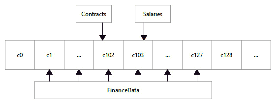

# 第三章：管理用户登录

当我们登录到启用 SELinux 的系统时，我们会收到一个 SELinux 上下文来工作。这个上下文包含了一个 SELinux 用户、一个 SELinux 角色、一个域，并且可选地包含一个敏感性范围。由于 SELinux 用户定义了可以访问的角色和类型，因此管理用户登录和 SELinux 用户是系统中配置终端用户的第一步。

为了启用正确配置的用户，我们将学习定义具有足够权限执行其工作职责的用户，从具有严格 SELinux 保护的普通用户到具有少量 SELinux 保护的完全特权的管理员用户。我们将创建并分配类别和敏感性，同时为用户分配角色，并使用各种工具切换角色。在本章的最后，我们将看到 SELinux 如何与 Linux 认证过程集成。

在本章中，我们将讨论以下主要内容：

+   面向用户的 SELinux 上下文

+   SELinux 用户和角色

+   处理 SELinux 角色

+   SELinux 与 PAM

# 技术要求

查看以下视频，观看代码实际操作：[`bit.ly/3jbASmr`](https://bit.ly/3jbASmr)

# 面向用户的 SELinux 上下文

一旦登录到系统，我们的用户将在某个特定上下文中运行。此用户上下文定义了我们作为用户在系统上的权限和特权。获取当前用户信息的命令`id`，也支持显示当前的 SELinux 上下文信息：

```
$ id -Z
unconfined_u:unconfined_r:unconfined_t:s0-s0:c0.c1023
```

在具有目标策略类型的 SELinux 系统上，所有用户的登录上下文通常都是`unconfined_u`（上下文的第一部分）。在更为受限的系统中，用户可以是`user_u`（普通受限用户）、`staff_u`（操作员）、`sysadm_u`（系统管理员）或其他任何 SELinux 用户。

SELinux 用户定义了用户可以切换到的角色。SELinux 角色本身定义了用户可以使用的应用域。默认情况下，系统上提供固定数量的 SELinux 用户，但管理员可以创建额外的 SELinux 用户。管理员的任务还包括将 Linux 登录名分配给 SELinux 用户。

另一方面，SELinux 角色不能通过管理员命令创建，因为 SELinux 角色是 SELinux 策略的一部分。为此，SELinux 策略需要通过额外的规则进行扩展，以创建角色。我们将在*第十五章*中讨论这个内容，*使用参考策略*。

要查看当前可用的角色，请使用`seinfo`：

```
# seinfo --role
Roles: 14
  auditadm_r
  dbadm_r
  ...
  xguest_r
```

SELinux 角色可以是粗粒度的（如`sysadm_r`）或更具功能导向的（如`dbadm_r`）。自定义的 SELinux 角色甚至可以非常细粒度，仅授予切换到受限领域的能力。

让我们看看如何创建和管理 SELinux 用户。

# SELinux 用户和角色

在启用 SELinux 的环境中，登录二进制文件调用`libselinux` API 来建立 SELinux 用户和本地用户之间的初始映射。然后，在找到正确的 SELinux 用户后，系统查找该用户应属于的角色和域，并将其设置为用户的上下文。

## 列出 SELinux 用户映射

登录系统后，我们可以使用`id -Z`来获取当前的 SELinux 上下文。对于许多用户而言，无论用户名是什么，该上下文将由未受限制的用户（`unconfined_u`）定义。如果不是这样，它通常是基于`sysadm_u`、`staff_u`或`user_u`中的一个上下文。这是因为大多数 Linux 发行版默认仅提供有限的一组 SELinux 用户，与它们支持的 SELinux 角色对齐。

在登录过程中，处理登录的服务进程将检查本地定义文件，以查找 Linux 账户与 SELinux 用户之间的适当映射。让我们通过`semanage login -l`查看现有的登录映射。以下输出是 CentOS 系统的默认输出：

```
# semanage login -l
Login Name		SELinux User	MLS/MCS Range	Service
__default__	unconfined_u	s0-s0:c0.c1023	*
root			unconfined_u	s0-s0:c0.c1023	*
```

命令的输出显示每行一个登录映射。每个映射包含以下内容：

+   `Login Name`适用的映射（即用户名）

+   映射到的`SELinux 用户`

+   登录映射到的`MLS/MCS 范围`

+   映射适用的`Service`（用于本地定制，我们将在*自定义服务登录*部分中讨论）

登录名可以包含一些特殊值，这些值不会直接映射到单一的 Linux 账户：

+   `__default__`是一个通配规则。如果其他规则都不匹配，则用户将映射到此行标识的 SELinux 用户。在给定的示例中，所有用户都映射到`unconfined_u` SELinux 用户，这意味着普通的 Linux 用户几乎不受任何限制。当这不是预期的行为时，管理员通常会将普通登录映射到受限的 SELinux 用户，而将管理员登录映射到`staff_u`或`sysadm_u` SELinux 用户。

+   以`%`开头的登录名将映射到组。这允许管理员将一组人员直接映射到 SELinux 用户，而不必单独管理每个映射。

当个人用户映射和组映射都匹配时，个人用户映射优先。存在多个组定义时，SELinux 将使用第一个匹配的组映射（按基础`seusers`配置文件中列出的顺序）。

重要提示

系统进程（非交互式登录的 Linux 账户）被映射到`system_u` SELinux 用户。这个 SELinux 用户永远不应分配给最终用户的登录。

在启用了 MLS 或 MCS 的系统中，映射包含有关用户允许的敏感度范围（MLS/MCS 范围）的信息。通过这种方式，我们可以将多个用户映射到相同的受限 SELinux 用户，同时通过允许的敏感度区分这些用户。例如，一个用户可能只允许访问低敏感度区域（`s0`），而另一个用户则可能还可以访问更高的敏感度（例如，`s1`）或不同的类别。

## 将登录映射到 SELinux 用户

让我们通过几个示例来展示如何使这些映射工作。有关更复杂的细节，请参阅*SELinux 和 PAM*部分。我们假设有一个名为`lisa`的 Linux 用户，并且我们希望她的账户映射到`staff_u` SELinux 用户，而所有其他属于`users`组的用户都映射到`user_u` SELinux 用户。

我们可以通过`semanage login`命令来完成这一操作，使用`-a`（添加）选项：

```
# semanage login -a -s staff_u lisa
# semanage login -a -s user_u %users
```

`-s`参数将 SELinux 用户分配给给定的登录，而`-r`参数则处理该用户的敏感度（和类别）。例如，让我们使用`-m`（而不是`-a`）修改最近创建的基于组的定义，将其映射到`staff_u`用户，并限制这些用户的敏感度范围为`s0-s0`，类别为`c0`到`c4`：

```
# semanage login -m -s staff_u -r "s0-s0:c0.c4" %users
```

登录映射的敏感度范围不能超过分配给 SELinux 用户的范围。例如，如果`staff_u` SELinux 用户仅被授予`s0-s0:c0.c3`的访问权限，则之前的命令将失败，因为它试图分配一个更广泛的访问范围。我们将在*创建 SELinux 用户*部分讨论如何定义 SELinux 用户及其范围。

`semanage login`命令更新位于`/etc/selinux/targeted`中的`seusers`文件。如果定义了多个组映射，则该文件中映射的顺序决定了哪个映射适用于给定用户。属于多个映射组的用户将根据第一个匹配的映射分配 SELinux 用户。

虽然可以更新`seusers`文件中条目的顺序，但不建议这样做。每次`semanage login`修改`seusers`文件时，它都会重新排序映射。相反，当用户属于多个映射组时，我们建议您创建一个单独的（基于用户的）映射。当我们为包含已有活动映射的用户的组创建组映射时，这也会显示出来：

```
# semanage login -a -s guest_u %nginx
libsemanage.add_user: User taylor is already mapped to group users, but also belongs to group nginx. Add an explicit mapping for this user to override group mappings.
```

更改在新登录时生效，因此我们应强制注销这些用户。以下命令会终止`lisa`用户的所有进程，强制该用户注销：

```
# pkill -KILL -u lisa
```

此外，当我们修改用户设置时，还应重置该用户主目录的上下文（在该用户未登录时）。为此，请使用`restorecon`，如下所示：

```
# restorecon -RF /home/lisa
```

上述命令中的`-F`选项会强制重置，而`-R`则会递归地执行此操作。

重要说明

运行 `restorecon -RF` 命令也会重置用户通过 `chcon` 等工具手动设置的文件上下文。我们建议事先定义 SELinux 用户映射，或者仅通过 `chcon -R -u` 递归地更改文件的 SELinux 用户。`chcon` 应用程序和文件上下文将在下一章中讨论。

要删除登录映射，使用 `-d`（删除）选项。别忘了在之后运行 `restorecon` 命令：

```
# semanage login -d lisa
# restorecon -RF /home/lisa
```

如果该用户在系统中处于活动状态，别忘了强制用户注销。

## 为服务自定义登录

当通过 `semanage login` 添加登录映射时，它们适用于所有服务。`semanage` 中没有选项可以根据服务自定义映射。然而，这并不意味着不可能实现。

SELinux 用户空间工具和库将查阅以下两个配置文件，以了解映射是什么：

+   `/etc/selinux/targeted/seusers` 文件包含标准的、与服务无关的映射。该文件由 `semanage login` 管理，不应通过其他方式更新。

+   `/etc/selinux/targeted/logins` 目录包含自定义映射，每个文件对应一个 Linux 账户。因此，root 用户的自定义映射将位于 `/etc/selinux/targeted/logins/root`。

在自定义映射的文件中，管理员可以为每个服务定义一个不同的 SELinux 用户进行映射。这些服务是用户可以登录的 **可插拔认证模块** (**PAM**) 服务，更多信息可以在 *SELinux 和 PAM* 部分找到。

例如，要使 `root` 用户在通过 SSH 登录时映射到 `user_u` SELinux 用户，而不是默认的 `unconfined_u` 用户，需要在 `root` 文件中包含以下内容：

```
sshd:user_u:s0
```

查询当前映射时，`semanage login` 将显示如下自定义内容：

```
# semanage login -l
...
Local customization in /etc/selinux/targeted/logins
root		user_u		s0		sshd
```

当然，这种自定义不需要如此剧烈。它也可以用来限制用户的默认 MLS/MCS 范围。例如，要将类别限制为 `c0.c8`（而不是默认的 `c0.c1023` 范围），可以使用以下命令：

```
sshd:unconfined_u:s0-s0:c0.c8
```

这样的自定义允许我们根据所使用的 PAM 服务灵活地更改访问控制策略。

## 创建 SELinux 用户

默认情况下，只有少数 SELinux 用户可以映射到登录。如果我们希望对 Linux 账户及其映射进行更多控制，就需要创建额外的 SELinux 用户。

首先，使用 `semanage user -l` 命令列出当前已知的 SELinux 用户，如下所示：

```
# semanage user -l
SELinux	Labeling	MLS/		MLS/
User		Prefix	MCS Level	MCS Range		SELinux Roles
guest_u	user		s0		s0			guest_r
root		user		s0		s0-s0:c0.c1023	staff_r ...
...
xguest_u	user		s0		s0			xguest_r
```

接下来，使用 `semanage user` 创建一个新的 SELinux 用户，使用 `-a`（添加）选项。我们需要为 SELinux 提供有关此 SELinux 用户的附加信息，例如以下内容：

+   SELinux 用户的默认敏感度（使用 `-L` 选项）。这是用户开始时的敏感度。

+   SELinux 用户适用的安全权限（使用 `-r` 选项）。在定义登录映射时，无法扩展此范围。然而，可以为用户提供更有限的范围，只要它在当前范围内即可。

+   允许的角色或角色组（使用 `-R` 选项）适用于 SELinux 用户。

    提示

    前面示例中显示的标签前缀用于动态创建具有特定前缀的 SELinux 策略，例如 `<prefix>_home_t` 用于用户的主文件。大多数发行版将其留给默认的 *user* 设置，若要更改，则通过（未记录的）`-P` 参数来执行 `semanage user`。

在下面的示例中，我们正在配置 SELinux 用户 `finance_u`：

```
# semanage user -a -L s0 -r "s0-s0:c0.c127" -R user_r finance_u
```

当命令创建 SELinux 用户时，其信息将成为 SELinux 策略的一部分。从此时起，管理员可以将 Linux 账户映射到该 SELinux 用户。

重要提示

SELinux 角色是通过映射到 Linux 账户的 SELinux 用户来启用的。当管理员希望允许将额外的现有角色添加到 Linux 账户时，管理员可以更新现有的 SELinux 映射以包含新角色，或者创建一个具有新角色访问权限的 SELinux 用户，然后将该 SELinux 用户映射到 Linux 账户。

与登录映射类似，`semanage user` 还接受 `-m` 选项来修改现有条目，或使用 `-d` 来删除条目。例如，以下命令删除 `finance_u` SELinux 用户：

```
# semanage user -d finance_u
```

单独的 SELinux 用户有助于增强审计信息，因为 SELinux 用户在用户会话期间通常不会发生变化，而有效的 Linux 用户 ID 则可能会发生变化。如果用户创建文件或其他资源，这些资源也会在其安全上下文中继承 SELinux 用户部分。

## 列出可访问的域

在创建 SELinux 用户时，需要提供的参数之一是 SELinux 用户的角色或角色组。大多数角色是显而易见的：`dbadm_r` 角色适用于数据库管理员，而 `webadm_r` 角色适用于 Web 应用程序基础设施管理员。如果某个角色不明确，或者管理员不确定某个角色包含哪些访问权限，管理员仍然可以查询 SELinux 策略以获取更多信息。

信息提示

本书将主要关注用于查询和交互式操作活动 SELinux 策略的命令行工具。在*第十三章*《分析策略行为》中，我们还将介绍图形化工具 `apol`。

如前所述，角色定义了与该角色关联的用户可以访问的域。我们看到 `seinfo` 可以显示可用的角色，但它还可以做更多事情。它还可以列出某个角色可访问的域，使用 `-x` 选项：

```
# seinfo -r dbadm_r -x
Roles: 1
  role dbadm_r types { ... qmail_inject_t user_mail_t ... };
```

在这个例子中，运行`dbadm_r`角色作为其安全上下文的一部分的用户将能够过渡到例如`qmail_inject_t`（用于读取电子邮件消息并将其传递到`qmail`队列的域）和`user_mail_t`（用于通用电子邮件发送命令行应用程序的域）域。

通过**主导角色**提供的信息通常不会引起管理员的关注。角色继承虽然在 SELinux 核心中得到了支持，但在 Linux 发行版的策略中并未使用。它意味着（其他）角色的继承，但它始终只会显示查询的角色。

## 管理类别

敏感度标签及其关联的类别通过数字值进行标识，这对计算机来说非常方便，但对用户来说却不那么直观。幸运的是，SELinux 工具支持将这些级别和类别翻译成人类可读的值，尽管它们仍然以数字形式存储。因此，几乎所有能够显示上下文的工具都会显示翻译后的内容，而不是以数字值呈现。

翻译通过`setrans.conf`文件进行管理，该文件位于`/etc/selinux/targeted`。在这个文件中，我们可以用更易于管理员使用的字符串来命名特定的值（例如，`s0:c102`）或范围（如`s0-s0:c1.c127`）。但是，为了进行翻译，**mcstransd**——MCS 翻译守护进程——需要保持运行。

考虑我们的例子，`finance_u` SELinux 用户被允许访问`c0.c127`类别范围。该范围内的两个类别是`c102`，我们将其标记为`Contracts`，以及`c103`，我们将其标记为`Salaries`。`c1.c127`范围将被标记为`FinanceData`。下图展示了这些不同类别之间的关系：



图 3.1 – 示例类别和类别范围的关系

为了实现这一点，应该在`setrans.conf`文件中添加以下内容：

```
s0:c102=Contracts
s0:c103=Salaries
s0-s0:c1.c127=FinanceData
```

编辑完`setrans.conf`文件后，需要重新启动`mcstransd`应用程序。

这些翻译由 SELinux 工具处理，工具通过位于`/var/run/setrans`的`.setrans-unix`套接字连接到`mcstransd`守护进程，从而查询`setrans.conf`文件。如果守护进程未运行或与守护进程的通信失败，将显示数字敏感度和类别值。

例如，在守护进程运行时，`id -Z`的输出现在如下所示：

```
# id -Z
unconfined_u:unconfined_r:unconfined_t:SystemLow-SystemHigh
```

我们可以使用`chcat`工具查看可用的敏感度及其对应的人类可读值。以下示例展示了添加与金融相关的翻译后的结果：

```
$ chcat -L
s0			SystemLow
s0-s0:c0.c1023	SystemLow-SystemHigh
s0:c0.c1023	SystemHigh
s0:c102		Contracts
s0:c103		Salaries
s0-s0:c1.c127	FinanceData
```

相同的`chcat`工具也可以用来为用户分配类别。例如，要为`lisa` Linux 用户授予`Salaries`类别，我们可以使用以下命令：

```
# chcat -l -- +Salaries lisa
```

上述命令为 Linux 用户`lisa`授予了`Salaries`类别（`c103`）。用户映射立即更新了这一信息。同样，我们需要确保`lisa`用户已经退出，以便更改生效。

通过这一点，我们结束了关于管理 SELinux 用户和登录的章节。我们已经学习了如何将用户与 SELinux 用户对齐，以便他们可以使用正确的上下文登录系统。在下一章节中，我们将介绍 SELinux 角色以及如何将这些角色应用到 SELinux 用户上。

# 处理 SELinux 角色

我们已经看到 SELinux 用户定义了一个用户可以拥有的角色。但是 SELinux 是如何强制执行用户通过哪个角色登录的呢？而且当用户登录后，如何切换他们的活动角色？

## 定义允许的 SELinux 上下文

为了选择成功认证的用户分配的上下文，SELinux 引入了默认上下文的概念。根据用户登录时的服务上下文（或用户执行命令时的服务上下文），系统会选择正确的用户上下文。

在`/etc/selinux/targeted/contexts`目录下，存在一个名为`default_contexts`的文件。文件中的每一行以父进程的 SELinux 上下文信息开始，接着是一个有序列表，列出了基于用户允许的 SELinux 角色可以选择的所有上下文。

考虑以下`sshd_t`上下文的代码行：

```
system_r:sshd_t:s0	user_r:user_t:s0 \
                      staff_r:staff_t:s0 \
                      sysadm_r:sysadm_t:s0 \
                      unconfined_r:unconfined_t:s0
```

这行代码提到，当一个用户通过在`sshd_t`域中运行的进程登录时，所列出的角色会与该用户的角色进行匹配。用户将过渡到第一个匹配其可以使用的角色的上下文。

例如，假设我们映射到一个 SELinux 用户，该用户可以访问`staff_r`和`sysadm_r`两个角色。在这种情况下，我们将作为`staff_r:staff_t`登录，因为这是第一个匹配的角色。

然而，就像用于 Linux 账户映射的`seusers`文件一样，`default_contexts`文件是一个默认文件，可以通过特定的自定义设置进行覆盖。这些自定义设置存储在`/etc/selinux/targeted/contexts/users`子目录中。这些文件以 SELinux 用户的名称命名，并且只有针对该用户有效。这使得我们能够为特定的 SELinux 用户分配不同的上下文，即使他们与其他 SELinux 用户共享相同的角色。由于 SELinux 会逐行检查条目，我们不需要复制整个`default_contexts`文件的内容。只需列出我们希望看到不同配置的配置行；SELinux 会自动使用其余部分的`default_contexts`文件。

让我们修改默认上下文，以便`staff_u` SELinux 用户在通过 SSH 登录时，能够以`sysadm_r`角色（并使用`sysadm_t`类型）登录。为此，使用`sshd_t`行，修改它，并将结果保存为`/etc/selinux/targeted/contexts/users/staff_u`：

```
system_r:sshd_t:s0	sysadm_r:sysadm_t:s0
```

特别地，对于 SSH 守护进程，我们还需要启用`ssh_sysadm_login`布尔值，这是 SELinux 策略开发者为防止用户立即使用高权限账户登录所做的特别防范措施：

```
# setsebool ssh_sysadm_login on
```

在这些设置下，我们已将`sysadm_r:sysadm_t:s0`设置为唯一可能的上下文，确保目标上下文为`staff_u:sysadm_r:sysadm_t`。

## 使用 getseuser 验证上下文

为了验证我们的更改是否成功，我们可以询问 SELinux 该上下文选择的结果，而无需自己解析文件。我们可以通过`getseuser`命令实现这一点，该命令接受两个参数：Linux 用户账户和切换用户上下文的进程的上下文。

重要提示

`getseuser`命令是由 SELinux 用户空间项目提供的辅助工具，但并非所有发行版都提供此工具。你可以在 Debian 和 Gentoo 上找到它，但在 CentOS 或其他 Red Hat Enterprise Linux 衍生发行版上找不到。

下面是一个示例，检查当`sshd_t`域中运行的进程登录时，`sven`用户的上下文会是什么：

```
# getseuser sven system_u:system_r:sshd_t
seuser: user_u, level s0-s0
Context 0	user_u:user_r:user_t:s0
```

`getseuser`命令的一个优点是，它询问 SELinux 代码上下文应该是什么，这不仅查看`default_contexts`和自定义文件，还检查目标上下文是否可以访问，并且没有其他限制阻止切换到此上下文。

## 使用新角色切换角色

用户在成功认证并登录后，将通过*SELinux 用户和角色*部分中提到的配置分配上下文。然而，如果 SELinux 用户可以访问多个角色，则 Linux 用户可以使用`newrole`应用程序从一个角色切换到另一个角色。

考虑一个没有未限制域的 SELinux 系统，并且我们默认以`staff_r`角色登录。为了执行管理任务，我们需要切换到`sysadm_r`管理角色，可以通过`newrole`命令完成。此命令仅在通过`/etc/securetty`列出的安全终端工作时有效：

```
$ id -Z
staff_u:staff_r:staff_t:s0
$ newrole -r sysadm_r
Password: (Enter user password)
$ id -Z
staff_u:sysadm_r:sysadm_t:s0
```

注意 SELinux 用户保持不变，但角色和域已经发生了变化。

`newrole`命令也可以用于切换到特定的敏感度，示例如下：

```
$ newrole -l s0-s0:c0.c100
```

当我们*切换*到另一个角色或敏感度时，我们实际上是创建了一个具有新角色或敏感度的新会话（新 shell）。该命令不会改变当前会话的上下文，也不会退出当前会话。

我们可以通过退出（使用`exit`、`logout`或*Ctrl* + *D*）返回到我们分配的角色并回到第一个会话。

## 通过 sudo 管理角色访问

大多数管理员使用`sudo`进行特权委派：允许用户在比平常更高的权限上下文中运行某些命令。`sudo`应用还能够切换 SELinux 角色和类型。

我们可以直接将目标角色和类型传递给`sudo`。例如，当我们编辑 PostgreSQL 配置文件时，我们可以告诉`sudo`切换到管理角色：

```
$ sudo -r sysadm_r -t sysadm_t vim /var/lib/pgsql/data/pg_hba.conf
```

然而，我们也可以通过`/etc/sudoers`文件配置`sudo`，允许用户在特定角色和/或类型下运行命令，或者在特定上下文中获得一个 shell。考虑一个同时具有`user_r`和`dbadm_r`角色的用户（`dbadm_r`角色是为数据库管理员指定的角色）。在`sudoers`文件中，以下行允许`myuser`用户通过`sudo`运行任何命令，触发时将以`dbadm_r`角色和`dbadm_t`域运行：

```
myuser ALL=(ALL) TYPE=sysadm_t ROLE=sysadm_r ALL
```

管理员通常更倾向于使用`sudo`而不是`newrole`，因为后者不会更改有效的用户 ID，这通常是最终用户在调用更高权限命令时所需要的（无论是针对 root 用户还是特定服务的运行时帐户）。`sudo`应用还具有出色的日志记录功能，我们甚至可以让命令切换角色，而无需最终用户明确指定目标角色和类型。遗憾的是，它不支持更改敏感度。

## 使用 runcon 访问其他域

另一个可以切换角色和敏感度的应用是`runcon`应用。`runcon`命令对所有用户可用，用于以不同的角色、类型和/或敏感度启动特定的命令。它甚至支持更改 SELinux 用户——前提是 SELinux 策略允许。

`runcon`命令没有自己的域——它在执行该命令的用户的上下文中运行。因此，用户域本身的权限决定了是否能够更改角色、类型、敏感度，甚至是 SELinux 用户。

大多数情况下，我们会使用`runcon`来启动具有特定类别的应用程序。这使我们能够利用 SELinux 中的 MCS 方法，而无需要求应用程序启用 MCS：

```
$ runcon -l Salaries bash
$ id -Z
unconfined_u:unconfined_r:unconfined_t:Salaries
```

例如，在前面的示例中，我们运行一个带有`Salaries`类别的 shell 会话（禁止其访问没有设置相同或更少类别的资源）。

## 切换到系统角色

有时，管理员需要调用一些应用程序，这些应用程序不应该在当前的 SELinux 用户上下文下运行，而是应该作为 `system_u` SELinux 用户，并拥有 `system_r` SELinux 角色。SELinux 策略管理员已经认识到这一需求，并允许一个*非常*有限的领域切换 SELinux 用户到不同的用户——这可能与之前提到的 SELinux 用户不可变性的目的相违背。然而，既然有时候确实需要这样做，SELinux 必须适应这一点。允许切换 SELinux 用户的应用程序之一是 `run_init`（通过其 `run_init_t` 域）。

`run_init` 应用程序主要（几乎是唯一）用于在 Linux 系统上启动后台系统服务。通过使用此应用程序，守护进程不再以用户的 SELinux 上下文运行，而是以系统的上下文运行，这符合 SELinux 策略的要求。

由于这一需求仅在通过服务脚本启动附加服务的系统上出现，使用 `systemd` 的发行版不需要使用 `run_init`。`systemd` 已经以 `system_r` 角色运行，并负责启动附加服务。因此，不需要角色转换。其他 `init` 系统，如 Gentoo 的 OpenRC，集成了 `run_init`，使得管理员通常不需要手动调用 `run_init`。

大多数 SELinux 策略启用基于角色的支持来进行选择性服务管理（针对非 `systemd` 发行版）。这使得没有完整系统管理权限的用户，仍然能够在 Linux 系统上操作由 SELinux 策略允许的某些服务。这些用户将被授予 `system_r` 角色，但一旦完成，他们就不需要再调用 `run_init` 来操作特定的服务了。转换会自动发生，并且仅限于分配给该用户的服务——其他服务无法由这些用户启动。

本节结束了我们关于处理 SELinux 角色的部分。我们已经学习了如何管理 SELinux 角色、切换角色和上下文，以及在特权提升情况下如何定义目标角色和类型。在本章的最后部分，我们将探讨 PAM 如何用于配置系统上的 SELinux 上下文设置。

# SELinux 和 PAM

虽然我们讨论了 SELinux 用户和角色的所有信息，但我们并没有涉及应用程序或服务如何创建并分配 SELinux 上下文给用户。正如之前提到的，这一过程是通过 Linux 的 PAM 服务来协调的。

## 通过 PAM 分配上下文

最终用户通过登录过程（通过 `getty` 进程触发）、网络服务（例如 OpenSSH 守护进程）或图形登录管理器（如 `xdm`、`kdm`、`gdm`、`slim` 等）登录到 Linux 系统。

这些服务负责切换我们的有效用户 ID（当然是在身份验证成功后），以确保我们不会作为 `root` 用户在系统上活动。对于 SELinux 系统，这些进程还需要相应地切换 SELinux 用户（和角色），否则上下文将从服务继承，这对任何交互式会话显然是错误的。

理论上，所有这些应用程序都可以完全支持 SELinux，与 SELinux 用户空间库链接，以获取有关 Linux 映射和 SELinux 用户的信息。开发人员没有选择将所有这些应用程序转换为 SELinux 支持，而是决定通过 Linux 系统提供的 PAM 服务将身份验证提升到一个新水平。

PAM 为处理 Linux（和 Unix）系统上的不同身份验证方法提供了一个非常灵活的接口。前面提到的所有应用程序都使用 PAM 来执行其身份验证步骤。为了使这些应用程序支持 SELinux，我们需要更新它们的 PAM 配置文件，以包含 `pam_selinux.so` 库。

以下代码列表摘自 CentOS 的 `/etc/pam.d/remote` 文件，限制为 PAM 会话服务指令。它在身份验证过程中触发 `pam_selinux.so` 库代码，具体如下：

```
session	required	pam_selinux.so close
session	required	pam_loginuid.so
session	required	pam_selinux.so open
session	required	pam_namespace.so
session	optional	pam_keyinit.so force revoke
session	include	password-auth
session	include	postlogin
```

`pam_selinux.so` 代码支持的参数在 `pam_selinux` 手册页中有描述。在前面的示例中，`close` 选项会清除当前上下文（如果有的话），而 `open` 选项则设置用户的上下文。`pam_selinux` 模块负责查询 SELinux 配置，并根据守护进程使用的服务名称找到正确的映射和上下文。

## 在宽容模式下禁止访问

在系统上启用并强制执行 SELinux 可以提高其抵御成功利用和其他恶意活动的能力，特别是当系统用作外壳服务器（或提供其他交互式服务）并且用户受到限制——即被映射到 `user_u` 或其他受限 SELinux 用户时。

一些管理员可能希望暂时将系统切换到宽容模式。这可能是为了排查问题或支持系统上进行的某些更改。使用宽容模式时，确保互动服务对普通用户不可用是一个好主意。

使用 `pam_sepermit`，可以在系统上强制执行这一点。PAM 模块将在系统处于宽容模式时拒绝一组已定义用户的访问。默认情况下，这些用户会在 `/etc/security/sepermit.conf` 中列出，但也可以通过 PAM 配置中的 `conf=` 选项配置使用其他文件。

在 `sepermit.conf` 文件中，有三种方法可以记录哪些用户在系统处于宽容模式时应被拒绝访问：

+   常规用户名

+   组名，以 `@` 符号为前缀

+   SELinux 用户名，以 `%` 符号为前缀

在这个文件中，我们将每个用户、组或 SELinux 用户列在一行中。在每个条目后，我们可以（但不必）添加一两个选项：

+   `exclusive` 意味着即使系统处于宽松模式，系统仍会允许用户处于活动状态，但只能有一个会话处于活动状态。当用户注销时，所有活动进程将被终止。

+   `ignore` 会在 SELinux 处于强制模式时返回 `PAM_IGNORE` 作为返回状态，在 SELinux 处于宽松模式时返回 `PAM_AUTH_ERR`。这允许根据系统的宽松状态为该用户在 PAM 中构建特殊的结构/分支。

要启用 `pam_sepermit`，只需在身份验证 PAM 服务中启用该模块，如下所示：

```
auth	required	pam_sepermit.so
```

当然，切换到宽松模式时不要忘记移除所有活动的用户会话，因为任何正在运行的会话将保持不变。

## 多实例化目录

我们将要查看的最后一个 PAM 模块是 `pam_namespace.so`。在深入配置这个模块之前，我们首先来看一下什么是多实例化（polyinstantiation）。

**多实例化（Polyinstantiation）** 是一种方法，当用户登录到系统时，用户将获得特定于其会话的文件系统资源视图，同时可选择隐藏其他用户的资源。这不同于常规的访问控制，在常规访问控制中，其他资源仍然可见，但可能不可访问。

然而，这种会话特定的视图不仅仅使用常规挂载。该模块使用 Linux 内核的命名空间技术，强制为文件系统提供一个（可能更加有限的）视图，该视图是针对用户会话的，并且是隔离的。其他用户会看到不同的文件系统视图。

让我们举一个常见的例子。假设所有用户（除了 `root`）都不应该访问其他用户生成的临时文件。使用标准访问控制，这些资源仍然可见（可能不可读，但它们的存在或所在目录会可见）。相反，使用多实例化后，用户只会看到自己的 `/tmp` 和 `/var/tmp` 视图。

`/etc/security/namespace.conf` 中的以下设置将重新映射这两个位置：

```
/tmp		/tmp/tmp-inst/		level	root
/var/tmp	/var/tmp/tmp-inst/	level	root
```

在真实的文件系统上，这些位置将被重新映射到 `/tmp/tmp-inst` 和 `/var/tmp/tmp-inst` 中的子目录。最终用户无法知道或看到这些重新映射的位置——对他们来说，`/tmp` 和 `/var/tmp` 就像他们预期的那样。

创建的子目录的格式（以及多实例化）取决于 `namespace.conf` 文件中的第三个选项。支持的选项如下：

+   `user`，它将创建一个以用户名称命名的子目录（如 `lisa`）

+   `level`，它将创建一个以用户敏感度级别和用户名命名的子目录（如 `system_u:object_r:tmp_t:s0-s0:c0.c1023_lisa`）

+   `context`，它将创建一个以进程上下文（包括敏感度级别）和用户名命名的子目录（如 `system_u:object_r:user_tmp_t:s0_lisa`）

对于 SELinux 系统，最常见的设置是 `level`。

提示

在默认的`namespace.conf`文件中，您可能会注意到它也支持用户的家目录。启用`level`或`context`方法后，它将确保用户具有特定敏感性的家目录。例如，如果系统配置要求用户通过 SSH 登录时拥有较低的敏感性，而通过终端登录时拥有较高的敏感性，则会使用不同的家目录视图。

在前面的示例中，只有 root 用户被排除在这些命名空间更改之外。可以列出其他用户（用逗号分隔），或者为需要启用多实例化的用户提供显式用户列表（如果我们在用户列表前加上`~`字符）。为了使命名空间更改生效，目标位置需要在系统上以`000`权限可用：

```
# mkdir /tmp-inst && chmod 000 /tmp-inst
```

接下来，在会话服务的 PAM 配置文件中启用`pam_namespace.so`：

```
session	required	pam_namespace.so
```

最后，确保 SELinux 允许多实例化目录。在 CentOS 上，这是通过`polyinstantiation_enabled` SELinux 布尔值来管理的：

```
# setsebool polyinstantiation_enabled on
```

其他发行版会通过`allow_polyinstantiation` SELinux 布尔值来支持它。

通过多实例支持，我们结束了本章的最后一节，学习了 PAM 如何触发系统上的 SELinux 上下文变化。

# 总结

SELinux 将 Linux 用户映射到 SELinux 用户，并通过 SELinux 用户定义定义用户可以分配的角色。我们学习了如何使用`semanage`应用程序管理这些映射和 SELinux 用户，以及如何为合适的人授予正确的角色。

我们还看到如何使用相同的命令为用户授予适当的敏感性，并且如何在`setrans.conf`文件中描述这些级别。我们使用`chcat`工具执行了大多数与类别相关的管理活动。

在为用户分配角色后，我们看到如何使用`newrole`、`sudo`、`runcon`和`run_init`在不同角色之间切换。本章最后，我们深入了解了 SELinux 如何集成到 Linux 认证过程，并如何通过几个 SELinux 感知的 PAM 模块进一步调整 Linux 系统。

在下一章中，我们将学习如何管理文件和进程上的标签，并了解如何查询 SELinux 策略规则。

# 问题

1.  为什么我们不能直接将 SELinux 角色添加到 Linux 账户？

1.  Linux 账户能否映射到多个 SELinux 用户？

1.  除了关联有效的 SELinux 角色外，SELinux 用户还有哪些其他优势？

1.  PAM 在处理 Linux 账户和 SELinux 映射时的作用是什么？
