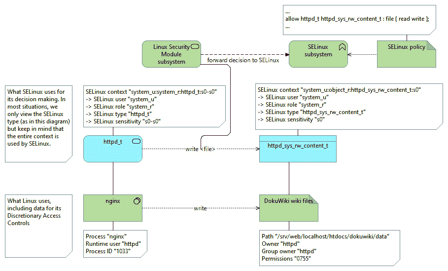
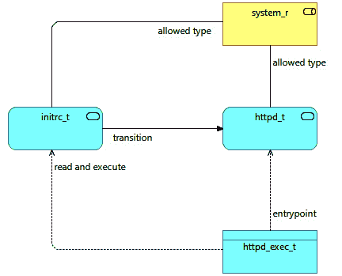

# *第四章*：使用文件上下文和进程域

启用 SELinux 的系统强烈依赖于上下文（资源上的）和域（进程上的）的概念。SELinux 强制实施的访问控制使用这些上下文来识别资源，并在策略中定义强制规则。由于其固有的对这些上下文的依赖，本章将详细讨论文件上下文、上下文定义和进程域。

我们将处理文件上下文并了解它们存储的位置，这样你就可以轻松调整系统，以便与 SELinux 最佳配合使用。我们为资源分配上下文，既可以是临时的（用于测试），也可以是永久的，并学习如何利用这些上下文来自动推断进程域。一旦我们知道如何获取进程域信息，我们将查询 SELinux 策略，以了解当前的访问控制。

本章将涵盖以下主要内容：

+   SELinux 文件上下文简介

+   保留或忽略上下文

+   SELinux 文件上下文表达式

+   修改文件上下文

+   进程的上下文

+   限制转换的范围

+   类型、权限和约束

# 技术要求

请观看以下视频，查看代码的实际应用：[`bit.ly/3m3JzkP`](https://bit.ly/3m3JzkP)

# SELinux 文件上下文简介

SELinux 文件上下文是系统管理员在系统中使用 SELinux 时需要处理的最重要的配置。文件的上下文通常通过分配给文件的标签来识别。标签错误的文件是系统管理员的常见头痛来源，大多数常见的 SELinux 问题都通过纠正 SELinux 上下文来解决。

了解 SELinux 上下文的使用方式和位置是理解和解决 SELinux 相关问题的关键。下图展示了上下文如何应用于常规 Linux 资源，以及 LSM 子系统如何使用这些上下文来做出决策：



图 4.1 – 上下文与常规 Linux 信息的区别

让我们以基于 Web 的部署为例：DokuWiki。DokuWiki 是一个流行的 PHP 维基，它使用文件而不是数据库作为后端系统，且易于安装和管理。作为 Web 托管平台，我们将使用 nginx。

## 获取上下文信息

假设 DokuWiki 应用将托管在 `/srv/web/localhost/htdocs/dokuwiki` 位置，并且它会将其维基页面（用户内容）存储在 `data/` 子目录中。我们从项目站点下载最新的 DokuWiki tarball，[`download.dokuwiki.org`](http://download.dokuwiki.org)，并将其解压到此位置：

```
# mkdir -p /srv/web/localhost/htdocs/
# tar -C /srv/web/localhost/htdocs/ -xvf dokuwiki.tgz
# chown -R nginx:nginx /srv/web/localhost/htdocs/dokuwiki
```

虽然一些发行版可能提供预打包的 DokuWiki 安装，但我们将使用手动安装的方法来展示本章中的各种文件上下文相关操作。

可以使用`ls`命令的`-Z`选项轻松获取文件的上下文。大多数能够提供上下文反馈的工具都会尝试使用`-Z`选项，正如我们在*第一章*《基础 SELinux 概念》和*第三章*《管理用户登录》中所看到的`id`工具所示。

让我们看看`dokuwiki`目录本身的当前上下文：

```
# ls -dZ /srv/web/localhost/htdocs/dokuwiki
undefined_u:object_r:var_t:s0 /srv/web/localhost/htdocs/dokuwiki
```

这里显示的上下文是`var_t`。在*保留或忽略上下文*部分中，我们将把这个上下文改为正确的上下文（因为`var_t`过于通用，不适合托管网页内容）。

文件和目录上下文在文件系统中作为扩展属性存储，当文件系统支持此功能时。**扩展属性**（通常缩写为**xattr**）是与资源的 inode（代表文件、目录或符号链接的文件系统信息块）相关联的键/值组合。每个资源可以有多个扩展属性，但每个唯一的键只有一个值。当我们谈论为文件或目录分配**标签**（或重新标记文件）时，我们指的是设置或更新这个扩展属性，因为它是 SELinux 用于获取文件 SELinux 上下文的标签。

重要提示

不支持扩展属性的文件系统仍然可以在启用了 SELinux 的系统上使用。然而，整个文件系统（包括所有文件和目录）将显示为单一上下文，无法在文件系统上区分资源。我们将在本章的*使用挂载选项设置 SELinux 上下文*小节中解释如何在这些文件系统上定义文件上下文。

根据约定，Linux 上的扩展属性使用以下语法：

```
<namespace>.<attribute>=<value>
```

扩展属性的命名空间允许进行额外的访问控制或特性。在当前支持的扩展属性命名空间（`security`、`system`、`trusted`和`user`）中，`security`命名空间对操作该属性施加了特定的限制：如果没有加载安全模块（例如，未启用 SELinux），则只有具有`CAP_SYS_ADMIN`能力的进程（基本上是 root 或类似权限的进程）才能修改此参数。

我们可以使用`getfattr`应用程序查询现有的扩展属性，如下例所示：

```
$ getfattr -m . -d dokuwiki
# file: dokuwiki
security.selinux="unconfined_u:object_r:var_t:s0"
```

如我们所见，`security.selinux`扩展属性存储着 SELinux 上下文。这确保了当 SELinux 被禁用时，非管理员用户无法更改文件的 SELinux 上下文，并且当 SELinux 启用时，SELinux 策略控制谁可以操作上下文。

`stat`应用程序也可以用来显示 SELinux 上下文：

```
$ stat dokuwiki
  File: dokuwiki
  Size: 211		Blocks: 0		IO Block: 4096	
directory
Device: fd01h/64769d	Inode: 8512888	Links: 8
Access: (0755/drwxr-xr-x)	Uid: (	0/	root) Gid: (	0/	root)
Context: unconfined_u:object_r:var_t:s0
...
```

从文件或目录获取上下文信息应该和获取常规访问控制信息（读取（`r`）、写入（`w`）和执行（`x`）标志）一样常见。

## 解释 SELinux 上下文类型

使用 SELinux 一段时间后，使用文件标签为文件分配 SELinux 上下文的动机变得更加清晰。SELinux 上下文根据其目的命名，使管理员更容易看出上下文是否被正确分配。

考虑一个用户文件在其主目录中的上下文（`user_home_t`）、一个位于 `/tmp` 目录中的 Java 应用程序目录（`java_tmp_t`），或 `rpcbind` 的一个套接字（`rpcbind_var_run_t`）。这些文件或目录在文件系统中具有截然不同的用途，这一点体现在它们所分配的上下文中。

策略编写者总是尽力一致地命名上下文，使我们更容易理解文件的目的，同时也使得策略几乎是自解释的，管理员可以在不需要额外文档的情况下理解策略的目的。

对于常规文件系统，例如，文件根据其主要位置进行标签，以便它们具有相似的安全属性。例如，我们发现 `/bin` 文件夹（以及 `/usr/bin`）中的二进制文件与 `bin_t` 类型相关联，`/boot` 中的启动文件与 `boot_t` 相关联，`/usr` 中的通用系统资源与 `usr_t` 相关联。

我们还可以找到更多应用特定的上下文。例如，对于 PostgreSQL 数据库服务器，我们有以下上下文：

+   `postgresql_t` 上下文是为应用程序本身（进程类型或域）设计的。

+   `postgresql_port_t` 上下文是为 PostgreSQL 守护进程监听的 TCP 端口设计的。

+   `postgresql_server_packet_t` 和 `postgresql_client_packet_t` 上下文是与接收的网络数据包（对于 `postgresql_server_packet_t` 类型）或发送到 PostgreSQL 端口的数据包相关的类型。

+   `postgresql_exec_t` 类型被分配给 `postgres` 二进制文件。

+   各种 `postgresql_*_t` 类型用于与守护进程相关的特定文件系统位置，例如 `postgresql_var_run_t`（适用于 `/var/run` 中的资源）、`postgresql_etc_t`（适用于 `/etc` 中的资源）、`postgresql_log_t`（适用于 `/var/log` 中的资源）和 `postgresql_tmp_t`（适用于 `/tmp` 中的资源）。

+   数据库文件本身的 `mysqld_db_t` 类型。

基于文件或资源的上下文，管理员可以轻松地检测系统设置中的异常。异常的一个例子是当我们将文件从用户的主目录移动到 Web 服务器位置时。当这种情况发生时，文件保留了 `user_home_t` 上下文，因为扩展属性随着文件一起移动。由于 Web 服务器进程默认不允许访问 `user_home_t`，它将无法向用户提供该文件。

让我们看看如何在这种复制或移动操作中正确设置上下文。

# 保持或忽略上下文

现在我们已经知道文件上下文是作为扩展属性存储的，如何确保文件在写入或修改时获得正确的标签呢？为了在文件系统资源上设置 SELinux 上下文，存在一些准则，从继承规则到显式命令。

## 继承默认上下文

默认情况下，SELinux 安全子系统使用上下文继承来确定在创建文件（或目录、套接字等）时应该分配哪个上下文。在具有`var_t`上下文的目录中创建的文件，也将被分配`var_t`上下文。这意味着文件从父目录继承上下文，而不是从执行进程的上下文继承。

然而，这里有一些例外：

+   支持 SELinux 的应用程序可以强制文件的上下文不同（当然，前提是 SELinux 策略允许这样做）。由于这是在软件代码内部，这种行为无法进行通用配置。

+   一个名为`restorecond`的应用程序可以根据 SELinux 的上下文规则，在不同的路径/文件上强制执行上下文。我们将在*SELinux 文件上下文表达式*和*修改文件上下文*部分分别介绍这些规则和`restorecond`应用程序。

+   SELinux 策略允许考虑创建新文件或目录的进程的上下文以及进程正在创建的文件名的过渡规则。

接下来我们将介绍这些过渡规则。

## 查询过渡规则

类型过渡规则是策略规则，在某些条件下强制使用不同的类型。对于文件上下文，类似的类型过渡规则可以是这样的：如果在`httpd_t`域中运行的进程在标记为`var_log_t`的目录中创建一个文件，那么该文件的类型标识符将变为`httpd_log_t`。

基本上，这条规则将`httpd_log_t`网页服务器日志上下文分配给任何被网页服务器放入日志目录中的文件，而不是使用标准继承时会出现的默认`var_log_t`上下文。

我们可以使用`sesearch`查询这些类型过渡规则。`sesearch`应用程序是查询当前 SELinux 策略的最重要工具之一。对于前面的例子，我们需要目录的（源）域和（目标）上下文：`httpd_t`和`var_log_t`。在以下示例中，我们使用`sesearch`来查找与`httpd_t`域过渡到`var_log_t`上下文的类型过渡声明：

```
$ sesearch -T -s httpd_t -t var_log_t
type_transition httpd_t var_log_t:file httpd_log_t;
```

`type_transition`行是一个 SELinux 策略规则，完美地映射到描述中。我们来看一下针对`tmp_t`类型（分配给用于临时文件的目录，如`/tmp`和`/var/tmp`）的另一组类型过渡规则：

```
$ sesearch -T -s httpd_t -t tmp_t
type_transition httpd_t tmp_t:dir httpd_tmp_t;
type_transition httpd_t tmp_t:file httpd_tmp_t;
type_transition httpd_t tmp_t:file krb5_host_rcache_t HTTP_23;
type_transition httpd_t tmp_t:file krb5_host_rcache_t HTTP_48;
type_transition httpd_t tmp_t:lnk_file httpd_tmp_t;
type_transition httpd_t tmp_t:sock_file httpd_tmp_t;
```

策略告诉我们，如果在标记为`tmp_t`的目录中创建文件、目录、符号链接或套接字，则该新创建的资源将分配`httpd_tmp_t`上下文（因此不是默认的继承`tmp_t`上下文）。除了这些规则外，它还包含了两个命名的文件转换规则，这些规则是更灵活的转换规则。

如果在标记为`tmp_t`的目录中创建`HTTP_23`或`HTTP_48`，则不会分配`httpd_tmp_t`上下文（根据常规类型转换规则本应分配），而是分配`krb5_host_rcache_t`类型（用于 Kerberos 实现）。

类型转换不仅使我们了解哪些标签（因此也包括 SELinux 上下文）将被分配，还为我们提供了哪些类型与特定域相关的线索。在 web 服务器的示例中，我们通过查询策略发现，其日志文件很可能被标记为`httpd_log_t`，而临时文件则标记为`httpd_tmp_t`。

## 复制和移动文件

文件上下文也可以在复制或移动操作过程中与文件一起传输。默认情况下，Linux 会执行以下操作：

+   在同一文件系统上的移动（`mv`）操作中保留文件上下文（因为此操作不会触及扩展属性，仅调整文件的元数据）。

+   在跨文件系统边界的移动操作中忽略当前文件上下文，因为这会创建一个新文件，包括内容和扩展属性。相反，使用继承（或文件转换规则）来定义目标上下文。

+   在进行复制（`cp`）操作时忽略文件上下文，而是使用继承（或文件转换规则）来定义目标上下文。

幸运的是，这只是默认行为（基于这些实用程序的扩展属性支持），可以自由操作。

我们可以使用`-Z`选项告诉`mv`命令将文件的上下文设置为与目标位置相关联的默认类型。例如，在下一个示例中，两个文件从用户的主目录移动到`/srv`目录。第一个示例将保留其文件上下文（`user_home_t`或`admin_home_t`），而第二个示例将获得与放置在`/srv`中的用户文件相关的类型（`var_t`）：

```
# touch test1 test2
# mv test1 /srv
# mv -Z test2 /srv
# ls -Z /srv/test*
staff_u:object_r:admin_home_t:s0 /srv/test1
staff_u:object_r:var_t:s0 /srv/test2
```

类似地，我们可以通过`--preserve=context`选项告诉`cp`命令在复制文件时保留 SELinux 上下文。使用相同的示例，现在我们得到以下结果：

```
# cp test1 /srv
# cp --preserve=context test2 /srv
# ls -Z /srv/test*
staff_u:object_r:var_t:s0 /srv/test1
staff_u:object_r:admin_home_t:s0 /srv/test2
```

`coreutils`包提供的大多数实用程序支持`-Z`选项：`mkdir`（创建目录）、`mknod`（创建设备文件）、`mkfifo`（创建命名管道）等。

重要说明

如果在使用`-Z`选项时，`mv`命令返回`failed to set the security context`，那么很可能该位置要么没有与之关联的有效上下文，要么文件系统不支持 SELinux 标签。前者适用于将文件移动到`/tmp`的情况，因为 CentOS SELinux 策略未为`/tmp`中的文件和目录设置默认上下文。新创建的资源总是需要应用其关联的标签（例如`user_tmp_t`）。

更进一步，许多这些工具允许用户通过`--context`选项显式地提供上下文。例如，要创建一个上下文为`user_home_t`的目录`/srv/foo`，使用`mkdir`默认情况下是无法实现的，因为目标上下文会被设置为`var_t`。通过`--context`选项，我们可以告诉工具设置特定的上下文：

```
# mkdir --context=user_u:object_r:user_home_t:s0 /srv/foo
# ls -dZ /srv/foo
user_u:object_r:user_home_t:s0 /srv/foo
```

对于其他工具，最好查阅手册页面，了解该工具如何处理扩展属性。例如，`rsync`命令可以通过使用`-X`或`--xattrs`选项来保留扩展属性。

## 临时更改文件上下文

我们可以使用`chcon`工具直接更新文件（或文件们）的上下文。在我们之前的示例中，我们注意到 DokuWiki 文件上的`var_t`标签。这个标签是针对变量数据的通用类型，而不是用于网页内容的正确上下文。我们可以使用`chcon`将`httpd_sys_content_t`标签应用到这些文件上，这样就允许网页服务器对这些资源具有读取权限：

```
# chcon -R -t httpd_sys_content_t /srv/web
```

`chcon`提供的另一个功能是告诉它用与另一个文件相同的上下文来标记文件或位置。在下一个示例中，我们使用`chcon`将`/srv/web`及其资源标记为与`/var/www`目录相同的上下文：

```
$ chcon -R --reference /var/www /srv/www
```

如果我们通过`chcon`更改文件的上下文并将其设置为与上下文列表中不同的上下文，那么该上下文可能会被恢复：包管理器可能会将文件上下文重置回其预定值，或者系统管理员可能会触发一次完整的文件系统标签重命名操作。

到目前为止，我们只关注了上下文中的类型部分。然而，上下文还包括角色部分和 SELinux 用户部分。如果未启用 UBAC，则 SELinux 用户对任何决策没有影响，重置它几乎没有价值。然而，如果启用了 UBAC，则可能需要重置文件上的 SELinux 用户值。像`chcon`这样的工具也可以设置 SELinux 用户：

```
# chcon -u system_u -R /srv/web
```

文件的角色通常是`object_r`，因为角色当前只对用户（进程）有意义。

为了能够更改上下文，我们确实需要适当的 SELinux 权限，称为`relabelfrom`和`relabelto`。这些权限授予域，以指示该域是否可以将标签从一种类型更改为另一种类型。如果我们在审核日志中找到与这些权限相关的拒绝信息，那么这意味着策略禁止该域更改上下文。

## 将类别放置在文件和目录上

我们主要关注类型的更改，并简要讨论了 SELinux 用户，但另一个重要部分是支持类别和敏感度级别。使用`chcon`，我们可以如下添加敏感度级别和类别：

```
# chcon -l s0:c0,c2 doku.php
```

另一个可以用来分配类别的工具是`chcat`工具。通过`chcat`，我们可以分配额外的类别，而无需像`chcon`那样反复设置它们，甚至可以享受由`setrans.conf`文件提供的可读性强的类别级别：

```
# chcat -- +Contracts doku.php
```

要删除类别，只需使用减号：

```
# chcat -- -Contracts doku.php
```

要删除所有类别，请使用`-d`选项：

```
# chcat -d doku.php
```

用户和管理员应当记住，应用程序通常不会自行设置类别，因此需要根据需要手动添加。

## 在文件上使用多级安全性

当系统使用 MLS 策略时，需要使用`chcon`工具。语法与类别相同。例如，要在用户主目录的所有文件上设置敏感度` s1`和类别集` c2`和` c4`到` c10`，你可以执行以下操作：

```
$ chcon -R -l s1:c2,c4.c10 /home/lisa
```

请记住，执行`chcon`的用户的上下文和将使用数据的用户的上下文必须能够处理提到的敏感度。

## 备份和恢复扩展属性

与常规的文件操作工具（如`mv`和`cp`）一样，备份软件在处理 SELinux 启用的系统时，也需要考虑 SELinux 上下文。备份工具在与 SELinux 启用的系统一起使用时有两个重要的要求：

+   备份工具必须在能够读取备份范围内所有文件的 SELinux 上下文中运行，当然，还需要能够恢复这些文件。如果备份工具没有特定的 SELinux 策略，那么它可能需要在未受限制或具有高度权限的域中运行才能成功。

+   备份工具必须能够备份和恢复扩展属性。

一个流行的备份（或归档）工具是`tar`应用程序，它支持以下 SELinux 上下文：

```
# tar cjvf dokuwiki-20200405.tar.bz2 /srv/web --selinux
```

在创建 tar 归档时，添加`--selinux`以包括 SELinux 上下文（在创建归档和提取文件时都会包括）。

## 使用挂载选项设置 SELinux 上下文

并非所有文件系统都支持扩展属性。当我们使用不支持扩展属性的文件系统时，文件的 SELinux 上下文要么基于文件系统类型本身（每个文件系统都有自己关联的上下文），要么通过`mount`选项传递给系统。

在这些情况下，最常用的`mount`选项是`context=`选项。当设置时，它将使用指定的上下文作为文件系统中所有资源的上下文。例如，要挂载一个包含 FAT 文件系统的外部 USB 驱动器，并确保最终用户可以写入该驱动器，我们可以使用`user_home_t`上下文挂载它：

```
# mount -o context="user_u:object_r:user_home_t:s0" /dev/sdc1 /media/usb
```

如果文件系统支持扩展属性，但尚未对所有文件进行标记，则可以使用 `defcontext=` 选项告诉 Linux，如果没有 SELinux 上下文可用，则应使用提供的默认上下文：

```
# mount -o defcontext="system_u:object_r:var_t:s0" /dev/sdc1 /srv/backups
```

另一个挂载选项是 `fscontext=`。它为文件系统类型分配上下文，而不是为文件系统中的文件分配上下文。例如，CD/DVD 文件系统可以是 ISO 9660、Joliet 或 UDF。SELinux 使用此类型定义来映射权限，例如挂载操作和文件创建。通过 `fscontext=` 选项，可以将文件系统类型设置为不同于默认文件系统类型。

当挂载文件系统时，可以使用的最后一个选项是 `rootcontext=` 选项。即使文件系统尚未对用户空间可见，此选项也会强制将文件系统的根 inode 设置为给定的上下文。挂载操作期间对该位置的权限检查可能会在该位置没有预期上下文时造成混乱（尤其是当文件系统被挂载到预期位置之外时）。`rootcontext=` 选项提供了一个可重用的配置选项来设置预期的上下文：

```
# mount -o rootcontext="system_u:object_r:tmp_t:s0" -t tmpfs none /var/tmp
```

就是这样——这些就是所有与上下文相关的挂载选项。不过有一点需要注意：`context=` 选项与 `defcontext=` 和 `fscontext=` 选项是互斥的。因此，虽然 `defcontext=` 和 `fscontext=` 选项可以一起使用，但不能与 `context=` 选项一起使用。假设目标文件系统支持扩展属性，则可以使用文件上下文表达式，我们将在下一节中讨论这个内容。

# SELinux 文件上下文表达式

当我们认为文件的上下文不正确时，需要纠正上下文。SELinux 提供了几种方法来实现这一点，一些发行版甚至增加了更多的选项。我们可以使用诸如 `chcon`、`restorecon`（与 `semanage` 一起使用）、`setfiles`、`rlpkg`（Gentoo）和 `fixfiles` 等工具。当然，我们也可以使用 `setfattr` 命令，但那是设置上下文的最不友好的方法。

让我们看看如何以更可管理的方式设置上下文表达式。

## 使用上下文表达式

在 SELinux 策略中，保存了一组正则表达式，用于通知 SELinux 工具和库文件应该给文件（或其他文件系统资源）分配什么上下文。尽管此表达式列表不会直接在系统上强制执行，但管理员和 SELinux 工具会使用它来检查上下文是否正确，并将上下文重置为应有的状态。您可以在 `/etc/selinux/targeted/contexts/files` 目录下的各种 `file_contexts.*` 文件中找到该列表。

作为管理员，我们可以通过 `semanage fcontext` 查询此列表，如下所示：

```
# semanage fcontext -l
SELinux fcontext	type		Context
/			directory	system_u:object_r:root_t:s0
...
/vmlinuz.*		symbolic link	system_u:object_r:boot_t:s0
/xen(/.*)?		all files	system_u:object_r:xen_image_t:s0
...
```

查询此信息的工具之一是 `matchpathcon`，我们在*第二章* *理解 SELinux 决策与日志记录* 中介绍过：

```
# matchpathcon /srv/web/localhost/htdocs/dokuwiki
/srv/web/localhost/htdocs/dokuwiki  system_u:object_r:var_t:s0
```

然而，并非所有条目都可以通过`semanage`应用程序查看。与特定用户主目录（例如`/home/lisa/.ssh`）相关的条目不可见，因为这些条目依赖于 Linux 用户（更重要的是，它相关联的 SELinux 用户）。

但对于所有其他条目，命令的输出包含以下内容：

+   一个匹配一个或多个路径的正则表达式

+   规则适用的类别，但翻译成更易读的格式

+   要分配给与表达式和类别列表匹配的资源的上下文

类别列表使我们能够根据资源类别区分上下文。`semanage fcontext`的输出使用人类可读的标识符：资源类别可以是常规文件（`--`）、目录（`-d`）、套接字（`-s`）、命名管道（`-p`）、块设备（`-b`）、字符设备（`-c`）或符号链接（`-l`）。当它说所有文件时，该行在任何类别下都是有效的。

目前，我们还没有定义这样的规则，但在下一节之后，即使定义自定义 SELinux 上下文表达式也将不再是秘密。上下文列表的一个重要属性是 SELinux 如何优先应用它——毕竟，我们可能有两个都匹配某个特定资源或路径的表达式。在 SELinux 中，最具体的规则会获胜。使用的逻辑如下（按顺序）：

1.  如果行 A 有正则表达式，而行 B 没有，则行 B 更具体。

1.  如果行 A 中第一个正则表达式前的字符数少于行 B 中第一个正则表达式前的字符数，那么行 B 更具体。

1.  如果行 A 中的字符数少于行 B 中的字符数，则行 B 更具体。

1.  如果行 A 没有映射到特定的 SELinux 类型（策略编辑器明确告诉 SELinux 不要分配类型），而行 B 有，则行 B 更具体。

然而，这个规则的顺序有一个警告。当通过`semanage`添加额外的规则时（我们将在下一节中描述），SELinux 的工具会按添加的顺序应用这些规则，而不是按规则的具体性来应用。因此，不是使用最具体的规则，而是使用最近添加的、与路径匹配的规则。

## 注册文件上下文更改

因为使用`chcon`更改 SELinux 上下文通常只是一个临时措施，因此强烈建议仅在测试上下文更改的影响时使用`chcon`。一旦更改被接受，我们需要通过`semanage`进行注册。例如，要永久将`/srv/web`（及其所有子目录）标记为`httpd_sys_content_t`，并将 DokuWiki 的`data/`和`conf/`文件夹标记为`httpd_sys_rw_content_t`（以允许 Web 服务器修改这些资源），我们需要执行以下命令：

```
# semanage fcontext -a -t httpd_sys_content_t "/srv/web(/.*)?"
# semanage fcontext -a -t httpd_sys_rw_content_t "/srv/web/localhost/htdocs/dokuwiki/data(/.*)?"
# semanage fcontext -a -t httpd_sys_rw_content_t "/srv/web/localhost/htdocs/dokuwiki/conf(/.*)?"
# restorecon -Rv /srv/web
```

我们在这里做的是通过 `semanage` 将 `/srv/web` 及其子目录注册为 `httpd_sys_content_t`，而将两个可写目录注册为 `httpd_sys_rw_content_t`。然后，我们使用 `restorecon`（递归）重置 `/srv/web` 的上下文为在上下文列表中注册的值。这是为大多数资源设置上下文的推荐方法。

这些注册是本地（自定义的）上下文表达式，存储在一个单独的配置文件中（`file_contexts.local`）。考虑到（本地添加的）表达式的优先级，重要的是将*最具体的条目最后添加*，否则对于整个目录会应用定义较为宽泛的 `httpd_sys_content_t` 规则。这不同于（策略添加的）表达式的优先级规则，后者有“*最具体的规则优先*”的概念。

`semanage fcontext` 应用程序还可以用于通知 SELinux，文件系统树的某一部分应该像文件系统上另一个位置一样进行标记。这样的 `semanage` 会应用相同的上下文，就像目标位置是默认位置一样。

通过一个示例，我们来更清晰地展示这一点，让 `/srv/web` 下的所有内容都像 `/var/www` 下的文件一样进行标记（包括子目录），因此 `/srv/web/icons` 会获得与 `/var/www/icons` 相同的上下文。我们使用 `semanage fcontext` 的 `-e` 选项来创建这样的等效规则，如下所示：

```
# semanage fcontext -a -e /var/www /srv/web
# restorecon -Rv /srv/web
```

这将创建一个替代条目，使得 `/srv/web` 下的任何内容都与 `/var/www` 下的相同位置获得相同标签。

大多数发行版已经配置了一些等效规则，我们可以按以下方式读取：

```
# cat /etc/selinux/targeted/contexts/files/file_contexts.subs_dist
/run /var/run
...
/sysroot/tmp /tmp
```

`semanage fcontext -l` 命令也会在其输出的最后显示这些等效位置。

## 优化递归上下文操作

`restorecon` 应用程序根据通过 SELinux 策略和 `semanage fcontext` 管理的上下文定义，重置文件和其他资源的 SELinux 上下文。当对目录递归应用 `restorecon` 时，可能需要一段时间。为了在这种情况下提高性能，SELinux 开发者支持跳过 `restorecon` 操作。

在 `restorecon` 命令中加上 `-D` 选项后，一个额外的扩展属性将写入包含该命令的主要目录，该属性包含当调用该命令时使用的文件上下文定义的哈希值：

```
# restorecon -RD /home
```

后续使用 `restorecon` 命令并加上 `-D` 选项时，将检查这个哈希值，以判断影响该目录的文件上下文定义是否有修改（使用 `semanage fcontext`）。如果没有修改，恢复操作将被跳过：

```
# restorecon -RvD /home
Skipping restorecon as matching digest on: /home
```

一旦我们更新了影响给定位置的定义，`restorecon` 将相应地重置上下文：

```
# semanage fcontext -a -t httpd_user_content_t "/home/[^/]*/cgi-bin(/.*)?"
# restorecon -RvD /home
Relabeled /home/lisa/cgi-bin from staff_u:object_r:user_home_t:s0 to staff_u:object_r:httpd_user_content_t:s0
Updated digest for: /home
```

`restorecon_xattr` 命令可以用来管理这些扩展属性（查看或删除）并显示属性是如何形成的：

```
# restorecon_xattr -v /home
specfiles SHA1 digest: 7ed69be330ad60811481e455ca8e5ab0b1556036
calculated using the following specfile(s):
/etc/selinux/targeted/contexts/files/file_contexts.subs_dist
...
/etc/selinux/targeted/contexts/files/file_contexts.local.bin
/home Digest: 7ed69be330ad60811481e455ca8e5ab0b1556036 Match
```

引用的 `digest` 是 `security.restorecon_last` 或 `security.sehash` 扩展属性。较新的用户空间工具使用后者，并将其逻辑应用于每个子目录，而较旧的用户空间实用程序使用前者，并仅在选定的目录上应用其逻辑。

`security.restorecon_last` 使用的缺点是它不能与子目录一起工作：如果我们对 `/` 应用递归的 `restorecon` 操作，那么此工具将忽略 `/home` 上的摘要。使用 `security.sehash` 时，对 `/` 的递归操作将检查 `/home` 的摘要。

## 使用可定制类型

某些 SELinux 类型适用于路径无法由管理员准确定义或管理员不希望在触发重新标记操作时重置上下文的文件。为此，SELinux 支持所谓的 `restorecon`）遇到设置为可定制类型的文件时，它们不会将其上下文恢复为注册的上下文定义。

可定制类型声明在 `/etc/selinux/targeted/contexts` 内的 `customizable_types` 文件中。要使 `restorecon` 重新标记这些文件，管理员需要在工具重置上下文之前传递强制重置选项（`-F`）。

让我们看看这个 `customizable_types` 文件的内容：

```
$ cat /etc/selinux/targeted/contexts/customizable_types
container_file_t
sandbox_file_t
...
httpd_user_content_t
git_session_content_t
home_bin_t
user_tty_device_t
```

例如，我们可以将主目录中的文件标记为 `home_bin_t`，这是一种可定制类型，因此，在执行文件系统重新标记操作时，此文件不会重新标记为 `user_home_t`：

```
$ chcon -t home_bin_t ~/convert.sh
```

将其他类型标记为可定制类型需要更新 `customizable_types` 文件，因为没有用户命令可以从此列表中添加或删除类型定义。因为此文件可能在发行版或管理员推出新策略包时被覆盖，所以需要仔细管理。

话虽如此，使用可定制类型也有其优势。作为管理员，我们可能希望创建和支持特定类型，供最终用户使用 `chcon` 在其主目录中设置单个文件的上下文。通过将这些类型标记为可定制类型，对 `/home` 的重新标记操作不会重置这些上下文。

当目标类型不是可定制类型时，管理员通常倾向于使用 `semanage fcontext` 添加表达式，并使用 `restorecon` 修复文件的上下文。大多数管理员会使用基于目录的标记：这样更容易维护，也更容易向最终用户解释。许多人甚至会将这种方法用于可定制类型：

```
# semanage fcontext -a -t home_bin_t "/home/[^/]*/bin(/.*)?"
```

使用此命令，位于 `~/bin` 目录中的用户二进制文件和脚本将被标记为 `home_bin_t`。

## 编译不同的 file_contexts 文件

在 `/etc/selinux/targeted/contexts/files` 目录内，可以找到五个不同的 `file_contexts` 文件：

+   `file_contexts` 文件本身（没有任何后缀）是由 Linux 发行版提供的 SELinux 策略所提供的基本表达式文件。

+   `file_contexts.local` 文件包含本地添加的规则（通过之前章节中介绍的 `semanage fcontext` 命令）。

+   `file_contexts.homedirs` 文件包含用户主目录的表达式。当通过 `semanage login` 和 `semanage user` 创建并管理新的用户映射时，文件会根据新情况进行调整。

+   `file_contexts.subs_dist` 文件包含由发行版的 SELinux 策略提供的等效规则，这些规则告诉 SELinux 将文件系统的一个部分视为与另一个位置具有相同的标签规则。

+   `file_contexts.subs` 文件包含本地管理的等效规则（通过之前章节中介绍的 `semanage fcontext` 命令）。

除了这些文件，你还会发现关联的 `*.bin` 文件（例如 `file_contexts.bin` 对应 `file_contexts` 文件，`file_contexts.local.bin` 对应 `file_contexts.local` 文件，等等）。这些 `*.bin` 文件是自动创建的，但如果出现不一致，管理员也可以使用 `sefcontext_compile` 命令重新生成文件：

```
# cd /etc/selinux/targeted/contexts/files
# sefcontext_compile file_contexts.local
```

这些文件包含与主文件相同的信息，但它们是预编译的，能够加速查找。除非工具检测到 `*.bin` 文件比源文件旧，否则 SELinux 工具将使用这些已编译版本的文件。

## 交换本地修改

当通过 `semanage fcontext` 注册本地修改时，它们只适用于单个系统。如果需要将本地定义重新应用到多个系统，管理员可以提取本地修改并将其导入到另一个系统中。

要导出本地修改，请使用 `semanage export`：

```
# semanage export -f local-mods.conf
```

包含本地修改的文件（示例中的`local-mods.conf`）可以根据需要进行调整。这允许管理员移除除他们希望在其他系统上应用的行以外的所有行。

将本地修改存储在文件中后，将该文件传输到其他系统，并导入设置：

```
# semanage import -f ./local-mods.conf
```

导入的设置会立即注册。当然，如果文件系统发生更改（`semanage fcontext`），别忘了对目标目录运行 `restorecon`。

# 修改文件上下文

我们现在知道如何设置 SELinux 上下文，既可以通过 `chcon` 等工具直接设置，也可以通过 `restorecon` 应用程序设置，该应用程序查询 SELinux 上下文列表，以确定文件应该具有的上下文。然而，`restorecon` 并不是唯一考虑此上下文列表的应用程序。

## 使用 setfiles、rlpkg 和 fixfiles

`setfiles` 应用程序是一个较旧的程序，它需要上下文列表文件本身的路径来重置上下文。它通常在其他应用程序的后台使用，因此大多数管理员不再需要直接调用 `setfiles`。

```
# setfiles /etc/selinux/targeted/contexts/files/file_contexts /srv/web
```

另一组工具是`rlpkg`（Gentoo）和`fixfiles`（CentOS 及相关发行版）应用程序。这两个应用程序有一个很好的功能：它们可以用于重置一个应用程序的文件上下文，而无需手动遍历文件并对其运行`restorecon`。

在下一个示例中，我们使用这些工具恢复由`nginx`包提供的文件的上下文：

```
# rlpkg nginx
# fixfiles -R nginx restore
```

这两个应用程序的另一个特点是，它们可以用于重新标记整个文件系统，而无需执行系统重启，操作方式如下：

```
# rlpkg -a -r
# fixfiles -f -F relabel
```

当然，这不像之前的命令那样细粒度。

## 重新标记整个文件系统

在上一节中列出的`rlpkg`和`fixfiles`命令并不是在 CentOS（或相关）发行版中进行完整文件系统重新标记的唯一方法。SELinux 提供了另外两种方法，在（重新）启动时请求系统执行完整的文件系统重新标记操作：放置一个触摸文件（系统在启动时读取）或配置引导参数。

触摸文件名为`.autorelabel`，应放置在根文件系统中。设置后，系统需要重新启动：

```
# touch /.autorelabel
# reboot
```

如果我们将`autorelabel=1`参数添加到引导参数列表中（就像我们之前讨论过的可以设置`selinux=`和`enforcing=`参数一样），我们也会触发相同的行为。

请求系统执行完整的文件系统重新标记操作将需要一段时间。完成后，系统将再次重启。在重新标记操作完成后，触摸文件将被自动移除。

## 使用 restorecond 自动设置上下文

上下文也可以由`restorecond`守护进程应用。该守护进程的目的是将表达式列表规则强制应用到在`/etc/selinux/restorecond.conf`文件中定义的可配置位置。

以下是一组文件和目录的示例列表，这些位置在`restorecond.conf`文件中进行了配置，以便每当检测到这些文件和目录中的上下文变化时，`restorecond` 自动应用 SELinux 上下文：

```
/etc/services
/etc/resolv.conf
/etc/samba/secrets.tdb
...
/root/.ssh/*
```

在这种情况下，如果一个进程创建了一个与之前创建的路径匹配的文件，Linux 的 inotify 子系统将通知`restorecond`。然后，`restorecond` 将根据表达式列表重新标记该文件，应用正确的标签，无论是哪个进程（以及上下文）创建了该文件。

`restorecond`的使用主要是出于历史原因，当时 SELinux 不支持命名文件转换。在那时，写入`/etc`中的`resolv.conf`无法与写入`/etc`中的`passwd`文件区分开来。命名文件转换的引入大大减少了对`restorecond`的需求。

## 使用 tmpfiles 在启动时设置 SELinux 上下文

如果 Linux 发行版使用`systemd`，则可以使用`systemd-tmpfiles`在启动时自动设置 SELinux 上下文。`systemd`使用`tmpfiles`应用程序来自动创建和管理系统上的易失性位置，例如当`/run`是`tmpfs`挂载的文件系统（内存文件系统）时，管理`/run`内部的位置。

管理员可以配置`tmpfiles`以在启动时自动创建文件、目录、设备文件、符号链接等，并重置资源的权限。正是通过这个重置操作，我们可以使用`tmpfiles`在启动时设置正确的 SELinux 上下文。

在*第三章*《管理用户登录》中，我们讨论了多实例化，其中用户可以在文件系统资源上获得自己的私有视图。我们举的例子使用了名为`/tmp/tmp-inst`的目录，该目录必须设置为`000`权限，并且将承载用户特定的`/tmp`视图。与其每次都创建并设置这个权限，我们可以配置`tmpfiles`来自动为我们执行此操作，并事先定义正确的 SELinux 上下文：

```
# semanage fcontext -a -t tmp_t -f d "/tmp/tmp-inst"
```

在`/etc/tmpfiles.d`中，我们创建一个名为`selinux-polyinstantiation.conf`的文件，内容如下：

```
d /tmp/tmp-inst 000 root root
```

文件名可以自由选择，但请确保使用`.conf`后缀。每次系统启动时，`systemd-tmpfiles`会确保以适当的权限创建`/tmp/tmp-inst`目录。

如果某个位置不需要创建，只需要重置其 SELinux 上下文，则可以在`tmpfiles`配置中使用`z`（一个资源）或`Z`（递归）选项。例如，默认的 SELinux `tmpfiles`配置`selinux-policy.conf`就在`/usr/lib/tmpfiles.d`中使用了该选项：

```
z /sys/devices/system/cpu/online - - -
```

使用的`-`表示告知`tmpfiles`不要调整权限和所有权，仅重置 SELinux 上下文。

# 进程的上下文

由于 SELinux 中的所有内容都与上下文相关，甚至进程也会分配一个上下文，也就是所谓的域。让我们看看如何获取这些信息，SELinux 如何从一个域切换到另一个域，并了解如何查询 SELinux 策略以获取更多关于这些切换的信息。

## 获取进程的上下文

我们看到`nginx` Web 服务器运行在`httpd_t`域中，可以通过`ps -eZ`命令查看，输出如下：

```
# ps -eZ | grep nginx
system_u:system_r:httpd_t:s0  3744 ?   00:00:00 nginx
```

还有几种方法可以获取进程的上下文。尽管使用`ps`命令的方法最为直观，但这些其他方法在脚本化处理或通过监控服务时可能会非常有用。

一种方法是读取我们在*第一章*《SELinux 基础概念》中已经遇到的`/proc/<pid>/attr/current`伪文件。它显示一个进程的当前安全上下文：

```
# pidof nginx
3746 3745 3744
# cat /proc/3744/attr/current
system_u:system_r:httpd_t:s0
```

要获得更易读的输出，可以使用`secon`命令来查询给定进程 ID 的上下文：

```
# secon --pid 3744
user: system_u
role: system_r
type: httpd_t
sensitivity: s0
clearance: s0
mls-range: s0
```

最后，SELinux 用户空间项目有一个名为`getpidcon`的辅助工具，`libselinux`库可以选择提供这个工具。尽管该工具在 CentOS（或相关发行版）上不可用，但其他发行版，如 Gentoo，确实有该工具。该工具需要一个 PID 并返回其上下文：

```
# getpidcon 679
system_u:system_r:nginx_t:s0
```

现在，Apache 进程不会自己通知 SELinux 它们需要在`httpd_t`（或者在 Gentoo 中是`nginx_t`）域中运行。为此，SELinux 策略中存在转换规则，规定了何时以及如何在特定域中执行进程。

## 向某个域的转换

就像我们在文件中看到的那样，如果一个进程进行分叉并创建了一个新进程，则该新进程默认会继承父进程的上下文。对于 Web 服务器，主进程在`httpd_t`域中运行，因此所有启动的工作进程都会继承`httpd_t`域。

为了区分一个进程的域和另一个进程的域，可以定义域转换。一个`execve()`函数，最有可能在`fork()`操作之后执行。

与基于文件的转换一样，域转换可以使用`sesearch`进行查询。让我们来看看允许转换到`httpd_t`域的域：

```
$ sesearch -T -t httpd_exec_t
type_transition certwatch_t httpd_exec_t:process httpd_t;
type_transition cluster_t httpd_exec_t:process httpd_t;
type_transition initrc_t httpd_exec_t:process httpd_t;
...
type_transition system_cronjob_t httpd_exec_t:process httpd_t;
```

在这种情况下，如果父进程在上述某个域（例如`initrc_t`域）中运行，并且正在执行标记为`httpd_exec_t`（分配给`httpd`和`nginx`二进制文件的标签）的文件，SELinux 将把启动的 Web 服务器的上下文切换到`httpd_t`。

但是，要真正实现这一点，除了域转换外，还需要其他几种权限。以下列表描述了这些不同的权限：

+   源进程（例如`initrc_t`）需要被允许转换到`httpd_t`域，这由进程类上的转换权限来管理：

    ```
    $ sesearch -s initrc_t -t httpd_t -c process -p transition -A
    ```

+   源进程（例如`initrc_t`）需要在它正在启动的文件上具有执行权限（`httpd_exec_t`）：

    ```
    $ sesearch -s initrc_t -t httpd_exec_t -c file -p execute -A
    ```

+   必须将`httpd_exec_t`类型标识为`httpd_t`域的入口点。SELinux 使用**入口点**来确保只有在使用指定的文件上下文运行执行二进制文件或脚本时，域转换才会发生：

    ```
    $ sesearch -s httpd_t -t httpd_exec_t -c file -p entrypoint -A
    ```

+   目标域必须允许父进程所在角色。在系统守护进程的情况下，角色是`system_r`：

    ```
    $ seinfo -r system_r -x | grep httpd_t
    ```

这些权限的图形表示如下：



图 4.2 – 必要的域转换权限的图形概览

只有在允许所有这些权限的情况下，域转换才会发生。如果没有，那么应用程序的执行将失败（如果该域在文件上没有`execute`或`execute_no_trans`权限），或者它会执行，但仍然在与父进程相同的域中运行。

域转换是一个重要概念，因为它告诉管理员一个应用程序如何进入其特权上下文。为了分析这一点，许多安全管理员会查看一个上下文如何转换到另一个上下文。我们在*第十三章*，*分析策略行为*中解释了策略分析。

对于策略编写者来说，决定何时创建域转换以及何时保持进程在同一（源）上下文中运行是设计的问题。通常，策略开发者会尽量将父上下文限制在一个范围内，这样每个附加的权限就成为切换到另一个域（该域具有该权限）的考虑因素。基本上，当目标应用程序需要比源域持有的权限更多（或不同）时，策略开发者会触发转换。

这也是为什么在执行用户应用程序时，`unconfined_t`域的转换次数比受限用户域`user_t`或`guest_t`少的原因：`unconfined_t`域已经持有许多权限，因此转换到不同的域几乎没有价值。请注意，这是策略编写者或 Linux 发行版做出的决策，而不是 SELinux 技术本身做出的决策。所有 SELinux 做的就是执行策略规则。

## 验证目标上下文

在执行应用程序时，SELinux 策略可能会让命令在不同的域中运行。尽管我们可以使用`sesearch`查询所有规则，但存在一个更简单的命令，它会告诉我们执行命令或脚本时的目标上下文：`selinuxexeccon`。

该命令至少需要一个参数（即将执行的二进制文件或脚本的路径），以及一个可选的第二个参数（源上下文）。如果我们省略第二个参数，工具将使用当前上下文作为源上下文。

例如，要找出当在当前上下文中执行`passwd`命令时，命令将在哪个域中运行，我们可以使用以下命令：

```
# selinuxexeccon /usr/bin/passwd
unconfined_u:unconfined_r:passwd_t:s0-s0:c0.c1023
```

以下示例展示了当`init_t`域执行`nginx`二进制文件时的目标上下文：

```
# selinuxexeccon /usr/sbin/nginx system_u:system_r:init_t:s0
system_u:system_r:httpd_t:s0
```

使用`selinuxexeccon`比单独查询所有适当的权限要快得多。

## 其他支持的转换

常规域转换是 SELinux 中最常见的转换，但也有其他可能的转换。例如，一些应用程序（如`cron`或`login`）是 SELinux 感知的，并会指定要转换到的域。这些应用程序调用`setexeccon()`方法（设置执行上下文）来指定目标域，而不使用类型转换规则。然而，其他的权限要求仍然有效。

一些支持 SELinux 的应用程序甚至能够更改其*当前*上下文（而不仅仅是它们执行的应用程序的上下文）。为了实现这一点，应用程序域需要 `dyntransition` 权限（这是支持进程级活动的权限之一）。这样的应用程序的一个例子是 OpenSSH，默认情况下，它在 `sshd_t` 域中运行，但可以切换到 `sftpd_t` 类型。

## 查询初始上下文

当 SELinux 尚未为资源分配标签时，它将为该资源分配一个初始上下文（或初始**安全标识符**（**SID**））。对于某些类别，SELinux 策略将具有一个默认的初始上下文，从中可以进一步启动并分配标签。

可以使用 `seinfo` 查询各种 SID 的初始上下文：

```
# seinfo --initalsid -x
Initial SIDs: 27
  sid any_socket system_u:object_r:unlabeled_t:s0
  sid devnull system_u:object_r:null_device_t:s0
...
  sid unlabeled system_u:object_r:unlabeled_t:s0
```

正如你所见，并不是所有类别都有默认的上下文分配，因为其他类别的上下文是从当前列出的初始 SID 的上下文派生的。

## 调整内存保护

Linux 系统上的遗留二进制文件可能需要为内存区域设置执行权限，当这些区域用于读取时，即使没有实际使用执行权限。读即执行（read-implies-exec）对于强制访问控制（如 SELinux）来说是个麻烦，因为它们需要在策略中记录适当的权限。如果一个应用程序需要读取访问权限，那么策略是否也必须包含隐含的执行权限？如果策略没有包含执行权限，那么读取操作是否应该失败，因为它隐含了执行权限？

说明性备注

读即执行（read-implies-exec）是对运行旧二进制文件或为其他 Unix 系统编译的二进制文件的遗留支持，其中应用程序没有明确标记其可执行内存为可执行内存，假设所有标记为可读的内存区域都是可执行的。这带来了安全风险，因为恶意行为者可以动态加载可执行代码，而系统无法阻止应用程序执行这些代码。如今，许多操作系统都有明确的内存保护机制，包括防止数据变为可执行代码。遗憾的是，我们往往需要处理遗留情况，因此所有操作系统都有方法选择性地禁用这些内存保护，而在 Linux 中这是通过其 `man personality` 完成的（更多信息）。

SELinux 开发者通过引入可以调整的内存保护检查，允许管理员选择最合适的权限处理方式。`checkreqprot` 选项可以设置为 `0`，以检查内核处理的保护，或设置为 `1`，以检查应用程序请求的保护。

在旧系统上，此选项将设置为 `1` 以支持这些遗留二进制文件。然而，最近的发行版适当地构建了它们的应用程序，使用更安全的设置 `0`，如 `sestatus` 命令所示：

```
# sestatus | grep Memory
Memory protection checking:   actual (secure)
```

你可以通过 `/sys/fs/selinux/checkreqprot` 来切换此支持：

```
# echo 1 > /sys/fs/selinux/checkreqprot
# sestatus | grep Memory
Memory protection checking:   requested (insecure)
```

该参数的默认值在构建 Linux 内核时通过`CONFIG_SECURITY_SELINUX_CHECKREQPROT_VALUE`内核配置参数进行配置。管理员还可以通过`checkreqprot=`启动参数启动系统，以设置指定的值。

# 限制转换范围

出于安全原因，Linux 系统可以在某些情况下减少进程获取提升权限的能力，或提供额外的约束，以减少漏洞被利用的可能性。SELinux 开发人员也遵守这些情况。

## 在转换时清理环境

当我们执行一个更高权限的命令（无论是`setuid`应用程序，还是在会话中添加了权限的应用程序）时，**GNU C 库**（**glibc**）会清理环境。这意味着一组安全敏感的环境变量会被丢弃，以确保攻击者、恶意人员或恶意应用程序无法负面影响会话。

这种安全执行通过`LD_PRELOAD`、`LD_AUDIT`、`LD_DEBUG`、`TMPDIR`和`NLSPATH`的移除来控制。

SELinux 还会强制对域转换进行环境清理，确保新执行的域无法访问这些敏感的环境变量。当然，有时转换后的域需要这些变量。并非所有域都能处理清理过的环境，或者使用这些环境变量传递重要信息，因此始终丢弃环境变量可能会导致应用程序域无法使用。

为了允许在不清理环境的情况下进行域转换，可以为域转换授予`noatsecure`权限。例如，假设我们执行一个 Firefox 插件：

```
# sesearch -t mozilla_plugin_t -p noatsecure -A
...
allow unconfined_t mozilla_plugin_t:process { ... noatsecure ...};
...
```

当在`unconfined_t`域中运行的应用程序执行插件（导致转换到`mozilla_plugin_t`域）时，必须保留环境变量，否则插件可能无法正常工作。因此，SELinux 策略授予调用 Firefox 插件的域`noatsecure`权限。

## 禁用不受限制的转换

Linux 支持的第二个安全约束是使用`nosuid`选项挂载文件系统。设置该选项后，该文件系统上的任何`setuid`和`setgid`二进制文件将不会对执行会话的有效用户或组 ID 产生任何影响。本质上，位于使用`nosuid`挂载的文件系统上的`setuid`应用程序将表现得像没有设置`setuid`位。

为了确保由托管在`nosuid`挂载文件系统上的应用程序触发的转换不会允许提升的权限，SELinux 策略开发人员必须明确标记一个转换为允许在`nosuid`挂载文件系统上进行，使用`nosuid_transition`权限。该权限属于`process2`类：

```
$ sesearch -s unconfined_t -p nosuid_transition -A
allow unconfined_t initrc_t:process2 { nnp_transition nosuid_transition };
...
```

这允许策略开发人员区分常规域转换和`nosuid`约束的域转换。

注意

SELinux 对可以分配给某个类别的权限数量有一个限制。当权限数量超过 32 时，SELinux 开发者会创建一个不同的类别，权限将继续存在于第二个类别中。目前，权限超过 32 的两个类别是 `capability` 类别和 `process` 类别。

然而，这种基于权限的方法可能并不是所有启用 SELinux 的系统上都有实现。只有在定义并将 `nnp_nosuid_transition` 策略功能设置为 `1` 时，才会启用：

```
# cat /sys/fs/selinux/policy_capabilities/nnp_nosuid_transition
1
```

如果此功能值为`0`，则 SELinux 将使用一个叫做 `nosuid` 的挂载文件系统概念。任何具有文件上下文的可执行文件，如果会导致域转换，只有在目标域由父域约束时，才会发生域转换。

注意

`nnp_nosuid_transition` 功能时，策略开发者通知内核，应该使用 `nosuid_transition` 和 `nnp_transition` 权限检查，而不是有界域，并且该策略通常仅支持这些转换，而不支持有界域。

如果没有约束，那么域转换将不会发生，且会话将保持在当前上下文中（或者如果应用程序不允许在当前上下文中运行，命令将无法执行）。

**有界域**不仅仅是根据权限实时计算的。SELinux 有一条明确的规则，强制要求目标域由父域约束。即使后来向有界域添加了权限，如果这些权限不属于父域，它们也会被 SELinux 安全子系统拒绝。

使用 `seinfo`，这些类型的边界可以如下列出：

```
# seinfo --typebounds
```

然而，大多数发行版现在不再在其 SELinux 策略中定义有界域，因为新的 `nosuid_transition` 权限更加灵活。使用有界域要求策略开发者每次需要扩展子域时，都要扩展父域的权限，而当父域是通用的（无论是容器管理平台还是系统服务守护进程）时，这会变得非常麻烦。

## 使用 Linux 的 NO_NEW_PRIVS

使用挂载了 `nosuid` 的文件系统是 Linux 的 `nnp_transition` 权限的特定情况，或者如果没有设置 `nnp_nosuid_transition` 策略功能，则指向一个有界域。

该参数可以通过应用程序本身使用进程控制函数 `prctl()` 来设置，但用户也可以影响此值。可以使用 `setpriv` 命令启动应用程序，并设置 `PR_SET_NO_NEW_PRIVS`（这是应用程序可以通过 `prctl()` 函数传递的参数）。

作为示例，在常规用户的主目录中的`cgi-bin`目录下创建以下简单的基于 Python 的 CGI 脚本：

```
#!/usr/bin/env python3
import sys, time
import subprocess
import cgi, cgitb
cgitb.enable()
print('Content-Type: text/html;charset=utf-8\n')
PIPE = subprocess.PIPE
STDOUT = subprocess.STDOUT
pd = subprocess.Popen(['ping', '-c', '1', 'localhost'], 
stdout=PIPE, stderr=STDOUT)
while True:
  output = pd.stdout.read(1)
  if output == '' and pd.poll() != None:
    break
  if output != '':
    sys.stdout.write(output.decode('utf-8'))
    sys.stdout.flush()
```

现在，该 CGI 脚本可用，首先启动一个简单的 CGI 支持网页服务器（我们将选择端口`6020`，因为非特权用户应该能够将进程绑定到该端口），并连接到它：

```
$ python3 -m http.server --cgi 6020
```

在另一个会话中，连接到网页服务器并调用新创建的 Python 脚本（此处命名为`test.py`）：

```
$ curl http://localhost:6020/cgi-bin/test.py
PING localhost(localhost(::1)) 56 data bytes ...
```

现在，启动同一个 CGI 支持的网页服务器，但启用 NNP：

```
$ setpriv --no-new-privs python3 -m http.server --cgi 6020
```

再次连接到网页服务器并调用`test.py` CGI 脚本：

```
$ curl http://localhost:6020/cgi-bin/test.py
ping: socket: Permission denied
```

由于 Linux 启用了 NNP，`ping`命令无法获得打开套接字所需的更高权限。

有时，您会在 SELinux 审计日志中注意到`execute_no_trans`权限的拒绝。这是因为 SELinux 策略不允许应用程序在没有过渡的情况下执行。

# 类型、权限和约束

现在我们对类型（如进程、文件和其他资源）有了更多的了解，接下来我们将更详细地探讨它们在 SELinux 策略中的应用。

## 理解类型属性

我们已经讨论了`sesearch`应用程序及其如何用于查询当前 SELinux 策略。现在让我们看一个具体的进程过渡：

```
$ sesearch -s initrc_t -t httpd_t -c process -p transition -A
allow initrc_domain daemon:process transition;
```

尽管我们请求了与`initrc_t`源域和`httpd_t`目标相关的规则，但我们得到了关于`initrc_domain`源域和`daemon`目标的规则。`sesearch`在这里做的是展示 SELinux 策略如何通过分配给`initrc_t`和`httpd_t`类型的*属性*来允许请求的权限。

`initrc_domain`，以下类型都被标记为此属性，可以通过`seinfo`应用程序查看：

```
$ seinfo -a initrc_domain -x
Type Attributes: 1
  attribute initrc_domain;
    cluster_t;
    ...
    initrc_t;
    ...
    piranha_pulse_t;
```

如我们所见，`initrc_t`类型确实是标记为`initrc_domain`的类型之一。类似地，`daemon`属性被分配给多个类型（甚至几百个）。因此，前面提到的单一允许规则将超过一千条规则合并为一条。

属性在策略中越来越多地被用作整合和简化策略开发的一种方式。通过`seinfo -a`，您可以获得当前策略中支持的所有属性的概览。

## 查询域权限

SELinux 中最常见的规则是`allow`规则，它告知 SELinux 子系统某个域具有哪些权限。`allow`规则使用以下语法：

```
allow <source> <destination> : <class> <permissions>;
```

`<source>`字段几乎总是一个域，而`<destination>`字段可以是任何类型。

`<class>`字段使我们能够根据资源区分权限，无论它是常规文件、目录、TCP 套接字、能力等。可以通过`seinfo -c`获得所有支持的类的完整概览。每个类都有一组权限，SELinux 可以控制。例如，`sem`类（用于信号量访问）与之关联的权限如下：

```
$ seinfo -c sem -x
Classes: 1
  class sem
inherits ipc
```

输出中的`ipc`引用告知我们该类继承了公共`ipc`类的权限，我们可以通过如下方式查询：

```
$ seinfo --common=ipc -x
Commons: 1
{
  write
  destroy
  ...
  create
}
```

在`<permissions>`字段中，大多数规则会使用大括号将一组权限捆绑在一起：

```
allow user_t etc_t : file { ioctl read getattr lock execute execute_no_trans open };
```

这种语法允许策略开发人员进行非常精细的权限控制。我们可以使用`sesearch`命令查询这些规则。向`sesearch`命令提供的选项越多，我们的搜索参数就越细化。例如，`sesearch -A`会列出当前生效的所有允许规则。添加源（`-s`）会将输出筛选为仅显示此域的允许规则。添加目标（`-t`）则进一步筛选输出。其他可用于通过`sesearch`筛选允许规则的选项包括类（`-c`）和权限（`-p`）选项。

如你现在可能已经猜到，`sesearch`是一个非常强大的命令，用于查询活动策略，显示与给定选项匹配的 SELinux 策略规则。

## 了解约束

然而，SELinux 中的`allow`语句只关注与类型相关的权限。但有时我们需要根据用户或角色信息来限制某些操作。SELinux 通过约束支持这一点。

**SELinux 中的约束**是应用于一个类及其权限集的规则，必须满足这些规则，SELinux 才会进一步允许请求。考虑以下关于进程转换的约束：

```
constrain process
  { transition dyntransition noatsecure siginh rlimitinh }
  (
    u1 == u2 or
    (
      t1 == can_change_process_identity and
      t2 == process_user_target
    ) or (
      t1 == cron_source_domain and
      (
        t2 == cron_job_domain or
        u2 == system_u
      )
    ) or (
      t1 == can_system_change and
      u2 == system_u
    ) or (
      t1 == process_uncond_exempt
    )
  );
```

这个约束表示，如果调用了`transition`、`dyntransition`或其他提到的三种进程权限中的任何一个，以下规则至少有一个必须为真：

+   源（`u1`）的 SELinux 用户和目标（`u2`）的 SELinux 用户必须相同。

+   源（`t1`）的 SELinux 类型必须设置`can_change_process_identity`属性，且目标（`t2`）的 SELinux 类型必须设置`process_user_target`属性。

+   源（`t1`）的 SELinux 类型必须设置`cron_source_domain`属性，且目标类型（`t2`）应具有`cron_job_domain`属性，或者目标 SELinux 用户（`u2`）应为`system_u`。

+   源（`t1`）的 SELinux 类型必须设置`can_system_change`属性，目标（`u2`）的 SELinux 用户必须是`system_u`。

+   源（`t1`）的 SELinux 类型必须设置`process_uncond_exempt`属性。

正是通过约束，UBAC 得以实现，如下所示：

```
u1 == u2
or u1 == system_u
or u2 == system_u
or t1 != ubac_constrained_type
or t2 != ubac_constrained_type
```

你可以使用`seinfo --constrain`列出当前启用的约束。对于同一个类和权限集，可以同时激活多个约束。在这种情况下，所有约束都必须为真，权限才能通过。

# 总结

在本章中，我们学习了如何将文件上下文作为扩展属性存储在文件系统中，以及如何操作文件和其他文件系统资源的上下文。接下来，我们了解了 SELinux 在哪里存储描述将哪个 SELinux 上下文分配给文件的定义。

我们还学习了如何使用`semanage`工具来操作这些信息，并使用几个利用这些信息来强制资源上下文的工具。

在进程级别上，我们初次接触了 SELinux 策略，识别进程何时在特定的 SELinux 域内启动。我们使用`sesearch`和`seinfo`应用程序来查询 SELinux 策略。最后，我们看了一些限制应用程序转换范围的 Linux 安全实现，这也影响 SELinux 域转换。

在下一章中，我们将通过 SELinux 与网络相关的功能扩展我们的保护操作系统的知识。

# 问题

1.  Linux 工具用于显示或明确设置 SELinux 上下文的最常见选项是什么？

1.  文件或目录的 SELinux 上下文是如何存储在系统中的？

1.  为什么不建议使用`chcon`来持久化 SELinux 上下文更改？

1.  使用`semanage fcontext`命令定义上下文的顺序重要吗？

1.  如何在文件系统上重新标记文件？

1.  在一个域可以转换到另一个域之前，该域需要什么特权？

1.  SELinux 策略如何将多种类型捆绑在一起以便于策略开发？
