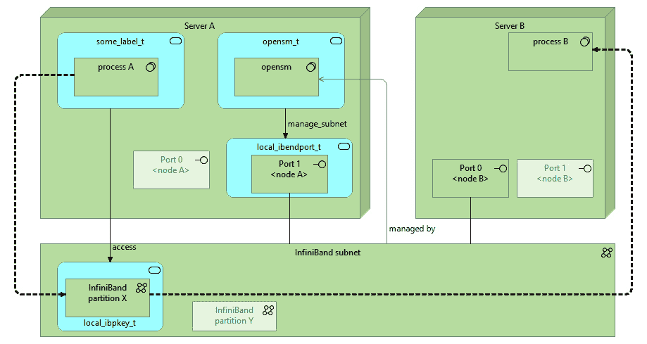
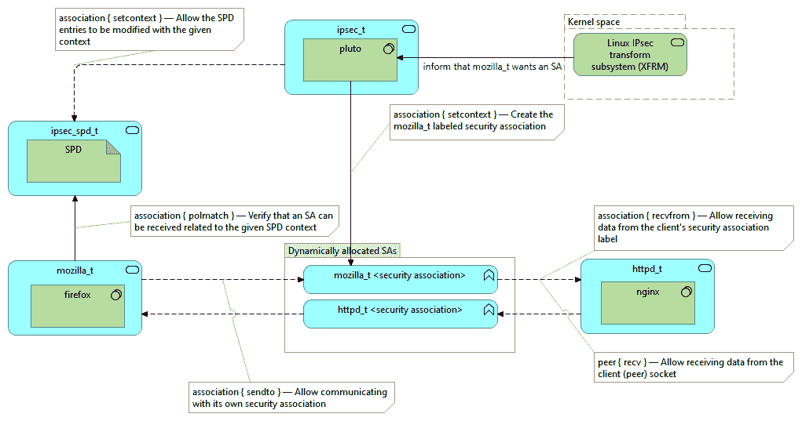
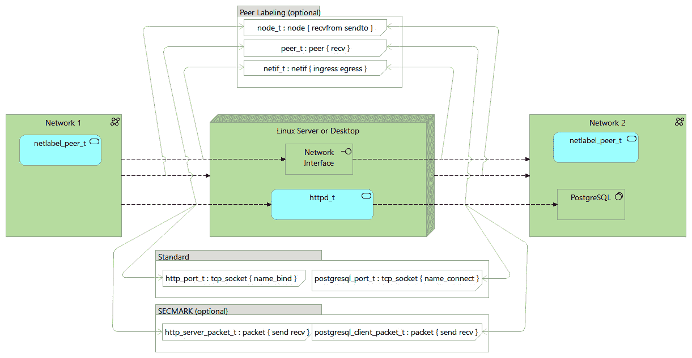

# 第五章：控制网络通信

SELinux 的强制访问控制远远超出了文件和进程访问控制的范围。SELinux 提供的一个功能是控制网络通信的能力。默认情况下，一般的网络访问控制使用基于套接字的访问控制机制，但也可以采取更详细的方法。

本章将介绍 SELinux 如何控制网络访问，讲解管理员如何利用`iptables`进一步加强网络通信安全，并描述如何通过标记的 IPsec 使用 SELinux 策略来实现跨系统安全。最后，我们将介绍 CIPSO 标记及其与 SELinux 的集成。

本章将讨论以下主题：

+   控制进程通信

+   Linux 防火墙和 SECMARK 支持

+   保护高速 InfiniBand 网络

+   理解带标记的网络

+   使用带标记的 IPsec 与 SELinux

+   支持 NetLabel 和 SELinux 的 CIPSO

# 技术要求

本章并非所有部分都适用于所有环境。例如，InfiniBand 支持需要 InfiniBand 硬件，而 NetLabel/CIPSO 支持则需要整个网络都支持 CIPSO（或者在 IPv6 的情况下支持 CALIPSO）协议，才能使主机之间能够相互通信。

查看以下视频，了解代码的实际应用：[`bit.ly/34bVDdm`](https://bit.ly/34bVDdm)

# 控制进程通信

Linux 应用程序可以直接或通过网络进行通信。但从应用程序开发者的角度来看，直接通信和网络通信之间的区别并不总是那么显著。让我们来看一下 Linux 支持的各种通信方式，以及 SELinux 如何与它们对接。

## 使用共享内存

最不类似网络的方法是使用共享内存。应用程序可以相互共享某些内存部分，并利用这些共享段在两个（或更多）进程之间进行通信。为了管理对共享内存的访问，应用程序开发者可以使用**互斥量**（**mutexes**）或**信号量**。信号量是一个原子递增或递减的整数（确保两个应用程序不会在不知情的情况下覆盖彼此的值），而互斥量可以理解为一种特殊的信号量，只取 0 或 1 的值。

在 Linux 中，共享内存访问和控制有两种实现方式：SysV 风格和 POSIX 风格。我们不会过多讨论各自的优缺点，而是重点探讨 SELinux 如何管理这些实现的访问控制。

SELinux 通过特定的类别控制 SysV 风格的原语：`sem`用于信号量，`shm`用于共享内存。信号量、互斥量和共享内存段继承创建它们的第一个进程的上下文。

想要控制 SysV 风格原语的管理员可以使用各种 `ipc*` 命令：`ipcs`（列出）、`ipcrm`（删除）和 `ipcmk`（创建）。

例如，首先列出资源，然后删除已列出的共享内存：

```
# ipcs
...
------ Shared Memory Segments ------
key		shmid	owner		perms	bytes	nattch	status
0x0052e2c1	0	postgres	600	56	6
# ipcrm -m 0
```

当使用 POSIX 风格的信号量、互斥量和共享内存段时，SELinux 通过基于文件的访问控制来管理这些操作。POSIX 风格的方法使用位于 `/dev/shm` 中的常规文件，这使得管理员能够更简单地进行控制和管理。

## 通过管道进行本地通信

操作系统中第二大类通信方法是使用管道。顾名思义，管道通常是单向通信通道，信息从一个（或多个）发送者流向一个接收者（也有例外，比如 Solaris 管道，它作为双向通道，但 Linux 不支持）。管道的另一个名字是**先进先出**（**FIFO**）。

在 Linux 中有两种类型的管道：**匿名管道**（也称为**无名管道**）和**命名管道**。它们的区别在于，命名管道使用常规文件系统中的文件作为标识，而匿名管道则通过应用程序构建，没有在常规文件系统中表示。

在这两种情况下，SELinux 会将管道视为 `fifo_file` 类别的文件。命名管道将与常规文件系统中的路径相关联，并通过 `mknod` 或 `mkfifo` 命令创建（或者通过应用程序中的 `mkfifo()` 函数创建）。然而，匿名管道将作为 `pipefs` 文件系统的一部分显示。这个文件系统是一个伪文件系统，用户无法访问，但仍然通过 Linux 的**虚拟文件系统**（**VFS**）抽象表示为一个文件系统。

从 SELinux 策略的角度来看，FIFO 文件是访问控制应用的目标：两个域如果拥有对 FIFO 文件上下文的正确权限集，就能够相互通信。

管理员可以通过诸如 `lsof` 等工具，或者通过查询 `/proc` 文件系统（作为 `/proc/<pid>/fd` 列表的一部分），来查找哪些进程正在通过 FIFOs 与其他进程进行通信。`lsof` 工具支持 `-Z` 选项来显示进程的 SELinux 上下文，甚至支持通配符：

```
# lsof -Z *:postfix_*
```

在这个例子中，`lsof` 显示了使用 `postfix_*` 标签的所有进程的信息。

## 在 UNIX 域套接字上进行通信

由于管道仅支持单向通信，两个进程之间的任何对话都需要两个管道。此外，使用管道进行真正的客户端/服务器式通信是具有挑战性的。为了实现更复杂的通信流，进程将使用套接字。

大多数管理员都知道，TCP 和 UDP 通信是通过套接字进行的。应用程序可以绑定到套接字并监听传入的通信，或者使用套接字连接到其他远程服务。但即使在单一的 Linux 系统上，套接字也可以用来促进通信流的传递。可以用于进程通信的有两种套接字类型：UNIX 域套接字和 netlink 套接字。`ioctl()` 系统调用的使用。**UNIX 域套接字**则更高级，并且管理员可以更直接地访问它们，这也是我们在这里更详细地解释它们的原因。

我们可以像管道一样区分两种 UNIX 域套接字定义：未命名套接字和命名套接字。就像管道一样，它们的区别在于用来识别套接字的路径。命名套接字是在常规文件系统中创建的，而未命名套接字是 `sockfs` 伪文件系统的一部分。类似地，套接字可以通过诸如 `lsof` 等工具查询，或者通过 `/proc/<pid>/fd` 列表查看。

关于 UNIX 域套接字，还有一个区别，即 UNIX 域套接字允许的通信格式。UNIX 域套接字可以创建为 **数据报套接字**（发送到套接字的数据保持其块大小和格式）或 **流套接字**（发送到套接字的数据可以以不同大小的块进行读取）。这对 SELinux 策略规则有一定影响。

对于 SELinux，通过 UNIX 域套接字进行通信要求两个域具有适当的通信权限，具体取决于通信的方向，对套接字文件类型的权限（`open`、`read` 和 `write`）。

此外，发送（客户端）域需要额外的权限，以便对接收（服务器）域进行访问：

+   在流套接字情况下，`unix_stream_socket` 类中的 `connectto` 权限

+   在数据报套接字情况下，`unix_dgram_socket` 类中的 `sendto` 权限

如你所见，权限取决于通过套接字使用的通信类型。

## 理解 netlink 套接字

另一个可以用于进程通信的套接字类型是 netlink。**Netlink 套接字**是允许用户空间应用程序与内核进程通信并交互的套接字，并且在特殊情况下（当网络管理被 Linux 内核委托给用户空间进程时），它们还可以与另一个用户空间应用程序通信。与常规的 UNIX 域套接字不同，后者的目标上下文与该套接字的拥有者相关联，netlink 套接字始终与 SELinux 上下文本地相关。

换句话说，当一个像 `sysadm_t` 这样的域想要操作内核的路由信息时，它将通过 netlink 路由套接字与内核进行通信，这个套接字通过 `netlink_route_socket` 类来标识：

```
$ sesearch -s sysadm_t -t sysadm_t -c netlink_route_socket -A
allow sysadm_t domain:netlink_route_socket getattr;
allow sysadm_t sysadm_t:netlink_route_socket { append bind ... };
```

随着应用程序功能的增加，可能会出现某些功能不再被当前 SELinux 策略允许的情况。管理员需要更新 SELinux 策略以允许 netlink 通信。

可以从手册页（`man netlink`）中的 netlink 信息中概括出支持的 netlink 套接字，从中可以轻松推导出 SELinux 类。例如，`NETLINK_XFRM` 套接字通过 SELinux 的 `netlink_xfrm_socket` 类获得支持。

## 处理 TCP、UDP 和 SCTP 套接字

当我们进一步深入时，我们将查看通过网络进行的套接字通信。在这种情况下，通信不是直接在进程之间进行的（因此在 Linux 术语中是 SELinux 域之间的通信），而是通过 TCP、UDP 和 **流控制传输协议** (**SCTP**) 套接字进行的。

SELinux 也会为这些端口分配类型，这些类型随后会用于套接字通信。对于 SELinux，连接到 DNS 端口的客户端应用程序（TCP 端口 `53`，在大多数 SELinux 策略中接收 `dns_port_t` 类型）在 `tcp_socket` 类中使用 `name_connect` 权限与端口类型进行通信。SCTP 协议（使用 `sctp_socket` 类）也使用相同的权限。对于 UDP 服务（因此是 `udp_socket` 类），`name_connect` 不被使用。守护进程应用程序使用 `name_bind` 权限将自己绑定到其关联的端口。

重要说明

SELinux 仅在最近才引入对 SCTP 的支持，并且并非所有 Linux 发行版都已相应更新其策略。要查看是否启用了 SCTP 支持，可以检查 `/sys/fs/selinux/policy_capabilities/extended_socket_class` 文件的值。值为 `1` 表示策略已包含 SCTP 支持，而值为 `0`（或文件不存在）表示系统尚不支持 SCTP。

管理员可以微调为每个 TCP、UDP 或 SCTP 端口分配哪个标签。为此，可以使用 `semanage port` 命令。例如，要列出当前的端口定义，可以使用以下命令：

```
# semanage port -l
SELinux Port Type	Proto	Port Number
afs3_callback_port_t	tcp	7001
...
http_port_t		tcp	80, 81, 443, 488, 8008, 8009, ...
```

在此示例中，我们看到 `http_port_t` 标签已分配给一组 TCP 端口。可以绑定到 `http_port_t` 的 Web 服务器域因此可以绑定到任何提到的端口。

为了允许守护进程（如 SSH 服务器）绑定到其他（或附加的）端口，我们需要告诉 SELinux 将该端口映射到适当的标签。例如，要允许 SSH 服务器绑定到端口 `10122`，我们首先检查该端口是否已经有专用标签。这可以通过 `sepolicy` 命令来完成：

```
$ sepolicy network -p 10122
10122: udp unreserved_port_t 1024-32767
10122: tcp unreserved_port_t 1024-32767
10122: sctp unreserved_port_t 1024-32767
```

`unreserved_port_t` 标签不是专用标签，因此我们可以将 `ssh_port_t` 标签分配给它：

```
# semanage port -a -t ssh_port_t -p tcp 10122
```

删除端口定义的过程类似：

```
# semanage port -d -t ssh_port_t -p tcp 10122
```

当特定端口类型已经分配时，实用程序将显示以下错误：

```
# semanage port -a -t ssh_port_t -p tcp 80
ValueError: Port tcp/80 already defined
```

如果是这种情况且无法使用另一个端口，则除了修改 SELinux 策略外别无选择。

## 列出连接上下文

许多管理员工具可以显示安全上下文信息。与核心工具一样，大多数这些工具使用`-Z`选项来实现这一功能。例如，要列出当前正在运行的网络绑定服务，可以使用 netstat：

```
# netstat -naptZ | grep ':80'
tcp  0  0 0.0.0.0:80  0.0.0.0:* LISTEN 17655/nginx: master system_u:system_r:httpd_t:s0
```

即使是`lsof`也可以在被请求时显示上下文信息：

```
# lsof -i :80 -Z
COMMAND PID   SECURITY-CONTEXT             USER FD TYPE DEVICE SIZE/OFF NODE NAME
nginx   17655 system_u:system_r:httpd_t:s0 root 8u IPv4 31230  0t0      *:http (LISTEN)
```

另一个用于查询连接的高级命令是`ss`命令。仅运行`ss`命令会显示当前系统的所有连接。当添加`-Z`时，它还会添加上下文信息。

例如，以下命令查询监听的 TCP 服务：

```
# ss -ltnZ
```

也可以调用更高级的查询命令——有关更多信息，请查阅`ss`手册页。

注意

使用`-Z`选项来显示 SELinux 上下文信息，或者在用户请求的活动中考虑 SELinux 上下文信息，是应用程序开发人员普遍但非强制的做法。建议检查应用程序的手册页，以确认工具是否以及如何支持 SELinux。例如，要查看`ss`手册页，可以运行`man ss`。

所有这些交互方式本质上仍然非常原始，最后一组（专注于套接字的部分）与网络关系更密切。可一旦我们查看系统之间的交互时，单凭套接字可能无法提供足够的控制。为了实现更精细的控制，接下来我们将研究防火墙功能及其 SECMARK 支持。

# Linux 防火墙和 SECMARK 支持

使用 TCP、UDP 和 SCTP 端口的做法有一些缺点。其中之一是 SELinux 无法了解目标主机，因此无法推测其安全属性。这种方法也无法限制守护进程仅绑定到特定接口：在多网卡情况下，我们可能希望确保守护进程仅绑定到面向内部网络的接口，而不是面向互联网的接口，反之亦然。

过去，SELinux 通过**接口**和**节点**标签来支持这个绑定问题：一个域可以配置为仅绑定到一个接口，而不绑定到任何其他接口，甚至可以绑定到一个特定的地址（称为节点）。然而，这种支持存在缺陷，且已被大多数情况弃用，转而支持 SECMARK 过滤。

在解释 SECMARK 以及管理员如何控制它之前，首先简要了解一下 Linux 的 netfilter 子系统，它是 Linux 系统上本地防火墙功能的事实标准。

## 介绍 netfilter

像 LSM 一样，Linux 的 netfilter 子系统在其网络栈处理框架的不同阶段提供了钩子，模块可以在这些阶段中实现。例如，`ip_tables`（使用`iptables`命令作为其控制应用程序）是这些模块之一，而`ip6_tables`和`ebtables`是 netfilter 模块的其他例子。实现 netfilter 钩子的模块必须向 netfilter 框架报告该钩子的优先级。这使得模块的执行顺序可以控制（因为多个调用相同钩子的操作会一起使用）。

`ip_tables`框架是我们将在本书中详细讨论的框架，因为它支持 SECMARK 方法。这个框架通常被称为`iptables`，它是其控制应用程序的名称。我们将在本书剩余部分使用这个术语。

`iptables`提供了多个*表*，这些表是基于功能的网络处理分类。常见的表如下：

+   `filter`表启用标准的网络过滤功能。

+   `nat`表用于修改数据包中的路由相关信息，例如源地址和/或目标地址。

+   `mangle`表用于修改数据包的大部分字段。

+   `raw`表在管理员希望将某些数据包/流量从 netfilter 的连接跟踪功能中排除时启用。

+   `security`表允许管理员在常规处理完成后对数据包进行标记。

在每个表中，`iptables`提供了一组默认的链。这些默认链指定了规则处理的处理流位置（也即在 netfilter 框架中的哪个钩子）。每个链都有一个默认策略——如果链中的规则没有匹配，返回的默认值是什么。在链中，管理员可以添加多个规则以按顺序处理。当规则匹配时，配置的动作将被执行。这个动作可以是允许数据包通过 netfilter 框架中的这个钩子，拒绝数据包，或者执行额外的处理。

常见的链（并非所有表都提供所有链）包括以下几种：

+   `PREROUTING`链是数据包接收到后的第一个数据包处理步骤。

+   `INPUT`链用于处理目标是本地系统的数据包。

+   `FORWARD`链用于处理目标是转发到另一个远程系统的数据包。

+   `OUTPUT`链用于处理来自本地系统的数据包。

+   `POSTROUTING`链是数据包发送前的最后一个数据包处理步骤。

简化地说，这些表及其链的实现大致与 netfilter 框架内调用的优先级相关。链容易与 netfilter 框架提供的钩子相关联，而表则告诉 netfilter 哪个链实现应当先执行。

## 实现安全标记。

通过数据包标记，我们可以使用 `iptables`（和 `ip6tables`）的过滤功能为数据包和连接分配标签。其思想是本地防火墙为数据包和连接打标签，然后内核使用 SELinux 授予（或拒绝）应用程序域使用这些带标签的数据包和连接的权限。

此数据包标签称为 `mangle` 和 `security`。目前只有这些表在其规则集中具有标记数据包和连接操作的功能：

+   `mangle` 表比大多数其他表具有更高的执行优先级。在这个层次上实施 SECMARK 规则通常是当所有数据包都需要被标记时，即使这些数据包中的许多最终将被丢弃。

+   `security` 表在 `filter` 表之后具有执行优先级。这允许先执行常规防火墙规则，仅对常规防火墙允许的数据包打标签。使用 `security` 表允许 `filter` 表首先执行自主访问控制规则，并且只有在成功执行 DAC 规则后，SELinux 才执行其强制访问控制逻辑。

一旦 SECMARK 操作触发，它将为数据包或通信分配一个数据包类型。然后 SELinux 策略规则将验证是否允许域接收（`recv`）或发送给定类型的数据包。例如，Firefox 应用程序（运行在 `mozilla_t` 域中）将被允许发送和接收 HTTP 客户端数据包：

```
allow mozilla_t http_client_packet_t : packet { send recv };
```

SECMARK 相关数据包的另一个支持的权限集是 `forward_in` 和 `forward_out`。在 netfilter 中使用转发时会检查这些权限。

需要注意的一点是，一旦定义了 SECMARK 操作，那么最终到达操作系统应用程序的所有数据包都将与一个标签相关联 — 即使内核正在检查的数据包或连接没有 SECMARK 规则。如果发生这种情况，内核会应用默认的 `unlabeled_t` 标签。一些发行版（如 CentOS）中默认实施的 SELinux 策略允许所有域发送和接收 `unlabeled_t` 数据包，但并非所有 Linux 发行版都是如此。

## 为数据包分配标签

当 netfilter 子系统中没有加载任何 SECMARK 相关规则时，SECMARK 就未启用，并且不检查与 SECMARK 权限相关的任何 SELinux 规则。网络数据包没有标签，因此不能应用任何强制控制。当然，仍然适用于常规套接字相关的访问控制 — SECMARK 只是一种额外的控制措施。

一旦启用单个 SECMARK 规则，SELinux 就会对所有数据包执行包标签机制。这意味着现在所有的网络数据包都需要有一个标签（因为 SELinux 只能处理有标签的资源）。数据包的默认标签（初始安全上下文）是 `unlabeled_t`，这意味着没有匹配此网络数据包的标记规则。

由于现在执行了 SECMARK 规则，SELinux 检查所有与网络数据包交互的域，以查看它们是否被授权发送或接收这些数据包。为了简化管理，一些发行版允许所有域对`unlabeled_t`数据包授予发送和接收权限。如果没有这些规则，一旦启用单个 SECMARK 规则，所有网络服务将无法正常工作。

要为数据包分配标签，我们需要定义一组与特定网络流匹配的规则，然后调用 SECMARK 逻辑（为数据包或通信标记一个标签）。大多数规则将立即匹配`ACCEPT`目标，以允许此特定通信到达系统。

让我们实现两个规则：

+   第一个规则是允许与网站（端口`80`）的通信，并将相关的网络数据包标记为`http_client_packet_t`类型（以便 Web 浏览器可以发送和接收这些数据包）。

+   第二个规则是允许与本地运行的 Web 服务器（端口`80`）的通信，并将其相关的网络数据包标记为`http_server_packet_t`类型（以便 Web 服务器可以发送和接收这些数据包）。

对于每一组规则，我们还启用连接跟踪功能，以便相关数据包能够自动正确标记并通过。

使用以下命令处理 Web 服务器流量：

```
# iptables -t filter -A INPUT -m conntrack --ctstate 
ESTABLISHED,RELATED -j ACCEPT
# iptables -t filter -A INPUT -p tcp -d 192.168.100.15 --dport 
80 -j ACCEPT
# iptables -t security -A INPUT -p tcp --dport 80 -j SECMARK 
--selctx "system_u:object_r:http_server_packet_t:s0"
# iptables -t security -A INPUT -p tcp --dport 80 -j 
CONNSECMARK --save
```

使用以下命令处理浏览器流量：

```
# iptables -t filter -A OUTPUT -m conntrack --ctstate 
ESTABLISHED -j ACCEPT
# iptables -t filter -A OUTPUT -p tcp --dport 80 -j ACCEPT
# iptables -t security -A OUTPUT -p tcp --dport 80 -j SECMARK 
--selctx "system_u:object_r:http_client_packet_t:s0"
# iptables -t security -A OUTPUT -p tcp --dport 80 -j 
CONNSECMARK --save
```

最后，要将连接标签复制到已建立和相关的数据包，请使用以下命令：

```
# iptables -t security -A INPUT -m state --state 
ESTABLISHED,RELATED -j CONNSECMARK --restore
# iptables -t security -A OUTPUT -m state --state 
ESTABLISHED,RELATED -j CONNSECMARK --restore
```

即便是这个简单的例子也表明，防火墙规则的定义本身就是一门艺术，而 SECMARK 标签只是其中的一小部分。然而，使用 SECMARK 规则可以允许某些流量，同时确保只有明确的域才能与该流量进行交互。例如，它可以在自助服务终端系统上实现，只允许一个浏览器与互联网通信，而所有其他浏览器和命令都无法通信。将所有与浏览相关的流量标记为特定标签，并只允许该浏览器域在该标签上具有`send`和`recv`权限。

## 过渡到 nftables

尽管`iptables`仍然是 Linux 上最广泛使用的防火墙技术之一，但另外两个竞争者（`nftables`和`bpfilter`）在流行度上正迅速上升。首先是`nftables`，它在某些操作上比`iptables`有一些优势，同时仍然专注于 Linux 内核中的 netfilter 支持：

+   `nftables`的代码库及其 Linux 内核支持更加精简。

+   错误报告更为完善。

+   过滤规则可以逐步更改，而不需要重新加载所有规则。

`nftables`框架最近已获得 SECMARK 支持，让我们看看如何将`http_server_packet_t`和`http_client_packet_t`标签应用于相应的流量。

应用稍大一些的`nftables`规则最常见的方法是使用配置文件，并设置`nft`解释器：

```
#!/usr/sbin/nft -f
flush ruleset
table inet filter {
  secmark http_server {
    "system_u:object_r:http_server_packet_t:s0"
  }
  secmark http_client {
    "system_u:object_r:http_client_packet_t:s0"
  }
  map secmapping_in {
    type inet_service : secmark
    elements = { 80 : "http_server" }
  }
  map secmapping_out {
    type inet_service : secmark
    elements = { 80 : "http_client" }
  }
  chain input {
    type filter hook input priority 0;
    ct state new meta secmark set tcp dport map @secmapping_in
    ct state new ct secmark set meta secmark
    ct state established,related meta secmark set ct secmark
  }
  chain output {
    type filter hook output priority 0;
    ct state new meta secmark set tcp dport map @secmapping_out
    ct state new ct secmark set meta secmark
    ct state established,related meta secmark set ct secmark
  }
}
```

`nftables`使用的语法与`iptables`比较时是可以识别的。脚本首先定义 SECMARK 值。之后，我们创建一个端口（例如示例中的`80`）与用于 SECMARK 支持的值之间的映射。当然，已经建立的会话也会收到适当的 SECMARK 标签。

如果我们定义多个条目，`elements`变量使用逗号分隔不同的值：

```
elements = { 53 : "dns_client" , 80 : "http_client" , 443 : "http_client" }
```

除了`nftables`之外，另一个获得关注的防火墙解决方案是 eBPF，接下来我们将介绍它。

## 评估 eBPF

eBPF（以及`bpfilter`命令）本质上与`iptables`和`nftables`完全不同，因此在介绍 eBPF 的 SELinux 支持细节之前，先了解一下 eBPF 的工作原理。

### 理解 eBPF 的工作原理

**扩展伯克利数据包过滤器**（**eBPF**）是一个框架，使用内核中的虚拟机来解释和执行 eBPF 代码，这些代码包括类似于处理器指令集操作的低级指令。由于它是非常低级的，且与处理器无关的语言，它可以用来创建非常快速且高度优化的规则。

BPF 最初用于分析和过滤网络流量（例如，在`tcpdump`中）。由于其高效性，它很快被发现应用于其他工具，超出了简单的网络过滤和分析功能。随着 BPF 扩展到其他用例，它被称为扩展 BPF，或者 eBPF。

Linux 内核中的 eBPF 框架已成功用于性能监控，其中 eBPF 应用程序接入运行时进程和内核子系统，测量性能并将指标反馈给用户空间应用程序。它当然还支持对（网络）套接字、cgroups、进程调度等的过滤，且支持的功能列表正在迅速增长。

与使用钩子接入系统调用和其他安全敏感操作的 LSM 框架一样，eBPF 也接入了 Linux 内核。它偶尔可以使用现有的钩子（如 Linux 的**内核探针**或**kprobes**框架），从而受益于这些接口的稳定性。因此，我们可以预期 eBPF 将在 Linux 内核的其他领域进一步扩展其支持。

eBPF 应用程序（**eBPF 程序**）是在用户空间定义的，然后提交到 Linux 内核。内核验证代码的安全性和一致性，以确保虚拟机不会试图突破它所工作领域的边界。如果通过验证（可能会稍微修改代码，因为 Linux 内核有些操作会修改 eBPF 代码以适应环境或安全规则），eBPF 程序会在 Linux 内核中运行（在其虚拟机内），并执行其预定的任务。

注意

Linux 内核可以将 eBPF 指令编译成本地的、特定于处理器的指令，而不是让虚拟机来解释它们。然而，由于这会带来更高的安全风险，因此将 `/proc/sys/net/core/bpf_jit_enable` 设置为 `1`。

这些程序可以在内存中加载和保存信息，称为映射。这些 **eBPF 映射** 可以被用户空间应用程序读取或写入，从而提供与运行中的 eBPF 程序交互的主要接口。这些映射通过文件描述符进行访问，允许进程根据需要传递和克隆这些文件描述符。

各种产品和项目正在使用 eBPF 创建高性能网络功能，例如软件定义网络配置、DDoS 缓解规则、负载均衡器等。与基于 netfilter 的防火墙不同，后者依赖于内核中的庞大代码库，并通过配置进行调优，eBPF 程序是专门为其目的构建的，仅此而已，且只有这些代码在积极运行。

### 保护 eBPF 程序和映射

对于 eBPF 程序和映射，默认的安全措施非常有限，部分原因是 Linux 内核验证器（在将 eBPF 代码传递给虚拟机之前验证代码）被高度信任，部分原因是只有在相关进程具有 `CAP_SYS_ADMIN` 能力时，才允许加载 eBPF 代码。由于该能力基本上意味着完全的系统访问，因此没有认为有必要进行额外的安全控制。

自 Linux 内核 4.4 起，一些类型的 eBPF 程序（例如套接字过滤）即使由非特权进程加载也可以运行（但当然，只能针对这些进程有权限访问的套接字）。系统允许加载与 cgroup `CAP_NET_ADMIN` 能力相关的程序。最近，加载 eBPF 程序的权限已被添加到 `CAP_BPF` 和 `CAP_TRACING` 能力中，尽管并非所有 Linux 发行版都已经提供支持这些能力的内核。但希望对 eBPF 进行更精细控制的 Linux 管理员，可以使用 SELinux 来调节和调整 eBPF 的处理。

SELinux 有一个 `bpf` 类，用于管理基本的 eBPF 操作：`prog_load`、`prog_run`、`map_create`、`map_read` 和 `map_write`。每当一个进程创建一个程序或映射时，该程序或映射将继承该进程的 SELinux 标签。如果这些映射或程序的文件描述符被泄露，恶意应用程序仍然需要拥有对该标签的必要权限，才能利用它。

用户空间操作可以通过 `/sys/fs/bpf` 虚拟文件系统与 eBPF 框架交互，因此一些 Linux 发行版将特定的 SELinux 标签（`bpf_t`）与此位置关联。这允许管理员通过 SELinux 策略规则管理对这种类型的访问。

尽管 eBPF 极具扩展性，但目前围绕它的简化框架数量较少，因为它仍处于非常早期的阶段。然而，我们可以预期，随着一个名为 `bpfilter` 的新工具展示了基于 eBPF 的防火墙功能，更多复杂的支持会很快到来。

### 使用 bpfilter 过滤流量

`bpfilter` 应用程序是一种构建新的 eBPF 程序以过滤和处理流量的应用程序。它允许管理员在不理解低级 eBPF 指令的情况下构建防火墙功能，并且最近开始支持 `iptables`：管理员通过 iptables 创建规则，而 `bpfilter` 将这些规则转换并转化为 eBPF 程序。

重要提示

虽然 `bpfilter` 是 Linux 内核树的一部分，但目前应视为一种价值证明，而非生产就绪的防火墙功能。

`bpfilter` 创建的 eBPF 程序会在 Linux 内核中网络设备驱动程序和 TCP/IP 栈之间的一个层次中钩住，称为 **eXpress Data Path** (**XDP**) 层。在这一层，eBPF 程序可以访问完整的网络数据包信息（包括如以太网等链路层协议）。

要使用 `bpfilter`，需要在 Linux 内核中启用适当的设置，包括 `CONFIG_BPFILTER` 和 `CONFIG_BPFILTER_UMH`。后者是 `bpfilter` 用户模式助手，它将捕获由 `iptables` 生成的防火墙规则，并将这些规则转换为 eBPF 应用程序。

在加载 `bpfilter` 用户模式助手之前，我们需要在 SELinux 中允许 `execmem` 权限：

```
# setsebool allow_execmem on
```

接下来，加载 `bpfilter` 模块，这将使用户模式助手在系统中处于激活状态：

```
# modprobe bpfilter
# dmesg | tail
...
bpfilter: Loaded bpfilter_umh pid 2109
```

现在，使用前面列出的命令加载 `iptables` 防火墙。这些指令会被转换成 eBPF 程序，如 `bpftool` 所示：

```
# bpftool p
1: xdp  tag 8ec94a061de28c09 dev ens3
        loaded_at Apr 25/23:19  uid:0
        xlated 533B  jited 943B  memlock 4096B
```

eBPF 代码本身也可以显示，但目前对于管理员来说几乎难以阅读。

上述所有防火墙功能都与 Linux 内核中支持的 TCP/IP 栈交互。然而，也有一些网络并不依赖于 TCP/IP，例如 InfiniBand。幸运的是，即使在这些更专业的网络环境中，SELinux 也可以用于控制通信流。

# 保护高速 InfiniBand 网络

**InfiniBand** 标准是一项相对较新的（在网络历史上）技术，能够实现非常高的吞吐量和非常低的延迟。它通过在网络层（协议）上具有非常低的开销，并且允许用户应用程序直接访问网络层来实现这一点。这种直接访问也对 SELinux 有影响，因为 Linux 内核不再积极参与通过 InfiniBand 链路传输数据。

让我们首先了解 InfiniBand 的样子，然后再看看如何继续对其通信流应用 SELinux 控制。

## 直接访问内存

InfiniBand 的一个主要前提是允许用户应用程序直接访问网络。InfiniBand 本身是一个流行的**远程直接内存访问**（**RDMA**）实现，并且得到了供应商的广泛支持。我们发现 RDMA 在高性能集群中被广泛使用。

由于是直接访问，控制措施只能在设置访问方式时实施。如果没有 SELinux，设置和管理 InfiniBand 通信所需要做的仅仅是访问设备文件本身。如果一个进程能够写入 InfiniBand 设备，那么它就能使用 InfiniBand。默认情况下，这些设备只有 `root` 用户可以访问。

InfiniBand 设备是网络卡或**主机通道适配器**（**HCA**），并且可以有多个端口。InfiniBand **端口**是连接到 InfiniBand 子网的链路或接口。子网是多个机器（端口）连接的高速网络。与常规网络一样，InfiniBand 交换机用于促进子网之间的通信，路由器则用于连接不同的子网。

InfiniBand 子网由**子网管理器**（**SM**）管理。这是一个协调子网内不同端口以及分区管理的进程。InfiniBand 中的**分区**是一种区分子网内不同通信的方式，类似于常规网络中的**虚拟局域网**（**VLAN**）。在分区通信中，子网管理器指定哪些端口可以用于哪个通信分区。

## 保护 InfiniBand 网络

与常规网络不同，常规网络中防火墙和交换机级别的访问控制是防止未经授权访问的常见手段，而 InfiniBand 的保护措施很少。InfiniBand 在很大程度上假设网络处于一个受信任的环境中。然而，这并不排除我们在 SELinux 中对哪些进程可以访问 InfiniBand 网络进行更严格的控制。

由于通信流本身直接映射到设备的内存中，Linux 内核没有可用于像常规 TCP/UDP 流量那样进行数据包级控制的钩子（例如使用 SECMARK 功能），甚至没有用于套接字的会话级控制。相反，SELinux 集中于以下两个主要控制，如下图所示：



图 5.1 – SELinux InfiniBand 控制

这两个主要控制措施如下：

+   控制谁可以管理 InfiniBand 子网

+   控制谁可以访问 InfiniBand 分区

为了正确管理这些控制，`semanage` 应用程序会将正确的类型分配给适当的 InfiniBand 资源。然而，并非所有 SELinux 策略都包含适当的类型，因此我们还需要将这些类型添加进来。

## 管理 InfiniBand 子网

我们从管理 InfiniBand 网络开始。在 Linux 中使用 InfiniBand，通常通过`opensm`应用程序来实现。许多 InfiniBand 适配器有多个端口，允许服务器参与多个 InfiniBand 子网。通过 SELinux，我们可以控制哪个域可以管理子网，通过控制对设备上 InfiniBand 端口的访问。

首先，我们需要为与子网关联的 InfiniBand 端口分配一个标签。为了实现这一点，我们首先需要获取正确的 InfiniBand 设备，创建合适的标签（类型），然后将其分配给端口。

我们可以通过使用`ibv_devinfo`命令来查询系统中可用的 InfiniBand 设备：

```
# ibv_devinfo
hca_id: rxe0
  transport:	InfiniBand (0)
  fw_ver:		0.0.0
  ...
  phys_port_cnt:
    port:	1
		state:	PORT_ACTIVE (4)
		...
```

接下来，我们创建一个类型（标签）并将其分配给端口。此类型仅用于验证`opensm`应用程序对该端口的访问。我们使用 CIL 语言来实现这一点（我们将在*第十六章*，*使用 SELinux CIL 开发策略*中详细说明）。创建一个文件，内容如下（我们称之为`infiniband_subnet.cil`）：

```
(typeattribute ibendport_type)
(type local_ibendport_t)
(typeattributeset ibendport_type local_ibendport_t)
(allow opensm_t local_ibendport_t (infiniband_endport (manage_subnet)))
```

在前面的代码中，我们通过一个新的类型`local_ibendport_t`来增强 SELinux 策略，将其分配给`ibendport_type`属性，然后授予`opensm_t`域在`infiniband_endport`类中管理子网的权限。

让我们加载此策略增强：

```
# semodule -i infiniband_subnet.cil
```

最后，我们将新创建的类型分配给 InfiniBand 端口：

```
# semanage ibendport -a -t local_ibendport_t -z rxe0 1
```

此命令将`local_ibendport_t`类型分配给`rxe0`设备的端口号`1`（通过`ibv_devinfo`获取）。一旦映射完成，我们也可以使用`semanage`查询它：

```
# semanage ibendport -l
SELinux IB End Port Type	IB Device Name	Port Number
local_ibendport_t		rxe0			0x1
```

如果没有任何映射，命令将不会显示任何输出。

重要提示

目前，大多数 Linux 发行版尚未在 SELinux 策略中加入 InfiniBand 支持，因此我们需要创建自定义标签。我们可以预期，发行版将为 InfiniBand 资源添加默认类型，并且 SELinux 对 InfiniBand 的支持将随着合理的默认设置而扩展。

如果我们在启用了 SELinux 的系统上使用 InfiniBand 且没有任何端口映射，未标记类的初始安全上下文将作为该端口的标签， 即`unlabeled_t`。然而，不建议使用此标签，因为它通常用于未标记的资源。将任何权限授予`unlabeled_t`类型应仅限于具有高特权的进程，并且在使用时应仔细考虑，以确保日志解释和 SELinux 策略规则与 InfiniBand 资源的关系是清晰的（通过良好文档化的类型）。

## 控制对 InfiniBand 分区的访问

前一部分专注于允许管理应用程序`opensm`管理子网，本节将重点讨论如何限制对 InfiniBand 网络的访问，仅允许正确的域进行访问。如前所述，InfiniBand 子网可以通过使用 InfiniBand 分区进一步划分为多个网络。

最初，这些分区用于在流上实现**服务质量**（**QoS**）或特定的带宽和性能要求。SM 定义了分区及其属性，应用程序使用**分区键**（**P_Key**）来通知 InfiniBand 网络哪些通信必须在特定分区中进行。

SELinux 可以通过在 InfiniBand 子网和 P_Key 与 SELinux 类型之间创建映射来管理这些分区。然而，与子网管理一样，我们首先需要找到适当的详细信息并创建一个合适的 SELinux 类型，才能定义映射。

让我们从确定子网和分区的详细信息开始。这两个信息由`opensm`进行管理。如果您无法访问`opensm`配置文件，则需要从（InfiniBand）网络管理员处获取这些详细信息。

在`opensm`分区配置（`/etc/rdma/partitions.conf`）中，子网和前缀可以如下找到：

```
# grep '=0x' /etc/rdma/partitions.conf
Default=0x7fff, rate=3, mtu=4, scope=2, defmember=full;
Default=0x7fff, ipoib, rate=3, mtu=4, scope=2;
rxe0_1=0x0610, rate=7, mtu=4, scope=2, defmember=full;
rxe0_1=0x0610, ipoib, rate=7, mtu=4, scope=2;
```

在此示例中，定义了两个分区。第一个是默认分区，需保持（`0x7fff`）。第二个分区，其键为`0x0610`，在`rxe0`设备和端口`1`上处于活动状态。我们将使用 SELinux 保护的正是这个第二个分区。

让我们创建一个新的类型，并将其分配给此分区。我们再次使用 CIL 格式定义策略增强，并将这些规则存储在名为`infiniband_pkey.cil`的文件中：

```
(typeattribute ibpkey_type)
(type local_ibpkey_t)
(typeattributeset ibpkey_type local_ibpkey_t)
(allow unconfined_t local_ibpkey_t (infiniband_pkey (access)))
```

在此示例中，我们创建了`local_ibpkey_t`类型，将其分配给`ibpkey_type`属性，并在`infiniband_pkey`类中授予了`unconfined_t`访问权限。

让我们加载策略：

```
# semodule -i infiniband_pkey.cil
```

我们现在可以为这个分区创建适当的映射，并将其限制在`ff12::`子网前缀内：

```
# semanage ibpkey -a -t local_ibpkey_t -x ff12:: 0x0610
# semanage ibpkey -l
SELinux IB PKey Type	Subnet_Prefix	Pkey Number
local_ibpkey_t		ff12::		0x610
```

虽然我们可以为每个分区创建单独的类型，但我们也可以使用 SELinux 范围来支持 SELinux 类别：

```
# semanage ibpkey -a -t local_ibpkey_t -r s0-s0:c0.c4 -x ff12:: 0x0610
```

使用类别，我们可以根据源域类别授予访问权限，这一点在我们接下来讨论的其他网络保护措施（如标记化网络）中也能受益。

# 理解标记化网络

进一步微调网络级访问控制的另一种方法是引入标记化网络。通过标记化网络，安全信息会在主机之间传递（与 SECMARK 不同，SECMARK 仅在 netfilter 子系统接收到数据包时才开始，并且其标记不会离开主机）。这也被称为对等标记，因为安全信息在主机（对等体）之间传递。

标记化网络的优点在于安全信息在网络中保持一致，允许在系统之间强制执行端到端的强制访问控制设置，同时保留系统之间通信流的敏感级别。然而，主要的缺点是，这需要一种额外的网络技术（协议），能够管理网络数据包或流的标签。

SELinux 当前支持两种实现方式，作为标签化网络方法的一部分：NetLabel 和标签化 IPsec。使用 NetLabel 时，存在两种实现方式：回退标签和 CIPSO。在这两种情况下，只有源域的敏感度会在通信过程中保留。标签化的 IPsec 支持传输整个安全上下文。

注意

NetLabel 实际上支持启用回环的完整标签支持。在这种情况下，完整标签（而不仅仅是敏感度和类别）会被传递。然而，这仅适用于通过回环接口的通信，因此不会离开当前主机。

很久以前，NetLabel/CIPSO 和标签化 IPsec 的支持合并为一个公共框架，这引入了 SELinux 中的三项额外权限检查：接口检查、节点检查和对等检查。这些权限检查仅在使用标签化流量时激活；如果没有标签化流量，这些检查会被简单忽略。

## 使用 NetLabel 进行回退标签

NetLabel 项目支持回退标签功能，管理员可以为来自或前往未使用标签化网络的网络位置的流量分配标签。通过使用回退标签，即使没有标签化的 IPsec 或 NetLabel/CIPSO，接下来几节提到的对等控制也能得以应用。

`netlabelctl` 命令用于控制 NetLabel 配置。让我们为所有来自 `192.168.100.1` 地址的流量创建一个回退标签分配：

```
# netlabelctl unlbl add interface:eth0 address:192.168.100.1 label:system_u:object_r:netlabel_peer_t:s0
```

要列出当前定义，请使用以下命令：

```
# netlabelctl -p unlbl list
Accept unlabeled packets : on
Configured NetLabel address mappings (1)
 interface: eth0
   address: 192.168.100.1/32
    label: "system_u:object_r:netlabel_peer_t:s0"
```

有了这个规则，标签化网络将被激活。任何来自 `192.168.100.1` 地址的流量都会被标记为 `netlabel_peer_t:s0` 标签，而所有其他流量则会被标记为（默认）`unlabeled_t:s0` 标签。当然，SELinux 策略必须允许所有域从 `unlabeled_t` 对等方或 `netlabel_peer_t` 对等方接收 `recv` 权限。

回退标签在支持标签化网络环境与非标签化网络混合使用时非常有用，这也是我们在此记录它的原因，先于描述各种标签化网络技术。

## 基于网络接口限制流量

接口检查的想法是，每个进入系统的包都会通过接口上的 `ingress` 检查，而每个离开系统的包都会通过 `egress` 检查。`ingress` 和 `egress` 是涉及的 SELinux 权限，而接口则被赋予一个安全上下文。

可以使用 `semanage` 工具授予接口标签，特别适用于在 MLS 情况下为接口分配敏感级别，尽管也可以为接口分配不同的标签（但这需要对正在运行的 SELinux 策略进行更多调整，以保证系统能够正常工作）：

```
# semanage interface -a -t netif_t -r s1-s1:c0.c128 eth0
```

与其他 `semanage` 命令类似，我们可以按如下方式查看当前的映射：

```
# semanage interface -l
SELinux Interface	Context
eth0				system_u:object_r:netif_t:s1-s1:c0.c128
```

请记住，对于传入通信，执行域是对等域。对于标记的 IPsec，这将是发起连接的客户端域，而在 NetLabel/CIPSO 中，这是关联的对等标签（例如 `netlabel_peer_t`）。

默认情况下，接口被标记为 `netif_t`，且没有敏感度约束。然而，这不会在 `semanage interface -l` 输出中显示，因为其默认输出为空。

## 接受来自选定主机的对等通信

SELinux 节点表示数据发送到（`sendto`）或接收自（`recvfrom`）的特定主机（或主机网络），并通过 SELinux 节点类进行处理。就像接口一样，这些可以通过 `semanage` 工具列出和定义。在以下示例中，我们将 `10.0.0.0/8` 网络标记为 `node_t` 类型，并为其关联一组类别：

```
# semanage node -a -t node_t -p ipv4 -M 255.255.255.255 -r s0-s0:c0.c128 192.168.100.1
```

我们还可以列出当前的定义：

```
# semanage node -l
```

类似于网络接口流，传入通信的执行域是对等标签。

默认情况下，节点被标记为`node_t`，且没有类别约束。然而，在`semanage node -l`的输出中，这不会显示，因为其默认输出为空。

## 验证对等流

最终检查是`peer`类检查。对于标记的 IPsec，这是发送数据的套接字的标签（例如`mozilla_t`）。然而，对于 NetLabel/CIPSO，对等标签将是静态的，基于源，因为 CIPSO 只能传递敏感度级别。NetLabel 中常见的标签是`netlabel_peer_t`。

与接口和节点检查不同，对等检查将对等域作为目标，而不是源。

重要说明

在所有标记的网络使用案例中，拒绝列表中的进程与审计日志中显示的拒绝无关。这是因为拒绝是从内核子系统内部触发的，而不是通过用户进程调用触发的。因此，内核中断了一个不相关的进程以准备并记录拒绝，且该进程名称在拒绝事件中被使用。

最后，查看以下图表，它提供了这些各种控制及其适用级别的概览：



图 5.2 – 各种与网络相关的 SELinux 控制的示意图

顶级控制在域级别处理（如`httpd_t`），而底层控制则在对等级别处理（如 `netlabel_peer_t`）。

## 使用旧式控制

大多数 Linux 发行版启用 `network_peer_control` 功能。这是 SELinux 子系统中的一种增强功能，利用前述的对等类来验证对等流。

然而，SELinux 策略可以选择回到之前的方式，在这种方式下，同伴之间的流量不再通过同伴类进行控制，而是使用 `tcp_socket` 类进行通信。在这种情况下，`tcp_socket` 类将会用于 `peer` 域，并且还会使用 `recvfrom` 权限（除了已有的 `tcp_socket` 权限之外）。

当前 `network_peer_control` 能力的值可以通过 SELinux 文件系统查询：

```
# cat /sys/fs/selinux/policy_capabilities/network_peer_controls
1
```

如果该值为 `0`，则前面提到的同伴控制将通过 `tcp_socket` 类而非同伴类进行处理。

SELinux 中的默认标签化网络控制不会传递任何进程上下文，而使用 NetLabel 的回退标签化通常用于系统既参与标签化网络又参与非标签化网络的环境。然而，还有一种更常见的网络实现，它不仅支持标签化网络，还能传递域上下文，并且不需要专门的环境：标签化 IPsec。

# 使用带标签的 IPsec 与 SELinux

尽管设置和维护一个 IPsec 配置远超本书的范围，但让我们看一个简单的 IPsec 示例，展示如何在系统上启用标签化 IPsec。记住，之前提到的接口、节点和同伴级别的标签化网络控制，都是在我们使用标签化 IPsec 时自动启用的。

在 IPsec 配置中，有三个重要的概念需要注意：

+   **安全策略数据库**（**SPD**）包含了内核在何时应通过 IP 策略处理通信的规则和信息（从而通过安全关联处理通信）。

+   **安全关联**（**SA**）是两个主机之间的单向通道，包含该通道的所有安全信息。当使用标签化 IPsec 时，它还包含了导致安全关联形成的客户端的上下文信息。

+   **安全关联数据库**（**SAD**）包含了各个安全关联。

在标签化 IPsec 配置中，安全关联不再仅仅通过源和目标地址进行索引，还包括源上下文。因此，参与标签化 IPsec 配置的 Linux 系统，在主机之间的单一通信流中，很容易就会有数十个 SA，因为每个 SA 现在还代表一个客户端域。

标签化 IPsec 通过 SELinux 引入了一些额外的访问控制：

+   SPD 中的每个条目都有一个上下文。想要获取 SA 的域需要拥有对该上下文的 `polmatch` 权限（这是 `association` 类的一部分）。此外，发起 SA 的域需要拥有对目标域的 `setcontext` 权限（也是 `association` 类的一部分）。

+   只有授权的域才能修改 SPD，修改操作也受到 `setcontext` 权限的管理，但现在也要考虑 SPD 上下文条目。这一权限通常授予 IPsec 工具，例如 Libreswan 的 pluto（`ipsec_t`）。

+   参与 IPsec 通信的域必须拥有与自身关联的 `sendto` 权限，并拥有与 `peer` 域关联的 `recvfrom` 权限。接收域还需要拥有来自 `peer` 类的 `recv` 权限，该权限与 `peer` 域相关联。

因此，尽管标记化 IPsec 无法决定 `mozilla_t` 是否能与 `httpd_t` 通信（因为 `mozilla_t` 只需要能够发送到其自身关联），但它可以控制 `httpd_t` 是否允许或拒绝来自 `mozilla_t` 的传入通信（因为它需要在 `mozilla_t` 关联上拥有 `recvfrom` 权限）。下图展示了这一复杂的权限博弈：



图 5.3 – 标记化 IPsec 的 SELinux 控制示例

在接下来的示例中，我们将使用 Libreswan 工具设置两个主机之间的简单 IPsec 隧道。

## 设置常规 IPsec

配置 Libreswan 主要是配置 Libreswan 的主配置文件 (`ipsec.conf`)。大多数发行版会使用一个 `include` 目录（如 `/etc/ipsec.d`），管理员或应用程序可以将特定连接的设置放入该目录。通常，`include` 目录用于实际的 IPsec 配置，而一般的 `ipsec.conf` 文件则用于配置 Libreswan 的行为。

要创建主机到主机的连接，我们首先在两台主机上定义共享密钥。我们将连接命名为 `rem1-rem2`（因为这两台主机的主机名），因此共享密钥将存储为 `/etc/ipsec.d/rem1-rem2.secrets`：

```
192.168.100.4 192.168.100.5 : PSK "somesharedkey"
```

接下来，我们在 `/etc/ipsec.d/rem1-rem2.conf` 中定义 VPN 连接，如下所示：

```
conn rem1-rem2
	left=192.168.100.4
	right=192.168.100.5
	auto=start
	authby=secret
	#labeled-ipsec=yes
	#policy-label=system_u:object_r:ipsec_spd_t:s0
```

启用标记化 IPsec 的设置暂时被注释掉，先测试不带此功能的 IPsec 连接。

在两台系统上启动 IPsec 服务：

```
# systemctl start ipsec
```

验证连接是否正常工作，例如，可以通过 `tcpdump` 检查网络流量，或通过 `ip xfrm state` 检查连接状态。

## 启用标记化 IPsec

要在 Libreswan 中使用标记化 IPsec，请取消注释 `/etc/ipsec.d/rem1-rem2.conf` 中的 `labeled-ipsec` 和 `policy-label` 指令。重启 `ipsec` 服务，并重新尝试连接。

当一个应用程序尝试通过 IPsec 与远程域进行通信时，`pluto`（或任何其他支持标记 IPsec 的 **Internet Key Exchange version 2**（**IKEv2**）客户端）将与对方交换必要的信息（包括上下文）。然后，双方将更新 SPD，并将相同的 **安全策略信息**（**SPI**）与之关联。从那时起，发送方将把商定的 SPI 信息添加到 IPsec 数据包中，以便远程端可以立即重新关联正确的上下文。

这里的巨大优势是客户端和服务器的上下文，包括敏感度和类别，是同步的（它们并没有在每个数据包中实际发送，但在建立安全关联时会初步交换）。

在某些专业或高度安全的环境中，标记网络在网络内部得到支持。最常用的标记技术是 CIPSO，接下来我们将介绍其 SELinux 支持。

# 支持 NetLabel 和 SELinux 的 CIPSO

NetLabel/CIPSO 标签并在网络中传输敏感度。与标记的 IPsec 不同，其他上下文信息不会被发送或同步。因此，当我们考虑两个点之间的通信流时，它们将具有默认的、共同的 SELinux 类型（而不是与源或目标关联的 SELinux 类型），但将根据远程端的敏感度标签拥有敏感度标签。

NetLabel 配置的一部分是映射定义，它告知系统哪些通信流（来自选定接口，甚至是配置的 IP 地址）属于某个 **Interpretation Domain**（**DOI**）。CIPSO 标准将 DOI 定义为一组对 CIPSO 标签进行类似解读的系统，或者在我们的情况下，使用相同的 SELinux 策略和敏感度标签配置。

一旦这些映射建立，NetLabel/CIPSO 将在主机之间传递敏感度信息（和类别）。我们在通信流中看到的上下文将是 `netlabel_peer_t`，这是分配给 NetLabel/CIPSO 源流量的默认上下文。

通过这种方法，我们可以启动具有敏感度范围的守护进程，从而仅接受具有正确安全许可的用户或客户端的连接，即使是在远程的 NetLabel/CIPSO 启用系统上。

## 配置 CIPSO 映射

拥有一个良好的 CIPSO 启用网络的初步要求是要对将使用的 DOI 及其后果有共同的理解。标记网络可以为特定目的使用不同的 DOI。

除了 DOI，我们还需要关注如何通过启用 CIPSO 的网络传递类别和敏感度。CIPSO 标签控制此设置，NetLabel 支持以下三个值：

+   使用`tags:1`时，类别在 CIPSO 包中以位图的方式提供。这是最常见的方式，但将支持的类别数量限制为 240（从 0 到 239）。

+   使用`tags:2`时，类别会被单独列举。这允许更广泛的类别范围（最多 65,543 个），但最多仅支持 15 个列举类别。当你有许多类别但每个范围只需要支持少数类别时，建议使用`tags:2`。

+   使用`tags:5`时，类别可以通过范围方式列出（最低和最高），最多可以有七对这样的低/高范围。

请注意，CIPSO 标签结果是在后台处理的：系统管理员只需配置 NetLabel 映射以使用所选标签值。

假设我们有两个启用了 CIPSO 的网络，`10.1.0.0/16`与`doi:1`相关联，`10.2.0.0/16`与`doi:2`相关联。两者都使用标签值`1`。首先，我们启用 CIPSO 并允许其传递 CIPSO 标记的包，DOI 设置为`1`或`2`。我们不进行任何翻译（因此，CIPSO 包上设置的类别和敏感度将由 SELinux 使用）：

```
# netlabelctl cipsov4 add pass doi:1 tags:1
# netlabelctl cipsov4 add pass doi:2 tags:1
```

如果需要进行翻译（比如我们使用敏感度`s0-s3`，而 CIPSO 网络使用敏感度`100-103`），命令会像这样：

```
# netlabelctl cipsov4 add std doi:1 tags:1 
levels:0=100,1=101,2=102
```

接下来，我们实现映射规则，告诉 NetLabel 配置将哪个网络流量与`doi:1`或`doi:2`相关联：

```
# netlabelctl map del default
# netlabelctl map add default address:10.1.0.0/16 protocol:cipsov4,1
# netlabelctl map add default address:10.2.0.0/16 protocol:cipsov4,2
```

要列出当前的映射，使用`list`选项：

```
# netlabelctl map list -p
Configured NetLabel domain mappings (2)
 domain: DEFAULT (IPv4)
   address: 10.1.0.0/16
    protocol: CIPSO, DOI = 1
 domain: DEFAULT (IPv4)
   address: 10.2.0.0/16
    protocol: CIPSO, DOI = 2
```

就是这样。我们移除了初始的默认映射（因为那样会阻止新默认映射的添加），然后配置了 NetLabel 来为给定网络标记合适的 CIPSO 配置流量。

## 添加特定领域的映射

NetLabel 还可以配置为确保给定的 SELinux 域使用定义良好的 DOI，而不是之前配置的默认 DOI。例如，要让 SSH 守护进程（运行在`sshd_t`域中）的网络流量被标记为 CIPSO `doi:3`，我们可以使用以下配置：

```
# netlabelctl cipsov4 add pass doi:3 tags:1
# netlabelctl map add domain:sshd_t protocol:cipsov4,3
```

映射规则甚至可以更加选择性。我们可以告诉 NetLabel，对于来自某个网络的 SSH 流量使用`doi:2`，对于来自另一个网络的 SSH 流量使用`doi:3`，甚至在来自任何其他网络时使用未标记的网络流量：

```
# netlabelctl map del domain:sshd_t protocol:cipsov4,3
# netlabelctl map add domain:sshd_t address:10.1.0.0/16 protocol:cipsov4,1
# netlabelctl map add domain:sshd_t address:10.4.0.0/16 protocol:cipsov4,3
# netlabelctl map add domain:sshd_t address:0.0.0.0/0 protocol:unlbl
```

NetLabel 框架会优先匹配最具体的规则，因此，只有在没有其他规则匹配时，0.0.0.0/0 才会被匹配。

## 使用本地 CIPSO 定义

如前所述，NetLabel 默认只传递敏感度和类别。然而，当使用本地（通过回环接口）CIPSO 时，可以使用完整的标签控制。当启用时，对默认的`netlabel_peer_t`类型将不应用对等控制，而是使用客户端或服务器域。

要使用本地 CIPSO 定义，首先声明本地使用的 DOI：

```
# netlabelctl cipsov4 add local doi:5
```

接下来，让本地通信使用定义的 DOI（在我们的示例中为`5`）：

```
# netlabelctl map add default address:127.0.0.1 protocol:cipsov4,5
```

启用此功能后，本地通信将与`doi:5`关联，并使用本地映射，将完整标签传递给强制访问控制系统（SELinux）。

## 支持 IPv6 CALIPSO

CIPSO 是 IPv4 协议，但 IPv6 也有类似的框架，称为`calipso`而非`cipsov4`。

与 CIPSO 在 NetLabel 中的实现相比，CALIPSO 有一些小的差异：

+   仅支持一种标签类型（与 CIPSO 的三种标签类型不同）。因此，CALIPSO 管理员无需在任何地方指定`tags:#`。

+   CALIPSO 仅使用直通模式。不支持翻译。

+   当前，NetLabel CALIPSO 实现不支持本地模式，其中完整标签会被传递。

除了这些差异，CALIPSO 的使用与 CIPSO 非常相似。

# 概述

SELinux 默认使用基于通信原语的文件表示或所用套接字的访问控制。在 InfiniBand 网络中，访问控制仅限于访问 InfiniBand 端口和分区。对于 TCP、UDP 和 SCTP 端口，管理员可以通过`semanage`命令处理控制，而不需要更新 SELinux 策略。一旦进入基于网络的通信领域，可以通过 Linux netfilter 支持、更高级的通信控制来实现，通过 SECMARK 标签和对等标签进行控制。

在 SECMARK 标签的情况下，使用本地防火墙规则将上下文映射到数据包，然后通过 SELinux 策略进行管理。在对等标签的情况下，应用程序上下文本身（标记为 IPsec）或其敏感性级别（netfilter/CIPSO）标识访问控制所应用的资源。这允许通过 SELinux 策略实现几乎是应用到应用的网络流量控制。

我们了解到，最常见的防火墙框架（`iptables`和`nftables`）已经支持 SECMARK，而较新的基于 eBPF 的`bpfilter`应用程序尚未获得此支持。

在下一章中，我们将探讨如何利用常见的基础设施即代码框架来处理服务器环境中的各种 SELinux 控制。

# 问题

1.  如何将 SELinux 类型映射到 TCP 端口？

1.  SECMARK 标签是否会改变网络数据包在传输过程中？

1.  用于 InfiniBand 支持的`semanage`子命令有哪些？

1.  是否需要专用设备来支持标记的 IPsec？
