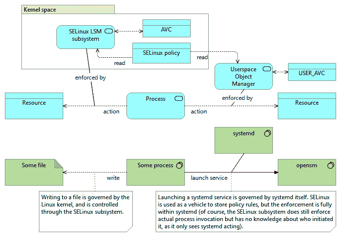

# *第七章*：配置特定应用的 SELinux 控制

一些 Linux 服务和应用程序启用了额外的 SELinux 控制，除了内核强制的 SELinux 策略外。它们允许管理员通过应用程序本身进一步操作和执行策略规则——隔离用户、减少数据泄露风险，并缓解恶意行为的影响。

本章中，我们将探讨几个支持 SELinux 的应用程序，如 systemd 服务，以及它们如何允许管理员设置和指定目标域和资源标签。我们还将讨论 D-Bus 服务，D-Bus 服务允许 SELinux 策略控制服务绑定和 D-Bus 内部的消息通信。接下来，我们将介绍启用 PAM 的服务，允许用户通过这些服务登录。

最后，我们将以 `mod_selinux` 作为本章的结束，它是一个 Apache 模块，允许对 Web 服务器行为进行 SELinux 特定的调整。这种方法展示了没有本地 SELinux 支持的应用程序如何通过扩展来满足管理员的需求。

本章将涵盖以下主题：

+   调整 systemd 服务、日志记录和设备管理

+   通过 D-Bus 进行通信

+   配置 PAM 服务

+   使用 mod_selinux 与 Apache 配合

# 技术要求

查看以下视频，了解代码的实际应用：[`bit.ly/37jYtze`](https://bit.ly/37jYtze)

# 调整 systemd 服务、日志记录和设备管理

`init` 系统，负责处理服务和启动操作。

在开发阶段，systemd 向其组件库中添加了几个其他组件：

+   D-Bus 提供了一个系统和会话总线服务，允许通过 D-Bus 进行应用程序间通信，并与 systemd 合并。

+   systemd 还集成了 `udev`，它提供了一个灵活的设备节点管理应用程序。

+   向 systemd 添加了登录功能，实现了对用户会话的精细控制。

+   `journald` 守护进程加入了 systemd 家族，提供了一种新的系统和服务日志记录方法，替代了部分标准系统日志记录器的功能。

+   `timerd` 守护进程支持基于时间的任务执行，替代了部分标准 cron 守护进程的功能。

+   网络配置可以通过 systemd-networkd 进行管理。

将多个系统服务吸收进一个单一应用程序套件的持续方法未曾被忽视，也不是没有争议的。一些发行版甚至拒绝将 systemd 作为默认的 `init` 系统。

systemd 项目为大多数服务提供了 SELinux 支持。像 systemd 这样的应用程序，不仅具备 SELinux 意识，而且还在特定的 SELinux 类和权限上执行访问控制（而不是依赖于 Linux 内核），被称为 **用户空间对象管理器**：



图 7.1 — 内核强制、标准 SELinux 和用户空间管理 SELinux 之间的区别

如果一个应用程序实施了针对特定类和权限的访问控制，那么它也将拥有自己的 AVC（有关 AVC 的更多信息，请参见*第二章*，*理解 SELinux 决策和日志记录*）。由这些应用程序生成的日志事件将被标识为`USER_AVC`事件，而不是（内核管理的）`AVC`事件。systemd 应用程序支持特定于 systemd 的类，正如我们在*管理单元操作访问*部分中所看到的那样。但在深入探讨这些具体细节之前，让我们先了解一下 systemd 是什么以及它对 SELinux 的支持。

## systemd 中的服务支持

大多数人所知道的 systemd 主要功能是它对系统服务的支持。与传统的兼容 SysV 的`init`系统不同，systemd 不使用脚本来管理服务。相反，它使用声明性的方法来管理各种服务，记录所需的状态和配置参数，同时使用自己的逻辑确保在正确的时间和顺序启动正确的服务。

### 理解单元文件

systemd 使用单元文件来声明服务应如何运行。这些单元文件使用 INI 风格的语法，支持每个文件中的节和键/值对。一个服务可以有多个单元文件，它们会对该服务产生整体影响。重要的是要记住，同一个服务的不同单元文件是相关的：

+   `*.service`单元文件定义了如何启动系统服务，它的依赖关系是什么，systemd 应该如何处理突然的故障等。

+   `*.socket`单元文件定义了应创建哪些套接字以及应分配给它的权限。systemd 使用它来处理那些可以按需启动而不是在启动时直接启动的服务。

+   `*.timer`单元文件定义了服务应在何时或以何种频率启动。那些不一定以守护进程方式运行，但需要在定义的间隔内执行某些逻辑的服务，可以使用这些定时器文件来确保定期执行。这些设置与经典但仍广泛使用的 crontab 相似，我们在*PAM 服务*的*Cron*小节中简要提到过。

也存在其他单元文件，尽管它们更像是通用的系统配置（如切片定义和自动挂载设置），与运行时服务的关系较少。

系统单元文件可以放置在以下三个位置之一：

+   默认情况下，单元文件由系统的包管理器安装在`/usr/lib/systemd/system`目录中。

+   在运行时，更新可以放置在`/run/systemd/system`目录中，这将覆盖默认位置的单元文件。然而，这个位置是临时的，在重启后不会保留。

+   系统管理员可以通过将单元文件放置在 `/etc/systemd/system` 中来覆盖这两个位置的配置。这些单元文件会覆盖先前的定义，因此无需删除先前位置的单元文件。

例如，查看 `/usr/lib/systemd/system` 中的默认 Nginx 服务单元文件 `nginx.service`：

```
[Unit]
Description=The nginx HTTP and reverse proxy server
After=network.target remote-fs.target nss-lookup.target
[Service]
Type=forking
PIDFile=/run/nginx.pid
ExecStartPre=/usr/bin/rm -f /run/nginx.pid
ExecStartPre=/usr/sbin/nginx -t
ExecStart=/usr/sbin/nginx
ExecReload=/bin/kill -s HUP $MAINPID
KillSignal=SIGQUIT
TimeoutStopSec=5
KillMode=mixed
PrivateTmp=true
[Install]
WantedBy=multi-user.target
```

这个单元文件声明了启动 Nginx 的命令，并通知 systemd 服务应该在成功达到 `network`、`remote-fs` 和 `nss-lookup` 目标之后启动（这是启动过程中的一个里程碑，允许正确处理依赖关系）。该单元文件还声明它是 `multi-user` 目标的依赖项（这相当于使用 SysV 风格的 `init` 服务时的默认运行级别），意味着该服务应在系统启动时启动。

### 为服务设置 SELinux 上下文

当 systemd 启动一个服务时，它会执行在服务单元文件中的 `ExecStart=` 配置项中定义的命令。默认情况下，系统会根据 SELinux 策略执行标准的域转换。

然而，软件包开发人员和系统管理员可以更新服务单元文件，以使服务在显式提到的 SELinux 域中启动。为了实现这一点，可以通过在单元文件的 `[Service]` 部分添加 `SELinuxContext=` 配置项来扩展该部分。

例如，为了确保 Nginx 使用 `httpd_t:s0:c0.c128` 上下文启动，你可以使用以下方式：

```
[Service]
Type=forking
PIDFile=/run/nginx.pid
ExecStartPre=/usr/bin/rm -f /run/nginx.pid
ExecStartPre=/usr/sbin/nginx -t
ExecStart=/usr/sbin/nginx
ExecReload=/bin/kill -s HUP $MAINPID
SELinuxContext=system_u:system_r:httpd_t:s0:c0.c128
KillSignal=SIGQUIT
TimeoutStopSec=5
KillMode=mixed
PrivateTmp=true
```

当然，也可以使用此方法让服务在不同的上下文中运行，这在为守护进程开发自定义策略时非常有用。然而，请记住，SELinux 策略规则仍然适用：例如，你不能要求 systemd 启动 Nginx，并将其放在 `dnsmasq_t` 域中，而不更新 SELinux 策略，使得 `httpd_exec_t`（`httpd_t` 域的入口点）也成为 `dnsmasq_t` 域的入口点。

当你请求 systemd 显式使用 SELinux 上下文时，systemd 会尝试在所有与执行相关的任务中使用此上下文：`ExecStartPre`、`ExecStart`、`ExecStartPost`、`ExecStopPre`、`ExecStop`、`ExecStopPost` 和 `ExecReload`。由于这些任务通常没有标记正确的入口点标签，这些命令可能会失败。在这种情况下，可以在命令前加上 `+`，以便 SELinux 上下文定义不适用于它们：

```
[Service]
Type=forking
PIDFile=/run/nginx.pid
ExecStartPre=+/usr/bin/rm -f /run/nginx.pid
ExecStartPre=/usr/sbin/nginx -t
ExecStart=/usr/sbin/nginx
ExecReload=/bin/kill -s HUP $MAINPID
SELinuxContext=system_u:system_r:httpd_t:s0:c0.c128
KillSignal=SIGQUIT
TimeoutStopSec=5
KillMode=mixed
PrivateTmp=true
```

在开发和更改单元文件时，修改的设置可能不会立即应用到系统中。在修改单元文件后，运行 `systemctl daemon-reload` 将确保 systemd 读取系统中的最新更改。

### 使用临时服务

systemd 还可以用来启动应用程序，使其像服务一样在 systemd 的控制下运行。这些应用程序被称为 **临时服务**，因为它们没有通常声明 systemd 应如何行为的单元文件。

瞬态服务是通过 `systemd-run` 应用程序启动的。为了展示这一点，让我们创建一个简单的 Python 脚本（一个计算 Pi 到 10,000 位的小脚本）：

```
from decimal import Decimal, getcontext
getcontext().prec=10000
with open('/tmp/pi.out', 'w') as f:
  print(sum(1/Decimal(16)**k * (
    Decimal(4)/(8*k+1)-
    Decimal(2)/(8*k+4)-
    Decimal(1)/(8*k+5)-
    Decimal(1)/(8*k+6)) for k in range(10000)), file=f)
```

由于这个过程需要一些时间，我们可以选择在 systemd 控制下运行此 Python 脚本：

```
# systemd-run python3.6 /tmp/pi.py
Running as unit: run-rf9ce45c...f343.service
```

由于瞬态服务没有单元文件来管理，因此必须通过命令行来更改 SELinux 上下文。当然，只有当策略中定义的标准域转换未能产生所需行为时，才需要这样做：

```
# systemd-run -p SELinuxContext=guest_u:guest_r:guest_t:s0 python3.6 /tmp/pi.py
```

`systemd-run` 应用程序通过 `--property`（或 `-p`）选项支持此功能，通过该选项可以添加单元文件属性。在前面的示例中，我们使用此选项通过 `SELinuxContext` 属性在 `guest_t` 域中运行脚本，这类似于我们在单元文件中定义该属性的方式。

### 需要 SELinux 的服务

有些服务只有在启用或禁用 SELinux 时才应运行。在 systemd 中，可以通过其条件参数来定义此行为。

一个服务单元文件可以包含几个条件，这些条件需要在 systemd 考虑执行该服务之前验证。这些条件可以指向系统类型（虚拟化或非虚拟化）、内核命令行参数、是否存在的文件等等。我们关心的是 `ConditionSecurity`，它表示给定安全系统的状态——在我们的案例中是 SELinux。

例如，查看 `/usr/lib/systemd/system` 中的 `selinux-autorelabel.service` 单元文件：

```
[Unit]
Description=Relabel all filesystems
DefaultDependencies=no
Conflicts=shutdown.target
After=sysinit.target
Before=shutdown.target
ConditionSecurity=selinux
[Service]
ExecStart=/usr/libexec/selinux/selinux-autorelabel
Type=oneshot
TimeoutSec=0
RemainAfterExit=yes
StandardOutput=journal+console
```

同样，Linux 发行版提供了 `selinux-autorelabel-mark.service` 文件。该服务确保，如果系统启动时 SELinux 未激活（且 `/.autorelabel` 文件尚不存在），则 systemd 会创建一个空的 `/.autorelabel` 文件。此文件确保在系统以 SELinux 支持重新启动时，执行重新标记操作。

### 服务启动期间的重新标记文件

许多服务需要的一项操作是准备服务特定的运行时目录，例如 Apache 服务的 `/run/httpd`。systemd 通过 `tmpfiles.d` 支持此功能。我们已经在 *第四章*《使用文件上下文和进程域》中简要介绍了 `tmpfiles`。在 `tmpfiles` 中，我们可以定义在这些文件未放置在（持久化的）文件系统中时，请求立即（在启动时）提供或更新的文件和位置。

例如，提供 Apache 守护进程的包会在系统上安装以下定义作为 `/usr/lib/tmpfiles.d/httpd.conf`：

```
d /run/httpd	710 root apache
d /run/httpd/htcacheclean	700 apache
```

与 systemd 单元文件类似，包含这些设置的文件应该声明在以下三个位置之一。每个位置都覆盖前一个位置的设置：

+   默认的、软件包提供的位置是 `/usr/lib/tmpfiles.d`。

+   运行时声明可以放在 `/run/tmpfiles.d` 中。

+   本地系统管理员提供的声明放在 `/etc/tmpfiles.d` 中。

这些定义可以比仅创建目录更具体。通过 `tmpfiles.d` 应用程序，可以设置定义来创建文件、预先清空目录、创建子卷、管理特殊文件（如符号链接或块设备）、设置扩展属性等。

其特点之一是设置文件模式和所有权，并恢复文件（`z`）或递归地针对目录（`Z`）的 SELinux 上下文。这可以用于更改具有正确上下文定义的文件的上下文，但其上下文未正确分配。

例如，查看 `/usr/lib/tmpfiles.d` 中的 `selinux-policy.conf` 文件中的定义：

```
z /sys/devices/system/cpu/online - - -
Z /sys/class/net - - -
z /sys/kernel/uevent_helper - - -
w /sys/fs/selinux/checkreqprot - - - - 0
```

我们需要重新标记 `/sys` 中的文件，因为该位置默认标记为 `sysfs_t`，并且在运行时更改上下文不会在重启后保留其状态。然而，其中一些文件应该有不同的标签——例如 `/sys/devices/system/cpu/online` 文件需要 `cpu_online_t` 标签：

```
# matchpathcon /sys/devices/system/cpu/online
/sys/devices/system/cpu/online  system_u:object_r:cpu_online_t:s0
```

该定义确保在启动时重新标记此（伪）文件，以便所有依赖于标有 `cpu_online_t` 的文件的其他进程可以顺利继续工作。

定义的其他参数在前一个示例中明确标记为破折号，意味着不需要配置其他参数。它们可以用来设置模式、**用户标识符** (**UID**)、**组标识符** (**GID**)、年龄以及与规则相关的参数。

使用 `z` 或 `Z` 状态的这些其他参数的示例配置是 `systemd.conf` 文件：

```
# grep ^[zZ] /usr/lib/tmpfiles.d/systemd.conf
z /run/log/journal 2755 root systemd-journal - -
Z /run/log/journal/%m ~2750 root systemd-journal - -
z /var/log/journal 2755 root systemd-journal - -
z /var/log/journal/%m 2755 root systemd-journal - -
z /var/log/journal/%m/system.journal 0640 root systemd-journal - -
```

有关定义格式的更多信息，请参见 `man tmpfiles.d`。

### 使用基于套接字的激活

系统守护进程还支持基于套接字的激活。当配置完成时，systemd 会创建守护进程通常监听的套接字，并在第一次使用该套接字时启动守护进程。这使得系统可以快速启动（因为许多守护进程不需要立即启动），同时确保所有必需的套接字都可用。

当客户端仅向套接字写入信息时（例如 `/dev/log` 套接字），客户端甚至不需要等待守护进程激活。数据会存储在缓冲区中，直到守护进程能够读取它。只有当缓冲区满时，操作才会阻塞，直到守护进程刷新缓冲区。

查看位于 `/usr/lib/systemd/system` 中的 `systemd-journald.socket` 单元文件：

```
[Unit]
Description=Journal socket
Documentation=man:systemd-journal.service(8) man:journald.conf(8)
DefaultDependencies=no
Before=sockets.target
IgnoreOnIsolate=yes
[Socket]
ListenStream=/run/systemd/journal/stdout
ListenDatagram=/run/systemd/journal/socket
SocketMode=0666
PassCredentials=yes
PassSecurity=yes
ReceiveBuffer=8M
Service=systemd-journald.service
```

当客户端使用上述套接字之一时，systemd 将启动 `systemd-journald.service` 单元来处理客户端交互。只要这些套接字未被使用，服务将不会启动。

在 `[Socket]` 部分中，可以定义一个 SELinux 特定的条目：`SELinuxContextFromNet=true`。当一个单元文件设置了这个条目时，systemd 会从客户端上下文（连接到套接字的应用程序）中获取 MLS/MCS 信息，并将其附加到服务的上下文中。这种敏感性继承可以用来防止在通过套接字进行通信时发生信息泄露。

### 管理单元操作访问

到目前为止，我们已经查看了与 systemd 的 SELinux 支持相关的配置设置。systemd 还使用 SELinux 来控制对通过单元文件定义的服务的访问。当用户想对某个单元执行操作（例如启动服务或检查运行中的服务状态）时，systemd 会查询 SELinux 策略，以查看是否允许此操作。

systemd 守护进程使用服务类来验证客户端域对请求操作的权限。例如，为了验证用户上下文 `sysadm_t` 是否可以查看与 `sshd.service` 单元文件相关的服务状态，它会检查该文件的上下文（为 `sshd_unit_file_t`），然后验证是否授予了状态权限：

```
# sesearch -s sysadm_t -t sshd_unit_file_t -c service -p status -A
```

其他支持的权限有 `disable`、`enable`、`reload`、`start` 和 `stop`。当权限未被授予时，审计日志中会显示 `USER_AVC` 拒绝消息（而非 `AVC` 消息），因为该消息不是由 Linux 内核生成的，而是由 systemd 生成的。因此，虽然规则本身是 SELinux 策略的一部分，但访问控制是由 systemd 强制执行的。

systemd 或通过 systemd 查询的客户端可能还会提供额外的错误信息，表明 SELinux 策略阻止了该操作。例如，如果我们尝试通过 D-Bus 查询 systemd（我们将在 *D-Bus 通信* 部分介绍），并且从一个非特权用户域发起查询，那么我们会得到以下错误：

```
Error: GDBus.Error:org.freedesktop.DBus.Error.AccessDenied: SELinux policy denies access
```

为了便于故障排除，systemd 还具有一个广泛的日志记录组件，叫做 `systemd-journald`，我们将在接下来介绍。

## 使用 systemd 进行日志记录

systemd 不仅负责服务管理，还承担着其他几个任务。其中一个任务是日志管理，传统上通过系统日志记录器来实现。

虽然 systemd 仍然支持使用传统的系统日志记录器，但现在建议使用 `systemd-journald`。日志守护进程的一个优势是，它不局限于文本的单行日志消息。守护进程现在可以使用二进制数据以及多行消息作为日志记录的一部分。

日志守护进程还会注册关于发送进程的信息，并与日志消息本身一起记录。这些附加信息包含了所有者数据（进程所有者），包括发送进程的 SELinux 上下文。

### 检索与 SELinux 相关的信息

传统的接收 SELinux 相关信息的方法（排除我们之前讨论的审计事件）是通过 `grep` 在日志信息中查找。使用日志守护进程，我们可以通过以下方式实现：

```
# journalctl -b | grep -i selinux
```

传递给日志控制应用程序的 `-b` 选项通知日志守护进程，我们只关心来自特定引导的日志消息。

### 根据 SELinux 上下文查询日志

日志守护进程的一个独特功能是使用与日志消息相关的信息作为查询的一部分，针对日志数据库进行查询。例如，我们可以要求日志守护进程只显示那些来自于运行在 `udev_t` 上下文中的守护进程或应用程序的消息：

```
# journalctl _SELINUX_CONTEXT=system_u:system_r:init_t:s0
```

可用的上下文可以通过系统上的 Bash 自动补全支持获取。在输入 `_SELINUX_CONTEXT=` 后，按 *Tab* 键两次即可查看可能的值。

### 使用 `setroubleshoot` 集成与日志

SELinux 故障排除守护进程也与 `systemd-journald` 集成。来自 `setroubleshootd` 的任何警报也可以通过日志守护进程获取。

这有助于管理员在调查问题时能快速发现 SELinux 拒绝。例如，当 Nginx Web 服务器无法正常工作，且这是由于 SELinux 策略导致时，快速检查服务的状态会显示 SELinux 策略正在阻止某些操作：

```
# systemctl status nginx
```

要获取更多关于消息的信息，可以使用 `journalctl`：

```
# journalctl -xe
```

如你所见，`systemd-journald` 已经捕获了与服务相关的环境信息，这些信息能够为解决潜在问题提供宝贵的指导。

另一个具有 SELinux 配置功能的 systemd 服务是设备守护进程。

## 处理设备文件

Linux 有着悠久的设备管理历史。最初，管理员需要确保设备节点已经存在于文件系统中（`/dev` 是持久化文件系统的一部分）。随着时间的推移，Linux 逐渐采用了更动态的设备管理方式。

现在，设备文件通过伪文件系统（`devtmpfs`）和一个名为 udev 的用户空间设备管理器进行管理。这个设备管理器也被并入到 systemd 中，成为 `systemd-udevd`。

设备管理器通过内核套接字监听内核事件。这些事件向设备管理器报告检测到的或已插入的设备（或此类设备的移除），并允许设备管理器采取适当的行动。对于 udev，这些操作在 udev 规则中定义。

### 使用 udev 规则

配置 udev 子系统主要通过 udev 规则完成。这些规则是包含匹配部分和操作部分的单行指令。

匹配部分包含对 udev 从 Linux 内核接收到的事件进行的验证。此验证使用从事件中获取的键/值对，包含以下可能的键：

+   内核提供的设备名称（`KERNEL`）

+   设备子系统（`SUBSYSTEM`）

+   内核驱动程序（`DRIVER`）

+   特定属性（`ATTR`）

+   活跃环境变量（`ENV`）

+   指示设备是否被检测到或移除的操作类型（`ACTION`）

虽然可能有更多的匹配键，但上述列表是最常用的。

Linux 内核还会向设备管理器通报设备的层级结构。这使得可以基于某些因素定义规则，例如 USB 设备是通过哪个 USB 控制器插入的。除了设备本身的信息，内核还会通过类似的键值对提供层级相关的信息。然而，这些键值对使用复数形式的键定义：`SUBSYSTEMS` 代替 `SUBSYSTEM`，`DRIVERS` 代替 `DRIVER`，等等。

例如，要匹配供应商 ID 为 `05a9` 和产品 ID 为 `4519` 的 USB 网络摄像头，匹配相关的键值对可能如下所示：

```
KERNEL=="video[0-9]*", SUBSYSTEM=="video4linux", SUBSYSTEMS=="usb", ATTR{idVendor}=="05a9", ATTR{idProduct}=="4519"
```

udev 规则的第二部分是要执行的操作。最常见的操作是创建指向已创建设备文件的符号链接，确保即使从内核角度看设备名称发生变化，应用程序仍然可以通过相同的符号链接访问相同的设备。例如，我们可以通过 `SYMLINK+="webcam1"` 扩展前面的例子，使 `/dev/webcam1` 指向此新检测到的设备。

当然，udev 应用程序支持比仅仅定义符号链接更多的操作。它可以在设备上设置所有权（`OWNER`）或组成员身份（`GROUP`），控制谁可以访问设备。udev 还可以设置环境变量（`ENV`），甚至在匹配的设备插入或从系统中拔出时执行命令（`RUN`）。为了确保命令仅在设备被添加时执行，我们需要添加一个如 `ACTION=="add"` 的 `ACTION` 设置。

重要提示

udev 可以将 `ENV` 作为匹配键和操作键进行解释。它们的区别在于执行的操作（单个等号 `=` 或双等号 `==`）。`ENV{envvar}=="value"` 是匹配操作（检查变量是否与给定的 `value` 匹配），而 `ENV{envvar}="value"` 是操作（将变量设置为 `value`）。

udev 规则默认存储在 `/usr/lib/udev/rules.d` 位置。发行版和应用程序/驱动程序会将其默认规则存储在此位置。额外的规则或规则覆盖可以放在 `/etc/udev/rules.d` 中。

需要记住的是，即使 udev 已经遇到匹配的规则，它仍会继续处理规则。这可以通过 `OPTIONS` 操作在每条规则的基础上进行更改，例如 `OPTIONS+="last_rule"`，它告诉 udev 停止进一步处理该事件的规则。

### 在设备节点上设置 SELinux 标签

udev 支持的其中一个操作是为设备节点分配 SELinux 标签。我们可以使用 `SECLABEL{selinux}` 操作来实现这一点：

```
KERNEL=="fd0", ..., SECLABEL{selinux}="system_u:object_r:my_device_t:s0"
```

请注意，这个操作仅设置设备节点上的上下文。如果规则还设置了符号链接，那么符号链接本身将继承默认的 `device_t` 上下文。

给设备节点放置 SELinux 标签通常是与其他安全相关权限一起进行的，因此该规则通常会执行附加的操作，例如设置目标所有者（`OWNER`）、组（`GROUP`）和权限集（`MODE`）。毕竟，SELinux 安全控制仅在常规的自由访问控制检查通过后才会生效，所以不要忘记确保用户在 SELinux 控制之外也能访问设备节点。

到目前为止，我们看到的所有设置都与 systemd 服务管理和系统支持有关。systemd 生态系统中的另一个组件是 D-Bus，它更多的是促进不同应用程序之间通过可编程通信总线进行通信和交互，而非系统管理。

# 通过 D-Bus 进行通信

D-Bus 守护进程提供了一个应用程序之间的进程间通信通道。与传统的 IPC 方法不同，D-Bus 是一个更高级别的通信通道，提供的不仅仅是简单的信号传递或内存共享。想要通过 D-Bus 进行通信的应用程序可以链接到许多与 D-Bus 兼容的库，如 libdbus、sd-bus（systemd 的一部分）、GDBus 和 QtDBus 应用程序提供的库。

D-Bus 守护进程是 systemd 应用程序套件的一部分。

## 了解 D-Bus

Linux 通常支持两种 D-Bus 类型——系统范围的和特定会话的 D-Bus 实例：

+   系统范围的 D-Bus 是用于系统通信的主要实例。许多服务或守护进程会将自己与系统 D-Bus 关联，以便其他应用程序通过 D-Bus 与它们进行通信。

+   特定会话的 D-Bus 是为每个登录用户运行的实例。它通常被图形化应用程序用来在用户会话内相互通信。

这两个 D-Bus 实例都是通过 `dbus-daemon` 应用程序提供的。系统范围的 D-Bus 会以 `--system` 选项运行，而特定会话的实例会以 `--session` 选项运行。

应用程序通过命名空间向 D-Bus 注册自己。通常，命名空间使用项目的域名。例如，systemd 声明了 `org.freedesktop.systemd1` 命名空间，而 D-Bus 的命名空间是 `org.freedesktop.DBus`。

当前关联的应用程序可以通过 Python 简单查询：

```
# python3.6
>>> import dbus
>>> for service in dbus.SystemBus().list_names():
...   print(service)
org.freedesktop.DBus
org.freedesktop.login1
org.freedesktop.systemd1
org.freedesktop.PolicyKit1
com.redhat.tuned
:1.10
:1.11
org.freedesktop.NetworkManager
...
```

每个应用程序然后在总线上提供对象，其他对象（其他应用程序）可以访问这些对象——当然，前提是它们具有相应的权限。这些对象通过类似路径的语法表示，通常也会使用项目的域名作为前缀。

例如，要列出当前与`org.freedesktop.systemd1`关联的对象，我们可以使用`gdbus`命令。为了方便使用，我们首先启用自动完成支持，然后可以使用*Tab*键轻松添加适当的值：

```
# source /usr/share/bash-completion/completions/gdbus
# gdbus call --system --dest <TAB><TAB>
# gdbus call --system --dest org.freedesktop.systemd1 --object-path /org/freedesktop/systemd1<TAB><TAB>
Display all 220 possibilities? (y or no)
/org/freedesktop/systemd1
/org/freedesktop/systemd1/job
/org/freedesktop/systemd1/unit
...
```

应用程序可以触发这些对象上的方法，或通过这些方法向绑定到这些对象的应用程序发送消息。

例如，要通过 D-Bus 获取`sshd.service`单元的状态，我们在`org.freedesktop.systemd1`对象上的`/org/freedesktop/systemd1`路径调用`org.freedesktop.systemd1.Manager.GetUnitFileState`方法，并带有`sshd.service`参数，像这样：

```
# gdbus call --system \
  --dest org.freedesktop.systemd1 \
  --object-path /org/freedesktop/systemd1 \
  --method org.freedesktop.systemd1.Manager.GetUnitFileState \
  sshd.service
('enabled',)
```

我们接下来将学习，这些调用也可以通过 SELinux 策略进行控制。

## 通过 SELinux 控制服务获取

D-Bus 应用程序（如 systemd）将查询 SELinux 策略，以验证是否允许操作。再次强调，实施策略的是 D-Bus 应用程序本身，而不是 Linux 内核子系统。

管理员可以在 D-Bus 中启用的第一个控制是确保只有确立良好的域才能在 D-Bus 中获取指定的对象。如果没有此控制，恶意代码例如可能会注册自己为`org.freedesktop.login1`，并在总线上作为系统守护进程运行。其他应用程序可能会错误地向应用程序发送敏感信息。

应用程序将此策略信息存储在位于`/usr/share/dbus-1/system.d`的文件中。例如，登录服务（存储为`org.freedesktop.login1.conf`）安装了以下策略片段：

```
<busconfig>
  <policy user="root">
    <allow own="org.freedesktop.login1"/>
    <allow send_destination="org.freedesktop.login1"/>
    <allow receive_sender="org.freedesktop.login1"/>
  </policy>
  <policy context="default">
    <deny send_destination="org.freedesktop.login1"/>
    <allow
       send_destination="org.freedesktop.login1"
       send_interface="org.freedesktop.DBus.Introspectable"/>
    ...
  </policy>
</busconfig>
```

由于登录守护程序在`systemd_logind_t`域中运行，我们可以按以下方式增强此配置：

```
<busconfig>
  <selinux>
    <associate
      own="org.freedesktop.login1"
      context="system_u:system_r:systemd_logind_t:s0" />
  </selinux>
  ...
</busconfig>
```

配置完毕后，D-Bus 将检查应用程序（我们假定其在`systemd_logind_t`上下文中运行）是否具有`acquire_svc`权限（`dbus`类）对`systemd_logind_t`上下文。默认情况下，SELinux 策略不具有此权限，因此注册失败：

```
# systemctl restart dbus-org.freedesktop.login1
Job for systemd-logind.service failed because a timeout was exceeded.
See "systemctl status systemd-logind.service" and "journalctl -xe" for details.
# ausearch -m user_avc -ts recent
```

当我们添加以下 SELinux 策略规则时，`systemd-logind`的注册将如预期般成功：

```
(allow systemd_logind_t systemd_logind_t (dbus (acquire_svc)))
```

加载此策略（例如`test.cil`）并再次尝试`restart`操作：

```
# semodule -i test.cil
# systemctl restart dbus-org.freedesktop.login1
```

通过限制哪些域可以获取特定服务，我们确保仅使用受信任的应用程序。即使非受信任的应用程序获得了 root 权限（这是 D-Bus 对登录服务进行的另一个检查，如第一个`busconfig`片段所示），它们通常也不会在该应用程序的域中运行。

管理员可以增强此 D-Bus 配置，而无需更改现有的配置文件。例如，先前提到的 SELinux 管理的`busconfig`片段完全可以保存为不同的文件。

## 管理消息流

D-Bus 验证的第二个控制是哪些应用程序可以相互通信。这不能通过服务配置进行配置，而是一个纯粹的 SELinux 策略控制。

每当源应用程序调用目标应用程序的方法时，D-Bus 会验证源应用程序和目标应用程序之间的 `send_msg` 权限。

例如，在用户域（`sysadm_t`）和服务域（`systemd_logind_t`）之间通过 D-Bus 进行的通信将检查以下权限：

```
allow sysadm_t systemd_logind_t : dbus send_msg;
allow systemd_logind_t sysadm_t : dbus send_msg;
```

如果没有授予这些权限，D-Bus 将不允许通信发生。如果在任何时候，无法获取应用程序上下文，则将使用总线守护进程上下文。

失败将作为 `USER_AVC` 条目记录在审计日志中。如果通信应该被允许，我们可以像这样创建一个简单的 SELinux 策略文件来解决这个问题：

```
(allow sysadm_t systemd_logind_t (dbus (send_msg)))
(allow systemd_logind_t sysadm_t (dbus (send_msg)))
```

将这些规则存储在以 `.cil` 结尾的文件中（例如，`local_logind_systemd.cil`），并使用 `semodule` 加载它：

```
# semodule -i local_logind_systemd.cil
```

让我们考虑一些其他具有 SELinux 支持的应用程序，这些支持并不一定是内置的，而是通过系统内的 SELinux 策略和 PAM 集成实现的。

# 配置 PAM 服务

systemd 和 D-Bus 是支持 SELinux 的应用程序，内置了明确的 SELinux 支持。Linux 系统中还有其他一些服务与 SELinux 配合良好，尽管它们本身并不支持 SELinux。许多这些服务通过 PAM 集成与 SELinux 相关联。

我们在*第三章*，*管理用户登录*中讨论了 PAM 集成。在本节中，我们将介绍三个使用 PAM 的示例服务，以及如何进一步微调 SELinux 以支持这些服务。

## Cockpit

Cockpit 是一个简单的基于浏览器的管理应用程序，它允许管理员轻松查看系统资源（监控）并与系统交互。它还允许用户通过浏览器登录系统。

正是这个基于浏览器的终端我们需要配置：通过调整 SELinux 用户的目标 SELinux 角色，我们可以有选择地将用户放入特定角色。这实际上定义了用户可以通过此基于浏览器的会话完成的任务。

### 安装 Cockpit

Cockpit 应用程序在 CentOS 仓库中随时可用，因此安装起来非常简单：

```
# yum install cockpit
```

虽然应用程序无需额外配置，但如果需要调整，您需要自己创建配置文件 `/etc/cockpit/cockpit.conf`，因为该应用程序不会创建默认配置文件。在此配置文件中，您可以配置 TLS 设置，或者普遍禁用加密通信。

为了演示运行，让我们禁用加密通信（但如果你打算在生产环境中使用 Cockpit，除了保持加密开启外，还应该确保只有受信任的主机能连接，可能还需要使用`ClientCertAuthentication`指令来要求客户端证书认证）：

```
[WebService]
AllowUnencrypted=true
```

设置好这些之后，我们可以继续配置 SELinux 以支持 Cockpit。

### 限制用户登录

通过这些步骤，我们将把更为受限的`user_r`角色添加到`staff_u` SELinux 用户，并确保所有映射到`staff_u` SELinux 用户的登录都通过`user_r`角色登录到 Cockpit。如果他们通过其他服务登录，则会继续使用默认的`staff_r`角色。

注意

使用`user_r`角色而不是（更加受限的）`guest_r`角色，是为了让 Cockpit 应用程序能够正常工作。应用程序将在用户的权限下运行服务，如果我们使用`guest_t`用户域，权限将不足以支撑 Cockpit 的正常运行。

让我们首先添加`user_r`角色，以便稍后将用户放入正确的上下文中：

```
# semanage user -m -R "staff_r sysadm_r system_r user_r" staff_u
```

接下来，我们希望更新 SELinux 配置，以确保任何由`staff_u`映射的用户登录 Cockpit 时都将使用`user_r`角色。Cockpit 应用程序的登录是通过在`cockpit_session_t`上下文中运行的服务进行的，我们通过先检查进程的上下文，然后登录 Cockpit 并再次检查进程的上下文来得知这一点。在这里，我们注意到一个新进程（`cockpit-session`）以`cockpit_session_t`上下文运行：

```
# ps -eZ | grep cockpit
system_u:system_r:cockpit_ws_t:s0	 ... cockpit-ws
system_u:system_r:cockpit_session_t:s0 ... cockpit-session localhost
```

现在有了这些信息，我们可以按照如下方式编辑`/etc/selinux/targeted/contexts/users/staff_u`文件：

```
system_r:local_login_t:s0   staff_r:staff_t:s0 sysadm_r:sysadm_t:s0
system_r:remote_login_t:s0  staff_r:staff_t:s0
system_r:sshd_t:s0          staff_r:staff_t:s0 sysadm_r:sysadm_t:s0
system_r:cockpit_session_t:s0   user_r:user_t:s0
system_r:crond_t:s0         staff_r:staff_t:s0 staff_r:cronjob_t:s0
```

通过调整`cockpit_session_t`上下文中列出的角色顺序（或者将其限制为仅使用`user_r`角色），我们可以确保允许以`user_r`角色运行的用户（就像我们之前配置的`staff_u`用户）通过`user_r`角色进行操作。由于这个角色比默认的`staff_t`用户域更为受限，因此通过 Cockpit 进行的登录会更加隔离。

这种方法适用于所有支持 PAM 的服务，因为它仅依赖于服务 PAM 配置中的`pam_selinux.so`调用。对于某些服务，SELinux 策略管理员还会加入更多的调整，例如在 cron 和 SSH 中，我们接下来会讨论。

## Cron

系统中的 Cron 服务允许你按预定计划运行任务或命令。一些 Cron 应用程序明确支持 SELinux（如 fcron），使其能够计算作业应运行的目标上下文。即使是没有任何 SELinux 逻辑的 Cron 系统，也可以进行精细调优。

### 切换用户特定与通用上下文

通过 SELinux 策略支持的常见设置是切换用户任务是否在用户的默认上下文中运行（例如，员工用户的 `staff_t`），或在默认的受限 cron 上下文中运行（`cronjob_t`）。这两种方法各有优缺点。

当我们配置系统使得用户作业在用户的默认上下文中运行时，用户将知道他们作业的权限。访客用户有访客权限，员工用户有员工权限，依此类推。这是最常见的配置，CentOS 上的默认 cron 系统使用包含用户任务的文件上下文（位于 `/var/spool/cron`）来推断目标运行时上下文。

通过在更受限制的上下文中运行用户任务，如`cronjob_t`，所有用户的 cron 作业将以相同的权限运行，管理员可以轻松微调所有用户作业的权限。这还允许管理员为 cron 作业授予特定权限，同时保持用户上下文不包含这些权限。

让我们设置一个简单的任务，每分钟执行一次，即休眠 59 秒。作为普通用户，创建一个文件（假设是 `lisa.cron`），内容如下：

```
* * * * * sleep 59
```

此文件使用常见的 cron 语法，其中适用以下规则：

1.  第一个字段表示分钟。

1.  第二个字段表示小时。

1.  第三个字段表示日期。

1.  第四个字段表示月份。

1.  第五个字段表示星期几。

1.  该行的其余部分是要执行的命令。

各个字段可以使用表达式来简化时间定义。例如，要每 15 分钟执行一次，可以在第一个字段中使用 `*/15`。如果你只想在 8 点和 18 点执行，可以在第二个字段中使用 `8,18`。另一个例子是，如果你只想在工作日执行，可以在第五个字段中使用 `1-5`（在 cron 中，星期天的有效值是 0 和 7）。

通过使用 `crontab` 命令加载它，文件会被检查错误，如果没有错误，它将安全地放置在 `/var/spool/cron` 中（`crontab` 命令是一个 `setuid` 命令，能够修改 `/var/spool/cron`，即使常规用户无法访问此位置）：

```
$ crontab ./lisa.cron
```

从这里，cron 守护进程会拾取这个文件，1 分钟后，我们将看到命令在后台激活：

```
$ ps -efZ | grep sleep
staff_u:staff_r:staff_t:s0 ...  sleep 59
```

从输出中可以看到，命令正在 `staff_t` 上下文中运行。要将其更改为 `cronjob_t` 类型，而不是像我们在 Cockpit 应用程序中那样编辑 SELinux 上下文定义文件，可以使用 `cron_userdomain_transition` SELinux 布尔值：

```
# setsebool cron_userdomain_transition off
```

该布尔值会更改活动的 SELinux 策略行为，使得从 cron 系统执行的任何用户任务都在 `cronjob_t` 域中执行。您可能需要重置 crontab 定义（这取决于使用的 cron 系统），但之后，我们将看到作业在 `cronjob_t` 域中运行：

```
$ ps -efZ | grep sleep
staff_u:staff_r:cronjob_t:s0 ...  sleep 59
```

使用 SELinux 布尔值来允许管理员根据需要区分系统行为是常见的做法。对于 SSH 守护进程，SELinux 策略管理员定义了类似的规则。

## OpenSSH

OpenSSH 守护进程是最常见的安全 Shell 守护进程。它允许用户通过终端远程访问系统，还可以安全地传输文件、建立应用程序通信隧道等。

通过 SSH 登录时，PAM 控制会生效，但 SELinux 策略也嵌入了特定的 SSH 控制，并可以通过 SELinux 布尔值进行控制。

### 直接以 sysadm_t 登录

第一个需要评估的更改是允许直接以`sysadm_r`角色登录。默认情况下，映射到`staff_u` SELinux 用户的用户使用（限制更多的）`staff_r`角色登录，然后需要显式切换角色以获得更特权的`sysadm_r`角色。

我们需要进行的第一个更改是编辑`/etc/selinux/targeted/contexts/users/staff_u`文件，并调整`sshd_t`上下文中列出的角色顺序：

```
system_r:local_login_t:s0   staff_r:staff_t:s0 sysadm_r:sysadm_t:s0
system_r:remote_login_t:s0  staff_r:staff_t:s0
system_r:sshd_t:s0          sysadm_r:sysadm_t:s0 staff_r:staff_t:s0 
system_r:cockpit_session_t:s0   user_r:user_t:s0
system_r:crond_t:s0         staff_r:staff_t:s0 staff_r:cronjob_t:s0
```

然而，这还不够。SELinux 策略管理员已禁用通过 SSH 直接登录到`sysadm_r`角色，迫使用户显式切换角色（从而重新认证）。这种做法是因为 SSH 通常是一个公开可访问且难以控制的服务（与如 Web 服务器等服务不同，后者可以通过反向代理和 Web 应用防火墙进行保护）。

将 SELinux 的`ssh_sysadm_login`布尔值更改为`true`以启用所需的行为：

```
# setsebool ssh_sysadm_login true
```

该布尔值更改 SELinux 策略行为，允许通过 SSH 守护进程登录到`sysadm_r`角色。

### Chroot Linux 用户

SSH 支持的另一个功能是强制选定用户的登录进行 chroot 操作。**chroot**（即**改变根目录**的合成词）是一种进程隔离方法，进程不再看到整个文件系统，而只能看到其中的一部分。

信息性说明

现在，chroot 环境是隔离进程的一种简便方法，但 chroot 本身仍然受到 Linux 的自由访问控制的管理，逃脱 chroot 环境并非不可能。建议使用 SELinux 进一步限制进程，但这超出了本节的范围。有关内容，请参见*第十四章*，*处理新应用程序*。

在我们配置 SSH 以 chroot 某些用户之前，我们需要创建一个正确运行的环境：一旦我们更改了进程的根目录，进程希望读取或执行的所有命令和库都需要在此 chroot 环境中可用。

让我们首先创建一个 chroot 环境。一个有用的工具是 Jailkit，它有助于创建正确的文件夹结构和文件。Jailkit 默认不在常规仓库中提供，但可以轻松安装，并且只需要一个有效的编译器和 Python 环境。

我们首先安装必要的依赖项：

```
# yum install gcc python36-devel
```

接下来，我们下载 Jailkit 源代码并进行构建。由于 CentOS 默认没有链接的 Python 二进制文件（因为它需要使用 `python3` 作为运行时），我们需要告诉构建脚本如何处理 Python。我们通过声明 `PYTHONINTERPRETER` 环境变量来实现：

```
# wget https://olivier.sessink.nl/jailkit/jailkit-2.21.tar.bz2
# tar xvf jailkit-2.21.tar.bz2
# cd jailkit-2.21
# export PYTHONINTERPRETER=/usr/bin/python3
# ./configure
# make
# make install
```

安装完成后，您可能需要移除 Jailkit 配置文件中重复的 `includesections` 调用（如果您没有移除，接下来的 `jk_init` 命令会提示您）。`/etc/jailkit/jk_init.ini` 中的 `openvpn` 部分应如下所示：

```
[openvpn]
comment = jail for the openvpn daemon
paths = /usr/sbin/openvpn
users = root,nobody
groups = root,nobody
devices = /dev/urandom, /dev/random, /dev/net/tun
includesections = netbasics, uidbasics
need_logsocket = 1
```

配置更新后，我们现在可以创建 chroot 环境。让我们创建 `/srv/chroot` 目录，并使用 `jk_init` 命令将必要的文件、目录、设备节点等添加到该目录中：

```
# mkdir /srv/chroot
# jk_init -v -j /srv/chroot extshellplusnet
```

我们希望确保此位置内资源的 SELinux 上下文与根位置相等，因此让我们创建一个文件上下文等效定义：

```
# semanage fcontext -a -e / /srv/chroot
# restorecon -RvF /srv/chroot
```

设置好 chroot 环境后，我们现在可以更新 SSH 配置，以便将用户限制在 chroot 中：

```
Match User lisa
  X11Forwarding no
  AllowTcpForwarding no
  ChrootDirectory /srv/chroot
```

虽然并非所有系统都适用（因为这取决于发行版），我们可能需要告诉 SELinux 策略，用户域的用户可以进行 chroot 操作。此权限（`sys_chroot`）通常在默认情况下未启用：

```
# setsebool selinuxuser_use_ssh_chroot true
```

设置完成后，重启 SSH 守护进程并查看 chroot 是否成功：

```
# systemctl restart ssh
```

Chroot 环境不仅仅对 SSH 访问有意义；其他守护进程也可能支持 chroot 环境，以进一步保护系统资源。在过去，chroot 支持是进一步强化系统的一种常见方式。然而，命名空间和资源隔离的支持已经大大超越了 chroot 监狱的需求。这些新特性也推动了容器化生态系统的发展，我们将在*第十一章*中讨论，*增强容器化工作负载的安全性*。

对于诸如 Cockpit、cron 和 OpenSSH 等应用程序，SELinux 的支持通常通过 SELinux 策略提供，并使用 PAM 集成将 SELinux 控制链接到应用程序中。然而，也可以显式地在未专门支持 SELinux 的应用程序中构建 SELinux 支持，只要这些应用程序支持通过模块化设计动态添加逻辑。作为此例，我们接下来将讨论 Apache 和 `mod_selinux` Apache 模块。

# 使用 mod_selinux 配合 Apache

应用程序通常是基于 Web 的，它们将界面暴露为常见的网站或简单的 Web 服务，并在 Web 服务器中执行大部分逻辑，或者在 Web 服务器与用户交互的后台服务中执行逻辑。

基于 Web 的应用程序具有巨大的优势，即最终用户通常不需要在其设备上安装任何额外的应用程序或客户端，无论是工作站、笔记本电脑、手机、手表还是智能电视。

然而，与之前讨论的服务不同，Apache 并没有通过系统上的 PAM 登录运行单独的用户会话。相反，用户请求是由 Web 服务器线程和进程本身处理的，这使得简单的基于 SELinux 的控制变得有些困难。

## 介绍 mod_selinux

Apache 支持模块：可以动态加载的代码，增强 Web 服务器的功能，而无需重新编译 Web 服务器的代码。正是这种模块化使 Apache 变得非常流行，正如我们通过它对 PHP 等功能的支持所看到的，它将动态 Web 应用程序引入到一个曾经仅用于提供静态内容的服务器平台中。

`mod_selinux`使用相同的模块化支持，使得 Apache Web 服务器可以变得对 SELinux 更加敏感。一旦我们启用`mod_selinux`，就可以配置 Apache 切换 SELinux 敏感性，甚至为运行的代码切换 SELinux 域，从而进一步隔离 Web 服务器的行为，并允许 SELinux 策略控制 Web 服务器能够执行的操作。`mod_selinux`还支持用户映射，使 Apache Web 服务器能够在不同的域中运行特定的用户会话。

在构建`mod_selinux`模块之前，我们先在系统上安装必要的依赖项：

```
# yum install gcc git httpd httpd-devel redhat-rpm-config libselinux-devel
```

安装完依赖项后，我们可以下载并构建`mod_selinux`代码。该代码可以从 GitHub 的 Kaigai 的`mod_selinux`仓库中获取：

```
# git clone https://github.com/kaigai/mod_selinux
# cd mod_selinux
# apxs -c -i mod_selinux.c
```

`apxs`命令是`-c`）和安装（`-i`）`mod_selinux`模块的命令。不过，我们还没有在 Apache 配置中激活它，我们通过在`/etc/httpd/conf.modules.d`目录下创建一个新的模块配置文件`99-selinux.conf`（你可以选择任何你喜欢的名称，但确保它以`.conf`后缀结尾）来实现这一点：

```
LoadModule selinux_module modules/mod_selinux.so
```

现在，虽然我们已经安装了该模块，但它还不能使用，因为我们还没有加载适用于它的 SELinux 策略。

`mod_selinux`仓库包含了必要的 SELinux 策略代码。然而，它与 Linux 发行版使用的较新 SELinux 策略并不完全兼容。我们需要编辑`mod_selinux.if`文件，并删除所有关于`httpd_user_script_ro_t`、`httpd_user_script_rw_t`和`httpd_user_script_ra_t`的引用，因为这些类型在当前的 SELinux 策略中已经不再出现：

```
# sed -i '/script_r/d' mod_selinux.if
```

第二个更改——目前是外观上的——是将函数调用从`miscfiles_read_certs`重命名为`miscfiles_read_generic_certs`。这些是参考策略中使用的函数，参考策略是编写 SELinux 策略的一种不同方式——仍然是最常见的方式（我们将在*第十五章*，*使用参考策略*中详细介绍）。虽然在写作时这两个函数都被支持，但`miscfiles_read_certs`函数不再推荐使用，并且很快会被废弃：

```
# sed -i 's/miscfiles_read_certs/miscfiles_read_generic_certs/g' mod_selinux.if
```

一旦我们调整了策略，就可以构建并加载它。由于该策略是使用参考策略样式开发的，安装时首先需要构建模块，然后再加载它（与我们到目前为止使用的直接可加载的 CIL 示例不同）。

```
# make -f /usr/share/selinux/devel/Makefile mod_selinux.pp
# semodule -i mod_selinux.pp
```

在加载 SELinux 模块并安装 `mod_selinux` Apache 模块后，我们可以开始使用 SELinux 特定的控制配置 Apache 守护进程。

## 配置一般的 Apache SELinux 敏感度

`mod_selinux` 支持的最简单配置设置是配置 Apache 以特定的 SELinux 敏感度运行。假设我们希望 Apache 以 `s0-s0:c0.c100` 敏感度运行，那么我们需要调整 Apache 配置并使用 `selinuxServerDomain` 指令。

假设我们想调整默认欢迎页面的敏感度，可以编辑 `/etc/httpd/conf.d/welcome.conf` 并添加以下代码片段：

```
<IfModule mod_selinux.c>
  selinuxServerDomain *:s0-s0:c0.c100
</IfModule>
```

如果 Apache Web 服务器使用虚拟主机定义（允许一个 Web 服务器定义管理多个网站，基于客户端用于访问 Web 内容的主机名），则需要使用 `selinuxDomainVal` 指令，而不是 `selinuxServerDomain` 指令。

例如，假设 Web 服务器管理两个虚拟主机，一个用于 `apps.genfic.local` 域，另一个用于 `intranet.genfic.local`，那么我们可以像这样为每个虚拟主机分配各自的敏感度设置：

```
<VirtualHost *:80>
  DocumentRoot /srv/web/apps/htdocs
  ServerName apps.genfic.local
  selinuxDomainVal *:s0:c1,c2
</VirtualHost>
<VirtualHost *:80>
  DocumentRoot /srv/web/intranet/htdocs
  ServerName intranet.genfic.local
  selinuxDomainVal *:s0:c3,c4
</VirtualHost>
```

重启 Apache Web 服务器并验证该设置是否已生效：

```
# systemctl restart httpd
# ps -efZ | grep httpd_t
system_u:system_r:httpd_t:s0-s0:c0.c100 ... /usr/sbin/httpd
```

如您所见，Web 服务器现在正在以给定的敏感度运行。不过，重要的警告是：`mod_selinux` 代码不支持 `mcstransd`，即我们在 *第三章* 中介绍的翻译守护进程，*管理用户登录*，因此不能使用诸如 `SystemLow-SystemHigh` 之类的易读敏感度定义。

## 将最终用户映射到特定域

要将用户映射到特定域（当用户登录到 Web 应用时），我们需要创建一个用户映射文件。然后，在 Web 服务器配置中使用 `selinuxDomainMap` 指令引用该映射文件。

首先，我们在 `/etc/httpd/conf.d` 下创建映射文件，命名为 `mod_selinux.map`，并使用以下内容：

```
test	user_webapp_t:s0:c0.c100
*	user_webapp_t:s0:c0,c1
__anonymous__	anon_webapp_t:s0
```

该映射文件包含三个映射：

+   第一个映射适用于名为 `test` 的用户，映射到 `user_webapp_t` 域，并具有 `s0:c0.c100` 敏感度。

+   第二个映射适用于任何成功通过身份验证的用户，映射到 `user_webapp_t` 域，并具有 `s0:c0,c1` 敏感度。

+   第三个映射适用于未通过身份验证的用户，映射到 `anon_webapp_t` 域。

然后，我们可以通过调整先前创建的代码片段来引用此映射：

```
<IfModule mod_selinux.c>
  selinuxServerDomain *:s0-s0:c0.c100
  selinuxDomainMap /etc/httpd/conf.d/mod_selinux.map
</IfModule>
```

重启 Web 服务器以应用更改。

## 基于源更改域

`mod_selinux`模块还支持根据我们在其他地方配置中定义的环境变量设置服务器域值。例如，我们可以在某个条件触发时，首先在环境变量中声明该值，然后告诉`mod_selinux`使用该环境变量的值来设置服务器域。

让我们通过一个例子来更直观地理解这一点。假设网站同时管理本地（内部）用户和远程办公用户的 Web 应用程序。假设这些用户通过不同的源 IP 地址访问 Web 服务器，我们可以通过源 IP 地址来区分两者，并分配不同的 SELinux 敏感度值。

我们可以在 Apache 配置中使用`SetEnvIf`指令来实现这一点，该指令声明一个环境变量，但仅当请求符合特定条件时才会声明。我们使用的条件是`Remote_Addr`指令，它会检查源 IP 地址是否与后面的表达式匹配。

假设本地用户来自`10.10.0.0/16`，远程用户来自负载均衡器或反向代理，IP 地址为`10.121.12.15`，那么我们可以如下区分：

```
SetEnvIf Remote_Addr "10.10.[0-9]+.[0-9]+$" SENSITIVITY=*:s0:c0.c80
SetEnvIf Remote_Addr "10.121.12.15" SENSITIVITY=*:s0:c90
selinuxDomainEnv SENSITIVITY
```

可以混合使用多个`mod_selinux`指令。该模块会使用第一个成功的声明，因此你可以首先使用用户映射，如果该映射没有命中（因为该用户没有在映射中声明），则使用环境变量，如果仍然失败，则回退到默认设置。

为了实现这种回退定义，我们只需要按顺序声明`mod_selinux`指令，像这样：

```
selinuxDomainMap /etc/httpd/conf.d/mod_selinux.map
selinuxDomainEnv SENSITIVITY
selinuxDomainVal *:s0:c0,c1
```

通过这些声明，你可以利用 SELinux 域和敏感度对 Web 服务器的安全性进行微调。虽然这永远不能替代应用程序内部的安全措施，但它提供了额外的隔离，以防未经授权或恶意用户利用应用程序中的漏洞。

# 总结

在本章中，我们首先介绍了 systemd，并重点讲解了 systemd 所提供的服务管理功能。我们学习了如何使用自定义 SELinux 上下文启动服务，以及如何在启动时正确标记附加文件。除了服务管理外，通过 systemd 的单元文件，本章还涵盖了瞬时服务以及如何立即关联正确的 SELinux 上下文。

还简要提到了一些其他 systemd 的功能和服务。我们看到 SELinux 上下文如何作为 systemd 日志的一部分进行注册，以及如何使用该上下文查询事件。我们简要了解了 udev 及其规则如何帮助管理员管理设备。它的一个操作是设置设备节点的 SELinux 上下文。

接着，我们探讨了 D-Bus，了解 SELinux 如何用来控制应用程序与服务的关联，以及 D-Bus 如何使用 `send_msg` 权限来验证其通道之间的通信。

在讲解 D-Bus 后，我们查看了几个使用 PAM 启动用户上下文的服务，并深入探讨了具体示例，如 SSH，了解 SELinux 策略开发者如何进一步优化这些服务的支持。

我们最后查看了 `mod_selinux`，这是一个为 Apache 提供 SELinux 支持的动态模块，尽管 Apache 本身并未包含任何 SELinux 特性，它依然可以在 Apache 配置中启用 SELinux 支持。

在下一章，我们将探讨另一个支持 SELinux 的应用程序 SEPostgreSQL，它通过 SELinux 为流行且强大的 PostgreSQL 数据库扩展了强制访问控制支持。

# 问题

1.  为什么不应该直接更新 `/usr/lib/systemd/system` 中的单元文件？

1.  哪个应用程序可以在启动时重置文件的 SELinux 上下文？

1.  如何获取与给定 SELinux 上下文相关的所有 journald 日志事件？

1.  如何为由 udev 创建的设备节点设置 SELinux 标签？

1.  SELinux 控制是否总是适用于 D-Bus 关联？

1.  Apache 如何在没有包含任何 SELinux 代码的情况下，仍然能够识别 SELinux？
