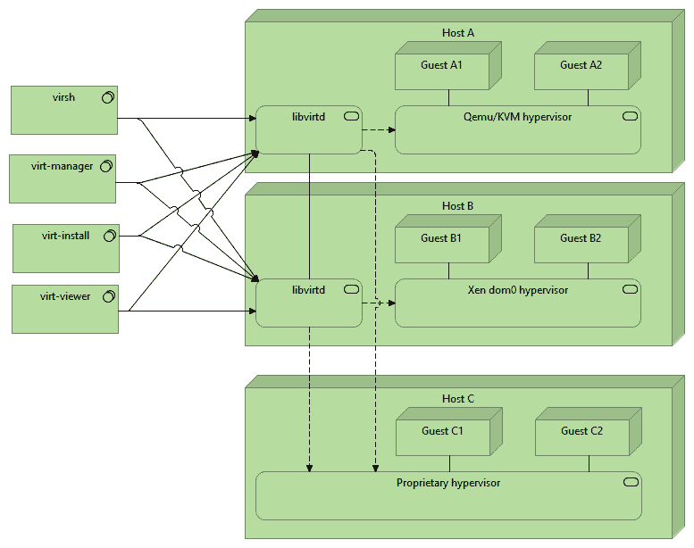

# *第九章*：安全虚拟化

越来越多的系统工具内置了对 SELinux 的支持，或使用 SELinux 的功能来进一步加固自身的服务提供。当我们讨论虚拟化时，libvirt 是虚拟化管理工具的领军者，使用 **QEMU** 和 **基于内核的虚拟机** (**KVM**) 管理程序。

在本章中，管理员将学习什么是 **安全虚拟化**（**sVirt**），以及它是如何通过 libvirt 工具套件应用的，SELinux 域如何设置，以及 sVirt 如何使用 SELinux 分类将客户机相互隔离。我们将研究 SELinux 如何帮助降低虚拟化风险，并理解如何调整 SELinux 策略以支持虚拟化服务。

本章将涵盖以下主要内容：

+   理解 SELinux 安全虚拟化

+   使用 SELinux 支持增强 libvirt

+   使用 Vagrant 与 libvirt

# 技术要求

查看以下视频，了解代码的实际应用：[`bit.ly/2T805Ug`](https://bit.ly/2T805Ug)

虽然在旧系统上运行本章示例是可行的，但我们建议使用支持硬件虚拟化的更现代的系统。这将确保在练习过程中获得更高的性能，因为完全仿真可能会严重拖慢进度，尤其是在旧系统上。

要验证系统是否支持硬件虚拟化（从而能够使用基于 Linux KVM 的虚拟化），以下命令应该有输出：

```
# grep -E 'svm|vmx' /proc/cpuinfo
flags   : fpu vme de ... vmx ...
```

如果没有输出，则表示系统不支持硬件辅助虚拟化。

# 理解 SELinux 安全虚拟化

虚拟化是许多基础设施服务设计中的核心概念。自 1970 年代初期作为隔离工作负载和抽象硬件依赖关系的手段出现以来，虚拟化实现已取得了巨大的发展。今天，当我们看基础设施服务提供时，我们很快意识到，如果没有依赖虚拟化的好处和优点，许多云服务提供商将无法运营。

虚拟化提供的特性之一是隔离，而 SELinux 可以很好地支持并增强这一特性。

## 介绍虚拟化

当我们讨论虚拟化时，我们关注的是它提供的抽象层，用以隐藏某些资源视图（如硬件或处理能力）。虚拟化有助于提高硬件使用效率（从而带来更好的成本控制）、集中化的资源和系统视图、公司可处理的操作系统数量的灵活性、资源分配的标准化，甚至改进的安全服务。

存在几种虚拟化类型：

+   **全系统仿真**：通过软件完全仿真硬件。QEMU 是一款开源仿真软件，能够处理全系统仿真，使管理员和开发人员能够在其系统不兼容的情况下运行具有不同处理器架构的虚拟平台。

+   **本地虚拟化**：在这种情况下，硬件的主要部分在各个实例之间共享，客户机可以在其上不加修改地运行。Linux 的**KVM**就是这种类型的虚拟化，它也通过 QEMU 获得支持。

+   **准虚拟化**：客户机操作系统使用虚拟化层提供的特定 API（在这些虚拟化层上，无法托管未经修改的操作系统）。Xen 的初始版本只支持准虚拟化。使用 KVM 与 VirtIO 驱动程序是另一个更具模块化的示例。

+   **操作系统级虚拟化或容器化**：客户机使用主机操作系统（内核），但看不见主机上运行的进程和其他资源。Docker 容器或 LXC 容器就是操作系统级虚拟化的例子。

+   **应用虚拟化**：应用程序在专用软件运行时环境中运行。这里一个常见的例子是支持 Java 应用程序，它们运行在**Java 虚拟机**（**JVM**）上。

许多虚拟化平台支持几种虚拟化类型。QEMU 根据其配置，可以从全仿真到准虚拟化不等。

当我们处理虚拟化层时，以下术语会频繁出现：

+   **主机**是运行虚拟化软件的（本地）操作系统或服务器。

+   **客户机**是运行在主机上的虚拟化服务（通常是操作系统或容器）。

+   **虚拟机监控器**是管理虚拟化平台的硬件抽象和资源共享能力的专业虚拟化软件。它负责创建和运行虚拟机。

+   **镜像**是代表分配给客户机的文件系统、磁盘或其他介质的一组文件。

+   **虚拟机**是客户机运行的抽象硬件或资源集合。

在本章中，我们将使用这些术语，并且在*第十章*《使用 Xen 安全模块与 FLASK》和*第十一章*《增强容器化工作负载的安全性》中也会使用这些术语，因为这些章节同样涉及到特定的虚拟化实现以及 SELinux 如何在其中主动提供额外的安全控制。

在我们开始配置和调整虚拟化服务之前，先来看看 SELinux 为虚拟化环境提供了什么。

## 审视虚拟化的风险

然而，虚拟化带来了一些风险。如果我们向架构师或其他关注风险的人询问虚拟化的风险，他们会谈到虚拟机扩展、与安全或不安全 API 相关的挑战、虚拟化服务的更高复杂性等问题。

虚拟化本身的挑战超出了本章的范围，但有一些值得注意的风险直接与 SELinux 的关注领域相关。如果我们能够将 SELinux 与虚拟化层结合使用，就能更积极地缓解这些风险：

+   第一个风险是**虚拟机中的数据敏感性**。当多个虚拟机共同托管时，可能存在一个来宾能够通过虚拟化软件的漏洞、虚拟化管理程序的网络功能或通过侧信道攻击等方式访问另一虚拟机上的敏感数据的风险。

    使用 SELinux，可以通过敏感度范围来控制数据的敏感性。不同的来宾可以在不同的敏感度范围内运行，即使在虚拟化层上也能保证数据的敏感性。

+   另一个风险是**离线来宾镜像的安全性**。在这种情况下，管理员或配置错误的虚拟机可能会获得对另一个来宾镜像的访问权限。SELinux 可以通过正确标记的来宾镜像来防止这种情况，并确保离线虚拟机的镜像与在线虚拟机的镜像在类型上有所不同。

+   虚拟机也可以**耗尽系统资源**。在 Linux 系统中，许多资源可以通过**控制组**（**cgroups**）子系统进行控制。由于该子系统是通过系统调用和常规文件 API 来管理的，因此可以使用 SELinux 进一步控制对该功能的访问，确保例如 libvirt 维护的控制组仅由 libvirt 控制。

+   **突破攻击**，即利用虚拟化管理程序中的漏洞试图访问宿主操作系统的攻击，可以通过 SELinux 的类型强制得到缓解，因为即使是虚拟化管理程序也不需要对宿主的所有内容拥有完全的管理权限。

+   SELinux 还可以用于**授权访问虚拟化管理程序**，确保只有正确的团队（通过基于角色的访问控制）能够控制虚拟化管理程序及其定义。

+   最后，SELinux 还提供了更好的**来宾隔离**，这不仅仅是针对来宾镜像的访问。得益于 SELinux 的 MCS 实现，来宾可以以强制性的方法彼此隔离。通过类型强制，来宾的允许行为可以被定义和控制。这是托管服务提供商使用的关键能力，因为它们允许运行（对它们来说）不可信的来宾虚拟机。

然而，SELinux 并不是虚拟化提供商的完整安全解决方案。SELinux 的一个主要设计限制是，如果系统本身不是 SELinux 感知的，它就不是动态的。当我们为虚拟机分配一个类型时，这个类型通常是固定的，不会改变。虚拟机的行为特性将根据其运行的软件而有所不同。

运行 web 服务器的虚拟机与运行数据库或邮件网关的虚拟机具有不同的行为特性。虽然 SELinux 策略管理员可以为每个虚拟机创建新的域，但这样做效率低下。因此，大多数 SELinux 策略将只提供几个可以被虚拟机使用的、具有广泛特性的域。

使用 libvirt 时，这些域是 sVirt 解决方案的一部分。

## 重用现有的虚拟化域

当 Red Hat 引入其虚拟化解决方案时，也加入了 SELinux 支持，并将最终的技术命名为 **sVirt**，源自 *secure virtualization*（安全虚拟化）。由于“安全虚拟化”这一术语在市场上并不独特，我们主要使用术语 sVirt 来指代 SELinux 在虚拟化管理解决方案中的集成，例如 libvirt。

使用 sVirt，开源社区为通过 SELinux 增强虚拟化和容器化的安全性提供了一种可重用的方法。它通过以下域和类型来实现这一点，这些域和类型可以在任何底层虚拟化平台上使用：

+   `libvirtd` 等虚拟机监控软件本身使用 `virtd_t` 域。

+   不需要与主机系统交互，并且除了与通用虚拟机相关的资源之外不需要任何其他资源的来宾（虚拟机）通常会使用 `svirt_t` 域。该域是最为隔离的来宾域，适用于完全虚拟化解决方案。

+   需要与主机进行更多交互的来宾，例如使用 QEMU 网络功能和共享服务的，将使用 `svirt_qemu_net_t` 域。

+   使用 KVM 网络功能和共享服务的来宾将使用 `svirt_kvm_net_t` 域。该域在权限上与 `svirt_qemu_net_t` 相似，但经过优化，适用于 KVM。

+   容器化的来宾，如我们在 *第十一章* 中看到的，*增强容器化工作负载的安全性*，将使用 `svirt_lxc_net_t` 域，其特权经过优化，适用于操作系统级虚拟化。

+   需要更灵活内存访问（例如执行可写内存段和内存堆栈）的来宾将使用 `svirt_tcg_t` 域。这种灵活的内存访问在完全虚拟化的来宾中很常见，因为它们的仿真/虚拟化需要使用 **Tiny Code Generator** (**TCG**)，因此得名。

+   包含来宾数据的镜像文件将标记为 `svirt_image_t` 类型。

+   当前未使用的镜像文件将使用默认的 `virt_image_t` 类型。

+   以只读方式使用的镜像文件将被分配 `virt_content_t` 类型。

为了在域允许做的事情上提供一些灵活性，额外的 SELinux 布尔值被启用，我们接下来将介绍这些内容。

## 微调虚拟化支持的 SELinux 策略

在切换 SELinux 布尔值以控制虚拟化域的限制时要小心。这些布尔值会影响主机级别的 SELinux 策略，不能用来更改单个来宾的访问控制或权限。因此，当我们更改 SELinux 布尔值的值时，这个变化会影响该主机上所有来宾的权限。

让我们看看虚拟化环境中各种 SELinux 布尔值的作用：

+   如果启用 `staff_use_svirt` 布尔值，则允许 `staff_t` 用户域与虚拟机进行交互和管理，因为默认情况下这仅允许未受限用户。

+   如果启用 `unprivuser_use_svirt` 布尔值，则允许无特权的用户域（例如 `user_t`）与虚拟机进行交互和管理。

+   使用 `virt_read_qemu_ga_data` 和 `virt_rw_qemu_ga_data` 布尔值，QEMU 来宾代理（它是一个可选的代理，运行在来宾中，帮助进行如备份过程中的文件系统冻结等操作）可以读取或管理标记为 `virt_qemu_ga_data_t` 类型的数据。然而，该类型默认未使用，这些 SELinux 布尔值默认是禁用的。

+   `virt_sandbox_share_apache_content` 布尔值允许来宾域共享 web 内容。这通常用于容器，但如果虚拟机管理程序支持将主机文件系统映射到来宾，也可以在来宾中使用。

+   启用 `virt_sandbox_use_audit` 后，这个布尔值允许来宾域将审计消息发送到主机的审计服务。

+   `virt_sandbox_use_fusefs` 布尔值授予来宾域挂载并与 `virt_use_fusefs` 布尔值交互的特权，后者允许来宾读取这些文件系统上的文件。

+   如果 `virt_sandbox_use_netlink` 布尔值处于活动状态，则来宾域可以使用 Netlink 系统调用操作主机内的网络堆栈。

+   使用 `virt_transition_userdomain`，容器可以过渡到用户域（包括未受限用户域 `unconfined_t`）。

+   当启用 `virt_use_execmem` 时，来宾可以使用可执行内存。

+   `virt_use_glusterd`、`virt_use_nfs` 和 `virt_use_samba` 布尔值允许来宾使用挂载在主机上的网络文件系统，分别通过 GlusterFS、NFS 和 Samba 提供。请注意，这不涉及来宾内部的挂载，例如连接到 NFS 服务器的来宾。这些布尔值处理通过主机上的文件系统挂载进行的交互。

+   设备访问也通过一些 SELinux 布尔值进行管理，例如 `virt_use_comm` 布尔值，用于与串行和并行通信端口交互；`virt_use_pcscd`，允许来宾访问智能卡；以及 `virt_use_usb`，授予访问 USB 设备的权限。

+   `virt_use_rawip` 布尔值允许来宾使用并与原始 IP 套接字进行交互，从而绕过常规网络栈中的一些处理逻辑，进行网络交互。

+   使用 `virt_use_sanlock`，来宾可以与 sanlock 服务进行交互，这是一个用于共享存储的锁管理器。

+   当 `virt_use_xserver` 设置为 true 时，来宾可以使用主机上的 X 服务器。

如果需要允许某个来宾或一小部分来宾执行安全敏感操作，建议将这些来宾运行在一个隔离的主机上，在该主机上允许这些操作，同时将其他来宾运行在不允许这些特定操作的主机上。

管理员还可以为特定的来宾使用不同的 SELinux 域，微调单个虚拟机的访问控制。如何分配特定域当然取决于底层技术。在 *通过 SELinux 支持增强 libvirt* 这一部分中，我们将介绍如何在基于 libvirt 的虚拟化中实现这一点。

## 理解 sVirt 使用 MCS

SELinux 域和所提到的类型不足以实现来宾之间的适当限制和隔离。sVirt 通过广泛使用 SELinux 的 **多类别安全**（**MCS**）增加了另一层安全性。

在 SELinux 中，一些域被标记为 MCS 约束类型。当是这种情况时，该域将无法访问没有相同分类集（或更多分类集）资源，因为它无法扩展其自身的活动分类集——这一点我们在 *第八章*，*SEPostgreSQL – 使用 SELinux 扩展 PostgreSQL* 中看到过。

sVirt 实现确保之前提到的虚拟化域都标记为 MCS 约束类型。可以通过询问系统哪些类型设置了 `mcs_constrained_type` 属性来确认这一点：

```
# seinfo -amcs_constrained_type -x
Type Attributes: 1
  attribute mcs_constrained_type
    container_t
    netlabel_peer_t
    openshift_app_t
    openshift_t
    sandbox_min_t
    sandbox_net_t
    sandbox_t
    sandbox_web_t
    sandbox_x_t
    svirt_kvm_net_t
    svirt_qemu_net_t
    svirt_t
    svirt_tcg_t
```

通过 MCS 限制，sVirt 实现了来宾之间的正确隔离。每个运行中的虚拟机（通常运行为 `svirt_t`）将被分配两个（随机的）SELinux 分类。虚拟机需要使用的镜像将被分配相同的两个 SELinux 分类。

每当虚拟机试图访问错误的镜像时，MCS 分类的差异将导致 SELinux 拒绝访问。同样，如果一台虚拟机试图连接或攻击另一台虚拟机，MCS 保护将再次阻止这些行为的发生。

sVirt 选择两个类别，即使只有少数类别可用，也能允许大量来宾运行。假设虚拟机监控程序正在使用 `c10.c99` 类别范围运行。这意味着虚拟机监控程序最多只能选择 90 个类别。如果每个来宾只分配一个类别，则虚拟机监控程序最多可以支持 90 个来宾，才会允许多个来宾之间相互交互（当然，假设恶意行为者发现了允许这种交互的漏洞，虚拟机监控程序软件通常会禁止这种访问）。然而，如果使用两个类别，则同时运行的来宾数量将变为 4,005（这是通过公式 *n*(n-1)/2* 得到的，表示从 90 个类别中选择的唯一对数）。

让我们来看看 libvirt 的 SELinux 支持是怎样的。

# 增强 libvirt 以支持 SELinux

libvirt 项目提供了一个虚拟化抽象层，管理员可以通过它管理虚拟机，而无需直接了解或精通底层的虚拟化平台。因此，管理员可以使用 libvirt 提供的工具来管理在 QEMU、QEMU/KVM、Xen 等上运行的虚拟机。

要使用 sVirt 方法，可以构建带有 SELinux 支持的 libvirt。当这种情况发生时，且来宾（从安全角度）由 SELinux 管理，则 sVirt 域和类型将由 libvirt 使用/强制执行。libvirt 代码还会执行类别选择以强制实施来宾隔离，并确保图像文件被分配正确的标签（正在使用的图像文件应该与不活跃的图像文件分配不同的标签）。

## 区分共享资源和专用资源

不同的图像标签允许不同的使用场景。用于托管主要操作系统（来宾系统）的图像通常会接收 `svirt_image_t` 标签，并与来宾运行时本身（以 `svirt_t` 运行）共享相同的类别对进行重新分类。此图像是可由来宾写入的。

当我们考虑一个需要多个来宾读取或写入的图像时，libvirt 可以选择不为该文件分配任何类别。没有类别时，MCS 约束不适用（实际上它们仍然适用，但任何类别集都会主导空类别集，因此对这些正确标记的文件的操作是允许的）。

需要为来宾以只读方式挂载的图像（如可启动媒体）会被分配 `virt_content_t` 类型。如果是专用的，则还可以分配类别。对于共享读访问，无需分配类别。

请注意，这些标签差异主要适用于虚拟化技术，而不适用于容器技术。

## 评估 libvirt 架构

libvirt 项目有多个客户端与 `libvirtd` 守护进程交互。该守护进程负责管理本地虚拟化管理程序软件（无论是 QEMU/KVM、Xen 还是其他任何虚拟化软件），甚至能够管理远程虚拟化管理程序。后一种功能通常用于提供必要 API 来管理主机上虚拟资源的专有虚拟化管理程序：



图 9.1 – libvirt 高层架构

由于 libvirt 项目的跨平台和跨虚拟化管理程序特性，sVirt 是一个很好的匹配。为了确保环境的安全，使用的是通用（但受限的）域，而不是特定于虚拟化管理程序的域。

## 为 sVirt 配置 libvirt

大多数支持 libvirt 的 SELinux 系统将自动启用 SELinux 支持。如果不是这样，但 SELinux 支持是可能的，那么只需配置 libvirt 以允许 SELinux 安全模型。我们在 libvirt 中按每个虚拟化管理程序的基础映射 SELinux 安全模型。

与 sVirt 相关的配置参数通常是按每个虚拟化管理程序的基础定义的。例如，对于基于 QEMU 的虚拟化驱动程序，我们需要编辑 `/etc/libvirt/qemu.conf` 文件。让我们看看与安全虚拟化相关的各种参数：

+   第一个参数，定义 sVirt 是否启用的是 `security_``driver` 参数。虽然 libvirt 会在检测到 SELinux 激活时默认启用 SELinux，但我们可以通过设置 `selinux` 值显式标记 sVirt 支持为启用：

    ```
    security_driver = "selinux"
    security_driver = "none"
    ```

+   libvirt 中与 sVirt 相关的第二个设置是 `security_default_confined`。该变量定义了虚拟机是否默认受限（因此与 sVirt 保护相关）或不受限。默认值为 `1`，表示默认启用限制。要禁用它，您需要将其设置为 `0`：

    ```
    security_default_confined = 0
    ```

+   libvirt 软件的用户也可以请求创建一个未受限制的虚拟机（libvirt 默认允许此操作）。如果我们将 `security_require_confined` 设置为 `1`，则不能创建未受限制的虚拟机：

    ```
    security_require_confined = 1
    ```

当平台上有活动的虚拟机时，我们可以确认 sVirt 正在运行，因为我们可以检查其进程的标签，验证它是否确实获得了两个随机类别。

让我们创建这样一个虚拟机，使用常规的 QEMU 虚拟化管理程序。我们使用 Alpine Linux ISO 来启动虚拟机，但这只是一个示例——您可以用任何您想要的 ISO 替换它：

```
# virt-install --virt-type=qemu --name test \
  --ram 128 --vcpus=1 --graphics none \
  --os-variant=alpinelinux3.8 \
  --cdrom=/var/lib/libvirt/boot/alpine-extended-x86_64.iso \
  --disk path=/var/lib/libvirt/images/test.qcow2,size=1,format=qcow2
```

提到的位置很重要，因为它们将确保文件被正确标记：

+   在 `/var/lib/libvirt/boot`（和 `/var/lib/libvirt/isos`）中，应放置只读内容，这将导致文件自动被标记为 `virt_content_t`。

+   在`/var/lib/libvirt/images`中，我们创建实际的虚拟机镜像。当虚拟机关闭时，镜像将标记为`virt_image_t`，但一旦启动，标签会根据与域相关的类别进行调整。

该命令将创建一个名为`test`的虚拟机，分配 128 MB 内存和 1 个虚拟 CPU。不会启用任何特定的图形支持，这意味着虚拟机的标准控制台或屏幕将不会与任何图形服务（如**虚拟网络计算**（**VNC**））相关联，而是依赖于虚拟机内部的串行控制台定义。此外，我们还让虚拟机使用一个 1 GB 的小磁盘，并采用**QEMU 写时复制**（**QCOW2**）格式。

一旦我们创建了虚拟机并启动它，我们可以轻松检查其标签：

```
# ps -efZ | grep test
system_u:system_r:svirt_tcg_t:s0:c533,c565 /usr/bin/qemu-system-x86_64 -name guest=test,...
```

要列出当前定义的虚拟机，可以使用`virsh`命令：

```
# virsh list --all
 Id   Name     State
------------------------
 1    test     running
```

`--all`参数将确保即使是已经定义但当前未运行的虚拟机也会被列出。

重要提示

在 libvirt 中，虚拟机实际上被称为**域**。由于 SELinux（因此本书）在提到进程上下文时也常使用*域*一词，因此我们在提到 libvirt 的域时，将使用*虚拟机*这一术语，以避免可能的混淆。

`virsh`命令是与 libvirt 交互的主要入口。例如，要向虚拟机发送关机信号，可以使用`shutdown`参数，而`destroy`参数则会强制虚拟机关机。最后，要删除定义，可以使用`undefine`。

如前面示例所示，我们定义的虚拟机正在运行` svirt_tcg_t`域。让我们看看如何调整 libvirt 为虚拟机使用的标签。

## 更改虚拟机的 SELinux 标签

一旦定义了虚拟机，libvirt 允许管理员通过编辑表示虚拟机的 XML 文件来修改其参数。在这个 XML 文件中，SELinux 标签也有一个位置。

要查看当前定义，可以使用`virsh`的`dumpxml`参数：

```
# virsh dumpxml test
```

在 XML 的末尾，会显示安全标签。对于 SELinux，它可能是这样的：

```
<seclabel type='dynamic' model='selinux' relabel='yes'>
  <label>system_u:system_r:svirt_tcg_t:s0:c533,c565</label>
  <imagelabel>system_u:object_r:svirt_image_t:s0:c533,c565</imagelabel>
</seclabel>
```

如果我们想修改这些设置，可以使用`virsh`的`edit`参数：

```
# virsh edit test
```

这将打开本地编辑器中的 XML 文件。然而，一旦我们完成这一步，我们会注意到`seclabel`条目并没有出现。这是因为默认行为是使用动态标签（因此`type='dynamic'`）和默认标签，这不需要任何默认定义。

让我们改用静态定义，并让虚拟机使用`c123,c124`类别对运行。在显示的 XML 中，在结尾（但仍然在`<domain>...</domain>`定义内），放入以下 XML 片段：

```
<seclabel type='static' model='selinux' relabel='yes'>
  <label>system_u:system_r:svirt_tcg_t:s0:c123,c124</label>
</seclabel>
```

以不同类型运行来宾当然也可以用类似的方式进行，改变 `svirt_tcg_t` 为其他类型。然而，记住并非所有类型都能使用。例如，默认的 `svirt_t` 域不能与 QEMU 的完全系统虚拟化一起使用（因为如果 QEMU 不能使用 KVM，它会使用 TCG）。

重要提示

libvirt 使用的默认类型声明在 `/etc/selinux/targeted/contexts` 中，分别在 `virtual_domain_context` 和 `virtual_image_context` 文件中。然而，不建议更改这些文件，因为它们会在 SELinux 策略更新时被发行版覆盖。

`relabel` 语句请求 libvirt 根据来宾当前分配的标签（`relabel='yes'`）或不进行重新标记（`relabel='no'`）来重新标记所有资源。对于动态类别分配，这将始终是 `yes`，而对于静态定义，两个值都是可能的。

当然，如果我们需要，我们也可以使用带有自定义类型定义的动态类别分配。为此，我们声明 `type='dynamic'`，但在 `<baselabel>` 实体中显式定义一个标签，如下所示：

```
<seclabel type='dynamic' model='selinux'>
  <baselabel>system_u:system_r:svirt_t:s0</baselabel>
</seclabel>
```

这将使来宾使用动态关联的类别对运行，同时使用自定义标签，而不是默认选择的标签。

## 自定义资源标签

如果来宾定义启用了重新标记（无论是由于使用了动态类别分配，还是管理员明确请求），则来宾使用的资源将相应地进行重新标记。

管理员可以通过我们之前使用的相同接口自定义 libvirt 的标记行为：来宾定义文件。例如，如果我们不希望 libvirt 重新标记表示来宾磁盘的 `test.qcow2` 文件，我们可以像这样将其添加到 XML 中：

```
<disk type='file' device='disk'>
  <driver name='qemu' type='qcow2'/>
  <source file='/var/lib/libvirt/images/test.qcow2'>
    <seclabel relabel='no'/>
  </source>
  <target dev='hda' bus='ide'/>
  <address type='drive' controller='0' bus='0'
           target='0' unit='0'/>
</disk>
```

这在你希望允许不同来宾之间共享一些资源，但又不希望所有来宾都能读取这些资源时非常有用。在这种情况下，我们可以将文件本身标记为（例如）`svirt_image_t:s0:c123`，并确保具有类别对的来宾始终包含类别 `c123`。

## 控制可用的类别

当 libvirt 选择随机类别时，它会根据自己的类别范围进行选择。默认情况下，MCS 系统将这个范围设置为 `c0.c1023`。要更改类别范围，我们需要确保以正确的上下文启动 libvirt 守护进程（`libvirtd`）。

在 systemd 中，我们在 *第七章*，*配置特定应用的 SELinux 控制* 中看到，这可以通过编辑服务单元文件并定义正确的 `SELinuxContext` 变量来实现。让我们也将其应用于 `libvirtd`：

1.  首先，将系统提供的 `libvirtd.service` 文件复制到 `/etc/systemd/system`：

    ```
    # cp /usr/lib/systemd/system/libvirtd.service /etc/systemd/system
    ```

1.  编辑 `libvirtd.service` 文件并添加以下定义：

    ```
    SELinuxContext=system_u:system_r:virtd_t:s0-s0:c800.c899
    ```

1.  重新加载 systemd 的守护进程定义，以便它能够获取新的 `libvirtd.service` 文件：

    ```
    # systemctl daemon-reload
    ```

1.  重启 `libvirtd` 守护进程：

    ```
    # systemctl stop libvirtd
    # systemctl start libvirtd
    ```

1.  现在我们可以重新启动我们的虚拟机并验证每个虚拟机现在是否在`libvirtd`守护进程定义的范围内运行。

    ```
    # virsh start test
    # ps -efZ | grep virt
    system_u:system_r:virtd_t:s0-s0:c800.c899 /usr/sbin/libvirtd
    system_u:system_r:svirt_t:s0:c846,c891 /usr/bin/qemu-system-x86_64 -name guest=test...
    ```

    如我们所见，libvirt 选择的类别现在都在定义的范围内。

不使用 systemd 的系统可以编辑 SysV 风格的`init`脚本，并使用`runcon`：

```
runcon -l s0-s0:c800.c899 /usr/sbin/libvirtd \
  --config /etc/libvirt/libvirtd.conf --listen
```

每次启动新虚拟机时，libvirt 的代码会随机选择两个类别。然后，服务将检查这些类别是否属于其自身的范围，以及该类别对是否已被使用。如果这些检查中的任何一个失败，libvirt 将随机选择一对新的类别，直到找到符合要求的空闲类别对。

## 更改存储池位置

libvirt 的一个非常常见的配置更改是将其重新配置为使用不同的存储池位置。这对 SELinux 也有轻微影响，因为我们没有为新位置定义正确的文件上下文。

让我们来看一下如何创建一个新的存储池位置并更改 SELinux 配置：

1.  列出当前的存储池，以确保新池的名称未被占用：

    ```
    # virsh pool-list --all
     Name                   State     Autostart
    -----------------------------------------------
     boot                   active    yes
     images                 active    yes
     root                   active    yes
    ```

1.  创建目标位置：

    ```
    # mkdir /srv/images
    ```

1.  使用`pool-define-as`创建新的存储池。在以下命令中，我们将池命名为`large_images`：

    ```
    # virsh pool-define-as large_images dir - - - - "/srv/images"
    Pool large_images defined
    ```

1.  配置 SELinux 以正确标记存储池：

    ```
    # semanage fcontext -a -t virt_image_t "/srv/images(/.*)?" 
    ```

1.  重新标记目录结构：

    ```
    # restorecon -R /srv/images
    ```

1.  让 libvirt 填充目录结构：

    ```
    # virsh pool-build large_images
    ```

1.  启动存储池：

    ```
    # virsh pool-start large_images
    ```

1.  打开自动启动，以便当 `libvirtd` 启动时，存储池也可以立即使用：

    ```
    # virsh pool-autostart large_images
    ```

1.  我们可以使用`pool-info`命令来验证一切是否正常运作：

    ```
    # virsh pool-info large_images
    ```

    输出将显示新位置的当前和可用容量。

如果我们将存储池托管在 NFS 挂载的位置上，那么我们还需要启用`virt_use_nfs` SELinux 布尔值。

现在我们已经完全掌握了如何配置 libvirt 和 SELinux，接下来让我们看看如何将流行的 Vagrant 工具与 libvirt 配合使用。

# 使用 Vagrant 与 libvirt

Vagrant 是一个快速启动和管理虚拟机的框架，在开发社区中非常流行。虽然 Vagrant 默认使用 Oracle VirtualBox 作为虚拟机管理程序，但我们可以安装 libvirt 插件来将 Vagrant 与 libvirt 一起使用，从而受益于 SELinux 提供的 sVirt 安全性。

## 部署 Vagrant 和 libvirt 插件

Vagrant 应用程序可以通过一个单独的 RPM 文件进行安装。您可以在 [`www.vagrantup.com/downloads.html`](https://www.vagrantup.com/downloads.html) 找到最新版本并安装。例如，对于 CentOS 系统，您可以直接使用 `yum`：

```
# yum install https://releases.hashicorp.com/vagrant/2.2.9/vagrant_2.2.9_x86_64.rpm
```

要安装 libvirt 插件，我们首先需要确保依赖项已正确安装。在线文档 [`github.com/vagrant-libvirt/vagrant-libvirt`](https://github.com/vagrant-libvirt/vagrant-libvirt) 给出了需要安装的包的概述。不要忘记这一步，因为插件安装过程中出现的依赖项失败并不总是显而易见的。

安装好依赖后，使用`vagrant`本身下载并安装插件：

```
# vagrant plugin install vagrant-libvirt
```

安装完插件后，我们可以继续设置 Vagrant box。

## 安装一个兼容 libvirt 的 box

Vagrant 使用**box**：这些是为快速安装 Vagrant 而准备的镜像。并不是所有的 Vagrant box 都与 libvirt 提供者兼容。幸运的是，Vagrant Cloud 网站（[`app.vagrantup.com/boxes/search?provider=libvirt`](https://app.vagrantup.com/boxes/search?provider=libvirt)）允许你快速找到兼容的 box。

假设我们想要使用一个名为`fedora/32-cloud-base`的 Fedora 镜像，那么我们可以按如下方式进行配置：

1.  创建一个新的目录，我们将在其中定义 box 配置，并进入该位置：

    ```
    # mkdir vagrant
    # cd vagrant
    ```

1.  初始化 Vagrant box，使用`fedora/32-cloud-base`的 box 定义：

    ```
    Vagrantfile that can be used to further configure the box.
    ```

1.  编辑`Vagrantfile`并添加以下代码：

    ```
    config.vm.provider :libvirt do |libvirt|
      libvirt.storage_pool_name = "images"
      libvirt.driver = "qemu" # or kvm
    end
    ```

    这将配置 libvirt 提供者使用`images`目录作为默认存储池，并在 libvirt 中使用 QEMU 驱动。

1.  仍然在`Vagrantfile`中，添加以下代码来为 box 指定一个合适的名称：

    ```
    config.vm.define :test do |test|
      test.vm.box = "fedora/32-cloud-base"
    end
    ```

    这里选择的名称是`test`，这将导致一个名为`vagrant_test`的虚拟机。

1.  要启动测试虚拟机，像这样运行`vagrant up`命令：

    ```
    vagrant up every time with the --provider=libvirt parameter, we can also declare the VAGRANT_DEFAULT_PROVIDER="libvirt" environment variable and drop the command-line argument, as the environment variable will then be used.
    ```

一旦虚拟机启动并运行，你可以使用`vagrant ssh`连接到它。虽然你可以使用`virsh`命令操作虚拟机，但你也可以使用`vagrant halt`来关闭虚拟机，或者使用`vagrant destroy`，然后运行`vagrant box remove`来彻底从系统中移除该 box。

## 配置 Vagrant box

一旦一个 box 被部署，它就可以通过 libvirt 作为标准虚拟机使用。这意味着我们之前看到的通过修改标签或使用 SELinux 布尔值调整 SELinux 控制的操作仍然适用。

让我们首先验证一下 Vagrant 是否确实在使用 libvirt 来启动自己的 box：

```
# virsh list --all
 Id    Name            State
-----------------------------
 1     vagrant_test    running
```

的确，虚拟机已可用，名为`vagrant_test`。我们也可以使用`virsh edit`命令来修改其配置：

```
# virsh edit vagrant_test
```

只要 Vagrant box 没有被销毁，libvirt 中的设置将会持续存在。

# 总结

虚拟化是一项强大的技术，其安全性可以通过 SELinux 得到增强。通过 sVirt，开源社区提供了一种强有力的方法来隔离虚拟机，确保虚拟机只能访问它们应该访问的资源。

在这一章中，我们探讨了虚拟化及其相关的风险，并讨论了如何通过 SELinux 提供的控制手段（如类型强制和 MCS 隔离）来缓解这些风险。

接着，我们介绍了 libvirt 如何在 Linux 平台上支持多种虚拟化技术，以及它如何包含一项名为 sVirt 的技术，该技术实现了 SELinux 集成，提供了客户机隔离和访问控制。我们看到管理员如何在 libvirt 内操作 sVirt 逻辑，例如通过不同的域标签或类别集。我们以如何将 Vagrant 与 libvirt 一起使用的信息结束了本章内容。

在下一章，我们将介绍另一种虚拟化解决方案，称为 Xen，它采用了一种基于 SELinux 的技术来加强安全性。

# 问题

1.  sVirt 有什么独特之处是常规 SELinux 配置无法做到的？

1.  SELinux 在虚拟化中解决的两个主要风险是什么？

1.  `virt_image_t`、`svirt_image_t` 和 `virt_content_t` 之间有什么区别？

1.  如何使用 libvirt 更改客户机标签？

1.  我们如何使用 Vagrant 并仍然受益于 sVirt？
