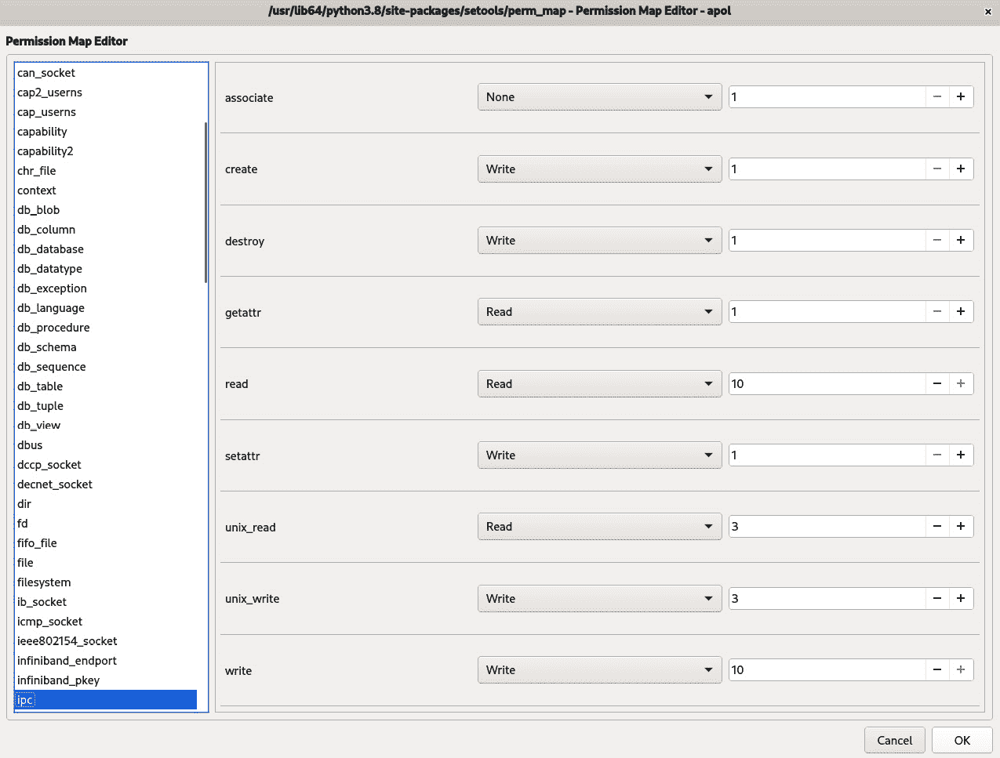

# *第十三章*：分析策略行为

尽管 SELinux 策略在系统上强制执行强制访问控制和应用程序行为，但了解策略的预期行为对于管理员执行评估和根本原因分析活动非常有用。

在本章中，我们将学习如何深入查询 SELinux 策略，使用多种工具查询进程转换、分析信息流并比较策略。我们将考虑 `apol` 工具，这是一个图形界面工具，可以帮助我们对策略进行多种分析，同时也会涉及命令行工具，如 `sesearch`、`sedta`、`seinfoflow` 和 `sepolicy`。最后，我们将使用 `sediff` 来比较策略。

本章将涵盖以下主要主题：

+   执行单步分析

+   调查领域转换

+   分析信息流

+   比较策略

# 技术要求

查看以下视频，了解代码的实际操作：[`bit.ly/3lY56LB`](https://bit.ly/3lY56LB)

# 执行单步分析

到目前为止，我们已经通过命令行工具如 `seinfo` 和 `sesearch` 介绍了一些分析 SELinux 策略的方法。这些工具可以帮助用户执行单步分析：它们要么提供有关 SELinux 对象的即时信息（这正是 `seinfo` 的功能），要么能够查询直接的 SELinux 规则（这正是 `sesearch` 的范围）。

不过，`seinfo` 和 `sesearch` 工具的所有功能还未完全讨论，接下来让我们看看这些命令还有哪些其他技巧。

## 使用不同的 SELinux 策略文件

许多 SELinux 分析工具，包括 `seinfo` 和 `sesearch`，可以访问当前加载的 SELinux 策略和指定的 SELinux 策略文件。后者允许开发者查询他们无法直接访问的系统的 SELinux 策略（如移动设备），或者查询以前使用过（备份）且现在不再活跃的策略。

例如，要分析名为 `policy.sepolicy-2` 的策略文件，可以使用以下 `seinfo` 命令：

```
$ seinfo ./policy.sepolicy-2
Statistics for policy file: ./policy.sepolicy-2
Policy Version:             30 (MLS enabled)
Target Policy:              selinux
Handle unknown classes:     deny
  Classes:              63    Permissions:         286
  Sensitivities:         1    Categories:         1024
  Types:              1858    Attributes:           28
  Users:                 1    Roles:                 2
  Booleans:              0    Cond. Expr.:           0
  Allow:            108120    Neverallow:            0
  Auditallow:           24    Dontaudit:           553
  Type_trans:          639    Type_change:           0
  Type_member:           0    Range_trans:           0
  Role allow:            0    Role_trans:            0
  Constraints:           0    Validatetrans:         0
  MLS Constrain:        59    MLS Val. Tran:         0
  Permissives:           0    Polcap:                2
  Defaults:              0    Typebounds:            0
  Allowxperm:          185    Neverallowxperm:       0
  Auditallowxperm:       0    Dontauditxperm:        0
  Initial SIDs:         27    Fs_use:               16
  Genfscon:             83    Portcon:               0
  Netifcon:              0    Nodecon:               0
```

当命令没有明确指示解析给定的策略文件时，它会尝试通过 `/sys/fs/selinux/policy` 伪文件查询当前活动的策略。

## 显示策略对象信息

`seinfo` 应用程序的主要功能是显示 SELinux 对象信息。该信息是按对象逐个显示的。支持各种 SELinux 对象类型，从常见的类型、属性、角色和用户，到更为专门的 `fs_use_*` 声明或 `genfscon` 语句。

支持的对象类型的完整列表（及其对应的 `seinfo` 选项）可以在 `seinfo` 手册页中找到，或者通过直接帮助获取：

```
$ seinfo --help
```

无论用户感兴趣的对象类型是什么，`seinfo` 都有三种主要的操作模式：

+   在第一种模式下，它列出给定类型的对象。为此，只需要传递选项，无需其他信息。例如，要列出策略中所有可用的对象类，请使用以下命令：

    ```
    $ seinfo --class
    ```

+   在第二种模式下，它可以确认（或否认）某个对象实例的存在。要实现这一点，向命令中添加实例名称。例如，要验证`memprotect`类是否在策略中可用，请使用以下命令：

    ```
    $ seinfo --class memprotect
    Classes: 1
      memprotect
    ```

    可惜，无论实例是否可用，应用程序的返回码都是相同的，因此脚本在没有额外语句来验证实例是否存在的情况下无法使用它们。相反，脚本需要检查命令的输出（该输出会说明没有匹配名称的实例）。

+   第三种模式显示关于所选实例的扩展信息。虽然并非所有信息对象都支持扩展集，但大多数常见对象支持。扩展信息通常显示与初始查询相关的（不同的）实例列表：

    ```
    $ seinfo --class memprotect -x
    Classes: 1
      class memprotect
    {
        mmap_zero
    }
    ```

`seinfo`可以查询的支持类型如下：

+   使用`--attribute`（`-a`），`seinfo`显示策略中当前已知的所有 SELinux 属性。当展开时，它会显示与给定属性相关的类型。

+   使用`--bool`（`-b`），`seinfo`显示策略中当前已知的所有 SELinux 布尔值。当展开时，它会显示该布尔值的当前值。

+   使用`--class`（`-c`），`seinfo`显示支持的 SELinux 类。当展开时，它会显示该类支持的权限。

+   使用`--role`（`-r`），`seinfo`显示策略中支持的 SELinux 角色。当展开时，它会显示该角色允许的域。

+   使用`--type`（`-t`），`seinfo`显示策略中的 SELinux 类型。当展开时，它会显示该类型的别名以及属性。

+   使用`--user`（`-u`），`seinfo`显示策略中已知的 SELinux 用户（不是 Linux 用户或登录）。当展开时，它会显示与该 SELinux 用户关联的角色和敏感性范围。

+   使用`--category`，`seinfo`显示当前支持的类别。当展开时，它会显示该类别关联的敏感性（仅在 MLS 策略中）。

+   使用`--common`，`seinfo`显示常见的权限集。这些是不同类继承的权限集。当展开时，它显示该集合的权限部分。

+   使用`--constrain`，`seinfo`显示当前的约束。此查询没有扩展信息。

+   使用`--default`，`seinfo`显示策略中的`default_*`规则。例如，其中一条规则是类的默认敏感性范围（`default_range`）。此查询没有扩展信息。

+   使用`--fs_use`，`seinfo`显示 SELinux 策略中的`fs_use_*`规则。其中一条规则是为支持扩展属性的文件系统分配安全上下文（`fs_use_xattr`）。此查询没有扩展信息。

+   使用`--genfscon`时，`seinfo`显示不支持扩展属性的文件系统的上下文分配。此查询没有扩展信息。

+   使用`--initialsid`时，`seinfo`显示所有初始**安全标识符**（**SID**）。这些是所有具有预定义上下文的类。展开时，显示与 SID 关联的上下文。

+   使用`--netifcon`时，`seinfo`显示当前与网络接口相关联的上下文。仅在启用标记化网络时适用。此查询没有扩展信息。

+   使用`--nodecon`时，`seinfo`显示当前与节点定义（主机）相关联的上下文。仅在启用标记化网络时适用。此查询没有扩展信息。

+   使用`--permissive`时，`seinfo`显示当前标记为宽松域的类型。此查询没有扩展信息。

+   使用`--polcap`时，`seinfo`显示策略能力（即定义 SELinux 子系统行为的策略设置，例如我们在*第五章*《控制网络通信》中看到的通过`extended_socket_class`策略能力支持 SCTP）。展开时，显示策略中的实际策略能力声明。

+   使用`--portcon`时，`seinfo`显示当前端口映射及其相关的上下文（这也可以通过`semanage port -l`进行解释）。此查询没有扩展信息。

+   使用`--sensitivity`时，`seinfo`显示当前支持的敏感性级别。展开时，显示声明敏感性的实际策略声明。

+   使用`--typebounds`时，`seinfo`显示类型边界（由父域限定的 SELinux 类型或域）。此查询没有扩展信息。

+   使用`--validatetrans`时，`seinfo`显示策略中活动的转换约束（这些是限制文件转换何时允许的约束）。大多数 Linux 发行版不使用此功能。此查询没有扩展信息。

`seinfo`命令还具有`--all`选项，可以显示它从策略文件中获取的所有可能信息。然而，这不包括扩展信息。

## 理解`sesearch`

当`seinfo`显示 SELinux 对象的信息时，`sesearch`用于查询源资源与目标资源之间的 SELinux 规则和行为信息。

我们一直在使用`sesearch`查询标准`allow`规则（与类型强制相关的访问控制），以及 SELinux 布尔值对这些`allow`规则的影响。`sesearch`应用程序不仅允许我们基于规则类型查询规则，还可以基于其他参数进行过滤。让我们看看可以用于`sesearch`过滤器的参数：

+   最常见的查询是使用`--source`（`-s`）和/或`--target`（`-t`）过滤与给定源表达式匹配的规则：

    ```
    $ sesearch -A -s mount_t -t unconfined_t
    $ sesearch -A -s svirt_sandbox_domain -ds
    ```

+   使用`--class`（`-c`）参数，我们可以仅搜索那些影响指定资源类（如`file`、`dir`、`tcp_socket`等——所有可能的类的列表可以通过`seinfo --class`获得）的规则：

    ```
    $ sesearch -A -s svirt_sandbox_domain -c file
    ```

+   如果我们只对某个特定操作（或权限）感兴趣，可以使用`--perm`（`-p`）参数。遇到某个操作（例如，`write`）被拒绝的情况时，这个选项特别有用，我们可以查看哪些域被允许执行此操作，这可能表明我们正在检查错误的源域。我们可以列出多个权限，在这种情况下，`sesearch`将显示至少包含一个权限的规则：

    ```
    -ep option, sesearch will only list the rules that have all permissions in them, rather than at least one.
    ```

+   我们还可以仅查询受 SELinux 布尔值影响的那些规则，使用`--bool`（`-b`）参数，正如我们在*第十二章*中看到的，*调整 SELinux 策略*。

    如果我们使用`-eb`选项，那么命令行中列出的所有布尔值必须全部匹配，而不是至少匹配一个。

+   `sesearch`应用程序也可以使用正则表达式而不是实际值。这不是默认行为，但可以通过`-rs`（源类型或角色），`-rt`（目标类型或角色），`-rc`（类），`-rd`（默认类型或角色）和`-rb`（布尔值）来激活：

    ```
    $ sesearch -A -s staff_.*_t -c process -p transition -rs
    ```

由于这提供了对最常见的 SELinux 行为和访问控制的洞察，接下来我们将逐一介绍这些规则以及它们对系统的影响。

## 查询 allow 规则

第一类规则是`allow`规则，其中有许多子类型。标准的`allow`规则定义了源域可以成功触发哪些操作到目标类型或针对目标类型：

```
$ sesearch --allow -s guest_t -t cgroup_t -c dir
allow guest_usertype cgroup_t:dir { getattr ioctl lock open read search };
allow guest_usertype filesystem_type:dir { getattr open search };
```

SELinux 策略可以定义一些类似的规则，使用`sesearch`也可以类似查询，具体如下：

+   使用`--auditallow`，我们可以查询哪些操作被 SELinux 允许，但仍会导致审计事件。

+   使用`--dontaudit`，我们可以查询哪些操作在被拒绝时不会触发审计事件。

+   使用`--neverallow`，我们可以查询哪些操作被禁止在策略中声明。定义这些操作后，如果它们违反了规则，系统将拒绝加载新的 SELinux 策略。不过，这不能用来否定现有规则，并且如果当前策略已经有偏离该规则的情况，那么尝试往策略中添加`neverallow`规则将会失败。

SELinux 也支持`allow`规则，但它需要额外的（数字）参数，以进一步限制规则的适用性，并用于为设备查询提供细粒度的访问控制。这些查询通常由`ioctl()`系统调用处理，但在扩展权限支持之前，SELinux 只能控制域是否被允许使用`ioctl()`系统调用，而不是过滤`ioctl()`的显式查询。

通过扩展权限规则，SELinux 策略开发人员可以指定哪些`ioctl()`查询是允许的，哪些是不允许的。例如，我们可以授予某个域获取硬件地址（被称为`SIOCGIFHWADDR`，其定义为编号`0x8927`）的权限，方法如下：

```
allowxperm <domain> <resource> : tcp_socket ioctl 0x8927;
```

在`sesearch`中，我们可以使用`--allowxperm`查询这些规则。与常规的`allow`规则类似，我们还有`--auditallowxperm`、`--dontauditxperm`和`--neverallowxperm`选项，用于覆盖扩展权限等效规则。这些选项对查询以及扩展权限规则有相同的影响。

## 查询类型转换规则

第二类规则是类型转换规则。与其告知系统哪些操作被允许或不被允许，**类型转换**通过系统中进程执行的操作影响对象和资源的 SELinux 上下文。例如，类型转换规则定义了当一个文件在某个具有特定 SELinux 类型的目录中被某个域写入时，文件会接收到什么上下文；或者定义了当一个进程从某个源域执行时，该进程会接收到什么域：

```
$ sesearch -T -s guest_t -c process
type_transition guest_t abrt_helper_exec_t:process abrt_helper_t;
type_transition guest_t chfn_exec_t:process chfn_t;
...
```

在此输出中，我们可以看到，当访客域成功执行一个标记为`abrt_helper_exec_t`的二进制文件时，最终生成的进程将被分配`abrt_helper_t`上下文。

这些规则通过*调查域转换*部分中的各种工具进行查询和解释。

## 查询其他类型规则

除了`allow`规则和类型转换规则外，`sesearch`还可以查询另外两类与类型相关的规则：`type_change`和`type_member`。这些规则是为 SELinux 感知应用程序设计的，并不会被内核中的 SELinux 子系统强制执行：

+   使用`type_change`语句（可以通过在`sesearch`中使用`--type_change`选项进行过滤），开发人员通知 SELinux 感知的应用程序，目标资源应由源域代表进行重新标记，赋予给定类型。

    ```
    type_change guest_t tty_device_t:chr_file user_tty_device_t;
    ```

    由于设备文件本身已经存在，并且仅被重新分配给用户，因此不会进行类型转换。相反，`type_change`规则由 SELinux 感知的应用程序进行解释，并相应地重新标记设备文件。

+   `type_member`规则（可以通过在`sesearch`中使用`--type_member`选项进行过滤）告知参与设置多实例化位置的 SELinux 感知应用程序（如我们在*第三章*中看到的，*管理用户登录*）这些目录的目标 SELinux 类型。例如，当`/tmp`位置（被标记为`tmp_t`）为某个用户进行多实例化时，则使用以下规则来理解该用户的`/tmp`视图应被标记为`user_tmp_t`：

    ```
    type_member guest_t tmp_t:dir user_tmp_t;
    ```

    负责处理多实例化的 PAM 模块是 SELinux 感知的，并将使用这些规则来推断所创建位置的目标类型。

除了与类型相关的语句，`sesearch`还可以处理与角色相关的查询。

## 查询与角色相关的规则

SELinux 还具有与角色活动和转换相关的规则。通过`sesearch`应用，我们可以查询哪些 SELinux 角色可以从其他角色访问，以及何时执行角色转换（例如，从用户角色切换到系统角色）：

```
$ sesearch --role_allow -s dbadm_r;
allow dbadm_r sysadm_r;
$ sesearch --role_trans -s dbadm_r;
role_transition dbadm_r mysqld_initrc_exec_t:process system_r;
role_transition dbadm_r postgresql_initrc_exec_t:process system_r;
```

两者的区别在于，允许的访问（使用`--role_allow`）显示哪些角色可以从给定角色访问，但它们并不指示何时进行转换。角色转换（使用`--role_trans`）则显示系统在执行脚本或二进制文件时，尝试自动更改角色的时机（以及会切换到哪个角色）。因此，它们可以与`allow`规则（指定允许的内容）和类型转换（定义 SELinux 行为）进行比较。

分析角色转换和角色`allow`规则有助于管理员推测哪些角色权限过大，可能导致潜在的安全问题。例如，允许`dbadm_r`角色通过`postgresql_initrc_exec_t`类型切换到`system_r`角色，如果该角色也具有修改`postgresql_initrc_exec_t`资源的权限，可能会使该角色执行超出其范围的操作：

```
$ sesearch -A -s dbadm_t -t postgresql_initrc_exec_t -c file;
allow dbadm_t postgresql_initrc_exec_t:file { execute execute_no_trans getattr ioctl map open read };
```

虽然直接修改`postgresql_initrc_exec_t`文件是不可允许的，但仅仅查看主要的用户类型是不够的。一个好的分析需要包括`dbadm_r`角色能够访问的所有类型，后续我们将在*调查域转换*和*分析信息流*部分中介绍这些内容。这些部分将使用`apol`，所以让我们首先看看这个应用程序的功能。

## 使用 apol 进行浏览

一个用于执行策略分析的高级工具是`apol`，可以通过直接执行该命令而不带任何参数来启动。该工具是图形化的，允许分析人员和管理员对 SELinux 策略执行广泛的分析操作。

启动后，使用`apol`的第一步是加载目标策略（可以是当前活动的策略或从其他系统复制过来的文件）。这可以通过**打开策略**按钮完成，或者通过导航到**文件** | **打开策略**。

工具将显示加载的策略的一般概览：


图 13.1 – 加载策略文件后的 apol 应用

加载完成后，选择**新建分析**以启动策略分析功能：


图 13.2 – apol 支持的分析方法概述

提供了相当数量的分析方法。让我们选择**类型**浏览可用的类型，或者选择一个属性查看分配给该属性的 SELinux 类型：


图 13.3 – 使用 apol 浏览类型

同样地，使用`sesearch`应用程序：


图 13.4 – 使用 apol 查询类型强制规则

更高级的分析方法在*调查域转移*和*分析信息流*章节中有所介绍。

## 使用 apol 工作区

分析 SELinux 策略可能需要一些时间，特别是当涉及多个分析阶段和微调时。`apol`工具允许你将当前工作区保存到磁盘，以便稍后从保存点恢复分析：


图 13.5 – apol 中的工作区管理

工作区不仅保留了到目前为止查询的设置，还保留了你可能添加的备注。备注是`apol`中的一个重要功能，你可以在其中写下你在查询过程中想到的内容和观察结果。备注与打开的标签页相关联，使你能够根据需要在不同查询之间切换。

现在我们已经知道了`apol`应用程序的工作原理，接下来看看我们如何利用它（以及其他工具）进行更深入的分析。

# 调查域转移

处理 SELinux 策略时，一个重要的分析方法是执行**域转移分析**。域是由给定域的访问控制所界定的，但用户或进程可以通过执行正确的应用程序集转移到其他域。

分析两个 SELinux 域之间是否以及如何发生转移，允许管理员验证策略的安全状态。考虑到 SELinux 的强制性，攻击者很难执行目标应用程序，如果域转移分析表明源域无法直接或间接执行该应用程序。

管理员应使用域转移分析确认域是否正确隔离，并确保在域内运行的应用程序中的漏洞不会导致特权提升。

## 使用 apol 进行域转移分析

启动`apol`后，选择**新分析**，然后选择**域转移分析**。分析界面本身将展示几种可能的分析方法：


图 13.6 – 查询 staff_t 和 unconfined_t 之间可能的转移路径

该分析将尝试在给定的源域和目标域之间找到一条路径，并显示可能导致过渡的执行轨迹。管理员可以验证与这些域过渡相关的应用程序是否可信。当我们需要确认某些域无法突破其限制，或在我们开发新策略并希望确保限制在我们希望的边界内时，这样的分析是有意义的。

过渡分析可以通过以下设置进行微调：

+   使用`apol`时，它会显示源域和目标域之间的域过渡，寻找可能的最短过渡路径。例如，从`staff_t`到`staff_sudo_t`再到`unconfined_t`是一个两步路径。当找到路径时，`apol`不会继续搜索更长的路径。

+   当我们选择`apol`时，它将执行分析，直到某个特定步骤数。当我们使用最多一步时，这类似于使用`seinfo`或`sesearch`进行直接查询。

+   使用**从源域的过渡**和**到目标域的过渡**将显示从给定源域或到目标域的所有可能过渡。这用于更互动的会话，用户可以点击各个域，查看可以过渡到的下一个域集合。

为了进一步微调分析，可以选择一些选项。例如，我们可以排除某些类型不参与域过渡分析。这样，我们就可以将某些域标记为受信任（如`*_sudo_t`域），这将使得`apol`忽略这些域，从而找到更合适的过渡链进行分析。

## 使用 sedta 进行域过渡分析

`apol`执行的路径分析也可以通过一个名为`sedta`的命令行应用程序来执行。它具有与`apol`中域过渡分析功能相同的能力。

分析类型通过命令行参数选择：`-S`用于最短路径分析，而`-A`（后跟数字）执行**所有路径直到**的等效操作。

例如，要检查`staff_t`域和`unconfined_t`域之间的域过渡路径，排除`staff_sudo_t`、`newrole_t`和`init_t`域，可以使用以下命令：

```
$ sedta -S -s staff_t -t unconfined_t staff_sudo_t newrole_t
Domain transition path 1:
Step 1: staff_t -> oddjob_t
Domain transition rule(s):
allow staff_t oddjob_t:process transition;
Set execution context rule(s):
allow staff_t staff_t:process { dyntransition fork getattr getcap getpgid getrlimit getsched getsession noatsecure rlimitinh setcap setcurrent setexec setfscreate setkeycreate setpgid setrlimit setsched setsockcreate share sigchld siginh sigkill signal signull sigstop transition };
Entrypoint oddjob_exec_t:
        Domain entrypoint rule(s):
        allow oddjob_t oddjob_exec_t:file { entrypoint execute getattr ioctl lock map open read };
        File execute rule(s):
        allow staff_t oddjob_exec_t:file { execute execute_no_trans getattr ioctl map open read };
        Type transition rule(s):
        type_transition staff_t oddjob_exec_t:process oddjob_t;
Step 2: oddjob_t -> openshift_initrc_t
...
```

我们可以使用`-p`选项分析与当前系统策略不同的策略。

## 使用 sepolicy 进行域过渡分析

`sepolicy`工具具有内建的域过渡分析功能，使用`transition`参数。不过，它不像`sedta`或`apol`那样灵活，因为该命令无法进行调整。它似乎也无法涵盖所有可能的路径，通常会显示非常复杂且详尽的路线，而这些路线本可以更简单：

```
$ sepolicy transition -s mount_t -t unconfined_t
mount_t ... glusterd_t ... ipsec_t ... ipsec_mgmt_t
  ... initrc_t ... condor_schedd_t ... condor_startd_t
  ... openshift_initrc_t ... stunnel_t ... telnetd_t
  ... remote_login_t @ shell_exec_t --> unconfined_t
  -- Allowed True [ unconfined_login=1 ]
mount_t ... glusterd_t ... ipsec_t ... ipsec_mgmt_t
  ... initrc_t ... condor_schedd_t ... condor_startd_t
  ... openshift_initrc_t ... kmscon_t ... 
  local_login_t @ shell_exec_t --> unconfined_t 
  -- Allowed True [ unconfined_login=1 ]
mount_t ... glusterd_t ... ipsec_t ... ipsec_mgmt_t
  ... initrc_t ... condor_schedd_t ... condor_startd_t
  ... openshift_initrc_t ... kdumpgui_t ... kdumpctl_t
  ... sge_execd_t ... sge_shepherd_t ...
  sshd_t @ shell_exec_t --> unconfined_t
  -- Allowed True [ ssh_sysadm_login=0 || unconfined_login=1 ]
mount_t ... glusterd_t ... ipsec_t ... ipsec_mgmt_t
  ... initrc_t ... condor_schedd_t ... condor_startd_t
  ... openshift_initrc_t ... kdumpgui_t ... kdumpctl_t ...
  sulogin_t @ shell_exec_t --> unconfined_t
  -- Allowed True [ unconfined_login=1 ]
mount_t ... glusterd_t ... ipsec_t ... ipsec_mgmt_t
  ... initrc_t ... condor_schedd_t ... condor_startd_t
  ... openshift_initrc_t ... kdumpgui_t ... kdumpctl_t
  ... inetd_t ...
  rshd_t @ shell_exec_t --> unconfined_t
  -- Allowed True [ unconfined_login=1 ]
mount_t ... glusterd_t ... ipsec_t ... ipsec_mgmt_t
  ... initrc_t ... condor_schedd_t ... condor_startd_t
  ... openshift_initrc_t ... kdumpgui_t ... kdumpctl_t
  ... piranha_pulse_t ...
  crond_t @ shell_exec_t --> unconfined_t
  -- Allowed True [ cron_userdomain_transition=1 || unconfined_login=1 ]
mount_t ... glusterd_t ... ipsec_t ... ipsec_mgmt_t
  ... initrc_t ... condor_schedd_t ... condor_startd_t
  ... openshift_initrc_t ... kdumpgui_t ... kdumpctl_t
  ... piranha_pulse_t ... cockpit_ws_t ...
  cockpit_session_t @ unconfined_exec_t --> unconfined_t
```

让我们将其与`sedta`进行比较，我们使用相同的策略和相同的域过渡：

```
$ sedta -S -s mount_t -t unconfined_t | \
  grep -E '(transition path|Step)'
Domain transition path 1:
Step 1: mount_t -> glusterd_t
Step 2: glusterd_t -> sulogin_t
Step 3: sulogin_t -> unconfined_t
Domain transition path 2:
Step 1: mount_t -> glusterd_t
Step 2: glusterd_t -> virtd_lxc_t
Step 3: virtd_lxc_t -> unconfined_t
Domain transition path 3:
Step 1: mount_t -> glusterd_t
Step 2: glusterd_t -> xdm_t
Step 3: xdm_t -> unconfined_t
Domain transition path 4:
Step 1: mount_t -> glusterd_t
Step 2: glusterd_t -> crond_t
Step 3: crond_t -> unconfined_t
Domain transition path 5:
Step 1: mount_t -> glusterd_t
Step 2: glusterd_t -> sshd_t
Step 3: sshd_t -> unconfined_t
Domain transition path 6:
Step 1: mount_t -> glusterd_t
Step 2: glusterd_t -> virtd_t
Step 3: virtd_t -> unconfined_t
6 domain transition path(s) found.
```

在将转换路径与 `sedta` 生成的路径进行比较时，你会注意到 `sedta` 经常找到比 `sepolicy transition` 更短的域转换路径。因此，不建议仅依赖 `sepolicy transition` 进行域转换分析。

# 分析信息流

在 SELinux 策略中，另一项可以进行的分析是信息流分析。与域转换不同，域转换分析考察的是一个域如何通过转换到另一个域获得某一组权限，而 **信息流分析** 则关注一个域如何将信息泄漏（有意或无意）到另一个域。

信息流分析通过查看两个类型之间发生的所有操作来执行。源类型可以被一个域读取，随后可以将信息写入另一个类型，然后该类型可以被另一个域访问。虽然这仍然可以按步骤进行分析，但很快变得非常具有挑战性，因为我们不能仅限于读取和写入操作。

信息可以通过文件名、文件描述符等方式泄漏。信息流分析必须考虑到所有这些方法。

## 使用 apol 进行信息流分析

加载 SELinux 策略后，选择 **信息流分析**。我们收到的界面类似于域转换分析，但现在有几个切换按钮可以微调特定于信息流的路径分析：


图 13.7 – 分析两个域之间的信息流

与域转换不同，信息流可以通过的路径数量呈指数增长。为了进行合理的信息流分析，我们需要微调搜索标准：

+   `lock` 操作，其权重为 `1`，与高优先级操作（例如 `write` 操作，权重为 `10`）进行比较。这些权重的目的是定义哪些操作在信息流中是可行的，哪些操作则更难（但并非不可能）用于故意的信息交换。

+   使用 **排除的权限**，我们可以选择性地启用或禁用某些权限进行分析。

其他选项与域转换分析中的选项类似。

信息流分析中最重要的区域是权限映射，我们可以在启用或禁用权限的同时，部分微调它。然而，我们可能不满意当前权限映射所使用的权重。

要编辑权限映射，选择 `apol` 菜单：



图 13.8 – 编辑权限映射和权限权重

在此编辑器中，我们可以根据需要微调权限的权重，以及操作的 *方向性*：

+   `None`（没有信息流）

+   `Write`（信息流向资源）

+   `Read`（信息从资源中获取）

+   `Both`（信息可以同时流向和流出资源）

一旦我们对结果感到满意，我们可以（也可能应该）保存权限映射，以便以后重用（如果不保存，修改仅适用于当前会话，`apol`关闭后将会丢失）。

## 使用 seinfoflow 进行信息流分析

像用于域转换分析的`sedta`应用程序一样，也有一个命令行应用程序提供类似`apol`的信息流分析功能，即`seinfoflow`。每次调用`seinfoflow`命令时，都需要传入权限映射以供分析。如果你自己没有创建并保存权限映射，可以使用默认的权限映射，路径为`/var/lib/sepolgen/perm_map`。

让我们分析`staff_t`和`guest_t`域之间的信息流动可能性，使用默认的权限映射，并仅考虑权重为`10`的权限：

```
$ seinfoflow -S -m /var/lib/sepolgen/perm_map \
  -s staff_t -t guest_t -w 10
```

权限映射越复杂，分析完成所需的时间就越长。

## 使用 sepolicy communicate 进行简单的信息流分析

`sepolicy`命令可以使用`communicate`选项执行简单的流量分析。给定源域和目标域，`sepolicy`将检查信息可以通过哪些中间类型在这两个域之间流动：

```
$ sepolicy communicate -s postgresql_t -t staff_t
krb5_host_rcache_t
cluster_conf_t
security_t
postgresql_t
postgresql_tmp_t
hugetlbfs_t
```

上述流量分析主要是检查源域可以写入的类型，以及目标域可以读取的类型。

# 比较策略

到目前为止，我们已经分析了单一策略集，找到了域转换和信息流动路径。我们使用的命令和应用程序都专注于单一策略的分析。另一个重要的分析是比较两个策略。策略开发者可以用它来比较新策略和旧策略，或者比较两个系统策略，查看管理员添加了哪些额外的规则。

## 使用 sediff 比较策略

`sediff`工具查看两个策略文件之间的差异，并将这些差异报告给用户。通常不建议对完全不同的策略使用它，但它在查找策略之间的细微差异时非常有用，这可以帮助在不同系统之间排除故障。

`sediff`的一个常见使用案例是验证源构建的策略文件是否与发行版提供的二进制策略文件相同。管理员可以确保他们用来构建策略文件的源代码与发行版使用的相同，即使二进制文件本身（`policy.##`文件）的校验和不同：

```
$ sediff policy.31 /sys/fs/selinux/policy
Policy Properties (0 Modified)
Classes (1 Added, 0 Removed, 4 Modified)
   Added Classes: 1
      + xdp_socket
   Modified Classes: 4
      * capability2 (1 Removed permissions)
          - compromise_kernel
      * process (1 Added permissions, 1 Removed permissions)
          + getrlimit
...
```

可以指示`sediff`仅显示指定区域或 SELinux 策略部分的差异（例如可用的类型、角色、布尔值或类型强制规则）。

# 总结

SELinux 有许多可以用来分析策略的工具。我们已经看到如何使用`sesearch`对当前策略进行深入评估，但也注意到它未能验证更动态的分析需求。

使用`apol`时，我们看到了一个能够进行更动态分析的图形化应用程序，包括域转换（检查从当前点可以到达哪些域）和信息流分析（研究信息如何从一个域流向另一个域）。通过这次经验，我们了解到这样的分析非常密集，需要大量的解释才能正确完成。

除了`apol`，我们还了解到存在具有类似功能的命令行工具：`sedta`用于域转换分析，`seinfoflow`用于信息流分析，以及`sepolicy`，它具有一些开箱即用的功能，但不如我们查看过的其他选项那样广泛或灵活。

最终，我们学会了如何使用`sediff`来比较策略。这在新策略开发时非常有用，这是我们将在接下来的章节中做的事情。我们首先将在下一章中对现有策略进行对齐和扩展，以适应新应用程序，并在最后两章中继续进行完整的应用程序策略开发。

# 问题

1.  `seinfo`和`sesearch`之间有什么区别？

1.  如何检查你是否可以到达一个域？

1.  为什么分析信息流需要这么长时间？

1.  我们能生成两个策略之间的差异并加载它吗？
