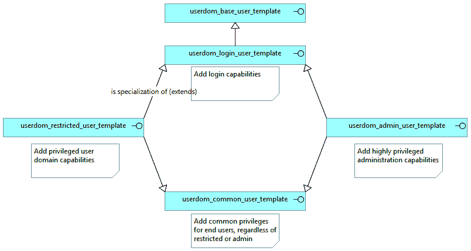

# *第十五章*：使用参考策略

到目前为止，我们已经介绍了如何与 SELinux 子系统进行交互，并逐步调整 SELinux 策略以满足我们的需求。当我们添加更多的应用程序和用户时，我们会发现开发自定义的 SELinux 策略可能有助于更好地调整系统。开发 SELinux 策略有两种主要方法，其中使用参考策略样式开发是其中之一。另一个方法在*第十六章*中讨论，*SELinux 通用中间语言*。

为了正确地开发 SELinux 策略，我们将学习如何使用和理解参考策略提供的宏，并应用项目所要求的主要编码和开发风格模式，以确保 SELinux 策略模块之间的一致性。然后，我们将其应用于两种主要类型的模块：应用程序策略和用户策略。

本章我们将涵盖以下主要内容：

+   介绍参考策略

+   使用和理解策略宏

+   创建应用程序级别的策略

+   获取支持工具的帮助

# 技术要求

本章的代码文件可以在我们的 Git 仓库中找到：[`github.com/PacktPublishing/SELinux-System-Administration-Third-Edition`](https://github.com/PacktPublishing/SELinux-System-Administration-Third-Edition)。

查看以下视频，了解代码的实际应用：[`bit.ly/3jcBDvI`](https://bit.ly/3jcBDvI)

# 介绍参考策略

通过[`github.com/SELinuxProject/refpolicy`](https://github.com/SELinuxProject/refpolicy)提供的参考策略是大多数（如果不是全部）Linux 发行版的源 SELinux 策略。虽然纯粹的参考策略可能无法直接在任何 Linux 发行版上使用（因为许多 Linux 发行版会对策略进行自定义或调整，以适应安装的应用程序和支持工具），但参考策略使用的开发方法、结构和方式适用于所有主要的发行版策略。

我们建议查看你所在发行版的 SELinux 策略，以查看并轻松修改系统的 SELinux 策略。在本章中，我们将使用参考策略的一个版本：

```
$ git clone https://github.com/SELinuxProject/refpolicy.git
```

Linux 发行版的 SELinux 策略库应由发行版本身进行文档化。以下列出了几个示例库：

+   对于 CentOS，可以在[`github.com/fedora-selinux/selinux-policy`](https://github.com/fedora-selinux/selinux-policy)找到策略库。

+   对于 Gentoo Linux，可以在[`gitweb.gentoo.org/proj/hardened-refpolicy.git/`](https://gitweb.gentoo.org/proj/hardened-refpolicy.git/)找到策略库。

+   对于 Debian，可以在[`salsa.debian.org/cgzones/selinux-policy-debian`](https://salsa.debian.org/cgzones/selinux-policy-debian)找到策略库。

+   对于 Arch Linux，策略库可以在 [`github.com/archlinuxhardened/selinux-policy-arch/`](https://github.com/archlinuxhardened/selinux-policy-arch/) 找到。

如果 Linux 发行版没有公开可访问的 SELinux 策略库，我们通常仍然可以通过软件包本身获得它，如 *第十二章* 中所使用的，*与 SELinux 策略一起工作*。

虽然我们并不打算进行完整的策略重建，但我们可以轻松地将必要的策略文件复制到自己的开发环境中，并根据需要调整或扩展策略。

## 导航策略

在其基础目录中，参考策略托管所有用于构建策略的公共文件，说明如何安装这些策略等。策略本身位于 `policy` 文件夹中，该文件夹包含三个目录：

+   `flask` 包含用于启动 SELinux 的初始定义，如列出支持的类、创建初始安全标识符等。我们将不再进一步讨论这个位置。

+   `modules` 包含 SELinux 策略代码，是所有策略规则的主要位置。

+   `support` 包含在策略中重用的宏和定义，这些宏和定义不与单个策略模块相关联。

如果我们进一步进入 `modules` 目录，就会得到表示模块或策略类型的目录。此表示本身只是为了在开发的数百个模块中有一些结构：

+   `admin` 包含与系统管理相关的策略模块。

+   `apps` 包含一般应用程序的策略模块。

+   `kernel` 包含核心系统策略模块（不仅仅是与内核相关的模块）。

+   `roles` 包含 SELinux 角色定义和默认用户域策略模块。

+   `services` 包含一般服务策略模块（也是最多的策略模块集合）。

+   `system` 包含常见的系统相关策略模块。

策略放置在哪个文件夹中的解释留给参考策略项目本身，如果不明显，会在其邮件列表中讨论。由于策略文件需要有唯一的名称，我们可以轻松找到合适的位置。例如，要查看 `ipsec` 策略模块存储的位置：

```
$ ls policy/modules/*/ipsec.te
policy/modules/system/ipsec.te
```

在浏览时，你会注意到策略模块总是由三个文件组成，我们接下来会描述这些文件。

## 结构化策略模块

如果我们分析一个 SELinux 策略模块的代码，例如 `services` 文件夹中的 `dhcp` 模块，我们会注意到它与三个文件相关联：

+   `dhcp.te` 包含类型强制规则，是大多数更改的主要关注区域。

+   `dhcp.fc` 包含文件上下文定义，告知策略哪些文件或资源需要标记为与 `dhcp` 相关的 SELinux 类型。

+   `dhcp.if` 包含接口定义，它是可以在 `dhcp` SELinux 策略代码及其他地方重复使用的函数或宏。

让我们快速了解一下这些文件的结构。

### 理解类型强制文件

类型强制文件，例子中是 `dhcp.te`，具有以下结构：

```
policy_module(dhcp, 1.18.2)
## Declarations
# SELinux booleans
# SELinux types
## Local policy
# Internal SELinux rules
# Core interfaced SELinux rules
# SELinux boolean controlled SELinux rules
# Non-blocking interfaced SELinux rules
```

让我们通过一个示例来逐一看看这些内容。

#### 声明 SELinux 对象

策略中的`声明`部分告诉我们在该模块内定义了哪些 SELinux 类型，或者其他 SELinux 对象，如 SELinux 布尔值和 SELinux 角色。

以下声明在 SELinux 策略中是常见的：

+   `dhcp` SELinux 策略中的第一个声明声明了该模块的 SELinux 布尔值。最好将布尔值以 SELinux 策略模块名称开头，尽管在此情况下，选择明确使用 `dhcpd` 而不是 `dhcp`，以便管理员可以明显知道这是关于 DHCP 守护进程，而不是可能的客户端或其他用例：

    ```
    ## <desc>
    ##   <p>Determine whether DHCP daemon can use LDAP
    ##   backends</p>
    ## </desc>
    gen_tunable(dhcpd_use_ldap, false)
    ```

    SELinux 布尔值伴随着一个特定结构的注释。在参考策略中，使用双哈希前缀（`##`）的注释将被构建代码解析，并用于更新 SELinux 策略外的信息。在这种情况下，会创建 SELinux 布尔值的描述，稍后通过如 `semanage boolean` 等命令显示出来。

    一旦加载了定义 SELinux 策略的模块，其他模块也可以使用这个布尔值。

+   一些域可能还会声明角色属性，这可以轻松管理哪些角色可以使用该域：

    ```
    attribute_role dhcpd_roles;
    ```

+   `dhcp` SELinux 策略中的其余声明声明了该策略拥有的 SELinux 类型：

    ```
    type dhcpd_t;      # The SELinux domain for the daemon
    type dhcpd_exec_t; # The executable label for the daemon
    init_daemon_domain(dhcpd_t, dhcpd_exec_t)
                       # Linking the executable to the domain
    ```

    参考策略中的 SELinux 策略模块仅声明它们拥有的类型和其他对象，而不包括它们使用的对象。由其他模块定义但使用的对象应该始终被隐藏，并通过接口调用进行交互。

虽然其他定义也可以添加到此部分，但这些是最常见的。接下来是本地策略规则。

#### 添加域的本地规则

类型强制内的本地策略定义了由 SELinux 策略模块拥有的域的允许行为。对于 `dhcp` SELinux 策略模块，这只关注 `dhcpd_t` SELinux 域。其他 SELinux 策略模块，尤其是如果它们提供更细粒度的策略结构，会对多个 SELinux 域或甚至 SELinux 用户角色进行定义。

让我们来看一看我们正在查看的 `dhcp.te` 示例中的 SELinux 策略规则：

+   策略从 SELinux 内部规则开始，这些规则是 SELinux 策略模块本身拥有的 SELinux 类型之间的交互：

    ```
    allow dhcpcd_t self:process { getcap signal_perms };
    manage_files_pattern(dhcpd_t, dhcpd_tmp_t, dhcpd_tmp_t)
    ```

    最简单的规则是标准的`allow`规则，类似于 `audit2allow` 推荐的规则。这些 `allow` 规则可以引用支持宏（例如 `signal_perms`），我们将在 *使用和理解策略宏* 部分进行讨论。第二行，调用 `manage_files_pattern`，也是一个支持宏。

+   第二组本地策略定义是核心接口化 SELinux 规则：

    ```
    kernel_read_system_state(dhcpd_t)
    ```

    这些调用使用由另一个 SELinux 策略模块在其接口文件中定义的代码。在`kernel_read_system_state`接口的情况下，这将授予`dhcpd_t` SELinux 域读取`proc_t`标记资源的权限。由于`proc_t`未由`dhcp` SELinux 策略模块定义，因此必须使用接口调用。

    核心接口化 SELinux 规则是始终应当对系统可用的规则。与可以禁用或卸载的应用程序相关 SELinux 策略模块不同，这些核心规则与类型定义相关，无法从系统中删除或随意禁用。

+   第三组本地策略定义是由 SELinux 布尔值控制的调用：

    ```
    tunable_policy(`dhcpd_use_ldap', `
      # If boolean is true
      sysnet_use_ldap(dhcpd_t)
    ', `
      # If boolean is false
    ')
    ```

    在这里，SELinux 接口调用（也可以是标准规则，如`allow`规则）被一个`tunable_policy()`调用包围，该调用标识将影响 SELinux 策略规则的 SELinux 布尔值（在我们的例子中是`dhcpd_use_ldap`）。大多数策略模块只会有一个块（用于激活的规则，如果 SELinux 布尔值为 true），但也可以有两个块，其中第二个块定义了如果 SELinux 布尔值为 false 时的规则。

+   最终的本地策略定义集是非阻塞的接口化 SELinux 规则：

    ```
    optional_policy(`
      bind_read_dnssec_keys(dhcpd_t)
    ')
    ```

    这些是使用其他 SELinux 策略模块提供的定义的调用，但这些 SELinux 策略模块可能并未在系统中加载。

    在我们的示例中，`bind_read_dnssec_keys()`调用允许`dhcpd_t` SELinux 域读取`dnssec_t`标记的资源，这是由 bind SELinux 策略模块定义的。然而，BIND 可能未安装在系统上，因此 Linux 发行版可能没有加载其策略。因此，这个调用是可选的，只有在 bind SELinux 策略模块加载时才会激活。

类型强制文件是最常变化的文件。接下来我们讨论的文件上下文定义文件紧随其后。

### 声明文件上下文

文件上下文定义文件，带有`.fc`后缀，告诉 SELinux 子系统哪些 SELinux 类型必须与系统上的文件资源关联。此信息由`restorecon`等工具使用，以适当重置上下文。

文件中的规则通常按规则适用的目录进行分组。每条规则的结构如下：

```
<path expression>    [<type/class>]    <context>
```

让我们看看这些条目意味着什么：

+   *路径表达式*与我们在*第四章*中看到的一样，*使用文件上下文和进程域*。请记住，像点号（`.`）这样的字符有特定含义（在此情况下，它表示任何可能的字符），因此真正需要在路径中使用点号时，必须对点号进行转义。

+   *类型/类别* 是一个可选的设置。如果省略，则意味着使用任何可能的类别。最常见的值有常规文件（`--`）、目录（`-d`）、套接字（`-s`）和符号链接（`-l`）。

+   *上下文* 是对该资源目标 SELinux 类型的引用。在参考策略中，这些上下文引用总是需要被 `gen_context()` 宏包裹，这样会根据策略中内置的 MLS 或 MCS 支持来添加或移除敏感度。

让我们来看一个来自 `dhcp` SELinux 策略模块的简单示例：

```
/var/named/data(/.*)?  gen_context(system_u:object_r:named_cache_t,s0)
```

在这个例子中，`/var/named/data` 目录及其下的所有资源，将被标记为 `named_cache_t` SELinux 类型。

与 SELinux 策略模块相关的最后一个文件是接口定义文件。

### 通过接口暴露 SELinux 规则

SELinux 策略模块中的接口旨在支持在不同模块之间更灵活、模块化的 SELinux 策略开发。每当一个域或 SELinux 角色需要与在另一个 SELinux 策略模块中定义的资源进行交互时，该模块应该为该交互创建一个正确命名的接口。

接口应该附带最少量的文档，尽管这些文档仅在构建整个策略文档时使用。当构建完成时，生成的文档会在系统上提供，例如在 `/usr/share/doc/selinux-policy/html`。

让我们来看一下 `dhcpd_domtrans()` 接口的定义：

```
########################################
## <summary>
##	Execute a domain transition to run dhcpd.
## </summary>
## <param name="domain">
##	<summary>
##	Domain allowed to transition.
##	</summary>
## </param>
#
interface(`dhcpd_domtrans',`
  gen_require(`
    type dhcpd_t, dhcpd_exec_t;
  ')
  corecmd_search_bin($1)
  domtrans_pattern($1, dhcpd_exec_t, dhcpd_t)
')
```

按照最佳实践，接口名称以 SELinux 策略名称开头，后面跟着允许的操作。有时，这个操作会加上目标资源的后缀。接口本身可以通过 `$1`（第一个参数）、`$2`（第二个参数）等引用传递给接口的参数。所以像 `dhcpd_domtrans(init_t)` 这样的调用会调用接口，其中 `$1` 会被替换为 `init_t`。

让我们看看几个常见操作的示例：

+   `dhcpd_domtrans()`。如果有多个域，则目标资源将定义允许哪个域（如 `bind_domtrans_ndc()`）进行到 `ndc_t` SELinux 域的域转换。

+   `dhcpd_setattr_state_files()` 允许域设置 `dhcpd_state_t` 标签资源的属性，而 `bind_signal()` 允许域向 `named_t` 标签进程发送信号。大多数接口定义将涉及权限交互。

+   `dhcpd_admin()` 角色将允许管理与 `dhcpd` 相关的资源，启动和停止 `dhcpd` 服务等。

    ```
    optional_policy(`
      dhcpd_admin(webadm_r, webadm_t)
    ')
    ```

在开发 SELinux 策略时，建议查看 SELinux 策略模块的接口定义，了解哪些接口存在以及它们提供了什么。策略开发人员通常会将常见的权限放入这些接口中，因此可用的接口可以很好地显示你可能需要的 SELinux 策略模块内容。

接口定义也可以在系统的 `/usr/share/selinux/devel/include` 位置找到，这样即使不检查主源代码库，你也可以创建和修改 SELinux 策略模块。每当我们构建参考策略风格的模块时，都会使用如下命令：

```
$ make -f /usr/share/selinux/devel/Makefile <name>.pp
```

这将导致构建过程查找 `/usr/share/selinux/devel/include` 位置中的接口，同时也会在当前工作目录中查找。

# 使用和理解策略宏

在各种 SELinux 策略定义中，我们遇到了一些不与特定 SELinux 策略模块绑定的宏。这些是支持宏，位于 `policy/support/*.spt` 文件中。

最常见的宏是在 `obj_perm_sets.spt` 文件中声明的（该文件将同一类别的常见权限组合为一个定义），以及 `*_patterns.spt` 文件（将跨不同类别的权限组合为一个定义）。

## 利用单一类别权限组

`execute` 权限。你还需要 `open` 和 `read` 权限（否则域无法读取可执行文件），以及 `map` 权限（以允许将文件映射到内存中）。

如果你将所有这些权限放入你自己的 SELinux 策略模块中，那么规则可能会是这样：

```
allow dhcpd_t dhcpd_exec_t:file { getattr open map read execute ioctl execute_no_trans };
```

如果以后 SELinux 策略扩展了一个与执行资源相关的新权限，那么你将需要在不同的 SELinux 策略模块中查找并更新这些权限。

因此，参考策略将所有这些权限放入名为 `exec_file_perms` 的宏中，其定义如下：

```
define(`exec_file_perms',`{ getattr open map read execute ioctl execute_no_trans }')
```

定义了这个宏后，我们的策略行可以简化如下：

```
allow dhcpd_t dhcpd_exec_t:file { exec_file_perms };
```

如果在某个时刻需要扩展权限，只需扩展宏定义本身，SELinux 策略模块可以保持不变。

## 调用权限组

虽然单一类别的权限组适用于简化策略开发，但涵盖多个类别的**权限组**更加常见。

例如，如果某个域需要对 `/var/lib/dhcpd` 中的资源具有完整的管理权限（意味着 `read`、`write`，以及创建和删除资源），那么不仅这些权限在该目录中的文件上是必要的（这些文件被标记为 `dhcpd_state_t` SELinux 类型），你还需要对该目录本身的读/写权限。

这样的权限定义可能会是这样：

```
allow $1 dhcpd_state_t:dir { rw_dir_perms };
allow $1 dhcpd_state_t:file { manage_file_perms };
```

与其将这些声明为单独的调用，不如将它们组合到一个调用中：

```
manage_files_pattern($1, dhcpd_state_t, dhcpd_state_t)
```

SELinux 策略开发者最好熟悉各种可用的宏，以便快速高效地进行 SELinux 策略开发。

# 创建应用级别策略

应用级别的策略为应用程序或服务提供隔离。有多种不同类型的应用级别策略：

+   终端用户应用程序策略，主要关注访问终端用户数据，并且通常会调用各种`userdom_*`接口（这些接口通过`system/userdomain.if`文件提供）。这些应用程序大多位于`apps/`目录下。

+   管理应用程序，尽管仍面向用户，但更可能启用与系统服务和资源的交互。

+   服务，通常是守护进程化的应用程序，通常主要与自己的资源交互，并且结构较为简单。

当我们在*第十四章*《处理新应用程序》中介绍`sepolicy generate`命令时，我们可以选择这些类型（以及更多）来为这些应用程序生成一个简单的骨架。

让我们看看一些示例策略，并识别在开发自己策略时可能需要的有用调用。

## 构建面向网络的服务策略

面向网络的服务（即可以从系统外部进行交互的服务）是需要被限制的第一批服务。因此，为面向网络的服务构建 SELinux 策略模块应该是任何需要确保尚未有有效策略的应用程序被限制的 Linux 管理员的主要关注点。

如果我们查看 OpenVPN 服务，发现`services/openvpn.te`下有一个 SELinux 策略，我们可以查看。

### 确定服务与哪些资源进行交互

由于策略始于识别类型和其他 SELinux 对象，我们需要考虑系统中服务交互的资源。在比较服务策略时，你会发现这些定义通常非常相似：

+   首先声明主域类型及其入口可执行文件。根据服务类型，它包含了如何启动该服务的调用：作为系统服务（使用`init_daemon_domain()`）或通过 D-Bus 系统总线（使用`dbus_system_domain()`）。

+   服务的配置文件（例如`openvpn_etc_t`），这些文件也可以区分只读文件和可读写文件（例如`openvpn_etc_rw_t`）。

+   运行时文件（通常存储在`/var/run`中），例如`openvpn_runtime_t`。

+   临时文件（通常存储在`/tmp`或`/var/tmp`中），例如`openvpn_tmp_t`。

+   日志文件（通常存储在`/var/log`中），例如`openvpn_var_log_t`。

每个类型声明后面跟着一个调用，它会正确地标记该类型。例如，`logging_log_file()`调用会将类型与日志文件 SELinux 属性关联。这使得一般的日志文件管理域能够通过此属性处理新创建的资源。

### 处理内部 SELinux 规则

在声明了资源后，我们必须在 SELinux 策略中定义内部的 SELinux 规则。这些规则告诉 SELinux 域可以如何处理其自己的资源，以及当资源被交互时，SELinux 应如何行为。

我们通常会声明两组内部规则。一组是域本身的细粒度权限，例如是否允许该域拥有任何能力、创建套接字等。这些规则的开发是基于试错的：从几乎没有权限开始，查看哪些 AVC 拒绝出现，扩展策略，然后重复。

另一组内部规则侧重于与之前声明的类型的交互。这不仅包括域拥有的权限（例如通过`manage_files_pattern()`调用），还包括是否必须发生过渡。

设置正确的过渡集是开发应用策略时需要采取的更重要的第一步之一，因为`audit2allow`和 AVC 拒绝通常没有考虑到目标资源被分配了错误类型这一事实。因此，当我们有一个在`/tmp`中创建文件的服务时（该目录被标记为`tmp_t`），我们真的希望目标文件被正确标记（如`openvpn_tmp_t`），而不是继承目录的`tmp_t`标签：

```
allow openvpn_t openvpn_tmp_t:file manage_file_perms;
files_tmp_filetrans(openvpn_t, openvpn_tmp_t, file)
```

文件过渡应为所有涉及的资源声明。如果文件和目录都需要发生过渡，可以在一次调用中混合类，如下所示：

```
files_tmp_filetrans(openvpn_t, openvpn_tmp_t, { file dir })
```

我们还可以告诉 SELinux，仅在使用特定文件名时才应该发生过渡：

```
logging_log_filetrans(openvpn_t, openvpn_status_t, file, "openvpn-status.log")
```

强烈建议在扩展域的实际权限之前，首先考虑文件过渡（和其他资源过渡），以确保我们不会因为不必要的原因而允许域的权限应用到一般类型。

### 添加网络相关的权限

在开发和扩展策略时，将添加几个核心功能，如`kernel_*`调用，允许进程与`proc_t`资源、系统控制设置等进行交互。像`audit2allow`这样的工具可以合理地推断出正确的接口进行调用，尽管检查接口以确保不会分配过多权限也是有益的。

另一方面，网络相关的权限可能需要更多关注。正如我们在*第五章*中看到的，*控制网络通信*，SELinux 可以根据系统配置动态处理某些网络流量。

如果系统没有特别的控制措施，例如标签化的网络或 SECMARK，则很可能会发现三个接口调用可以让应用程序按预期工作：

```
corenet_tcp_bind_generic_node(openvpn_t)
corenet_tcp_bind_openvpn_port(openvpn_t)
corenet_tcp_connect_http_port(openvpn_t)
```

这三种接口调用允许域面向网络（`corenet_tcp_bind_generic_node`）、监听 OpenVPN 端口（`corenet_tcp_bind_openvpn_port`），以及作为客户端连接到 HTTP 端口（`corenet_tcp_connect_http_port`）。

但也存在其他你可能需要添加的调用，尽管它们目前未被检测到。当系统进一步调优时，它们可能变得必要，比如添加对标记网络或引入 SECMARK 过滤的支持。

第一组是允许在通用节点（主机）和接口上发送和接收数据包：

```
corenet_tcp_sendrecv_generic_node(openvpn_t)
corenet_tcp_sendrecv_generic_if(openvpn_t)
```

对于 NetLabel 支持，你可能需要添加支持接收标记网络数据包：

```
corenet_all_recvfrom_netlabel(openvpn_t)
```

对于 SECMARK 支持，你需要添加对发送和接收 SECMARK 标记数据包的支持：

```
corenet_sendrecv_openvpn_server_packets(openvpn_t)
corenet_sendrecv_http_client_packets(openvpn_t)
```

这些调用在早期测试中可能不会出现，但以后可能会需要，因此建议从一开始就考虑标记网络和 SECMARK 对你策略的影响。

### 构建服务接口方法

我们接下来将重点关注接口方法。这些方法用于促进其他 SELinux 策略模块与我们正在开发的域进行交互，尽管它们也可以用于简化你自己策略的开发。

以下是三个最常见的接口定义，其他策略开发者会假设它们已存在：

+   一个`openvpn_domtrans`，允许给定的 SELinux 域执行适当的二进制文件或脚本，并使得执行的命令或应用程序在我们的域中运行（因此从源域过渡到我们的域）。

+   一个`openvpn_run`，它类似于域过渡接口（实际上会调用它），但也允许我们的域使用角色。没有这个接口，某些角色可能无法进行过渡，即使它们调用了域过渡接口。

+   一个`openvpn_admin`，将分配给用户角色/域，允许他们管理我们的服务。这将允许用户与我们域的进程进行交互（包括杀死进程、追踪其操作等），以及管理使用的文件和资源。

在接口中，我们需要声明将显式引用的 SELinux 对象。这允许 SELinux 子系统验证代码是否适用：如果这些对象在当前策略中不存在，那么该接口无效，将不会使用。声明对象是通过`gen_require()`宏完成的：

```
interface(`openvpn_run',`
  gen_require(`
    attribute_role openvpn_roles;
  ')
  openvpn_domtrans($1)
  roleattribute $2 openvpn_roles;
')
```

根据需要可以添加其他接口。虽然你可以提前添加接口以防万一，但请注意，一旦定义了接口，它可能会被其他策略使用，如果你不是自己开发所有策略，可能无法意识到这一点。如果你之后想要更改接口的行为或删除它们，可能会破坏其他策略。

## 处理用户应用程序

如果我们开发最终用户应用程序，它们的结构将与面向服务的应用程序非常相似。然而，在内容方面，有一些注意事项需要考虑。我们以`apps/thunderbird.te`策略为例：

+   我们首先注意到，许多资源定义接口的前缀是`userdom_`。例如，临时文件不是`files_tmp_file()`，而是`userdom_user_tmp_file()`。这样可以确保这些资源被识别为**用户管理**的临时文件，而不是普通的系统临时文件。

+   另一个重要的补充是对`~/.cache`的支持，应用程序缓存数据存储在此，而配置数据则存储在`~/.config`中。

    ```
    xdg_manage_downloads(thunderbird_t)
    ```

+   为了方便地建立用户内容访问，用户应用程序还应该调用`userdom_user_content_access_template()`模板。这个模板会自动创建布尔值，管理员可以切换这些布尔值。例如，对于 Thunderbird SELinux 策略，它会创建`thunderbird_manage_generic_user_content`。如果设置了此项，则 Thunderbird 不仅可以访问与下载相关的资源，还可以访问所有用户资源。

+   如果用户应用程序是图形化的，还需要另一个模板，即`xserver_user_x_domain_template()`。这个模板会为应用程序生成与 X 服务器相关的 SELinux 对象，并允许应用程序在服务器上使用图形环境。

    重要提示

    参考策略区分了常规接口和模板。接口授予传递给它的域和角色特权。而模板则会生成新的对象，如 SELinux 布尔值、类型、属性等。从代码角度看，模板不能成为布尔触发语句的一部分（因为它们不仅仅添加类型强制规则）。

当起草一个用户应用程序策略的基线时，包括上述模板，然后通过反复试验来扩展策略应该是足够的。不过，请确保您正在测试应用程序的用户位置上的所有资源都已正确标记，否则拒绝访问可能会误导您赋予该域更多的权限。

# 添加用户级别策略

如果我们要创建自定义的用户和角色策略，那么最令人困惑的选择是选择哪个用户模板。这个模板会创建一个具有特定目的的角色和用户域，并默认授予一些权限：



图 15.1 – 用户域模板之间的关系

用于用户/角色策略的最常见模板如下：

+   `userdom_restricted_user_template()`用于（默认）没有特权的最终用户角色。

+   `userdom_admin_user_template()`用于（默认）具有高度特权的最终用户角色。

其他模板也可以使用，特别是当需要对角色和用户域进行更细粒度的控制时。然而，请注意，模板所分配的权限被称为*默认*权限。如果我们要为管理特定服务创建角色和用户域，则不应使用`userdom_admin_user_template()`，因为它将授予比所需更多的权限。

作为示例，考虑`roles/dbadm.te`数据库管理角色的 SELinux 策略。该角色基于`userdom_base_user_template()`接口，以确保仅授予最小权限。该角色并不打算直接使用（登录），而是要通过（例如，通过`newrole`命令或通过策略中的明确定义的角色过渡）进行过渡。

# 获取支持工具的帮助

市面上有一些工具可以帮助开发 SELinux 策略，如果需要，我们也可以构建自己的支持工具。让我们来看看可以使用哪些支持环境。

## 使用 selint 验证代码

尽管 SELinux 策略在功能上可以正常工作，但验证代码本身是否正确，并遵循最佳实践，确保代码在长期内可维护，是非常重要的。

支持验证 SELinux 策略代码的工具之一是`selint`，它可以从[`github.com/TresysTechnology/selint`](https://github.com/TresysTechnology/selint)获取。一旦构建并安装，`selint`可以提供四个主要领域的洞察：

+   约定检查验证 SELinux 策略是否遵循参考策略的约定，确定代码应该如何结构化和文档化。

+   样式检查会给出可能错误的代码风格提示，以及开发者可能想要不同行为的地方。

+   当代码中有可能触发运行时问题或安全问题的错误调用时，会触发警告。

+   错误捕获构造缺陷，这些缺陷可能会导致编译问题或运行时问题。

这使得可以在自动化构建过程中使用`selint`，并有助于政策的开发。

调用`selint`很简单：

```
$ selint minecraft.te
minecraft.te:  31: (C): Permissions in av rule not ordered
                        (signull before execmem) (C-005)
minecraft.te: 118: (C): Require block used in te file (use an 
                        interface call instead) (S-001)
```

在这种情况下，检测到两个约定上的不当行为。一个是权限的顺序问题，另一个是在某个域中显式提到的`require`块，该域不属于该策略模块。

## 本地查询接口和宏

为了帮助快速找到正确的接口或宏，我们还希望能够快速显示接口和宏信息。通过一些 Shell 脚本，我们可以创建一些帮助我们的函数。

这些函数作为代码与本书一起提供。你可能需要更改脚本开头中`POLICY_LOCATION`变量指向的路径。默认情况下，它指向系统安装的接口和宏，但你也可以将其指向存储库中的检出路径：

```
POLICY_LOCATION="/usr/share/selinux/devel"
```

引入文件以访问辅助函数：

```
$ source ./localfuncs
```

你可以使用的辅助函数如下：

+   使用 `sefindif` 可以搜索具有特定 SELinux 规则的 SELinux 接口。您可以使用正则表达式找到合适的接口。

    ```
    $ sefindif "manage.* cert_t"
    interface(`miscfiles_manage_all_certs',`
      manage_files_pattern($1, cert_type, cert_type)
      manage_lnk_files_pattern($1, cert_type, cert_type)
    interface(`miscfiles_manage_generic_cert_dirs',`
      manage_dirs_pattern($1, cert_t, cert_t)
    interface(`miscfiles_manage_generic_cert_files',`
      manage_files_pattern($1, cert_t, cert_t)
      manage_lnk_files_pattern($1, cert_t, cert_t)
    ```

+   使用 `seshowif` 可以显示接口的整体内容（不包括注释）。

    ```
    $ seshowif miscfiles_manage_all_certs
    interface(`miscfiles_manage_all_certs',`
      gen_require(`
        attribute cert_type;
      ')
      allow $1 cert_type:dir list_dir_perms;
      manage_files_pattern($1, cert_type, cert_type)
      manage_lnk_files_pattern($1, cert_type, cert_type)
    ')
    ```

+   使用 `sefinddef` 和 `seshowdef`，也可以为支持的宏做同样的事情。

    ```
    $ seshowdef admin_pattern
    define(`admin_pattern',`
      manage_dirs_pattern($1,$2,$2)
      manage_files_pattern($1,$2,$2)
      manage_lnk_files_pattern($1,$2,$2)
      manage_fifo_files_pattern($1,$2,$2)
      manage_sock_files_pattern($1,$2,$2)
      relabel_dirs_pattern($1,$2,$2)
      relabel_files_pattern($1,$2,$2)
      relabel_lnk_files_pattern($1,$2,$2)
      relabel_fifo_files_pattern($1,$2,$2)
      relabel_sock_files_pattern($1,$2,$2)
    ')
    ```

尽管这些功能不像全功能策略编辑套件那样多才多艺，但它们可以帮助快速找到正确的接口或宏。

# 摘要

参考策略是 SELinux 策略开发中最常见的来源，经过多年的开发和维护，它已经发展成一个完整的策略集，拥有活跃的开发社区和各种工具的积极支持（包括 `audit2allow`，以及 `selint` 应用程序）。

我们已经学习了通常如何组织策略，并且如何开始为最常见的用例构建 SELinux 策略模块：应用服务、终端用户应用程序和用户角色。为了帮助我们开发这些策略，我们已经看到 `selint` 可以进行代码风格分析，而一些 shell 脚本可以帮助我们解析接口文件以获取快速帮助。

在我们的最后一章中，我们将研究 CIL 风格的 SELinux 开发。

# 问题

1.  为什么 Linux 发行版没有原生支持参考策略？

1.  一个 SELinux 模块所需的三个主要策略文件是什么，它们各自的作用是什么？

1.  为什么像 `exec_file_perms` 这样的权限集合比明确列出权限更受青睐？

1.  接口和模板有什么区别？

1.  为什么 `dbadm.te` 中定义的数据库管理角色没有使用 `userdom_admin_user_template`？
