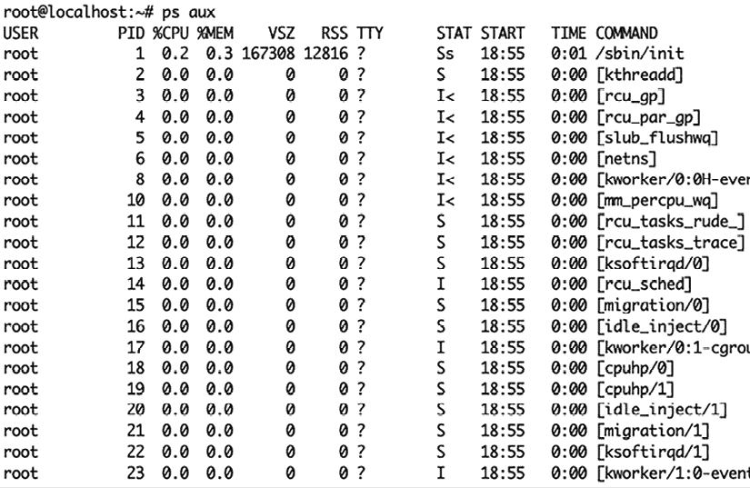
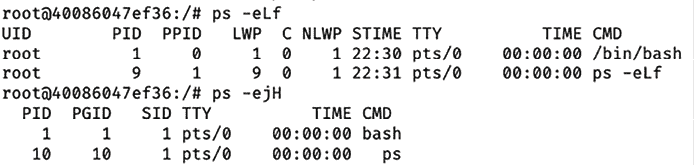
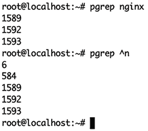
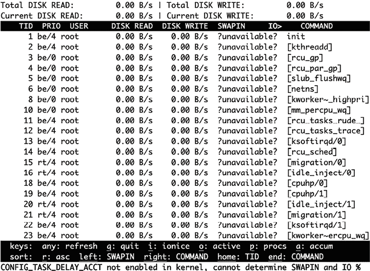
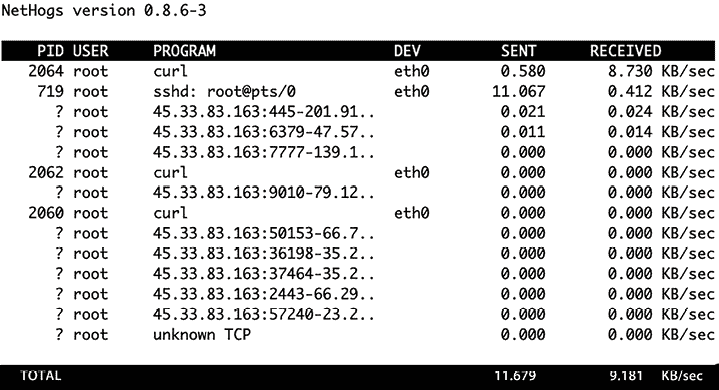
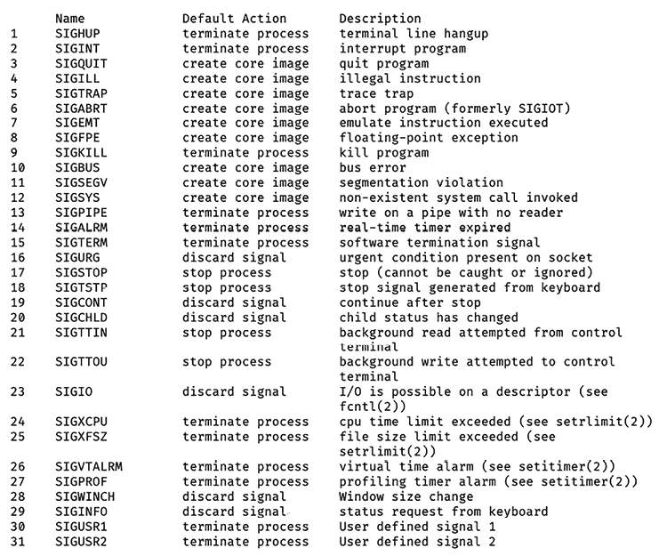
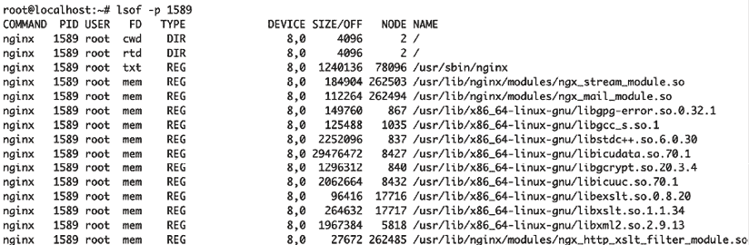
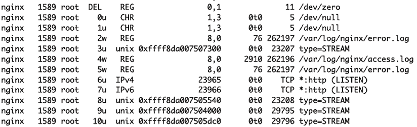
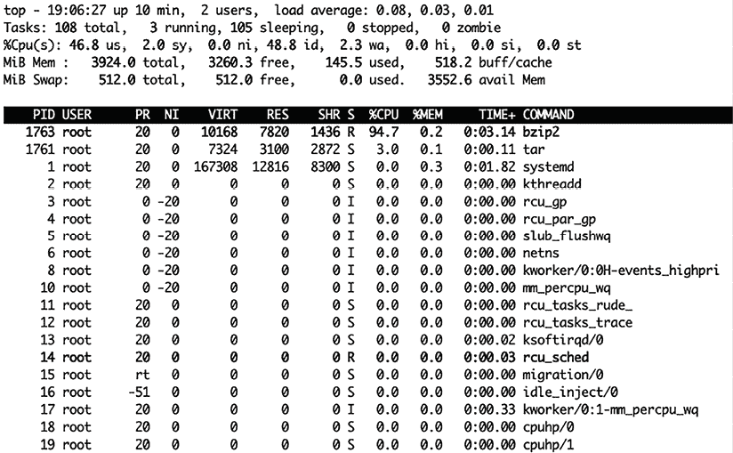

# 与进程打交道

作为开发者，你已经直观地熟悉了进程。它们是你劳动的成果：在编写和调试代码之后，你的程序最终执行，转变成一个美丽的操作系统进程！

在 Linux 中，进程可以是一个长时间运行的应用程序，也可以是像 `ls` 这样的快速 shell 命令，或者是内核用来在系统上执行某些工作的任何任务。如果在 Linux 中有任务在进行，那就是进程在执行它。你的网页浏览器、文本编辑器、漏洞扫描器，甚至像读取文件和你目前学到的命令等操作，都会启动一个进程。

理解 Linux 的进程模型非常重要，因为它所提供的抽象——Linux 进程——是你管理进程时所有命令和工具所依赖的基础。你不再看到从开发者角度出发的细节：变量、函数和线程都被封装为“一个进程”。你现在面对的是一组不同的、外部的控制按钮和监控仪表：进程 ID、状态、资源使用情况以及我们将在本章中涵盖的所有其他进程属性。

首先，我们将深入了解进程抽象本身，然后我们将深入探讨你可以用 Linux 进程做的一些有用的、实用的事情。在讨论实际操作时，我们会暂停并详细讲解一些常见问题的来源，例如权限问题，并为你提供一些排查进程问题的启发式方法。

在本章中，你将学习以下主题：

+   什么是 Linux 进程，以及如何查看当前系统上运行的进程

+   进程具有的属性，了解在排查问题时可以收集哪些信息

+   查看和查找进程的常用命令

+   更高级的话题，实际上对于编写作为 Linux 进程执行的程序的开发者非常有用：信号与进程间通信、`/proc` 虚拟文件系统、使用 `lsof` 命令查看打开的文件句柄，以及在 Linux 中进程是如何创建的。

你还将通过一个实际的故障排查示例回顾你在本章中学到的所有内容，使用我们讨论的理论和命令。现在，让我们深入了解 Linux 进程究竟是什么。

# 进程基础知识

当我们提到 Linux 中的“进程”时，我们指的是操作系统内部对正在运行的程序是什么的抽象模型。Linux 需要一个适用于 *所有* 程序的通用抽象，它可以封装操作系统关心的内容。进程就是这种抽象，它使操作系统能够跟踪正在执行的程序的一些重要上下文信息；即：

+   内存使用

+   使用的处理器时间

+   其他系统资源使用情况（磁盘访问、网络使用）

+   进程间通信

+   程序启动的相关进程，例如触发一个 shell 命令

你可以通过运行带有`aux`标志的`ps`程序，获取所有系统进程的列表（至少是用户允许查看的那些进程）：



图 2.1：系统进程列表

本章将重点介绍与开发人员工作最相关的进程属性。

## Linux 进程由什么组成？

从操作系统的角度来看，“进程”只是一个数据结构，使得访问类似以下信息变得简单：

+   **进程 ID**（**PID**，如上`ps`输出所示）。PID 1 是 init 系统——所有其他进程的原始父进程，负责引导系统。内核启动时，会首先执行此操作。当进程创建时，它会获得下一个可用的进程 ID，按顺序排列。由于其对操作系统正常功能至关重要，init 进程无法被终止，即使是 root 用户也无法终止。不同的 Unix 操作系统使用不同的 init 系统——例如，大多数 Linux 发行版使用`systemd`，而 macOS 使用`launchd`，许多其他 Unix 系统使用 SysV。无论具体实现如何，我们将根据其所扮演的角色称呼此进程：“init”。

    **注意**

    在容器中，进程是命名空间化的——在“真实”环境中，所有容器进程的 PID 可能是 3210，而该单一 PID 映射到多个进程（`1..n`，其中`n`是容器中运行的进程数量）。你可以从外部看到这一点，但不能在容器内部看到。

+   **父进程 PID**（**PPID**）。每个进程都是由一个父进程生成的。如果父进程在子进程存活时终止，子进程会变成“孤儿”进程。孤儿进程会被重新归属于 init（PID 1）。

+   **状态**（**STAT**，如上`ps`输出所示）。`man ps`会显示一个概述：

    +   D – 不可中断的睡眠状态（通常是 IO）

    +   I – 空闲内核线程

    +   R – 正在运行或可运行（在运行队列中）

    +   S – 可中断的睡眠状态（等待某个事件完成）

    +   T – 被作业控制信号停止

    +   t – 被调试器在跟踪过程中停止

    +   X – 死亡状态（不应该出现）

    +   Z – 僵尸进程（已终止，但其父进程未收养）

+   **优先级**状态（“友好度”——该进程是否允许其他进程优先于它？）

+   进程**所有者**（`ps`输出中的 USER 字段）；有效用户 ID。

+   有效**组 ID**（EGID），表示当前使用的组 ID。

+   进程内存空间的**地址映射**。

+   资源使用情况——进程正在使用的打开文件、网络端口以及其他资源（在`ps`输出中，**VSZ**和**RSS**表示内存使用情况）。

(引用：来自*Unix 和 Linux 系统管理手册*，*第五版*，第 91 页。)

让我们仔细看看几个对开发人员和偶尔的故障排除人员来说最重要的进程属性。

## 进程 ID（PID）

每个进程都有一个唯一的进程 ID（PID），这是在进程启动时分配给它的唯一整数。就像关系型数据库中的 ID 唯一标识每一行数据一样，Linux 操作系统通过 PID 来跟踪每个进程。

PID 是你与进程交互时最有用的标签。

## 有效用户 ID（EUID）和有效组 ID（EGID）

这些决定了你的进程是以哪个系统用户和组身份运行的。用户和组权限共同决定了一个进程在系统上可以执行什么操作。

正如你在 *第五章*《文件介绍》中将看到的那样，文件有用户和组所有权，这决定了哪些权限适用于它们。如果文件的所有权和权限本质上是一个锁，那么具有正确用户/组权限的进程就像一把钥匙，打开锁并允许访问该文件。我们将在后面深入探讨权限部分时详细讨论这一点。

## 环境变量

你可能在应用程序中使用过环境变量 —— 它们是操作系统环境传递给进程的需要的数据。这通常包括配置指令（`LOG_DEBUG=1`）和密钥（`AWS_SECRET_KEY`），每种编程语言都有某种方式从程序的上下文中读取这些变量。

例如，这个 Python 脚本从 `HOME` 环境变量获取用户的主目录，然后打印出来：

```
import os
home_dir = os.environ['HOME']
print("The home directory for this user is", home_dir) 
```

在我的案例中，在 Linux 机器的 `python3` REPL 中运行这个程序，得到如下输出：

```
The home directory for this user is /home/dcohen 
```

## 工作目录

进程有一个“当前工作目录”，就像你的 shell（反正也是一个进程）一样。在 shell 中输入 `pwd` 会打印当前工作目录，每个进程也都有一个工作目录。进程的工作目录是可以变化的，所以不要过于依赖它。

这部分内容概述了你应该了解的进程属性。接下来，我们将跳出理论部分，看看一些你可以立即使用的命令，帮助你开始处理进程。

# 用于操作 Linux 进程的实用命令

这里是一些你最常使用的命令：

+   `ps` – 显示系统上的进程；你在本章前面已经看到过这个命令的示例。标志可以修改显示的进程属性列。这个命令通常与过滤器一起使用，以控制输出的内容，比如 (`ps aux | head –n 10`) 只输出前 10 行。还有一些有用的小技巧：

    +   `ps –eLf` 显示进程的线程信息

    +   `ps -ejH` 对于直观地查看父子进程之间的关系非常有用（子进程会在父进程下缩进）

    图 2.2：带有标志的 ps 命令输出示例

+   `pgrep` – 根据名称查找进程 ID。可以使用正则表达式。



图 2.3：带标志的 `pgrep` 命令输出示例

+   `top` – 一个交互式程序，用来轮询所有进程（默认每秒一次）并输出资源使用的排序列表（你可以配置按什么排序）。还显示系统的总资源使用情况。按 *Q* 或使用 *Ctrl* + *C* 退出。你将在本章稍后的部分看到这个命令的输出示例。

+   `iotop` – 类似于 `top`，但用于磁盘 IO。对于寻找 IO 消耗大的进程非常有用。并非所有系统默认安装，但可以通过大多数包管理器获取。



图 2.4：`iotop` 命令输出示例

+   `nethogs` – 类似于 `top`，但用于网络 IO。按进程分组网络使用情况，非常方便。可以通过大多数包管理器获取。

图 2.5：`nethogs` 命令输出示例

+   `kill` – 允许用户向进程发送信号，通常是停止进程或让它重新读取其配置文件。我们将在本章稍后解释信号和 `kill` 命令的使用方法。

# 高级进程概念与工具

这标志着本章“高级”部分的开始。虽然你不需要掌握本部分的所有概念就能有效地与 Linux 进程工作，但它们非常有用。如果你有一些额外的时间，我们建议至少熟悉一下每个概念。

## 信号

`systemctl` 是如何告诉你的 Web 服务器重新读取配置文件的？你如何礼貌地要求一个进程优雅地关闭？如果一个进程故障，如何立刻杀死它，因为它已经让你的生产应用瘫痪了？

在 Unix 和 Linux 中，所有这些操作都是通过信号来完成的。信号是可以在程序之间发送的数字消息。它们是进程之间和操作系统之间进行通信的一种方式，允许进程发送和接收特定的消息。

这些消息可以用来向进程传递各种信息，例如，指示某个特定事件已经发生，或某个特定的操作或响应是必需的。

### 信号的实际应用

让我们看几个信号机制所带来的实际价值的例子。信号可以用于实现进程间通信；例如，一个进程可以向另一个进程发送信号，指示它已完成某项任务，另一个进程可以开始工作了。这使得进程能够协调它们的行动，像编程语言中的执行线程一样顺畅高效地合作（但没有与之相关的内存共享）。

进程信号的另一个常见应用是处理程序错误。例如，设计一个进程来捕获 `SIGSEGV` 信号，这表明出现了段错误。当进程接收到此信号时，它可以捕获该信号并采取措施记录错误、生成核心转储以进行调试，或者在优雅地关闭之前清理正在使用的资源。

进程信号也可以用于实现优雅的关闭。例如，当系统关闭时，可以向所有进程发送信号，给它们一个机会保存状态并清理它们正在使用的资源，方法是通过“捕获”信号。

### 捕获

许多信号可以被接收它们的进程“捕获”：这本质上与编程语言中捕获并处理错误的想法相同。

如果接收信号的进程有一个信号处理函数，那么该处理函数会被执行。这就是程序在不重新启动的情况下重新读取配置，并在接收到关闭信号后完成数据库写入和关闭文件句柄的方式。

### kill 命令

然而，不仅仅是进程通过信号进行通信：那令人毛骨悚然（并且在技术上讲，名称不准确）的 `kill` 是一个允许用户向进程发送信号的程序。

`kill` 命令通过用户发送进程中最常见的用途之一是中断一个不再响应的进程。例如，如果一个进程卡在了一个无限循环中，可以发送一个`kill`信号迫使它停止。

`kill` 命令允许你通过指定进程的 PID 向进程发送信号。如果你想终止的进程的 PID 是 `2600`，你可以运行：

```
kill 2600 
```

该命令会向进程发送信号 15（`SIGTERM`，或“终止”），进程有机会捕获该信号并进行正常关闭。

**注意**

从包含的标准信号编号表中可以看到，`kill` 发送的默认信号是“终止”（信号 15），而不是“杀死”（`SIGKILL` 是 9）。`kill` 程序不仅仅用于杀死进程，还用于发送任何类型的信号。这个名字起得真让人困惑，很抱歉——这只是 Unix 和 Linux 中一些特殊之处，你会逐渐习惯的。

如果你不想发送默认的信号 15，可以用一个短横线指定你想要发送的信号；例如，要向同一进程发送 `SIGHUP` 信号，可以运行：

```
kill –1 2600 
```

运行 `man` `signal` 会列出可以发送的信号：



图 2.6：man signal 命令输出示例

熟悉其中一些信号是有好处的——有时甚至在工程面试中也能派上用场：

+   `SIGHUP` (1) – “挂断”：许多应用程序解释为“重新读取你的配置，因为我已经做了更改”（例如 nginx）。

+   `SIGINT` (2) – “中断”：通常与 `SIGTERM` 相同——“请干净地关闭”。

+   `SIGTERM`（15）– “终止”：温和地请求进程关闭。

+   `SIGUSR1`（30）和`SIGUSR2`（31）有时用于应用程序定义的消息传递。例如，SIGUSR1 会要求 nginx 重新打开它正在写入的日志文件，如果你刚刚旋转了这些文件，这会非常有用。

+   `SIGKILL`（9）– `SIGKILL` 无法被进程捕获并处理。如果将此信号发送给程序，操作系统会立即杀死该程序。任何清理代码，比如写入刷新或安全关闭，都不会执行，因此这通常是最后的手段，因为它可能导致数据损坏。

如果你想更深入地探索 Linux，可以随意浏览 `/proc` 目录。这确实超出了基础知识，但它是一个包含每个进程文件系统子树的目录，在你读取这些文件时，进程的实时信息会被查询出来。

```
/proc 
```

实际上，这些知识在故障排除时会派上用场，特别是当你已经识别出一个行为异常（或神秘）的进程，并且想知道它在实时执行什么操作时。

你可以通过浏览其`/proc`子目录并随便谷歌搜索，来了解很多关于进程的信息。

本章中展示的许多工具实际上使用`/proc`来收集进程信息，并且只显示其中的一部分内容。如果你想查看*所有*信息并自己进行筛选，`/proc` 就是你需要查看的地方。

## lsof – 显示进程打开的文件句柄

`lsof` 命令显示一个进程为读取和写入而打开的所有文件。这非常有用，因为程序只需要一个小的漏洞，就可能泄露文件句柄（它已请求访问的文件的内部引用）。这可能导致资源使用问题、文件损坏以及一长串奇怪的行为。

幸运的是，获取一个进程已打开文件的列表非常简单。只需运行 `lsof` 并传递 `–p` 标志和一个 PID（通常你需要以 root 身份运行）。这将返回该进程（在本例中是 PID 1589）打开的文件列表：

```
 ~ lsof -p 1589 
```



图 2.7：使用 `lsof -p 1589` 命令列出的 1589 进程打开的文件示例

上述是 nginx Web 服务器进程的输出。第一行显示了该进程的当前工作目录：在这个例子中是根目录（`/`）。你还可以看到它已打开自己的二进制文件（`/usr/sbin/nginx`）和 `/usr/lib/` 中的各种库文件。

在下面，你可能会注意到一些更有趣的文件路径：



图 2.8：1589 进程进一步打开的文件

该列表包括 nginx 正在写入的日志文件和它正在读取和写入的套接字文件（Unix、IPv4 和 IPv6）。在 Unix 和 Linux 中，网络套接字只是一种特殊类型的文件，这使得在各种用例中使用相同的核心工具集变得容易 – 与文件相关的工具在几乎所有事物都被表示为文件的环境中非常强大。

## 继承

除了第一个进程`init`（`PID 1`），所有进程都是由父进程创建的，父进程基本上会复制自己，然后“fork”（分叉）该副本。当一个进程被 fork 时，它通常会继承其父进程的权限、环境变量和其他属性。

虽然可以防止并改变这种默认行为，但这有一定的安全风险：你手动运行的软件将获得当前用户的权限（如果你使用`sudo`，则可能是 root 权限）。由该进程可能创建的所有子进程——例如在安装、编译等过程中——都会继承这些权限。

想象一个用 root 权限启动的 Web 服务器进程（这样它就可以绑定到网络端口），并且它的环境变量中包含云认证密钥（这样它就能从云端抓取数据）。当这个主进程派生出一个不需要 root 权限和敏感环境变量的子进程时，将这些信息传递给子进程是一个不必要的安全风险。因此，降级权限和清除环境变量是服务启动子进程时常见的模式。

从安全角度来看，牢记这一点非常重要，以防止如密码或访问敏感文件等信息泄露的情况发生。虽然本书不会详细讲解如何避免这种情况，但如果你在编写将在 Linux 系统上运行的软件时，意识到这一点是很重要的。

# 回顾——故障排除示例会话

让我们看一个故障排除的示例会话。我们所知道的只是某个特定的 Linux 服务器运行非常缓慢。

首先，我们需要查看系统上发生了什么。你刚刚学会了通过运行交互式的`top`命令，可以查看系统上正在运行的进程的实时视图。现在我们来试试这个。



图 2.9：top 命令输出示例

默认情况下，`top`命令按 CPU 使用率对进程进行排序，因此我们可以简单地查看列出的第一个进程，找到问题进程。的确，排名最前的进程使用了一个 CPU 可用处理时间的 94%。

通过运行`top`命令，我们获得了几个有用的信息：

+   问题是 CPU 使用率，而不是其他资源争用。

+   产生问题的进程是 PID 1763，正在运行的命令（在**COMMAND**列中列出）是`bzip2`，这是一款压缩程序。

我们确定这个`bzip2`进程在这里不需要运行，于是决定停止它。通过`kill`命令，我们请求终止该进程：

```
kill 1763 
```

等待几秒钟后，我们检查是否有这个（或其他）`bzip2`进程正在运行：

```
pgrep bzip2 
```

不幸的是，我们看到相同的 PID 仍在运行。是时候认真处理了：

```
kill –9 1763 
```

这会指示操作系统终止该进程，并且不会允许进程拦截（并可能忽略）信号。`SIGKILL`（信号#9）直接终止进程。

现在你已经杀死了那个有问题的进程，服务器再次平稳运行，你可以开始追查那个认为在这台机器上压缩大型源目录是个好主意的开发者。

在这个例子中，我们遵循了最常见的系统故障排除模式：

1.  我们查看了资源使用情况（通过`top`命令查看）。这可以是我们讨论的任何其他工具，具体取决于哪个资源被耗尽。

1.  我们找到了一个 PID 来进行调查。

1.  我们按照这个流程操作。在这个例子中，无需进一步调查，我们发送了一个信号，要求它关闭（15, `SIGTERM`）。

# 结论

在本章中，我们深入了解了 Linux 对执行程序的进程抽象。你已经看到所有进程都有的共同组件，并学习了查找和检查正在运行的进程所需的基本命令。借助这些工具，你将能够识别进程何时出现问题，更重要的是，*哪个*进程出现了问题。

# 在 Discord 上了解更多

若要加入本书的 Discord 社区——在这里你可以分享反馈，向作者提问，了解新版本的发布——请扫描下面的二维码：

[`packt.link/SecNet`](https://packt.link/SecNet)


