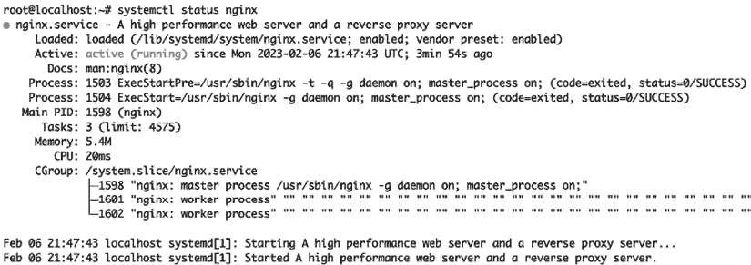

# 使用 systemd 进行服务管理

在上一章中，你学习了 Linux 中进程的工作原理。现在是时候看看这些进程如何被包装在一个额外的抽象层中：*systemd 服务*。

到目前为止你看到的命令——`ls`、`mv`、`rm`、`ps` 等——都在前台运行，并且附属于你的 shell 会话。你运行它们，程序完成任务后退出。然而，并非所有程序都像这样运行。

服务，也常被称为守护进程，是在后台长时间运行的进程。这些可以是数据库和 Web 服务器，也可以是常规的系统服务，如网络管理器、桌面环境等。这些长时间运行的后台服务通常通过 **init** 系统（如 **systemd**）启动和控制。

**init** 在这里指的是操作系统内核启动的第一个进程，而这个进程的任务是负责启动其他所有进程。

**systemd** 服务通过名为 `systemctl` 的命令行工具进行控制。它用于启动和停止服务，例如，重启一个出现故障的服务或重新加载一个配置已更改的服务。

如果你在跳读本书，尚未阅读上一章，你仍然能从本章中获得价值。现在，只需将进程理解为任何正在运行的命令、应用程序或服务。当你准备好更详细地了解进程如何工作时，你可以阅读 *第二章，处理进程*。

在本章中，你将学习以下内容：

+   你将用来与 `systemd` 服务交互的命令：`systemctl`

+   更深入地了解初始化系统的作用，以及 **systemd** 如何特别担任这一角色

+   使用 `systemctl` 管理服务

+   一些在容器环境中工作的提示（如 Docker 容器），这些环境通常没有我们在本章描述的那种强大的服务管理层。

**注意**

本章仅适用于 Linux – macOS 和 Windows（甚至其他 Unix 系统）使用不同的工具来管理进程。实际上，不同的 Linux 发行版使用不同的工具，但 `systemd` 是最广泛使用的。虽然概念相似，但了解现代 Linux 环境如何管理服务对开发者而言最为有用。

# 基础知识

Linux 服务是运行在 Linux 系统上的后台进程，用于执行特定任务。它们类似于 Windows 服务或 macOS 上的守护进程。

大多数非容器化的 Linux 环境使用 `systemd` 来管理服务。你将使用两个工具来与 `systemd` 进行交互：

+   `systemctl`：控制服务（在 `systemd` 的术语中称为“单元”）

+   `journalctl`：让你与系统日志互动

我们将在本章中介绍 `systemctl`，而 `journalctl` 将在 *第十六章，监控应用日志* 中详细介绍。

`systemd` 是一个针对 Linux 的系统和服务管理器，提供了一种管理服务的标准方式。它现在被广泛用作大多数 Linux 发行版的默认初始化系统。许多 Linux 发行版以前使用过来自 Unix 的 SysV 初始化系统，许多现代 Unix 操作系统仍在使用它。还有一些，比如 Alpine 和 Gentoo Linux，使用 OpenRC 作为它们的初始化系统。然而，有许多其他的初始化系统，但绝大多数 Linux 发行版现在都使用 `systemd`。使用 `systemd`，服务可以被启动、停止、重启、启用（设置为开机启动）或禁用，并且可以检查它们的状态。服务通过*单元文件*来定义，该文件明确指定服务应如何由 `systemd` 管理。

要通过 `systemd` 管理服务，你可以使用以下基本命令（我们将在本章稍后深入讲解每个命令）：

+   `systemctl start <service>`：启动一个服务。

+   `systemctl stop <service>`：停止一个服务。

+   `systemctl restart <service>`：重启一个服务。

+   `systemctl status <service>`：显示服务的当前状态。

记住，只有具有 root 权限的用户（例如，使用 `sudo`）才能通过 `systemd` 管理系统服务。

## 初始化

让我们稍作绕行，定义一个你经常会看到的常用术语。在 Linux 中，`init`——即“初始化”的简称——是系统启动时首先启动的进程。毫不奇怪，你可以在 PID 1 找到它。`init` 负责管理启动过程，并启动系统上配置为运行的所有其他进程和服务。它还会重新接管孤儿进程（即原始父进程已死亡的进程），并将它们当作自己的子进程，以确保它们的正常运行。

像 Linux 世界中的几乎所有事物一样，有几个不同的、互斥的程序可以填补这个角色。它们统称为*初始化系统*，这是任何可以承担这一重要引导、初始化和协调角色的软件的通用名称。如前所述，Linux 上有多个可用的初始化系统，包括**System V init**（**SysV**）、OpenRC 和 `systemd`。大多数现代 Linux 系统已经切换到了 `systemd`，这也是我们在这里讨论的内容。

你使用的初始化系统将决定服务的定义和管理方式，因此请记住，这里讨论的内容仅适用于 `systemd`。

# 进程和服务

让我们谈谈进程和服务之间的微妙差别。你可以把服务看作是围绕一块软件进行包装的一层，它让这块软件作为正在运行的进程更易于管理。

服务为程序（以及由该程序启动的进程）在系统中的处理方式增加了便利功能。例如，它让你能够定义不同进程之间的依赖关系，控制启动顺序，添加进程启动时的环境变量，限制资源使用，控制权限，及许多其他有用的功能。为了让这一切更加清晰，服务还为你的程序提供了一个简单的名称供引用。我们将在稍后的*第十章*，*配置软件*中向你展示如何创建你自己的服务。

在本章的其余部分，我们将专注于管理现有的服务。

# systemctl 命令

`systemctl`是你用来管理系统中已定义的服务的工具。这些示例将使用`foobar`服务，虽然它并不存在，但我们用它代替你可能正在管理的任何服务。

## 检查服务状态

`systemctl status <service>` 检查服务的状态。你将获得一系列对各种故障排除任务有用的数据。这是 nginx web 服务器服务输出的样子：



图 3.1：nginx web 服务器服务输出

让我们逐行剖析该命令生成的密集输出信息：

+   **服务名称**：在服务的单元文件中定义的服务名称。

+   **负载状态**：服务单元文件是否已成功加载并准备好启动。

+   **活动状态**：服务的当前状态——是否正在运行、处于非活动状态或已失败——以及这种状态持续了多久。

+   **文档**：如果安装了相关文档，这是你可以找到的主页面。

+   **主 PID 和子进程**：与该服务相关的主进程的**进程 ID**（**PID**），以及任何已启动的子进程的附加条目。

+   **资源使用**：RAM（内存）和 CPU 时间。

+   **CGroup**：该进程所属控制组的详细信息。

+   **日志预览**：来自服务输出的几行日志，帮助你了解正在发生的情况。

这些信息提供了关于服务及其状态的详细概述，对于调试问题或检查服务健康状态非常有用。

如果服务失败，输出通常会提供失败的原因，例如退出代码或错误描述。

## 启动服务

```
systemctl start foobar 
```

这会启动服务。如果服务已经在运行，执行此命令将没有效果。

## 停止服务

```
systemctl stop foobar 
```

这会停止服务。如果服务没有运行，那么此命令应该没有效果。

## 重启服务

```
systemctl restart foobar 
```

这会停止并重新启动服务。等同于运行：

```
systemctl stop foobar
systemctl start foobar 
```

**注意**

小心使用此命令：如果服务的配置文件在启动后已经更改，并且该配置文件中存在一个错误导致程序无法成功启动，那么`restart`将愉快地停止正在运行的服务，然后无法重新启动它。

这种逻辑但可能不太理想的行为多年来已经让许多开发者吃过亏，因此在重启之前，要确保你的服务配置仍然有效。

许多流行的程序都有内建的配置验证，例如，对于`nginx`，你可以运行：

```
nginx –t 
```

测试磁盘上的配置。

## 重新加载服务

```
systemctl reload foobar 
```

不是所有服务都支持这个子命令——是否实现取决于创建服务配置的人。如果服务有`reload`选项，通常比`restart`更安全。

`U`通常，`reload`：

+   重新检查磁盘上的配置，以确保它有效

+   重新读取配置到内存中，如果可能的话，不中断正在运行的进程

+   只有在验证配置并确保进程在停止后能够成功启动的情况下，才会重新启动该进程

就像 Linux 中的许多东西一样，这是一种约定，而不是严格执行的要求，所以你可能会遇到一些软件：

+   没有实现`reload`子命令

+   没有实现上述讨论的一些安全功能（如配置验证等）

+   执行与`reload`相关的其他操作，因为开发者或打包者认为这是一个好主意

一般来说，在更新应用程序的配置文件时，特别是在生产环境中，你应该优先使用`reload`而不是`restart`。

## 启用和禁用

`systemctl enable foobar` – 配置`foobar`在启动时自动启动。`systemctl disable foobar` – 如果`foobar`已配置为自动启动，则取消该配置并将`foobar`变成手动管理的服务。

这里的关键区别是，虽然`start`和`stop`会立即生效——它们确保服务*现在*正在运行（或已停止）；而`enable`和`disable`则是关于未来系统启动的设置。然而，它们对你运行命令时服务的“运行”状态没有任何影响。

开发者常犯的一个错误是认为`enable`会启动服务，但它不会。如果你想立即启动`nginx` web 服务器，并确保每次虚拟机重启时它都会自动启动，你需要运行两个命令：

```
systemctl start nginx
systemctl enable nginx 
```

因此，`enable`和`disable`带有一个可选的标志，也可以启动（或者在`disable`的情况下停止）服务。此命令等同于上述两个命令：

```
systemctl enable --now nginx 
```

# Docker 注释

虽然`systemctl`是传统 Linux 系统中管理服务的常用工具，但由于容器具有隔离和自包含的特性，通常在 Docker 容器中不使用它。

Docker 容器理想情况下运行一个单一的进程，因此不需要复杂的启动阶段或进程管理。容器本质上*就是*进程，并且无法访问宿主系统的初始化系统（包括`systemd`）。

虽然在 Docker 容器中访问这些命令是可能的，但通常不建议在容器内使用任何类型的服务管理系统。

Docker 容器理想情况下包含一个应用程序，并在启动时启动一个进程。为此，无需服务管理——运行中的容器就是你的服务包，Docker 容器本质上*就是*你的进程。

我们不推荐包含多个进程或重要内部服务管理的 Docker 设置，所以我们在这里不做详细讨论：就像家庭一样，所有快乐的 Docker 镜像在某种程度上是相似的，而每个不快乐的 Docker 配置都有其独特的不快乐。

# 结论

在本章中，你了解了 Linux 中服务是如何管理的，并介绍了你将用来控制它们的实际命令。我们为你提供了理解所有你在实际系统中遇到的术语所需的理论：init 是什么，systemd 在 Linux 系统上做什么，以及你需要使用哪些命令与它交互。

在下一章中，我们将展示一些与 shell 和命令历史记录交互的实用技巧，帮助你节省时间，并像你最喜欢电影中的 Unix 大师一样（当然，这也会让你在日常工作中变得更快更高效，但这么说就没有那么有趣了）。

# 在 Discord 上了解更多

要加入本书的 Discord 社区——你可以在这里分享反馈、向作者提问并了解新版本发布——请扫描下方二维码：

[`packt.link/SecNet`](https://packt.link/SecNet)


