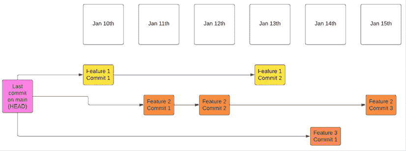
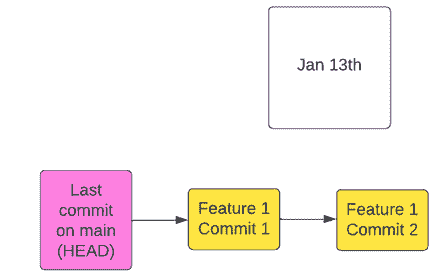
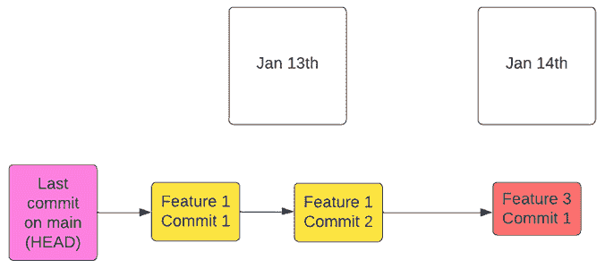
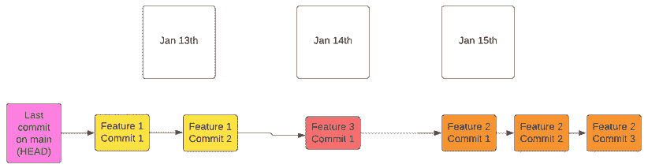

# 14

# 使用 Git 进行版本控制

**Git** 是一个 **分布式版本控制系统**（**DVCS**），在过去的二十年里，它已经成为全球使用最广泛的版本控制系统。虽然你很可能已经知道如何使用 Git 的基础知识，但你可能不熟悉常见的命令行模式，或者一些它的较少使用（但强大的！）功能。我们将在这里讲解这些内容。本章还将提供一些背景知识，使得常用的 Git 术语更易理解，常被提及的概念更加清晰。

你将学到的内容包括：

+   Git 和分布式版本控制的基础

+   第一次 Git 设置

+   基本的 Git 命令

+   常见的 Git 术语

+   两个强大且稍微复杂一点的 Git 概念：二分查找和变基

+   Git 最佳实践，尤其是在有效使用提交信息方面

+   有用的 Git Shell 别名，它们能帮你节省大量打字时间

+   你可以用来与 Git 交互的 GUI 工具

最后，*穷人的 GitHub* 部分介绍了一个小而有用的项目，你可以通过这个项目来练习并整合你迄今为止学到的 Linux 技能。我们希望你能试试看：如果你这么做了，你在命令行上的熟练度和舒适度将会有极大的提升。

# Git 的一些背景知识

Git 是一个由 Linux 内核创建者 Linus Torvalds 开发的 DVCS。Git 的起源可以追溯到 2005 年，当时 Linux 内核社区与一个名为 *BitKeeper* 的专有分布式版本控制系统的关系破裂。

为此，Torvalds 旨在创建一个免费的开源 DVCS，满足 Linux 内核开发过程的需求。仅仅几天内，他就构思并奠定了 Git 的基础。

Git 优先考虑性能、安全性、灵活性和非线性开发（支持成千上万的并行分支），因此迅速在软件开发社区中获得了广泛的关注。它的设计强调速度、数据完整性和支持分布式工作流，这使得它成为开发者的最爱，随后它也成为了软件行业版本控制的事实标准。

# 什么是分布式版本控制系统？

传统的版本控制系统（如 **并发版本系统**（**CVS**）等）使用中央服务器，始终保持单一、统一的仓库状态。这些系统允许开发者推送和拉取代码，并支持使用分支、标签等常见机制。重要的一点是，这些版本控制系统的设计是以中央权限为核心的。

Git 和其他分布式版本控制系统（如 **Mercurial** 和 **Fossil**）采用不同的方法。每个开发者都有自己完整的仓库。其他开发者则不是通过一个中央服务器，而是从彼此的仓库中拉取更改。在 Linux 项目的情况下，有数百个开发者独立使用的仓库。一旦开发者认为其中某个仓库的状态已经准备好，他们会请求将更改拉取到主内核中。这就是 **pull request**（拉取请求）一词的来源。

虽然 GitHub、GitLab、sourcehut 等提供了 Git 的集中式托管，处理用户授权等事务，并提供许多与软件项目开发相关的其他功能，但 Git 本身在没有这些托管的情况下也能很好地工作，并提供多种机制来实现这一点。甚至可以通过电子邮件发送和接收补丁和一组提交，而无需离开命令行和 Git。这使得即使贡献者只有一个电子邮件地址，也可以轻松地进行协作，发送补丁。

# Git 基础

这里是对最重要的 Git 命令行基础的快速回顾。这些内容作为参考提供，而不是逐步指导—尽管我们已经将它们编写成你可以跟着操作的格式，以便如果你想练习时能够使用。

## 首次设置

首先，如果你在机器上第一次运行 Git，你可能想设置一些全局配置选项。

将默认分支名称设置为 `main`：

```
git config --global init.defaultBranch main 
```

现在配置你的默认用户名和电子邮件（与所有提交相关联）：

```
git config --global user.email "you@example.com"
git config --global user.name "Your Name" 
```

现在你可以初始化一个新的 Git 仓库。

## 初始化一个新的 Git 仓库

创建一个目录并进入它：

```
mkdir my-repo
cd my-repo 
```

现在告诉 Git 你希望将这个目录初始化为一个新的 Git 仓库：

```
git init 
```

## 创建并查看更改

创建一个包含一些简单内容的文件，并展示 Git 检测到的变化：

```
echo "Hello World" >> README
git status 
```

## 暂存并提交更改

将你做出的更改暂存起来，以便提交，并观察 `git status` 的输出如何变化：

```
git add README
git status 
```

显示分阶段的内容：

```
git diff --staged 
```

提交暂存的更改：

```
git commit -m 'Add README file' 
```

这是 `commit` 命令的简短形式，直接指定消息（`-m`）。`commit` 命令也有一个交互式版本，你可以通过仅运行 `git commit` 来使用它。

该命令的交互式版本（没有 `–m` 选项）会打开你在 shell 中指定的 `EDITOR` 环境变量所指定的文本编辑器，一旦文件保存并且编辑器退出——也就是说，当 `$EDITOR` 命令返回时——提交将被写入。

## 可选：添加一个远程 Git 仓库

以下命令将添加一个名为 `origin` 的远程仓库，Git 可以向其推送和拉取数据。这可能看起来像我们在 *第十三章*，*使用 SSH 进行安全远程访问* 中讲解的 SSH 登录命令，因为 Git 在这种情况下确实会使用 SSH。Git 还支持其他协议，如 HTTPS。

```
git remote add origin git@example.org:repo-path 
```

这只是一个例子，但当你在真实的仓库上工作时——例如，存在于 GitHub 上的一个仓库——你需要更改主机名和 `repo-path` 来匹配你想要添加的仓库。GitHub 和其他源代码托管工具都有清晰的文档说明如何为其托管的仓库执行此操作。

## 推送和拉取

推送当前分支的更改到远程 Git 仓库：

```
git push -u origin HEAD 
```

从远程分支拉取更改：

```
git pull 
```

## 克隆仓库

让我们克隆一个远程仓库——我创建的一个基于 Linux 课程的项目的所有代码：

```
git clone https://github.com/groovemonkey/hands_on_linux-self_hosted_wordpress_for_linux_beginners 
```

这将下载代码库的 Git 历史记录，并将远程仓库的源设置为指定的 URL。然后你可以使用本章中已学习的所有 Git 命令来操作代码库。

如前所述，你可以检查仓库的状态：

```
git status 
```

尽管此命令通常用于检查修改的内容，它也会提供有关正在进行的合并、显示合并冲突期间受影响的文件，并在二分代码和其他各种情况下帮助你。当你不确定发生了什么时，检查 `git status` 是值得的；很可能你处于一个特殊的 Git 状态中，你要么想要退出这种状态，要么在继续之前完成它。

现在我们已经介绍了你经常使用的命令，让我们帮助你熟悉一些术语，这些术语常常让刚开始使用 Git 的人感到困惑。

# 你可能会遇到的术语

在理解 Git 词汇的基础上会非常有帮助。虽然其他软件混合使用这些术语可能会令人困惑，但了解它们在 Git 世界中的含义可以让你在故障排除和阅读错误消息时更加自信地工作。

这里是最常见术语的概述及其含义。

## 仓库

这本质上是一个“项目”，由版本控制管理和跟踪的代码的根目录——包含 `.git` 目录的项目。仓库保存了你的源代码及其历史和更改。

### 裸仓库

这具有类似的意义，只是代码未被检出。它匹配 `.git` 目录中的内容。在托管仓库的服务器上，比如 GitHub、GitLab、sourcehut，或者你公司的 Gogs 或 Gitea 实例中，这些通常在名为 `project-name.git` 的目录中，只包含你在 `project-name/.git` 中看到的内容。

## 分支

如果你将第一个提交想象为新仓库的种子，那么一个项目由各种分支组成。有一个主分支（下文有描述），通常还有一个或多个侧分支，包含项目正在采取的其他方向。

这些可能是主要版本分支，已经修复了其中的错误，但永远不会再合并回主分支。它们也可能是实验性分支，这些分支可能永远不会被合并回主分支。或者，它们可能是正在开发中的新特性或错误修复分支，一旦准备好就会被合并——可能性是无穷无尽的。

### 主分支（Main/Master）

这是默认分支，当初始化或克隆一个仓库时将使用它。根据项目的不同，它通常包含最新的（正在开发中的）或最新的稳定代码。

### HEAD

这是分支上的最新提交。它有时也被称为分支的“尖端”。在命令行中，`HEAD` 通常与相对提交一起使用。

例如，`HEAD~2` 表示回退到两个提交；因此，以下命令会显示直到两个提交之前的日志：

```
git log HEAD~2 
```

在脚本和日常使用中，它也可以作为当前分支的替代，因为它是当前分支的尖端。

## 标签

与分支不同，标签是一种标记特定提交的方式，例如，用来创建（并随后引用）代码库的特定版本。

### 浅层

通常，“浅层”用来描述没有或几乎没有历史记录的检出。浅层检出用于当 Git 仅作为获取代码的手段，而不是完整的仓库及其历史记录时。然而，这可能会导致某些依赖更多历史记录的命令和工具无法工作。

## 合并

合并是将一个分支的代码集成到另一个分支的过程。这种情况可能发生在多种场景中，比如将功能分支合并到主分支、从远程分支拉取更改、从 Git 存储区获取代码等等。这些合并通常是完全自动化的。有时，如在合并冲突的情况下，合并可能需要手动干预。

### 合并提交

这是由于代码合并所产生的提交。当合并代码时，合并本身会变成一个提交。当出现合并冲突时，这个合并提交将包含解决该冲突的更改。虽然技术上是可能的，但在这种提交中添加其他更改（如额外的错误修复）并不是一个好主意。合并提交应该仅包含使特定合并能够工作的所需更改。

对于 Git 自动处理的无冲突合并，通常只需提交它们，而不对代码或提交消息进行任何手动修改。

## 合并冲突

当 Git 无法确定如何合并即将合并的代码时，就会导致合并冲突，你需要手动解决，通常使用合并工具。在拉取代码、应用代码存储、合并分支或进行任何其他对当前检出的代码进行操作的活动时，都可能发生这种冲突。合并冲突需要解决并提交。`git status` 通常会告诉你如何继续。

## 存储区

有时需要将变更保存起来，稍后再取用。Git 提供了一个机制来实现这一点，称为 stash。stash 像栈一样结构化，使得可以通过 `git stash pop` 逐步应用变更。

## Pull 请求

Git 是一个分布式版本控制系统，这意味着每个开发者都有自己的完整仓库，因此可以独立于其他开发者进行工作，即便他们在同一个项目中。

假设有一个开发者 Steve，他在自己的仓库中做了一些修改。他希望另一位开发者 Sarah 在即将发布的软件版本之前，将这些修改整合到代码库中。Steve 请求 Sarah 拉取这些修改到她的仓库中——正如我们在本章之前所看到的，这就是“pull request”这一术语的来源。

由于许多公司和项目并不使用 Git 作为 DVCS，而是偏好使用一个中心化的、权威的代码仓库，所有开发者都从中拉取和推送代码，因此“pull request”这个术语现在通常用来描述请求将代码添加到该权威仓库（或有时只是添加到仓库的主分支）中的操作。

**注意**

因为这个概念偏离了 Git 的去中心化特性，所以 Git 本身并没有对应的术语来描述它。实现这一工作流的不同产品（更新代码库的权威中心版本）有不同的命名：GitHub 称之为“pull request”，而 Launchpad 称其为“merge proposal”，GitLab 则称其为“merge request”。

## 挑选提交

有时只需要从其他分支获取单个变更（提交）。一个典型的例子是开发分支中的 bug 修复，比如一个功能分支应该被添加到稳定分支中发布。这可以通过挑选提交（cherry-picking）来完成。与合并整个分支不同，挑选提交允许你指定单个的提交进行添加。

## Bisect 操作

`git bisect` 是一种快速定位引起变更的提交的方法，通常用于确定哪个提交引入了特定的 bug。为此，你需要指定一个已知的“坏”提交和一个已知的“好”提交。坏的提交包含 bug，而好的提交仍然正常。Git 会向你展示可以用来测试 bug 的提交。以下是一个例子：

```
git bisect start
git bisect bad
git bisect good a0634a0
Bisecting: 675 revisions left to test after this (roughly 10 steps) 
```

第一行开始进行 bisect。在第二行，我们告诉 Git 当前版本有问题，因此包含了 bug。由于我们知道提交 `a0634a0` 仍然是正常的，所以在第三行指定了它。当然，这不一定非得是提交，也可以是标签或分支。Git 将会告知我们还需要检查多少个版本。

现在是测试我们试图找出 bug 的代码的时候。如果存在 bug，我们输入 `git bisect bad`，否则输入 `git bisect good`。反复进行，直到最终定位到引入 bug 的具体提交。

如果你想退出这种模式，回到之前的状态，输入 `git bisect reset` 即可。

根据你要查找的内容，"好"和"坏"不是最佳词汇，在查找任何其他类型的行为变化时可能会引起混淆。因此，可以改用"旧"和"新"，以找到引入新行为的提交。请记住，这两个术语不能混用。它要么是*好*和*坏*，要么是*旧*和*新*。

还有一些方法可以加快这个过程，比如指定文件或目录，如果你知道行为是如何引入的。如果你知道某个更改与`some/directory`或`some/other/directory`的内容有关，你可以这样缩小搜索范围：

```
git bisect start -- some/directory some/other/directory 
```

Git 会确保只考虑对这些路径做出更改的提交。

还有更多方法可以加快这个过程，比如指定多个好的提交，或者甚至传递一个测试脚本，根据退出代码，自动找到提交。如果你需要检查大量提交，查看`man git-bisect`也很有帮助。

## 变基

`git rebase` 是一种常用的方式，通过“重放”（实际上是重新创建）一组给定的更改（如功能分支）到一个新的基础提交上，而不是它们真正分岔的基础提交，从而保持提交历史易于跟踪。

因为开发通常是分布式的，你可能会有这样的“真实”提交历史：



图 14.1：“真实”提交历史

多个功能分支的历史交织在一起，通常比有用更令人困惑，因此 Git 的`rebase`功能用于在合并时精简这些功能提交。

特性 1 先合并，所以它使用了原始的基础提交。历史现在看起来是这样的：



图 14.2：特性 1 已变基/合并 1 月 13 日

特性 3 是下一个需要变基并合并的分支，所以现在历史看起来是这样的：



图 14.3：特性 3 已变基/合并 1 月 14 日

最终，特性 2 被变基，导致其基础提交更改为 1 月 14 日的特性 3 提交。现在我们得到了一个简洁流畅的历史，如下所示：



图 14.4：特性 2 已变基/合并 1 月 15 日

GitHub 和其他集中式 Git 仓库托管服务在合并时具有自动化此过程的功能，因此你很少需要在命令行上手动变基。然而，下面是执行此操作的过程：

1.  创建一个新分支并添加一个提交：

    ```
    git checkout -b dave/myfeature
    git commit -m "made some changes" 
    ```

1.  假设基础分支名为`main`，并且自从你开始开发分支以来已经有一些提交，你现在可以“基于 main 进行变基”：

    ```
    git rebase main 
    ```

这将修改 Git 历史，将你分支的提交变基到最新的`main`提交，如上图所示。由于你正在更改现有历史，这可能需要强制推送到权威仓库（例如 GitHub 仓库），这可能会导致其他用户出现冲突。请在进行变基时注意这一点。

现在我们已经确定了一些你在使用 Git 时会遇到的关键术语和概念，我们可以概述一些编写有效提交信息的良好实践。

# 提交信息的最佳实践

一般来说，“每次提交一个更改，每个更改对应一次提交”是保持 Git 提交及历史记录有用的方式。

有很多情况你可能只处理一个主要的更改，但同时还对代码做了一些小的（无关的）修正和改进。这些无关的更改一般应单独提交。保持每次提交专注于你想要完成的具体任务：小修复、修正拼写错误、改变样式、添加一个（单一的）功能等等，即使你最终一次性做了多个相互关联的更改，稍后将它们拆分成多个提交仍然有意义。更频繁的提交可以使这个过程变得更加简单。

这个规则有很多原因。最实际的原因之一是，当你的提交很小时，个别的更改可以很容易地被挑选出来或撤销（即使你在修改代码时没有预见到这种需求）。保持小而集中的提交在别人使用`git blame`理解更改时也很有帮助。

## 良好的提交信息

有时，一些模糊的建议，例如“在使用`git commit`时保持提交信息简短”，可能会让人困惑且难以遵循。为了更好地理解，首先有必要解释 Git 的使用目的。Git 作为一个分布式版本控制系统（DVCS），允许通过电子邮件发送补丁。因此，提交信息本身在某种程度上呈现出电子邮件的形式。第一行被视为主题行，简要概述所做的更改，后面跟着一个空行以及对更改的更详细总结。

由于这是一个非常开放的框架，因此有一些普遍公认的规则。像所有此类规则一样，它们可以根据项目或组织的不同而被覆盖，但以下是许多知名开源项目的概述做法：

+   保持第一行简短，最好在 72 个字符以内，用于总结。

+   使第一行使用祈使动词（例如`Add`…，`Fix`…）。

+   使主题行首字母大写。

+   如果需要更多内容，可以添加一个空行并提供完整的总结。

+   使用正文部分来解释你为什么进行此更改。这对于未来使用`git blame`的读者来说非常有帮助。

+   确保描述你是如何得出结论或实现的，以及为什么它相关。这对于复杂的提交尤其重要，特别是那些对仅查看代码的人来说可能并不马上显而易见的提交。这在跟踪错误、删除过时的代码、重写系统或理解代码时可以提供极大的帮助。

+   考虑一下你在提交信息中写的内容是否可以更好地放到代码注释中。

+   假设审阅者或未来的读者完全没有上下文。确保代码更改可以被轻松理解。

有了这些建议，你应该能够编写清晰且有条理的提交信息。接下来，我们将探讨一些关于如何轻松高效使用 Git 的进一步建议。

# 图形用户界面（GUIs）

尽管本书强烈关注提升你的命令行技能，但值得一提的是，确实有一些图形化工具可以在某些使用场景下让与 Git 的交互更加容易。

`tig` 和 `gitk` 是两个图形化仓库浏览工具，它们为你提供一个类似许多 IDE 提供的 Git 界面。要尝试它们，只需使用 `cd` 导航到仓库并运行 `gitk` 或 `tig`。你可能需要通过包管理器安装这些工具；许多 Unix 系统（包括流行的 Linux 发行版和 macOS）默认没有安装它们。

# 有用的 shell 别名

这里有一些常用 Git 命令的有用 shell 别名。你可以将这些别名添加到你的`~/.bash_aliases`文件中（假设你正在使用 Bash）：

```
alias gpo='git push origin $(git branch | grep "*" | cut -d " " -f2)'
alias gp='git pull'
alias gs='git status'
alias gd='git diff'
alias gds='git diff --staged' 
```

如果你每天都要敲很多次 `git status`，那么添加一个别名让你只需输入 `gs` 可能会带来巨大的改善。你可以随意将这些别名更改为更方便的名称——这正是自定义的意义所在！

现在让我们稍微 zoom out（拉远视角），看看如何在构建一个小型 Linux 服务器项目时实际应用所有这些知识：你自己的私人 Git 服务器。

# 穷人的 GitHub

在这一部分，我们将向你展示如何为自己设置一个远程 Git 仓库。你只需要一个远程机器上的 SSH 账户和本地机器上的 Git 二进制文件（即 Git 命令本身）。如果远程机器上已经安装了 Git，你甚至不需要 root 权限。

这是一个有趣的项目，它会让你熟悉 Git 所涉及的基本操作系统概念。这个设置不一定适合生产环境使用；相反，它会告诉你 Git 并没有什么神奇之处。就像 Linux 中的其他一切一样，它只是文件（在这个案例中，是远程文件和一个 SSH 隧道）。

## 注意事项

根据你是否有 root 权限以及是否希望与他人共享仓库，你可能需要考虑为共享的 Git 服务创建一个专用用户。这是完全可选的。

我们将使用一个 SSH 账户进行身份验证，因此，如果你共享 Git 仓库，与你共享的人将拥有该用户在远程机器上的相同权限。如果你不完全信任其他程序员访问此账户，可能需要在远程机器上为此项目创建一个单独的用户（命名为 `git`）。

本项目假设你能熟练地设置 SSH 并连接到服务器——如果你对细节有些生疏，可以参考上一章：*第十三章*，*使用 SSH 进行安全远程访问*。

## 1\. 连接到你的服务器

使用你希望仓库属于的帐户连接到服务器（例如 git 或你的用户帐户）：

```
ssh myuser@example.com 
```

## 2\. 安装 Git

首先，通过运行以下命令检查 Git 是否已经安装：

```
git version 
```

这应该会输出安装在服务器上的 Git 版本。如果你收到类似`command not found`的消息，那么说明 Git 并没有安装在你的系统上。

要安装 Git，只需使用系统的包管理器安装`git`包。在 Ubuntu 上，你可以运行以下命令：

```
apt-get install git 
```

## 3\. 初始化仓库

现在你可以初始化一个新的裸仓库。在这种情况下，我们将其命名为`my-project`。你可以在任何你想要的位置创建它。为了简便起见，我们假设它位于你的主目录下：

```
git init --bare my-project.git 
```

这将创建一个名为`my-project.git`的目录。它不是一个文件，而是 Git 认为是仓库的目录结构。我们在这里不深入讨论，实际上在很长一段时间内，你可能不需要做任何更改。

信不信由你，其实这就是你需要做的所有步骤！

现在你可以断开与服务器的连接（如果你通过 SSH 连接，可以按 *Ctrl*+*D*）。

## 4\. 克隆仓库

尽管仓库完全为空，你已经可以克隆它了。在断开与服务器的连接后，从本地机器运行以下命令：

```
git clone myuser@example.com:my-project.git 
```

如前所述，这假设你在`myuser`用户的主目录下创建了仓库。从`example.com`主机名后开始（如果你没有设置 DNS，这可能只是服务器的 IP 地址），路径是相对于用户主目录的。如果你想指定完整（绝对）路径，只需从斜杠开始。换句话说，使用命令`git clone myuser@example.com:/home/myuser/my-project.git`也会克隆相同的目录。

Git 会警告你克隆了一个空仓库。但由于这是我们预期的结果，所以无需担心。

## 5\. 编辑项目并推送你的更改

现在我们可以切换到克隆的目录并开始进行项目工作：

```
cd my-project
echo "My personal project" >> README
git add README
git commit -m 'initial commit' 
```

现在我们有了第一次提交，可以将其推送到远程仓库。第一次推送有一个小注意事项：由于仓库仍然是完全空的，它还没有任何分支，甚至连 master 分支都没有。如果你仅仅运行`git push`，Git 会告诉你这一点。所以，在第一次推送到一个新仓库时，只需确保告诉 Git 分支信息：

```
git push origin master 
```

就是这样！

现在，你或其他有权限访问你 SSH 帐户的人可以克隆、推送和拉取这个仓库。你甚至可以设置钩子并做其他有趣的事情。Git 是一个非常强大的工具，拥有丰富的功能。可能需要一段时间才能习惯这些功能，所以就把这当作你的起点吧。

可能性是无限的，我总是很高兴听到人们使用 Git 来处理有趣或独特的用例。祝你玩得开心！

# 结论

在本章中，你学习了使用 Git 的基本概念、命令和工作流程。现在你应该对一些常用的高级功能和术语有了更清晰的了解，我们还传授了一些关于“软” Git 技能的建议，例如如何写好提交信息。

我们展示的 shell 别名在一天的编程中为我们节省了数百个击键；我们希望它们对你也同样有用，并且你会为所有那些难以记住或难以输入的命令使用命令别名。

我们还希望你能跟随 *贫民版 GitHub* 项目一起操作！运行这些命令只需要几分钟，但如果你花一个下午时间深入尝试（租一台 Linux 虚拟机几个小时，在上面设置一个远程仓库并推送一些示例提交），你会感受到当你将新学的 Linux 技能结合起来解决实际问题时，它们是多么强大和高效。

# 在 Discord 上了解更多

要加入本书的 Discord 社区——在这里你可以分享反馈、向作者提问并了解新版本——请扫描下面的二维码：

[`packt.link/SecNet`](https://packt.link/SecNet)


