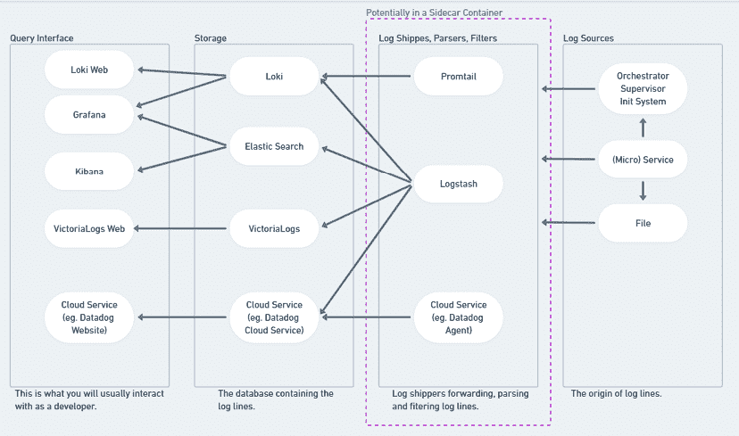

# 第十六章：监控应用程序日志

欢迎进入 Linux 日志的世界！作为软件开发者，理解 Linux 中的日志，特别是使用像`systemd`和`journald`这样的工具，是至关重要的。下面是你需要了解的内容概览。

**日志**是记录软件应用程序或操作系统中发生事件的记录。它是一种灵活的格式，并且每个应用程序的日志格式各不相同，但日志是如何处理、存储和检索的，在现代系统中相对统一。作为开发者，理解日志至关重要，因为你在 Linux 中可以访问的日志能为你提供操作系统及其上运行的所有应用程序的行为洞察。你将利用这些知识来理解错误、跟踪应用程序性能以及进行调试。日志是故障排除的第一道防线，因此准备好与它们建立亲密关系。

在本章中，我们将为你概述 Unix 和 Linux 的日志系统，并展示软件开发者与日志互动的最常见方式。你将看到：

+   系统及其上运行的应用程序如何生成日志

+   大多数现代 Linux 系统上日志的收集位置

+   过去日志如何工作的历史知识，这些知识在你遇到许多生产系统时仍然非常有用

+   如何在故障排除应用程序时查找和查看日志

+   在公司以及云环境中部署服务时，日志如何被集中化管理

我们还将提供一些关于如何充分利用结构化日志的技巧，并避免开发者常犯的一些常见陷阱。

# 日志简介

正如我们在介绍中看到的，**日志**仅仅是信息性消息——记录软件应用程序或操作系统中发生的事件。像许多 Unix 概念一样，日志并没有硬性规定：如果你写了一个两行的脚本，往文本文件中写入时间戳，那也可能算作一条日志。有些日志是简单的纯文本字符串，发送到系统上的已知文件位置，其他则是由像`systemd`这样的守护进程专门管理的高度结构化的二进制数据。

作为开发者，你可能对**日志级别**比较熟悉，它们是表示软件中事件紧急程度的标签。例如“错误”、“信息”和“调试”信息，你肯定在开发软件时看到过它们在终端滚动显示。我们稍后会介绍这些常见的日志级别，但目前，你需要了解在现代的、功能齐全的 Linux 环境中，日志有三大主要的*来源*：**系统**、**服务**和非服务**应用程序**日志。日志的来源可以为你提供关于特定日志消息的关键信息。

**系统日志**是操作系统（“内核”）本身发送的日志。这些日志包括错误、硬件事件消息、资源消耗与限制、配置与安全性，以及系统状态中的显著变化。

**服务日志**是由系统上运行的服务产生的。具体来说，在 Linux 上，它们是由`systemd`初始化系统管理的服务产生的，这些服务通过名为`journald`的服务进行日志记录。它们可以提供有关各种服务的健康状况和状态的洞察。

在你可能遇到的系统上，系统日志和服务日志通常会一起混合在`journald`中。随着我们深入本章，你将学习到关于`systemd`、`journald`（和`journalctl`）的所有内容。

**非 systemd 管理的应用程序**是那些通常不通过`journald`进行日志记录的特例。你需要通过每个应用程序的文档来查找它们的日志文件，尽管行为规范的应用程序通常会在像`/var/log/$APPLICATION_NAME/`这样的目录中写入自己的日志文件，其中`$APPLICATION_NAME`是应用程序的名称。

在本章中，当我们深入学习时，你会发现理解`journald`和`journalctl`命令的重要性。然而，在进入这些内容之前，我们应该先说明一些关于 Linux 日志记录的细节。

## 在 Linux 上的日志记录可能会变得...怪异

你现在应该已经看到，类 Unix 系统是极其灵活的。如果你不喜欢默认的做法，你可以打破常规，按自己的方式进行配置。

这也是在学习 Unix 和 Linux 基础时的一个巨大缺点。许多事情——从软件配置到默认用户设置——可以通过多种方式进行配置，而且在新环境中没有办法知道常规做法是什么，除非问（有时还需要排除故障）。

这种怪异现象在日志记录中尤为明显，尤其是随着最近公司计算方式的变化而产生的影响。日志记录在过去几十年里是按一种方式进行的，当时大多数公司直接购买、配置和管理长期使用的物理服务器，每台服务器上安装着单一的操作系统。随着工作负载转向云计算，以及每台物理机器上运行多个操作系统（虚拟机）甚至每个操作系统上运行多个环境（容器），传统的日志记录方式也发生了变化。

这也就是说，当你在新工作或团队中了解日志记录时，问题不是“Linux 上是如何进行日志记录的？”，而是“这里目前是如何进行日志记录的？”这实际上取决于你使用的软件开发人员所做的决定。在学习本章关于日志记录的内容时，我们建议你记住这一点。

## 发送日志消息

虽然在大多数情况下，服务会通过库或仅仅写入`stdout`来进行日志记录，类 Unix 系统提供了一条命令来将日志发送到 syslog 服务器。我们将在下面讨论这意味着什么。由于`syslogd`和`systemd`提供了一个 syslog 服务器，无论你使用什么类型的系统，因此有一个统一的命令来发送日志消息：

```
logger Hello World! 
```

这将记录 `Hello World`。`logger` 命令有很多选项，它在调试问题时、希望在 shell 脚本中记录日志时，或解释日志如何工作的过程中都非常有用。

# systemd 日志

当系统使用 `systemd` 时，`journald` 会负责日志记录工作。当你在排查一个运行 `systemd` 的 Linux 机器时，这是你应该首先查看的日志位置。默认情况下，journald 会捕获所有受控进程的输出。任何在 `stderr` 上发出的内容都会被视为错误。因此，除非软件被配置或硬编码为记录到不在 `stderr/stdout` 位置的地方，否则你将会在 `systemd` 日志中找到这些日志。

记录到 `journald` 的日志可以通过 `journalctl` 命令进行查询。它提供了基于单个服务、时间和系统重启进行查询的方法，并允许使用类似 `tail` 命令的选项。让我们开始使用 `journalctl` 进行一些实践。

# 示例 journalctl 命令

使用 `journalctl` 的基本操作非常简单。想想看，当你在排查应用程序问题时，你需要做什么来查看日志？

首先，你需要能够找到并查看当前的日志。`journalctl` 可以为你提供这个功能，但你会很快意识到，你实际上并不需要 *所有* 的日志，只是需要查看最近的日志。所以，让我们使用 `-n` 选项进行过滤。

要查看 `journald` 中最后 100 条日志消息，可以尝试以下命令：

```
journalctl –n 100 
```

这将打印出系统记录的最后 100 行日志。你会注意到，这与本书前面解释的 `tail` 命令类似。如果你跟着做，这些日志很可能包含上面的“Hello World!”消息。

## 跟踪单元的实时日志

你可能还想实时查看日志。例如，在启动过程中跟踪你的应用程序日志可以帮助你准确地看到问题发生的时间：

```
journalctl -fu unitname 
```

`-f` 选项表示“跟踪”，而 `-u` 选项表示“单元”——即你想要过滤日志的系统单元（或“服务”）。

## 按时间过滤

即使你过滤到一个特定的单元，你仍然可能会被匹配的日志数量所淹没。按时间过滤在这里特别有用，尤其是在你尝试将已知的外部问题（如停机、错误等）与从那一刻起的应用程序日志关联时。可以使用 `--since` 和 `--until` 来实现：

```
journalctl --since "2021-01-01 00:00:00" 
```

你也可以使用一些简写方式，如 `today`：

```
journalctl --until today 
```

你还可以使用 `--until` 设置过滤器的结束时间，并将这些选项组合起来，达到非常具体的过滤效果。例如：

```
journalctl --since "2021-01-01 00:00:00" --until "1 hour ago" 
```

**注意**

使用时间过滤和查看日志时的一个注意事项是，你几乎总是需要使用 `--utc` 选项，它会以 UTC 时间显示时间戳。当你帮助运维团队排查停机故障时，几乎总是使用 UTC 时间，这样可以避免时区相关的混淆。

还有一些其他过滤器，如按用户/组 ID 过滤。

## 按特定日志级别过滤

如果你知道自己要查找的是错误信息，可以告诉 `journalctl` 只显示错误日志（或列出的其他日志级别，按照优先级递减的顺序：[`wiki.archlinux.org/title/Systemd/Journal#Priority_level`](https://wiki.archlinux.org/title/Systemd/Journal#Priority_level)：`emerg`、`alert`、`crit`、`err`、`warning`、`notice`、`info`、`debug`）：

```
journalctl -p err 
```

## 检查之前启动的日志

有时候，情况会变得非常混乱，故障甚至会导致系统重启。在这种情况下，你可能需要查看之前启动时的日志。你可以使用 `--list-boots` 查看所有可用的启动记录，如下所示：

```
journalctl --list-boots 
```

然后使用 `-b` 参数从列表中选择一个特定的启动记录。在这种情况下，我们要选择标签为 `2` 的那一项：

```
journalctl -b –2 
```

单独使用 `–b` 标志表示“当前系统启动”。

## 内核消息

在引言中，我们提到过，系统级日志消息是由操作系统（在 Linux 术语中是“内核”）发送的。要查看仅由系统发送的这些消息，请使用 `--k`（或者出于历史原因，使用 `--dmesg`）标志。

# 在 Docker 容器中记录日志

在 Docker 容器中，处理日志的最常见方式是简单地假设容器的主进程就是我们需要输出的目标，而且它将日志写入标准输出（`stdout`）。容器编排工具（比如 Kubernetes 和 Nomad）以及负责执行容器的各种云服务，都会假设 `stdout` 是日志输出的目标，并根据配置进行转发。我们将在下面的 *集中式日志记录* 部分进一步讨论这一点。

# Syslog 基础

相比我们之前展示的 `systemd`/`journald` 日志，syslog 看起来可能有些过时。我们更愿意认为它有着 *悠久的历史*——虽然自 1980 年代以来它就已经存在，但它依然是一个有用、灵活且广泛使用的日志工具。更重要的是，你几乎可以肯定会在实际生产系统中遇到它，因此了解其基础知识是值得的，以免在停机事件中被突如其来的情况搞得措手不及，而时间又至关重要。

在类 Unix 系统中，记录日志到 syslog 通常等同于记录到 `/var/log` 中的一个文件，其中大部分消息通常会写入 `/var/log/messages`。但请记住，并非你在 `/var/log` 中找到的所有内容都一定经过了 syslog。许多软件也实现了自己记录日志文件的方式，完全跳过了 syslog 守护进程。

其原理是，syslog 会接收所有发送给它的日志，并根据以下提到的各种参数，将其输出到一个文件中。在几乎所有系统中，默认的输出路径是 `/var/log/messages`。如果你跟着操作并且你的系统使用了 syslog，那么这里也会找到之前提到的 `Hello World!` 消息。

Syslog 是一种标准化的日志协议。尽管在撰写本文时，`syslogd` 主要处理日志行，但当前标准 [`RFC 5424`] 也允许进行结构化日志记录。然而，由于这尚未得到广泛支持，我们将简要介绍它作为行/消息日志协议的基本概念。如果你完全不与 syslog 交互，可以跳过本节。

如前所述，syslog 是一种协议。虽然它最常用于软件，例如希望本地记录日志的数据库，但在生产环境中，通常会有一个集中式日志服务器，日志会发送到该服务器。作为一个协议，各种软件（如 PostgreSQL、nginx 等）可以使用该协议生成日志，此外，诸如 `Logstash`、`Loki`、`syslogd`、`syslog-ng` 等日志相关软件可以接收其日志。它通常使用端口 514（UDP）或端口 6514（TCP）。

## 设施

由于 syslog 是一种非常古老的协议，起源于 1980 年代，所以它的一些概念可能显得有些过时。它使用预定义的 *设施* 来指定日志消息的类型。每个设施都有自己的代码：

+   0: `kern` – 内核消息。

+   1: `user` – 用户级消息。这些消息通常由进程使用。

+   2: `mail` – 邮件系统。主要用于邮件服务器，如 SMTP、IMAP 和 POP3。与垃圾邮件相关的守护进程和软件通常会在此记录日志。

+   3: `daemon` – 系统守护进程。守护进程，特别是与操作系统相关的守护进程（如 NTP），会在此记录日志。

+   4: `auth` – 安全/认证消息。你通常会在此找到本地的登录尝试，例如通过 SSH，也可以找到各种其他服务的相关日志。

+   5: `syslog` – `syslogd` 内部生成的消息。这些将是与 syslog 本身相关的消息。

+   6: `lpr` – 行打印机子系统。与打印机相关的日志。

+   7: `news` – 网络新闻子系统。这是历史遗留的，现今通常不再使用。

+   8: `uucp` – UUCP 子系统。这是历史遗留的，现今通常不再使用。

+   9: `cron` – Cron 子系统。与 cron 作业相关的日志。这些日志对调试 cron 作业非常有用。

+   10: `authpriv` – 安全/认证消息。这类似于 `auth`，但通常被认为是记录到更受限的目的地。大多数 Linux 软件会在此而非 auth 中记录日志。

+   11: `ftp` – FTP 守护进程。主要是历史遗留的日志，记录 FTP 服务器的相关信息。

+   12: `ntp` – NTP 子系统。**网络时间协议** (**NTP**) 的日志，用于时钟同步。

+   13: `security` – 日志审计。与安全相关的事件。

+   14: `console` – 日志警报。与“本地控制台”相关的消息。

+   15: `solaris-cron` – 时钟守护进程。

+   16 到 23: `local0` 到 `local7` – 本地使用的设施，意味着本地软件。例如，PostgreSQL 在默认情况下会将日志记录到 `local0`。

在许多系统中，你会在 `/var/log/` 目录下找到与这些设施类似命名的文件。例如，如果你需要调试一个不使用 journald 的系统中的 cron 任务，你可能会在 `/var/log/cron`、`/var/cron/log`、`/var/log/messages` 或类似文件中找到输出。

请记住，每个设施中具体记录的内容并没有标准化。你很可能会遇到不同操作系统或类似软件在选择记录到哪个设施时没有达成一致的情况。

## 严重性级别

这是你可能更熟悉的概念。消息会附带七个不同级别中的一个严重性：

+   0: `emerg` – 紧急

+   0: `alert` – 警报

+   0: `crit` – 严重

+   0: `err` – 错误

+   0: `warning` – 警告

+   0: `notice` – 通知

+   0: `info` – 信息

+   0: `debug` – 调试

和设施一样，具体什么构成每个严重性级别取决于使用的软件。

## 配置和实现

Syslog 有多种实现方式。这些通常允许你配置过滤、保存和转发基于设施和严重性级别的消息。有些系统提供名为 `syslogd`、`rsyslog` 或 `syslog-ng` 的服务，可以在 `/etc/syslog.conf`、`/etc/syslog-ng/` 中进行配置。Loki、Logstash 以及其他分布式日志管理工具也有各自的日志配置方式，通常采用三重结构：一个地方定义输入，另一个地方进行过滤和转换，第三个地方存储或转发输出。

# 日志记录技巧

每个人的日志记录方式略有不同，什么是最佳实践也会因项目和时间而异。然而，有一些事情是你应该了解的。

## 使用结构化日志时的关键词

在使用任何类型的结构化日志时，尽量确保共享常见的关键词，比如请求和用户 ID，同时避免使用相似但不完全相同的关键词。根据后端数据库的不同，你可能还会遇到类型相关的问题，比如在 `user` 可能是整数、字符串或嵌套结构（如 JSON 对象）的情况下。

有时通过创建每个服务的命名空间并保持“全局使用”键的列表及其定义，可以避免任何重叠。

## 严重性

在开发软件时，有一份内部文档来解释每个严重性对应的含义是很有意义的。这可以避免因为公开可访问的服务的登录失败尝试，或者爬虫请求过时网站时返回的 404 错误代码，触发警报并在半夜叫醒同事的情况。但即使不是这种情况，它也能让调试和识别问题变得更加容易。

因此，最好能清楚区分以下几点：

+   可能*表明*存在问题的情况

+   不应该发生的情况，但*可能*发生

+   清楚表明存在缺陷或更严重问题的情况

随着软件的增长和服务的增加，日志往往会变得更加复杂，因此，从一开始就明确记录什么以及何时记录日志是一个很好的投资。

# 集中式日志

在企业环境中，通常会将日志集中管理。这样，在调试问题时，连接各个线索会更加容易。这也意味着，在分布式应用程序中，不必单独查看每台物理或虚拟机、容器上的每个日志。这些集中式日志服务通常使查询大量日志变得简单和快速，特别是在公司使用结构化日志并且服务遵循统一日志结构时。

这些日志服务可以是它们自己的产品，例如 rsyslog、Loki、ELK 堆栈（Elastic Search、Logstash 和 Kibana）以及 Graylog，或者它们是托管服务。例如，它们可以是我们刚才提到的服务的托管变体，或者是云特定的日志解决方案，如 Google 的操作套件（前称 Stackdriver）、AWS CloudWatch 或 Azure Monitor。这些系统之间有许多相似之处，它们提供机制以“传送”日志（通过文件或某种 API），过滤和重构日志，最终将其保存到最终存储中，准备好进行查询。

在微服务架构中，通常会传递上下文信息，例如请求 ID，以便客户端的请求能够轻松地在各个服务之间追踪，这是调试涉及多个服务的架构时至关重要的。

如前所述，这些系统中的大多数都有机制将日志传送到中央日志服务器或集群。它们通常使用如 Logstash（ELK 堆栈中的 L）和 Promtail（与 Loki 配合使用）等名称，通常提供多种日志摄取方式。例如，它们可以配置为创建一个 HTTP 服务器，作为 syslog 服务器，接入 journald，从任何其他日志传输服务读取，使用云 API，或只是跟踪文件。它们通常作为系统上的附加守护进程、Kubernetes 中的 Pod 或 Nomad 设置的一部分运行。由于它们旨在允许无论使用什么软件都能集中日志，因此它们通常允许各种日志输入，并且在设置方面通常非常灵活——例如，允许通过在各个日志传输服务之间转发来创建层次结构。在像 Kubernetes 和 Nomad 这样的容器编排工具上，这通常通过“侧车容器”来实现，侧车容器与应用容器一起运行，捕获来自该 Pod/分配/节点中所有容器的日志，然后将其传送到目的地。



图 16.1：带侧车容器的容器编排

正如您所看到的，虽然周围有许多技术和产品涉及日志，但它们都至少属于上述某一类别，因此，当您在环境中集中管理日志时，这应该能帮助您了解各个部分如何彼此关联。

# 结论

日志记录在现代生产环境中可能是一个不断变化的目标。本章所涵盖的基础内容，学习和实验后应能为你提供一个良好的基础。我们希望，通过熟悉 syslog 和 journalctl，你能够掌握低级的理解和历史视角，这将使你更容易理解明天的日志即服务解决方案是如何在幕后工作的。

我们认为，你会发现本章所学的技能，在设计、调试和优化你创建和部署的应用时，能给你带来实际且可衡量的优势。正如你刚刚看到的，掌握 journald 的基础知识可以让你迅速诊断和定位问题，无论问题是与应用本身相关，还是与周围更大的 Linux 系统有关。了解一些替代的和历史上的 Linux 日志记录方法，也有助于你在排除故障时处理那些很久没有更新的系统（或人）。

这不仅仅是解决问题；它还关乎让你的生活更轻松，工作更高效。此外，它是一项让你脱颖而出的技能。简而言之，了解 Linux 日志的运作方式会让你成为一个更聪明、更高效的开发者。

# 在 Discord 上了解更多

加入本书的 Discord 社区——在这里你可以分享反馈、向作者提问并了解新版本——请扫描下面的二维码：

[`packt.link/SecNet`](https://packt.link/SecNet)


