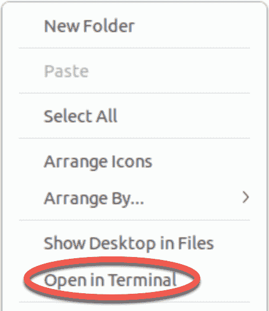
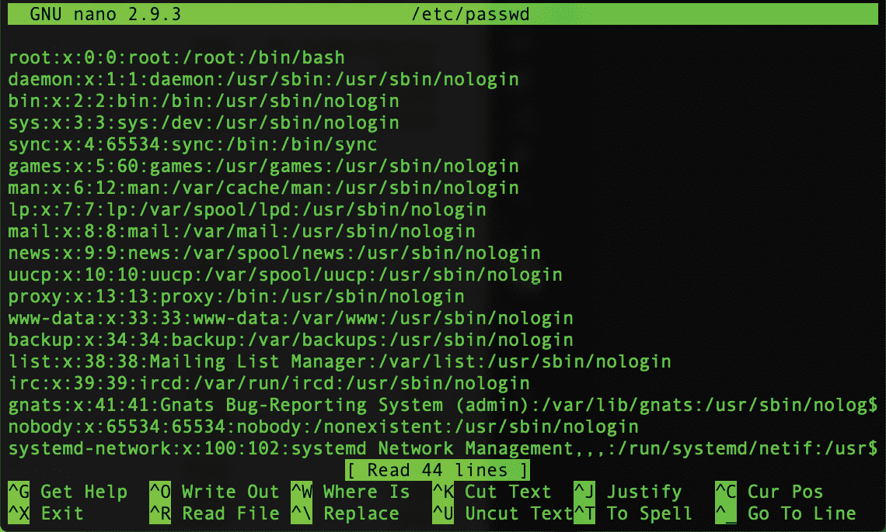
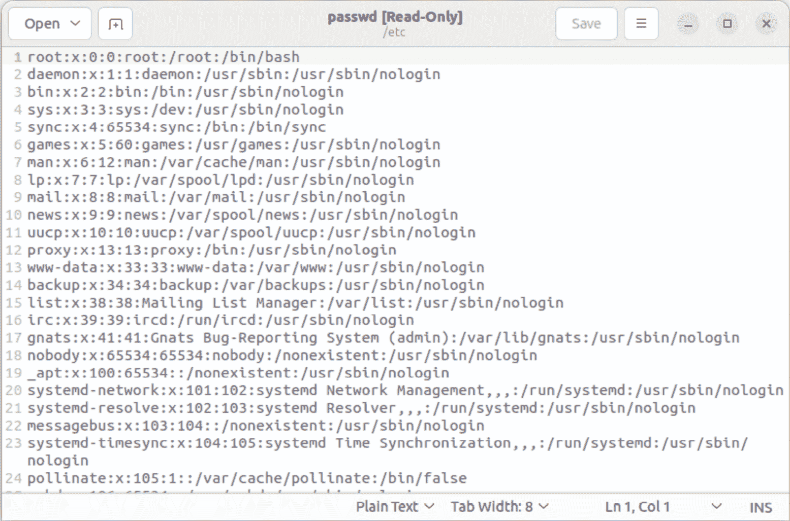

1\. 介绍

Ubuntu 无疑是当今最受推崇和广泛使用的 Linux 发行版之一。因其易用性和可靠性而广受赞誉，Ubuntu 还拥有一批忠实的 Linux 用户和一个活跃的开发者社区。

《Ubuntu 23.04 基础教程》旨在提供关于 Ubuntu 发行版的安装、使用和管理的详细信息。对于初学者，本书涵盖了操作系统安装、GNOME 桌面环境基础、配置电子邮件和 Web 服务器、安装软件包和系统更新等主题。还涵盖了其他安装主题，如与 Microsoft Windows 双系统启动，以及所有重要的安全主题，如配置防火墙和用户及组管理。

对于有经验的用户，本书详细介绍了远程桌面访问、Cockpit Web 界面、逻辑卷管理（LVM）、磁盘分区、交换区管理、KVM 虚拟化、Secure Shell（SSH）、Linux 容器以及使用 Samba 和 NFS 的文件共享等主题，提供了对这一企业级操作系统的全面概述。

1.1 超级用户约定

Ubuntu 与一般 Linux 系统一样，具有两种类型的用户账户，一种是具有访问操作系统许多管理文件和功能限制的标准用户账户，另一种是具有提升权限的超级用户（root）账户。通常，用户可以通过以 root 用户身份登录或使用 su - 命令并输入 root 密码来获得 root 访问权限。在以下示例中，用户通过 su - 命令获得 root 访问权限：

[demo@demo-server ~]$ su -

密码：

[demo@demo-server ~]#

请注意，普通用户的命令提示符以 $ 符号结束，而 root 用户的命令提示符以 # 符号结束。在使用命令行时，这是判断您当前是否作为 root 用户发出命令的有用标志。

如果 su - 命令失败，系统上的 root 账户很可能已因安全原因被禁用。在这种情况下，可以使用 sudo 命令，如下所示。

使用 sudo，非 root 用户也可以执行需要 root 权限的单个命令。考虑以下使用最新补丁和软件包更新操作系统的尝试：

$ apt update

正在读取软件包列表... 完成

E: 无法打开锁定文件 /var/lib/apt/lists/lock - open (13: 权限被拒绝)

可选地，用户账户可以配置为具有 root 级别权限。这样，用户账户可以通过 sudo 运行本应受到限制的命令，而无需先使用 su - 命令获得 root 访问权限：

$ sudo apt update

[sudo] demo 的密码：

Hit:1 http://us.archive.ubuntu.com/ubuntu bionic InRelease

.

.

若要在不反复使用 sudo 命令的情况下执行多个命令，可以通过以下方式访问具有持久超级用户权限的命令提示符：

[demo@demo-server]$ sudo su -  

[demo@demo-server]#  

提出这个问题的原因是在本书的很多命令行示例中都需要 root 权限。为了避免每次都在命令行示例前面重复指示以 root 身份运行命令，我们将使用行首的命令提示符来指示命令是否需要以 root 身份执行。如果命令可以作为普通用户执行，命令前将使用 $ 命令提示符，如下所示：

$ date  

如果需要 root 权限执行命令，则命令前会出现 # 命令提示符：  

# apt install openssh-server  

1.2 打开终端窗口  

如果你使用的是 GNOME 桌面环境，并需要访问命令提示符，则需要打开一个终端窗口。可以通过右键点击桌面背景并选择“在终端中打开”菜单选项来实现，如图 1-1 所示：  

  

图 1-1  

在 GNOME 桌面环境中，也可以通过使用 Ctrl-Alt-T 快捷键来打开终端窗口。  

1.3 编辑文件  

配置 Linux 系统通常涉及编辑文件。对于 Linux 新手来说，可能不清楚该使用哪种编辑器。如果你正在运行终端会话并且没有已经偏好的编辑器，我们推荐使用 nano 编辑器。在终端窗口中启动 nano，可以输入以下命令：  

# nano <file>  

其中，<file> 是你希望编辑的文件的路径。例如：  

# nano /etc/passwd  

加载完成后，nano 会如图 1-2 所示出现：  

  

图 1-2  

要创建一个新文件，可以按如下方式运行 nano：  

# nano  

编辑文件完成后，按 Ctrl-S 保存文件，然后按 Ctrl-X 退出。要打开现有文件，可以使用 Ctrl-R 快捷键。  

如果你更喜欢在 GNOME 桌面环境中使用图形编辑器，gedit 是一个非常适合用于基本编辑任务的起点。要从桌面启动 gedit，按 Alt-F2 打开“输入命令”窗口，如图 1-3 所示：  

  

图 1-3  

在文本框中输入 gedit，然后按回车键。稍等片刻，gedit 会加载并准备好打开、创建和编辑文件：  

  

图 1-4  

另外，也可以通过终端窗口启动 gedit，带或不带文件路径都可以：  

# gedit  

# gedit /etc/passwd  

1.4 反馈  

我们希望你对购买本书感到满意。如果你发现本书中有任何错误，或有任何意见、问题或顾虑，请通过 feedback@ebookfrenzy.com 联系我们。  

1.5 勘误  

虽然我们尽最大努力确保本书内容的准确性，但由于本书涉及的主题领域庞大且复杂，难免会出现一些错误和疏漏。任何已知的问题都将在以下网址列出，并提供解决方案：

[`www.ebookfrenzy.com/errata/Ubuntu2304.html`](https://www.ebookfrenzy.com/errata/ubuntu2304.html)

如果您发现有未在勘误表中列出的错误，请通过电子邮件将问题告知我们的支持团队：feedback@ebookfrenzy.com。
