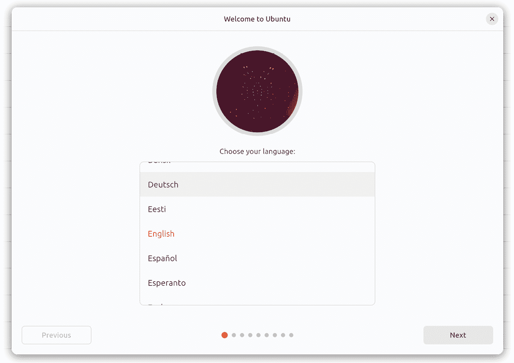
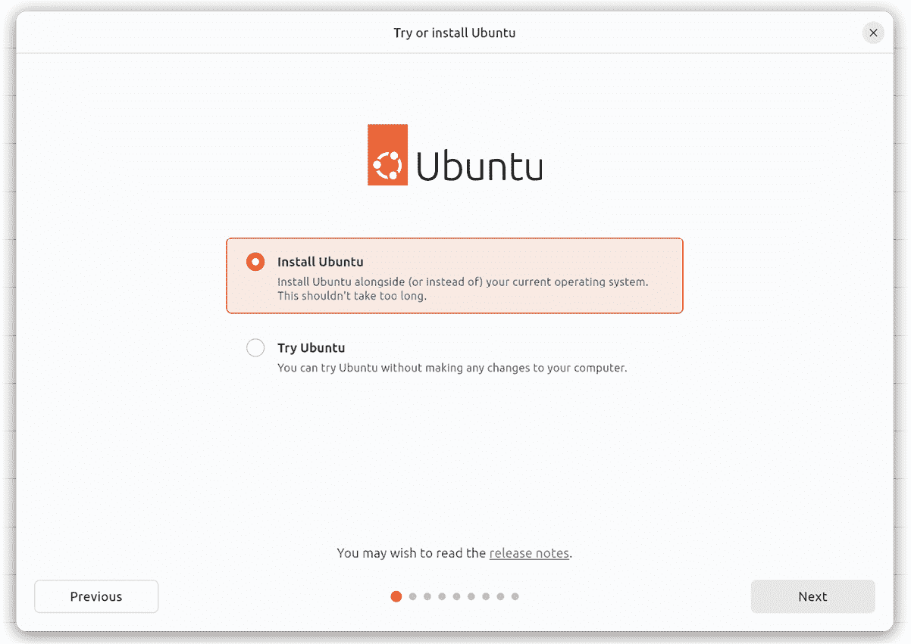
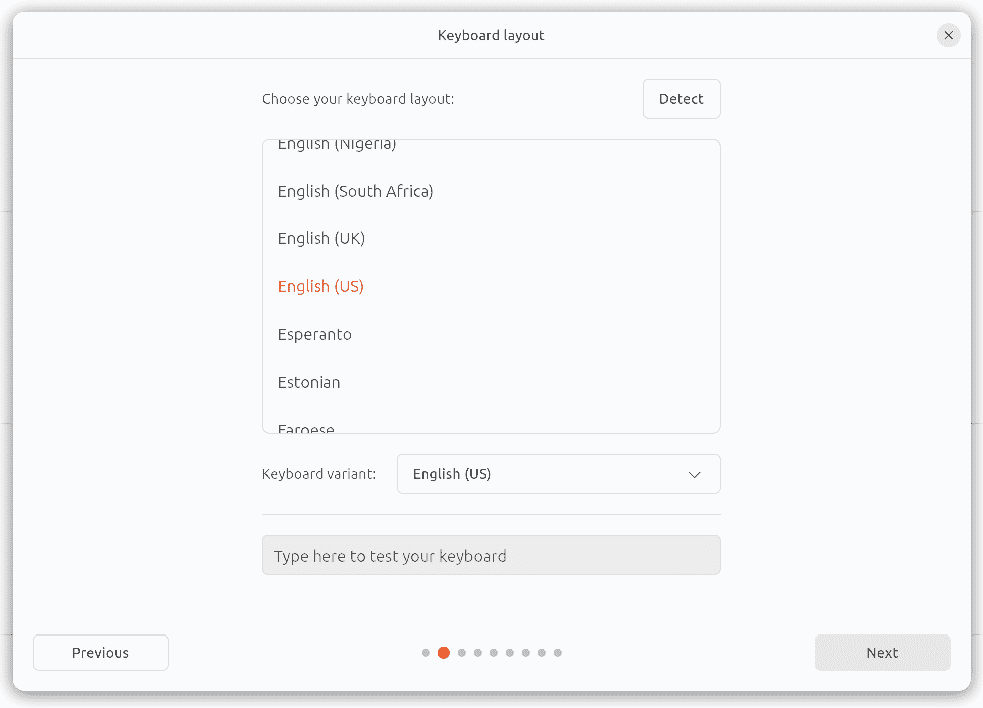
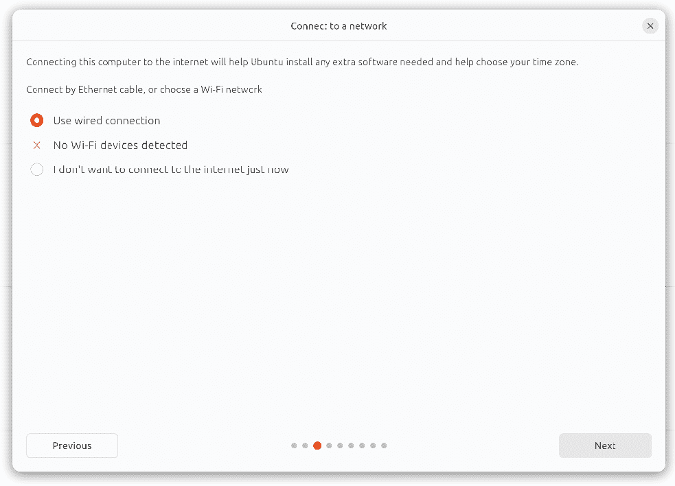
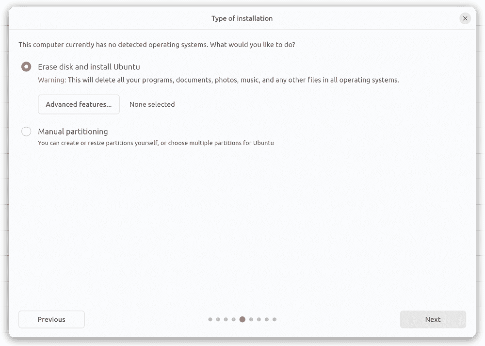

3\. 在干净的磁盘驱动器上安装 Ubuntu

现在有三种方法可以部署 Ubuntu 系统。一种方法是购买新硬件或重新利用现有计算机系统，在其上安装和运行操作系统。另一种方法是使用虚拟化平台，如 VirtualBox 或 VMware，在现有操作系统内部安装和运行 Ubuntu 虚拟机。另一种选择是使用像 Amazon AWS、Google Cloud 或 Microsoft Azure 这样的服务创建基于云的操作系统实例。由于云端实例通常是通过选择预配置、准备运行的操作系统映像来创建的，这些映像已经针对云平台进行了优化，并将其用作 Ubuntu 系统的基础，因此在这种情况下无需执行手动操作系统安装。

另一方面，如果您计划在自己的硬件上安装 Ubuntu 或者使用虚拟化环境，了解 Ubuntu 的第一步是安装操作系统。

Ubuntu 可以在干净的磁盘环境（清除任何现有分区并完全专用于 Ubuntu 的整个磁盘）或双启动环境中安装，在后者中，Ubuntu 与磁盘上的另一个操作系统共存（通常是 Microsoft Windows 系列的成员）。

在本章中，我们将介绍从本地或远程安装媒体进行安装的清空磁盘方法。Windows 10 系统的双启动安装将在《使用 Windows 双启动 Ubuntu》中介绍。

3.1 Ubuntu 安装选项

Ubuntu 可以免费从以下网页下载：

[`ubuntu.com/download`](https://ubuntu.com/download)

此页面根据操作系统的安装和使用方式提供了多个下载选项：

•Ubuntu 桌面版 - 下载操作系统桌面版的安装媒体。此版本适用于需要图形桌面环境的台式机和笔记本电脑系统，仅支持 64 位 x86 系统。桌面版可以以 ISO 镜像的形式下载，然后您可以按照本章节后面介绍的步骤将其写入 USB 驱动器。启动时，桌面媒体将允许您通过运行 Live Ubuntu 会话来测试 Ubuntu，在执行安装之前。

•Ubuntu Server - 下载用于操作系统服务器版的 Live Server ISO 安装介质。该镜像适用于在不需要图形桌面环境的服务器上进行安装，适用于 x86、ARM、IBM POWER（PowerPC）和 s390x（IBM System z 主机）系统。安装介质不包括在安装前尝试 Ubuntu 的选项，而是使用基于文本的安装程序，而非用于 Ubuntu 桌面的图形安装程序。这使得 Ubuntu 可以在没有图形控制台的系统上安装。

Ubuntu Server 镜像也可以用于执行预启动执行环境（PXE）网络安装。在使用 PXE 安装 Ubuntu 时，Ubuntu 镜像会被安装到一个特别配置的服务器上（称为 PXE 启动服务器）。然后，待安装 Ubuntu 的客户端系统被配置为通过网络从 PXE 启动服务器上的镜像启动（前提是客户端硬件支持 PXE），以启动安装过程。

3.2 服务器版与桌面版

很明显，在开始安装之前，需要在桌面版和服务器版镜像之间做出选择。如果你想在安装之前先尝试 Ubuntu，那么桌面版是最佳选择，因为它允许你从安装介质启动 Ubuntu，而无需先将其安装到硬盘上。这个选项还允许在 live 会话中启动安装。

如果不需要图形桌面环境，并且目标系统没有互联网访问或图形控制台，那么推荐使用 Live Server ISO 镜像，因为它可以在不需要下载任何额外软件包的情况下构建一个完全功能的服务器。

无论选择哪种安装方法，安装后都可以向系统添加或删除软件包，以将系统配置为满足特定需求。

3.3 获取 Ubuntu 安装介质

本章的目的，是通过图形化安装程序安装 Ubuntu 桌面环境。因此，首先从以下网址下载 Ubuntu 桌面 23.04 的 ISO 镜像：

[`ubuntu.com/download/desktop`](https://ubuntu.com/download/desktop)

DVD ISO 镜像是自包含的，包含了安装 Ubuntu 系统所需的所有软件包，并使用以下约定命名：

ubuntu-<version>-<edition>-<architecture>.iso

例如，Ubuntu 23.04 桌面版 ISO 镜像用于 64 位 Intel/AMD 系统，其命名如下：

ubuntu-23.04-desktop-amd64.iso

下载完镜像后，可以将其刻录到光盘上，或者使用下一部分的步骤将介质写入 USB 驱动器，并配置你的虚拟化环境以将其视为 DVD 驱动器。

3.4 将 ISO 安装镜像写入 USB 驱动器

如今，从 USB 驱动器安装操作系统比从 DVD 安装的可能性更大。在下载了 Ubuntu 的 ISO 安装镜像后，写入镜像到 USB 驱动器的步骤会根据驱动器连接到 Linux、macOS 或 Windows 系统而有所不同。本节接下来的步骤假设 USB 驱动器是新的，或者已经重新格式化以删除任何现有的数据或分区：

3.4.1 Linux

在 Linux 上写入 ISO 镜像到 USB 驱动器的第一步是识别设备名称。在插入 USB 驱动器之前，通过如下命令列出系统上已检测到的存储设备：

# 第三章：ls /dev/sd*

/dev/sda /dev/sda1 /dev/sda2

将 USB 驱动器连接到 Linux 系统，并运行 dmesg 命令以获取最近的系统消息列表，其中一条将报告检测到 USB 驱动器，类似以下内容：

[445597.988045] sd 6:0:0:0: [sdb] 附加的 SCSI 可移动磁盘

这个输出告诉我们，设备名称应该包含 "sdb"，我们可以通过再次列出 /dev 中的设备名称来确认这一点：

# ls /dev/sd*

/dev/sda /dev/sda1 /dev/sda2 /dev/sdb

从这个输出中，我们可以看出 USB 驱动器已分配到 /dev/sdb。在将 ISO 镜像写入设备之前，下一步是运行 findmnt 命令以确保它没有被自动挂载：

# findmnt /dev/sdb?

目标 来源 文件系统类型 选项

/media/demo/C24E-6727 /dev/sdb1 vfat rw,nosuid,nodev, ...

如果 findmnt 命令显示 USB 驱动器已挂载，继续操作前请先卸载它：

# umount /media/demo/C24E-6727

一旦文件系统被卸载，使用 dd 命令如下所示将 ISO 镜像写入驱动器：

# dd if=/path/to/iso/<image name>.iso of=/dev/sdb bs=512k

写入过程可能需要一些时间（最长 10 - 15 分钟），具体时间取决于镜像大小和运行系统的速度。写入完成后，类似以下的输出将会出现，USB 驱动器已准备好用于安装 Ubuntu：

4056+1 条记录输入

4056+1 条记录输出

2126544896 字节（2.1 GB，2.0 GiB）已复制，625.911 秒，3.4 MB/s

3.4.2 macOS

在 macOS 系统中，写入 ISO 镜像到 USB 驱动器的第一步是使用 diskutil 工具识别设备。在连接 USB 设备之前，打开终端窗口并运行以下命令：

$ diskutil list

/dev/disk0（内部，物理）：

#: 类型 名称 大小 标识符

0: GUID 分区方案 *1.0 TB disk0

1: EFI EFI 209.7 MB disk0s1

2: Apple_APFS 容器 disk2 1000.0 GB disk0s2

/dev/disk1（内部）：

#: 类型 名称 大小 标识符

0: GUID 分区方案 28.0 GB disk1

1: EFI EFI 314.6 MB disk1s1

2: Apple_APFS 容器 disk2 27.7 GB disk1s2

/dev/disk2（合成）：

#: 类型 名称 大小 标识符

0: APFS 容器方案 - +1.0 TB disk2

物理存储 disk1s2, disk0s2

1: APFS 卷 Macintosh HD 473.6 GB disk2s1

2: APFS 卷 Preboot 42.1 MB disk2s2

3: APFS 卷 恢复 517.0 MB disk2s3

4: APFS 卷 VM 1.1 GB disk2s4

确定检测到的设备基准后，将 USB 驱动器插入 macOS 系统的端口并再次运行该命令。应出现相同的结果，且 USB 驱动器将显示为额外的条目，如下所示：

/dev/disk3（外部，物理）：

#: 类型 名称 大小 标识符

0: *16.0 GB disk3

在上述示例中，USB 驱动器已分配给/dev/disk3。继续操作前，请按如下方式卸载磁盘：

$ diskutil unmountDisk /dev/disk3

成功卸载 disk3 上的所有卷

最后，使用 dd 命令将 ISO 镜像写入设备，确保引用原始磁盘设备（/dev/rdisk3），并在提示时输入您的用户密码：

$ sudo dd if=/path/to/iso/image.iso of=/dev/rdisk3 bs=1m

一旦镜像写入完成，USB 驱动器已准备好。

3.4.3 Windows/macOS

有多个免费工具可供 Windows 和 macOS 使用，能够将 ISO 镜像写入 USB 驱动器，但专门为写入 Linux ISO 镜像而编写的工具是 Fedora Media Writer，您可以从以下网址下载：

https://getfedora.org/en/workstation/download/

安装完成后，插入目标 USB 驱动器，启动写入工具，选择图 3-1 中突出显示的“选择.iso 文件”选项：

图 3-1

点击“下一步”继续到写入选项屏幕，并选择 USB 驱动器，然后点击“选择...”按钮：

图 3-2

在弹出的文件选择对话框中，导航并选择 Ubuntu 安装 ISO 镜像，然后点击“打开”按钮。最后，点击“写入”按钮以开始将镜像写入 USB 驱动器：

图 3-3

一旦镜像写入完成，设备就准备好进行安装。

3.5 从 Ubuntu USB 镜像启动

将 Ubuntu 安装介质插入适当的驱动器并启动系统。如果系统尝试从硬盘驱动器启动，您需要进入计算机的 BIOS 设置，并更改启动顺序，以便首先从安装介质驱动器启动。初始启动序列完成后，GRUB 菜单将显示在图 3-4 中：

图 3-4

使用方向键选择“尝试或安装 Ubuntu”菜单选项，然后按下回车键以启动 Ubuntu Live 会话。Ubuntu 完全启动后，下面将显示图 3-5 所示的窗口：

图 3-5

选择您偏好的语言，然后点击“下一步”按钮。在下一个屏幕中，提供了尝试 Ubuntu Live 会话或开始安装过程的选项：

3.6 安装 Ubuntu

选择“安装 Ubuntu”选项，然后点击“下一步”按钮，进入键盘布局屏幕：

图 3-6

请选择您的键盘布局，或者，如果不确定，可以点击“检测”按钮，按照一些步骤来识别您的键盘，然后点击“下一步”选择安装过程中使用的网络连接：

图 3-7

在下一个屏幕上，选择执行常规安装或最小安装：

图 3-8

如果您有充足的磁盘空间，并希望探索包含在 Ubuntu 中的主要应用程序和工具而无需以后手动安装它们，请选择“常规”选项。或者，为了避免在系统中堆积可能永远不需要的软件，请选择“最小”选项。不管您选择哪种选项，未来随时可以轻松安装或卸载所有提供的 Ubuntu 软件。

该选项还可以在安装过程中更新包含在 Ubuntu 发行版中的软件包。Ubuntu，与大多数积极支持的操作系统一样，在发布给公众后会继续进行更新，修复错误和安全漏洞。如果选择此选项且系统已连接到互联网，安装程序将在安装过程中下载自 Ubuntu 安装镜像发布以来发布的所有更新，并将其应用到系统中。如果你选择在安装过程中不进行此更新，这些更新仍然可以在安装完成后随时应用。

第二个选项提供了是否安装第三方非开源软件的选择，用以支持特定硬件设备和播放专有媒体文件。一些用户强烈反对使用任何未发布在公共许可证下的软件。如果你是其中之一，那么请不要选择此选项。另一方面，如果你只希望获得最佳的 Ubuntu 安装体验，那么推荐选择此选项。

在做出适当选择后，点击“下一步”按钮，进入磁盘分配屏幕：

图 3-9

假设这是一个没有现有操作系统的新磁盘，安装程序将提供擦除整个磁盘并将其用于 Ubuntu 的选项（在这种情况下，安装程序将计算并实施典型的推荐分区布局）。或者，若要定义自己的自定义磁盘布局，请选择“手动分区”选项，手动创建并调整包含操作系统和数据的磁盘分区。

点击“高级功能...”按钮将提供使用逻辑卷管理（LVM）的选项。强烈推荐使用 LVM，以便更容易管理系统上的磁盘和分区，详细内容请参阅章节“为 Ubuntu 23.04 卷组和逻辑卷添加新磁盘”：

图 3-10

如果数据安全性至关重要，请选择加密 Ubuntu 安装选项。如果选择此选项，下一屏幕将提示您选择一个安全密钥，每次系统启动时都需要输入该密钥。

在此示例中，选择使用 LVM 选项并点击确定。

一旦做出选择，请点击“下一步”按钮以查看磁盘分区信息：

图 3-11

点击安装按钮开始安装。在安装过程中，安装程序会询问您的地理位置，以配置时区设置：

图 3-12

接下来，安装程序将要求您为系统上的第一个账户提供用户名和密码：

图 3-13

该选项还提供了是否每次用户希望登录系统时都必须输入密码的设置。默认情况下，每次启动 Ubuntu 时，系统都会出现登录界面，要求输入用户名和密码。如果您是系统的唯一用户，并希望跳过此屏幕，每次系统启动时自动登录，请确保在继续之前关闭“登录时需要我的密码”选项。

一旦所有问题都已回答，安装程序将继续安装。根据系统的速度，以及是否选择在安装过程中下载更新，此过程可能需要一些时间。要查看安装程序正在执行的详细步骤，请点击图 3-14 中高亮显示的按钮：

图 3-14

安装完成后，弹出窗口会更新，告知您系统已准备好重启：

图 3-15

当您准备好重启时，点击“立即重启”按钮。安装程序可能会提示您移除安装介质，系统将花费几秒钟关闭。在此时，请移除 USB 闪存驱动器并按回车键继续。

3.7 访问 Ubuntu 桌面

系统启动后，如果启用了密码要求选项，则会出现 GNOME 显示管理器（GDM）登录界面（图 3-16）。要访问系统，请选择用户名并输入在安装过程中设置的密码：

图 3-16

或者，如果安装时配置为直接登录到桌面，系统重启后将显示 GNOME 桌面（如图 3-17 所示）：

图 3-17

3.8 安装更新

与如今大多数操作系统一样，每个 Ubuntu 发行版在发布后会继续演变。这通常表现为修复错误和安全更新，并偶尔会有新特性，可以通过互联网下载并安装到系统上。

最佳实践建议，在安装 Ubuntu 后的第一步是确保应用所有可用的更新。当有更新时，软件更新器将显示以下对话框，用户可以从中安装更新：

图 3-18

还可以通过终端窗口的命令行提示符使用 apt 包管理器工具安装更新。要检查是否有可用的更新，右键点击桌面背景，在弹出的菜单中选择“在终端中打开”选项：

图 3-19

在终端窗口中，运行以下命令以获得 root 权限并更新包列表：

$ sudo su -

# apt update

如果有可用的更新包，命令将显示类似以下的输出：

.

.

.

正在读取包列表... 完成

正在构建依赖树

正在读取状态信息... 完成

220 个包可以升级。运行 'apt list --upgradable' 查看它们。

可以使用 apt 工具应用任何待处理的更新：

# apt upgrade

执行时，apt 工具会提供可用更新包的列表，并提示是否执行更新：

220 个升级，7 个新安装，0 个待移除，0 个未升级。

需要获取 75.2 MB/286 MB 的档案。

完成此操作后，将使用 34.8 MB 的额外磁盘空间。

是否继续？[Y/n]

一旦升级完成，安装基本上就结束了。

3.9 显示启动信息

在启动过程中，系统将显示 Ubuntu 启动画面，这会隐藏系统加载时生成的所有启动信息。要在启动过程中使这些信息可见（如图 3-20 所示），只需在系统启动时按下键盘上的 Esc 键：

图 3-20

默认行为可以通过编辑 /etc/default/grub 文件并修改 GRUB_CMDLINE_LINUX 设置来更改，默认情况下该设置如下所示：

GRUB_CMDLINE_LINUX="... rhgb quiet"

如果你是 Linux 新手，且不熟悉可用的编辑器，请参考“简介”章节中概述的编辑器推荐。例如，要使用 nano 编辑器，输入以下命令以启动编辑器并加载 grub 文件：

# nano /etc/default/grub

要移除图形启动屏幕，以便在不按 Esc 键的情况下看到消息，请从设置中移除“splash”和“quiet”选项：

GRUB_CMDLINE_LINUX=""

此更改将导致系统显示所有由系统生成的启动消息。

一旦做出更改，运行以下命令以生成新的启动配置，并使其在下次系统启动时生效：

# grub-mkconfig --output=/boot/grub/grub.cfg

3.10 摘要

使用 Ubuntu 的第一步是安装操作系统。在云服务器的情况下，当为系统选择操作系统镜像时，这个任务通常会由云服务提供商自动完成，具体取决于提供的选项范围。然而，在自己的硬件上或在虚拟机中安装时，涉及到下载以 ISO 镜像形式提供的安装介质，将该镜像写入适当的存储设备（如 DVD 或 USB 驱动器），并从中启动。安装完成后，重要的是安装任何可能自最初安装镜像创建以来发布的操作系统更新。
