4. 双重启动 Ubuntu 与 Windows

Ubuntu 就像大多数 Linux 发行版一样，可以与任何版本的 Windows 在同一硬盘驱动器上共存。这种概念被称为双重启动。实质上，当你启动电脑时，会显示一个菜单，提供启动 Ubuntu 或 Windows 的选项。显然，你一次只能运行一个操作系统，但值得注意的是，不管你的 Windows 分区是使用 NTFS、FAT16 还是 FAT32 格式化的，Ubuntu 都能访问 Windows 分区上的文件。

在安装过程中，Ubuntu 安装程序将检测硬盘上的 Windows 安装，并提供删除 Windows 安装并使用整个磁盘安装 Ubuntu，或者与 Windows 共享磁盘的选项。在后者的情况下，你可以指定用于 Ubuntu 的磁盘百分比。

根据 Ubuntu 文档，完整的 Ubuntu Desktop 版安装至少需要 25 GB 的磁盘空间，还需要更多空间存储你以后可能创建的文件。一旦选择了用于 Ubuntu 的磁盘空间，安装程序将调整 Windows 分区的大小（不会破坏任何数据），并使用剩余的磁盘空间安装 Ubuntu。

本章将演示如何设置一个与 Windows 10 共存的双重启动系统，如何更改开机时默认启动的系统，以及如何在 Ubuntu 中访问硬盘上 Windows 分区中的文件。

本章假设已按照前一章中的步骤，使用 Ubuntu Desktop 安装镜像创建了一个可启动的 Ubuntu 安装 USB 驱动器，并且系统已配置为在启动时从 USB 驱动器启动。

4.1 开始 Ubuntu 安装

将 Ubuntu 安装介质插入适当的驱动器并启动系统。如果系统启动了 Windows，你需要进入电脑的 BIOS 设置，修改启动顺序，使其从安装介质驱动器优先启动。完成初始启动顺序后，将显示图 4-1 所示的 GRUB 菜单：

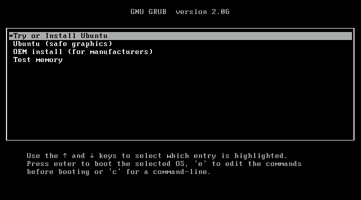

图 4-1

使用箭头键选择“试用或安装 Ubuntu”菜单选项，然后按 Enter 键进入 Ubuntu 实时会话。Ubuntu 启动完成后，下面将显示图 4-2 所示的窗口：

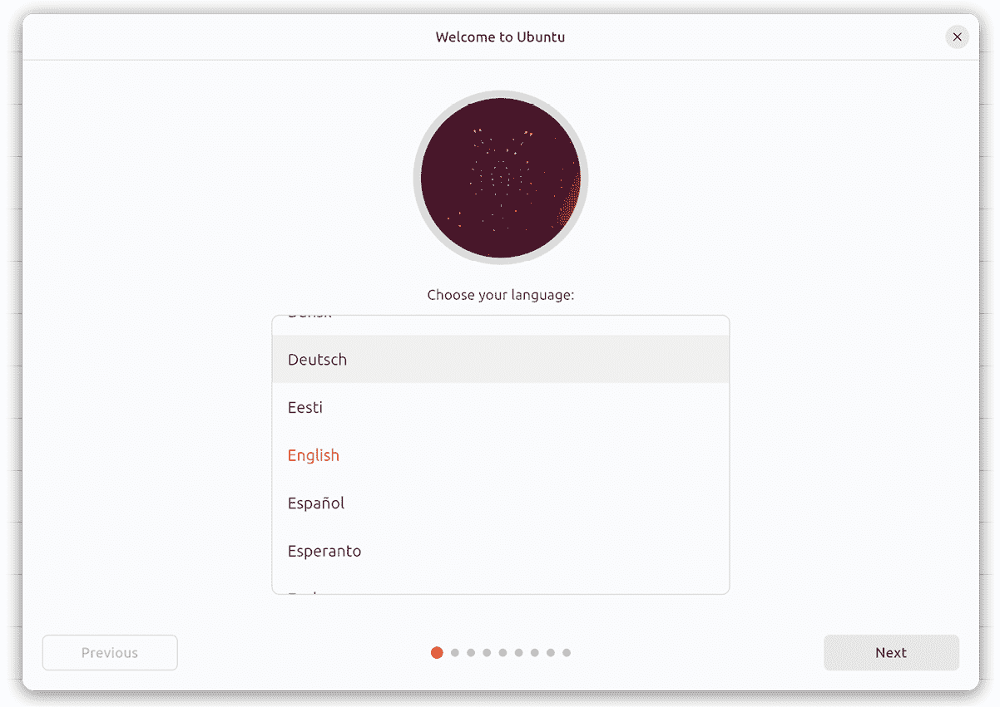

图 4-2

选择你偏好的语言，然后点击“下一步”按钮。在下一个屏幕上，提供了选择试用 Ubuntu 实时会话或开始安装过程的选项：

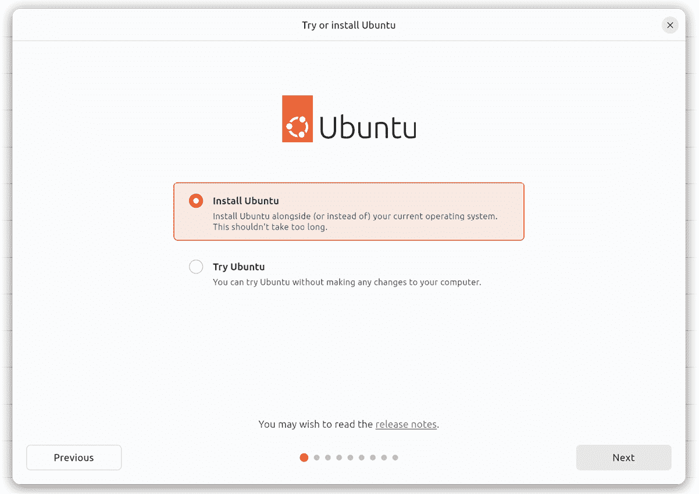

图 4-3

4.2 安装 Ubuntu

选择“安装 Ubuntu”选项，然后点击“下一步”按钮继续到键盘布局屏幕：

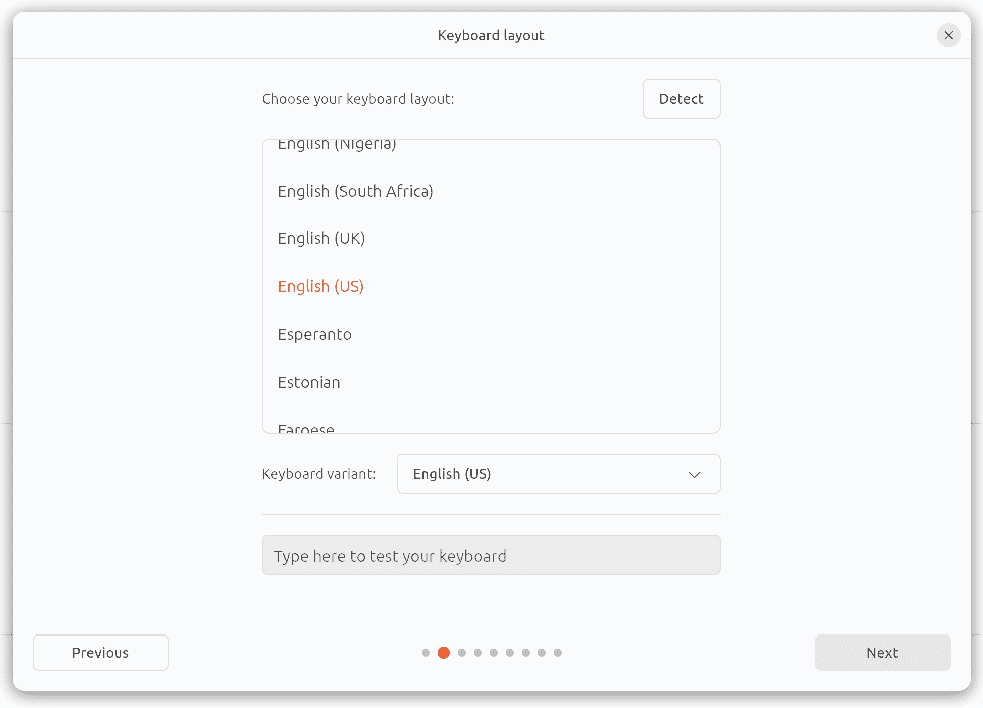

图 4-4

选择您的键盘布局，或者如果不确定，请点击“检测”按钮，按照一些步骤识别您的键盘，然后点击“下一步”选择安装过程中使用的网络连接：

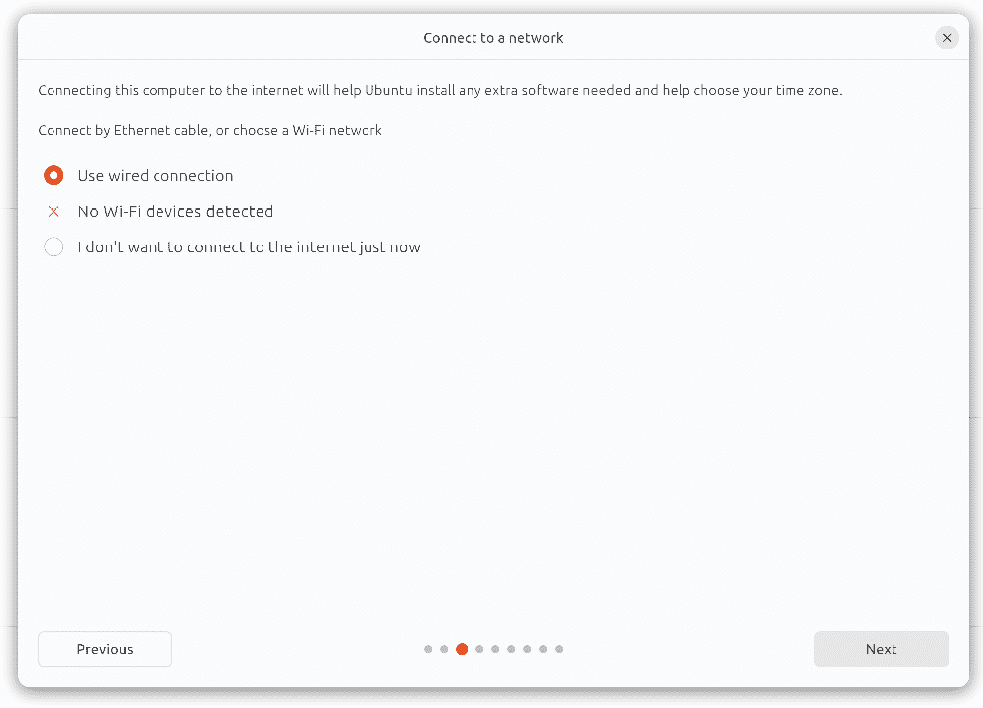

图 4-5

在下一个屏幕上，选择执行“正常安装”还是“最小安装”：

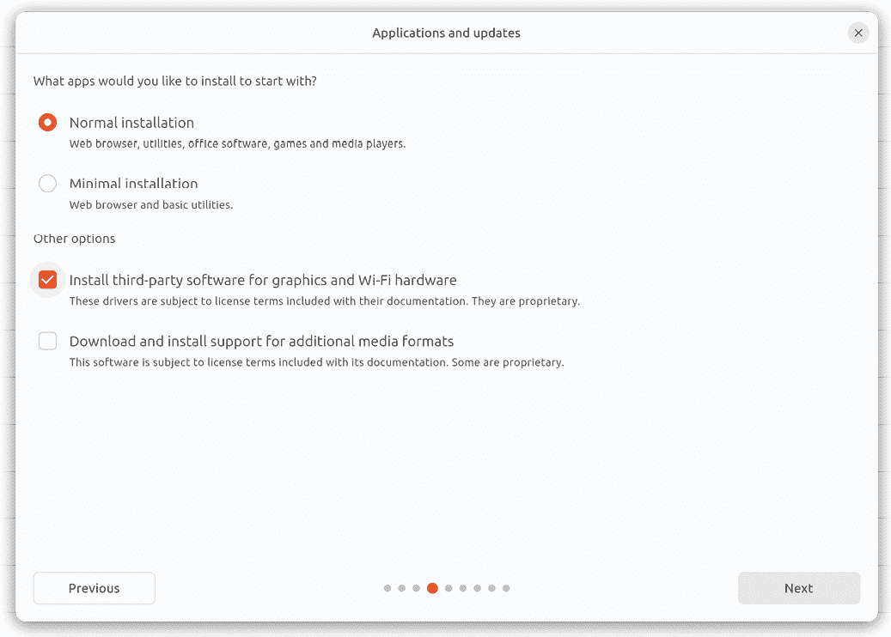

图 4-6

如果您有足够的磁盘空间，并且希望探索 Ubuntu 包含的主要应用程序和工具而不必在以后手动安装，请选择“正常安装”选项。或者，如果您不希望系统中充满可能永远用不到的软件，请选择“最小安装”选项。无论选择哪种方式，Ubuntu 提供的所有软件在将来都可以轻松安装或移除。

该选项还可以在安装过程中更新 Ubuntu 发行版中包含的软件包。与大多数积极支持的操作系统一样，Ubuntu 在发布给公众后，仍然会继续发布包含错误修复和安全补丁的更新。如果选择此选项并且系统已连接到互联网，安装程序将在安装过程中下载自 Ubuntu 安装镜像发布以来发布的所有更新并应用到系统中。如果您选择在安装过程中不执行此更新，这些更新仍可以在安装完成后随时应用。

第二个选项提供了是否安装第三方非开源软件以支持特定硬件设备和播放专有媒体文件的选择。一些用户强烈反对使用任何不是公开许可证下发布的软件。如果您是其中之一，请不要选择此选项。如果您希望从 Ubuntu 安装中获得最佳体验，则推荐选择此选项。

进行适当选择后，点击“下一步”按钮，进入磁盘分配屏幕：

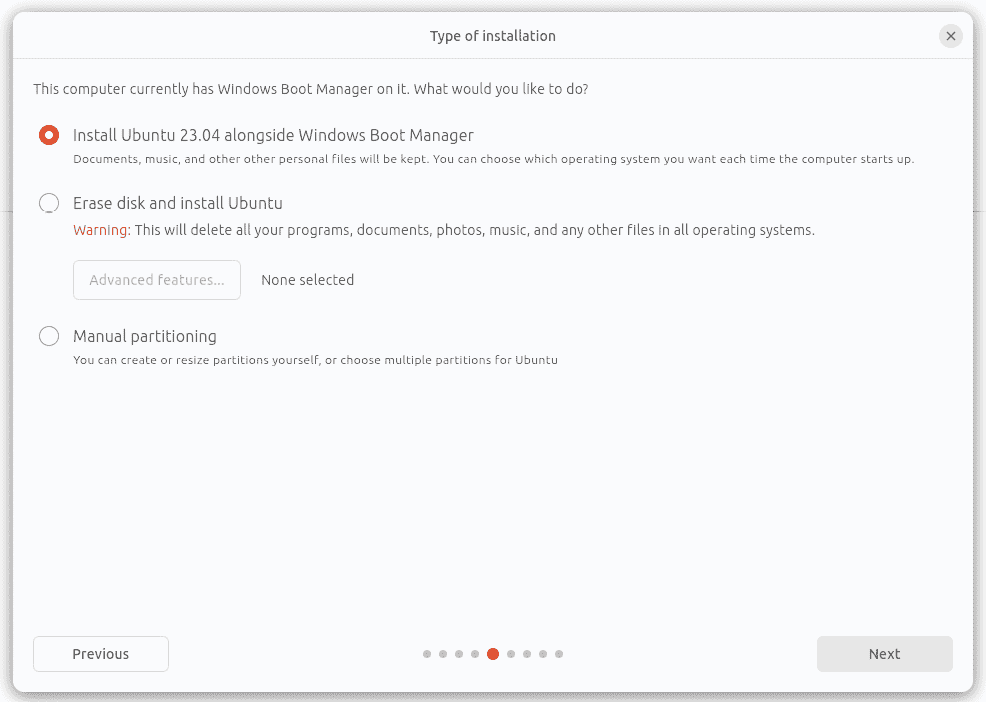

图 4-7

由于我们的目标是配置一个双重启动系统，选择“在 Windows 引导管理器旁边安装 Ubuntu”是理想的选择。选择此选项后，点击“继续”按钮继续操作。随后的屏幕允许配置每个操作系统（在此情况下是 Windows 和 Ubuntu）分配的磁盘空间：

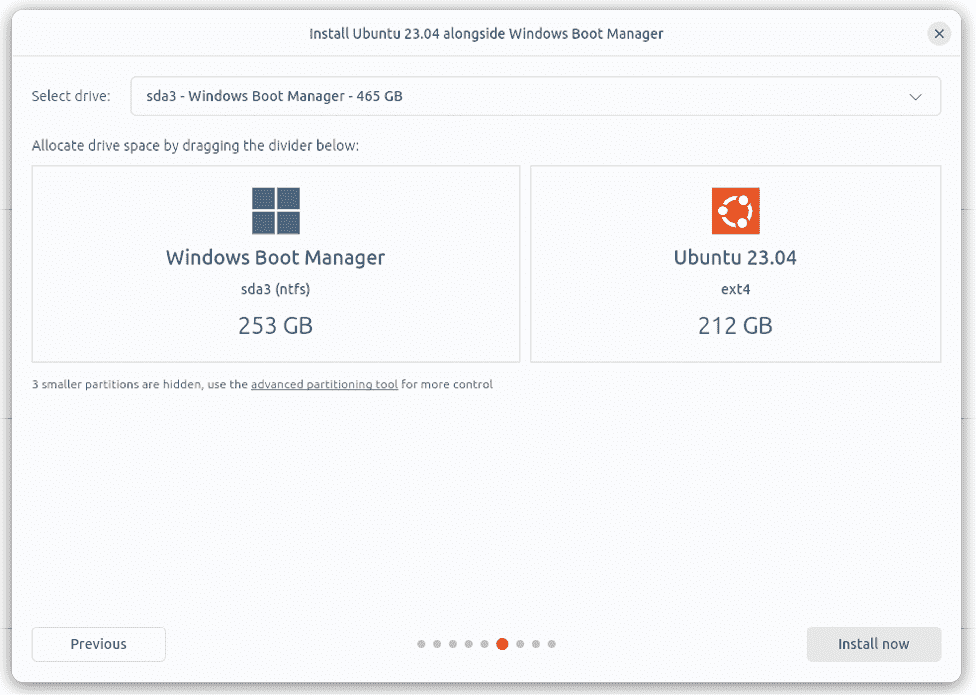

图 4-8

在此时，您必须决定要为 Ubuntu 安装捐赠多少 Windows 分区空间。在图示中，移动滑块（位于 Windows 和 Ubuntu 分区之间），直到 Ubuntu 分区的大小满足您的需求。至少需要为完整的 Ubuntu 桌面安装提供 25GB 的空间。

完成选择后，点击“下一步”按钮以查看磁盘分区信息：

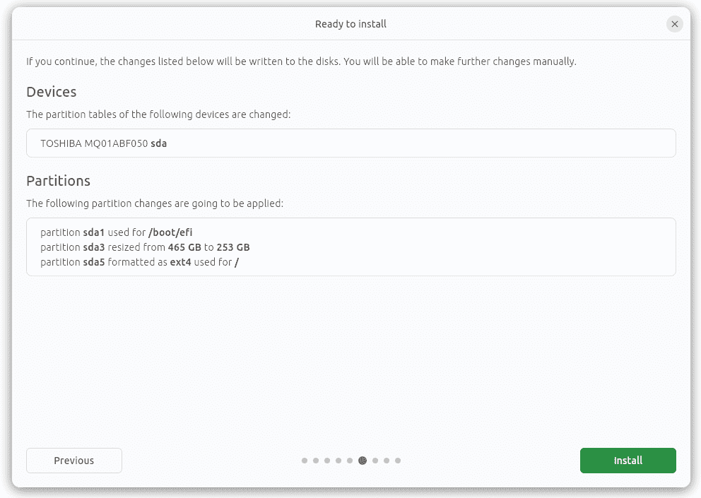

图 4-9

点击“安装”按钮以开始安装。安装过程中，安装程序将询问你的地理位置，以便配置时区设置：

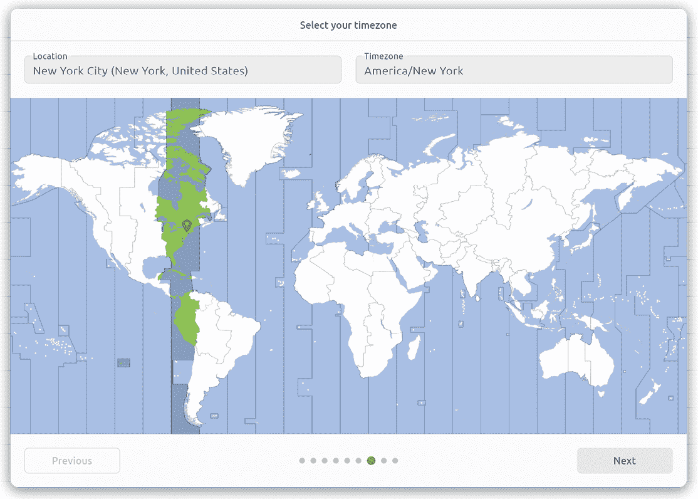

图 4-10

接下来，安装程序会要求你为系统上的第一个账户提供用户名和密码：

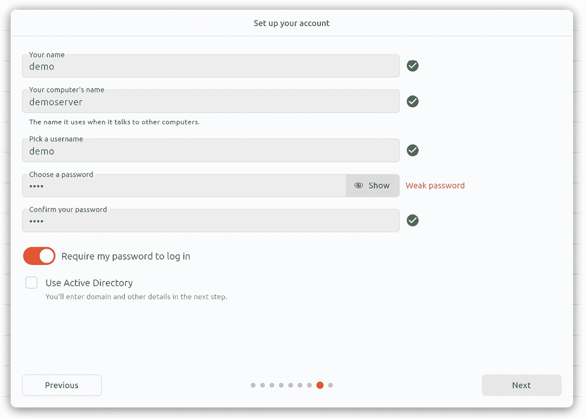

图 4-11

还提供了一个选项来决定每次用户希望登录系统时是否需要指定密码。默认情况下，每次 Ubuntu 启动时，都会显示一个登录屏幕，要求输入用户名和密码。如果你是系统的唯一用户，并且希望跳过此屏幕，每次系统启动时都能自动登录，请确保在继续操作之前关闭“需要我的密码登录”开关。

一旦所有问题都回答完毕，安装程序将继续进行安装。根据系统的速度以及是否选择在安装过程中下载更新，这一过程可能需要一些时间。若要更详细地查看安装程序正在执行的步骤，请点击图 4-12 中高亮显示的按钮：

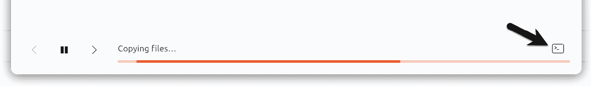

图 4-12

安装完成后，弹出对话框将更新，告知你系统已经准备好重新启动：

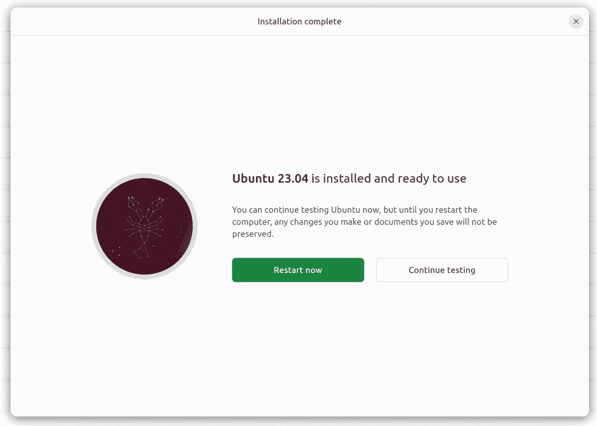

图 4-13

当你准备好重启时，点击“立即重启”按钮。安装程序可能会提示你移除安装介质，系统将在几秒钟内关闭。此时，移除 USB 闪存驱动器并按下 Enter 键继续。

当你准备好重启时，点击“立即重启”按钮。安装程序可能会提示你移除安装介质，系统将在几秒钟内关闭。此时，移除 USB 闪存驱动器并按下 Enter 键继续。

4.3 第一次启动 Ubuntu

当系统重启时，会出现类似下图的屏幕，提供选择启动 Windows 或 Ubuntu 的选项：

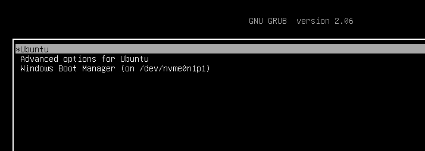

图 4-14

按下 Enter 键启动 Ubuntu。如果你想启动 Windows，使用键盘上的箭头键选择 Windows 启动管理器选项。如果选择启动 Ubuntu，操作系统将加载，并且会出现 Ubuntu 登录屏幕（除非选择了自动登录选项）。输入在安装过程中设置的用户名和密码后，你将登录到 Ubuntu 桌面环境。

4.4 更改默认启动选项

当系统启动时，启动选项屏幕将出现，用户有 10 秒钟时间选择操作系统。如果在超时之前没有做出选择，默认操作系统将启动。在新配置的系统中，默认操作系统将是标准的 Ubuntu 映像。但是，此默认值可以在 Ubuntu 中进行更改。

一系列启动配置选项（包括 10 秒超时和在《在全新磁盘上安装 Ubuntu》中概述的启动设置）在 /etc/default/grub 文件中声明，该文件在新安装时如下所示：

GRUB_DEFAULT=0

GRUB_TIMEOUT_STYLE=hidden

GRUB_TIMEOUT=10

GRUB_DISTRIBUTOR=`lsb_release -i -s 2> /dev/null || echo Debian`

GRUB_CMDLINE_LINUX_DEFAULT="quiet splash"

GRUB_CMDLINE_LINUX=""

更改默认启动系统的第一步是在此文件中声明 GRUB_SAVEDEFAULT 设置，并将 GRUB_DEFAULT 设置为 saved：

GRUB_DEFAULT=saved

GRUB_SAVEDEFAULT=true

GRUB_TIMEOUT_STYLE=hidden

GRUB_TIMEOUT=10

.

.

这个设置允许在启动配置中保存新的默认值。接下来，运行 grub-set-default 命令，通过数字编号系统来更改默认设置，编号从 0 开始。例如，如果 Windows 10 选项在菜单中排在第 5 位，命令将如下所示，使 Windows 10 成为默认启动选项：

# grub-set-default 4

通过运行以下命令检查新设置是否生效：

# grub-editenv list

saved_entry=4

请注意，saved_entry 的值现在已设置为 4。在更改默认值后，请按照以下步骤重新生成启动配置文件：

# grub-mkconfig --output=/boot/grub/grub.cfg

重启系统并验证启动菜单默认选择 Windows 10 选项，并在超时后加载 Windows。

4.5 从命令行访问 Windows 分区

在双启动配置中运行 Ubuntu 时，仍然可以访问位于 Windows 分区上的文件。这可以通过从命令行或使用桌面上的 Disks（gnome-disks）图形实用程序手动挂载该分区来实现。

在命令行操作时，该过程的第一步是创建一个目录，作为我们 Windows 分区的挂载点。在本示例中，我们将创建一个名为 /mnt/windows 的目录：

# mkdir /mnt/windows

为了识别分配给 Windows 分区的设备名称，可以使用 fdisk 命令，如下所示：

# fdisk -l

.

.

磁盘 /dev/nvme0n1：64 GiB，68719476736 字节，134217728 扇区

磁盘型号：VMware 虚拟 NVMe 磁盘

单位：1 * 512 = 512 字节的扇区

扇区大小（逻辑/物理）：512 字节 / 512 字节

I/O 大小（最小/最佳）：512 字节 / 512 字节

磁盘标签类型：gpt

磁盘标识符：F0D04B58-29F5-4B6B-B10F-07295BEF9AAC

设备 启动 结束 扇区 大小 类型

/dev/nvme0n1p1 2048 206847 204800 100M EFI 系统

/dev/nvme0n1p2 206848 239615 32768 16M Microsoft 保留

/dev/nvme0n1p3 239616 80184560 79944945 38.1G Microsoft 基本数据

/dev/nvme0n1p4 132833280 134213631 1380352 674M Windows 恢复环境

/dev/nvme0n1p5 80185344 132833279 52647936 25.1G Linux 文件系统

.

.

在上面的输出中，包含我们需要访问的文件的主要 Windows 分区由 /dev/nvme0n1p3 表示。接下来，我们需要运行挂载命令（假设 Windows 分区为 /dev/nvme0n1p3），如下所示：

# mount /dev/nvme0n1p3 /mnt/windows

通过列出挂载点顶级目录的内容来检查挂载是否成功：

# ls /mnt/windows

'$Recycle.Bin' pagefile.sys swapfile.sys

'$WinREAgent' PerfLogs '系统卷信息'

'文档和设置' ProgramData 用户

DumpStack.log '程序文件' Windows

DumpStack.log.tmp '程序文件 (x86)'

OneDriveTemp Recovery

为了在每次系统启动时自动挂载，只需将相应的挂载行添加到 /etc/fstab 文件中：

/dev/nvme0n1p3 /mnt/windows ntfs defaults 0 0

随时卸载 Windows 文件系统：

# umount /mnt/windows

4.6 从桌面访问 Windows 分区

使用桌面环境挂载分区的第一步是启动磁盘工具。在桌面加载完成后，右键点击桌面背景并从弹出的菜单中选择“打开终端”。在终端窗口中，先获取根权限，然后启动磁盘工具，方法如下：

$ gnome-disks

一旦磁盘工具启动，类似于图 图 4-15 所示的窗口将会出现：

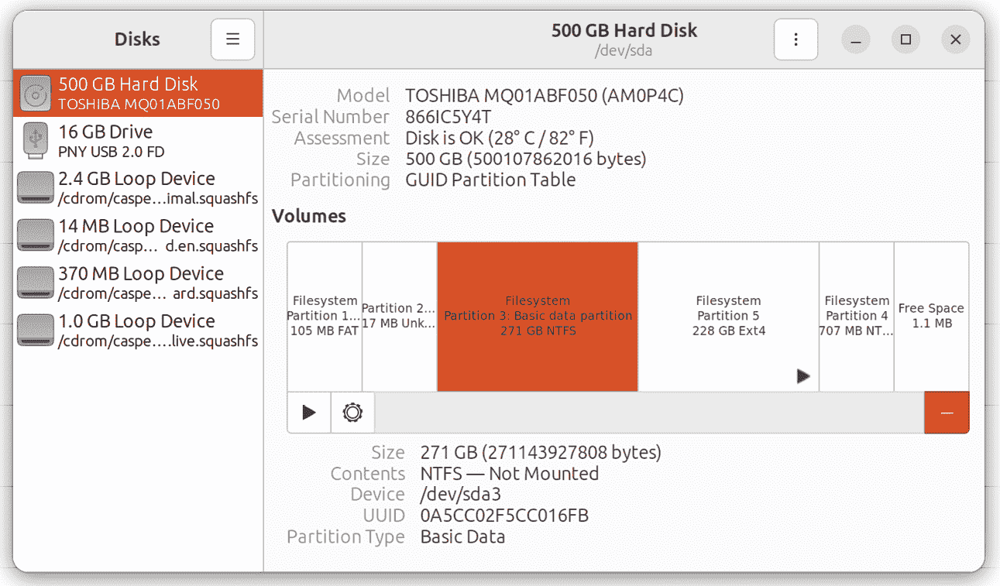

图 4-15

要查看分区信息，选择对话框中卷部分的图形表示中的分区。在上面的示例中，选中并高亮显示了 Windows 系统分区。要挂载该分区以便在 Ubuntu 中访问其内容，选择该分区并点击图 图 4-16 中所示的选项按钮以显示菜单：

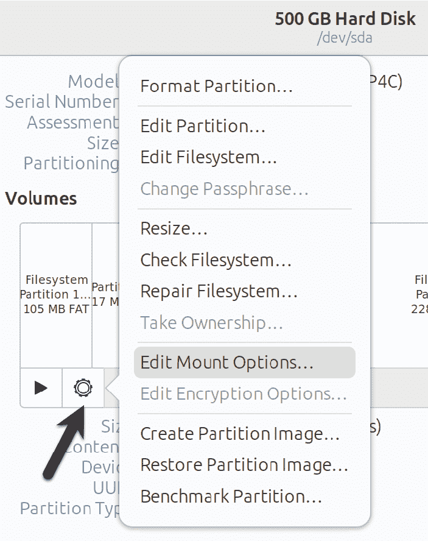

图 4-16

从菜单中选择“编辑挂载选项...”，以显示如图 图 4-17 所示的对话框。关闭用户会话默认选项开关，并确保启用“在用户界面中显示”选项。在挂载点文本框中，将路径更改为 /mnt/windows。如果分区需要在每次系统重启时自动挂载，还需启用“在系统启动时挂载”选项：

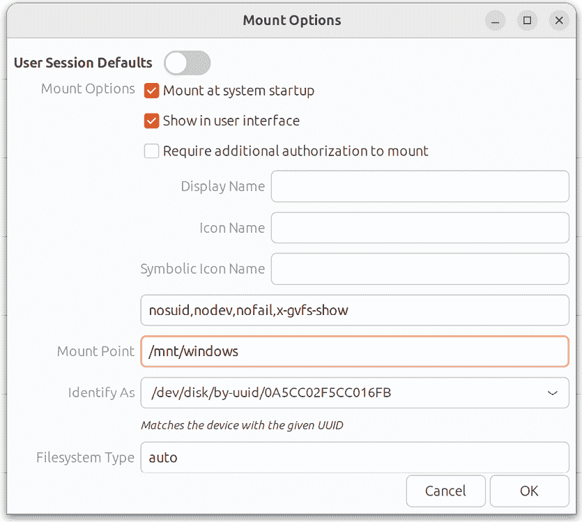

图 4-17

在进行更改后，点击“确定”按钮以返回主对话框。要挂载分区，只需点击图 图 4-18 中所示的挂载按钮：

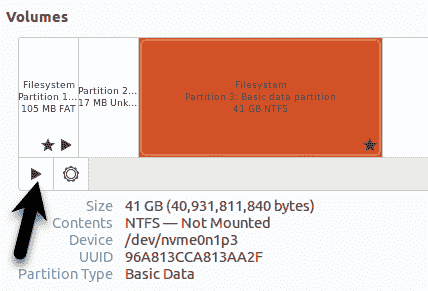

图 4-18

一旦分区被挂载，退出 gnome-disks，并注意到一个卷的图标已经出现在 dock 中，如图 4-19 所示（请注意，如果“在用户界面中显示”选项被禁用，则此图标不会出现）：

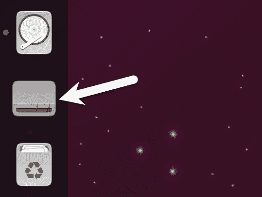

图 4-19

双击图标使用“文件”工具浏览该分区：

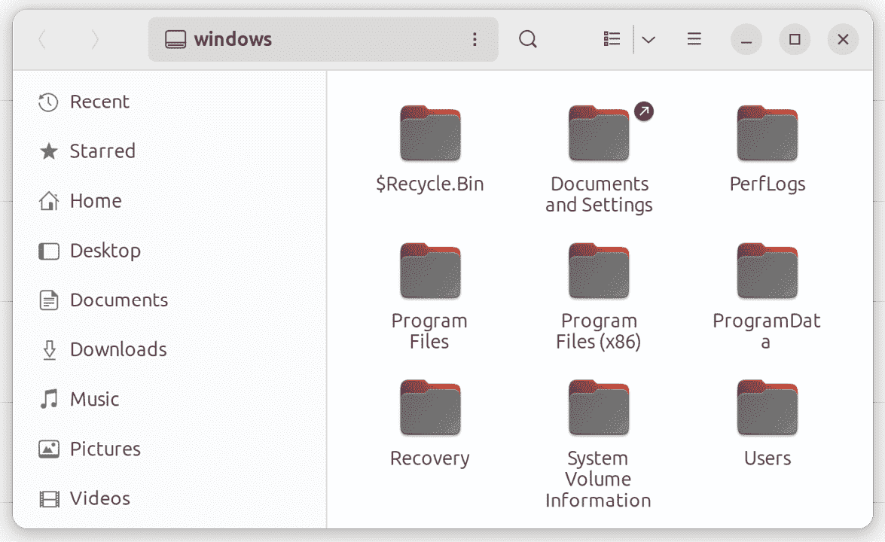

图 4-20

要卸载分区，请点击挂载按钮（该按钮将变为停止按钮），如上方图 4-18 所示。

4.7 总结

Ubuntu 可以通过创建双重启动环境安全地与 Windows 操作系统共存于同一个磁盘驱动器上。这涉及到缩小 Windows 系统占用的空间，为 Ubuntu 安装腾出空间。一旦 Ubuntu 安装完成，可以修改启动菜单配置以更改默认操作系统。可以通过命令行或使用 Disks 桌面工具从 Ubuntu 访问磁盘驱动器上的 Windows 分区。
