5. 为 Ubuntu 分配 Windows 磁盘分区

在前一章节中，我们探讨了在与 Windows 同一磁盘上安装 Ubuntu 的过程。这种所谓的“双重启动”配置允许用户将两个操作系统安装在一个磁盘驱动器上，并在系统启动时选择其中一个进行引导。

本章节适用于那些决定喜欢 Ubuntu 到足以从磁盘上完全删除 Windows 并将其空闲空间用于 Linux 的用户。在接下来的部分中，我们将逐步讲解这个过程，使用命令行工具和 gnome-disks 工具进行操作。

5.1 卸载 Windows 分区

如果在“与 Windows 双重启动 Ubuntu”章节中按照步骤在 Ubuntu 中挂载了 Windows 分区，那么在继续本章节之前，应该先卸载该分区。假设 Windows 分区已挂载为 /mnt/windows，可以按如下方式卸载：

# umount /mnt/windows

如果之前已添加 /mnt/windows 自动挂载，应该编辑 /etc/fstab 文件以将其移除。

5.2 删除磁盘上的 Windows 分区

为了让 Ubuntu 使用 Windows 分区，第一步是删除该分区。然而，在此之前，任何需要保留的数据必须从 Windows 分区中备份。备份完成后，可以安全地继续进行本章节的操作。

要删除 Windows 分区，首先需要使用 fdisk 工具识别它们所在的磁盘：

# fdisk -l

磁盘 /dev/nvme0n1：64 GiB, 68719476736 字节, 134217728 扇区

磁盘型号：VMware 虚拟 NVMe 磁盘

单位：1 * 512 = 512 字节的扇区

扇区大小（逻辑/物理）：512 字节 / 512 字节

I/O 大小（最小/最佳）：512 字节 / 512 字节

磁盘标签类型：gpt

磁盘标识符：F0D04B58-29F5-4B6B-B10F-07295BEF9AAC

设备 启始 结束 扇区 数量 大小 类型

/dev/nvme0n1p1 2048 206847 204800 100M EFI 系统

/dev/nvme0n1p2 206848 239615 32768 16M Microsoft 保留

/dev/nvme0n1p3 239616 80184560 79944945 38.1G Microsoft 基本数据

/dev/nvme0n1p4 132833280 134213631 1380352 674M Windows 恢复环境

/dev/nvme0n1p5 80185344 132833279 52647936 25.1G Linux 文件系统

在上述示例输出中，系统包含一个物理磁盘驱动器，设备名为 /dev/nvme0n1\。该磁盘驱动器上有六个分区，分别通过设备名 /dev/nvme0n1p1 至 /dev/nvme0n1p5 访问。根据“类型”列中的值，有三个与 Windows 相关的分区。第一个是 Windows 系统分区，第二个是较大的 Windows 启动分区，包含 Windows 操作系统和用户数据，第三个是 Windows 恢复分区。

要删除分区，请使用包含分区的磁盘设备名称启动 fdisk 工具（此例中为/dev/nvme0n1），然后按照指示再次显示分区和扇区信息：

# fdisk /dev/nvme0n1

欢迎使用 fdisk（util-linux 2.37.2）。

变更仅会保存在内存中，直到您决定写入它们。

在使用写入命令之前，请小心。

命令（输入 m 获取帮助）：p

磁盘 /dev/nvme0n1：64 GiB，68719476736 字节，134217728 个扇区

磁盘型号：VMware 虚拟 NVMe 磁盘

单位：1 个扇区 = 512 字节

扇区大小（逻辑/物理）：512 字节 / 512 字节

I/O 大小（最小/最佳）：512 字节 / 512 字节

磁盘标签类型：gpt

磁盘标识符：F0D04B58-29F5-4B6B-B10F-07295BEF9AAC

设备 起始 结束 扇区 数量 大小 类型

/dev/nvme0n1p1 2048 206847 204800 100M EFI 系统

/dev/nvme0n1p2 206848 239615 32768 16M Microsoft 保留区

/dev/nvme0n1p3 239616 80184560 79944945 38.1G Microsoft 基本数据

/dev/nvme0n1p4 132833280 134213631 1380352 674M Windows 恢复环境

/dev/nvme0n1p5 80185344 132833279 52647936 25.1G Linux 文件系统

分区表条目未按磁盘顺序排列。

命令（输入 m 获取帮助）：

在继续之前，请注意我们将要删除的分区的起始和结束地址（换句话说，/dev/nvme0n1p2 的起始位置和/dev/nvme0n1p5 起始位置前一个扇区）。

在命令提示符下，删除 Windows 分区（这些分区为我们示例系统中的分区 2、3 和 4）：

命令（输入 m 获取帮助）：d

分区编号（1-5，默认为 5）：2

分区 2 已被删除。

命令（输入 m 获取帮助）：d

分区编号（1,3-5，默认为 5）：3

分区 3 已被删除。

命令（输入 m 获取帮助）：d

分区编号（1,4,5，默认为 5）：4

分区 4 已被删除。

既然我们已经删除了 Windows 分区，接下来必须在腾出的磁盘空间中创建新的 Ubuntu 分区。分区编号必须与第一个删除的分区编号匹配（在此例中为 2）。此外，还需要精确输入分区的起始和结束扇区，与旧分区所报告的值一致（fdisk 通常会默认提供正确的值，但最好再次确认）：

命令（输入 m 获取帮助）：n

分区编号（2-4,6-128，默认为 2）：2

第一个扇区（206848-134217694，默认为 206848）：

最后一个扇区，+/-扇区或+/-大小{K,M,G,T,P}（206848-80185343，默认为 80185343）：

创建了一个新的类型为'Linux 文件系统'，大小为 38.1 GiB 的分区 2。

完成这些更改后，下一步是检查设置是否正确：

命令（输入 m 获取帮助）：p

磁盘 /dev/nvme0n1：64 GiB，68719476736 字节，134217728 个扇区

磁盘型号：VMware 虚拟 NVMe 磁盘

单位：1 个扇区 = 512 字节

扇区大小（逻辑/物理）：512 字节 / 512 字节

I/O 大小（最小/最佳）：512 字节 / 512 字节

磁盘标签类型：gpt

磁盘标识符：F0D04B58-29F5-4B6B-B10F-07295BEF9AAC

设备 起始 结束 扇区 数量 大小 类型

/dev/nvme0n1p1 2048 206847 204800 100M EFI 系统

/dev/nvme0n1p2 206848 80185343 79978496 38.1G Linux 文件系统

/dev/nvme0n1p5 80185344 132833279 52647936 25.1G Linux 文件系统

为了提交更改，我们需要将新的分区信息写入磁盘，并退出 fdisk 工具：

Command (m for help): w

分区表已被更改。

正在同步磁盘。

5.3 格式化未分配的磁盘分区

为了使新的分区适合 Ubuntu 使用，需要在其上创建文件系统。当前版本的 Ubuntu 推荐使用 XFS 文件系统，相关内容将在章节 “向 Ubuntu 23.04 系统添加新磁盘驱动器”中详细介绍。文件系统的创建使用 mkfs.xfs 命令，如下所示（如有需要，安装 xfsprogs 包）：

# apt install xfsprogs

# mkfs.xfs -f /dev/nvme0n1p2

meta-data=/dev/nvme0n1p2 isize=512 agcount=4, agsize=2499328 blks

= sectsz=512 attr=2, projid32bit=1

= crc=1 finobt=1, sparse=1, rmapbt=0

= reflink=1 bigtime=0 inobtcount=0

data = bsize=4096 blocks=9997312, imaxpct=25

= sunit=0 swidth=0 blks

naming =version 2 bsize=4096 ascii-ci=0, ftype=1

log =internal log bsize=4096 blocks=4881, version=2

= sectsz=512 sunit=0 blks, lazy-count=1

realtime =none extsz=4096 blocks=0, rtextents=0

5.4 挂载新分区

接下来，我们需要挂载新的分区。在本示例中，我们将其挂载到名为 /data 的目录中。不过，您也可以自由选择任何有效的挂载点，或者将其作为逻辑卷的一部分进行挂载（有关详细内容，请参见章节 “向 Ubuntu 23.04 卷组和逻辑卷中添加新磁盘”）。首先，我们需要创建一个目录作为挂载点：

# mkdir /data

接下来，我们需要编辑 /etc/fstab 中的挂载表，以便每次系统启动时都能自动挂载该分区。在 /etc/fstab 文件的底部，添加以下行来挂载新的分区（根据您的环境修改 /dev/nvme0n1p2 设备）：

/dev/nvme0n1p2 /data xfs defaults 0 0

最后，我们可以手动挂载新的分区（请注意，在后续的重启中不再需要此操作，因为分区会根据我们在 /etc/fstab 文件中添加的设置自动挂载）：

# mount /data

要检查分区，可以运行以下命令以显示可用空间：

# df -h /data

文件系统 大小 已用 可用 使用% 挂载位置

/dev/nvme0n1p2 39G 305M 38G 1% /data

5.5 编辑引导菜单

下一步是修改 Ubuntu 的引导菜单。由于这是原本的双启动系统，菜单配置了可以选择启动 Windows 或 Ubuntu。现在 Windows 分区已被删除，我们需要移除这个启动选项。在 Ubuntu 中，可以通过以下步骤完成：

# rm -r /boot/efi/EFI/Microsoft

# update-grub

由于现在只剩下一个操作系统可以启动，系统将在下一次重启时自动启动 Ubuntu，而不会显示启动菜单。如果需要访问此启动菜单，例如使用高级启动选项，只需在启动过程的初始阶段按 Esc 键即可。

5.6 使用 GNOME Disks 工具

gnome-disks 工具提供了一种图形化的用户友好界面，作为命令行回收 Windows 分区的替代方案。由于此示例中将把 Windows NTFS 分区转换为 XFS 格式，因此第一步是安装 xfsprogs 包，如下所示：

# apt install xfsprogs

安装完包之后，打开终端窗口并启动 gnome-disks 工具：

# gnome-disks

稍等片刻，gnome-disks 工具将如 图 5-1 所示出现：

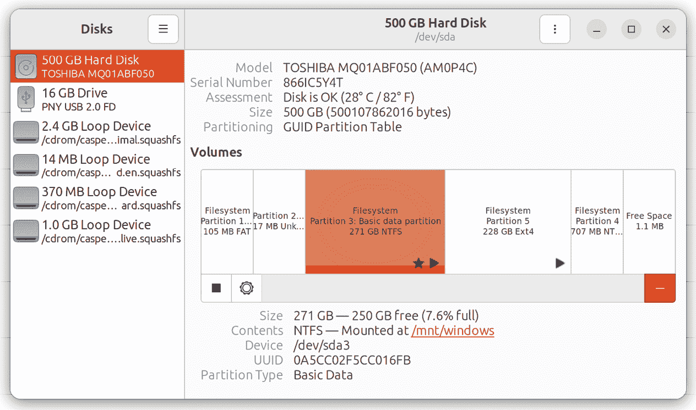

图 5-1

在上述示例中，磁盘包含两个 Windows NTFS 分区，必须删除这两个分区。磁盘映射中显示带星号的任何 NTFS 分区（如上图中突出显示的分区）都需要在删除之前先卸载。这可以通过选择分区并点击卸载按钮来实现，卸载按钮位置如 图 5-2 所示：

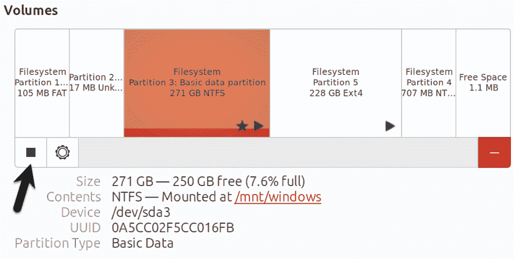

图 5-2

在卸载所有 NTFS 分区后，下一步是删除它们。在磁盘映射中选择最左侧的 NTFS 分区，并点击“删除”按钮，如 图 5-3 所示：

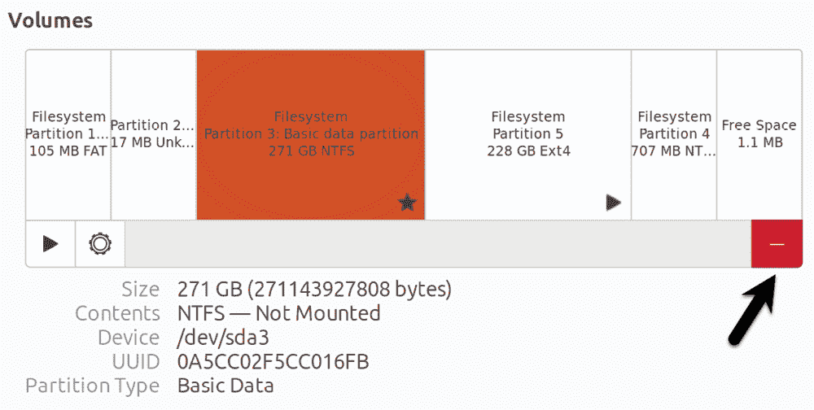

图 5-3

在确认对话框中查看信息后，点击“删除”按钮以确认更改。一旦删除了第一个分区，重复此步骤以删除剩余的 NTFS 分区。删除 NTFS 分区后，磁盘映射中应显示该空间为“空闲”状态。接下来需要创建一个新分区来利用这个空闲空间。选择该空间后，点击新分区按钮（如 图 5-4 中箭头所示）：

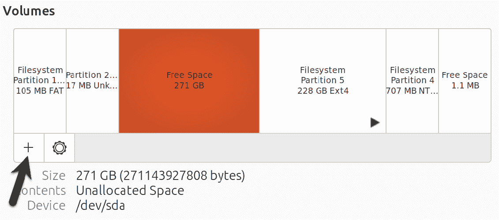

图 5-4

在“创建分区”对话框中，选择分区是否要占用所有可用空间，或者如果计划将该空间用于多个分区，则选择减少分区大小：

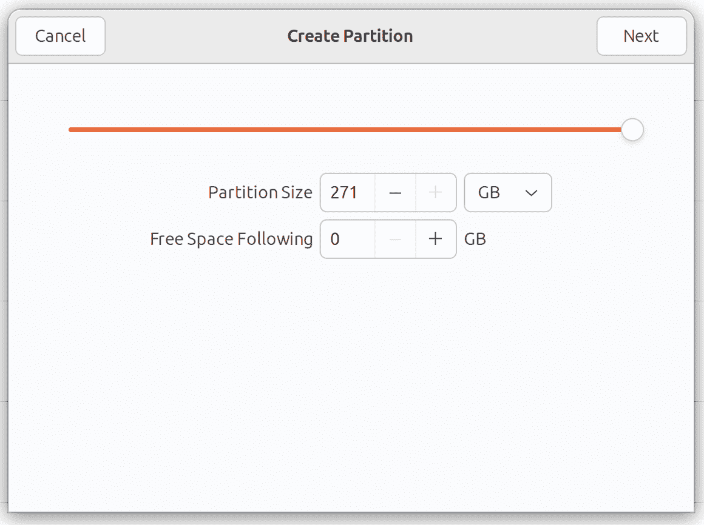

图 5-5

点击“下一步”，在随后的屏幕上，为新分区输入名称，并选择在创建过程中是否擦除该分区。这将使创建过程需要更多时间，但这是推荐的选项。最后，选择一个文件系统类型作为该分区的文件系统类型，通常为 ext4 或 XFS。鉴于 XFS 的优势，选择“其他”，然后点击“下一步”按钮。

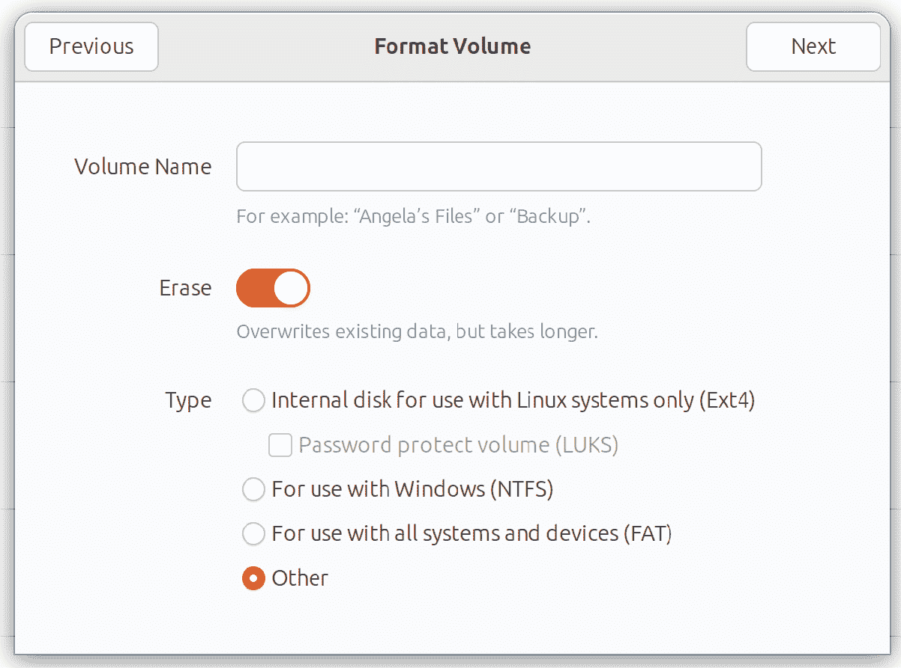

图 5-6

在下一个屏幕上，选择 XFS 选项，然后点击创建按钮：

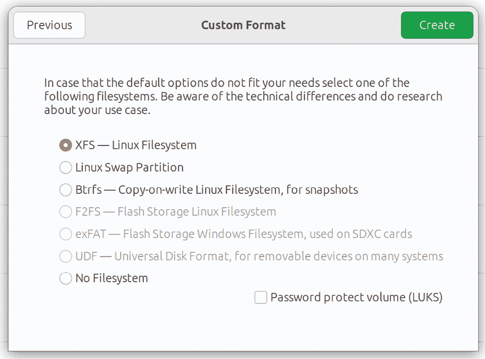

图 5-7

gnome-disks 工具将开始格式化过程，并显示过程状态：

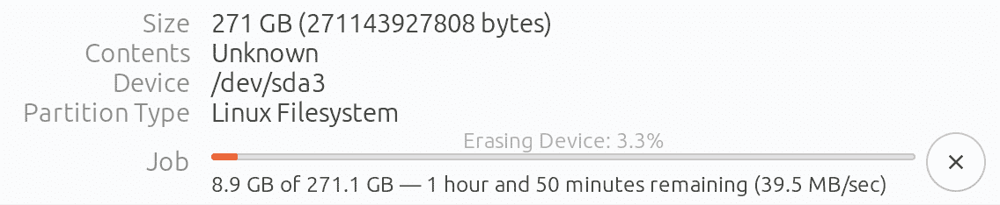

图 5-8

一旦分区准备好，可以通过命令行或使用 gnome-disks 工具挂载它。要配置挂载点，选择分区并点击设置按钮，如图 5-9 所示：

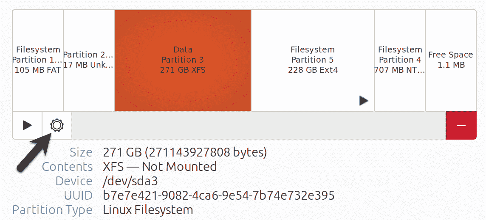

图 5-9

从设置菜单中，选择“编辑挂载选项...”项目，显示图 5-10 所示的对话框。

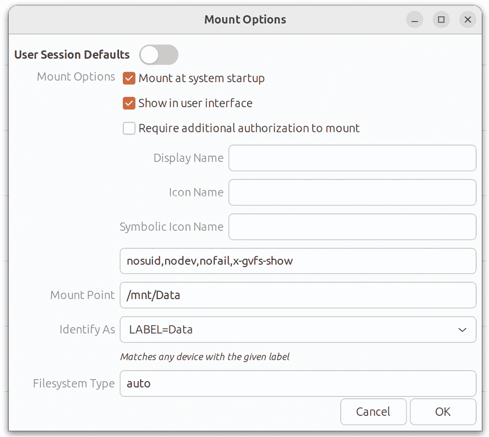

图 5-10

关闭“用户会话默认值”开关，并根据需求配置挂载点。在上图中，分区在系统启动时挂载到 `/mnt/Data`，并配置为通过标签“Data”进行识别。

完成设置后，点击确定，然后点击图 5-11 中高亮的挂载按钮：

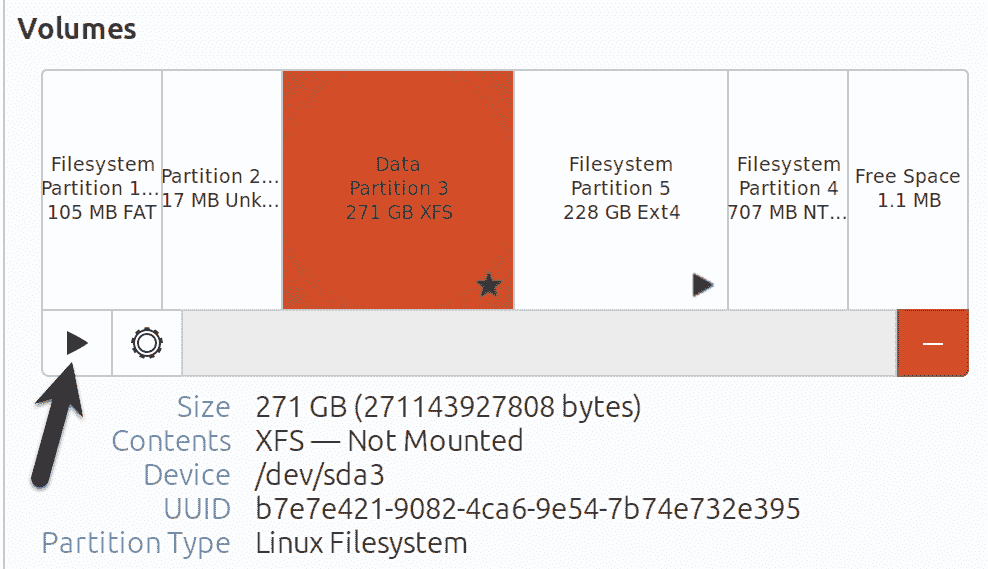

图 5-11

要检查分区是否已挂载并准备好使用，运行以下命令显示可用空间：

$ df -h /mnt/Data

文件系统 大小 已用 可用 使用% 挂载点

/dev/sda3 253G 1.8G 251G 1% /mnt/Data

最后，按照本章前面概述的步骤更新启动菜单，移除 Windows 选项。

5.7 小结

双重启动配置中的 Windows 分区可以随时删除，以为 Ubuntu 系统释放空间，方法是识别出属于 Windows 的分区并删除它们。删除后，未分配的空间可以用于创建新文件系统并挂载，使其可以用于 Ubuntu 系统。
