6. GNOME 44 桌面引导游览

Ubuntu 23.04 包含 GNOME 44 桌面环境。虽然缺乏 Windows 和 macOS 桌面的复杂性，GNOME 提供了一个简洁且直观的桌面环境，包含了窗口化环境的所有基本功能，且可以快速学习，具有额外的优势。

本章将介绍 GNOME 桌面的主要特性，并概述如何执行基本任务。

6.1 安装 GNOME 桌面

如果使用了 Ubuntu Desktop 镜像进行 Ubuntu 23.04 安装，GNOME 桌面将已安装并且每次系统启动时会自动启动。

如果安装的是 Ubuntu 服务器配置，则系统中不会包含 GNOME 桌面相关的包。在没有显示器的服务器系统中，安装图形桌面环境的想法可能显得多余。然而，值得注意的是，也可以远程访问 GNOME 桌面，因此，即使在所谓的“无头”服务器（即没有显示器、键盘和鼠标的服务器）上，安装 GNOME 桌面包仍然可能是有益的。本书的 “Ubuntu 23.04 使用 Vino 进行远程桌面访问” 章节将详细讲解如何建立远程桌面访问。

如果安装配置中没有包含 GNOME 桌面，可以随时使用以下命令安装：

# 第六章：apt install ubuntu-gnome-desktop

安装完成后，下次系统重启时，桌面登录界面将会出现。

6.2 GNOME 44 桌面概览

下图 图 6-1 显示了典型的、刚启动的 GNOME 桌面会话的外观，尚未启动任何其他程序或进行配置更改。

主桌面区域（标记为 A）是当启动应用程序和工具时，窗口会出现的地方。

屏幕顶部的栏（B）被称为顶部栏，其中包括活动菜单（C）、日期和时间，以及一系列按钮和图标，包括网络状态、音量、电池电量以及其他状态和帐户设置：

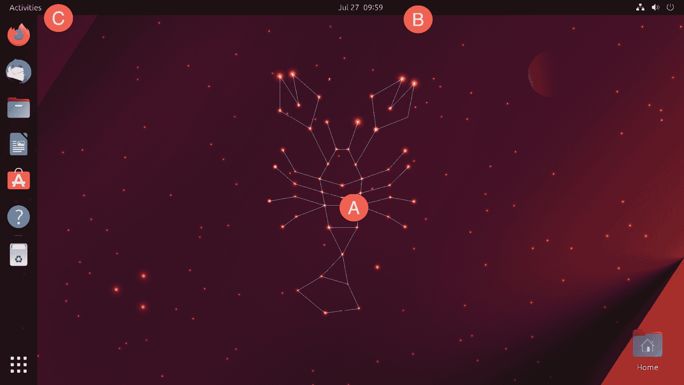

图 6-1

当前在桌面上运行的应用程序的应用菜单也会出现在顶部栏中。例如，图 6-2 展示了终端应用的应用菜单：

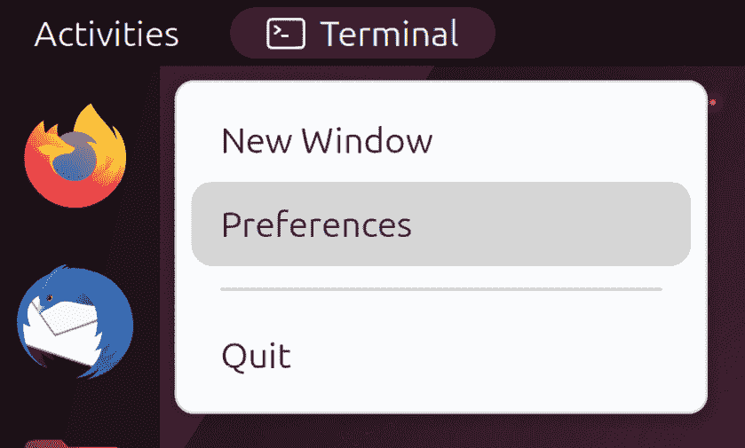

图 6-2

根据应用程序的不同，应用窗口栏中可能会显示一个包含附加选项的菜单。例如，图 6-3 展示了终端应用的内建菜单：

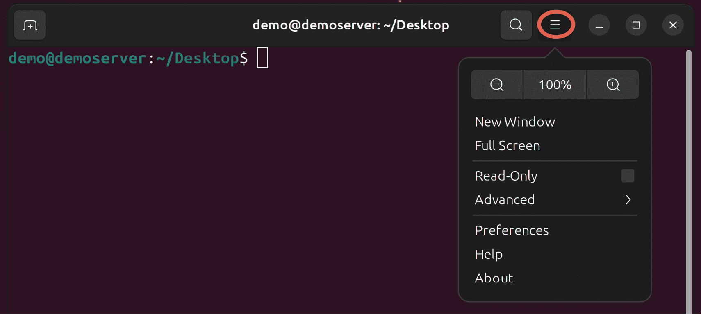

图 6-3

通过右键点击停靠栏中的应用程序图标，还可以打开另一个菜单，如图 6-4 所示：

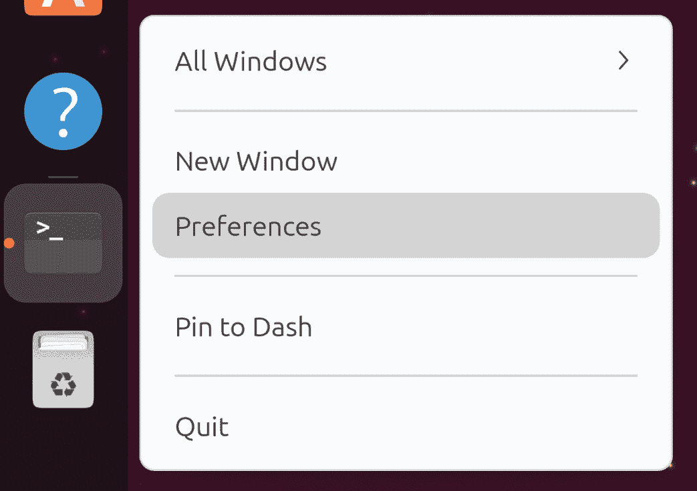

图 6-4

6.3 启动活动

应用程序和工具可以通过停靠栏启动，如图 6-5 所示：

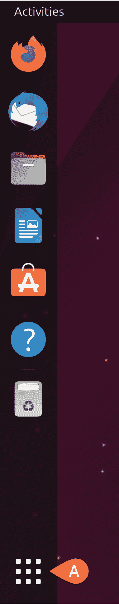

图 6-5

默认情况下，停靠栏会显示一组预定义的常用应用程序图标，并且还会包含当前运行的应用程序图标。如果应用程序正在运行，图标左侧会有一个点标记；如果有多个实例正在运行，每个实例的左侧都会出现一个点。

要启动应用程序，只需点击停靠栏中的图标。

要查找停靠栏中未包含的应用程序，可以选择“显示应用程序”（在图 6-5 中标记为 A），显示可浏览的应用程序列表，如图 6-6 所示：

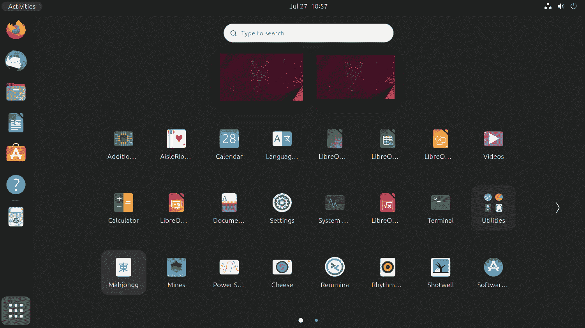

图 6-6

请注意，列表可以通过选择屏幕底部中央的按钮来筛选，显示所有应用程序或仅显示常用应用程序。还需要注意，列表中的某些条目实际上是文件夹，包含其他应用程序。例如，在上面的截图中，"Utilities"条目提供访问其他工具的入口，比如系统监视器、磁盘管理工具和终端窗口应用程序。

除了浏览应用程序，还可以通过搜索栏进行搜索，搜索栏在点击顶部栏的“活动”后会出现，如图 6-7 所示：

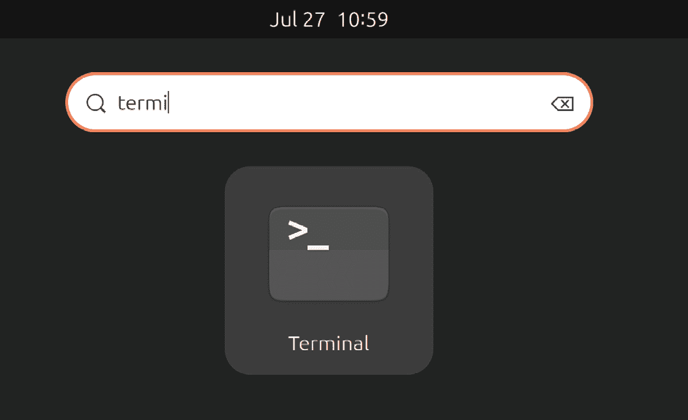

图 6-7

在搜索框中输入文本时，可能匹配的结果列表会逐渐细化。

要将应用程序添加到停靠栏以便更方便地访问，找到应用程序的图标，右键点击它，选择“添加到收藏夹”选项：

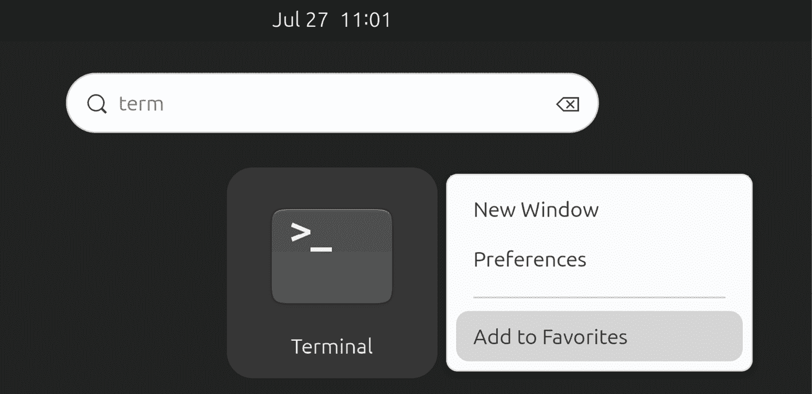

图 6-8

要从停靠栏中移除应用程序，右键点击停靠栏中的图标，选择“从收藏夹中移除”。

6.4 管理窗口

与其他桌面环境类似，GNOME 中的应用程序在窗口中运行。当多个应用程序窗口打开时，按下 Super + Tab 键盘快捷键会显示切换面板（图 6-9），允许选择不同的窗口作为当前活动窗口（Super 键通常是 Windows 键，或者在 Mac 键盘上是 Cmd 键）：

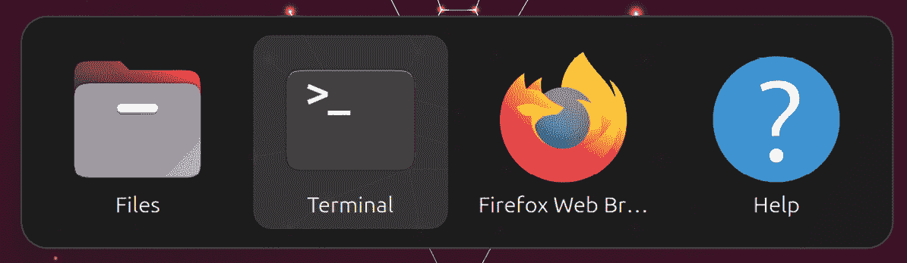

图 6-9

如果单个应用程序有多个窗口打开，切换面板会在第二个面板中显示这些窗口，方便选择特定的窗口：

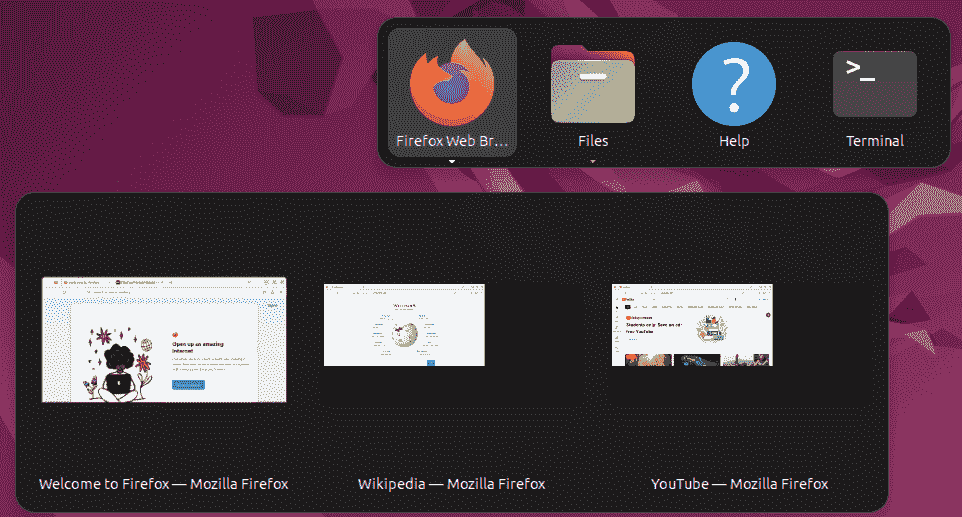

图 6-10

要在切换器中的图标之间向后循环，使用 Shift + Tab 键盘快捷键。

要最大化窗口以填充整个屏幕，请点击标题栏并将窗口拖动到屏幕顶部。要将窗口恢复到原始大小，请点击标题栏并将其向下拖动。或者，简单地双击标题栏可以在窗口大小之间切换。同样，将窗口拖动到屏幕的左侧或右侧会使窗口填充屏幕的一半。

6.5 使用工作区

应用程序窗口出现的屏幕区域称为工作区，GNOME 允许配置多个工作区。要查看当前工作区，请点击顶部栏中的活动（如图 6-1 中标记为 C 的区域）或按键盘上的 Super 键来显示以下屏幕：

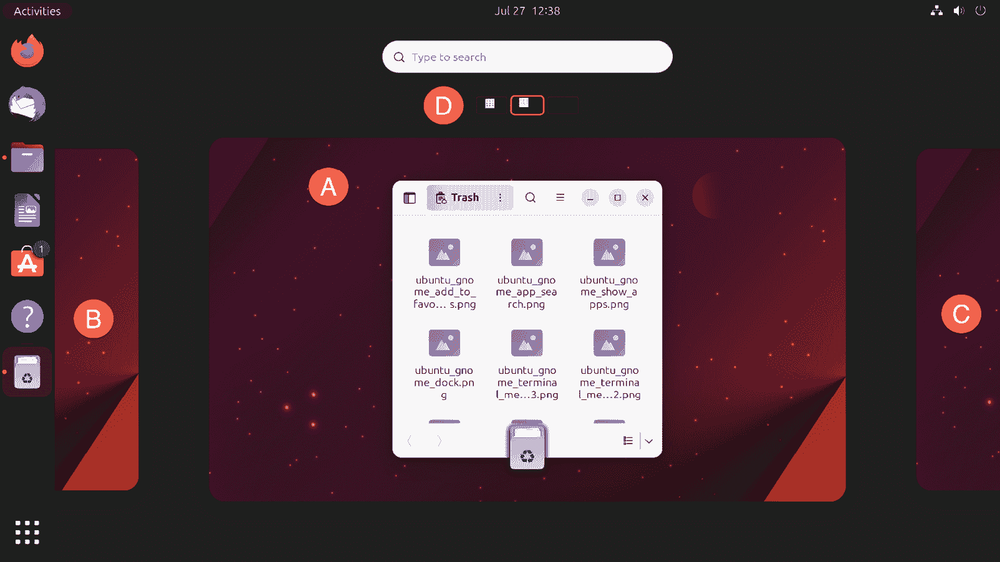

图 6-11

上图中标记为 A 的区域是当前选定的工作区。点击标记为 B 和 C 的区域将分别选择并显示前一个和下一个工作区。中心工作区面板（A）显示当前活动的应用程序窗口。将鼠标指针悬停在一个窗口上，将显示一个关闭按钮，可以用来退出该窗口。要将窗口从一个工作区移动到另一个工作区，请显示工作区面板并将应用程序窗口拖放到目标工作区。当一个窗口被添加到空白工作区时，工作区面板会增加另一个空白工作区，从而允许创建多个工作区。

工作区缩略图（D）提供了一种方便的方式来在工作区之间切换，尤其在处理多个工作区时非常有用。

要删除一个工作区，可以关闭该工作区的所有窗口，或将它们移动到另一个工作区。

"显示应用程序"屏幕还提供了当前工作区的访问，下面是图 6-12 所示：

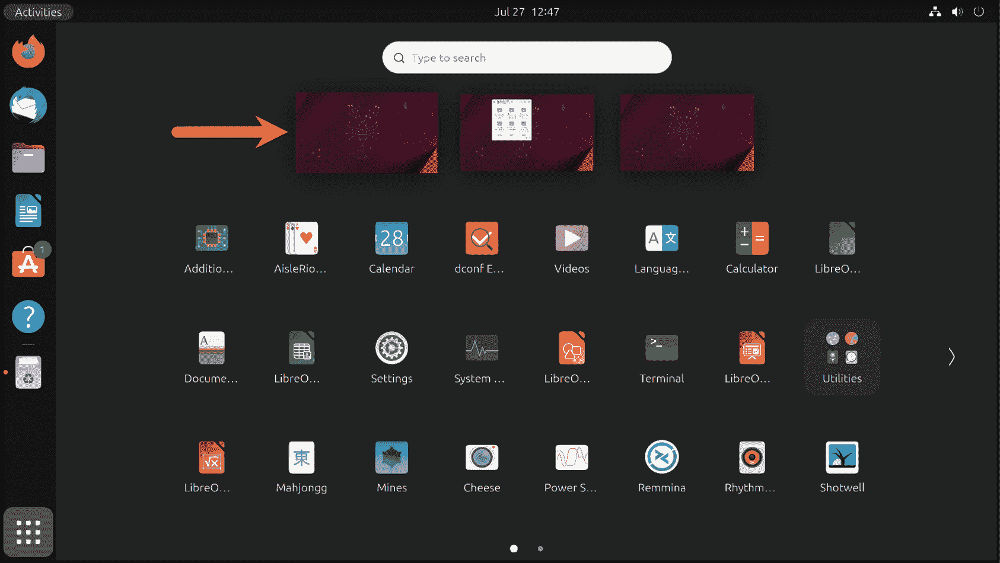

图 6-12

6.6 日历和通知

当系统需要通知你一个事件（例如系统或应用程序更新可用）时，一个弹出面板会出现在工作区顶部。通过点击顶部栏中的日期和时间，可以访问日历和任何先前的通知，如图 6-13 所示：

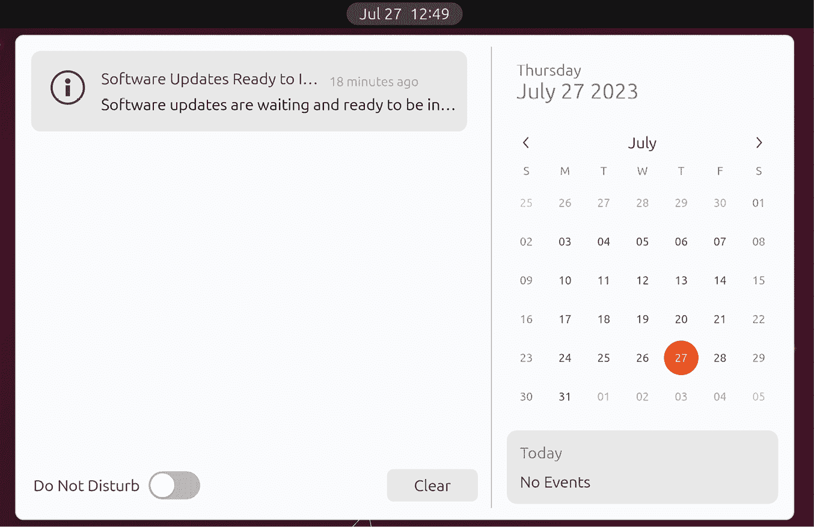

图 6-13

6.7 桌面设置

要访问桌面设置，请点击顶部栏最右侧的按钮，显示图 6-14 中所示的菜单：

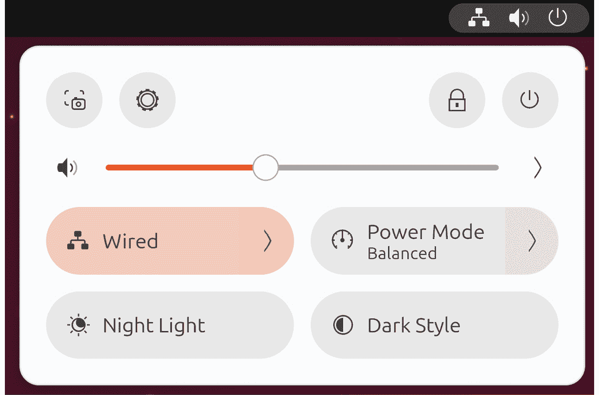

图 6-14

菜单提供了快速访问常见设置的功能，如系统节能模式、桌面主题、音量和当前网络连接。电源按钮可让您注销桌面，或重启或关机系统。点击菜单左上角的按钮可以截取屏幕截图。显示齿轮图标的按钮位于截图按钮的右侧，点击该按钮可打开 GNOME 设置应用程序。

设置应用程序提供了广泛的选项，例如以太网和 WiFi 连接、屏幕背景自定义选项、屏幕锁定和电源管理控制，以及语言偏好设置。要查看每个类别中的可用设置，只需在设置窗口的左侧面板中选择一个选项：

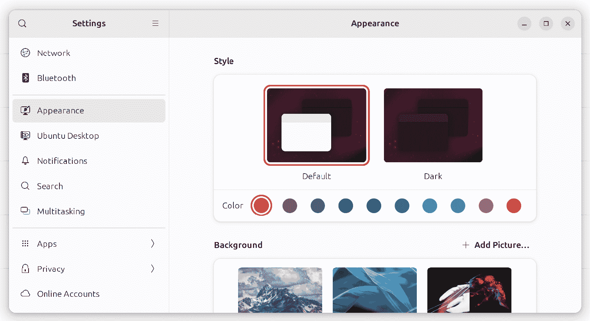

图 6-15

上面图 6-14 中显示的菜单还包括切换用户、调整音量、更改 WiFi 网络、以及注销、重启或关机的选项。

6.8 自定义 Dock

dock 的大小、位置和行为可以通过设置应用程序进行更改，方法是在图 6-16 中所示的 Ubuntu Desktop 选项中选择：

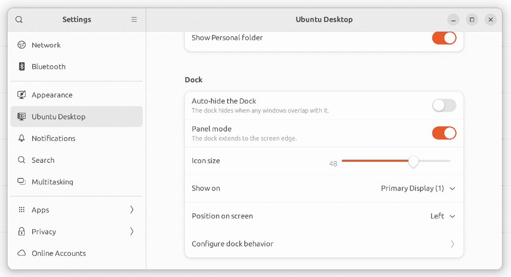

图 6-16

位置可以设置为屏幕的任意一侧，同时图标大小可以用来减小 dock 的尺寸。最后，如果启用了自动隐藏 dock 选项，则当鼠标指针移动到当前 dock 所在的屏幕边缘时，dock 会自动消失。

6.9 安装 Ubuntu 软件

与 macOS、Windows、iOS 和 Android 等其他操作系统类似，Ubuntu 也有一个“应用商店”，即 Ubuntu 软件工具。通常，图标会放置在 dock 中，如图 6-17 所示，并显示有更新的应用程序数量：

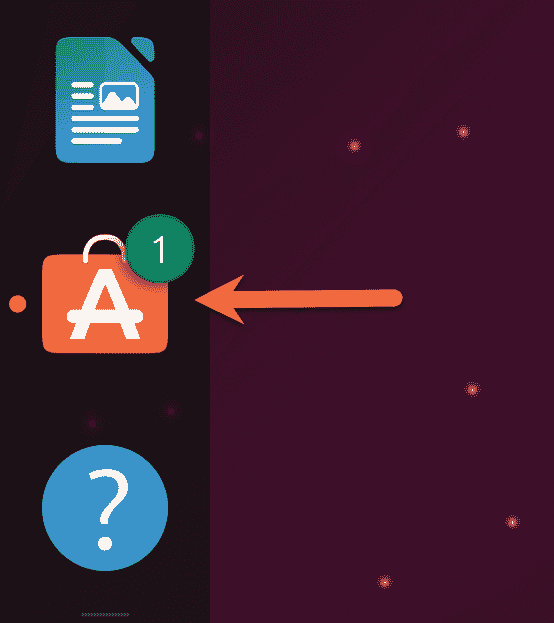

图 6-17

加载完成后，该工具会提供一份可供安装的应用程序列表，按类别、推荐和编辑器选择分组。也可以搜索可用应用程序的库来查找特定的项目：

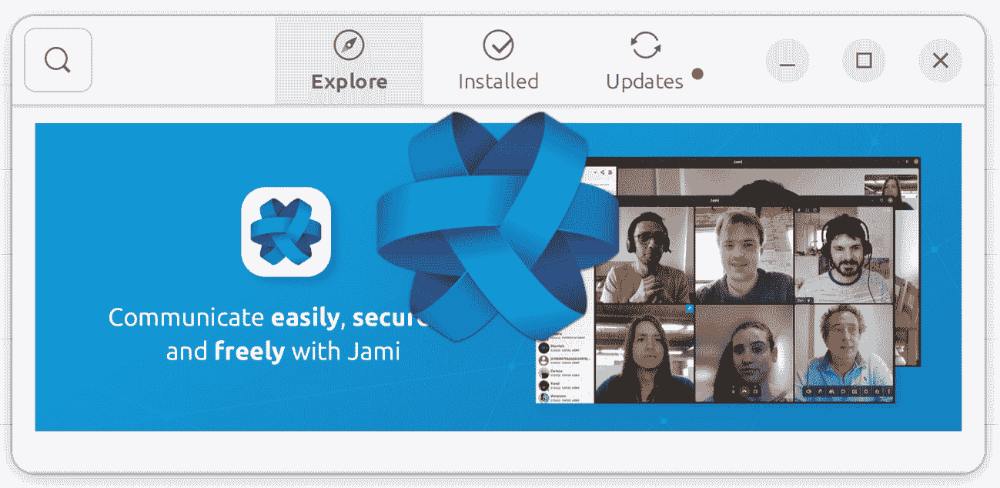

图 6-18

要安装应用程序，只需在 Ubuntu 软件窗口中选择它并点击安装按钮：

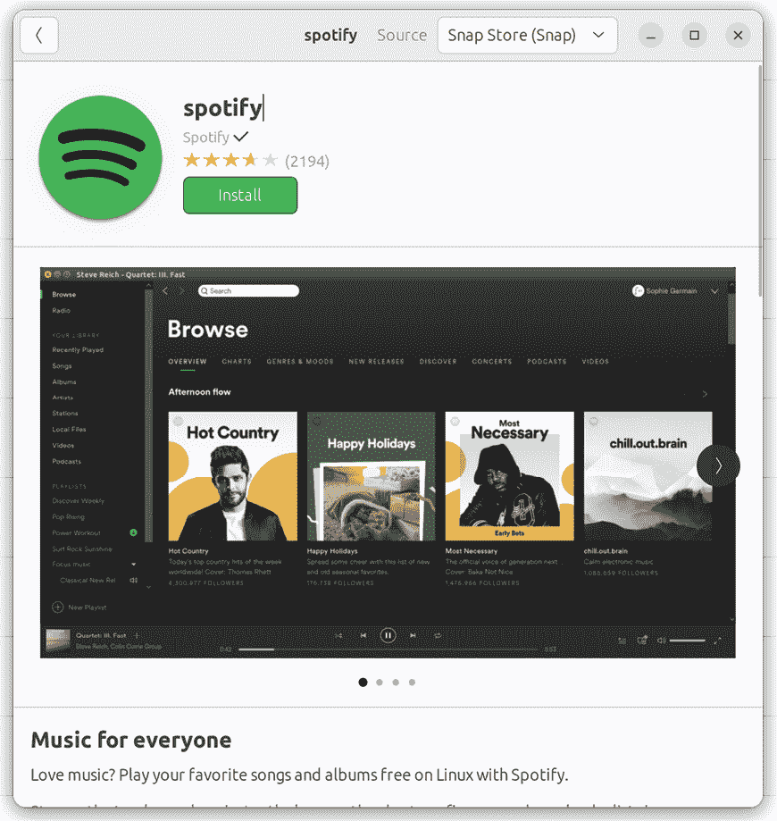

图 6-19

6.10 超越基本自定义

GNOME 桌面设计上是一个简洁且无干扰的环境，定制选项较少。然而，这并不意味着无法对桌面进行额外的更改。事实上，GNOME 项目开发了一个名为 GNOME Tweaks 的工具，专门用于此目的。要安装这个工具，请打开 Ubuntu 软件工具，搜索并安装 GNOME Tweaks 应用程序。安装并启动后，Tweaks 对话框将如下所示：

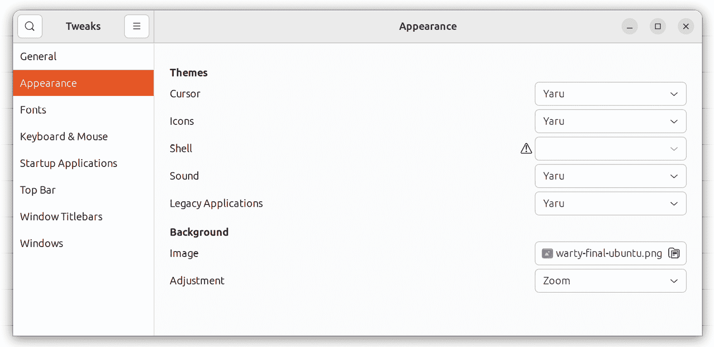

图 6-20

现在可以选择多种选项来定制桌面。事实上，选项太多，无法在本章中一一介绍，因此请在继续阅读下一章之前，花些时间尝试这些设置。

6.11 总结

Ubuntu 包含了 GNOME 44 桌面环境，可以在初始安装时包含，或在后期安装。与大多数其他桌面环境不同，GNOME 旨在提供一个简洁且易于使用的窗口用户界面。GNOME 桌面的关键区域包括顶部栏、活动概览和任务栏。此外，GNOME 支持多个工作区，可以保持运行中的应用程序有序，并且保持屏幕整洁。设置应用程序内也提供了多种配置选项，包括桌面背景设置、音频、网络配置和 WiFi 网络选择。
