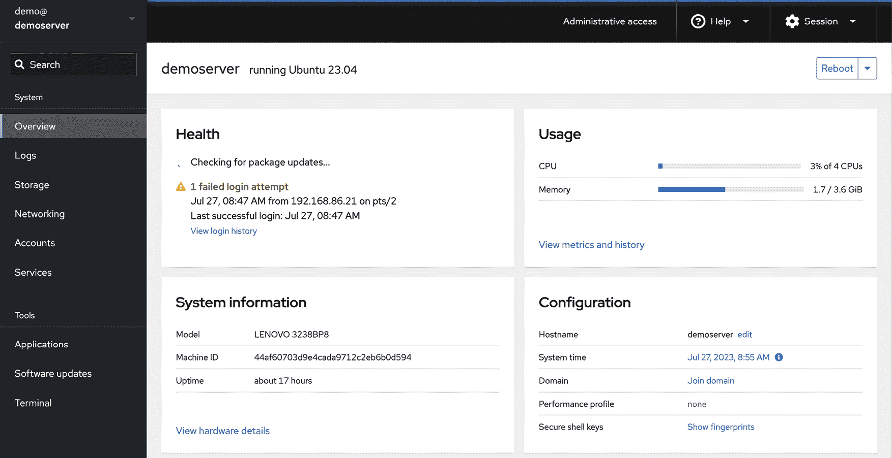

7\. Cockpit Web 界面概述

尽管配备了最新的 Linux 桌面环境，Ubuntu 实际上是一个服务器操作系统。因此，大多数 Ubuntu 部署将是到远程物理服务器或作为云基础虚拟机实例。这些系统通常在没有键盘、鼠标或显示器的情况下运行，只能通过网络连接上的命令提示符进行直接访问。这在远程位置进行系统管理方面带来了挑战。虽然通过远程访问命令行和桌面环境确实可以实现很多功能，但必须有一个一致和协调的解决方案来执行类似 Ubuntu 这样的企业级操作系统上必须每天执行的管理和监控任务。

Cockpit 基于 Web 的管理界面提供了这些功能。本章将介绍如何安装、配置和访问 Cockpit 界面，同时还提供了 Cockpit 的主要特性概述，其中许多将在后续章节中更详细地介绍。

7.1 Cockpit 概述

Cockpit 是一个轻量级的基于 Web 的界面，允许远程执行一般系统管理任务。安装并配置后，系统管理员在本地浏览器窗口打开并导航到远程服务器上的 Cockpit 端口。加载 Cockpit 界面到浏览器并登录后，可以使用管理和监控工具通过可视化方式执行广泛的任务。

在幕后，Cockpit 使用相同的工具执行通常在命令行工作时使用的任务，并自动更新以反映系统其他位置发生的更改。这使得 Cockpit 可以与其他管理工具和技术一起使用，而无需担心其中一种方法会覆盖另一种方法。Cockpit 还可以配置为访问多个服务器，允许通过单个浏览器会话同时管理和监控多台服务器。

Cockpit 默认安装了广泛的工具，并允许根据需要安装额外的扩展插件。Cockpit 还设计成可以使用 HTML 和 JavaScript 的组合来创建自己的扩展，以添加缺失或自定义功能。

Cockpit 的模块化设计还允许许多功能嵌入到其他基于 Web 的应用程序中。

7.2 安装和启用 Cockpit

在 Ubuntu 上通常不会默认安装 Cockpit，但可以通过几个简单的步骤进行设置和启用。第一步是安装 Cockpit 软件包如下：

# apt 安装 cockpit

接下来，需要启用 Cockpit 套接字服务：

# systemctl enable --now cockpit.socket

最后，如果系统启用了防火墙，您需要在防火墙上打开必要的端口，以允许远程浏览器连接到 Cockpit（有关防火墙的详细信息，请参阅章节 “Ubuntu 23.04 防火墙基础”）。

如果启用了 ufw：

# ufw allow 9090

如果启用了 firewalld：

# firewall-cmd --add-service=cockpit --permanent

# firewall-cmd --reload

7.3 访问 Cockpit

如果您可以访问已安装 Cockpit 的服务器的桌面环境，请打开浏览器窗口并导航至 https://localhost:9090 以访问 Cockpit 登录界面。如果服务器是远程的，请使用域名或 IP 地址访问服务器（例如：https://myserver.com:9090）。

当连接建立时，浏览器可能会警告连接不安全。这是因为 Cockpit 服务使用了自签名证书。请选择继续访问网站的选项，或者为了避免今后出现此消息，选择高级选项并为服务器地址添加例外。连接成功后，浏览器将加载如下图所示的登录页面：图 7-1：

图 7-1

以 root 用户或您的用户账户凭据登录 Cockpit 界面。请注意，某些任务在以用户身份登录时，由于权限限制，在 Cockpit 界面中会受到限制。在这种情况下，Cockpit 控制台将显示一个标有“有限访问”的按钮，如 图 7-2 所示：

图 7-2

要提升您的权限，请点击有限访问按钮，并在提示时输入密码：

图 7-3

登录后，Cockpit 将显示概览屏幕。

7.4 概览

概览屏幕提供了当前系统的概览，包括对 CPU、内存、存储和网络活动性能指标的访问。此屏幕还包括有关系统的信息，包括底层硬件、主机名、系统时间以及系统软件是否是最新的。此处还提供了重启或关闭系统的选项。

图 7-4 例如，显示了 Cockpit 界面的概览页面：

图 7-4

有关特定类别的更多信息，请点击相应的链接。例如，图 7-5 显示了系统性能历史屏幕：

图 7-5

7.5 日志

当选择日志类别时，Cockpit 会显示 systemd 日志的内容。选择一个日志条目将显示完整的日志消息。日志条目按最新的排在最上面，并提供过滤日志的菜单，可以根据时间段和消息严重性进行筛选。

图 7-6

7.6 存储

选择存储选项以查看和管理系统上的存储，包括磁盘、分区、卷组、网络文件系统（NFS）挂载和 RAID 存储。此屏幕还允许实时监控磁盘 I/O 活动，并列出来自系统 udisksd 服务的日志输出，用于查询和管理存储设备：

图 7-7

7.7 网络

网络屏幕提供有关各种网络相关配置和服务的信息，包括网络接口和防火墙设置。此外，它还允许进行配置更改，例如创建网络桥接或设置虚拟网络：

图 7-8

7.8 帐户

选择此选项查看当前系统上配置的用户帐户，并为其他用户创建帐户。用户管理的主题将在后面的章节“管理 Ubuntu 23.04 用户和组”中讨论：

图 7-9

单击现有帐户以查看详细信息并进行更改。用户帐户详细信息页面还可以用于查看和向用户帐户添加公钥 SSH 密钥，以便远程访问服务器，如章节“在 Ubuntu 23.04 上配置基于 SSH 密钥的身份验证”中所述。

7.9 服务

此屏幕显示服务器上正在运行的系统服务列表，并允许添加、删除、停止和启动这些服务。

图 7-10

服务的主题将在章节“管理 Ubuntu 23.04 systemd 单元”中详细讨论。

7.10 应用程序

如前所述，可以通过扩展功能为 Cockpit 添加额外的功能。这些扩展可以是自定义开发的扩展，也可以是第三方提供的扩展。应用程序屏幕列出了已安装的扩展，并允许添加或删除扩展：

图 7-11

如果 Cockpit 界面中没有应用程序选项，可以按照以下步骤安装：

# apt install cockpit-packagekit

7.11 虚拟机

虚拟化允许多个操作系统实例同时在单个计算机系统上运行，每个系统都在自己的虚拟机中运行。虚拟机 Cockpit 扩展提供了一种创建和管理安装在服务器上的虚拟机的方式：

图 7-12

虚拟机扩展默认未安装，但可以通过 Cockpit 应用程序屏幕添加，或者通过运行以下命令进行安装：

# apt install cockpit-machines

使用 Ubuntu 进行虚拟化的内容从章节“虚拟化技术概述”开始介绍。

7.12 软件更新

如果系统有可用的软件更新，它们会列在这里，并可以从此屏幕进行安装：

图 7-13

如果 Cockpit 软件更新屏幕不可用，可以按以下方式进行安装：

# apt install cockpit-packagekit

7.13 终端

正如其名称所示，终端屏幕提供了访问命令行提示符的功能：

图 7-14

7.14 连接多个服务器

Cockpit 可以配置为在一个会话中管理多个服务器。要将另一个主机添加到 Cockpit 会话中，点击图 7-15 中突出显示的按钮，显示“主机”面板：

图 7-15

点击“添加新主机”按钮，输入另一台系统的 IP 地址或主机名，并选择一个颜色，用以区分此服务器与之前添加到 Cockpit 中的其他服务器，然后点击“添加”按钮：

图 7-16

如果你是第一次连接到远程服务器，Cockpit 将要求你接受新的 SSH 密钥。接受密钥后，系统会提示你输入图 7-16 中指定用户名的密码。还可以选择设置并授权一个受密码保护的 SSH 密钥，以便下次访问第二个主机系统时能够实现自动登录：

图 7-17

要在主机之间切换，显示“主机”面板（图 7-15 上述）并选择所需的系统。

7.15 启用存储的指标

在标准安装中，Cockpit 不会保留超出图表所覆盖的短时间窗口之外的任何性能数据。要保留 Cockpit 收集的数据，需要安装 Cockpit Co-Pilot（PCP）包。首先按以下方式安装 cockpit-pcp 包：

# apt install cockpit-pcp

安装 cockpit-pcp 后，退出当前 Cockpit 会话并重新登录。

接下来，显示“性能指标”屏幕，点击“指标设置”按钮，显示图 7-18 中所示的屏幕，打开“收集指标”选项，并点击“保存”：

图 7-18

在 Cockpit 收集数据并经过足够时间后，指标信息将按小时区块显示，如图 7-19 所示：

图 7-19

7.16 小结

Cockpit 网页界面允许通过网页浏览器远程执行系统管理任务，无需依赖命令提示符和命令行工具。一旦安装并启用，系统管理员只需打开网页浏览器，连接到远程服务器，并登录到 Cockpit 界面。在后台，Cockpit 使用与命令提示符中可用的相同命令行工具，这使得两者可以同时使用而不会发生配置冲突。此外，Cockpit 采用模块化框架，允许添加额外的扩展，并开发和集成自定义扩展。Cockpit 会话可用于管理单台服务器，或者配置为同时访问多个服务器。
