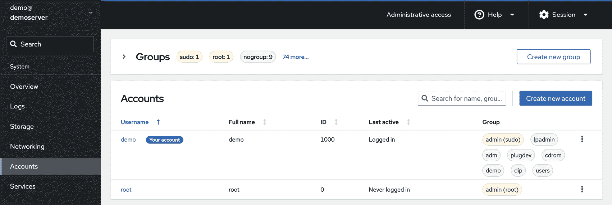
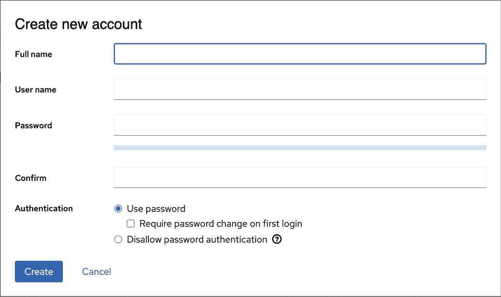
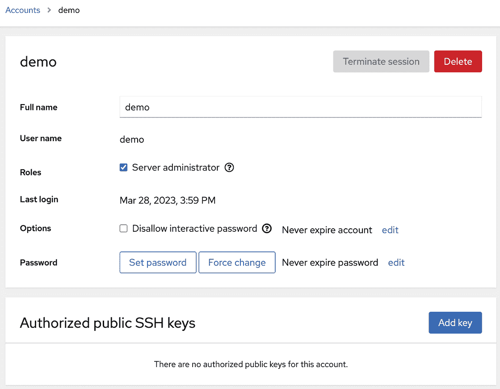
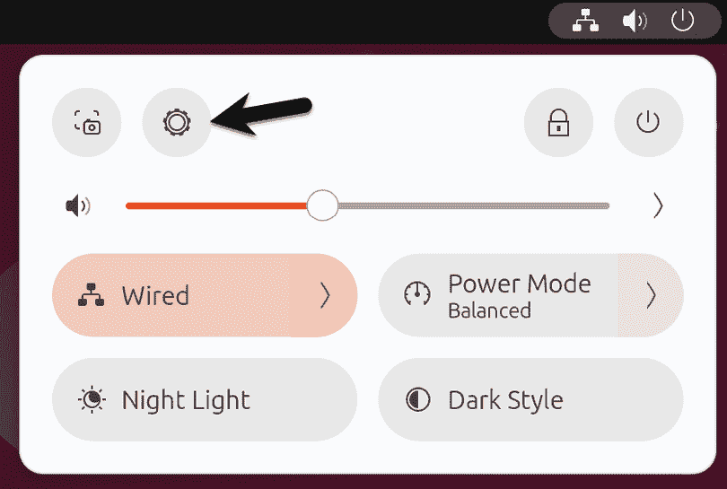
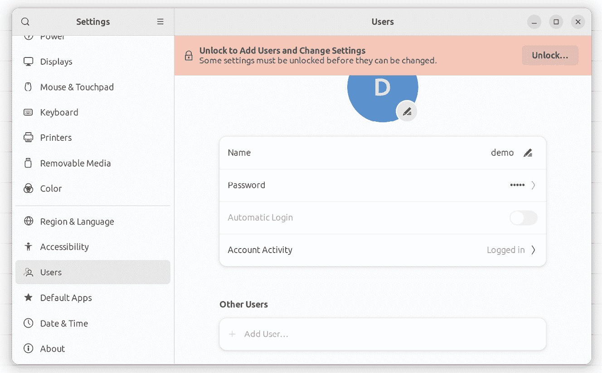
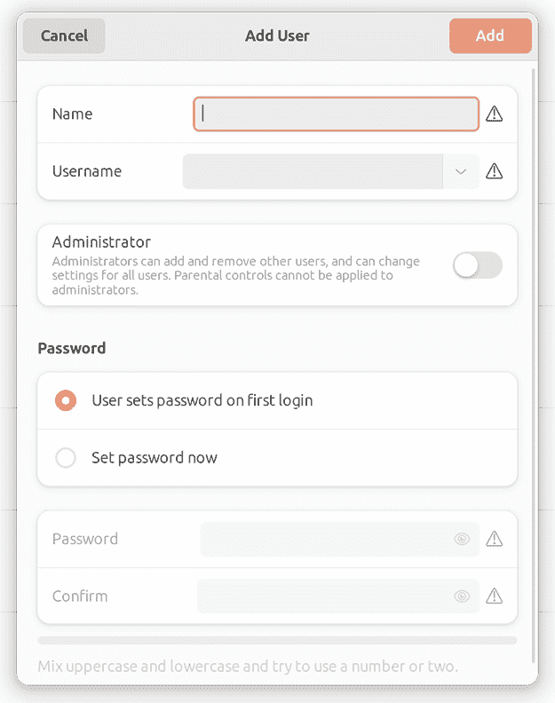
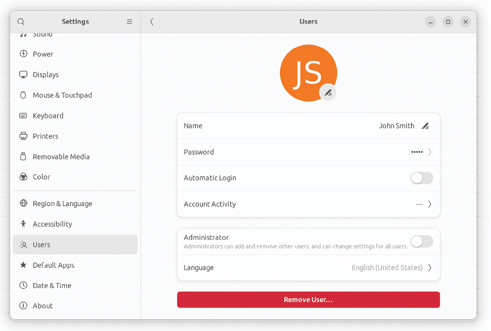

9\. 管理 Ubuntu 23.04 用户和组

在安装 Ubuntu 时，安装程序创建了一个 root 或超级用户账户，并要求配置密码。安装程序还提供了创建系统用户账户的机会。我们应该记住，Ubuntu 是一个企业级的、多用户、多任务操作系统。因此，为了充分利用 Ubuntu 的功能，可能需要为多个用户提供系统访问权限。每个用户应该拥有自己的用户账户登录、密码、主目录和权限。

用户进一步被分配到组中，以便更容易地管理，这些组可以有不同级别的权限。例如，您可能有一组在会计部门工作的用户。在这种环境中，您可以创建一个 accounts 组，并将所有会计部门的用户分配到该组。

本章将介绍在 Ubuntu 系统中添加、删除和管理用户及组的步骤。可以使用命令行工具、Cockpit Web 界面以及桌面设置应用来管理 Ubuntu 上的用户和组。在本章中，我们将探讨这些用户管理方法。

9.1 从命令行管理用户

新用户可以通过命令行使用 adduser 工具添加到 Ubuntu 系统中。要创建一个新用户账户，请输入类似以下的命令：

# 第九章：adduser john

默认情况下，这将为用户在 /home 目录下创建一个主目录（在本例中为 /home/john）。要指定不同的主目录，请在创建账户时使用 --home 命令行选项：

# adduser --home /users/johnsmith john

adduser 命令在创建账户时会提示输入密码。此密码可以通过 passwd 命令稍后更改：

# passwd john

正在更改用户 john 的密码。

新密码：

重新输入新密码：

passwd：所有认证令牌已成功更新。

可以使用 deluser 工具通过命令行删除现有用户。虽然这将删除账户，但用户的文件和数据将保留在系统中：

# deluser john

在删除过程中，也可以删除用户的主目录和邮件队列：

# deluser --remove-home john

Ubuntu 系统上的所有用户都是一个或多个组的成员。默认情况下，新用户会被添加到与用户同名的私有组（在上述示例中，为用户 john 创建的账户是一个名为 john 的私有组的成员）。但是，作为管理员，组织用户到更合乎逻辑的组中是很有意义的。例如，所有销售人员可能属于销售组，会计人员可能属于会计组，依此类推。新组可以使用命令行工具 groupadd 添加，例如：

# groupadd accounts

使用 usermod 工具从命令行将现有用户添加到现有组：

# usermod -G accounts john

要将现有用户添加到多个现有组中，请使用 -G 选项运行 usermod 命令：

# usermod -G accounts,sales,support john

请注意，上述命令会将用户从未列出但当前属于的辅助组中移除。要保留当前的组成员身份，请使用 -a 标志来追加新的组成员身份：

# usermod -aG accounts,sales,support john

可以使用 groupdel 工具删除系统中的现有组：

# groupdel accounts

请注意，如果要删除的组是任何用户的主组或初始组，则无法删除该组。在删除组之前，必须先删除该用户或使用 usermod 命令将其分配到新主组。可以使用 usermod -g 选项将用户分配到新主组：

# usermod -g sales john

# groupdel accounts

运行 groups 命令以查找用户所属的组。例如：

$ groups john

john : accounts support

默认情况下，用户账户无法执行需要超级用户（root）权限的任务，除非他们知道 root 密码。然而，可以配置用户账户，使得可以通过 sudo 命令执行特权任务。这需要将用户账户添加为 sudo 组的成员，例如：

# adduser john sudo

一旦加入 sudo 组，用户就可以使用 sudo 执行其他受限任务，如下所示：

# apt update

Hit:1 http://us.archive.ubuntu.com/ubuntu jammy InRelease

Hit:2 http://security.ubuntu.com/ubuntu jammy-security InRelease

可以通过编辑 /etc/sudoers 文件并定位到以下部分来修改 sudo 组的 sudo 权限：

## 允许 sudo 组中的成员运行所有命令

%sudo ALL=(ALL) ALL

要禁用所有 sudo 组成员的 sudo 权限，请按如下方式注释掉第二行：

## 允许 sudo 组中的成员运行所有命令

# %sudo ALL=(ALL) ALL

要允许 sudo 组成员使用 sudo 而无需输入密码（出于安全原因，不建议这样做），请按如下方式修改 sudoers 文件：

## 不输入密码的同样操作

%sudo ALL=(ALL) NOPASSWD: ALL

在后台，这些命令只是修改系统上的 /etc/passwd、/etc/group 和 /etc/shadow 文件。

9.2 使用 Cockpit 进行用户管理

如果系统已安装并启用了 Cockpit Web 界面（该主题在“Cockpit Web 界面概述”章节中讨论），则可以在下图中的账户屏幕上执行多个用户和组管理任务，图 9-1 如下所示：

图 9-1

屏幕将显示系统中现有的用户账户，并提供一个按钮来添加额外的账户。要创建新账户，请点击“创建新账户”按钮，并在弹出的对话框中输入所需的信息（图 9-2）。请注意，系统也提供了创建账户但锁定账户直到稍后使用的选项：

图 9-2

要修改用户账户，请从主屏幕中选择该账户并修改账户详细信息：

图 9-3

此屏幕允许进行各种操作，包括锁定或解锁账户、修改密码或强制用户设置新密码。此外，如果选择“服务器管理员”选项，用户将被添加到 sudo 组，并允许使用 sudo 执行管理任务。还提供一个按钮可删除系统中的用户。

如果用户通过带有密钥加密的 SSH 连接远程访问系统，可以在此屏幕中添加用户的公钥。关于 SSH 访问和身份验证的内容将在后续的《在 Ubuntu 23.04 上配置基于 SSH 密钥的身份验证》中详细介绍。

9.3 使用设置应用进行用户管理

通过 GNOME 桌面设置应用提供了第三种用户账户管理选项。可以通过点击 GNOME 桌面右上角的图标并选择设置选项来访问此应用，如图 9-4 所示：

图 9-4

当主设置屏幕出现时，点击左侧导航面板中的“用户”选项。默认情况下，设置将被锁定，无法对系统中的用户账户进行任何更改。要解锁设置应用，请点击下方图 9-5 中的“解锁”按钮，并输入您的密码。请注意，只有以具有 sudo 权限的用户身份登录时，才能解锁设置：

图 9-5

一旦应用解锁，点击“添加用户...”以显示下图中的对话框（见图 9-6）：

图 9-6

如果需要，可以选择管理员选项为新用户分配 sudo 访问权限。接下来，输入用户的全名和用户名，并立即设置密码，或者允许用户在首次登录账户时设置密码。输入信息后，点击“添加”按钮创建账户。

可以随时通过在“用户”界面中选择相应的图标查看、修改或删除现有用户的设置，如图 9-7 所示。还可以查看用户的登录活动。请注意，在对账户进行任何更改之前，需要再次解锁设置应用。

图 9-7

9.4 小结

作为一个多用户操作系统，Ubuntu 被设计为支持多用户的受控访问。在安装过程中，创建了 root 用户账户并设置了密码，同时也提供了创建用户账户的选项。可以通过命令行工具、Cockpit Web 界面或 GNOME 设置应用来添加额外的用户账户。除了用户账户，Linux 还实现了组的概念。可以通过命令行工具添加新组，并将用户分配到这些组，每个用户必须至少属于一个组。默认情况下，标准的非 root 用户没有权限执行特权任务。然而，属于特殊 sudo 组的用户可以通过使用 sudo 命令来执行特权任务。
