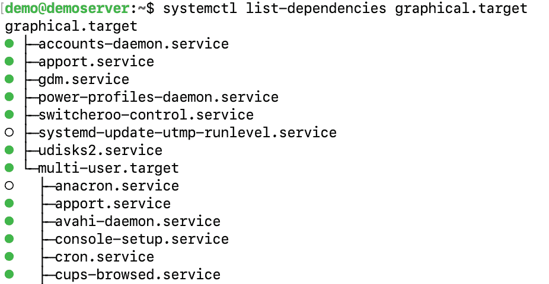
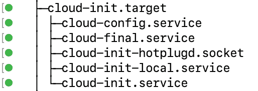
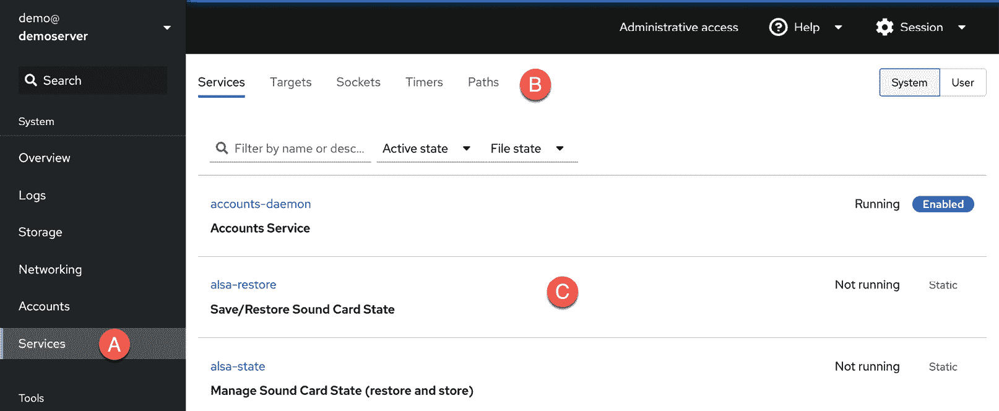
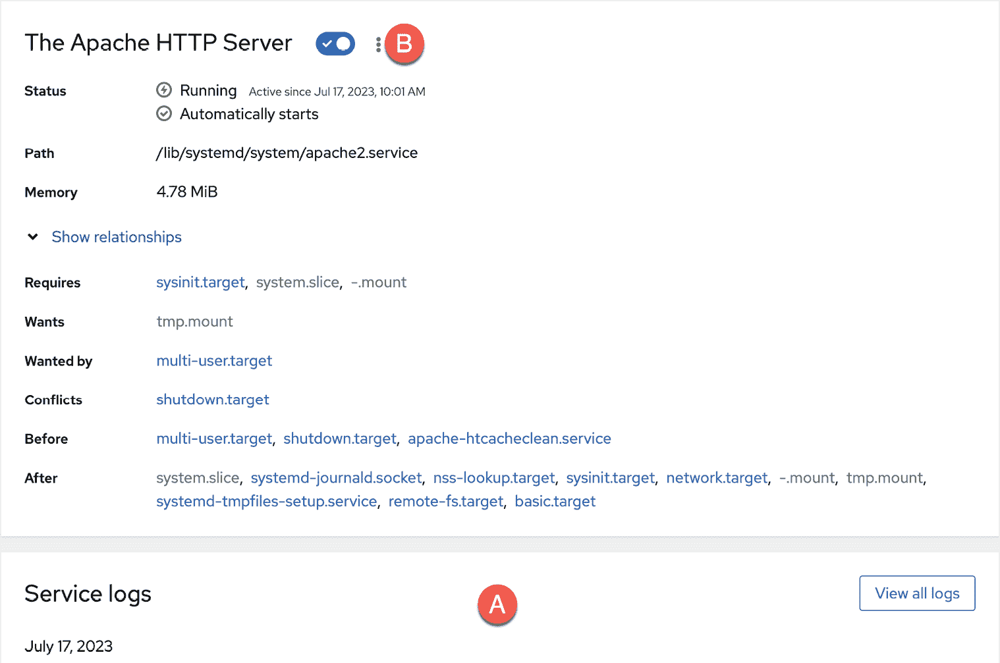

10. 管理 Ubuntu 23.04 systemd 单元

要精通 Ubuntu 系统管理，理解 systemd 单元的概念至关重要，特别是对两种特定类型的了解：目标和服务。本章提供了对 Ubuntu 支持的不同 systemd 单元的基本概述，并介绍了如何配置在运行中的 Linux 系统后台运行的众多服务。

10.1 理解 Ubuntu systemd 目标

Ubuntu 可以配置为启动到多个状态之一（称为目标），每个状态旨在提供特定级别的操作系统功能。系统管理员根据系统的使用目的，配置系统默认启动的目标。例如，桌面系统可能会配置为使用图形用户界面目标启动。相比之下，基于云的服务器系统更有可能启动到多用户目标级别。

在启动过程中，一个名为 systemd 的进程会在 /etc/systemd/system 文件夹中查找默认的目标设置。确定默认目标后，systemd 会启动与该目标相关联的 systemd 单元，从而使系统启动时所有必要的进程都在运行。

对于熟悉旧版 Ubuntu 的用户，systemd 目标替代了旧的运行级别系统。

10.2 理解 Ubuntu systemd 服务

服务是一个进程，通常在后台运行，提供特定的功能。例如，sshd 服务是一个后台进程（也称为守护进程），它提供对系统的安全 shell 访问。不同的 systemd 目标被配置为根据目标要提供的功能自动启动不同的服务集合。

目标和服务是 systemd 单元的类型，本章稍后将对此进行详细讨论。

10.3 Ubuntu systemd 目标描述

如前所述，Ubuntu 可以启动到多个目标级别。系统配置为启动到的默认目标将决定启动哪些 systemd 单元。与系统启动和关闭相关的目标可以总结如下：

• poweroff.target - 该目标会关闭系统。你不太可能希望将其作为默认目标。

• rescue.target – 使系统启动为单用户模式，在该模式下只有 root 用户可以登录。系统不会在此模式下启动任何网络、图形用户界面或多用户服务。此运行级别非常适合系统管理员执行系统维护或修复活动。

• multi-user.target - 将系统启动到多用户模式，并提供基于文本的控制台登录功能。

• graphical.target - 将系统启动到具有 X 窗口系统功能的网络化、多用户状态。默认情况下，图形桌面环境将在启动过程结束时启动。这是桌面或工作站使用中最常见的运行级别。

• reboot.target - 重启系统。由于显而易见的原因，这通常不是你希望设置为默认目标的目标。

除上述目标外，系统还包含大约 70 个其他目标，其中许多是上述主目标使用的子目标。例如，在后台，multi-user.target 还会启动一个名为 basic.target 的目标，而 basic.target 会启动 sockets.target 单元，该单元对于不同进程间的通信至关重要。这确保了在启动过程中，所有 multi-user.target 所依赖的服务也会被启动。

可以通过在终端窗口中运行以下命令，查看指定目标所依赖的目标和服务列表：

# systemctl list-dependencies <target>

例如，图 11-1 显示了图形目标（完整列表包含超过 140 个目标和服务，要求一个功能完备的多用户系统）的一部分 systemd 单元依赖关系：

图 10-1

列表呈现为层次结构树，展示了某些依赖项如何具有自己的子依赖项。例如，滚动到列表底部，可以发现图形目标依赖于一个名为 cloud-init.target 的云相关服务，而该服务又有自己的服务依赖项：

图 10-2

列表中每个条目左侧的彩色点表示该服务或目标的当前状态，如下所示：

•绿色 - 服务或目标正在活动并运行。

•白色 - 服务或目标处于非活动状态（已死）。通常是因为服务或目标尚未启用，或由于某种原因已停止，或服务或目标所依赖的条件尚未满足。

•红色 - 服务或目标因致命错误而未能启动。

若要了解 systemd 单元的更多详细状态信息，请使用 systemctl status 命令并跟随单元名称，如下所示：

# systemctl status systemd-machine-id-commit.service

○ systemd-machine-id-commit.service - 提交瞬态的机器 ID 到磁盘

已加载：已加载 (/usr/lib/systemd/system/systemd-machine-id-commit.service; static)

活跃：非活动（已死）

Condition: 启动条件失败，时间：2023-03-30 08:41:05 EDT，16 分钟前

└─ ConditionPathIsMountPoint=/etc/machine-id 未满足

文档：man:systemd-machine-id-commit.service(8)

10.4 确定和配置默认目标

当前 Ubuntu 系统的默认目标可以通过 systemctl 命令识别，如下所示：

# systemctl get-default

multi-user.target

在上述情况下，系统配置为默认使用多用户目标启动。默认设置可以随时使用带有 set-default 选项的 systemctl 命令进行更改。以下示例将默认目标更改为下次启动系统时启动图形用户界面：

# systemctl set-default graphical.target

移除了 /etc/systemd/system/default.target。

创建符号链接 /etc/systemd/system/default.target → /lib/systemd/system/graphical.target。

默认更改操作的输出显示了 systemctl 命令在后台执行的步骤，以实现更改。当前默认通过在 /etc/systemd/system 中的 default.target 文件建立符号链接，指向 /usr/lib/systemd/system 文件夹中的相应目标文件（在此例中为 graphical.target 文件）来配置。

10.5 理解 systemd 单元和单元类型

如前所述，目标和服务都是 systemd 单元的类型。/usr/lib/systemd/system 文件夹中的所有文件都被称为 systemd 单元配置文件，每个文件代表一个 systemd 单元。每个单元又按特定单元类型进行分类。Ubuntu 支持 12 种不同的单元类型，包括本章已介绍的目标和服务单元类型。

单元文件的类型由文件名扩展名表示，具体见下表 表 10-1：

| 单元类型 | 文件扩展名 | 类型描述 |
| --- | --- | --- |
| 服务 | .service | 系统服务。 |
| 目标 | .target | systemd 单元组。 |
| 自动挂载 | .automount | 文件系统自动挂载点。 |
| 设备 | .device | 内核识别的设备文件。 |
| 挂载 | .mount | 文件系统挂载点。 |
| 路径 | .path | 文件系统中的文件或目录。 |
| 范围 | .scope | 外部创建的进程。 |
| 切片 | .slice | 管理系统进程的层级组织单元组。 |
| 快照 | .snapshot | systemd 管理器的保存状态。 |
| 套接字 | .socket | 进程间通信套接字。 |
| 交换 | .swap | 交换设备或交换文件。 |
| 定时器 | .timer | systemd 定时器。 |

表 10-1

请注意，目标单元类型与其他类型不同，它包含一组系统的 systemd 单元，如服务或其他目标。

10.6 动态更改当前目标

如前所述的 systemctl set-default 命令指定了系统下次启动时将使用的目标，但不会更改当前系统的状态。要动态切换到其他目标，请再次使用 systemctl 命令，使用 isolate 选项后跟目标名称。例如，要在不重启的情况下将当前系统切换到图形目标，可以使用以下命令：

# systemctl isolate graphical.target

执行后，系统将启动图形桌面环境。

10.7 启用、禁用和屏蔽 systemd 单元

新安装的 Ubuntu 系统将包含基本的 systemd 服务单元，但不太可能包含系统在进入生产环境后最终需要的所有服务。例如，基本的 Ubuntu 安装通常不包括运行 Apache Web 服务器所需的包，其中一个关键元素是 apache2.service 单元。

系统管理员将通过使用以下命令安装必要的 apache2 包来解决此问题：

# apt install apache2

配置好 Web 服务器后，下一步将是检查 apache2 服务单元的状态，以确认它是否在安装过程中被激活：

# systemctl status apache2.service

● apache2.service - Apache HTTP 服务器

加载：已加载（/lib/systemd/system/apache2.service；已禁用；供应商预设）

活跃：已激活（运行中），自 2023-07-17 14:01:13 UTC 起；40 秒前

文档：https://httpd.apache.org/docs/2.4/

主 PID：22328（apache2）

任务：55（限制：4517）

内存：4.7M

CPU：24ms

CGroup: /system.slice/apache2.service

├─22328 /usr/sbin/apache2 -k start

├─22329 /usr/sbin/apache2 -k start

└─22330 /usr/sbin/apache2 -k start

请注意，服务状态可能会显示为已加载但未激活，这是因为它在首次安装时由供应商预设为禁用。要启动一个未激活的服务，可以使用以下命令：

# systemctl start apache2.service

在上述示例输出中，状态指示该服务已禁用。这意味着，下次系统重启时，apache2 服务将不会自动启动，必须由系统管理员手动启动。

要配置一个服务，每次系统启动时自动启动，必须按如下方式启用它：

# systemctl enable apache2.service

当前正在运行的服务可以随时按如下方式停止：

# systemctl stop apache2.service

现在，它已被启用，下次系统重启到当前目标时，apache2 服务将自动启动。例如，假设在系统运行 multi-user 目标时启用了该服务，那么 apache2 服务将作为另一个依赖项添加到 multi-user.target systemd 单元中。

在后台，systemctl 通过在 /etc/systemd/system 文件夹中的目标下创建符号链接，将依赖项添加到目标。例如，multi-user.target 单元在 /etc/systemd/system 中有一个名为 multi-user.target.wants 的文件夹，里面包含指向位于 /usr/lib/systemd/system 中所有依赖的 systemd 单元的符号链接。审查此文件夹将显示与前面章节中 systemctl list-dependencies 命令列出的依赖项之间的关联。

要配置一个服务，使其不再作为目标依赖项自动启动，可以按如下方式停用它：

# systemctl disable apache2.service

此命令将从 .wants 目录中删除到 apache2.service 单元文件的符号链接，这样它就不再是依赖项，因此在系统下次启动时不会被启动。

.wants 文件夹包含一些依赖项，如果这些依赖项不可用，也不会阻止单元的启动和运行。必须的依赖项（换句话说，若不可用将导致单元启动失败的依赖项）应放置在 .requires 文件夹中（例如，multi-user.target.requires）。

除了启用和禁用外，还可以按如下方式屏蔽 systemd 单元：

# systemctl mask apache2.service

被屏蔽的 systemd 单元在任何情况下都不能被启用、禁用或启动，即使它被列为其他单元的依赖项。就系统而言，屏蔽的 systemd 单元就好像不再存在一样。这对于确保某个单元永远不会启动，无论系统条件如何，都非常有用。恢复访问该服务的唯一方法是取消屏蔽它：

# systemctl unmask apache2.service

10.8 在 Cockpit 中操作 systemd 单元

除了本章中概述的命令行技术外，还可以通过 Cockpit 基于 Web 的界面查看和管理 systemd 单元。例如，假设已按照《Cockpit Web 界面概述》一章中的说明安装并设置了 Cockpit，可以通过登录 Cockpit 并在左侧导航面板中选择服务选项（如图 10-3 中标记的 A），访问系统中 systemd 单元的列表：

图 10-3

标记为 B 的选项行在标记为 C 的主区域中显示特定类型的单元，在该区域中，每个单元的当前状态会列在状态列中。

从列表中选择一个单元将显示详细信息。例如，图 10-4 显示了一个 apache2 实例的详细信息屏幕，包括服务日志 (A) 以及用于执行启动、停止、启用/禁用和屏蔽/取消屏蔽等任务的开关和菜单 (B)：

图 10-4

10.9 总结

新安装的 Ubuntu 系统包含一组基础的 systemd 单元，其中许多在后台运行，提供系统的主要功能。这些单元按类型分类，最常见的是目标和服务。目标单元是一组将要一起启动的其他单元。系统有一个默认的目标单元，定义了每次系统启动时要启动的其他单元。最常见的目标是将系统启动到多用户模式或图形模式。此外，systemctl 命令行工具提供了一系列选项，用于执行 systemd 单元配置任务，其中许多也可以通过 Cockpit 基于 Web 的界面来完成。
