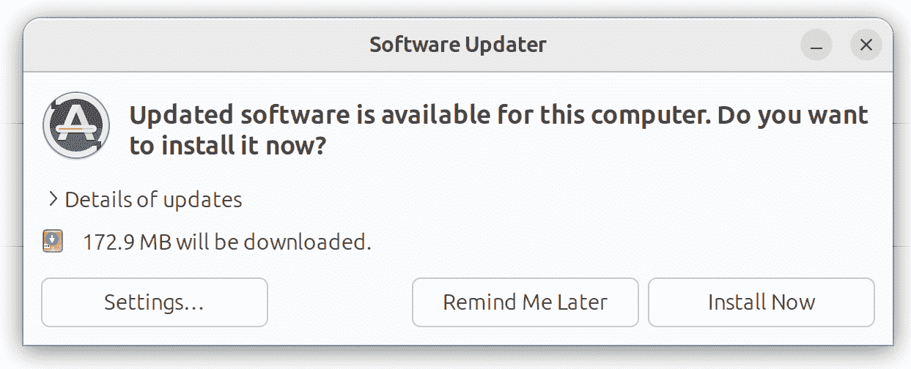
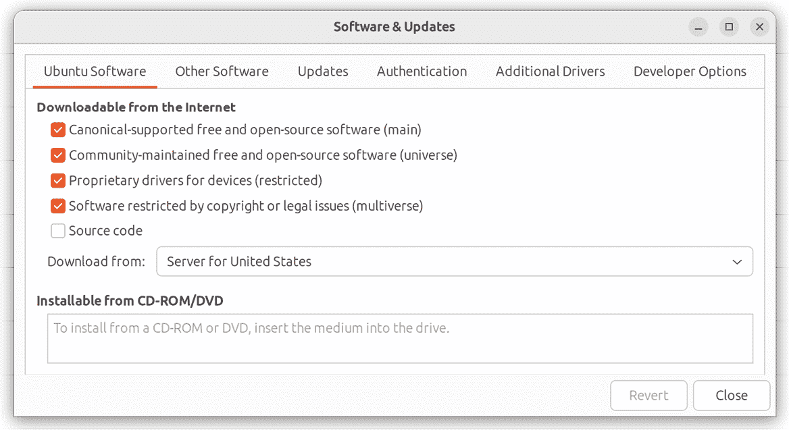
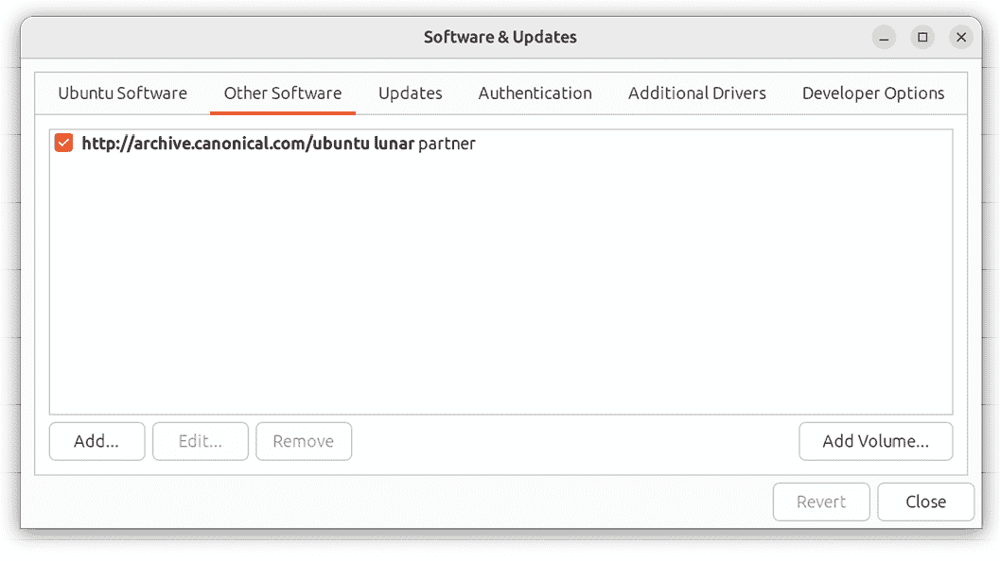
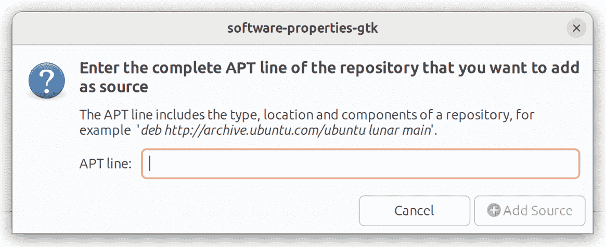
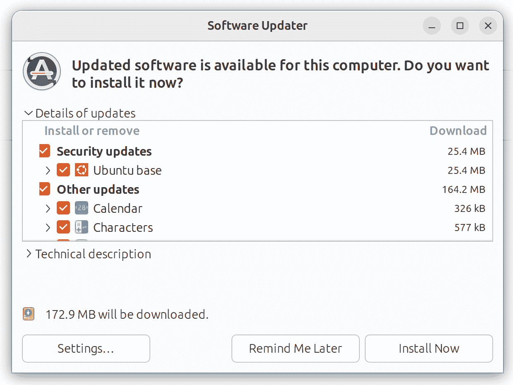
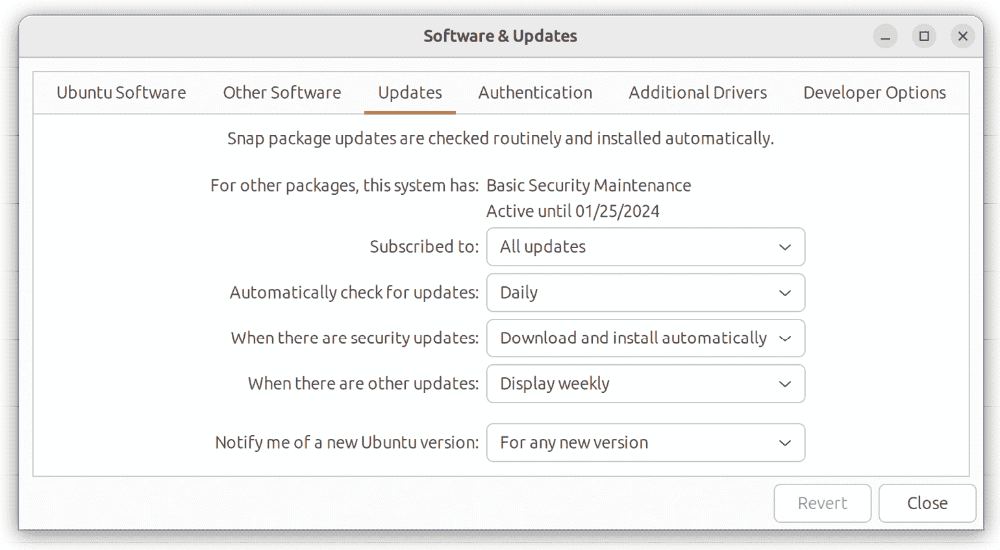

11\. Ubuntu 软件包管理和更新

新安装的 Ubuntu 系统很可能不会包含执行其预期任务所需的所有软件包。即使安装了所有必需的软件，也几乎可以肯定，在系统的生命周期内，许多软件包会发布更新的版本。在某些情况下，您需要确保这些最新的软件包版本已安装，以便修复错误和安全漏洞。

本章介绍了 Ubuntu 上软件管理的基本概念，解释了这些问题是如何解决的，并探索了软件仓库和软件包的概念，同时介绍了如何列出、安装和移除构成功能性 Ubuntu 系统的软件包。

11.1 软件仓库

Linux 本质上由一组基础软件包组成，这些软件包提供操作系统的核心功能，以及一系列其他软件包和模块，这些软件包和模块在基础操作系统上增加了功能和特性。

当 Ubuntu 首次安装时，会根据安装阶段选择的软件选项安装一些不同的软件包。然而，一旦系统启动并运行后，仍然可以根据需要安装额外的软件。通常，所有属于 Ubuntu 的软件（即不是由第三方供应商提供的软件）都是通过高级包管理工具（apt）命令下载并安装到系统中的。正如我们在前面的章节中看到的，这通常包括在命令提示符下发出类似以下的命令：

# apt install apache2

当发出这样的命令时，请求的软件会从远程仓库下载并安装到本地系统。默认情况下，Ubuntu 配置为从多个不同的仓库下载软件：

•main - 包含由 Ubuntu 官方支持、测试和更新的核心软件包集。

•restricted - 用于硬件设备的专有驱动程序，这些设备没有开源等效驱动程序。

•universe - 包含 Ubuntu 团队在 Canonical 公司没有正式支持的包。然而，这些包由 Ubuntu 社区维护，并包含一些在主仓库中不可用的包。

•multiverse - 可能由于版权或其他法律问题，这些包无法符合 Ubuntu 发布的开源许可条款。

当前在 Ubuntu 系统上启用的仓库列表包含在 /etc/apt/sources.list 文件中，可以将其加载到编辑器中进行查看和修改。该文件可以手动加载到编辑器中，或者使用可用编辑器之一通过以下命令进行编辑：

# apt edit-sources

该文件的前几行通常会引用主仓库和受限仓库，例如：

deb http://ports.ubuntu.com/ubuntu-ports/ jammy main restricted

在上述示例中，列表被配置为允许从主仓库和限制仓库下载软件包。宇宙和多元仓库的条目也会被包含在文件中：

## 注意：来自此仓库的软件可能未经过测试。

## 该仓库的内容并不像主发布版本中的那样广泛，但它包括了

## 某些应用程序的更新版本可能提供有用的功能。

## 另外，请注意，回溯库中的软件将**不会**进行任何审核。

## 或来自 Ubuntu 安全团队的更新。

deb http://us.archive.ubuntu.com/ubuntu/ lunar-backports main restricted universe multiverse

要禁用某个仓库以使其不再用于下载软件包，只需通过在行前加上“#”字符来注释掉该行：

#deb http://ports.ubuntu.com/ubuntu-ports/ lunar-backports main restricted universe multiverse

除了标准仓库外，还有许多第三方仓库。如果你需要使用其中之一，只需将其条目添加到 sources.list 文件中。例如，合作伙伴仓库可以按如下方式添加到 sources.list 文件：

deb http://archive.canonical.com/ubuntu lunar partner

修改后，运行以下命令以提交更改：

# apt update

11.2 使用软件和更新管理软件仓库

作为使用命令行的替代方案，可以通过 GNOME 桌面环境中的软件和更新应用来配置仓库。要启动此应用，按下键盘上的特殊键（在 Windows 键盘上为 Windows 键，在 macOS 上为命令键，在 Chromebook 上为带有放大镜的键），并在搜索栏中输入“Software & Updates”。在结果面板中点击相应的图标以启动应用。或者，打开终端窗口并运行以下命令：

$ update-manager

当应用程序加载时，点击图 11-1 中所示的设置按钮：

图 11-1

在设置页面中，启用或禁用在“从互联网下载”标题下列出的所需仓库：

图 11-2

要启用合作伙伴仓库，选择图 11-3 中所示的“其他软件”选项卡：

图 11-3

要添加其他第三方仓库，点击“添加...”按钮，并在弹出的对话框中输入仓库信息：

图 11-4

11.3 使用 APT 管理软件包

apt 工具提供了一种直接从命令行执行大多数软件包管理任务的方法。在本节中，我们将探讨一些更常用的 apt 命令行选项。

Ubuntu 系统保持一份最新的软件包信息的本地副本，因此建议在执行任何其他 apt 操作之前，首先更新此列表，如下所示：

# apt 更新

apt 操作中最常见的一项活动是执行软件包安装：

# apt 安装 package_name

同样，已安装的软件包可以使用 remove 选项从系统中移除：

# apt 移除 package_name

当以这种方式移除一个软件包时，关联的配置文件会保留在系统上。这使得以后可以重新安装该软件包，而不会丢失任何自定义配置设置。要在删除过程中，或即使在删除后，也删除这些文件，请使用 purge 选项：

# apt 清除 package_name

要获取可安装的软件包列表，请按照以下方式使用 apt：

# apt 列出

或者，要仅列出已安装的软件包，请使用带有 --installed 标志的 list 选项：

# apt 列出 --installed

要检查某个特定软件包是否已安装在系统上，可以将 list 选项与软件包名称结合使用：

# apt 列出 package_name

使用搜索选项列出所有符合特定标准的软件包。例如，要列出所有与 Apache Web 服务器相关的软件包：

# apt 搜索 apache

要查找包含特定文件的软件包，请使用 apt-file 命令。例如，要列出包含名为 gimp 的文件的软件包名称：

# apt-file --package-only 列出 gimp

要查看有关软件包的详细信息，请使用 show 选项运行 apt：

# apt 显示 apache2

执行上述命令时的典型输出可能如下所示：

软件包：apache2

版本：2.4.52-1ubuntu4.5

优先级：可选

部门：web

来源：Ubuntu

维护者：Ubuntu 开发者 <ubuntu-devel-discuss@lists.ubuntu.com>

原始维护者：Debian Apache 维护者 <debian-apache@lists.debian.org>

错误： https://bugs.launchpad.net/ubuntu/+filebug

已安装大小：546 kB

提供：httpd，httpd-cgi

预依赖：init-system-helpers (>= 1.54~)

依赖：apache2-bin (= 2.4.52-1ubuntu4.5)，apache2-data (= 2.4.52-1ubuntu4.5)，apache2-utils (= 2.4.52-1ubuntu4.5)，lsb-base，mime-support，perl:any，procps

推荐：ssl-cert

建议：apache2-doc，apache2-suexec-pristine | apache2-suexec-custom，www-browser，ufw

冲突：apache2.2-bin，apache2.2-common

替代：apache2.2-bin, apache2.2-common

主页：https://httpd.apache.org/

任务：lamp-server

下载大小：97.8 kB

APT-手动-安装：是

APT 来源：http://us.archive.ubuntu.com/ubuntu jammy-updates/main amd64 软件包

描述：Apache HTTP 服务器

Apache HTTP 服务器项目的目标是构建一个安全、高效且符合标准的可扩展 HTTP 服务器，作为开源软件。

可扩展的 HTTP 服务器，作为符合标准的开源软件。

结果长期以来一直是互联网上最受欢迎的网页服务器。

.

安装此软件包将导致完整安装，包括

配置文件、初始化脚本和支持脚本。

11.4 执行更新

在基础操作系统和已安装的软件包的生命周期内，多个更新将发布以解决问题并增加功能。要从命令行手动下载并安装任何待处理的更新，第一步是使用 apt 的更新选项更新存储在本地系统上的包信息：

# apt update

一旦包信息更新完成，就可以执行升级操作。此操作将从 sources.list 文件中配置的存储库下载当前安装包的所有更新，并将其安装到系统中：

# apt upgrade

作为命令行的替代方法，可以使用“软件和更新”GNOME 桌面应用程序来更新系统。如果有更新可用，显示如图 11-5 所示的对话框，其中提供了查看可用更新信息和执行升级的选项：

图 11-5

11.5 启用自动更新

前一节讲解了如何手动安装软件包升级。Ubuntu 系统也可以配置为自动安装升级。这可以通过命令行或“软件和更新”工具来配置。

在“软件和更新”工具中，按照前述步骤打开设置屏幕并点击“更新”标签页，显示如图 11-6 所示的屏幕：

图 11-6

选择系统检查更新的频率（每日、每隔一天、每周等）。接下来选择在更新可用时要执行的操作（仅下载、下载并安装，或在桌面上显示通知）。你还可以配置更新程序在新版本的 Ubuntu 可用时通知你。

要从命令行配置自动更新，请按照以下步骤操作：

1\. 安装 unattended-upgrades 包：

# apt install unattended-upgrades

2\. 编辑 /etc/apt/apt.conf.d/50unattended-upgrades 文件并找到以下行：

.

.

"${distro_id}ESMApps:${distro_codename}-apps-security";

"${distro_id}ESM:${distro_codename}-infra-security";

// "${distro_id}:${distro_codename}-updates";

// "${distro_id}:${distro_codename}-proposed";

// "${distro_id}:${distro_codename}-backports";

.

.

3\. 移除要自动安装更新的存储库类型的 // 注释标记。

4\. 编辑 /etc/apt/apt.conf.d/20auto-upgrades 文件，并声明系统检查更新的频率（以天为单位）：

APT::Periodic::Update-Package-Lists "1";

APT::Periodic::Download-Upgradeable-Packages "1";

APT::Periodic::AutocleanInterval "0";

APT::Periodic::Unattended-Upgrade "1";

4\. 执行干运行更新，确保设置有效：

# unattended-upgrades --dry-run --debug

配置自动更新几天后，检查日志文件以确认更新是否按计划进行：

# cat /var/log/unattended-upgrades/unattended-upgrades.log

11.6 总结

Ubuntu 操作系统包含成千上万的软件包，这些软件包从主仓库、受限仓库、宇宙仓库、多元宇宙仓库、合作伙伴仓库和第三方仓库中下载并安装。

软件包通过高级软件包工具（apt）或其他几种图形化桌面工具进行安装，并从 `sources.list` 文件中定义的仓库下载。

除了安装和卸载软件包外，apt 还可以用于升级这些软件包，获取最新的更新。这些软件升级可以手动执行，也可以配置为自动更新。
