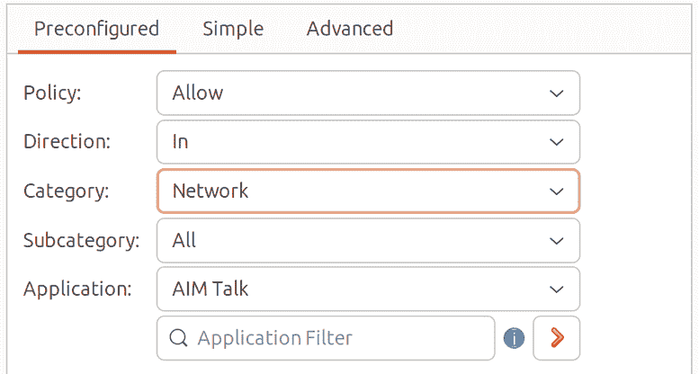
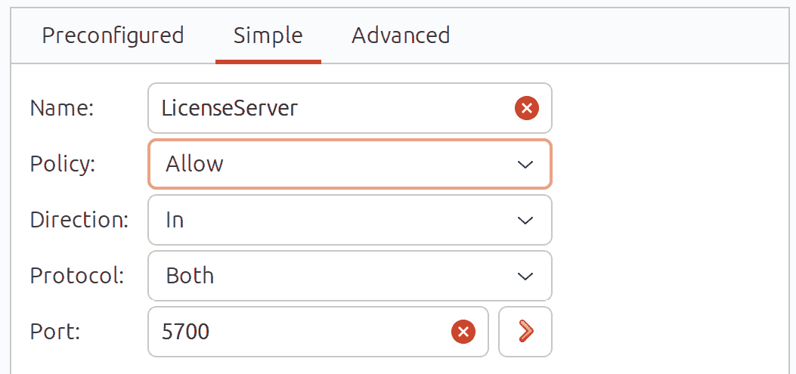

15. 使用 gufw 和 ufw 配置 Ubuntu 防火墙

在上一章，我们查看了 Ubuntu 系统上的端口和服务。我们还简要地了解了 Ubuntu 上的 iptables 防火墙规则，包括从命令行创建一些非常简单的规则。在本章中，我们将介绍一种更用户友好的 iptables 配置方法，使用两个名为 gufw 和 ufw 的工具。正如我们所看到的，gufw 和 ufw 提供了对进出网络流量和连接的高度控制，而无需理解低级的 iptables 语法。

15.1 gufw 和 ufw 概述

Ubuntu 附带了一个名为 ufw 的软件包，它是 Uncomplicated Firewall（简易防火墙）的缩写。该软件包提供了一个命令行接口，用于管理和配置基于 Netfilter iptables 的防火墙规则。gufw 工具提供了一个用户友好的图形界面，旨在使防火墙管理成为可能，而无需在命令行中发出 ufw 命令。

15.2 在 Ubuntu 上安装 gufw

尽管 ufw 默认安装在 Ubuntu 中，但 gufw 软件包并未安装。因此，要安装 gufw，请打开终端窗口（Ctrl-Alt-T），并在提示符下输入以下命令：

# 第十五章：apt install gufw

15.3 运行和启用 gufw

安装完成后，通过在 GNOME 桌面中按下 Alt-F2 并在“运行命令”文本框中输入 gufw 来启动 gufw。首次启动时，防火墙可能会被禁用，如图 15-1 所示。

要启用防火墙，请将状态开关（A）移至开启位置。默认情况下，主面板（D）将显示 gufw 首页，其中包含有关该工具的一些基本信息。选择按钮行（C）中的选项将更改面板中显示的信息。例如，选择“规则”按钮以添加、删除和查看规则。

gufw 工具提供了一小组预配置的配置文件，适用于工作、家庭和公共环境。要更改配置文件并查看设置，请从菜单（B）中选择配置文件。要修改现有配置文件，从菜单中选择它，并使用 Incoming 和 Outgoing 菜单更改选择。要配置特定规则，请显示规则屏幕，并根据需要添加、删除和修改规则。然后，这些规则将应用于当前选定的配置文件。

图 15-1

当前选择的配置文件决定了防火墙如何处理在没有任何特定策略规则的情况下的流量。例如，默认情况下，Home 配置文件被设置为拒绝所有传入流量并允许所有传出流量。这些默认的策略设置可以通过 Incoming:和 Outgoing:菜单（E）进行更改。

默认策略的例外通过创建额外规则来定义。例如，使用“Home”配置文件拒绝传入流量时，需要添加规则以允许某些可接受的传入连接。这样的规则在安全社区中被称为白名单。

另一方面，如果将传入策略更改为“允许所有流量”，则所有传入流量都会被允许，除非为必须阻止的特定类型的连接创建了规则。这些规则，毫无疑问，被称为黑名单。黑名单/白名单方法同样适用于传入和传出连接。

15.4 创建新配置文件

虽然可以修改预定义的配置文件，但通常更有意义的是创建一个或多个配置文件来根据您的具体需求配置防火墙。通过选择“编辑”->“偏好设置...”菜单选项来创建新配置文件，弹出对话框如图 15-2 所示：

图 15-2

要添加新配置文件，请点击位于配置文件列表下方的“+”按钮。一个名为“Profile 1”的新配置文件将出现在列表中。要为配置文件提供更具描述性的名称，双击该条目进入编辑模式并输入新名称：

图 15-3

配置文件创建并命名后，点击“关闭”按钮返回主屏幕，从配置文件菜单中选择它并打开状态切换开关：

图 15-4

选择自定义配置文件后，可以设置一些自定义规则来覆盖默认的传入和传出设置。

15.5 添加预配置的防火墙规则

新规则通过点击“规则”按钮，然后点击位于规则面板底部的“+”按钮创建，如图 15-5 所示：

图 15-5

一旦选择，对话框将显示图 15-6，并且预配置选项卡被选中。预配置面板允许选择匹配特定应用程序和服务的规则。例如，可以通过选择应用程序菜单中的条目，并相应地选择策略和方向菜单来限制或允许来自 Skype 和 BitTorrent 等工具的流量。

为了帮助查找特定的应用程序或服务，可以使用类别和子类别菜单来过滤显示在应用程序菜单中的项。或者，只需在应用程序过滤器字段中输入应用程序或服务名称，以过滤菜单项：

图 15-6

“策略”菜单提供了以下选项来控制所选应用程序或服务的流量：

• 允许 – 该端口的流量被允许。

• 拒绝 – 该端口上的流量不被允许。请求的系统不会收到拒绝通知。数据包将被直接丢弃。

• 拒绝 - 该端口上的流量不被允许。数据包被丢弃，且请求系统会收到拒绝通知。

• 限制 – 如果相同的 IP 地址在 30 秒内尝试建立 6 次或更多连接，则拒绝连接。

一旦定义了规则，点击“添加”按钮将实现该规则，关闭添加规则对话框，新的规则将在 gufw 工具的主屏幕中列出（包括 IPv4 和 IPv6 协议的规则）：

图 15-7

要删除规则，在列表中选择它，然后点击对话框底部的“-”按钮。同样，可以通过选择现有规则并点击“-”按钮右侧的齿轮按钮来编辑规则。

15.6 添加简单防火墙规则

而预配置的规则允许根据众所周知的服务和应用程序配置防火墙，添加规则对话框的简单选项卡则允许通过引用相应的 TCP/IP 端口来简单地定义进出规则。已知应用程序和服务使用的端口仅代表可供应用程序使用的端口的一个小子集，并且可能需要为其定义防火墙规则。例如，一个第三方应用程序可能使用端口 5700 与远程服务器进行通信。如果是这种情况，则可能需要使用简单面板允许此特定端口的流量：

图 15-8

该规则可以配置为过滤 TCP、UDP 或两种流量类型。此外，可以将端口指定为单个端口号，或指定一个端口范围，起始端口和结束端口通过冒号分隔（例如，1000:1500 将规则应用于 1000 到 1500 之间的所有端口）。另外，也可以输入与该端口相关联的服务名称（例如，https 或 ssh）。

15.7 添加高级规则

到目前为止，我们只看过控制阻止流量类型的规则（例如，阻止端口 22 上的传入流量），不考虑流量的来源或目的地。然而，通常情况下，需要定义规则来基于 IP 地址或 IP 地址范围允许或拒绝流量。

为了举个例子，假设本地系统的 IP 地址为 192.168.0.102。可以配置防火墙仅允许来自 IP 地址为 192.168.0.105 的系统通过端口 22 访问。例如，为了实现这一点，“高级设置”面板中的“来源”字段应设置为请求连接的系统的 IP 地址（在本例中为 192.168.0.105）。

To: 字段提供了指定连接目标系统的 IP 地址和端口的选项。在此示例中，这将是本地系统（192.168.0.102）的端口 22。To: IP 地址实际上是可选的，可以留空：

图 15-9

假设默认的传入策略仍然设置为“拒绝”或“拒绝连接”，上述规则将仅允许来自 IP 地址为 192.168.0.105 的远程系统通过端口 22 访问本地系统。来自其他 IP 地址系统的 SSH 访问尝试将失败。请注意，如果目标系统是本地系统，则可以将 To: IP 地址字段留空。

上述对话框中的插入字段允许将新规则插入到现有规则列表中的指定位置，从而允许您控制规则在防火墙中应用的顺序。

还可以通过使用 IP 地址位掩码指定地址范围。例如，要为从 192.168.0.1 到 192.168.0.255 的 IP 地址范围创建规则，应将 IP 地址输入到 From: 字段中，格式为 192.168.0.0/24。

同样，要指定一个涵盖 IP 地址范围从 192.168.0.1 到 192.168.0.30 的规则，应该使用位掩码 27，即 192.168.0.0/27。

一个有用的计算器，用于识别每个位掩码值所涵盖的地址范围，可以在网上找到，网址是 [`subnet-calculator.com`](http://subnet-calculator.com)。

15.8 使用 ufw 从命令行配置防火墙

通过图形化 gufw 工具提供的所有防火墙配置选项也可以通过底层的命令行使用 ufw 命令进行配置。

要启用或禁用防火墙：

# ufw enable

# ufw disable

可以使用 status 选项获取防火墙的当前状态：

# ufw status

状态：活动

到  动作 来自

-- ------ ----

22 ALLOW 192.168.86.30

要获取更多详细的状态信息，请将上述命令与 verbose 选项结合使用：

# ufw status verbose

状态：活动

日志：开启（完整）

默认：拒绝（传入），允许（传出），拒绝（路由）

新配置文件：跳过

到  动作 来自

-- ------ ----

22 ALLOW IN 192.168.86.30

上例中的输出显示，防火墙的默认策略是拒绝所有传入和路由连接，同时允许所有传出连接。要更改这些默认设置，请使用带有 default 选项的 ufw 命令，语法如下：

# ufw default <策略> <方向>

例如，要默认启用所有传入连接：

# ufw default allow incoming

要允许或阻止特定端口的流量，请使用以下语法：

# ufw <策略> <端口号>/<可选协议>

例如，要允许端口 30 上的 TCP 和 UDP 传入流量：

# ufw allow 30

同样，要拒绝端口 5700 上的传入 TCP 流量：

# ufw deny 5700/tcp

规则也可以通过引用与端口对应的服务名称来声明。例如，要启用端口 22 上的 SSH 访问：

# ufw allow ssh

与 gufw 工具一样，ufw 也允许控制来自特定外部 IP 地址的访问。例如，要允许来自 IP 地址 192.168.0.20 的所有传入流量：

# ufw allow from 192.168.0.20

要特别拒绝来自某个 IP 地址的流量：

# ufw deny 192.168.0.20

要将 IP 地址 192.168.0.20 的访问限制为仅端口 22：

# ufw allow from 192.168.0.22 to any port 22

要进一步限制 IP 地址的访问仅限 TCP 数据包，请使用以下语法：

# ufw allow from 192.168.0.20 to any port 22 proto tcp

新规则在现有规则列表中的位置可以通过使用 insert 选项来声明。例如，要创建一个新规则并将其插入到规则列表的第 3 位：

# ufw insert 3 allow from 192.168.0.123 to any port 2

要显示带有关联编号的规则列表：

# ufw status numbered

状态：激活

To Action From

-- ------ ----

[ 1] 22 允许进入 192.168.86.30

[ 2] 30 允许进入 任何地方

[ 3] 22 允许进入 192.168.0.123

[ 4] 5700/tcp 拒绝进入 任何地方

[ 5] 22/tcp 允许进入 任何地方

[ 6] 任何地方 允许进入 192.168.0.20

[ 7] 22 允许进入 192.168.0.4

[ 8] 30 (v6) 允许进入 任何地方 (v6)

[ 9] 5700/tcp (v6) 拒绝进入 任何地方 (v6)

[10] 22/tcp (v6) 允许进入 任何地方 (v6)

在确定了规则分配的号码后，可以使用该号码将规则从防火墙中移除：

# ufw delete 4

要获取 ufw 工具的完整功能列表，可以运行带有`–help`参数的命令：

# ufw help

防火墙活动的日志记录可以通过使用命令行选项来启用和禁用：

# ufw logging on

# ufw logging off

也可以声明 ufw 执行的日志记录量，包括在开启日志记录时选择低、中、高或完全设置，例如：

# ufw logging on low

ufw 日志文件可以在以下位置找到：

/var/log/ufw.log

使用 reload 选项重新启动防火墙并重新加载所有当前设置：

# ufw reload

最后，要将防火墙重置为默认设置（从而移除所有现有规则和设置）：

# ufw reset

15.9 总结

任何连接到其他系统的计算机，无论是通过内部网络还是通过互联网连接，都应该实现某种形式的防火墙，以减轻攻击的风险。Ubuntu 提供的简单防火墙（ufw）提供了一种简单但有效的防火墙，允许通过命令行或图形化的 gufw 工具定义基本规则。本章概述了启用防火墙和配置防火墙规则的基础知识。
