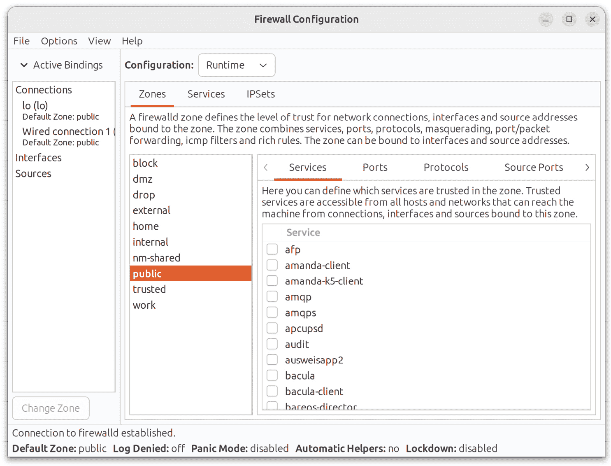

16. 基本的 Ubuntu 防火墙配置与 firewalld

所有的 Linux 发行版都提供某种形式的防火墙解决方案。在 Ubuntu 中，这种防火墙形式是前一章节中介绍的简化防火墙（Uncomplicated Firewall）。本章节将介绍一种更高级的防火墙解决方案——firewalld，它适用于 Ubuntu。

16.1 firewalld 简介

firewalld 最初为基于 Red Hat 的 Linux 发行版开发，它使用一组规则来控制传入的网络流量，并定义哪些流量应该被阻止，哪些流量应该允许通过到系统。firewalld 建立在一个更复杂的防火墙工具 iptables 之上。

firewalld 系统提供了一种灵活的方式来管理传入流量。例如，可以配置防火墙来阻止来自特定外部 IP 地址的流量，或防止所有传入的流量到达某个特定的 TCP/IP 端口。也可以定义规则，将传入流量转发到不同的系统，或作为互联网网关来保护网络上的其他计算机。

与常见的安全实践一致，默认的 firewalld 安装配置会阻止所有访问，只有 SSH 远程登录和系统用于获取动态 IP 地址的 DHCP 服务被允许（这两个服务对于系统管理员在安装完成后能访问系统是必不可少的）。

在 Ubuntu 上配置防火墙的关键元素是区域、接口、服务和端口。

16.1.1 区域

默认情况下，firewalld 会安装一系列预配置的区域。区域是一组预先配置的规则，可以随时应用到系统上，以便快速为特定场景实现防火墙配置。例如，block 区域会阻止所有传入流量，而 home 区域则施加较少的限制，假设系统运行在一个更安全的环境中，预计该环境会具有较高的信任级别。系统可以添加新的区域，也可以修改现有的区域，来增加或移除规则。区域也可以完全从系统中删除。表 16-1 列出了在 Ubuntu 系统中默认提供的区域集：

| 区域 | 描述 |
| --- | --- |
| drop | 最安全的区域。仅允许外向连接，所有传入的连接都会被丢弃，而且不会向连接的客户端发送任何通知。 |
| block | 类似于丢弃区域，不同之处在于传入连接会被拒绝，并发送 icmp-host-prohibited 或 icmp6-adm-prohibited 通知。 |
| public | 用于连接到公共网络或互联网的场景，在这些环境中其他计算机无法被信任。允许特定的传入连接。 |
| external | 当系统作为计算机网络的互联网网关时，外部区域应用于连接到互联网的接口。此区域与内部区域一起使用，用于实施伪装或网络地址转换（NAT），如本章稍后所述。允许选择性地接受传入连接 |
| internal | 与外部区域一起使用，应用于连接到内部网络的接口。假设内部网络上的计算机是可信的。允许选择性地接受传入连接。 |
| dmz | 用于系统在非军事区（DMZ）中运行的情况。这些计算机通常是公开可访问的，但与内部网络的其他部分隔离。允许选择性地接受传入连接。 |
| work | 用于在工作环境中的网络上运行的系统，其中其他计算机是可信的。允许选择性地接受传入连接。 |
| home | 用于在家庭网络中运行的系统，其中其他计算机是可信的。允许选择性地接受传入连接。 |
| trusted | 最不安全的区域。所有传入连接都被接受。 |

表 16-1

要查看区域的特定设置，请参阅位于系统 /usr/lib/firewalld/zones 目录中的相应 XML 配置文件。例如，以下列出了 public.xml 区域配置文件的内容：

<?xml version=”1.0” encoding=”utf-8”?>

<zone>

<short>Public</short>

<description>用于公共区域。你不信任网络上的其他计算机不会对你的计算机造成损害。只接受选定的传入连接。</description>

<service name=”ssh”/>

<service name=”mdns”/>

<service name=”dhcpv6-client”/>

</zone>

16.1.2 接口

任何连接到互联网或网络（或两者）的 Ubuntu 系统都会包含至少一个以物理或虚拟网络设备形式存在的接口。当 firewalld 启动时，每个接口会被分配到一个区域，从而允许为不同的接口分配不同级别的防火墙安全性。考虑一台包含两个接口的服务器，一个接口连接到外部互联网，另一个连接到内部网络。在这种情况下，面向外部的接口很可能会被分配到更为严格的外部区域，而内部接口可能会使用内部区域。

16.1.3 服务

TCP/IP 定义了一组在标准端口上进行通信的服务。例如，安全的 HTTPS Web 连接使用端口 443，而 SMTP 电子邮件服务使用端口 25。为了选择性地启用特定服务的传入流量，可以向区域添加 firewalld 规则。例如，家庭区域默认不允许传入 HTTPS 连接。可以通过向区域添加规则来启用此流量，从而允许传入 HTTPS 连接，而无需引用特定的端口号。

16.1.4 端口

尽管在添加 firewalld 规则时可以引用常见的 TCP/IP 服务，但也会出现需要允许特定端口的传入连接的情况，这些端口并未分配给任何服务。可以通过添加引用特定端口的规则来实现这一点，而不是使用服务。

16.2 检查 firewalld 状态

firewalld 服务在所有 Ubuntu 安装中通常默认未安装和启用。可以通过以下命令检查服务的状态：

# systemctl status firewalld

● firewalld.service - firewalld - 动态防火墙守护进程

已加载：已加载 (/lib/systemd/system/firewalld.service; 已启用; 厂商预设：已启用)

活动状态：活动（运行中），自 2023-07-17 19:21:53 UTC 起运行；16 秒前

文档：man:firewalld(1)

主 PID：27151 (firewalld)

任务：2（限制：4517）

内存：24.0M

CPU：244ms

CGroup：/system.slice/firewalld.service

└─27151 /usr/bin/python3 /usr/sbin/firewalld --nofork --nopid

Jul 17 19:21:53 demoserver systemd[1]: 正在启动 firewalld - 动态防火墙守护进程...

Jul 17 19:21:53 demoserver systemd[1]: 已启动 firewalld - 动态防火墙守护进程。

如果需要，可以按如下方式安装 firewalld 服务：

# apt install firewalld

firewalld 服务默认启用，因此在安装完成后和每次系统启动时都会自动启动。

16.3 使用 firewall-cmd 配置防火墙规则

firewall-cmd 命令行工具允许查看 firewalld 配置的信息，并可以在终端窗口中更改区域和规则。

在更改防火墙设置时，需要了解运行时配置和永久配置的概念。默认情况下，任何规则更改都被视为运行时配置更改。这意味着虽然更改会立即生效，但在下次系统重启或 firewalld 服务重新加载时（例如，通过发出以下命令），更改将丢失：

# firewall-cmd --reload

要使更改永久生效，必须使用 --permanent 命令行选项。永久更改直到 firewalld 服务重新加载时才会生效，但在手动更改之前会一直保持。

16.3.1 确定和更改默认区域

要确定默认区域（换句话说，除非特别选择其他区域，否则所有接口将分配到该区域），可以按如下方式使用 firewall-cmd 工具：

# firewall-cmd --get-default-zone

公共

要将默认区域更改为其他区域：

# firewall-cmd --set-default-zone=home

成功

16.3.2 显示区域信息

要列出系统上所有可用的区域：

# firewall-cmd --get-zones

屏蔽 dmz 丢弃 外部 家庭 内部 公共 可信 工作

获取当前激活的区域列表及其分配的接口，如下所示：

# firewall-cmd --get-active-zones

外部

接口：eth0

内部

接口：eth1

可以按如下方式列出当前为特定区域配置的所有规则：

# firewall-cmd --zone=home --list-all

home (已激活)

target: 默认

icmp 阻止反转：否

接口：eth0

源：

服务：cockpit dhcpv6-client http mdns samba-client ssh

端口：

协议：

伪装：否

转发端口：

源端口：

icmp 阻止：

丰富规则：

使用以下命令列出当前可用于包含在 firewalld 规则中的服务：

# firewall-cmd --get-services

RH-Satellite-6 amanda-client amanda-k5-client amqp amqps apcupsd audit bacula bacula-client bgp bitcoin bitcoin-rpc bitcoin-testnet bitcoin-testnet-rpc ceph ceph-mon cfengine cockpit ...

要列出当前为区域启用的服务：

# firewall-cmd --zone=public --list-services

cockpit dhcpv6-client ssh

可以通过以下方式获得端口规则列表：

# firewall-cmd --zone=public --list-ports

9090/tcp

16.3.3 添加和删除区域服务

要将服务添加到区域，在本例中是将 HTTPS 添加到公共区域，可以使用以下命令：

# firewall-cmd --zone=public --add-service=https

成功

默认情况下，这是一个运行时更改，因此在系统重启后，添加的规则将丢失。要永久添加服务，使其在系统重启后依然有效，请使用 --permanent 标志：

# firewall-cmd --zone=public --permanent --add-service=https

成功

要验证服务是否已永久添加，请确保在请求服务列表时包括 --permanent 标志：

# firewall-cmd --zone=public --permanent --list-services

cockpit dhcpv6-client http https ssh

请注意，作为永久更改，此新规则将在系统重启或 firewalld 重新加载后生效：

# firewall-cmd --reload

使用 --remove-service 选项从区域中删除服务。由于这是一个运行时更改，因此规则将在下次系统重启时恢复：

# firewall-cmd --zone=public --remove-service=https

要永久删除服务，请使用 --permanent 标志，并记得在更改需要立即生效时重新加载 firewalld：

# firewall-cmd --zone=public --permanent --remove-service=https

16.3.4 使用基于端口的规则

要启用特定端口，请使用 --add-port 选项。请注意，当手动定义端口时，必须同时提供端口号和协议（TCP 或 UDP）：

# firewall-cmd --zone=public --permanent --add-port=5000/tcp

在将规则添加到区域时，还可以指定端口范围：

# firewall-cmd --zone=public --permanent --add-port=5900-5999/udp

16.3.5 创建新区域

可以通过运行以下命令创建一个全新的区域。创建后，该区域可以像管理任何预定义区域一样进行管理：

# firewall-cmd --permanent --new-zone=myoffice

成功

添加新区域后，需要重新启动 firewalld 才能使该区域生效：

# firewall-cmd --reload

成功

16.3.6 更改区域/接口分配

如前所述，系统上的每个接口必须分配到一个区域。接口分配到的区域也可以使用 firewall-cmd 工具进行更改。在以下示例中，eth0 接口被分配到公共区域：

# firewall-cmd --zone=public --change-interface=eth0

success

16.3.7 伪装

伪装在网络管理领域更为人知的术语是网络地址转换（NAT）。当使用 Ubuntu 系统作为计算机网络的互联网网关时，伪装允许所有内部系统在通过互联网通信时使用该 Ubuntu 系统的 IP 地址。这有助于隐藏任何系统的内部 IP 地址，避免外部恶意实体的攻击，并且无需为网络中的每台计算机分配公共 IP 地址。

使用以下命令检查是否已在防火墙上启用伪装：

# firewall-cmd --zone=external --query-masquerade

使用以下命令启用伪装（如果要使更改永久生效，请记得使用 --permanent 标志）：

# firewall-cmd --zone=external --add-masquerade

16.3.8 添加 ICMP 规则

互联网控制消息协议（ICMP）用于网络上的客户端系统互相发送错误信息等内容。它也是 ping 命令的基础，网络管理员和用户都用它来检测某个客户端是否在网络中处于活动状态。ICMP 类别允许屏蔽特定的 ICMP 消息类型。例如，管理员可能选择阻止传入的 ping（回显请求）ICMP 消息，以防止基于 ping 的拒绝服务（DoS）攻击（即服务器受到大量 ping 消息的恶意轰炸，导致无法响应合法请求）。

要查看可用于在 firewalld 规则中包含的 ICMP 类型，请运行以下命令：

# firewall-cmd --get-icmptypes

address-unreachable bad-header beyond-scope communication-prohibited destination-unreachable echo-reply ...

例如，以下命令永久添加一个规则，阻止公共区域的回显回复（ping 请求）消息：

# firewall-cmd --zone=public --permanent --add-icmp-block=echo-reply

16.3.9 实现端口转发

当 Ubuntu 系统作为内部计算机网络的互联网网关时，端口转发与伪装一起使用。端口转发允许通过特定端口到达防火墙的互联网流量被转发到内部网络上的特定系统。这可以通过一个例子来更好地说明。

假设一台 Ubuntu 系统作为内部网络中计算机的防火墙，其中一台计算机配置为 Web 服务器。假设 Web 服务器的 IP 地址为 192.168.2.20，且该系统上托管的网站的域名记录配置了公共 IP 地址，该地址背后就是 Ubuntu 防火墙系统。当 HTTP 请求到达 80 端口时，作为防火墙的 Ubuntu 系统需要知道如何处理该请求。通过配置端口转发，可以将所有 Web 流量引导到托管 Web 服务器的内部系统（在此案例中为 IP 地址 192.168.2.20），无论是继续使用 80 端口，还是将流量转发到目标服务器上的其他端口。实际上，端口转发甚至可以配置为将流量转发到与防火墙相同系统的不同端口（这一概念称为本地转发）。

要使用端口转发，首先启用伪装，命令如下（在此假设连接到互联网的接口已分配到外部区域）：

# firewall-cmd --zone=external --add-masquerade

若要从一个端口转发到不同的本地端口，可使用如下命令：

# firewall-cmd --zone=external --add-forward-port=port=22:proto=tcp:toport=2750

在上面的示例中，任何到达端口 22 的 TCP 流量将被转发到本地系统上的 2750 端口。另一方面，以下命令将本地系统上的 20 端口转发到 IP 地址为 192.168.0.19 的系统上的 22 端口：

# firewall-cmd --zone=external \

--add-forward-port=port=20:proto=tcp:toport=22:toaddr=192.168.0.19

类似地，以下命令将本地端口 20 转发到 IP 地址为 192.168.0.18 的系统上的 2750 端口：

# firewall-cmd --zone=external --add-forward-port=port=20:proto=tcp:toport=2750:toaddr=192.168.0.18

16.4 使用 firewall-config 管理 firewalld

如果您可以访问图形桌面环境，还可以使用 firewall-config 工具进行防火墙配置。虽然它默认没有安装，但可以通过以下方式安装 firewall-config：

# apt install firewall-config

启动时，主防火墙配置界面如图 16-1 所示：

图 16-1

该工具的关键区域可以总结如下：

A - 显示所有当前激活的接口及其分配的区域。要将接口分配到不同的区域，选择该接口，点击“更改区域”按钮，并从弹出的对话框中选择所需的区域。

B - 控制工具中显示的信息和所做的任何更改是应用于运行时规则还是永久规则。

C - 系统上配置的区域、服务或 IPSets 列表。此面板中列出的信息取决于从工具栏 F 选择的内容。从此面板中的列表选择项目会更新标记为 D 的主面板。

D - 包含有关工具栏 E 中当前类别选择的信息的主面板。在此示例中，面板显示的是公共区域的服务。每个服务旁边的复选框控制该服务是否在防火墙中启用。在这些类别面板中，可以添加新规则或配置或删除现有规则。

E - 控制面板 D 中显示的内容。从此栏选择项目可以显示所选类别的当前规则。

F - 控制面板 C 中显示的列表。

firewall-config 工具简单直观，易于使用，并且允许在图形环境中执行许多 firewall-cmd 提供的任务。

16.5 总结

一个经过精心规划和实施的防火墙是任何安全系统的重要组成部分。在 Ubuntu 中，firewalld 服务提供了一个既灵活又易于管理的防火墙系统。

firewalld 服务使用区域的概念将一组防火墙规则进行分组，并包括一套预定义的区域，旨在满足不同的防火墙保护需求。这些区域可以修改以添加或删除规则，或者创建和配置全新的区域。系统上连接到网络或互联网的网络设备被称为接口。每个接口依次被分配到一个区域。与 firewalld 配合使用的主要工具是 firewall-cmd 命令行工具和 firewall-config 图形工具。
