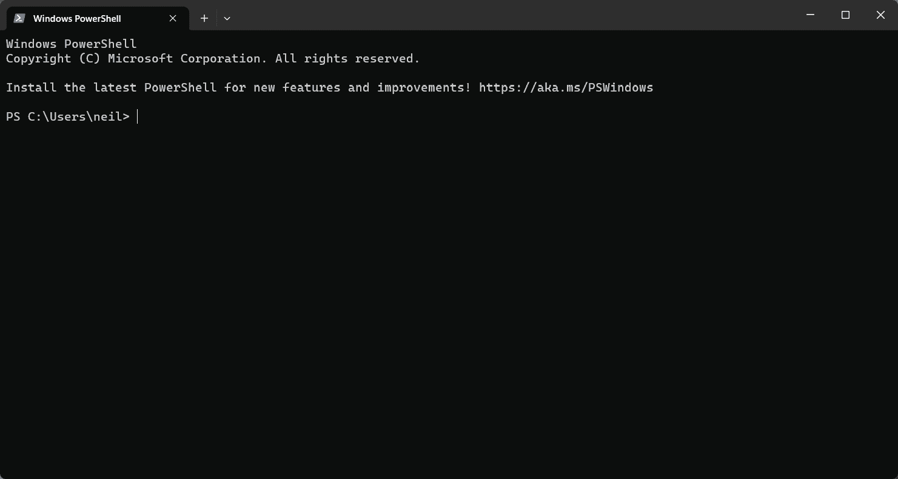
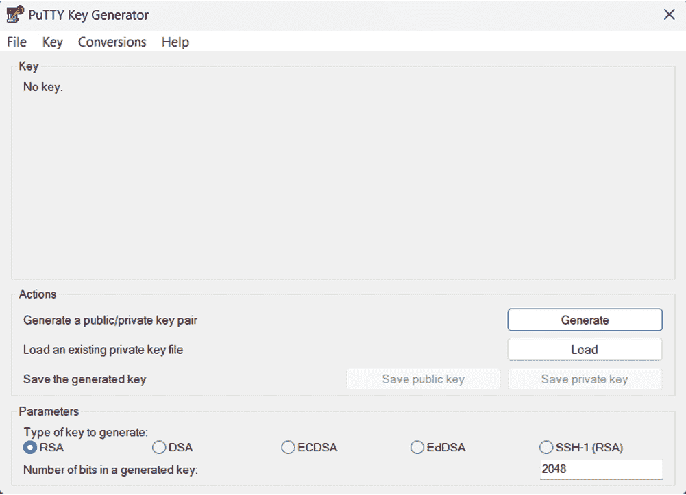
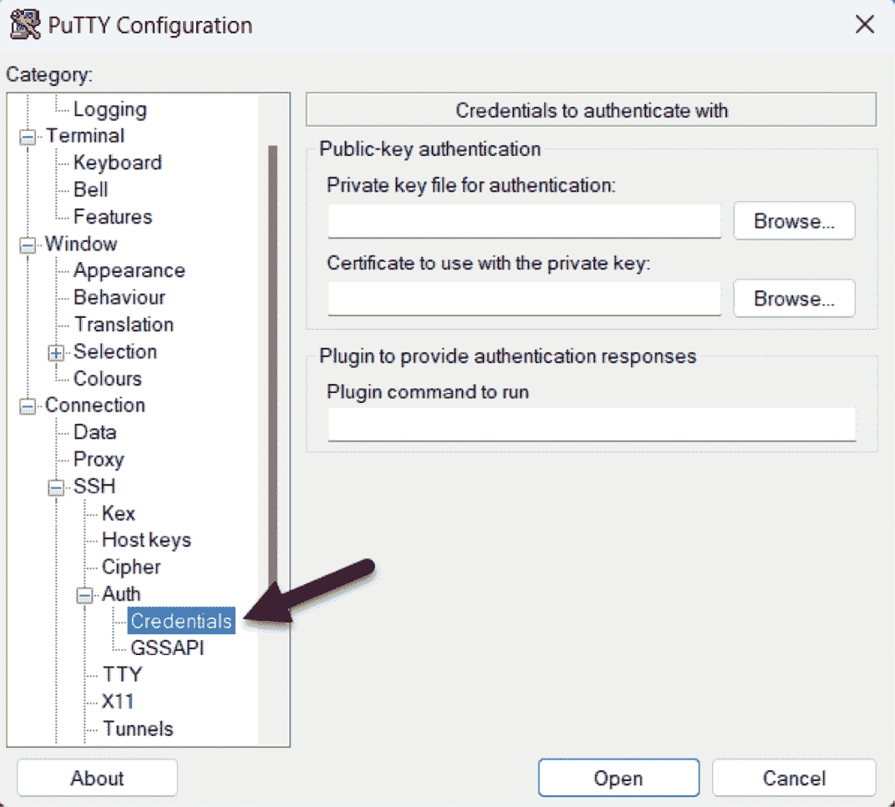
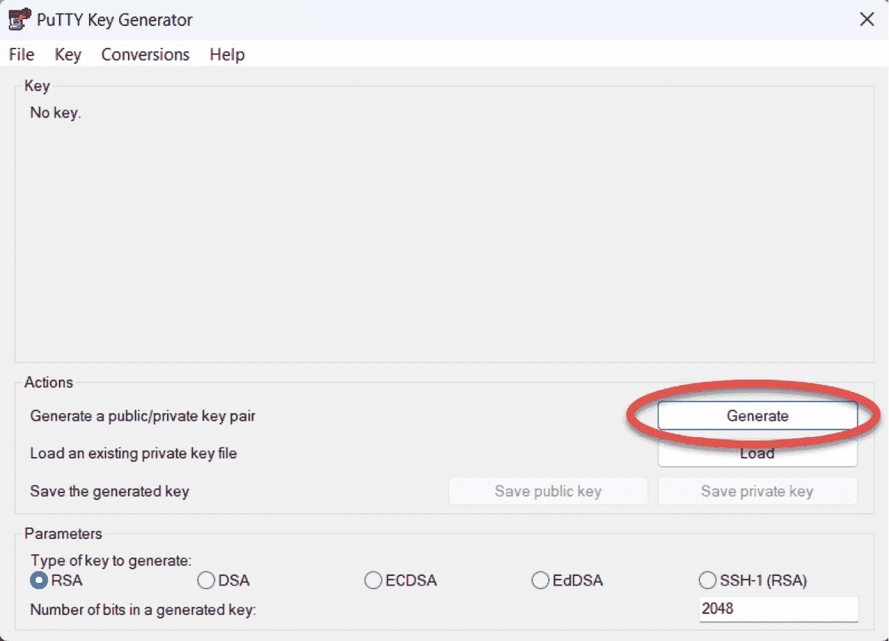

17. 配置 Ubuntu 23.04 上的 SSH 密钥身份验证

当首次安装 Ubuntu 系统时，默认配置允许通过安全外壳（SSH）连接进行远程命令行访问。SSH 提供了对系统的密码保护和加密访问，适用于 root 账户以及安装过程中添加的其他用户。然而，这种安全级别不够，应该尽快升级为基于 SSH 密钥的身份验证。

本章将概述通过实施基于密钥的 SSH 身份验证来提高 Ubuntu 系统安全性的步骤。

17.1 安全外壳（SSH）概述

SSH 允许安全地远程访问系统，获得 shell 访问权限并进行文件和数据传输。基本的 SSH 配置由客户端（用于建立连接的计算机）和服务器（运行在要建立连接的系统上）组成。例如，用户可能会使用在 Linux、Windows 或 macOS 系统上运行的 SSH 客户端连接到在 Ubuntu 系统上运行的 SSH 服务器，以获得 shell 命令行提示符或执行文件传输。客户端和服务器之间的所有通信，包括输入的密码，都进行了加密，以防止外部方拦截数据。

基本的 SSH 实现存在的固有弱点是，它完全依赖于分配给系统帐户的密码的强度。如果恶意方能够识别某个帐户的密码（无论是通过猜测、欺骗还是暴力破解攻击），系统就会变得脆弱。这一弱点可以通过实施基于 SSH 密钥的身份验证来解决。

17.2 SSH 密钥身份验证

SSH 基于密钥的身份验证使用非对称公钥加密，为远程系统访问增加了额外的安全层。公钥加密的概念由 Whitfield Diffie 和 Martin Hellman 于 1975 年提出，基于使用一对私钥和公钥。

在公钥加密系统中，公钥用于加密数据，只有私钥的拥有者才能解密数据。

在 SSH 密钥身份验证的情况下，主机保留私钥，而 SSH 客户端位于该主机上，公钥则保存在运行 SSH 服务器的系统上。因此，保护私钥至关重要，因为私钥的拥有者可以登录远程系统。作为额外的保护措施，私钥还可以加密并用密码保护，每次建立与服务器的连接时都必须输入该密码。

17.3 设置基于密钥的身份验证

设置基于密钥的 SSH 身份验证有四个步骤，概括如下：

1. 生成公钥和私钥。

2. 在服务器上安装公钥。

3. 测试身份验证。

4. 禁用服务器上的基于密码的身份验证。

本章的其余部分将详细介绍适用于 Linux、macOS 和 Windows 客户端操作系统的这些步骤。

17.4 安装和启动 SSH 服务

如果系统上尚未安装并运行 SSH 服务器，可以使用以下命令进行安装：

# 第十七章：apt install openssh-server

# systemctl start ssh.service

# systemctl enable ssh.service

17.5 基于 SSH 密钥的身份验证（适用于 Linux 和 macOS 客户端）

设置基于 SSH 密钥的身份验证的第一步是生成客户端系统上的密钥对。如果客户端系统运行的是 Linux 或 macOS，可以使用 ssh-keygen 工具来实现：

# ssh-keygen

此命令将输出类似以下内容：

正在生成公钥/私钥 RSA 密钥对。

输入要保存密钥的文件（/home/<username>/.ssh/id_rsa）：

按下回车键接受密钥文件的默认位置。这会将两个文件放入当前用户主目录下的 .ssh 子目录。私钥将存储在名为 id_rsa 的文件中，而公钥将存储在名为 id_rsa.pub 的文件中。

接下来，ssh-keygen 会提示输入保护私钥的密码短语。如果提供了密码短语，私钥将在本地磁盘上加密，并且需要密码短语才能访问远程系统。因此，为了更好的安全性，建议使用密码短语。

输入密码短语（为空表示不使用密码短语）：

最后，ssh-keygen 工具将生成以下输出，指示密钥已成功生成：

您的身份信息已保存至 /home/neil/.ssh/id_rsa。

您的公钥已保存至 /home/neil/.ssh/id_rsa.pub。

密钥指纹为：

SHA256:FOLGWEEGFIjWnCT5wtTOv5VK4hdimzWghZizUEMYbfo <username>@<hostname>

密钥的随机艺术图像是：

+---[RSA 2048]----+

|.BB+=+*.. |

|o+B= * . . |

|===.. + . |

|*+ * . . |

|.++ o S |

|..E+ * o |

| o B * |
| --- |
| + + |
| . |

+----[SHA256]-----+

下一步是将公钥安装到远程服务器系统上。可以使用 ssh-copy-id 工具来实现，命令如下：

$ ssh-copy-id username@remote_hostname

例如：

$ ssh-copy-id neil@192.168.1.100

/usr/bin/ssh-copy-id: 信息：待安装的密钥来源："/home/neil/.ssh/id_rsa.pub"

/usr/bin/ssh-copy-id: 信息：尝试使用新的密钥进行登录，以排除已安装的密钥

/usr/bin/ssh-copy-id: 信息：剩余 1 个密钥需安装——如果现在有提示，则是安装新密钥

neil@192.168.1.100 的密码：

添加的密钥数量：1

现在尝试使用以下命令登录到机器："ssh 'neil@192.168.1.100'"

并检查确保仅添加了您想要的密钥。

一旦密钥安装完成，测试身份验证是否有效，方法是尝试使用 ssh 客户端进行远程登录：

$ ssh -l <username> <hostname>

如果私钥已加密并用密码短语保护，请在提示时输入该短语，以完成身份验证并建立对 Ubuntu 系统的远程访问：

输入密钥 '/home/neil/.ssh/id_rsa' 的密码短语：

上次登录：2023 年 3 月 31 日 星期五 14:29:28 来自 192.168.86.21

[neil@demosystem02 ~]$

对服务器上任何其他需要远程访问的帐户重复这些步骤。如果其他客户端系统也需要访问，请将 id_rsa 私钥文件复制到其他系统上您主目录中的 .ssh 子目录。

按照当前配置，仍然可以通过较不安全的密码验证访问远程系统。一旦验证了基于密钥的身份验证有效，系统上将需要禁用密码身份验证。要了解如何更改此设置，请首先打开 /etc/ssh/sshd_config 文件并定位到以下行：

包含 /etc/ssh/sshd_config.d/*.conf

这告诉我们，sshd 配置设置由 /etc/ssh/sshd_config.d 目录中的文件控制。这些文件名必须以数字为前缀，并且具有 .conf 文件扩展名，例如：

01-permitrootlogin.conf

50-cloud.conf

数字前缀表示该文件相对于文件夹中其他文件的优先级，其中 01 是最高优先级。这确保了如果配置文件中包含与其他文件冲突的设置，优先级最高的文件始终会优先使用。

在 /etc/ssh/sshd_config.d 文件夹内，创建一个名为 02-nopasswordlogin.conf 的新文件，内容如下：

PasswordAuthentication no

保存文件并重新启动 sshd 服务以实现更改：

# systemctl restart sshd.service

从此以后，只能通过 SSH 密钥身份验证远程访问系统，并且在这样做时，不需要输入密码。

17.6 管理多个密钥

在客户端系统上，通常会存在多个私钥，每个私钥提供对不同服务器的访问。因此，在建立连接时，可以选择特定的密钥，存在几种选择方式。例如，可以在启动 ssh 客户端时指定要使用的私钥文件，方法如下：

$ ssh -l neilsmyth -i ~/.ssh/id_work 35.194.18.119

或者，SSH 客户端用户配置文件可以将密钥文件与服务器关联。该配置文件名为 config，必须位于用户主目录的 .ssh 目录中，并可用于配置广泛的选项，包括私钥文件、连接时使用的默认端口、默认用户名，以及用来引用服务器的简写昵称。以下示例配置文件为两个服务器定义了不同的密钥文件，并允许通过 home 和 work 这两个昵称来引用它们。在 work 系统的情况下，文件还指定了身份验证时要使用的用户名：

Host work

HostName 35.194.18.119

IdentityFile ~/.ssh/id_work

用户 neilsmyth

Host home

HostName 192.168.0.21

IdentityFile ~/.ssh/id_home

在设置配置文件之前，用户曾使用以下命令连接到工作系统：

$ ssh -l neilsmyth -i ~/.ssh/id_work 35.194.18.119

但是，现在该命令可以简化如下：

$ ssh work

配置文件选项的完整列表可以通过运行以下命令来查看：

$ man ssh_config

17.7 基于 SSH 密钥的 Windows 客户端身份验证

Windows 的最新版本包括一个子集的 OpenSSH 实现，这个实现被大多数 Linux 和 macOS 系统使用，作为 Windows PowerShell 的一部分。这使得可以从 Windows 客户端设置基于 SSH 密钥的身份验证，使用类似于上述 Linux 和 macOS 的步骤。

在 Windows 上，搜索“Windows PowerShell”并从结果中选择它。启动后，PowerShell 窗口将显示，如 图 17-1 所示：

图 17-1

如果你已经有来自另一个客户端系统的私钥，将 id_rsa 文件复制到 Windows 系统上名为 .ssh 的文件夹中。一旦文件就位，在 PowerShell 窗口中测试身份验证，如下所示：

$ ssh -l <用户名>@<主机名>

例如：

PS C:\Users\neil> ssh -l neil 192.168.1.101

输入密钥 'C:\Users\neil\.ssh\id_rsa' 的密码短语：

输入密码短语并完成身份验证过程。

如果私钥尚不存在，可以通过在 PowerShell 窗口中使用 ssh-keygen 工具按照 Linux 和 macOS 中概述的相同步骤生成新的私钥和公钥对。生成密钥后，它们将再次位于当前用户的主文件夹中的 .ssh 目录下，公钥文件 id_rsa.pub 需要安装到远程 Ubuntu 系统上。不幸的是，Windows PowerShell 并不包含 ssh-copy-id 工具，因此必须手动执行此任务。

在 PowerShell 窗口中，进入 .ssh 子目录并显示公钥 id_rsa.pub 文件的内容：

PS C:\Users\neil> cd .ssh

PS C:\Users\neil\.ssh> type id_rsa.pub

ssh-rsa AAAAB3NzaC1yc2EAAAADAQABAAABAQDFgx1vzu59lll6/uQw7FbmKVsQ3fzLz9MW1fgo4sdsxXp81wCHNAlqcjx1Pgr9BJPXWUMInQOi7BQ5I+vc2xQ2AS0kMq3ZH9ybWuQe/U2GjueXZd0FKrEXrT55wM36Rm6Ii3roUCoGCzGR8mn95JvRB3VtCyDdzTWSi8JBpK5gV5oOxNTNPsewlLzouBlCT1qW3CKwEiIwu8S9MTL7m3nrcaNeLewTTHevvHw4QDwzFQ+B0PDg96fzsYoTXVhzyHSWyo6H0gqrft7aK+gILBtEIhWTkSVEMAzy1piKtCr1IYTmVK6engv0aoGtMUq6FnOeGp5FjvKkF4aQkh1QR28r neil@DESKTOP-S8P8D3N

高亮文件内容并使用 Ctrl-C 键盘快捷键复制它。

仍然在 PowerShell 窗口中，使用密码验证登录到远程系统：

PS C:\Users\neil\.ssh> ssh -l <用户名> <主机名>

登录后，检查 .ssh 子目录是否存在。如果不存在，可以如下创建：

$ mkdir .ssh

进入`.ssh`目录，检查是否已存在名为`authorized_keys`的文件。如果不存在，请创建该文件，并将来自 Windows 系统的公钥文件内容粘贴到该文件中。

如果`authorized_keys`文件已经存在，可能包含其他密钥。如果是这种情况，请编辑该文件并将新的公钥粘贴到文件的末尾。例如，以下文件包含两个密钥：

ssh-rsa AAAAB3NzaC1yc2EAAAADAQABAAABAQCzRWH27Xs8ZA5rIbZXKgxFY5XXauMv+6F5PljBLJ6j+9nkmykVe3GjZTp3oD+KMRbT2kTEPbDpFD67DNL0eiX2ZuEEiYsxZfGCRCPBGYmQttFRHEAFnlS1Jx/G4W5UNKvhAXWyMwDEKiWvqTVy6syB2Ritoak+D/Sc8nJflQ6dtw0jBs+S7Aim8TPfgpi4p5XJGruXNRScamk68NgnPfTL3vT726EuABCk6C934KARd+/AXa8/5rNOh4ETPstjBRfFJ0tpmsWWhhNEnwJRqS2LD0ug7E3yFI2qsNKGEzvAYUC8Up45MRP7liR3aMlCBil1tsy9R+IB7oMEycZAe/qj neil@localhost.localdomain

ssh-rsa AAAAB3NzaC1yc2EAAAADAQABAAABAQDFgx1vzu59lll6/uQw7FbmKVsQ3fzLz9MW1fgo4sdsxXp81wCHNAlqcjx1Pgr9BJPXWUMInQOi7BQ5I+vc2xQ2AS0kMq3ZH9ybWuQe/U2GjueXZd0FKrEXrT55wM36Rm6Ii3roUCoGCzGR8mn95JvRB3VtCyDdzTWSi8JBpK5gV5oOxNTNPsewlLzouBlCT1qW3CKwEiIwu8S9MTL7m3nrcaNeLewTTHevvHw4QDwzFQ+B0PDg96fzsYoTXVhzyHSWyo6H0gqrft7aK+gILBtEIhWTkSVEMAzy1piKtCr1IYTmVK6engv0aoGtMUq6FnOeGp5FjvKkF4aQkh1QR28r neil@DESKTOP-S8P8D3N

公钥安装到服务器后，通过 PowerShell 窗口登录到服务器进行身份验证测试，例如：

PS C:\Users\neil\.ssh> ssh -l neil 192.168.1.100

输入密钥‘C:\Users\neil\.ssh\id_rsa’的密码短语：

当为所有帐户设置并验证了基于密钥的身份验证后，按照上一节末尾的说明，在 Ubuntu 系统上禁用密码验证。

17.8 使用 PuTTY 的 SSH 密钥验证

对于没有 OpenSSH 的 Windows 系统，或作为比使用 PowerShell 更灵活的替代方案，PuTTY 工具是广泛使用的替代工具。使用 PuTTY 的第一步是在需要 SSH 客户端的任何 Windows 系统上下载并安装它。PuTTY 是一个免费的实用程序，可以通过以下链接下载：

[`www.chiark.greenend.org.uk/~sgtatham/putty/latest.html`](https://www.chiark.greenend.org.uk/~sgtatham/putty/latest.html)

下载与您的 Windows 系统（32 位或 64 位版本可选）匹配的 Windows 安装程序可执行文件，然后执行该安装程序以完成安装。

如果私钥已经存在于另一个系统上，请在当前用户的主文件夹中创建`.ssh`文件夹，并将私有`id_rsa`密钥复制到该文件夹中。

接下来，需要使用 PuTTYgen 工具将私钥文件转换为 PuTTY 私钥格式文件。通过在 Windows 开始菜单的搜索栏中输入“PuTTY Key Generator”来找到该工具并启动它：

图 17-2

启动后，点击位于操作部分的“加载”按钮，导航到之前复制到 .ssh 文件夹中的私钥文件（请注意，可能需要将文件类型过滤器更改为“所有文件 (*.*)”才能看到密钥文件）。找到后，选择该文件并将其加载到 PuttyGen 中。当提示时，输入最初用于加密文件的密码短语。私钥导入后，点击“保存私钥”按钮将其保存为 PuTTY 密钥文件。为了保持一致性，将密钥文件保存到 .ssh 文件夹中，但为其命名一个不同的名称，以便与原始密钥文件区分开。

从开始菜单启动 PuTTY，并在主屏幕中输入远程服务器的 IP 地址或主机名，然后选择左侧面板中的连接 -> SSH -> 身份验证 -> 凭据类别，如图 17-3 中所示：

图 17-3

点击“浏览”按钮，选择认证用的私钥字段旁边的按钮，导航到并选择之前保存的 PuTTY 私钥文件。然后，可选地，滚动到左侧面板的顶部，选择“会话”条目，在“保存的会话”字段中输入会话名称，然后点击“保存”按钮。这样可以将会话配置保存以供将来使用，而无需每次重新输入设置。

最后，点击“打开”按钮以建立与远程服务器的连接，在提示时输入用户名和密码短语，以完成身份验证。

17.9 使用 PuTTYgen 生成私钥

前一节探讨了在使用 PuTTY 时如何使用现有的私钥和公钥。如果密钥不存在，可以使用包括在 PuTTY 主安装包中的 PuTTYgen 工具来创建。

要创建新密钥，启动 PuttyGen 并点击图 17-4 中高亮显示的生成按钮：

图 17-4

将鼠标指针移动到指定位置以生成随机数据，然后输入一个可选的密码短语来加密私钥。一旦密钥生成完毕，使用“保存公钥”和“保存私钥”按钮将文件保存到适当的位置。如前一节所述，私钥可以与 PuTTY 一起使用。要在远程服务器上安装公钥，请按照前一节中关于在 Windows 上使用 PowerShell 配置 SSH 的步骤操作。

17.10 总结

任何远程访问 Ubuntu 系统的操作都必须以提供高水平安全性的方式进行。默认情况下，SSH 允许通过基于密码的身份验证进行远程系统访问。然而，这使得系统容易受到猜测密码或通过其他手段获取密码的攻击。因此，建议使用基于密钥的身份验证来保护系统访问。基于密钥的身份验证采用公钥加密技术，涉及公钥和私钥。当实现后，用户只有在使用与服务器上公钥匹配的私钥的客户端时，才能连接到服务器。作为附加的安全层，私钥也可以进行加密并设置密码保护。一旦实现了基于密钥的加密，服务器系统会被配置为禁用对不太安全的基于密码的身份验证的支持。

本章概述了 SSH 基于密钥的身份验证，并概述了在 macOS、Linux 和 Windows 上生成密钥、配置客户端，以及在 Ubuntu 服务器上安装和管理公钥的步骤。
