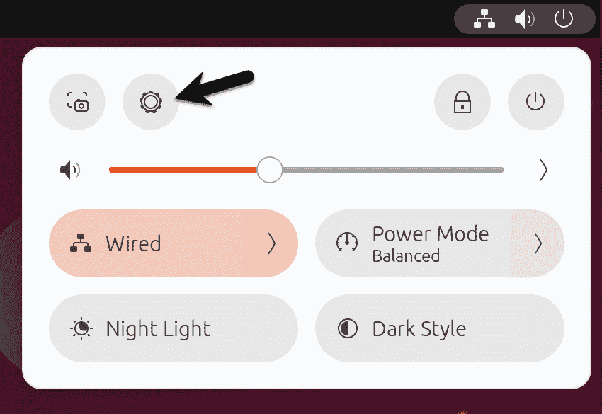
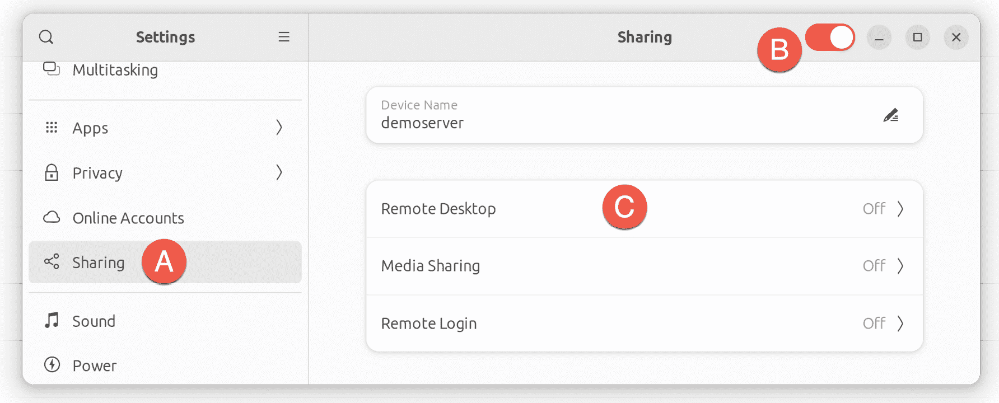
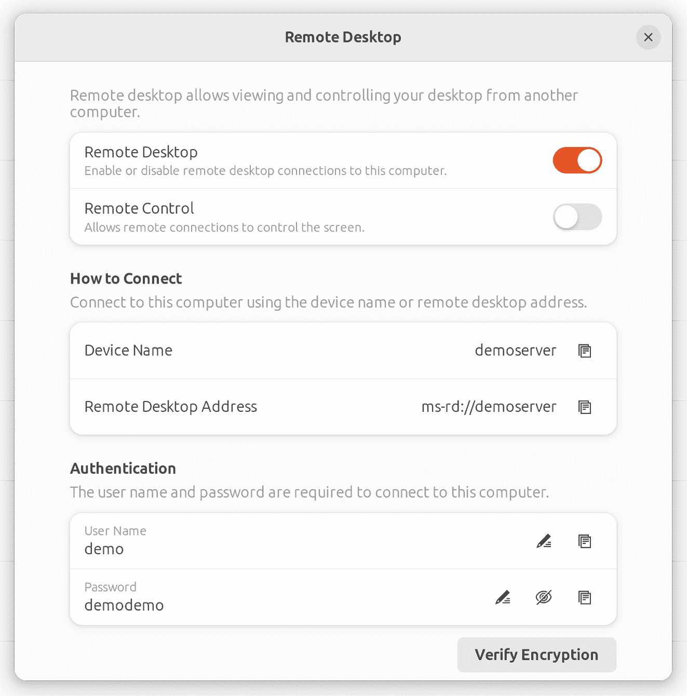
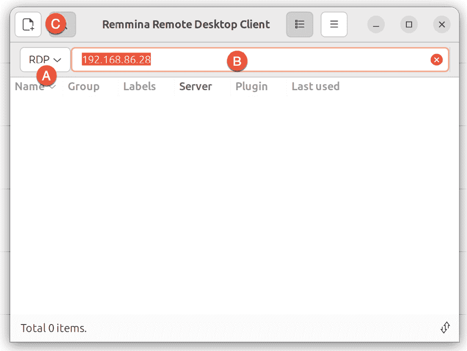
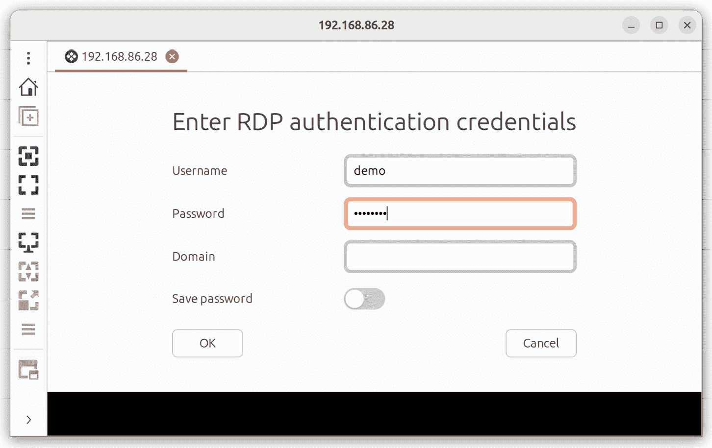
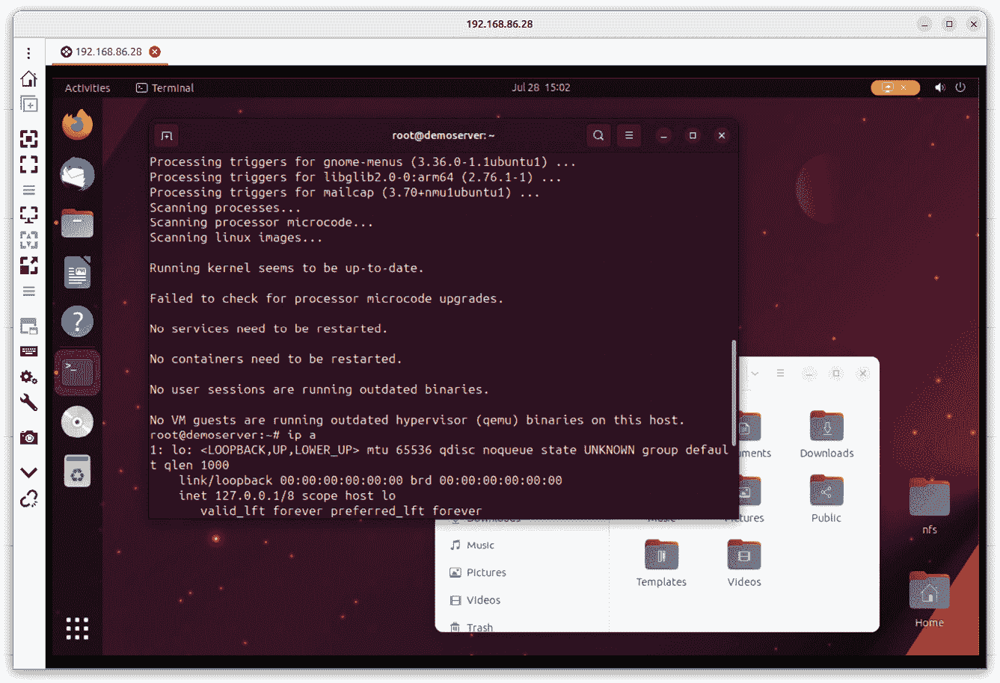
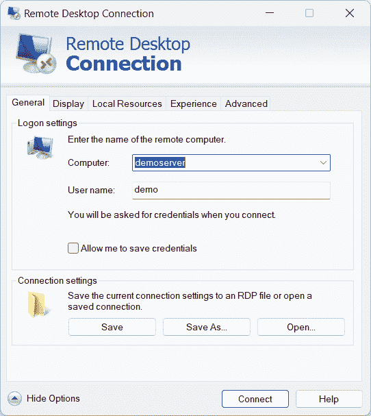
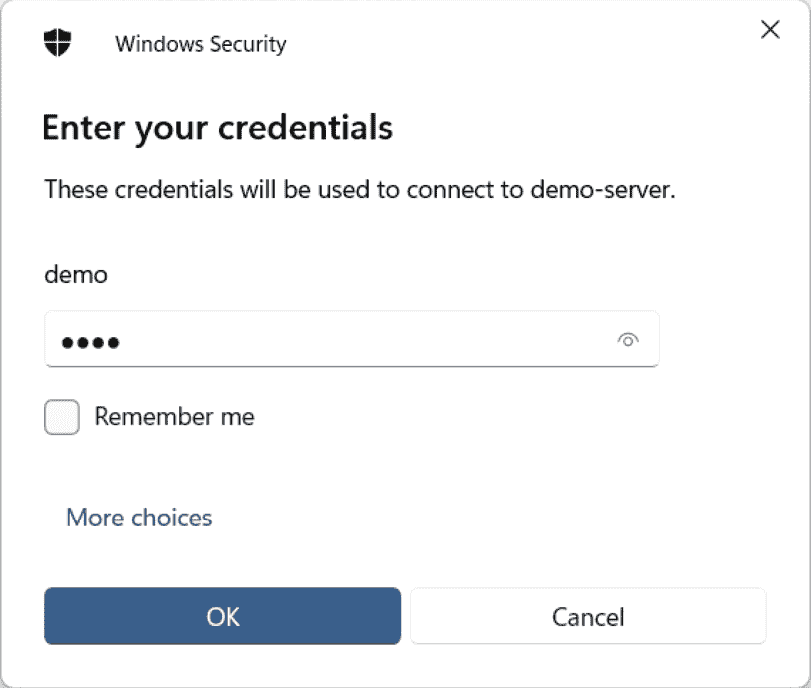

18. Ubuntu 23.04 使用 Vino 远程桌面访问

Ubuntu 可以配置为通过网络或互联网连接提供远程访问图形桌面环境。虽然默认情况下没有启用，但从网络或互联网上的其他系统显示和访问 Ubuntu 桌面相对简单。这可以在目标系统运行 Linux、Windows 或 macOS 的情况下实现。实际上，甚至有可供 Android 和 iOS 使用的应用程序，可以让你在几乎任何有数据信号的地方访问 Ubuntu 桌面。

远程桌面访问在多种场景中都非常有用。它使你或其他人能够从另一个计算机系统（无论是在同一网络上还是通过互联网）查看和互动你的 Ubuntu 桌面环境。例如，当你外出旅行时，如果需要在离开办公桌的情况下继续工作，远程桌面访问非常有用。它也适用于需要同事或 IT 支持人员访问你的桌面以解决问题的情况。

Ubuntu 远程桌面支持使用虚拟网络计算（VNC）或微软的远程桌面协议（RDP）进行连接。使用 RDP 的一个优势是，它使 Ubuntu 桌面更容易从 Windows 客户端访问。因此，本章将重点介绍如何在 Ubuntu 中配置和使用 RDP 远程桌面。

18.1 远程桌面访问类型

在开始之前，重要的是要理解，远程桌面访问基本上有两种类型。本章所讨论的方法适用于你主要使用 Ubuntu 作为桌面操作系统，并需要远程访问你常用的桌面会话。当配置完成后，你将接管桌面会话，并远程查看和控制它。

第二种选项适用于你需要在远程服务器系统上启动和访问一个或多个远程桌面会话的情况，无论远程系统是否连接了图形控制台。这允许你在远程系统的后台启动多个桌面会话，并通过网络或互联网连接查看和控制这些桌面。

18.2 安全与不安全的远程桌面访问

本章中，我们将介绍安全和不安全的远程桌面访问方法。假设你是在安全的内部网络环境下，从一台系统访问另一台系统，那么使用不安全的访问方法通常是安全的。另一方面，如果你计划通过任何公共网络远程访问你的桌面，你必须使用安全的访问方法，以避免系统和数据被泄露。

18.3 在 Ubuntu 上启用远程桌面访问

Ubuntu 的远程桌面由 Vino 包提供。Vino 是一个专门为 GNOME 桌面开发的远程桌面服务器。

启用远程访问的第一步是安装此包：

# 第十八章：apt install vino

安装完 Vino 后，下一步是在 GNOME 中启用远程桌面访问。首先打开设置应用程序，如图 18-1 所示：

图 18-1

在设置应用程序中，选择共享选项（图 18-2 中标记为 A）：

图 18-2

打开共享开关（B），然后点击远程桌面选项（C），以显示如下所示的对话框（图 18-3）：

图 18-3

远程桌面对话框提供以下配置选项来管理远程桌面访问：

•远程桌面 - 控制是否允许远程桌面访问。

•远程控制 - 如果启用，远程会话将能够使用鼠标和键盘与桌面环境进行交互。如果禁用此选项，远程会话将只能查看桌面。

•用户名和密码 - 远程访问桌面时需要的用户名和密码。

配置好设置后，关闭远程桌面和设置对话框。

18.4 连接到共享桌面

虽然远程桌面查看器有许多操作系统版本可供选择，但建议在从 Ubuntu 或其他基于 Linux 的系统进行连接时使用像 Remmina 这样的工具。Remmina 是一款用户友好的工具，具有图形界面，支持 Vino 使用的加密技术，以确保安全的远程连接。

Remmina 通常默认安装在 Ubuntu 上，但如有需要，可以通过以下方式安装：

# apt install remmina

在远程 Linux 计算机上启动 Remmina，并将连接类型菜单（图 18-4 中标记为 A）更改为 RDP，然后在地址栏（B）中输入您希望连接的远程系统的 IP 地址或主机名（您也可以使用标记为 C 的按钮创建并保存连接）：

图 18-4

要建立连接，按下键盘上的回车键开始连接过程。点击以接受证书，之后将显示第二个屏幕，要求输入桌面访问密码：

图 18-5

输入密码后，点击确定以访问远程屏幕：

图 18-6

18.5 从 Windows 连接

因为我们已经配置了 Vino 来使用 RDP，所以 Windows 客户端也可以通过微软的远程桌面连接应用程序访问 Ubuntu 桌面。在 Windows 系统上，启动远程桌面连接并点击右下角的“显示选项”按钮，以显示额外的配置设置。输入 Ubuntu 系统的主机名或 IP 地址，以及在本章之前配置的用户名：

图 18-7

点击连接按钮，当提示时，输入密码以访问 Ubuntu 桌面：

图 18-8

18.6 小结

可以通过使用虚拟网络计算（VNC）或远程桌面协议（RDP）来启用对 Ubuntu 系统 GNOME 桌面环境的远程访问。VNC 和 RDP 由远程服务器上的服务器和本地主机上的相应客户端组成，它们允许远程访问在服务器上运行的桌面实例。

GNOME 桌面的标准远程服务器解决方案是 Vino。安装完成后，可以通过使用远程桌面查看器（如 Remmina）从其他 Linux 系统建立远程桌面会话。当使用 RDP 时，Windows 和 Mac 系统也可以通过微软远程桌面连接应用程序访问该桌面。
