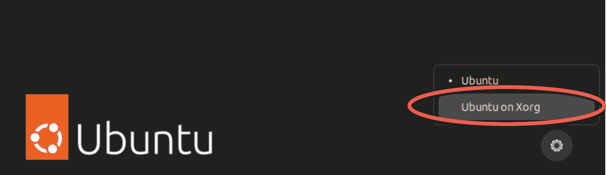
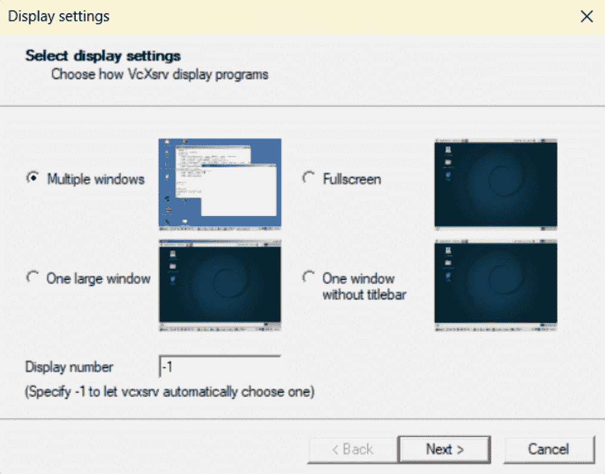
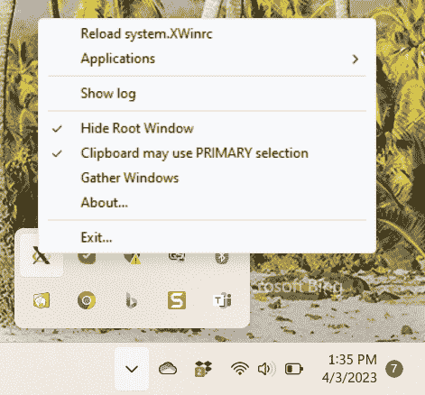
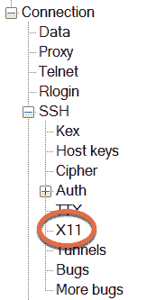
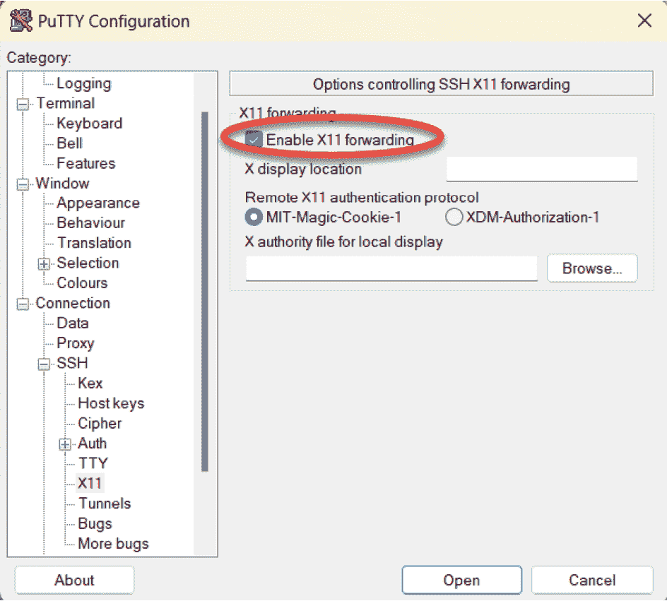
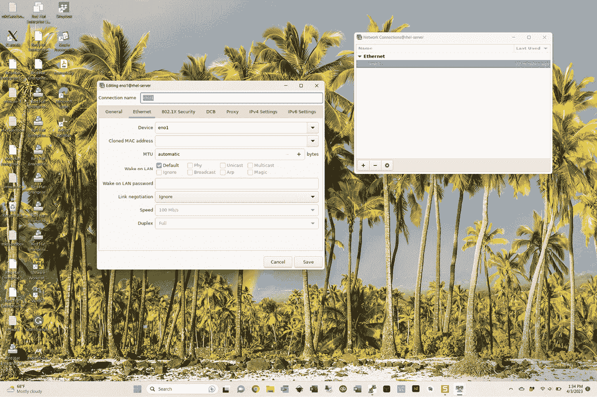

19. 显示 Ubuntu 23.04 应用程序的远程方法（X11 转发）

在上一章中，我们讨论了如何在远程计算机上显示整个 Ubuntu 桌面。虽然这种方法非常适合需要远程显示整个桌面的情况，但如果你只想显示单个应用程序，这可能有些过于复杂。因此，本章将介绍如何在远程系统上显示单个应用程序。

19.1 远程显示 Ubuntu 应用程序的要求

在运行一个应用程序并在另一个 Ubuntu 系统上显示时，有一些先决条件。首先，要显示应用程序的系统必须运行 X 服务器。如果系统是运行桌面环境的 Linux 或 UNIX 系统，则没有问题。然而，如果系统运行的是 Windows 或 macOS，则必须在其上安装 X 服务器，才能从远程系统显示应用程序。市场上有多种商业和免费的 Windows 基于的 X 服务器可以使用，网络搜索应能提供相关选项列表。

其次，运行应用程序的系统（与显示应用程序的系统不同）必须配置为允许 SSH 访问。关于如何在 Ubuntu 系统上配置 SSH 的详细信息，可以参阅章节 “在 Ubuntu 23.04 上配置基于 SSH 密钥的认证”。该系统还必须运行 X.org 的 X Window 系统，而非 Wayland。要在桌面中启用 X.org 系统，首先退出 Gnome 桌面，选择登录屏幕中的用户账户，然后点击屏幕右下角的设置按钮：

图 19-1

在登录时，选择菜单中的 GNOME on Xorg 选项。要恢复为 Wayland，重复这些步骤，并从登录屏幕的设置菜单中选择 Ubuntu 选项。

另一种方法是编辑 /etc/gdm3/custom.conf 文件，取消注释 WaylandEnable 行，如下所示，并重启系统：

# 取消注释以下行，以强制登录屏幕使用 Xorg

WaylandEnable=false

一旦你重新登录到桌面，打开终端窗口并运行以下命令以确认 X.org 系统已启用：

$ echo $XDG_SESSION_TYPE

上述命令将根据当前配置输出 x11 或 wayland。

最后，必须配置 SSH 以允许 X11 转发。通过向用于转发的系统的 SSH 配置文件中添加以下指令来实现此目的。默认情况下，Ubuntu 的 /etc/ssh/sshd_config 文件包含一条指令，用于包含 /etc/ssh/sshd_config.d 目录中的所有配置文件：

Include /etc/ssh/sshd_config.d/*.conf

在 /etc/ssh/sshd_config.d 文件夹中创建一个名为 05_x11forwarding 的新文件，并编辑它以启用 X11Forwarding 属性，内容如下：

X11Forwarding yes

更改后，保存文件并重新启动 SSH 服务：

# systemctl restart ssh

一旦满足上述要求，就可以远程显示基于 X 的桌面应用程序。请记住，并非所有 GNOME 应用程序都与 X11 转发兼容。如果某个应用程序不兼容，当你尝试使用 X11 转发运行它时，以下错误将出现：

因身份验证错误，X11 连接被拒绝。

19.2 远程显示 Ubuntu 应用

远程显示应用程序的第一步是转到要显示应用程序的系统。在此系统上，建立与远程系统的 SSH 连接，以便获得命令提示符。这可以通过使用 ssh 命令来实现。在使用 ssh 命令时，我们需要使用 -X 标志来告诉它，我们计划通过连接隧道传输 X11 流量：

$ ssh -X user@hostname

在上述示例中，user 是用于登录远程系统的用户名，hostname 是远程系统的主机名或 IP 地址。在登录提示符处输入密码，登录后运行以下命令以查看 DISPLAY 设置：

$ echo $DISPLAY

该命令应输出类似以下内容：

localhost:10.0

要显示应用程序，从命令提示符运行它。例如：

$ xclock

执行时，上述命令应在远程系统上运行 xclock，但在本地系统上显示用户界面。

19.3 受信 X11 转发

你还可以通过向 05_x11forwarding 文件中添加以下行并重新启动 ssh 服务器来启用受信 X11 转发：

ForwardX11Trusted yes

受信 X11 转发比不受信转发稍微快一些，但由于未启用 X11 安全控制，它的安全性较低。使用受信 X11 转发时需要使用 -Y 标志：

$ ssh -Y user@hostname

19.4 压缩 X11 转发

在使用较慢的连接时，可以通过使用 ssh -C 标志来压缩 X11 数据，以提高性能：

$ ssh -X -C user@hostname

19.5 在 Windows 上显示远程 Ubuntu 应用

要在 Windows 上显示基于 Ubuntu 的应用程序，必须在 Windows 系统上安装 SSH 客户端和 X 服务器。本书之前在 《在 Ubuntu 23.04 上配置基于 SSH 的身份验证》 一章中介绍了如何在 Windows 上安装和使用 PuTTY 客户端。如果你还没有在 Windows 系统上安装 PuTTY，请参考本章。

就 X 服务器而言，有几种选择，但流行的选择似乎是 VcXsrv，它可以从以下网址免费下载：

[`sourceforge.net/projects/vcxsrv/`](https://sourceforge.net/projects/vcxsrv/)

安装 VcXsrv X 服务器后，桌面和开始菜单中将出现名为 XLaunch 的应用程序。启动 XLaunch 并选择显示选项（最灵活的是“多窗口”选项，它允许每个客户端应用程序在自己的窗口中显示）：

图 19-2

点击下一步按钮，继续完成剩余的界面，接受默认配置设置。在最后一个界面上，点击完成按钮以启动 X 服务器。如果出现 Windows Defender 对话框，请点击按钮允许访问所选的网络。

启动后，XLaunch 将出现在任务栏中，可以通过右键点击图标并选择退出...菜单选项来退出：

图 19-3

在安装并启动 X 服务器后，启动 PuTTY，并输入远程主机的连接信息，或者加载之前保存的会话配置。然而，在建立连接之前，需要启用 X11 转发。因此，在 PuTTY 主窗口中，向下滚动左侧面板的选项，展开 SSH 部分，选择 X11 选项，如 图 19-4 所示：

图 19-4

启用 图 19-5 中突出显示的启用 X11 转发复选框，返回会话屏幕，并打开连接（如果计划再次使用该会话，请提前保存）：

图 19-5

在 PuTTY 会话窗口中登录到 Ubuntu 系统并运行桌面应用程序。经过短暂的延迟后，应用程序将出现在 Windows 桌面上并以独立窗口显示。应用程序打开的任何对话框也会以独立窗口的形式出现，就像在 Ubuntu GNOME 桌面上一样。例如，图 19-6 显示了 Ubuntu nm-connection-editor 工具在 Windows 11 系统上的显示：

图 19-6

19.6 总结

对于需要远程访问单个 Ubuntu 桌面应用程序而不是整个 GNOME 桌面的情况，X11 转发提供了一种轻量级的解决方案，用于远程显示图形应用程序。应用程序要显示的系统必须运行基于 X Window 系统的桌面环境（如 GNOME），或者安装并运行 X 服务器。一旦在远程服务器上启用 X11 转发，并使用 X11 转发选项从本地系统建立安全的 SSH 连接，大多数应用程序都可以在本地 X 服务器上远程显示。
