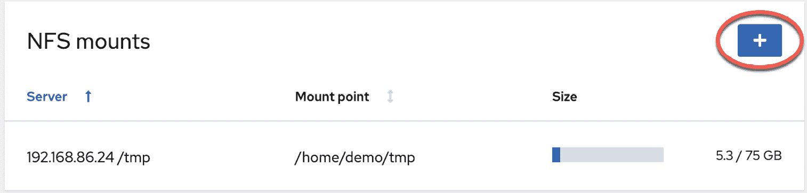
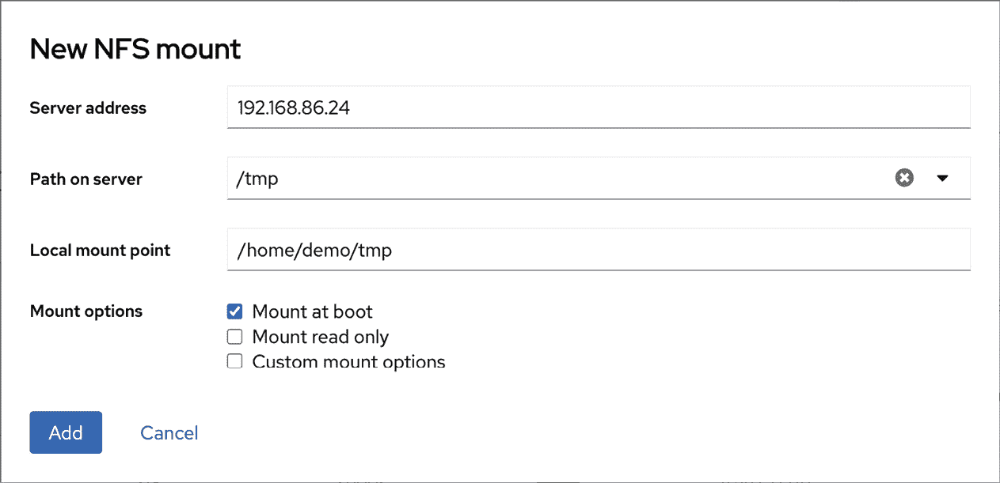
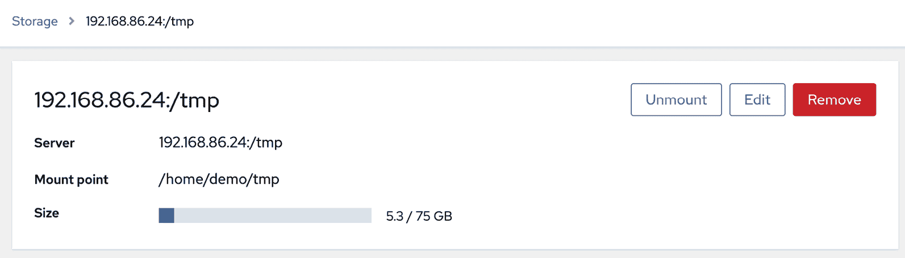

20\. 使用 NFS 在 Ubuntu 23.04 上共享文件与远程系统

Ubuntu 提供了两种机制，用于与网络上的其他系统共享文件和文件夹。一种方法是使用名为 Samba 的技术。Samba 基于 Microsoft Windows 文件夹共享，允许 Linux 系统使文件夹对 Windows 系统可访问，并从 Linux 访问 Windows 共享的文件夹。此方法也可以用于在其他 Linux 和 UNIX 系统之间共享文件夹，只要它们已安装并配置了 Samba 支持。这是异构网络环境中共享文件夹的最流行方法。使用 Samba 共享文件夹的内容在“在 Ubuntu 23.04 和 Windows 之间使用 Samba 共享文件”中有详细介绍。

另一种专门用于在 Linux 和 UNIX 系统之间共享文件夹的选项是使用网络文件系统（NFS）。NFS 允许一个 Linux 计算机上的文件系统通过网络连接被另一个 Linux 或 UNIX 系统访问。NFS 最初由 Sun Microsystems（现为 Oracle 公司的一部分）在 1980 年代开发，并且仍然是共享远程 Linux/UNIX 文件系统的标准机制。

NFS 与 Windows SMB 资源共享技术（由 Samba 使用）有很大不同。本章将探讨在 Ubuntu 与其他 UNIX/Linux 系统之间使用 NFS 进行网络共享文件夹的方法。

20.1 确保 NFS 服务在 Ubuntu 上运行

第一个任务是验证 NFS 服务是否已经在 Ubuntu 系统上安装并运行。您可以通过命令行或 Cockpit 界面来完成此操作。

首先，通过在终端窗口运行以下命令来安装 NFS 服务：

# apt install nfs-kernel-server

接下来，配置服务以便在启动时自动启动：

# systemctl enable nfs-kernel-server

服务启用后，按照以下步骤启动服务：

# systemctl start nfs-kernel-server

20.2 配置防火墙以允许 NFS 流量

接下来，防火墙需要配置为允许 NFS 流量。如果启用了简化防火墙（UFW），请运行以下命令以添加一条规则，允许 NFS 流量：

# ufw allow nfs

另一方面，如果您使用的是 firewalld，请运行以下 firewall-cmd 命令，其中<zone>应替换为适用于您防火墙和系统配置的相应区域：

# firewall-cmd --zone=<zone> --permanent --add-service=mountd

# firewall-cmd --zone=<zone> --permanent --add-service=nfs

# firewall-cmd --zone=<zone> --permanent --add-service=rpc-bind

# firewall-cmd --reload

20.3 指定要共享的文件夹

现在 NFS 已经运行，且防火墙已配置完成，我们需要指定 Ubuntu 文件系统中哪些部分可以被远程 Linux 或 UNIX 系统访问。这些设置可以在/etc/exports 文件中声明，必须修改该文件以通过 NFS 导出目录以供远程访问。该文件中导出行的语法如下：

<export> <host1>(<options>) <host2>(<options>)...

在上述行中，<export> 被替换为要导出的目录，<host1> 被替换为授予访问权限的系统的名称或 IP 地址，而 <options> 代表对该访问施加的限制（只读、读写等）。如果需要，也可以在同一行中放置多个主机和选项条目。例如，以下行允许 IP 地址为 192.168.2.38 的主机对 /datafiles 目录进行只读访问：

/datafiles 192.168.2.38(ro,no_subtree_check)

允许使用通配符将导出应用于多个主机。例如，以下行允许所有外部主机对 /home/demo 目录进行读写访问：

/home/demo *(rw,no_subtree_check)

虽然大多数 Linux 发行版默认使用推荐的 no_subtree_check 设置，但 Ubuntu 实现的 NFS 要求在所有导出指令中包含 no_subtree_check 或 subtree_check。

本章中，我们将按如下方式配置 /etc/exports 文件：

/tmp *(rw,sync,no_subtree_check)

/vol1 192.168.86.42(ro,sync,no_subtree_check)

配置完成后，NFS 服务器维护的已导出文件系统表需要使用 exportfs 命令更新为最新的 /etc/exports 设置，如下所示：

# exportfs -a

也可以使用 exportfs 工具从命令行查看当前的共享设置：

# exportfs

上述命令将生成以下输出：

/vol1 192.168.86.42

/tmp <world>

20.4 访问共享文件夹

共享文件夹可以通过客户端系统从命令行手动挂载来访问。但是，在尝试挂载远程 NFS 文件夹之前，必须先在客户端系统上安装 nfs-common 软件包：

# apt install nfs-common

要从命令行挂载远程文件夹，打开终端窗口并创建一个目录，以便将远程共享文件夹挂载到该目录：

$ mkdir /home/demo/tmp

接下来，输入命令以使用远程 NFS 服务器的 IP 地址或主机名挂载远程文件夹，例如：

$ sudo mount -t nfs 192.168.86.24:/tmp /home/demo/tmp

远程的 /tmp 文件夹将被挂载到本地系统。挂载后，/home/demo/tmp 文件夹将包含远程文件夹及其所有内容。

在挂载远程 NFS 文件系统时，也可以指定选项。例如，以下命令挂载相同的文件夹，但将其配置为只读：

$ sudo mount -t nfs -o ro 192.168.86.24:/tmp /home/demo/tmp

20.5 在系统启动时挂载 NFS 文件系统

也可以通过编辑 /etc/fstab 文件来配置 Ubuntu 系统在每次启动时自动挂载远程文件系统。当加载到编辑器时，它可能类似于以下内容：

/dev/disk/by-id/dm-uuid-LVM-Qv7p2RxcHOSG6RjnkgR21xkhaCQ9NC / ext4 defaults 0 1

# /boot 在 curtin 安装过程中位于 /dev/nvme0n1p2 上

/dev/disk/by-uuid/aa49b362-6c42-49a6-98ba-7a256a96b4b8 /boot ext4 defaults 0 1

# /boot/efi 在 curtin 安装过程中位于/dev/nvme0n1p1 上

/dev/disk/by-uuid/576B-B5F5 /boot/efi vfat defaults 0 1

例如，要挂载一个位于 IP 地址为 192.168.86.24 的系统上的/tmp 文件夹，并将其挂载到本地路径为/home/demo/tmp 的文件夹（注意该文件夹必须已经存在），请在/etc/fstab 文件中添加以下行：

192.168.86.24:/tmp /home/demo/tmp nfs rw 0 0

下次系统重启时，远程系统上的/tmp 文件夹将挂载到本地的/home/demo/tmp 挂载点。此后，远程文件夹中的所有文件可以像位于本地硬盘驱动器上一样访问。

20.6 卸载 NFS 挂载点

一旦通过 NFS 挂载了远程文件系统，就可以使用 umount 命令和本地挂载点作为命令行参数来卸载。例如，以下命令将卸载我们的示例文件系统挂载点：

$ sudo umount /home/demo/tmp

20.7 在 Cockpit 中访问 NFS 文件系统

除了使用命令行在客户端挂载远程 NFS 文件系统外，还可以通过 Cockpit Web 界面进行挂载操作。假设 Cockpit 已经在客户端系统上安装和配置好，打开 Web 浏览器登录到 Cockpit 界面，然后从左侧导航面板中选择存储选项。如果没有列出存储选项，则需要安装 cockpit-storaged 软件包：

# apt install cockpit-storaged

# systemctl restart cockpit.socket

一旦 Cockpit 服务重启，重新登录到 Cockpit 界面，此时应能看到存储选项。

选择后，主存储页面将包含一个列出当前挂载的 NFS 文件系统的部分，如图 20-1 所示：

图 20-1

要挂载远程文件系统，请点击上图中突出显示的“+”按钮，并在弹出的对话框中输入远程 NFS 服务器和文件系统共享的相关信息，以及本地挂载点和必要的选项，然后点击添加按钮：

图 20-2

要修改、卸载或移除 NFS 文件系统共享，请在 NFS 挂载列表中选择相应的挂载（上图中的图 20-1）以显示下方图 20-3 所示的页面：

图 20-3

在此屏幕中，可以执行更改服务器、挂载点或卸载文件系统等任务。例如，选择移除选项将卸载文件系统，并从/etc/fstab 文件中删除该条目，确保下次系统重启时不再挂载。

20.8 小结

网络文件系统（NFS）是一个基于客户端/服务器的系统，最初由 Sun Microsystems 开发，它为 Linux 和 Unix 系统提供了一种通过网络共享文件系统的方式。NFS 允许客户端系统像访问本地文件系统一样访问和（根据权限）修改位于远程服务器上的文件。 本章提供了 NFS 的概述，并概述了使用命令行或 Cockpit 网页界面配置客户端和服务器系统的选项。
