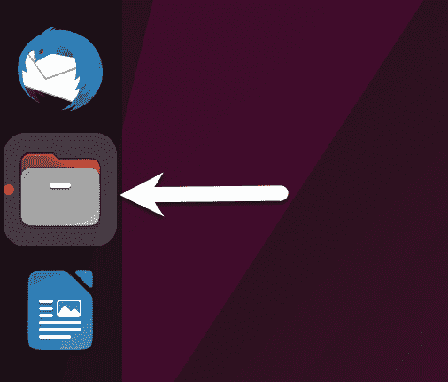
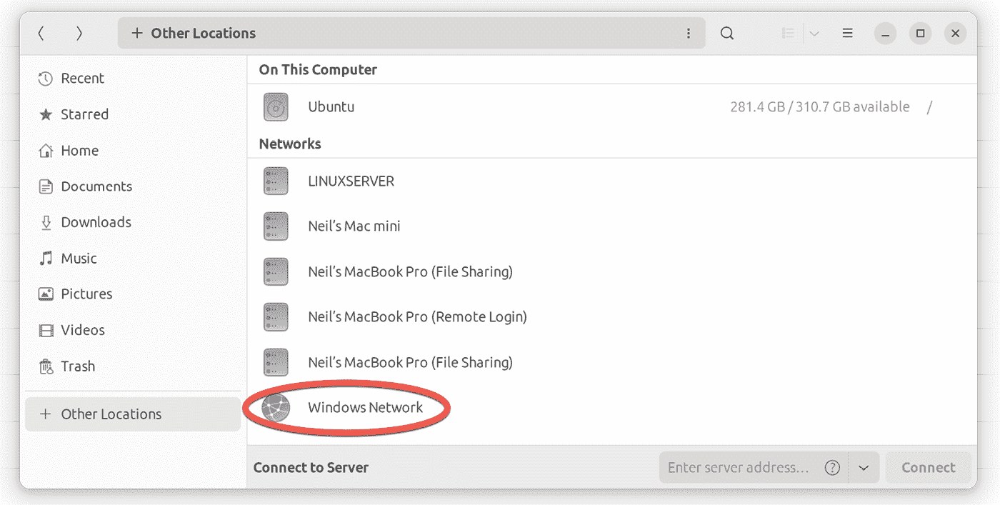
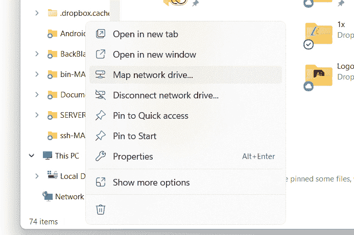
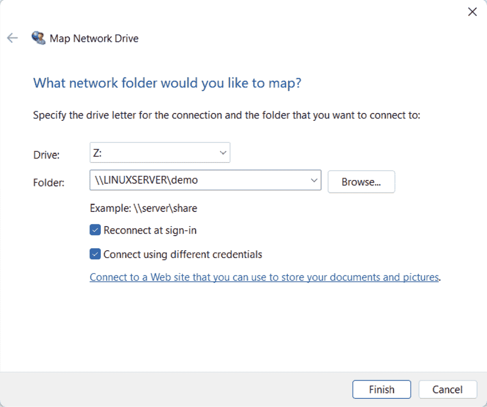
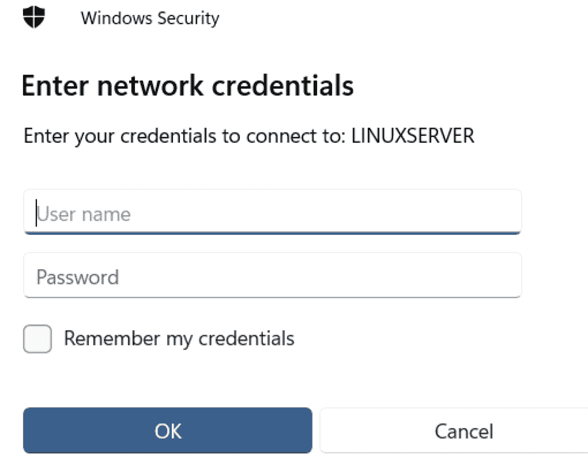
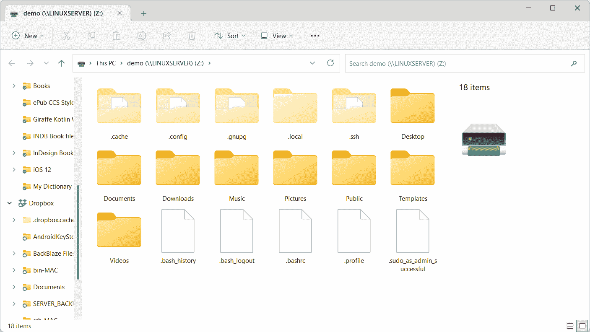
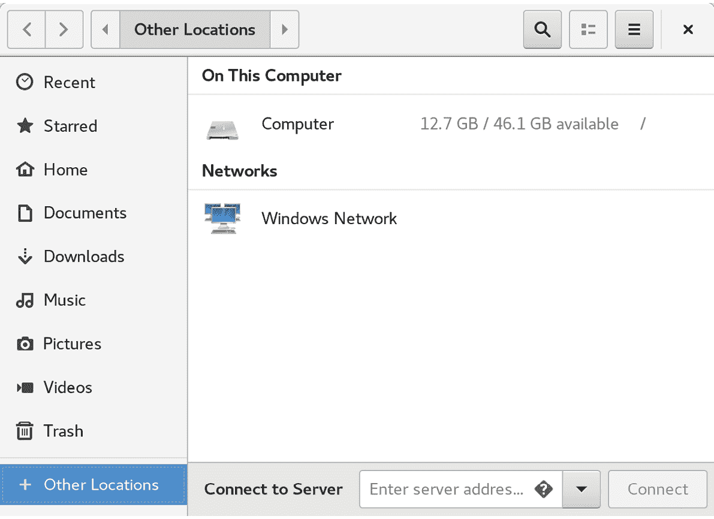
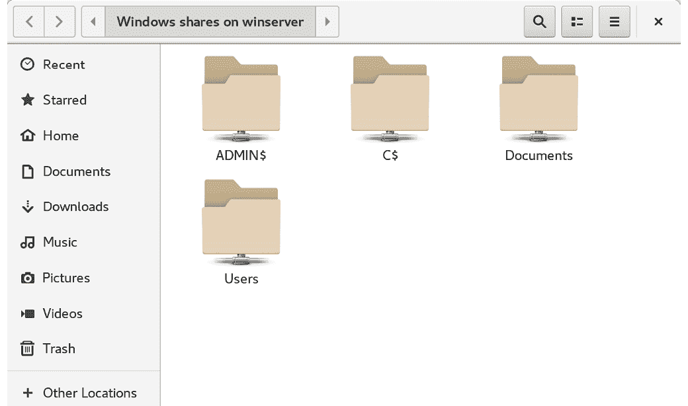

21. 在 Ubuntu 23.04 和 Windows 之间使用 Samba 共享文件

尽管 Linux 在桌面市场上已有一定进展，但其起源和未来仍然是以服务器为主。因此，Ubuntu 作为文件服务器并不令人惊讶。Ubuntu 和 Windows 系统通常会在网络环境中并行使用。因此，一个常见的需求是让 Ubuntu 系统上的文件能够通过网络连接被 Linux、UNIX 和 Windows 系统访问。同样，存储在 Windows 系统上的共享文件夹和打印机也可能需要从 Ubuntu 系统访问。

Windows 系统使用服务器消息块（SMB）协议共享资源，如文件系统和打印机。为了让 Ubuntu 系统通过网络向 Windows 系统提供这些资源，反之亦然，它必须支持 SMB。这是通过一种叫做 Samba 的技术实现的。除了提供 Linux 和 Windows 系统之间的集成，Samba 还可以提供 Linux 系统之间的文件夹共享（作为前一章中涉及的 NFS 的替代方案）。

本章将介绍在 Ubuntu 系统上共享文件系统资源和打印机给远程 Windows 和 Linux 系统，以及从 Ubuntu 访问 Windows 资源的步骤。

21.1 从 GNOME 桌面访问 Windows 资源

在深入了解 Samba 共享的更多细节之前，值得注意的是，如果你仅仅是想从 GNOME 桌面访问 Windows 共享文件夹，那么 GNOME 文件应用程序已经提供了支持。文件应用程序位于仪表板中，如 图 21-1 所示：

图 21-1

启动后，选择左侧导航面板中的“其他位置”选项，然后在主面板中选择 Windows 网络图标以浏览可用的 Windows 资源：

图 21-2

21.2 Samba 和 Samba 客户端

Samba 允许将 Ubuntu 资源与 Windows 系统共享，同时也允许将 Windows 资源与 Ubuntu 系统共享。Ubuntu 使用 Samba 客户端访问 Windows 资源。另一方面，通过安装和配置 Samba 服务，Ubuntu 资源可以与 Windows 系统共享。

21.3 在 Ubuntu 上安装 Samba

在 Ubuntu 安装过程中使用的默认设置通常不会安装必要的 Samba 包。除非你特别请求安装 Samba，否则系统上不太可能已经安装 Samba。要检查是否安装了 Samba，可以打开终端窗口并运行以下命令，查看每个包是否有 [installed] 标记：

# apt -qq list samba-common samba smbclient

任何缺失的包可以通过 apt 命令行工具安装：

# apt install samba-common samba smbclient

21.4 配置 Ubuntu 防火墙以启用 Samba

接下来，保护 Ubuntu 系统的防火墙必须配置为允许 Samba 流量。如果你使用的是简单防火墙（ufw），请运行以下命令：

# ufw allow samba

或者，如果你使用的是 firewalld，请按如下方式运行 firewall-cmd 命令：

# firewall-cmd --permanent --add-port={139/tcp,445/tcp}

# firewall-cmd --reload

在启动 Samba 服务之前，需要进行一些配置步骤，来定义 Ubuntu 系统在 Windows 系统中如何显示以及要与远程客户端共享的资源。大部分配置任务都发生在 /etc/samba/smb.conf 文件中。

21.5 配置 smb.conf 文件

Samba 是一个高度灵活且可配置的系统，提供了许多选项来控制 Windows 网络上资源的共享方式。不幸的是，这种灵活性可能导致 Samba 给人一种过于复杂的感觉。然而，实际上，典型的安装并不需要许多配置选项，设置基本配置的学习曲线相对较短。

在本章中，我们将介绍如何将 Ubuntu 系统加入 Windows 工作组，并设置一个目录作为共享资源，供特定用户访问。这种配置被称为独立的 Samba 服务器。更高级的配置，比如将 Samba 集成到活动目录环境中，也有提供，但这些超出了本书的范围。

配置 Samba 的第一步是编辑 /etc/samba/smb.conf 文件。

21.5.1 配置 [global] 部分

smb.conf 文件分为多个部分。第一部分是 [global] 部分，在这里可以指定适用于整个 Samba 配置的设置。虽然这些设置是全局性的，但每个选项可以在其他配置文件部分中被覆盖。

第一项任务是定义 Windows 工作组名称，Ubuntu 资源将在该工作组上共享。这个设置通过 [global] 部分中的 workgroup = 指令控制，默认配置如下：

workgroup = WORKGROUP

如果需要，首先将其更改为实际的工作组名称。

除了工作组设置外，其他设置表明这是一个独立的服务器，用户密码将保护共享资源。在继续配置要共享的资源之前，还需要在 [global] 部分添加其他参数，具体如下：

[global]

.

.

netbios name = LinuxServer

“netbios name” 属性指定了服务器在网络上如何被其他系统看到的名称。

21.5.2 配置共享资源

下一步是配置共享资源（换句话说，就是那些可以从 Windows 网络上的其他系统访问的资源）。为此，必须为该部分指定一个名称，用于在共享时引用。例如，如果我们计划共享我们 Ubuntu 系统中的 /sampleshare 目录，可以为该部分命名为 [sampleshare]。在这一部分中，可以配置各种选项。然而，在这个例子中，我们将定义要共享的目录，标明该目录既可浏览又可写入，并声明该资源为公共资源，以便访客用户可以访问：

[sampleshare]

注释 = 示例 Samba 共享

路径 = /sampleshare

可浏览 = 是

公共 = 是

可写 = 是

要限制对特定用户的访问，可以使用“valid users”属性，例如：

有效用户 = demo, bobyoung, marcewing

21.5.3 删除不必要的共享

smb.conf 文件预配置了共享打印机和系统中用户主文件夹的部分。如果这些资源不需要共享，可以注释掉相应的部分，让 Samba 忽略它们。在以下示例中，[homes] 部分已被注释掉：

.

.

#[homes]

# 注释 = 主页目录

# 有效用户 = %S, %D%w%S

# 可浏览 = 否

# 只读 = 否

# 继承访问控制列表 = 是

.

.

21.6 创建 Samba 用户

任何需要访问 Samba 共享资源的用户都必须被配置为 Samba 用户，并分配密码。此任务可以通过 smbpasswd 命令行工具来实现。例如，假设需要让名为 demo 的用户能够从 Windows 系统访问我们 Ubuntu 系统中的 /sampleshare 目录。为了满足这一需求，我们必须将 demo 添加为 Samba 用户，方法如下：

# smbpasswd -a demo

新的 SMB 密码：

重新输入新的 SMB 密码：

已添加用户 demo。

现在我们已经完成了一个基础 Samba 服务器的配置，接下来是测试我们的配置文件，然后启动 Samba 服务。

21.7 测试 smb.conf 文件

可以使用 testparm 命令行工具检查 smb.conf 文件中的设置是否有错误，方法如下：

# testparm

从 /etc/samba/smb.conf 加载 smb 配置文件

已加载服务文件，正常。

允许弱加密

服务器角色: ROLE_STANDALONE

按回车查看您的服务定义的转储

# 全局参数

[global]

日志文件 = /var/log/samba/%m.log

netbios 名称 = LINUXSERVER

打印机配置名称 = cups

安全 = 用户

WINS 支持 = 是

idmap 配置 * : 后端 = tdb

cups 选项 = raw

[sampleshare]

注释 = 示例 Samba 共享

访客访问 = 是

路径 = /sampleshare

只读 = 否

[homes]

可浏览 = 否

注释 = 主页目录

继承访问控制列表 = 是

只读 = 否

有效用户 = %S %D%w%S

[printers]

可浏览 = 否

注释 = 所有打印机

创建掩码 = 0600

路径 = /var/tmp

可打印 = 是

.

.

21.8 启动 Samba 和 NetBIOS 名称服务

为了使 Ubuntu 服务器能够在 Windows 网络中运行，必须启动 Samba（SMB）和 NetBIOS 名称服务（NMB）服务。可选地，还可以启用这些服务，使它们在每次系统启动时自动启动：

# systemctl enable smbd nmbd

# systemctl start smbd nmbd

在尝试从 Windows 系统连接之前，使用 smbclient 工具验证共享是否已配置：

# smbclient -U demo -L localhost

[WORKGROUP\demo]的密码：

共享名称 类型 注释

--------- ---- -------

sampleshare 磁盘 示例 Samba 共享

print$ 磁盘 打印机驱动程序

IPC$ IPC IPC 服务（demoserver 服务器（Samba，Ubuntu））

demo 磁盘 主目录

HP_OfficeJet_Pro_9020_series_9F6907 打印机 HP_OfficeJet_Pro_9020_series

21.9 访问 Samba 共享

现在 Samba 资源已配置并且服务正在运行，是时候从 Windows 系统访问共享资源了。在与 Ubuntu 系统处于同一工作组的适当 Windows 系统上，打开 Windows 资源管理器，右键单击侧边栏中的“网络”项，显示如图 21-3 所示的菜单：

图 21-3

选择“映射网络驱动器...”菜单选项，显示如图 21-4 所示的对话框：

图 21-4

选择一个驱动器字母并输入 Samba 共享的路径。例如，假设服务器名称为 LinuxServer，Samba 用户名为 demo，则用户的主文件夹路径如下：

\\LINUXSERVER\demo

启用“使用不同的凭据连接”复选框并点击完成。当网络凭据对话框出现时，输入先前通过 smbpasswd 命令分配的 Samba 用户名和密码：

图 21-5

连接建立后，新的 Windows 资源管理器对话框将显示共享的 Ubuntu 文件夹内容：

图 21-6

21.10 从 Ubuntu 访问 Windows 共享

如前所述，Samba 是一条双向通道，不仅允许 Windows 系统访问托管在 Ubuntu 系统上的文件和打印机，还允许 Ubuntu 系统访问 Windows 系统上的共享资源。这是通过使用在本章开始时安装的 samba-client 包来实现的。如果当前未安装，请通过终端窗口按如下方式安装：

# apt install smbclient

可以通过 Ubuntu 桌面上的文件应用程序或通过命令行提示符使用 smbclient 和 mount 工具访问 Windows 系统上的共享资源。本节假设 Windows 系统已启用适当的网络共享设置。

要使用 GNOME 桌面访问 Windows 系统上的任何共享资源，请启动“文件”应用程序，并选择“其他位置”选项。这将显示如下所示的屏幕，包括 Windows 网络的图标（如果检测到）：

图 21-7

选择“Windows 网络”选项将显示在网络上检测到的 Windows 系统，并允许访问任何共享资源。

图 21-8

或者，可以使用“连接到服务器”选项连接到特定系统。请注意，远程系统的名称或 IP 地址必须以`smb://`开头，并可以跟随特定共享资源的路径，例如：

`smb://WinServer/Documents`

没有桌面环境时，可以使用`mount`命令从命令行挂载远程 Windows 共享，并指定`cifs`文件系统类型。例如，以下命令将名为`Documents`的共享目录挂载到名为`/winfiles`的本地挂载点上，该共享位于名为`WinServer`的 Windows 系统上：

# `mount -t cifs //WinServer/Documents /winfiles -o user=demo`

21.11 总结

在本章中，我们探讨了如何配置 Ubuntu 系统同时作为 Samba 客户端和服务器，允许与 Windows 系统共享资源。涵盖的主题包括安装 Samba 客户端和服务器软件包以及配置 Samba 作为独立服务器。此外，介绍了 SELinux 的基本概念以及提供 Samba 访问共享资源的步骤。
