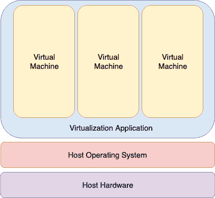
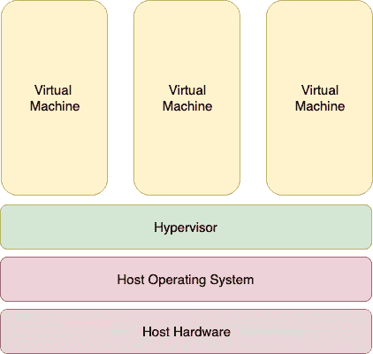
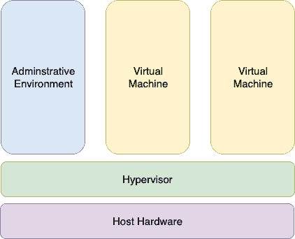

22. 虚拟化技术概述

虚拟化是指在单一计算机系统上同时运行多个操作系统的能力。尽管这不一定是一个新概念，但虚拟化在近年来逐渐受到关注，因为它提供了一种充分利用服务器系统 CPU 和资源容量的方式，同时提供稳定性（即如果某个虚拟化的客机系统崩溃，主机和其他任何客机系统仍然能够继续运行）。

虚拟化还有助于在不配置双启动环境的情况下尝试不同的操作系统。例如，你可以在虚拟机中运行 Windows，而无需重新分区硬盘，关闭 Ubuntu，然后从 Windows 启动。相反，你启动一个虚拟化的 Windows 版本作为客机操作系统。同样，虚拟化允许你在 Ubuntu 系统中运行其他 Linux 发行版，实现对两个操作系统的同时访问。

在决定实现虚拟化的最佳方法时，清楚地了解当前可用的不同虚拟化解决方案至关重要。因此，本章的目的是概括地描述当前普遍使用的虚拟化技术。

22.1 客机操作系统虚拟化

客机操作系统虚拟化，也叫做基于应用程序的虚拟化，是最容易理解的概念。在这种场景中，物理主机计算机运行的是标准的未修改操作系统，如 Windows、Linux、UNIX 或 macOS。在这个操作系统上运行的是一个虚拟化应用程序，该程序的执行方式与其他任何应用程序（如文字处理器或电子表格）在系统上运行的方式基本相同。在这个虚拟化应用程序内，创建了一个或多个虚拟机，用来在主机计算机上运行客机操作系统。

虚拟化应用程序负责启动、停止和管理每个虚拟机，并实质上代表各个虚拟机控制对物理硬件资源的访问。虚拟化应用程序还进行一项叫做二进制重写的过程，这涉及扫描正在执行的客机系统的指令流，并将任何特权指令替换为安全的模拟指令。这使得客机系统认为它是在直接运行在系统硬件上，而不是在应用程序中的虚拟机内。

下图展示了基于客机操作系统的虚拟化：

图 22-1

如上图所示，来宾操作系统在虚拟化应用程序内以虚拟机的形式运行，而虚拟化应用程序则像其他应用程序一样运行在主机操作系统之上。来宾操作系统与底层主机硬件之间的多层抽象不利于虚拟机的高性能。然而，这种技术的优点是主机或来宾操作系统无需做任何修改，也不需要特殊的 CPU 硬件虚拟化支持。

22.2 虚拟机管理程序虚拟化

在虚拟机管理程序虚拟化中，虚拟机管理程序的任务是处理虚拟机的资源和内存分配，并为更高层次的管理和监控工具提供接口。基于虚拟机管理程序的解决方案分为 Type-1 和 Type-2 两种。

Type-2 虚拟机管理程序（有时称为托管虚拟机管理程序）作为软件应用程序安装，并运行在主机操作系统之上，通过协调对资源（如 CPU、内存和网络）的访问来为来宾虚拟机提供虚拟化功能。图 21-2 展示了使用 Type-2 虚拟机管理程序虚拟化的典型系统架构：

图 22-2

要理解 Type-1 虚拟机管理程序如何工作，首先需要了解 Intel x86 处理器架构。x86 系列 CPU 提供了一系列保护级别，称为环，其中代码可以执行。环 0 具有最高的特权，操作系统内核通常在该环中运行。在环 0 中执行的代码被认为是在系统空间、内核模式或主管模式下运行的。所有其他代码，如在操作系统上运行的应用程序，都是在权限较低的环中运行，通常是环 3。

与 Type-2 虚拟机管理程序不同，Type-1 虚拟机管理程序（也称为裸金属虚拟机管理程序或本地虚拟机管理程序）直接在主机系统的硬件上运行，处于环 0。由于虚拟机管理程序占据了 CPU 的环 0，任何在该系统上运行的来宾操作系统内核必须在权限较低的 CPU 环上运行。不幸的是，大多数操作系统内核是明确为在环 0 中运行而编写的，因为它们需要执行只有在该环中才可以完成的任务，如执行特权 CPU 指令和直接操作内存。近年来，已经提出了几种不同的解决方案，每种解决方案都将在下面描述：

22.2.1 半虚拟化

在准虚拟化下，来宾操作系统的内核被专门修改以便在虚拟机管理程序上运行。这通常涉及将仅能在 CPU 的环 0 中运行的特权操作替换为对虚拟机管理程序的调用（称为超调用）。虚拟机管理程序则代表来宾内核执行任务。不幸的是，这通常将支持范围限制为开源操作系统（如 Linux），这些操作系统可以自由修改，以及已经同意进行必要代码修改以面向特定虚拟机管理程序的专有操作系统。尽管存在这些问题，来宾内核能够直接与虚拟机管理程序通信，使得准虚拟化方法比其他虚拟化方法提供更高的性能。

22.2.2 完全虚拟化

完全虚拟化支持未修改的来宾操作系统。未修改指的是那些没有被修改以便在虚拟机管理程序上运行的操作系统内核，因此它们仍然像在 CPU 的环 0 中运行一样执行特权操作。在这种情况下，虚拟机管理程序提供 CPU 仿真，以处理和修改未修改的来宾操作系统内核所执行的特权和保护 CPU 操作。不幸的是，这一仿真过程需要时间和系统资源来操作，因此与准虚拟化提供的性能相比，其性能较差。

22.2.3 硬件虚拟化

硬件虚拟化利用了英特尔和 AMD 最新一代 CPU 中内建的虚拟化功能。这些技术分别称为 Intel VT 和 AMD-V，提供了运行未修改的来宾虚拟机所需的扩展，而不会像完全虚拟化的 CPU 仿真那样产生开销。简单来说，这些处理器在环 0 之上提供了一个额外的特权模式（环 -1），使得虚拟机管理程序可以在其中操作，从而将环 0 留给未修改的来宾操作系统。

下图说明了 Type-1 虚拟机管理程序的虚拟化方法：

图 22-3

如上图所示，除了虚拟机外，一个管理操作系统或管理控制台也运行在虚拟机管理程序上，允许系统管理员管理虚拟机。

22.3 虚拟机网络

虚拟机通常需要连接到网络才能发挥实际作用。一种选择是让虚拟机连接到运行在主机操作系统内的虚拟网络。在这种配置下，虚拟网络上的任何虚拟机都能看到彼此，但网络地址转换（NAT）提供了对外部网络的访问。当使用虚拟网络和 NAT 时，每个虚拟机在外部网络（即主机连接的网络）上使用主机系统的 IP 地址进行表示。这是 Ubuntu 上 KVM 虚拟化的默认行为，通常不需要额外配置。通常，默认情况下会创建一个名为 default 的虚拟网络，并由设备 virbr0 表示。

若要让来宾在外部网络上表现为独立的系统（即拥有自己的 IP 地址），它们必须配置为共享主机上的物理网络接口。实现这一点的最快方法是将虚拟机配置为使用“直接连接”网络配置选项（也称为 MacVTap），这将为来宾系统提供与主机相同网络上的 IP 地址。不幸的是，尽管这样可以让虚拟机访问网络中的其他系统，但在使用 MacVTap 驱动程序时，无法建立来宾与主机之间的连接。

更好的选择是配置主机系统上的网络桥接接口，让来宾连接到该接口。这将为来宾提供外部网络上的 IP 地址，同时也允许来宾与主机之间进行通信，具体内容可参考章节“创建 Ubuntu 23.04 KVM 网络桥接接口”。

22.4 小结

虚拟化是指在单个主机操作系统中运行多个来宾操作系统的能力。已经开发出了几种虚拟化方法，包括来宾操作系统虚拟化和虚拟机监控程序虚拟化。虚拟机监控程序虚拟化分为两类，称为 Type-1 和 Type-2。Type-2 虚拟化解决方案被归类为准虚拟化、完全虚拟化和硬件虚拟化，后者使用一些 Intel 和 AMD 处理器模型的特殊虚拟化功能。

虚拟机来宾操作系统在网络配置方面有几种选择，包括 NAT、直接连接（MacVTap）和网络桥接配置。
