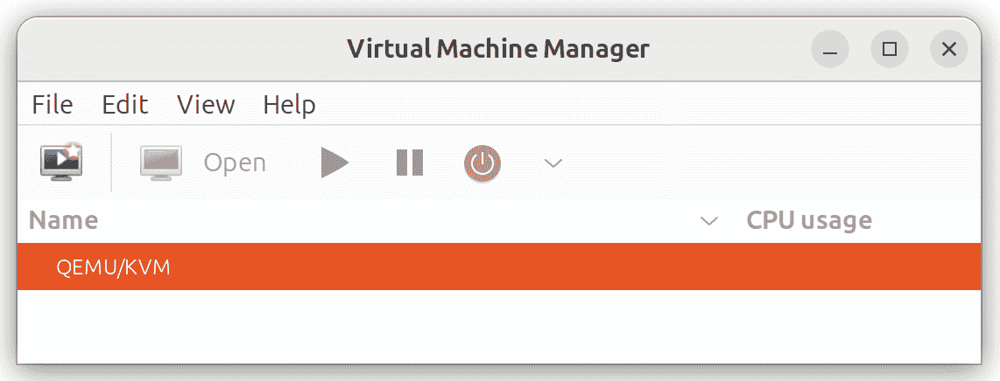
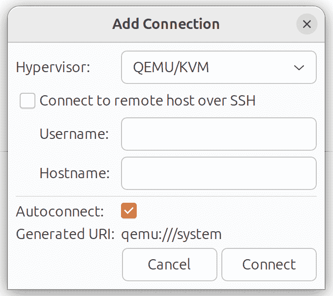

23.4 在 Ubuntu 23.04 上安装 KVM 虚拟化

早期版本的 Ubuntu 提供了两个虚拟化平台：基于内核的虚拟机（KVM）和 Xen。在最近的版本中，已移除对 Xen 的支持，只保留 KVM 作为 Ubuntu 随附的唯一虚拟化选项。除了 KVM 外，产品如 VMware 和 Oracle VirtualBox 等第三方解决方案也可用。然而，由于 KVM 已随 Ubuntu 提供，因此本教程将涵盖这一虚拟化解决方案。

在开始安装和运行 KVM 之前，值得讨论一下它如何与前一章中概述的各种虚拟化类型相适应。

23.1 KVM 概述

KVM 被归类为 Type-1 虚拟化解决方案，它通过 Intel VT 和 AMD-V 硬件虚拟化支持，提供对未修改的客户操作系统的完全虚拟化。

KVM 与许多其他 Type-1 解决方案的不同之处在于，它将宿主 Linux 操作系统转变为虚拟机监控器（Hypervisor），允许在运行完整的企业级宿主操作系统时实现裸金属虚拟化。

23.2 KVM 硬件要求

在继续本章之前，我们必须讨论在 KVM 环境中运行虚拟机的硬件要求。首先，KVM 虚拟化仅适用于某些类型的处理器。如前所述，这些处理器必须包括 Intel VT 或 AMD-V 技术。

要检查虚拟化支持，请在终端窗口中运行 lscpu 命令：

# 第二十三章：lscpu | grep Virtualization:

如果系统包含支持 Intel VT 的 CPU，上述命令将提供以下输出：

虚拟化：VT-x

或者，当检测到支持 AMD-V 的 CPU 时，将显示以下输出：

虚拟化：AMD-V

如果 CPU 不支持虚拟化，上述 lscpu 命令将不会显示任何输出。

请注意，尽管上述命令仅报告处理器是否支持各自的功能，但并不表示该功能是否已在 BIOS 中启用。因为在实际操作中，大多数系统的 BIOS 默认情况下通常禁用虚拟化支持。因此，在继续本教程之前，您应检查 BIOS 设置，确保启用了适当的虚拟化技术。

与双启动环境不同，虚拟化环境涉及在单台计算机系统上同时运行两个或更多完整的操作系统。这意味着系统必须有足够的物理内存、磁盘空间和 CPU 处理能力，以便平行地容纳所有这些系统。因此，在开始配置和安装过程之前，请检查 Ubuntu 和您选择的客户操作系统的最低系统要求，并验证您的宿主系统是否有足够的资源来满足两个系统的要求。

23.3 为 KVM 虚拟化准备 Ubuntu

与 Xen 不同，KVM 不需要运行特定版本的内核来提供支持。因此，通过安装 KVM 内核模块，KVM 支持已经可以与标准内核一起使用，从而无需安装并从特殊内核启动。

然而，为了避免冲突，如果系统上当前正在运行启用了 Xen 的内核，请重启系统并从启动菜单中选择一个非 Xen 内核，然后继续本章其余内容。

仅在 Ubuntu 操作系统安装过程中明确选择时，才会默认安装设置和维护 KVM 虚拟化系统所需的工具。要从命令提示符安装 KVM 工具，在终端窗口中执行以下命令：

# apt install qemu-kvm libvirt-clients libvirt-daemon-system bridge-utils

如果您有访问图形桌面环境的权限，建议安装 virt-manager 包：

# apt install virt-manager

23.4 验证 KVM 安装

在继续之前，值得检查 KVM 安装是否正确工作。当 KVM 安装并运行时，两个模块将已加载到内核中。可以通过在终端窗口中运行 lsmod 命令来验证这些模块是否存在：

# lsmod | grep kvm

假设安装成功，以上命令应该生成类似以下的输出：

kvm_intel 438272 0

kvm 1138688 21 kvm_intel

请注意，如果系统包含 AMD 处理器，kvm 模块可能会显示为 kvm_amd 而非 kvm_intel。

安装过程还应已配置 libvirtd 守护进程在后台运行。再次使用终端窗口，运行以下命令以确保 libvirtd 正在运行：

# systemctl status libvirtd

● libvirtd.service - 虚拟化守护进程

已加载：已加载 (/lib/systemd/system/libvirtd.service; 启用; 厂商预设>

活跃：活跃（运行中），自 2023-07-19 11:15:13 EDT 起；21 小时前

如果该进程未运行，按照以下步骤启动：

# systemctl enable --now libvirtd

# systemctl start libvirtd

如果桌面环境可用，通过选择“活动”并在搜索框中输入“virt”来运行 virt-manager 工具。当虚拟机管理器图标出现时，点击它以启动。加载后，管理器应该如下面的图示所示：

图 23-1

如果没有列出 QEMU/KVM 条目，选择文件 -> 添加连接菜单选项，在随后的对话框中选择 QEMU/KVM 虚拟化程序，然后点击连接按钮：

图 23-2

如果管理器当前未连接到虚拟化进程，请右键点击列出的条目并从弹出菜单中选择“连接”。

23.5 总结

KVM 是一种类型为 1 的虚拟化解决方案，通过支持 Intel VT 和 AMD-V 硬件虚拟化技术，实现对未修改的客户操作系统的完全虚拟化。它是 Ubuntu 默认的虚拟化解决方案，并且可以在任何具有适当处理器支持的 Ubuntu 系统上快速轻松地安装。安装并启用 KVM 支持后，接下来的章节将概述在 Ubuntu 主机上安装和管理虚拟机的一些选项。
