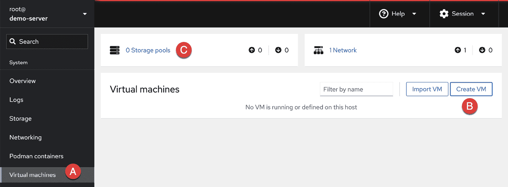
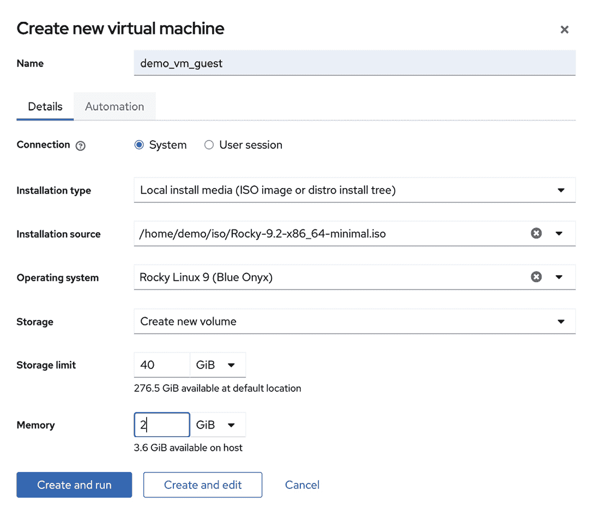
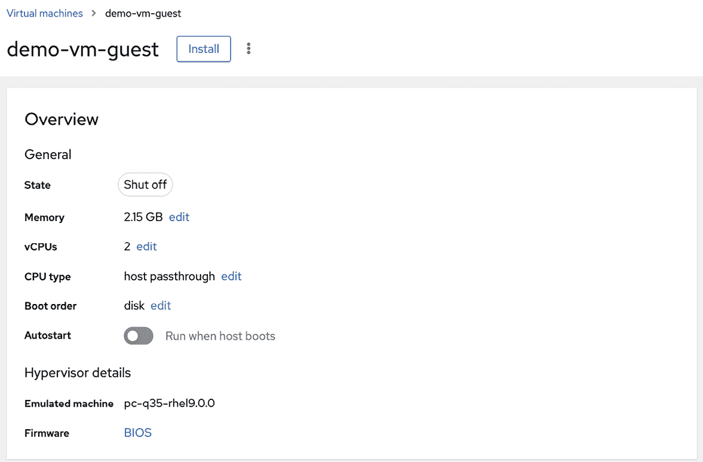
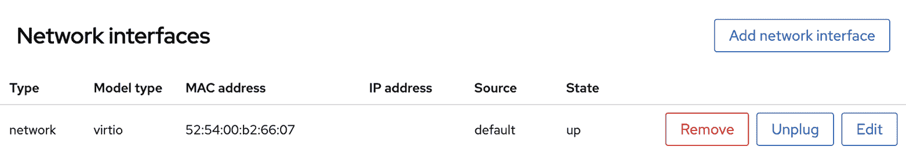
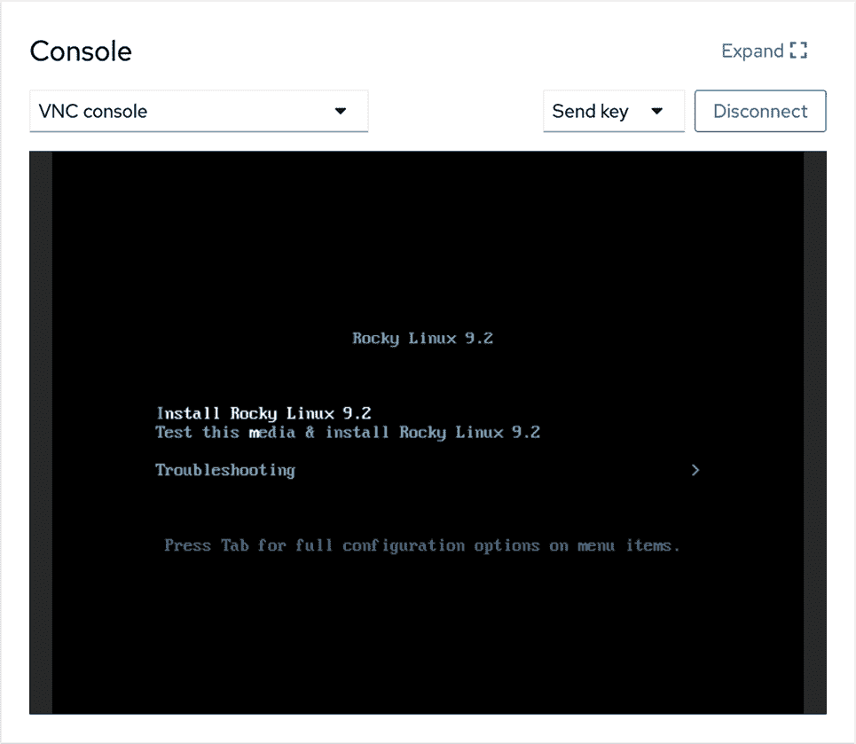
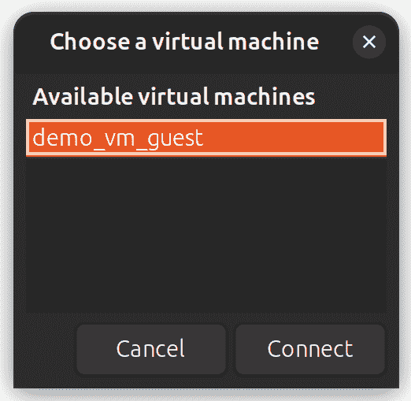
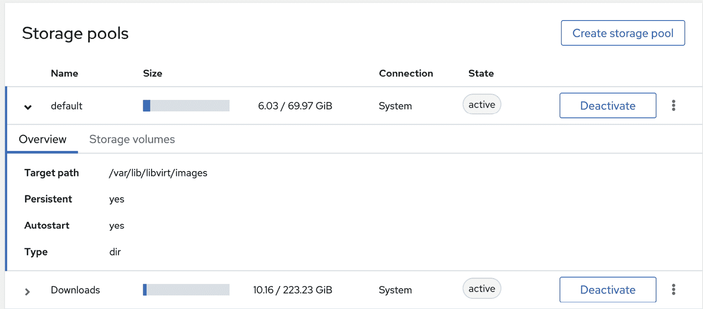
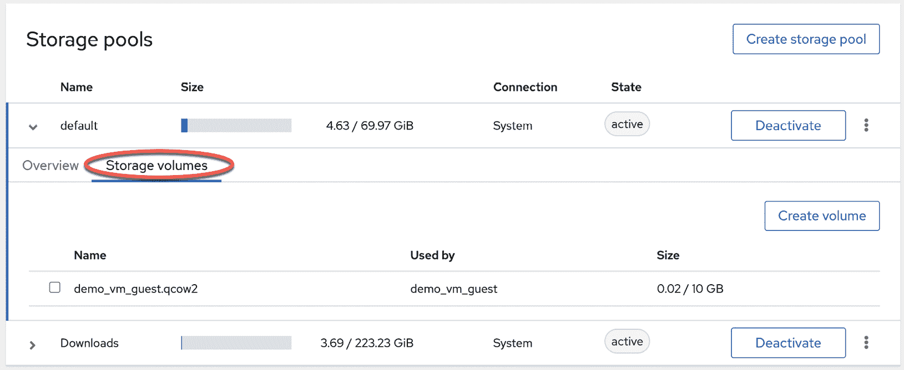
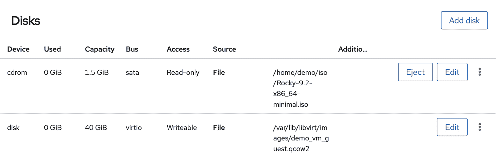
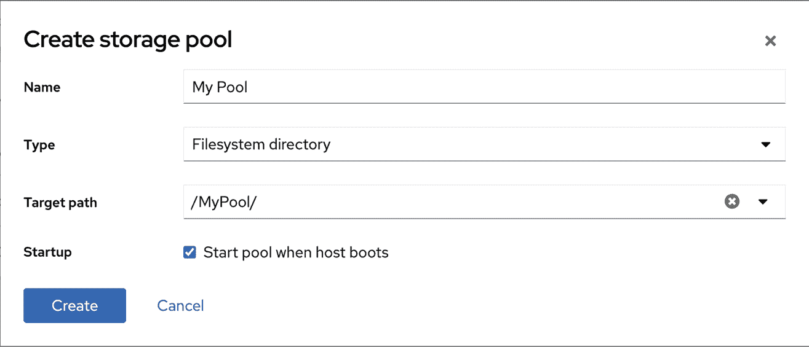

24. 使用 Cockpit 在 Ubuntu 23.04 上创建 KVM 虚拟机

基于 KVM 的虚拟机可以通过使用 virt-install 命令行工具、virt-manager GUI 工具或 Cockpit Web 控制台的虚拟机模块轻松在 Ubuntu 上配置。本章将使用 Cockpit 在 Ubuntu 主机上安装 KVM 客户操作系统。本章名为“使用 virt-manager 在 Ubuntu 23.04 上创建 KVM 虚拟机”将介绍使用 virt-manager 工具创建新虚拟机。

下一章“使用 virt-install 和 virsh 创建 KVM 虚拟机”将介绍使用命令行方法创建虚拟机。

24.1 安装 Cockpit 虚拟机模块

默认情况下，虚拟机模块可能不会包含在标准的 Cockpit 安装中。如果已安装并配置 Cockpit，可以按以下步骤安装虚拟机模块：

# 第二十四章：apt install cockpit-machines

安装后，下次登录 Cockpit 界面时，虚拟机选项（在图 24-1 中标记为 A）将出现在导航面板中：

图 24-1

24.2 在 Cockpit 中创建虚拟机

要在 Cockpit 中创建虚拟机，请点击图 24-1 中标记为 B 的创建虚拟机按钮，以显示创建对话框。

在对话框中，输入机器名称，并选择安装介质的形式，是通过 URL 访问的 ISO 文件，还是本地文件系统路径，或者选择供应商和操作系统类型信息，并选择下载操作系统选项，在安装过程中自动下载安装镜像。

另外，还需指定用于操作系统安装的虚拟磁盘驱动器的大小以及分配给虚拟机的内存量：

图 24-2

点击创建和编辑按钮来构建虚拟机。创建过程完成后，从列表中选择新虚拟机，以显示配置详细信息，如图 24-3 所示：

图 24-3

如在“虚拟化技术概述”中所述，KVM 提供了几种网络配置选项。要查看和更改虚拟机的网络设置，请滚动到虚拟机概述屏幕的网络接口部分，并点击编辑按钮：

图 24-4

在弹出的对话框中，可以使用网络类型菜单更改网络连接的类型，例如，从虚拟网络（NAT）更改为直接连接（MacVTap）或桥接到局域网。

24.3 开始安装

要启动新的虚拟机并从指定的安装介质安装客户操作系统，请点击概览页面顶部的安装按钮。Cockpit 将启动虚拟机并更新控制台视图，其中将显示客户操作系统屏幕：

图 24-5

如果安装失败，请检查消息以查看在打开安装映像时是否发生错误。这通常是因为 QEMU 模拟器以名为 qemu 的用户身份运行，而该用户没有访问 ISO 安装映像所在目录的权限。为了解决这个问题，打开终端窗口（或如果系统是远程的，则使用 SSH 连接），切换到 ISO 映像文件所在的位置，并将 libvirt-qemu 用户添加到父目录的访问控制列表（ACL），命令如下：

# cd /path/to/iso/directory

# setfacl -m u:libvirt-qemu:x ..

做出此更改后，请按如下方式检查设置：

# getfacl ..

# file: ..

# owner: demo

# group: demo

user::rwx

user:libvirt-qemu:--x

group::r-x

mask::r-x

other::---

做出这些更改后，请再次点击安装按钮以完成安装。

要完成安装，在控制台视图中与屏幕交互，就像在物理硬件上安装操作系统一样。如果控制台太小，无法显示整个客户操作系统屏幕，请点击右上角的扩展按钮。

还可以使用 virt-viewer 工具从 Cockpit 浏览器会话之外连接并显示虚拟机的图形控制台。要在 Ubuntu 系统上安装 virt-viewer，请运行以下命令：

# apt install virt-viewer

virt-viewer 工具也可以用于 Windows 系统，并可以从以下网址下载：

[`virt-manager.org/download/`](https://virt-manager.org/download/)

要连接到运行在本地主机上的虚拟机，请运行 virt-viewer，并从弹出的对话框中选择要连接的虚拟机：

图 24-6

上述命令将列出基于系统的虚拟机。要列出并访问基于会话的客户机，请按照如下方式启动 virt-viewer：

$ virt-viewer --connect qemu:///session

另外，也可以指定虚拟机名称，完全跳过选择对话框，例如：

# virt-viewer demo-vm-guest

要通过 SSH 将 virt-viewer 实例连接到远程主机上运行的虚拟机，可以使用以下命令：

$ virt-viewer --connect qemu+ssh://<user>@<host>/system <guest name>

例如：

$ virt-viewer --connect qemu+ssh://root@192.168.1.122/system demo_vm_guest

使用此技术时，需要注意在连接完全建立之前，系统将提示输入两次用户密码。

虚拟机创建完成后，Cockpit 界面可以监控该虚拟机，并执行重启、关机或删除客户系统等任务。在磁盘面板中还可以选择一个选项，将磁盘添加到虚拟机配置中。

24.4 存储卷与存储池的使用

创建虚拟机时，通常会有至少一个虚拟磁盘驱动器。这些虚拟磁盘驱动器的镜像文件存储在存储池中。存储池可以是本地文件系统中的现有目录、文件系统分区、物理磁盘设备、逻辑卷管理（LVM）卷组，甚至是远程网络文件系统（NFS）。

每个存储池被划分为一个或多个存储卷。存储卷通常是单个镜像文件，每个文件代表一个虚拟磁盘驱动器，但它们也可以是物理磁盘分区、整个磁盘驱动器或 LVM 卷组的形式。

当通过前述步骤创建虚拟机时，默认的存储池也被创建来存储虚拟机镜像。这个默认存储池占用根文件系统的空间，并且可以在 Cockpit 虚拟机界面中通过选择面板顶部标记为 C 的存储池选项来查看，如图 24-1 所示。

选择后，下面将显示一个界面，如图 24-7 所示，其中包含当前系统上配置的存储池列表：

图 24-7

在上面的例子中，默认的存储池位于根文件系统上，并将虚拟机镜像存储在/var/lib/libvirtd/images 目录中。要查看存储池中包含的存储卷，选择图 24-8 中突出显示的存储卷标签：

图 24-8

在演示虚拟机的例子中，存储卷采用名为 demo-vm-guest.qcow2 的镜像文件形式。此外，存储池还包括一个包含安装 ISO 镜像的存储卷。要查看某个虚拟机使用的存储卷，可以返回到主虚拟机 Cockpit 界面，选择该虚拟机，然后滚动到磁盘面板，如图 24-9 所示：

图 24-9

尽管使用默认存储池进行测试和早期实验是可以接受的，但建议为一般虚拟化使用创建额外的存储池。要创建新的存储池，在 Cockpit 中显示存储池界面并点击“创建存储池”按钮，弹出如图 24-10 所示的对话框：

图 24-10

在上述示例中，正在创建一个名为 MyPool 的新存储池，使用的是挂载为/MyPool 的文件系统分区（磁盘驱动器、分区和挂载点的主题将在本章后面名为“将新磁盘驱动器添加到 Ubuntu 23.04 系统”的部分中介绍）。创建完成后，存储池将列在 Cockpit 存储池屏幕中，并且可以包含存储卷，随着新虚拟机的创建而添加。

24.5 小结

本章概述了如何使用基于网页的 Cockpit 界面来创建和管理基于 KVM 的虚拟机。Cockpit 界面的优点是不需要访问运行在主机系统上的桌面环境。另一种选择是使用下一章中介绍的 virt-manager 图形工具。
