25. 在 Ubuntu 23.04 上使用 virt-manager 创建 KVM 虚拟机

上一章探讨了如何使用 Cockpit web 工具在 Ubuntu 上创建 KVM 虚拟机。鉴于一旦虚拟机 Cockpit 扩展完全实现，virt-manager 可能会被停用，本章将介绍如何使用此工具创建新的虚拟机。

25.1 启动虚拟机管理器

如果尚未安装，请按照以下步骤安装 virt-manager 包：

# 第二十五章：apt install virt-manager

接下来，在终端窗口中运行 virt-manager 命令启动虚拟机管理器。一旦加载完成，虚拟机管理器将在显示以下屏幕之前提示输入当前活动用户的密码：

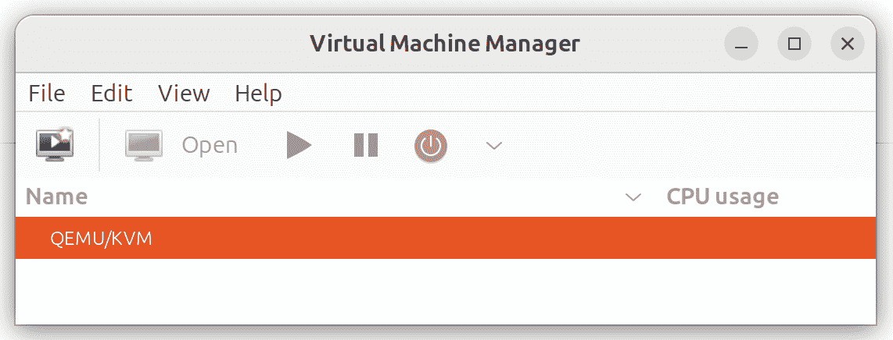

图 25-1

主屏幕列出了系统上当前运行的虚拟机。

默认情况下，管理器应已连接到系统的 libvirtd 实例。如果没有，右键点击列表中的条目，选择弹出菜单中的“连接”来连接到主机系统。

要管理基于会话的虚拟机，请选择“文件” -> “添加连接...” 菜单选项，以显示 图 25-2 中所示的对话框：

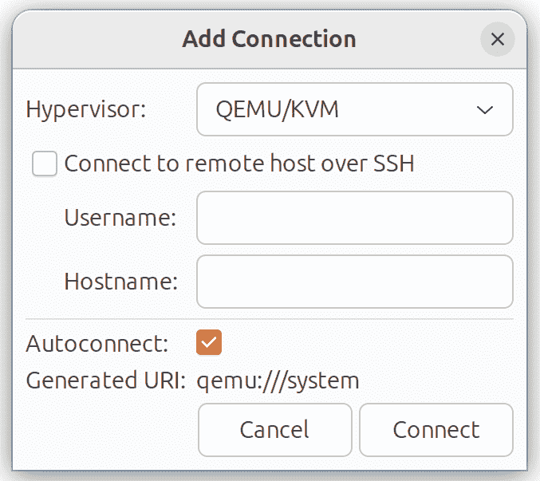

图 25-2

从 Hypervisor 菜单中选择 QEMU/KVM 用户会话，并在此对话框中点击“连接”按钮。返回主 virt-manager 屏幕时，QEMU/KVM 会话应如上所示在 图 25-1 中列出。

要创建虚拟系统，请点击新建虚拟机按钮（工具栏中的最左侧按钮），以显示新虚拟机向导的第一个屏幕。在“名称”字段中，为虚拟系统输入一个合适的描述性名称。在此屏幕上，还需要选择安装来宾操作系统的媒体位置。这可以是 CD 或 DVD 驱动器、可供本地主机访问的 ISO 镜像文件、使用 HTTP、FTP、NFS 或 PXE 的网络安装，或者来自现有虚拟机的磁盘映像：

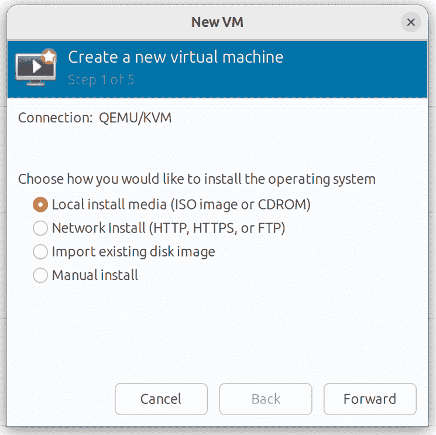

图 25-3

25.2 配置 KVM 虚拟系统

点击“前进”将显示一个寻找安装过程额外信息的屏幕。所显示的屏幕和所需信息将取决于在初始屏幕上的选择。例如，如果选择了 CD、DVD 或 ISO，这个屏幕将要求提供 ISO 文件或物理媒体设备的具体位置。此屏幕还会根据指定的安装媒体尝试识别来宾操作系统的类型和版本（例如，Windows 版本或 Linux 发行版）。如果无法识别，请关闭“从安装媒体/源自动检测”选项，输入操作系统名称的前几个字符，并从可能的匹配项列表中选择一个选项：

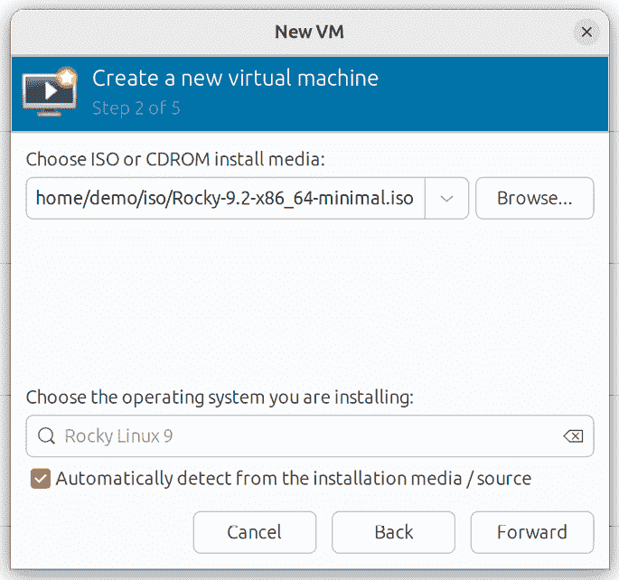

图 25-4

配置好这些设置后，点击“前进”按钮来配置 CPU 和内存设置。最佳设置将取决于主机中 CPU 的数量和物理内存的大小，以及与新虚拟机并行运行的其他应用程序和虚拟机的需求：

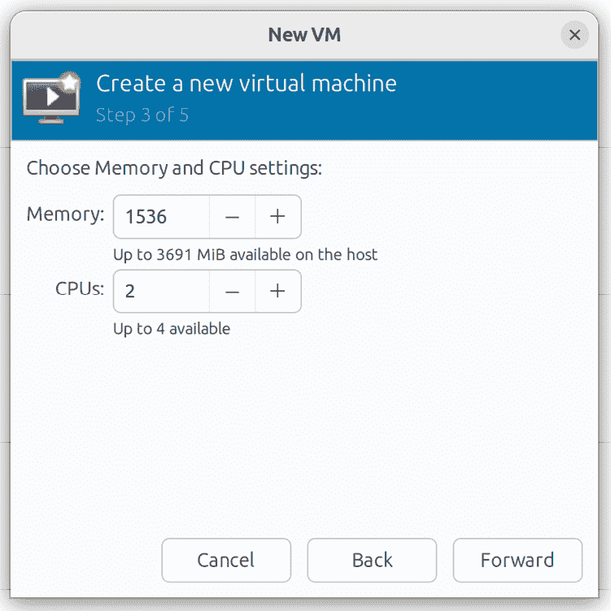

图 25-5

在下一屏幕上，可以选择创建指定大小的镜像磁盘，选择已有的卷，或创建指定格式的存储卷（如 raw、vmdk、ISO 等）。除非你有特定需求需要使用某种格式（例如，可能需要使用 vmdk 格式，以便将来迁移到基于 VMware 的虚拟化环境），或需要使用专用磁盘或分区，否则通常只需在此屏幕上指定大小即可：

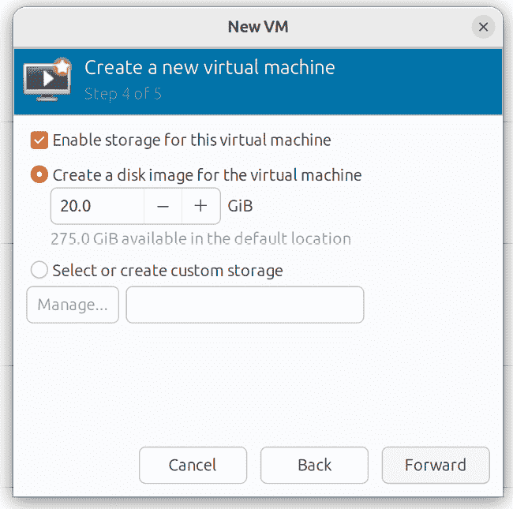

图 25-6

如果使用默认设置，虚拟机将使用默认存储池中的存储卷作为虚拟磁盘驱动器。若要使用在前一章节中创建的自定义存储池“我的存储池”，请在点击“管理...”按钮之前启用“选择或创建自定义存储”选项。

在存储卷对话框中，选择左侧面板中的“我的存储池”条目，然后在主面板中点击 + 按钮以创建新的存储卷：

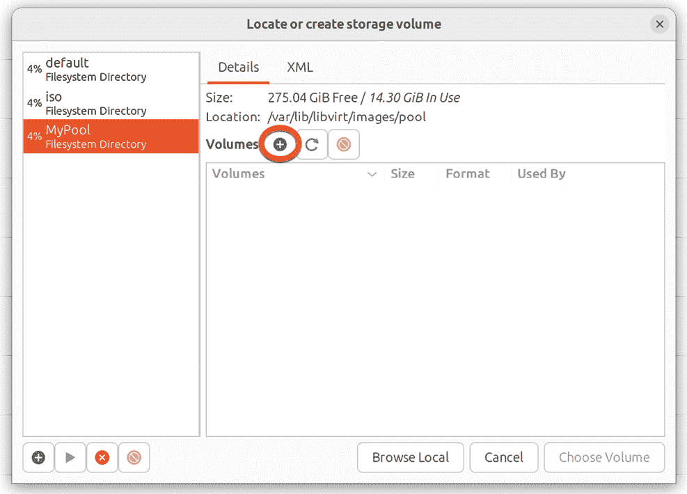

图 25-7

请注意，对话框左下角的 + 按钮也可以用来创建新的存储池，作为使用 Cockpit 界面的替代方法。

在配置屏幕中（图 25-8），命名存储卷，选择卷的大小，然后点击“完成”按钮以创建存储卷并将其分配给虚拟机：

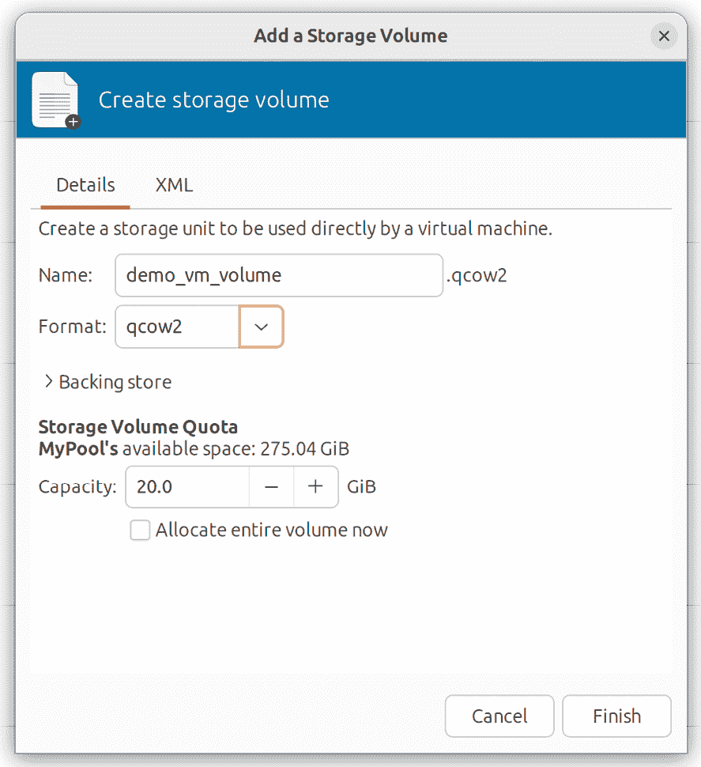

图 25-8

配置好这些设置后，选择新建的存储卷并点击“选择存储卷”按钮。然后，再次点击“前进”按钮。最后一个屏幕会显示配置的摘要。请检查显示的信息。也可以使用高级选项来更改虚拟机的虚拟网络配置，如图 25-9 所示：

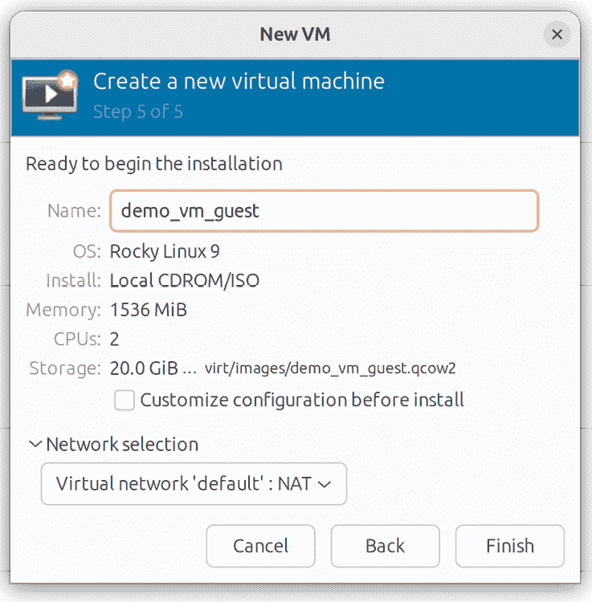

图 25-9

25.3 启动 KVM 虚拟机

点击“完成”按钮开始创建过程。虚拟化管理器将创建磁盘并配置虚拟机，然后启动客体系统。最后，新虚拟机会出现在主 virt-manager 窗口中，状态显示为“运行中”，如图 25-10 所示：

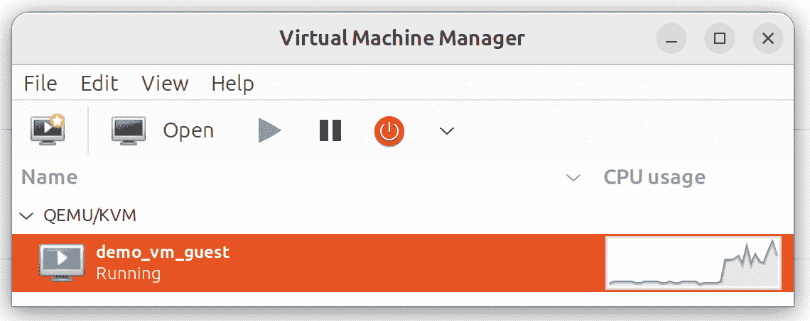

图 25-10

默认情况下，虚拟机的控制台应该出现在虚拟机查看器窗口中。要查看运行中的虚拟机控制台，确保在虚拟机列表中选择该虚拟机，并从工具栏选择“打开”按钮。虚拟机查看器应该准备好，安装过程即将开始：

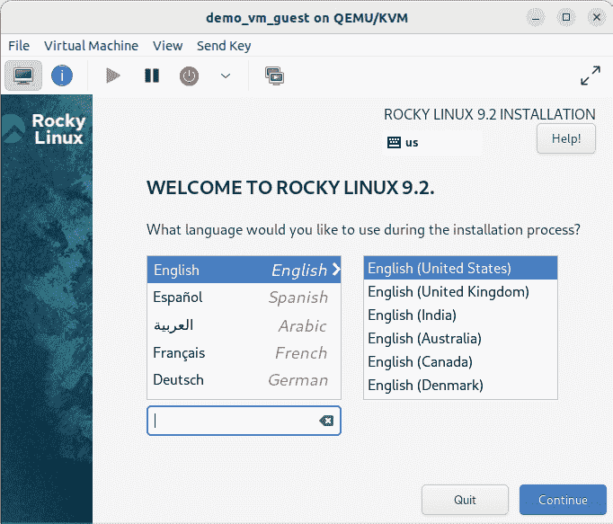

图 25-11

从现在起，按照安装指示在 KVM 虚拟机中安装客操作系统。

25.4 总结

在 Ubuntu 主机系统上创建基于 KVM 的虚拟机有多种方法。本章使用 virt-manager 图形工具来创建、配置并运行一个客操作系统，包括创建新的存储卷。在掌握了这些基础知识后，下一章将介绍如何通过命令行创建虚拟机。
