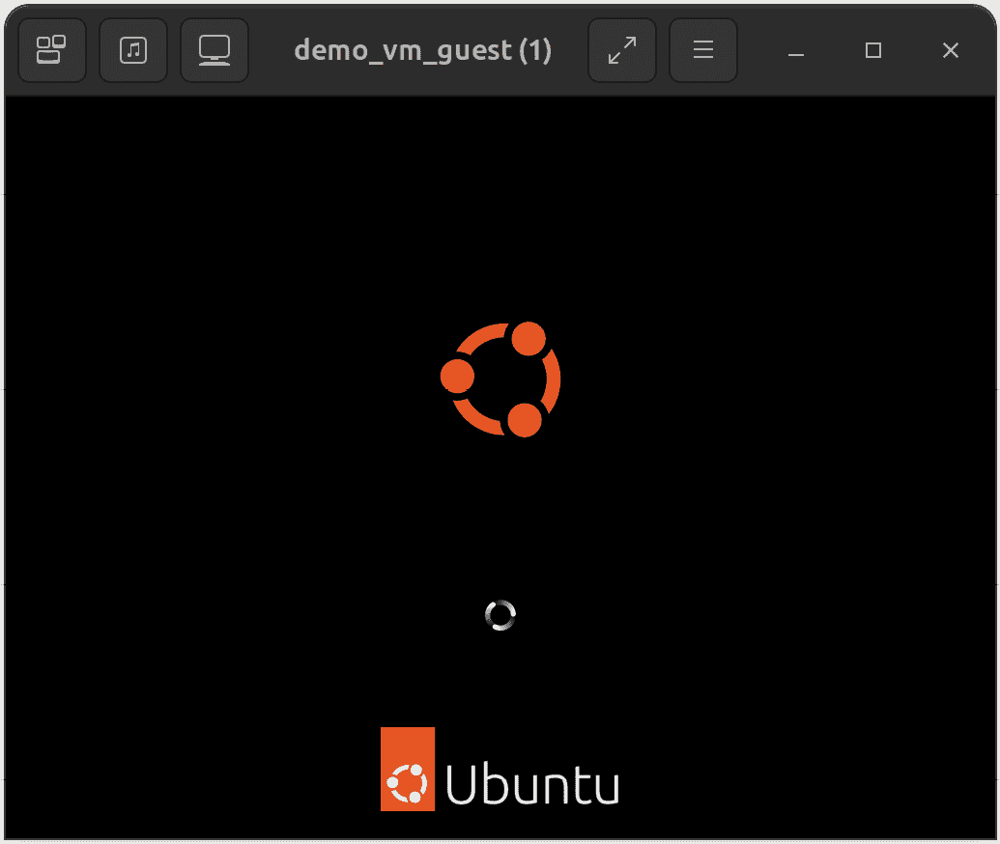

26. 使用 virt-install 和 virsh 创建 KVM 虚拟机

在前面的章节中，我们探讨了如何在 Ubuntu 主机上使用 Cockpit 和 virt-manager 图形工具创建 KVM 客操作系统。本章将重点介绍如何使用 virt-install 和 virsh 命令行工具创建基于 KVM 的虚拟机。这些工具提供了与 virt-manager 和 Cockpit 选项相同的所有功能，并具有可在脚本中使用的额外优势，从而实现虚拟机创建的自动化。此外，virsh 命令允许根据包含在配置文件中的规范创建虚拟机。

提供 virt-install 工具是为了通过提供一组命令行选项来创建新的虚拟机。本章假设已经安装了必要的 KVM 工具。有关这些要求的详细信息，请阅读“在 Ubuntu 23.04 上安装 KVM 虚拟化”一章。

26.1 运行 virt-install 来构建 KVM 客操作系统

virt-install 工具接受一系列命令行参数，这些参数提供与正在创建的虚拟机相关的配置信息。一些命令行选项是必需的（明确要求提供名称、内存和磁盘存储），而其他选项则是可选的。

至少，virt-install 命令通常需要以下参数：

•--name - 分配给虚拟机的名称。

•--memory - 分配给虚拟机的内存量。

•--disk - 用于虚拟机存储的镜像文件的名称和位置。如果没有指定--import 选项以指示使用现有镜像文件，则此文件将在虚拟机创建过程中由 virt-install 创建。

•--cdrom 或 --location - 指定包含客操作系统安装介质的本地路径或远程 ISO 镜像的 URL。

使用 virt-install 时可用的所有参数的摘要可以在 man 页中找到：

$ man virt-install

26.2 一个 Ubuntu virt-install 命令示例

参考以上命令行参数列表，现在我们可以查看一个使用 virt-install 工具的命令行示例。

请注意，为了显示虚拟机并完成安装，virt-install 工具启动虚拟机后，必须连接 virt-viewer 实例到虚拟机。默认情况下，virt-install 会尝试在虚拟机启动后自动启动 virt-viewer。然而，如果 virt-viewer 不可用，virt-install 将等待直到建立 virt-viewer 连接。例如，virt-viewer 会话可能在主机系统的图形桌面上本地运行，或者可能从远程客户端建立连接，正如“在 Ubuntu 23.04 上使用 virt-manager 创建 KVM 虚拟机”一章中所述。

以下命令创建一个新的 KVM 虚拟机，配置为使用 KVM para-virtualization 运行 Ubuntu 来宾操作系统。它创建一个新的 10GB 磁盘映像，分配 2048MB 的内存给虚拟机，并为安装媒体 ISO 镜像配置一个虚拟 CD 设备：

# 第二十六章：virt-install --name demo_vm_guest --memory 2048 --disk path=/tmp/demo_vm_guest.img,size=10 --network network=default --cdrom /home/demo/iso/ubuntu-23.04-desktop-amd64.iso

在创建过程中，virt-install 命令会显示创建进度的状态更新：

启动安装...

分配 'demo_vm_guest.img' | 10 GB 00:00:01

运行图形控制台命令：virt-viewer --connect qemu:///system --wait demo_vm_guest

一旦来宾系统创建完成，virt-viewer 屏幕将显示加载自指定安装媒体的来宾操作系统安装程序：

图 26-1

从此处开始，按照来宾操作系统的标准安装程序进行操作。

26.3 从命令行启动和停止虚拟机

既然已经从命令行创建了虚拟机，理应在未来你也可能需要从命令行启动它。这可以通过 virsh 命令行工具实现，引用在创建时分配给虚拟机的名称。例如：

# virsh start demo_vm_guest

同样，虚拟机也可以通过以下方式发送关机信号：

# virsh shutdown demo_vm_guest

假设虚拟机未响应关机信号，并且没有开始进行优雅关机，则可以使用 destroy 指令销毁虚拟机（伴随数据丢失的风险）：

# virsh destroy demo_vm_guest

26.4 从配置文件创建虚拟机

virsh create 命令可以以配置文件的名称作为参数，用于基于该配置文件创建新的虚拟机。配置文件采用 XML 格式。创建配置文件的最简单方法是导出现有虚拟机的配置并对其进行修改以适应新虚拟机。这可以通过 virsh dumpxml 命令实现。例如，以下命令将虚拟机域名为 demo_vm_guest 的配置数据输出到名为 demo_vm_guest.xml 的文件中：

# virsh dumpxml demo_vm_guest > demo_vm_guest.xml

文件生成后，加载到编辑器中以查看并更改新虚拟机的设置。

至少必须更改 <name>、<uuid> 和镜像文件路径 <source file>，以避免与配置文件来源的虚拟机发生冲突。对于 UUID，可以删除文件中的这一行。

如果需要，虚拟化类型、内存分配和 CPU 数量等选项也可以进行更改。修改文件后，可以按照以下方式创建新的虚拟机：

# virsh create demo_vm_guest.xml

26.5 总结

KVM 提供了 `virt-install` 和 `virsh` 命令行工具，作为使用 Cockpit 和 virt-manager 工具创建和管理虚拟机实例的快速高效替代方案。这些工具的优势在于可以在脚本中使用，自动化创建和管理虚拟机。`virsh` 命令还包括从基于 XML 的配置文件创建虚拟机实例的选项。
