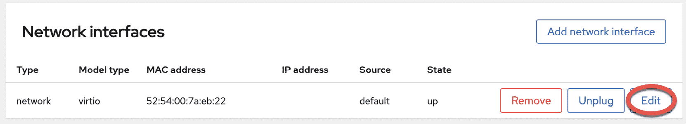
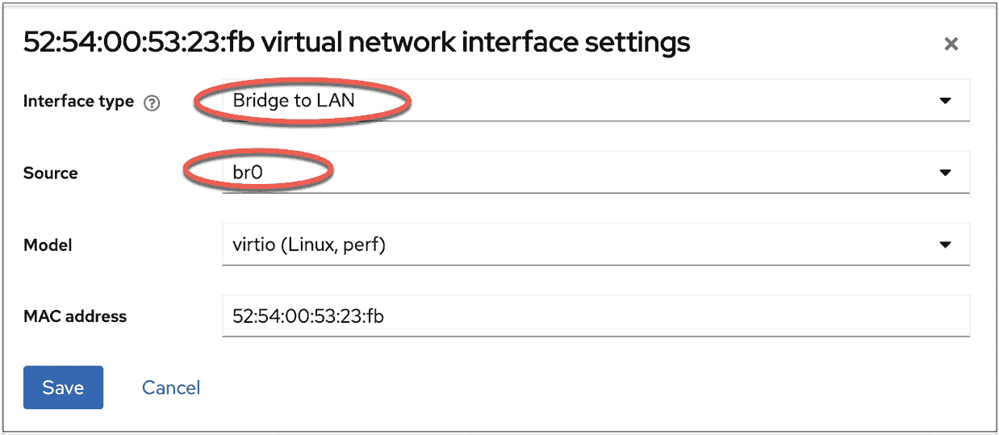
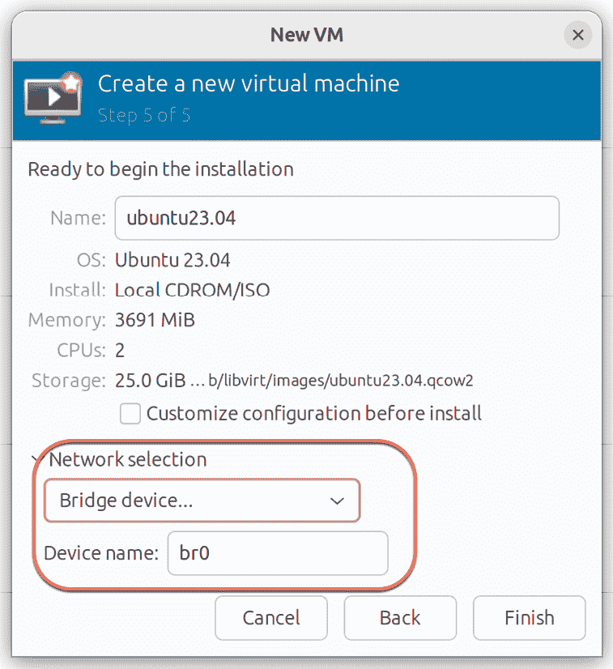
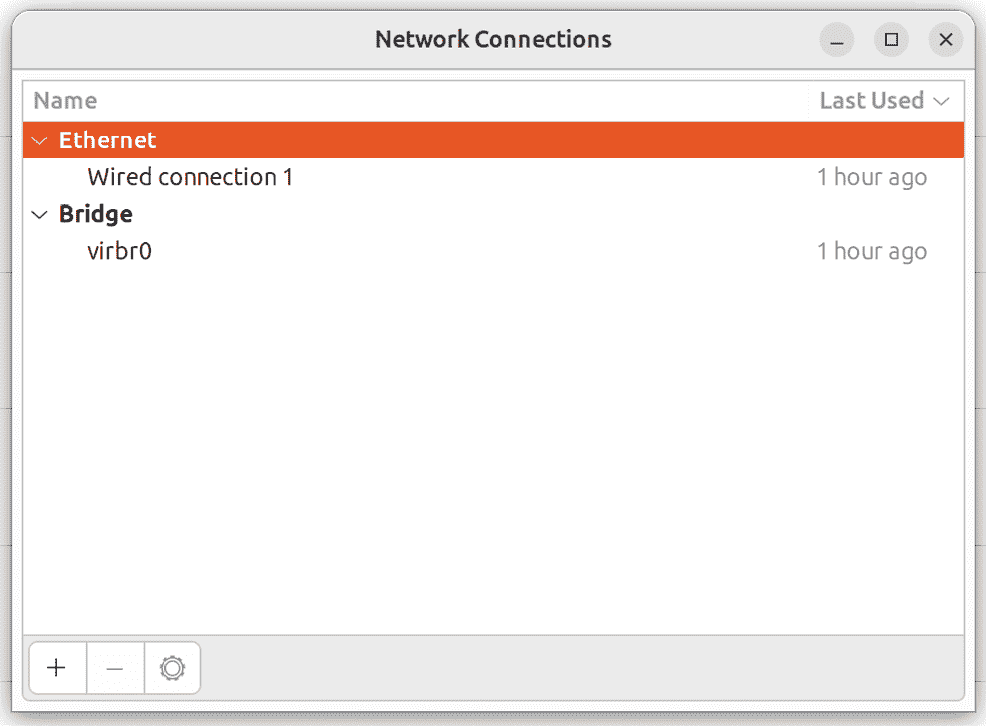
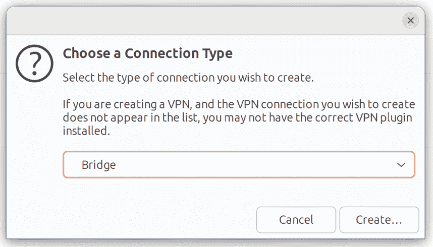
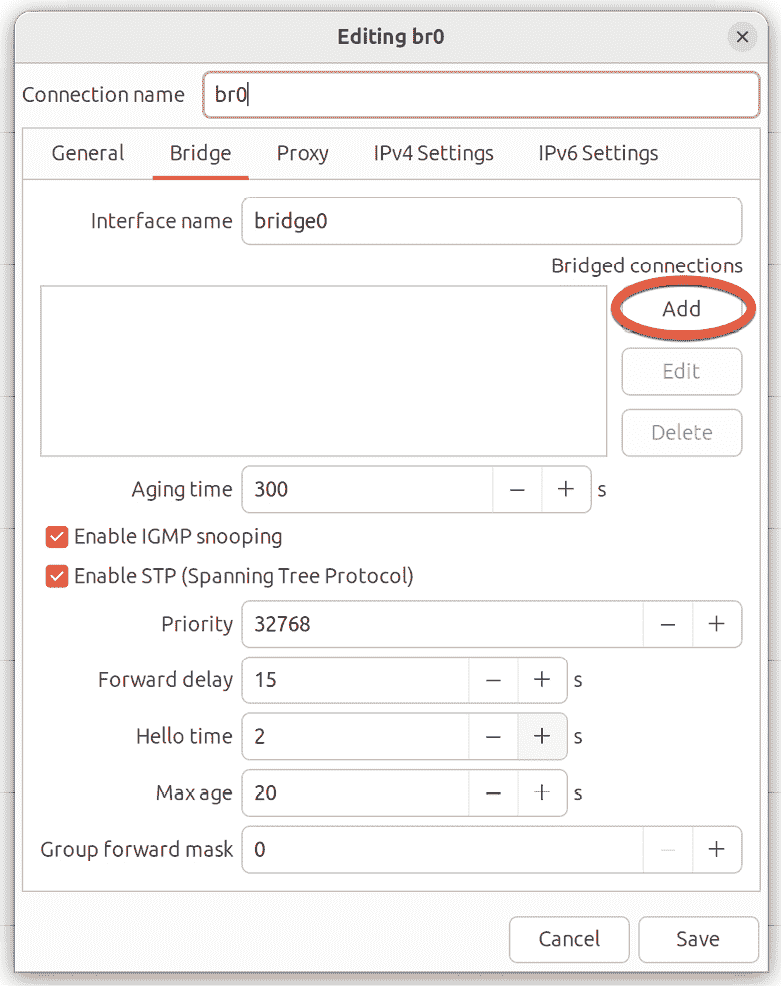
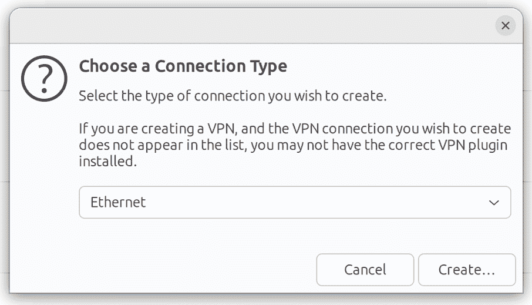
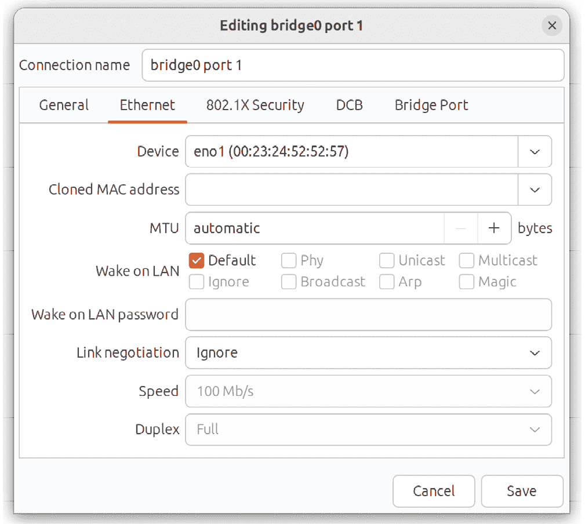
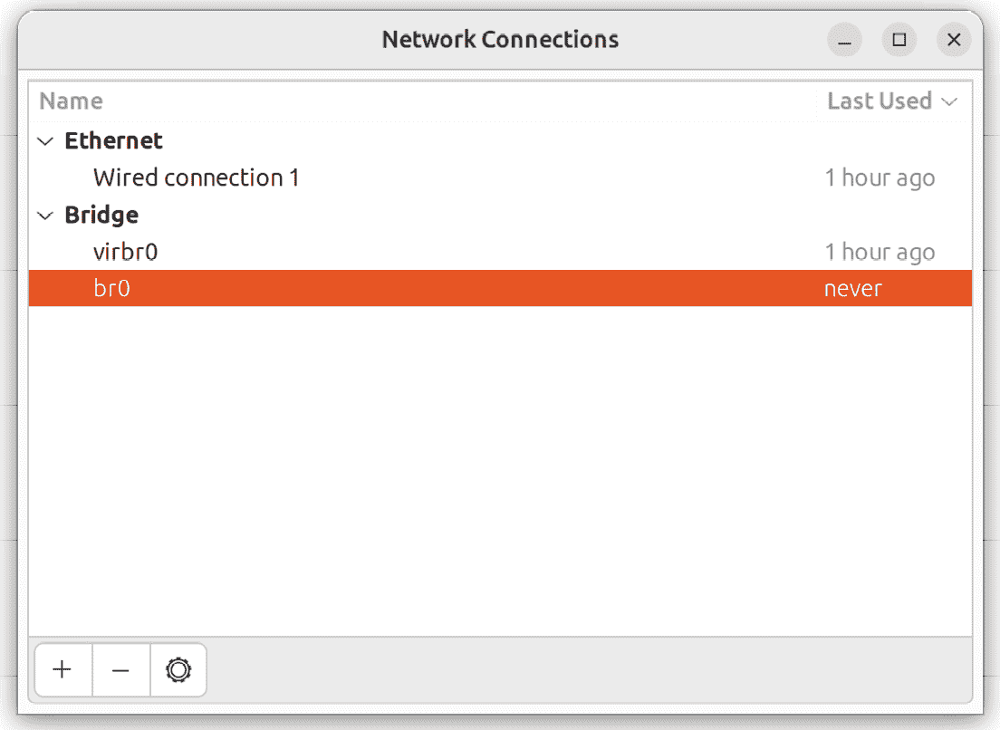

27\. 创建 Ubuntu 23.04 KVM 网络桥接接口

默认情况下，Ubuntu 上的 KVM 虚拟化环境创建了一个虚拟网络，虚拟机可以连接到该网络。也可以使用 MacVTap 驱动程序配置直接连接。然而，正如在名为“虚拟化技术概述”的章节中所述，这种方法不允许主机和客户系统之间进行通信。

本章将介绍在 Ubuntu 上创建网络桥接的步骤，使得客户系统能够共享主机系统的一个或多个物理网络连接，同时仍然允许客户和主机系统之间进行通信。

在本章的其余部分，我们将解释如何为基于 KVM 的客户操作系统配置 Ubuntu 网络桥接。

27.1 获取当前网络管理器设置

可以使用 NetworkManager 命令行工具（nmcli）创建网络桥接。NetworkManager 默认安装并启用在 Ubuntu 系统中，负责检测并连接网络设备，并提供一个管理网络配置的接口。

可以通过以下命令显示当前主机系统上的网络连接列表：

# 第二十七章：nmcli con show

NAME UUID TYPE DEVICE

Wired connection 1 daae7adc-2a52-3fa0-9085-25748531e1b6 ethernet eno1

virbr0 299e0d95-4f39-4e65-aace-c7abbd8b018d bridge virbr0

vnet2 bcb3cd6e-dae4-4545-b98b-e8f90c86dadb tun vnet2

上面的输出显示，主机通过名为 eno1 的设备和名为 virbr0 的默认桥接接口建立了以太网网络连接，该桥接接口提供对 KVM 客户系统默认连接的基于 NAT 的虚拟网络的访问。

同样，以下命令可用于识别当前在系统上配置的设备（包括虚拟和物理设备）：

# nmcli device show

GENERAL.DEVICE: eno1

GENERAL.TYPE: ethernet

GENERAL.HWADDR: 00:23:24:52:52:57

GENERAL.MTU: 1500

GENERAL.STATE: 100 (connected)

GENERAL.CONNECTION: Wired connection 1

GENERAL.CON-PATH: /org/freedesktop/NetworkManager/ActiveC>

WIRED-PROPERTIES.CARRIER: on

IP4.ADDRESS[1]: 192.168.86.39/24

IP4.GATEWAY: 192.168.86.1

IP4.ROUTE[1]: dst = 169.254.0.0/16, nh = 0.0.0.0, mt >

IP4.ROUTE[2]: dst = 192.168.86.0/24, nh = 0.0.0.0, mt>

IP4.ROUTE[3]: dst = 0.0.0.0/0, nh = 192.168.86.1, mt >

IP4.DNS[1]: 192.168.86.1

IP4.DOMAIN[1]: lan

IP6.ADDRESS[1]: fda8:b48c:1079:0:5f:670e:a693:9ae2/64

IP6.ADDRESS[2]: fda8:b48c:1079:0:c734:89bd:8384:992d/64

IP6.ADDRESS[3]: fda8:b48c:1079:0:ec7b:35d8:8253:3739/64

IP6.ADDRESS[4]: fe80::1e40:b04c:3de4:5fe0/64

IP6.GATEWAY: --

IP6.ROUTE[1]: dst = fda8:b48c:1079::/64, nh = ::, mt >

IP6.ROUTE[2]: dst = fe80::/64, nh = ::, mt = 1024

IP6.ROUTE[3]: dst = fd56:6a14:af59:1::/64, nh = fe80:>

GENERAL.DEVICE: virbr0

GENERAL.TYPE: bridge

GENERAL.HWADDR: 52:54:00:00:A8:CA

GENERAL.MTU: 1500

GENERAL.STATE: 100 (connected (externally))

GENERAL.CONNECTION: virbr0

GENERAL.CON-PATH: /org/freedesktop/NetworkManager/ActiveC>

IP4.ADDRESS[1]: 192.168.122.1/24

IP4.GATEWAY: --

IP4.ROUTE[1]: dst = 192.168.122.0/24, nh = 0.0.0.0, m>

IP6.GATEWAY: --

.

.

上面的部分输出表示执行命令的主机系统包含一个物理以太网设备（eno1）和一个虚拟桥接（virbr0）。

virsh 命令还可以用于列出当前系统上配置的虚拟网络：

# virsh net-list --all

名称 状态 自动启动 持久化

----------------------------------------------------------

默认 激活 是 是

当前，唯一存在的虚拟网络是 virbr0 提供的默认网络。现在已经获得了一些当前网络配置的基本信息，接下来的步骤是创建一个连接到物理网络设备的网络桥接（此例中为 eno1）。

27.2 从命令行创建网络管理桥接

创建网络桥接的第一步是将新连接添加到配置中。这可以通过使用 nmcli 工具来完成，指定该连接为桥接，并为连接和接口提供名称：

# nmcli con add ifname br0 type bridge con-name br0

一旦连接已添加，需在物理设备 eno1（从设备）和桥接连接 br0（主设备）之间建立一个桥接从接口，命令如下：

# nmcli con add type bridge-slave ifname eno1 master br0

此时，NetworkManager 连接列表应如下所示：

# nmcli con show

br0 8680c281-6d49-4f76-93b1-902c42514ca5 桥接 br0

有线连接 1 126ab0e8-d4d3-3326-bd5e-1fea169c5635 以太网 eno1

virbr0 556042d4-2e5d-45fe-9c78-a24259e07265 桥接 virbr0

bridge-slave-eno1 e6ba8ead-8fa9-4434-a884-d39225ecda20 以太网 --

接下来的步骤是启动桥接接口。如果通过网络连接（即通过 SSH）进行桥接配置，这一步可能会有问题，因为必须先关闭当前的“有线连接 1”连接，才能启动桥接连接。这意味着在桥接连接启用并替代当前连接之前，现有连接将会丢失，可能导致无法访问远程主机。

如果你是远程访问主机系统，可以通过创建一个 shell 脚本来执行网络更改，从而避免此问题。这样可以确保在“有线连接 1”接口被关闭后，桥接接口会启用，允许你在更改完成后重新连接到主机。首先创建一个名为 bridge.sh 的 shell 脚本文件，包含以下命令：

#!/bin/bash

nmcli con down "Wired connection 1"

nmcli con up br0

脚本创建完成后，可以按如下方式执行：

# sh ./bridge.sh

当脚本执行时，当"有线连接 1"连接被断开时，连接将会丢失。然而，等待几秒钟后，一旦 br0 连接被激活，就应该能够重新连接到主机。请注意，在某些情况下，桥接接口可能会分配与系统先前分配的不同 IP 地址。尝试通过 ssh 重新连接时请牢记这一点。

如果你在本地主机上工作，这两个`nmcli`命令可以在终端窗口中运行，而不必担心失去连接：

# nmcli con down "有线连接 1"

# nmcli con up br0

一旦桥接启动并运行，连接列表现在应该包括桥接连接和桥接从属连接：

# nmcli con show

NAME UUID TYPE DEVICE

br0 8680c281-6d49-4f76-93b1-902c42514ca5 bridge br0

virbr0 556042d4-2e5d-45fe-9c78-a24259e07265 bridge virbr0

bridge-slave-eno1 e6ba8ead-8fa9-4434-a884-d39225ecda20 ethernet eno1

有线连接 1 126ab0e8-d4d3-3326-bd5e-1fea169c5635 ethernet --

请注意，"有线连接 1" 连接仍然列出，但不再处于活动状态。要在请求列表时排除非活动连接，请使用`--active`标志：

# nmcli con show --active

NAME UUID TYPE DEVICE

br0 8680c281-6d49-4f76-93b1-902c42514ca5 bridge br0

virbr0 556042d4-2e5d-45fe-9c78-a24259e07265 bridge virbr0

bridge-slave-eno1 e6ba8ead-8fa9-4434-a884-d39225ecda20 ethernet eno1

27.3 声明 KVM 桥接网络

目前，桥接连接已在系统中，但在 KVM 环境中不可见。运行`virsh`命令时，仍然会将默认网络列为唯一可用的网络选项：

# virsh net-list --all

Name State Autostart Persistent

----------------------------------------------------------

default active yes yes

在虚拟机可以使用桥接之前，必须声明并将其添加到 KVM 网络配置中。这涉及创建一个定义文件，并再次使用`virsh`命令行工具。

首先创建一个名为`bridge.xml`的桥接网络定义文件，其内容如下：

<network>

<name>br0</name>

<forward mode="bridge"/>

<bridge name="br0" />

</network>

接下来，使用该文件来定义新网络：

# virsh net-define ./bridge.xml

定义网络后，启动它，并在需要时配置其在每次系统重启时自动启动：

# virsh net-start br0

# virsh net-autostart br0

再次列出网络，验证桥接网络现在在 KVM 环境中可访问：

# virsh net-list --all

Name State Autostart Persistent

----------------------------------------------------------

br0 active yes yes

default active yes yes

27.4 在虚拟机中使用桥接网络

要创建一个使用桥接网络的虚拟机，可以使用`virt-install --network`选项并指定 br0 桥接名称。例如：

# virt-install --name demo_vm_guest --memory 1024 --disk path=/tmp/demo_vm_guest.img,size=10 --network network=br0 --cdrom /home/demo/ubuntu-23.04-desktop-amd64.iso

当客户操作系统运行时，它将出现在与主机系统相同的物理网络中，而不再处于基于 NAT 的虚拟网络中。

也可以通过编辑虚拟机，在 Cockpit 界面内选择桥接网络，找到网络接口部分，点击如图 27-1 所示的编辑按钮：

图 27-1

在结果界面的设置对话框中，将接口类型菜单更改为“桥接到 LAN”，并将源设置为 br0，如图 27-2 所示：

图 27-2

类似地，使用 virt-manager 工具创建新的虚拟机时，桥接网络将出现在网络选择菜单中：

图 27-3

要修改现有虚拟机以使用桥接网络，使用 virsh edit 命令。该命令将加载 XML 定义文件到编辑器中，在那里可以进行更改并保存：

# virsh edit GuestName

默认情况下，文件将加载到 vi 编辑器中。要使用其他编辑器，可以更改 $EDITOR 环境变量，例如：

# export EDITOR=gedit

要从默认虚拟网络更改，找到文件中的 <interface> 部分，对于基于 NAT 的配置，它将如下所示：

<interface type='network'>

<mac address='<your mac address here>'/>

<source network='default'/>

<model type='virtio'/>

<address type='pci' domain='0x0000' bus='0x01' slot='0x00' function='0x0'/>

</interface>

或者，如果虚拟机使用的是直接连接，条目可能如下所示：

<interface type='direct'>

<mac address='<your mac address here>'/>

<source dev='eno1' mode='vepa'/>

<model type='virtio'/>

<address type='pci' domain='0x0000' bus='0x01' slot='0x00' function='0x0'/>

要使用桥接网络，在保存文件之前，将源网络属性更改为如下所示：

<interface type='network'>

<mac address='<your mac address here>'/>

<source network='br0'/>

<model type='virtio'/>

<address type='pci' domain='0x0000' bus='0x01' slot='0x00' function='0x0'/>

</interface>

如果虚拟机已经在运行，变更将在重启后生效。

27.5 使用 nm-connection-editor 创建桥接网络

如果主机系统上可以进行本地或远程桌面访问，那么大部分桥接配置过程可以使用 nm-connection-editor 图形工具来完成。要使用此工具，可以在桌面中打开终端窗口并输入以下命令：

# nm-connection-editor

当工具加载完成后，将出现图 27-4 中所示的窗口，列出当前配置的网络连接（实际上与执行 `nmcli con show` 命令的输出相同）：

图 27-4

要创建一个新的连接，请点击窗口左下角的‘+’按钮。然后，在弹出的对话框中（图 27-5），从菜单中选择 Bridge 选项：

图 27-5

选择 Bridge 选项后，点击创建按钮以进入桥接配置界面。首先将连接和接口名称字段都更改为 br0，然后点击位于桥接连接列表右侧的添加按钮，如图 27-6 所示：

图 27-6

在连接类型对话框中（图 27-7），将菜单设置更改为 Ethernet，然后点击创建按钮：

图 27-7

现在会弹出另一个对话框，需在此对话框中配置桥接从属连接。在此对话框中，从设备菜单中选择桥接要连接的物理网络（例如 eno1）：

图 27-8

点击保存按钮以应用更改，并返回到编辑 br0 对话框（如上所示图 27-6）。在此对话框中，点击保存按钮以创建桥接。返回主窗口后，新创建的桥接和从属连接应列出在其中：

图 27-9

只需关闭原来的“Wired connection 1”连接，然后按照前一章节中描述的步骤启动 br0 连接（如果主机是远程访问的，记得在 shell 脚本中执行这些步骤）：

# nmcli con down "Wired connection 1"

# nmcli con up br0

同时，如同使用命令行工具创建桥接时所做的那样，还需要将该桥接添加到 KVM 网络配置中。为此，请重复上述“声明 KVM 桥接网络”部分中的步骤。完成此步骤后，桥接已准备好供来宾虚拟机使用。

27.6 小结

默认情况下，KVM 虚拟机连接到一个虚拟网络，该网络使用 NAT 提供对主机系统所连接网络的访问。如果要求来宾使用自己的 IP 地址出现在网络中，则需要将其配置为共享主机系统的物理网络接口。本章介绍了如何使用 nmcli 或 nm-connection-editor 工具创建网络桥接接口来实现这一点。
