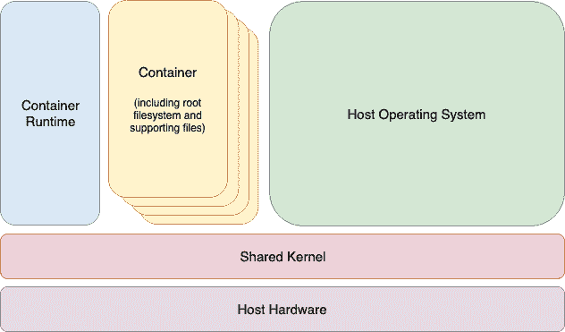

29\. Linux 容器简介

前几章介绍了虚拟化的概念，重点讨论了使用 KVM 创建和管理虚拟机。本章将介绍一种相关的技术——Linux 容器。尽管虚拟机和容器之间有一些相似之处，但本章将概述它们之间的主要区别，并介绍 Linux 容器的概念和优势。本章还将介绍一些 Ubuntu 容器管理工具。掌握了容器的基础知识后，下一章将通过一些实际示例来展示如何在 Ubuntu 上创建和运行容器。

29.1 Linux 容器与内核共享

简单来说，Linux 容器是虚拟化的一种轻量级替代方案。虚拟机包含并运行整个客户操作系统，处于虚拟化环境中。虚拟机则运行在类似于虚拟机管理程序的环境上，该管理程序负责管理对主机系统物理资源的访问。

容器通过使用一种叫做内核共享的概念来工作，这种概念利用了 Linux 和 UNIX 操作系统的架构设计。

要理解内核共享和容器是如何工作的，首先需要了解 Linux 或 UNIX 操作系统的两个主要组件。操作系统的核心是内核。简而言之，内核处理操作系统与物理硬件之间的所有交互。第二个关键组件是根文件系统，其中包含操作系统正常运行所需的所有库、文件和工具。利用这一结构，容器每个都有自己的根文件系统，但共享主机操作系统的内核。这个结构在下图的架构图中得到了说明，图 29-1。

这种资源共享得以实现，是因为内核能够动态地将当前的根文件系统（一个叫做“chroot”或“更改根”的概念）切换到不同的根文件系统，而无需重启整个系统。Linux 容器本质上是这一能力的扩展，结合了容器运行时，后者的职责是提供一个接口，用于在主机系统上执行和管理容器。目前有多种容器运行时可供选择，包括 Docker、lxd、containerd 和 CRI-O。

图 29-1

29.2 容器的用途和优势

容器的主要优势在于它们比虚拟化所需的资源开销少得多，这使得在单台服务器上可以同时运行多个容器实例。它们能够根据需求迅速且高效地启动和停止。此外，容器在主机系统上本地运行，提供了虚拟机无法比拟的性能水平。

容器还具有高度的可移植性，可以轻松地在系统之间迁移。结合 Docker、OpenShift 和 Kubernetes 等容器管理系统，能够在跨多个服务器和云平台的大规模环境中部署和管理容器，甚至可以运行成千上万的容器。

容器常用于为应用程序创建轻量级的执行环境。在这种情况下，每个容器提供一个独立的环境，包含应用程序及其运行所需的所有运行时和支持文件。然后，该容器可以部署到任何其他支持容器执行的兼容主机系统，并且不必担心目标系统可能没有为应用程序配置必要的运行时环境——所有应用程序的依赖项都已包含在容器中。

容器在弥合开发与生产环境之间的差距时也非常有帮助。通过在容器中进行开发和质量保证工作，可以将容器传递给生产环境并安全启动，因为应用程序运行在与开发和测试时相同的容器环境中。

容器还促进了大规模复杂解决方案的模块化部署方法。与其将应用程序开发为单一的庞大实体，不如使用容器将应用程序设计为多个相互作用的模块组，每个模块运行在一个独立的容器中。

容器的一个潜在缺点是，客体操作系统必须与共享的内核版本兼容。例如，无法在 Linux 系统中运行 Microsoft Windows 容器。也无法让为 2.6 版本内核设计的 Linux 客户系统共享 2.4 版本的内核。然而，这些要求并不是容器设计的初衷。这些限制不应被视为缺点，而应被看作是容器在提供简单、可扩展和可靠的部署平台方面的关键优势。

29.3 Ubuntu 容器工具

Ubuntu 提供了若干工具来创建、检查和管理容器。主要工具如下：

•buildah – 一个用于构建容器镜像的命令行工具。

•podman – 一个基于命令行的容器运行时和管理工具，执行诸如从远程仓库下载容器镜像以及检查、启动和停止镜像等任务。

•skopeo – 一个命令行工具，用于转换容器镜像、在镜像仓库之间复制镜像以及检查存储在仓库中的镜像，无需下载镜像。

•runc – 一个轻量级的容器运行时，用于从命令行启动和运行容器。

•OpenShift – 一个企业级的容器应用程序管理平台，包含命令行工具和基于 Web 的工具。

上述所有工具都符合开放容器倡议（OCI），这是一个旨在确保容器在竞争工具和平台之间遵循相同标准的规范集合。

29.4 Ubuntu Docker 注册表

尽管 Ubuntu 提供了一套旨在替代 Docker 提供的工具，这些工具在构建容器时仍需要访问 Ubuntu 镜像。为此，Ubuntu 团队在 Docker Hub 中维护了一套 Ubuntu 容器镜像。Docker Hub 是一个由多个仓库组成的在线容器注册表，每个仓库包含可供下载的各种容器镜像，以便在构建容器时使用。仓库中的镜像每个都被分配一个仓库标签（例如 21.04、20.10、23.04、latest 等），可以在执行镜像下载时引用。以下是 Docker Hub 中包含的 Ubuntu 23.04 镜像的 URL：

docker://docker.io/library/ubuntu:23.04

除了从 Docker 和其他第三方主机注册表下载（在容器术语中称为“拉取”）容器镜像外，您还可以使用注册表存储自己的镜像。这可以通过托管您自己的注册表来实现，或者利用现有的服务，例如 Docker、Amazon AWS、Google Cloud、Microsoft Azure 和 IBM Cloud 提供的服务，当然，还有许多其他选择。

29.5 容器网络

默认情况下，容器通过容器网络接口（CNI）桥接网络堆栈连接到网络。在桥接配置中，运行在服务器上的所有容器都属于同一个子网，因此它们可以相互通信。容器还通过桥接主机系统的网络连接连接到外部网络。同样，主机可以通过虚拟网络接口（通常命名为 podman0）访问容器，该接口已作为容器工具安装的一部分创建。

29.6 总结

Linux 容器提供了虚拟化的轻量级替代方案，并利用 Linux 和 Unix 操作系统的结构。Linux 容器共享主机操作系统的内核，每个容器都有自己的根文件系统，其中包含文件、库和应用程序。因此，容器具有高度的效率和可扩展性，并提供了一个理想的平台，用于构建和部署模块化的企业级解决方案。此外，还有多种工具和平台可用于构建、部署和管理容器，包括第三方解决方案以及 Ubuntu 提供的工具。
