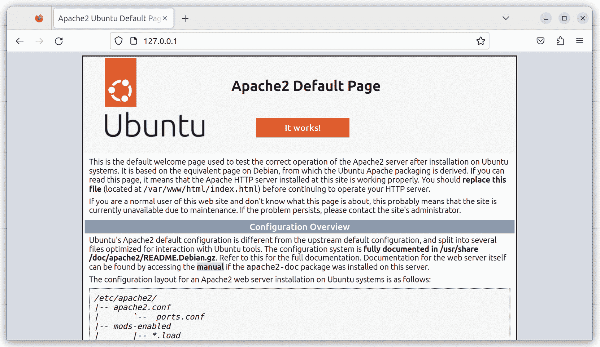
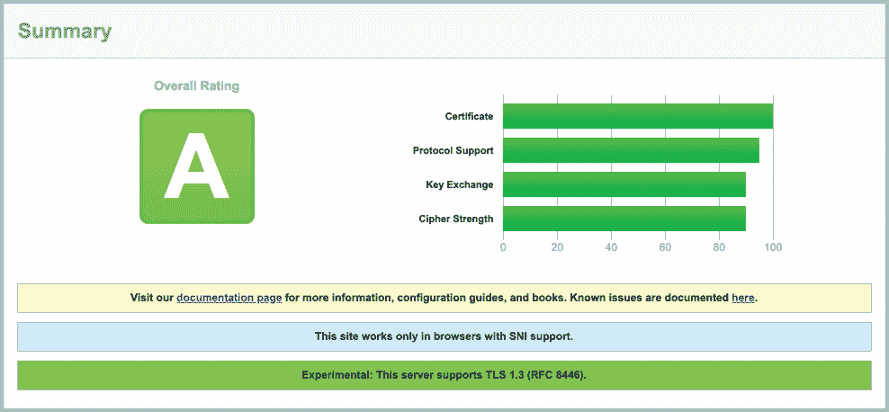
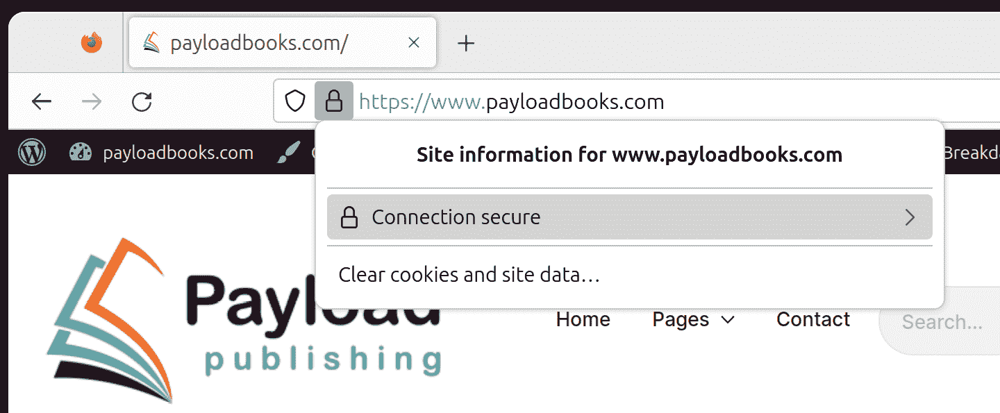

31\. 设置 Ubuntu 23.04 网页服务器

Apache 网页服务器是构成 Ubuntu 操作系统的许多软件包之一。Ubuntu 的可扩展性和韧性使其成为托管最繁忙网站的理想平台。

本章将解释如何使用 Apache 配置 Ubuntu 系统作为网页服务器，包括安全（HTTPS）和不安全（HTTP）配置。

31.1 配置 Ubuntu 网页服务器的要求

要设置您自己的网站，您需要一台计算机（或云服务器实例）、操作系统、网页服务器、域名、名称服务器和 IP 地址。

如前所述，Ubuntu 支持 Apache 网页服务器，一旦操作系统启动并运行，Apache 就可以轻松安装。此外，您可以通过任何域名注册服务注册域名。

如果您在云实例上运行 Ubuntu，提供商分配的 IP 地址将在服务器概述信息中列出。然而，如果您托管自己的服务器并且互联网服务提供商（ISP）分配了静态 IP 地址，您必须将您的域名与该地址关联。这是通过使用名称服务器来实现的，所有域名注册服务都会提供此服务。

如果您没有静态 IP 地址（即您的互联网服务提供商（ISP）为您提供一个经常变化的动态地址），您可以使用几种免费的动态 DNS（DDNS 或简称 DynDNS）服务将您的动态 IP 地址映射到您的域名。

一旦您配置了域名和名称服务器，下一步就是安装并配置您的网页服务器。

31.2 安装 Apache 网页服务器软件包

当前版本的 Ubuntu 通常不会默认安装 Apache 网页服务器。要检查服务器是否已经安装，请运行以下命令：

# 第三十一章：apt -qq list apache2

如果 apt 生成类似以下的输出，则表示 Apache 服务器已经安装：

apache2/lunar,now 2.4.55-1ubuntu2 amd64 [已安装]

如果 apt 输出中没有列出该软件包或没有包含[已安装]状态，请在命令提示符下运行以下命令以进行 Apache 安装：

# apt install apache2

31.3 配置防火墙

在启动和测试 Apache 网页服务器之前，防火墙需要修改，以允许网页服务器与外部通信。默认情况下，HTTP 和 HTTPS 协议分别使用 80 和 443 端口，因此，根据使用的协议，可能需要打开其中一个或两个端口。如果您的 Ubuntu 系统受到 Uncomplicated Firewall（UFW）的保护，可以使用以下命令仅启用不安全的网页流量（HTTP）：

# ufw 允许 Apache

仅启用安全（HTTPS）流量：

# ufw 允许 'Apache Secure'

或者，可以按照以下步骤同时启用安全和不安全的网页流量：

# ufw 允许 'Apache Full'

如果您使用的是 firewalld，可以使用以下命令打开 HTTP 和 HTTPS 端口。在打开端口时，请务必指定适用于面向互联网的网络连接的防火墙区域：

# firewall-cmd --permanent --zone=<zone> --add-port=80/tcp

# firewall-cmd --permanent --zone=<zone> --add-port=443/tcp

打开必要的端口后，务必重新加载防火墙设置：

# firewall-cmd --reload

在云托管服务器上，可能还需要在云控制台中为服务器实例启用相应的端口。请查阅云提供商的文档了解操作步骤。

31.4 端口转发

假设承载 web 服务器的 Ubuntu 系统位于一个由防火墙保护的网络中（防火墙运行在另一台计算机上，或者是具有内建防火墙保护的路由器或无线基站）。在这种情况下，您必须配置防火墙将端口 80 和 443 转发到您的 web 服务器系统。执行此操作的机制在不同的防火墙和设备之间有所不同，因此请查阅文档以了解如何配置端口转发。

31.5 启动 Apache Web 服务器

一旦安装了 Apache 服务器并配置了防火墙，下一步是验证服务器是否在运行，并在必要时启动它。

要检查 Apache 服务的状态，可以在命令提示符下输入以下命令：

# systemctl status apache2

如果上述命令显示 apache2 服务未运行，可以通过命令行启动它，如下所示：

# systemctl start apache2

如果希望 Apache httpd 服务在系统启动时自动启动，请运行以下命令：

# systemctl enable apache2

31.6 测试 Web 服务器

安装完成后，下一步是验证 web 服务器是否正在运行。

如果您可以访问服务器的桌面环境（无论是本地还是远程），请启动 Web 浏览器并在地址栏输入 http://127.0.0.1（127.0.0.1 是回环网络地址，指示系统连接到本地计算机）。如果一切设置正确，浏览器应加载 图 31-1 中显示的测试页面：

图 31-1

如果桌面环境不可用，请从与服务器位于同一局域网的另一台系统连接，或者如果服务器托管在远程位置，则使用分配给系统的外部 IP 地址。

31.7 配置 Apache Web 服务器以适应您的域名

设置 Web 服务器的下一步是为你的域名配置它。首先进入 /etc/apache2 目录，该目录包含多个文件和子目录。主要配置文件名为 apache2.conf，它作为组织位于子目录中的模块化配置文件的中心点。例如，apache2.conf 文件包括一行，导入位于 sites-enabled 文件夹中的配置设置：

# 包括虚拟主机配置：

IncludeOptional sites-enabled/*.conf

类似地，apache2.conf 文件会导入 ports.conf 文件，该文件定义了 Apache 服务器监听网络流量的端口。

要在 Ubuntu 上配置网站域名，首先进入 /etc/apache2 目录。在此目录中，你会找到两个子目录，sites-available 和 sites-enabled。进入 sites-available 目录。在该目录下，你将找到一个默认文件，可作为你自己网站的模板。

将默认文件复制到一个新文件中，文件名应与您的域名匹配。例如：

# cp 000-default.conf myexample.conf

使用你喜欢的编辑器编辑你的 myexample.com 文件，它将显示如下：

<VirtualHost *:80>

# ServerName 指令设置请求方案、主机名和端口

# 服务器用来识别自己的。这在创建时使用

# 重定向 URL。在虚拟主机的上下文中，ServerName

# 指定请求的 Host: 头部中必须出现的主机名

# 匹配此虚拟主机。对于默认虚拟主机（此文件），

# 该值并不决定性，因为它作为最后的备用主机使用。

# 然而，你必须为任何进一步的虚拟主机显式设置它。

#ServerName www.example.com

ServerAdmin webmaster@localhost

DocumentRoot /var/www/html

# 可用的日志级别：trace8，...，trace1，debug，info，notice，warn，

# 错误，严重，警报，紧急。

# 也可以为特定的模块配置日志级别

# 模块，例如：

#LogLevel info ssl:warn

ErrorLog ${APACHE_LOG_DIR}/error.log

CustomLog ${APACHE_LOG_DIR}/access.log combined

# 对于来自 conf-available/ 的大多数配置文件，它们是

# 无论全局启用还是禁用，都可以

# 为特定虚拟主机包含一行。例如：

# 以下行仅为此主机启用 CGI 配置

# 在通过 “a2disconf” 全局禁用后

#Include conf-available/serve-cgi-bin.conf

</VirtualHost>

ServerAdmin 指令定义了一个管理员电子邮件地址，供希望联系你网站管理员的人使用。将此地址更改为一个适当的电子邮件地址，以便他人可以联系到你：

ServerAdmin webmaster@myexample.com

接下来，需要取消 ServerName 指令的注释（也就是说，去掉 ‘#’ 字符前缀）并进行定义，以便 Web 服务器知道这个配置文件指的是哪个虚拟主机：

ServerName myexample.com

在下一阶段，我们需要使用 DocumentRoot 指令定义网站文件的位置。传统上，使用 /var/www/domain-name：

DocumentRoot /var/www/myexample.com

完成更改后，我们需要启用该站点，方法如下：

# a2ensite myexample.conf

该命令在 sites-available 目录中的 myexample.conf 文件和 sites-enabled 文件夹之间创建一个符号链接。

启用站点后，运行以下命令来禁用默认测试站点：

# a2dissite 000-default.conf

接下来，创建 /var/www/myexample.com 目录，并在其中放置一个 index.html 文件。例如：

<html>

<title>示例网页</title>

<body>

欢迎来到 MyExample.com

</body>

</html>

进行这些更改后，运行 apache2ctl 命令来检查配置文件是否存在错误：

# apache2ctl configtest

语法正确

如果没有报告错误，重新加载 Apache web 服务器，确保其加载我们新的设置：

# systemctl reload apache2

最后，通过打开浏览器窗口并使用域名而非 IP 地址访问该站点来检查服务器配置是否有效。加载的网页应该是上面创建的 index.html 文件中定义的内容。

31.8 安全网站基础知识

本章中创建的 web 服务器和网站使用 HTTP 协议并通过 80 端口进行通信，因此被认为是不安全的。问题在于 web 服务器与客户端（通常是用户的 web 浏览器）之间的流量是明文传输的。换句话说，数据是未加密的，容易被拦截。虽然对于一般的网页浏览来说这不是问题，但在执行如登录网站或传输敏感信息（如身份信息或信用卡细节）等任务时，这种问题就变得非常严重。

现在，网站通常要求使用 HTTPS，它通过使用安全套接字层（SSL）或传输层安全性（TLS）来建立 web 服务器与客户端之间的安全加密通信。这种安全性是通过公钥、私钥、会话加密和证书的组合来实现的。

要支持 HTTPS，网站必须拥有由受信任的证书颁发机构（CA）颁发的证书。当浏览器连接到安全网站时，web 服务器会返回一个网站的 SSL 证书副本，其中也包含网站的公钥副本。浏览器随后会与受信任的证书颁发机构一起验证证书的真实性。

如果证书有效，浏览器将使用服务器发送的公钥来加密会话密钥并将其传递给服务器。服务器使用私钥解密会话密钥，并向浏览器发送加密的确认信息。完成此过程后，浏览器和服务器将使用会话密钥加密所有后续的数据传输，直到会话结束。

31.9 配置 Apache 以支持 HTTPS

默认情况下，Apache 服务器不包括实现安全 HTTPS 网站所需的模块。因此，第一步是按照以下步骤在服务器系统上启用 Apache mod_ssl 模块：

# a2enmod ssl

安装完成后，重启 apache2 以加载新模块到 Apache 服务器中：

# systemctl restart apache2

使用以下命令检查模块是否已加载到服务器中：

# apache2ctl -M | grep ssl_module

ssl_module（共享）

一旦安装了 ssl 模块，请重复本章前一部分中的步骤，为网站创建配置文件，这次使用 sites-available/default-ssl.conf 文件作为站点配置文件的模板。

假设模块已安装，下一步是为网站生成 SSL 证书。

31.10 获取 SSL 证书

网站的证书必须从证书颁发机构（CA）获得。有多种选择，价格也各异。然而，最好的选择是从 Let’s Encrypt 获取免费的证书，网址如下：

[`letsencrypt.org/`](https://letsencrypt.org/)

从 Let’s Encrypt 获取证书需要安装并运行 Certbot 工具。该工具会扫描服务器上的 Apache 配置文件，并提供为系统上配置的任何虚拟主机生成证书的选项。然后，它会生成证书，并将虚拟主机条目添加到 Apache 配置文件中，以适应相应的网站。

按照 Let’s Encrypt 网站上的步骤，在您的 Ubuntu 系统上下载并安装 Certbot，然后按如下方式运行 certbot 工具以生成并安装证书：

# certbot --apache

在请求电子邮件地址并寻求服务条款同意后，Certbot 会列出在 httpd.conf 文件中找到的域名，并允许选择一个或多个网站以安装证书。然后，Certbot 会执行一些检查，然后获取并安装证书到系统中：

您希望为哪些名称启用 HTTPS？

- - - - - - - - - - - - - - - - - - - - - - - - - - - - - - - - - - - - - - - -

1: www.myexample.com

- - - - - - - - - - - - - - - - - - - - - - - - - - - - - - - - - - - - - - - -

选择适当的数字，数字之间用逗号和/或空格分隔，或保持输入为空

按空白键选择所有显示的选项（按 ‘c’ 取消）：1

正在获取新证书

执行以下挑战：

http-01 挑战 for www.myexample.com

等待验证...

清理挑战

在 /etc/httpd/conf/httpd-le-ssl.conf 创建了一个 SSL 虚拟主机

将证书部署到虚拟主机 /etc/httpd/conf/httpd-le-ssl.conf

通过将 Include 添加到根配置文件来启用站点 /etc/httpd/conf/httpd-le-ssl.conf

Certbot 还将在/etc/apache2/sites-available 目录中创建一个名为 myexample-le-ssl.conf 的新文件，该文件包含为每个已生成证书的域名创建的安全虚拟主机条目，并使站点启用，使得该文件的链接出现在/etc/apache2/sites-enabled 目录中。这些条目将类似于以下内容：

<IfModule mod_ssl.c>

<VirtualHost *:443>

ServerAdmin feedback@myexample.com

ServerName www.myexample.com

DocumentRoot /var/www/myexample

ErrorLog logs/myexample_error_log

CustomLog logs/myexample_access_log combined

SSLCertificateFile /etc/letsencrypt/live/www.myexample.com/fullchain.pem

SSLCertificateKeyFile /etc/letsencrypt/live/www.myexample.com/privkey.pem

Include /etc/letsencrypt/options-ssl-apache.conf

</VirtualHost>

</IfModule>

最后，Certbot 将询问是否应该将未来的 HTTP 请求重定向到 HTTPS。换句话说，如果用户尝试访问 http://www.myexample.com，Web 服务器将把用户重定向到 https://www.myexample.com：

请选择是否将 HTTP 流量重定向到 HTTPS，从而移除 HTTP 访问。

- - - - - - - - - - - - - - - - - - - - - - - - - - - - - - - - - - - - - - - -

1: 不重定向 - 不对 Web 服务器配置做任何进一步的更改。

2: 重定向 - 将所有请求重定向到安全的 HTTPS 访问。选择此项进行操作。

新站点，或者如果您确定站点已在 HTTPS 下正常运行，您可以撤销此操作。

通过编辑您的 Web 服务器配置进行更改。

- - - - - - - - - - - - - - - - - - - - - - - - - - - - - - - - - - - - - - - -

选择适当的数字[1-2]然后按[enter]（按‘c’取消）：2

如果您当前正在测试 HTTPS 配置，并且希望在稍后再切换，可以选择“不重定向”选项。否则，通常建议进行 HTTPS 重定向。

证书安装完成后，可以在浏览器中访问以下网址进行测试（将 myexample.com 替换为您的域名）：

[`www.ssllabs.com/ssltest/analyze.html?d=www.myexample.com`](https://www.ssllabs.com/ssltest/analyze.html?d=www.myexample.com)

如果证书配置成功，SSL Labs 报告将提供一个高评分，如图 31-2 所示：

图 31-2

作为最后的测试，打开浏览器窗口，并使用 https://前缀访问您的域名。页面应该像之前一样加载，浏览器应显示浏览器和服务器之间的连接是安全的（通常通过地址栏中的挂锁图标来表示，点击该图标可获取更多信息）：

图 31-3

31.11 总结

一个 Ubuntu 系统可以通过安装 Apache 网络服务器来托管网站。可以在 Ubuntu 上部署不安全的（HTTP）和安全的（HTTPS）网站。安全的网站使用安全套接字层（SSL）或传输层安全性（TLS）来建立加密通信，通过公钥、私钥和会话加密以及由受信任的证书颁发机构签发的证书，在 Web 服务器和客户端之间进行通信。
