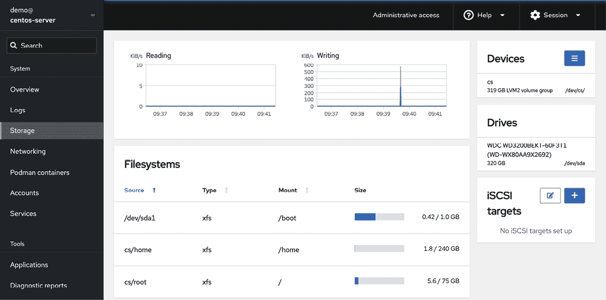

33. 在 Ubuntu 23.04 系统中添加新硬盘驱动器

用户和系统管理员遇到的第一个问题之一是，系统需要更多的磁盘空间来存储数据。幸运的是，磁盘空间现在是最便宜的 IT 商品之一。在本章及下一章中，我们将讨论如何配置 Ubuntu 使用新安装的物理或虚拟磁盘提供的空间。

33.1 挂载的文件系统或逻辑卷

在 Ubuntu 系统上配置新硬盘有两种方式。一种直接的方法是，在新硬盘上创建一个或多个 Linux 分区，在这些分区上创建 Linux 文件系统，然后将它们挂载到特定的挂载点以便访问。本章将介绍这种方法。

另一种方法是将新空间添加到现有的卷组中，或者创建一个新的卷组。当 Ubuntu 安装时，会创建一个名为的卷组。在这个卷组中有三个逻辑卷，分别是 root、home 和 swap，用于存储/和/home 文件系统以及交换分区。我们可以通过将新硬盘配置为卷组的一部分，来增加现有逻辑卷的可用磁盘空间。例如，使用这种方法，我们可以通过将新硬盘上的部分或全部空间分配给 home 卷，来增加/home 文件系统的大小。这个话题将在“向 Ubuntu 23.04 卷组和逻辑卷中添加新磁盘”中详细讨论。

33.2 查找新硬盘

本教程假设已经安装了一个新的物理或虚拟硬盘，并且操作系统可以识别该硬盘。添加后，操作系统应该会自动检测到新硬盘。通常，系统中的磁盘驱动器会被分配以以 hd、sd 或 nvme 开头的设备名称，后面跟一个字母表示设备编号。第一个设备可能是/dev/sda，第二个是/dev/sdb，依此类推。

以下是一个典型系统的输出，系统只连接了一个磁盘驱动器并通过 SATA 控制器连接：

# ls /dev/sd*

/dev/sda /dev/sda1 /dev/sda2

这表明由/dev/sda 表示的硬盘驱动器被分成了两个分区，分别由/dev/sda1 和/dev/sda2 表示。

以下是安装第二块硬盘后，来自相同系统的输出：

# ls /dev/sd*

/dev/sda /dev/sda1 /dev/sda2 /dev/sdb

新的硬盘已被分配到设备文件/dev/sdb。该硬盘没有显示任何分区（因为我们还没有创建分区）。

到此为止，我们可以在新硬盘上创建分区和文件系统，并将其挂载以便访问，或者将硬盘作为物理卷添加到卷组中。如果执行前者，请继续阅读本章；否则，请阅读“向 Ubuntu 23.04 卷组和逻辑卷中添加新磁盘”以了解如何配置逻辑卷。

33.3 创建 Linux 分区

下一步是在新磁盘上创建一个或多个 Linux 分区。这可以通过使用 fdisk 工具来完成，该工具接受要分区的设备作为命令行参数：

# fdisk /dev/sdb

欢迎使用 fdisk（util-linux 2.37.4）。

变更仅会保存在内存中，直到您决定写入它们。

在使用写入命令之前请小心。

设备不包含已识别的分区表。

使用磁盘标识符 0x64d68d00 创建了一个新的 DOS 磁盘标签。

命令（输入 m 获取帮助）：

要查看磁盘当前的分区，请输入 p 命令：

命令（输入 m 获取帮助）：p

磁盘 /dev/sdb：14.46 GiB，15525216256 字节，30322688 扇区

磁盘型号：USB 2.0 FD

单位：1 * 512 = 512 字节

扇区大小（逻辑/物理）：512 字节 / 512 字节

I/O 大小（最小/最佳）：512 字节 / 512 字节

磁盘标签类型：dos

磁盘标识符：0x64d68d00

从上面的 fdisk 输出可以看出，磁盘当前没有分区，因为它之前未使用。下一步是在磁盘上创建一个新分区，可以通过输入 n（表示新分区）和 p（表示主分区）来完成：

命令（输入 m 获取帮助）：n

分区类型

p 主分区（0 个主分区，0 个扩展分区，4 个空闲分区）

e 扩展分区（逻辑分区的容器）

选择（默认 p）：p

分区号（1-4，默认 1）：

在这个例子中，我们只打算创建一个分区，即分区 1。接下来，我们需要指定分区的起始和结束位置。由于这是第一个分区，我们需要它从第一个可用扇区开始，并且由于我们想使用整个磁盘，因此指定最后一个扇区作为结束位置。请注意，如果您希望创建多个分区，可以按扇区、字节、千字节或兆字节来指定每个分区的大小：

分区号（1-4，默认 1）：1

第一个扇区（2048-30322687，默认 2048）：

最后一个扇区，+/- 扇区或 +/- 大小{K,M,G,T,P}（2048-30322687，默认 30322687）：

创建了一个新的 'Linux' 类型的分区 1，大小为 14.5 GiB。

命令（输入 m 获取帮助）：

现在我们已指定分区，接下来需要使用 w 命令将其写入磁盘：

命令（输入 m 获取帮助）：w

分区表已被更改。

正在调用 ioctl() 重新读取分区表。

正在同步磁盘。

如果我们现在再次查看设备，我们会看到新分区以 /dev/sdb1 可见：

# ls /dev/sd*

/dev/sda /dev/sda1 /dev/sda2 /dev/sdb /dev/sdb1

下一步是在新分区上创建文件系统。

33.4 在 Ubuntu 磁盘分区上创建文件系统

我们现在已安装新磁盘，它在 Ubuntu 上可见，我们在磁盘上配置了一个 Linux 分区。接下来的步骤是在该分区上创建一个 Linux 文件系统，以便操作系统可以用它来存储文件和数据。创建文件系统的最简单方法是使用 `mkfs.xfs` 工具：

# apt install xfsprogs

# umount /dev/sdb1

# mkfs.xfs -f /dev/sdb1

meta-data=/dev/sdb1 isize=512 agcount=4, agsize=947520 blks

= sectsz=512 attr=2, projid32bit=1

= crc=1 finobt=1, sparse=1, rmapbt=0

= reflink=1 bigtime=1 inobtcount=1

data = bsize=4096 blocks=3790080, imaxpct=25

= sunit=0 swidth=0 blks

naming =version 2 bsize=4096 ascii-ci=0, ftype=1

log =internal log bsize=4096 blocks=2560, version=2

= sectsz=512 sunit=0 blks, lazy-count=1

realtime =none extsz=4096 blocks=0, rtextents=0

在这种情况下，我们创建了一个 XFS 文件系统。XFS 是一种高性能的文件系统，是 Ubuntu 的默认文件系统类型，并在并行 I/O 性能和日志使用方面具有多个优势。

33.5 日志文件系统概述

日志文件系统在每次磁盘写入过程中都会保持一个日志或记录，记录文件系统的变化，这些日志可以用来快速重建由于系统崩溃或断电等事件导致的文件系统损坏。

使用日志文件系统有几个优点。首先，存储在磁盘驱动器上的数据大小和容量在这些年来已经呈指数增长。非日志文件系统的问题在于，发生崩溃后必须运行 fsck（文件系统一致性检查）工具。fsck 工具会扫描整个文件系统，验证所有条目，并确保块被正确分配和引用。如果它发现损坏的条目，它将尝试修复问题。这里有两个问题。首先，fsck 工具并不总是能够修复损坏，你最终会得到存储在 lost+found 目录中的数据。应用程序使用这些数据，但系统不再知道它来自哪里。另一个问题是时间问题。在一个庞大的文件系统上完成 fsck 过程可能需要很长时间，可能会导致不可接受的停机时间。

另一方面，日志文件系统在每次写入时都会将信息记录到磁盘上的日志区（日志和日志区不必在同一设备上）。这本质上是一个“提交意图”，用于将数据写入文件系统。记录的信息量是可配置的，范围从不记录任何内容到记录所谓的“元数据”（即所有者、日期戳信息等），再到记录“元数据”以及将写入文件的数据块。日志更新后，系统将实际数据写入相应的文件系统区域，并标记一个条目表示数据已提交。

崩溃后，可以使用日志文件迅速将文件系统恢复上线，从而将原本需要几分钟的 fsck 过程缩短为几秒钟，并且大大减少数据丢失或损坏的机会。

33.6 挂载文件系统

现在我们已经在新磁盘的 Linux 分区上创建了新的文件系统，我们需要将其挂载以便访问和使用。为此，我们需要创建一个挂载点。挂载点只是一个目录或文件夹，文件系统将在其中挂载。对于本示例，我们将创建一个/backup 目录，以匹配我们的文件系统标签（尽管这些值不需要匹配）：

# mkdir /backup

然后，文件系统可以通过 mount 命令手动挂载：

# mount /dev/sdb1 /backup

运行不带任何参数的 mount 命令将显示当前挂载的所有文件系统（包括我们新添加的文件系统）：

# mount

proc on /proc type proc (rw,nosuid,nodev,noexec,relatime)

sysfs on /sys type sysfs (rw,nosuid,nodev,noexec,relatime,seclabel)

.

.

/dev/sdb1 on /backup type xfs (rw,relatime,seclabel,attr2,inode64,logbufs=8,logbsize=32k,noquota)

33.7 配置 Ubuntu 自动挂载文件系统

为了设置系统，使新的文件系统在启动时自动挂载，需要在/etc/fstab 文件中添加一条条目。fstab 条目的格式如下：

<device> <dir> <type> <options> <dump> <fsck>

这些条目可以总结如下：

•<device> - 文件系统将被挂载到的设备。

•<dir> - 作为文件系统挂载点的目录。

•<type> - 文件系统类型（如 xfs、ext4 等）

•<options> - 附加的文件系统挂载选项，例如，使文件系统只读或控制是否可以由任何用户挂载文件系统。运行 man mount 查看完整的选项列表。将此值设置为 defaults 将使用文件系统的默认设置（rw, suid, dev, exec, auto, nouser, async）。

•<dump> - 指定文件系统的内容是否应包括在 dump 工具执行的任何备份中。此设置很少使用，可以通过设置为 0 来禁用。  

•<fsck> - 系统崩溃后是否通过 fsck 检查文件系统，以及文件系统检查的顺序。对于像 XFS 这样的日志文件系统，应将其设置为 0，以表示不需要检查。

以下示例展示了一个 fstab 条目，用于自动挂载我们位于/dev/sdb1 分区上的/backup 分区：

/dev/sdb1 /backup xfs defaults 0 0

现在，每次系统重启时，/backup 文件系统将自动挂载。

33.8 使用 Cockpit 添加磁盘

除了使用本章概述的命令行工具进行存储操作外，还可以使用 Cockpit Web 控制台配置新的存储设备。要查看当前的存储配置，请登录 Cockpit 控制台并选择“存储”选项，如图 33-1 所示：

图 33-1

要找到新添加的存储，滚动到存储页面的底部，直到“磁盘”部分出现在视野中（注意，“磁盘”部分也可能位于屏幕的右上角）：

图 33-2

在上面的图示中，新的驱动器是 15.5 GB 的驱动器。选择新驱动器以显示如图 33-3 所示的驱动器界面：

图 33-3

点击创建分区按钮，并使用对话框指定分配给此分区的空间大小、文件系统类型（推荐使用 XFS）、以及可选的标签、文件系统挂载点和挂载选项。请注意，如果新分区没有使用所有可用空间，可以向驱动器添加其他分区。要更改如文件系统是否为只读或是否在启动时挂载等设置，请在挂载选项部分更改设置：

图 33-4

选择好设置后，点击创建分区按钮以提交更改。在创建过程完成后，新的分区将被添加到磁盘中，相应的文件系统将被创建并挂载到指定的挂载点，/etc/fstab 文件也会做出相应的更改。

33.9 小结

本章介绍了如何将物理或虚拟磁盘驱动器添加到现有的 Ubuntu 系统中。这是一个相对简单的过程，确保新驱动器已被操作系统检测到，在驱动器上创建一个或多个分区，然后在这些分区上创建文件系统。虽然 Ubuntu 提供了多种文件系统类型，但通常推荐使用 XFS。一旦文件系统准备好，可以使用 mount 命令将其挂载。为了使新创建的文件系统在系统启动时自动挂载，可以向/etc/fstab 配置文件中添加条目。
