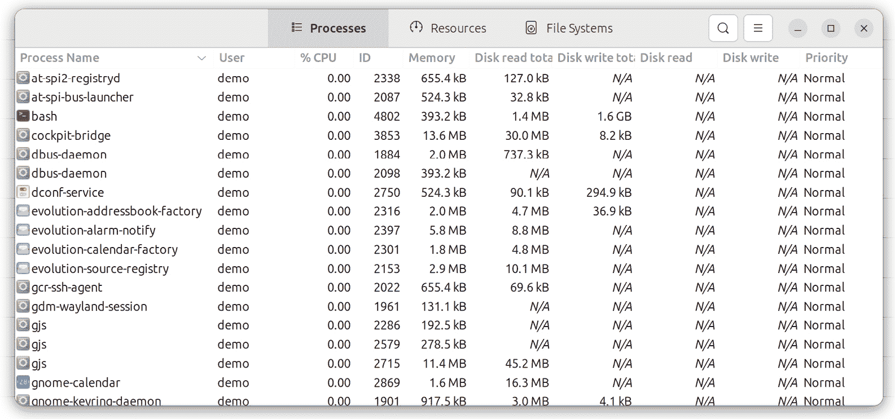
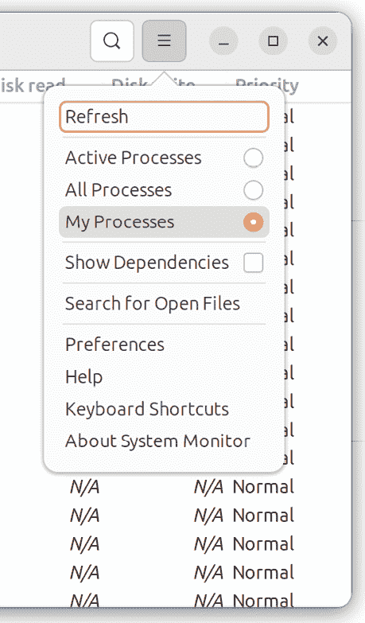
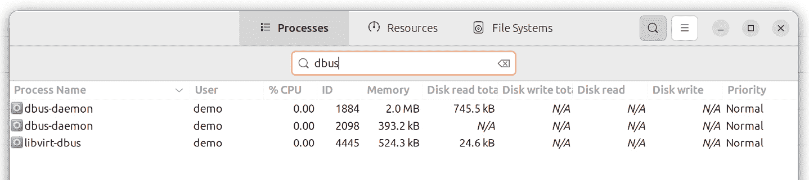
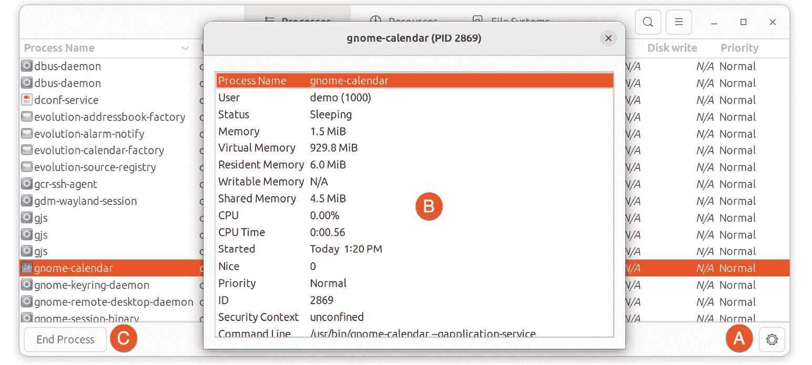
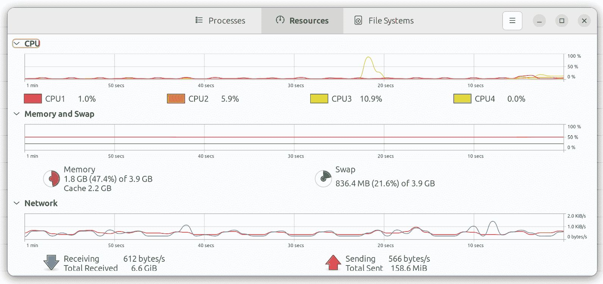
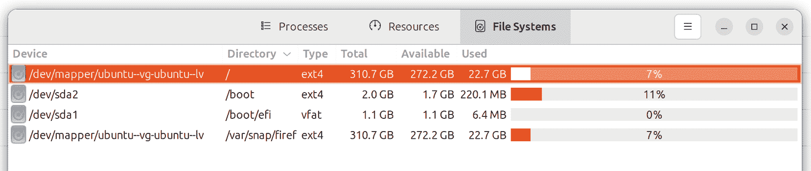
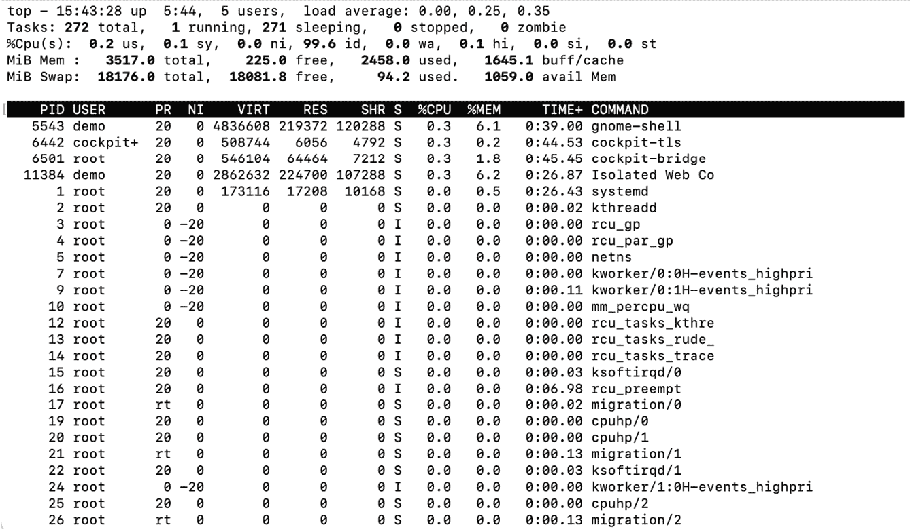
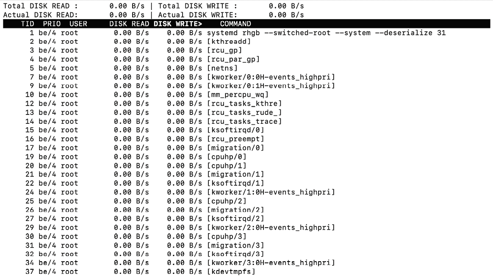

36\. Ubuntu 23.04 系统与进程监控

运行和管理 Ubuntu 系统的一个重要部分是监控系统的总体健康状况，涉及内存、交换、存储和处理器的使用情况。这包括了解如何检查和管理在后台运行的系统和用户进程。本章将介绍一些工具和实用程序，用于监控 Ubuntu 系统上的系统资源和进程。

36.1 管理进程

即使 Ubuntu 系统看起来空闲，许多系统进程仍会在后台悄悄运行，以保持操作系统的正常运作。例如，当你执行命令或启动应用时，用户进程会被启动，并在相关任务完成后停止。

要获取在单个终端或命令提示符会话中当前运行的所有活动用户进程列表，可以使用以下 ps 命令：

$ ps

PID TTY TIME CMD

10395 pts/1 00:00:00 bash

13218 pts/1 00:00:00 ps

ps 命令的输出显示，在当前终端窗口或命令提示符会话中有两个用户进程在运行，一个是输入命令的 bash shell，另一个是 ps 命令本身。

要列出当前用户的所有活动进程，请使用带有 -a 标志的 ps 命令。该命令会列出与用户关联的所有正在运行的进程，无论它们运行在哪个终端窗口（例如，其他终端窗口中运行的进程）：

$ ps -a

PID TTY TIME CMD

5442 tty2 00:00:00 gnome-session-b

6350 pts/0 00:00:00 sudo

6354 pts/0 00:00:00 su

6355 pts/0 00:00:00 bash

9849 pts/2 00:00:00 nano

9850 pts/1 00:00:00 ps

如上面显示的输出所示，用户正在运行与 GNOME 桌面、shell 会话、nano 文本编辑器和 ps 命令相关的进程。

要列出特定用户的进程，请使用带有 -u 标志并跟随用户名的 ps 命令：

# ps -u john

PID TTY TIME CMD

914 ? 00:00:00 systemd

915 ? 00:00:00 (sd-pam)

970 ? 00:00:00 gnome-keyring-d

974 tty1 00:00:00 gdm-x-session

.

.

注意，每个进程都会被分配一个唯一的进程 ID，可以通过发送终止（TERM）信号来停止该进程，例如使用 kill 命令。例如：

$ kill 13217

使用 TERM 信号结束进程的优点是，它允许进程优雅地退出，可能会保存原本会丢失的数据。

如果标准的终止信号无法终止进程，可以重复执行带有 -9 选项的 kill 命令。该命令会发送 KILL 信号，应该能够终止即使是冻结的进程，但不会给进程机会优雅地退出，可能会导致数据丢失：

$ kill -9 13217

要列出系统上运行的所有进程（包括所有用户进程和系统进程），请执行以下命令：

$ ps -ax

PID TTY STAT TIME COMMAND

1 ? Ss 0:22 /usr/lib/systemd/systemd rhgb --switched-root

2 ? S 0:00 [kthreadd]

3 ? I< 0:00 [rcu_gp]

4 ? I< 0:00 [rcu_par_gp]

5 ? I< 0:00 [netns]

要列出所有进程并包含有关进程所有权、CPU 和内存使用的信息，请执行带有 `-aux` 选项的 `ps` 命令：

$ ps -aux

用户 PID %CPU %MEM VSZ RSS TTY STAT START TIME COMMAND

root 2 0.0 0.0 0 0 ? S 09:59 0:00 [kthreadd]

root 3 0.0 0.0 0 0 ? I< 09:59 0:00 [rcu_gp]

root 4 0.0 0.0 0 0 ? I< 09:59 0:00 [rcu_par_gp]

root 5 0.0 0.0 0 0 ? I< 09:59 0:00 [netns]

root 7 0.0 0.0 0 0 ? I< 09:59 0:00 [kworker/0:0H-events_highpri]

root 9 0.0 0.0 0 0 ? I< 09:59 0:00 [kworker/0:1H-events_highpri]

.

.

demo 9788 0.1 1.4 763248 50480 ? Ssl 15:05 0:00 /usr/libexec/gnome-terminal-serv

demo 9814 0.0 0.1 224108 5664 pts/2 Ss 15:05 0:00 bash

demo 9849 0.0 0.0 222412 3588 pts/2 S+ 15:06 0:00 nano

demo 9873 0.0 0.1 233416 6280 pts/1 R+ 15:08 0:00 ps -aux

一个 Linux 进程可以启动自己的子进程（称为生成），从而在进程之间形成父子关系。要查看进程树，可以使用 `ps` 命令并添加 `-H` 选项。下面是执行 `ps -aH` 命令时部分进程树的输出：

$ ps -aH

PID TTY TIME CMD

10036 pts/3 00:00:00 ps

6350 pts/0 00:00:00 sudo

6354 pts/0 00:00:00 su

6355 pts/0 00:00:00 bash

5442 tty2 00:00:00 gnome-session-b

进程信息也可以通过 GNOME 桌面环境中的系统监视器工具查看。可以通过在桌面环境中搜索“System Monitor”来启动此工具，或者通过以下命令行启动：

$ gnome-system-monitor

一旦启动了系统监视器，选择位于工具栏中的“进程”按钮，以列出系统上运行的进程，如下所示图 36-1：

图 36-1

要更改列出的进程（例如，列出所有进程或仅列出自己的进程），请使用图 36-2 中所示的菜单：

图 36-2

要筛选进程列表，请点击标题栏中的搜索按钮，并在搜索框中输入进程名称：

图 36-3

要显示有关特定进程的更多信息，请从列表中选择该进程，然后点击对话框右下角的按钮（标记为 A，如图 36-4 所示）：

图 36-4

当点击按钮时，类似于上图中标记为 B 的对话框将出现。选择列表中的一个进程，并点击“结束进程”按钮（C）以终止它。

要监控 CPU、内存、交换空间和网络使用情况，请点击标题栏中的资源按钮，以显示如图 36-5 所示的屏幕：

图 36-5

同样，选择“文件系统”工具栏按钮可以查看系统上已使用的存储空间的汇总信息：

图 36-6

36.2 实时系统监控与 top

正如“Cockpit Web 界面概述”一章所述，Cockpit Web 界面可以执行基本的系统监控。上一节也解释了如何使用 GNOME 系统监视器工具来监控进程和系统资源。本章还探讨了如何使用 `ps` 命令来获取 Ubuntu 系统上运行的进程快照。然而，`ps` 命令并不能提供系统上进程和资源使用的实时视图。`top` 命令是一个理想的工具，能够从命令提示符下实时监控系统资源和进程。

运行时，`top` 会列出系统上运行的进程，并按系统资源使用情况排名（资源需求最多的进程位于最上面）。屏幕的上部显示内存和交换空间的使用情况，以及所有 CPU 核心的 CPU 数据。所有这些输出都会不断更新，允许实时监控系统：

图 36-7

要将显示信息限制为属于特定用户的进程，可以使用 -u 选项并跟随用户名启动 `top`：

$ top -u john

要查看 `top` 命令的完整功能列表，请按键盘上的 'h' 键或参考手册页面：

$ man top

36.3 命令行磁盘和交换空间监控

可以通过 Cockpit 和 GNOME 系统监视器监控磁盘空间。然而，要从命令行识别磁盘使用情况，`df` 命令提供了一个有用且快速的概览：

要查看当前的交换空间和内存使用情况，可以运行 `free` 命令：

# free

总计 已用 空闲 共享 缓存/缓存 可用

内存：3823720 879916 1561108 226220 1382696 2476300

要持续监控内存和交换空间的变化，可以使用带有 -s 选项的 `free` 命令，指定每次更新之间的延迟时间（请注意，`top` 工具可能提供一种更好的方式来实时查看这些数据）：

$ free -s 1

内存：3823720 879472 1561532 226220 1382716 2476744

交换空间：2097148 0 2097148

总计 已用 空闲 共享 缓存/缓存 可用

内存：3823720 879140 1559940 228144 1384640 2475152

交换空间：2097148 0 2097148

.

.

要从命令行监控磁盘 I/O，可以考虑使用 `iotop` 命令，它可以通过以下方式安装：

# apt install iotop

安装并执行后（`iotop` 必须以系统管理员权限运行），该工具将显示按进程划分的实时磁盘 I/O 列表：

图 36-8

36.4 总结

即使是一个看似什么也没做的系统，后台也会有许多系统进程在运行。用户在系统上执行的操作将导致额外的进程被启动。进程还可以生成自己的子进程。每个进程都会占用一些系统资源，包括内存、交换空间、处理器周期、磁盘存储和网络带宽。本章介绍了一组工具，可以用来监控正在运行的系统中的进程和系统资源，并在必要时终止可能影响系统性能的异常进程。
