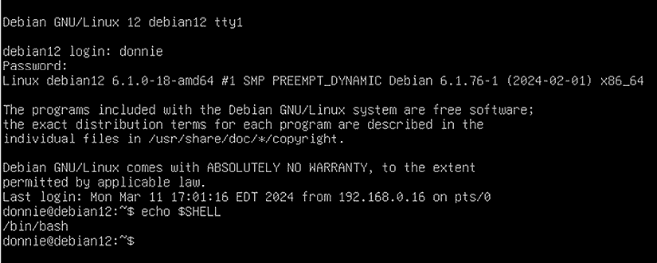
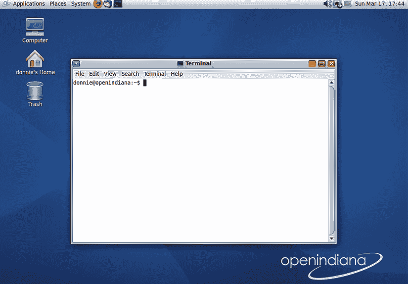
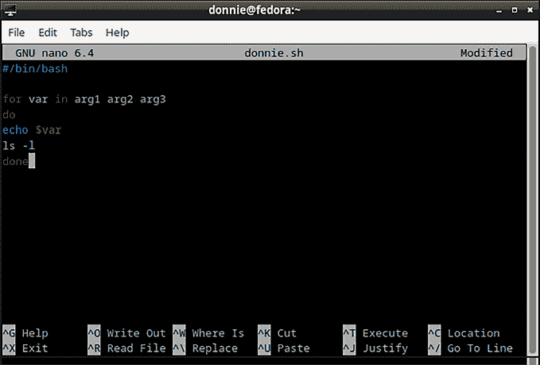
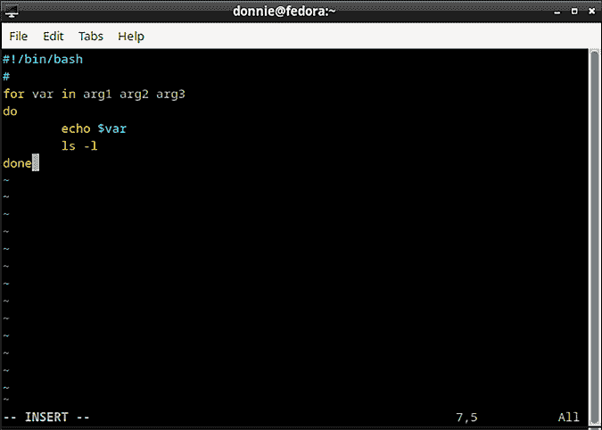
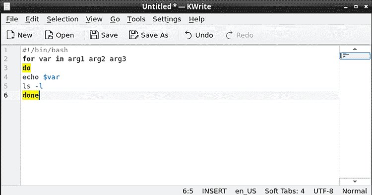

# 开始使用 Shell

在我们讨论 Shell 脚本之前，我们需要了解什么是 Shell，以及 Linux、Unix 和类 Unix 操作系统中有哪些不同的 Shell。我们还将讨论一些其他重要的主题，这些都将帮助你进入 Shell 脚本的广阔世界。

本章的主题包括：

+   理解 Shell

+   寻找 Shell 命令的帮助

+   使用文本编辑器

+   理解编译型与解释型编程

+   理解 `root` 和 `sudo` 权限

如果你准备好了，那就让我们开始这段重要的旅程吧。同时，永远记得在过程中享受乐趣。

# 理解 Shell

所以，你一定在挠头问：“什么是 Shell，为什么我需要关心它？”那么，Shell 是一个程序，它充当用户和操作系统内核之间的中介。用户将命令输入到 Shell 中，Shell 会将这些命令传递给内核进行处理。处理结果随后通过计算机的 **终端**（也可以称作 **屏幕**）展示给用户。Linux 系统上最常见的 Shell 是 **bash**，但 **Z Shell**（**zsh**）近年来也逐渐变得流行。（我将在*第二十二章，使用 Z Shell* 中解释原因。）你会发现 `bash` 是大多数 Linux 发行版以及一些类 Unix 发行版（如 OpenIndiana）的默认 Shell，而 `zsh` 则是 Kali Linux 的默认 Shell。

如果你是 Linux 及其类 Unix 系统的全新用户，可能会想知道什么是 *distro*。其实，和 Windows 以及 macOS 这类由单一公司控制的专有操作系统不同，Linux 及其类 Unix 系统是主要的开源软件，这意味着任何人都可以拿到源代码并创建自己的实现或 *发行版*。Red Hat Enterprise Linux、Fedora 和 Ubuntu 是 Linux 发行版的例子，而 OpenIndiana 和 FreeBSD 则是类 Unix 发行版的例子。但我们这些铁杆极客很少说 *发行版*，我们通常直接说 *distro*，这是 *distribution* 的简写。

另外，我区分 Unix 和类 Unix 发行版的原因与上世纪 80 年代的法律原因有关。这涉及到一个相当复杂的问题，我这里不打算深入探讨。简单来说，像 FreeBSD 这样的发行版的创作者并不能将他们的作品称为 Unix，尽管它们在功能上大致等同。但，他们可以说自己的作品是 *类 Unix 的*。

最新版本的 macOS 也将 `zsh` 设置为默认的 shell。幸运的是，很多关于 `bash` 的知识也适用于 `zsh`。主要的区别是，`zsh` 有一些 `bash` 所没有的酷功能。（我会在*第二十二章*中详细解释这些内容。）**PowerShell** 最初仅适用于微软的 Windows 操作系统，但自 2016 年起，PowerShell 也已在 Linux 和 macOS 上可用。PowerShell 是完全不同的工具，但你可能会发现它非常有用，正如我们在*第二十三章，Linux 上使用 PowerShell* 中将要介绍的那样。

通常会听到人们把 `bash` 称为 *bash shell*。但是，`bash` 是 *Bourne Again Shell* 的缩写。所以，当你说 *bash shell* 时，实际上是在说 *Bourne Again Shell Shell*，这有点奇怪。这就像人们说要去 *ATM machine* 提取钱一样。他们实际上是在说 *Automatic Teller Machine Machine*，这也是很尴尬的说法。

而且，别让我开始讲那些讨论 *热水器* 的人。我是说，如果水已经热了，为什么还要加热呢？

另一方面，如果你觉得还需要说 *bash shell*，这样别人才能明白你在说什么，我会理解，也不会谴责你。事实上，你可能偶尔会看到我也这么做。

现代操作系统的 shell 最酷的地方在于，它们不仅仅是一个界面工具。它们也是完整的编程环境，拥有与更复杂编程语言（如 Pascal、C 或 Java）相同的许多编程结构。系统管理员可以通过使用 shell 脚本来自动化复杂的重复任务，从而使工作变得更加轻松。

当你登录到一个文本模式的 Linux 或 Unix 服务器时，屏幕上会显示一片黑色和一些文本，类似如下：



图 1.1：文本模式 Debian Linux 机器上的纯 bash

这是简洁的、基本的 shell。安装了桌面环境的机器将通过 **终端模拟器** 与 shell 进行交互，终端模拟器看起来像这样：



图 1.2：在 OpenIndiana 机器上与 bash 交互的终端模拟器

终端模拟器的名称因桌面环境的不同而有所不同，但它们的功能是相同的。使用终端模拟器的好处是，你可以享受使用滚动条、定制显示界面和命令行复制粘贴等功能。

无论如何，你可以通过输入以下命令查看自己使用的是哪个 shell：

```
donnie@fedora:~$ echo $SHELL
/bin/bash
donnie@fedora:~$ 
```

在这种情况下，你看到的是 `bash`。

# 查找 Shell 命令的帮助

无论你认为自己是多么的专家，仍然会有需要查找一些信息的时候。对于 Linux、Unix 和类 Unix 操作系统来说，有几个选项可以用来查找信息。

## 理解手册页

**手册页**，简称**man 页**，几乎从一开始就内置在类 Unix 操作系统中。要使用 man 页，只需输入`man`，后跟您需要查找信息的命令、配置文件或系统组件的名称。例如，您可以这样查找如何使用`ls`命令：  

```
man ls 
```

大多数时候，`man`命令会在`less`分页程序中打开一个 man 页面。（某些 Unix 实现可能使用`more`分页程序，但我没有发现最近有这样的实现。）无论哪种方式，您都可以滚动浏览 man 页面，或在页面内进行关键字搜索，以找到您需要的信息。  

man 页被分为不同的部分，每一部分对应一个不同的类别。在大多数类 Unix 和 Linux 系统上，有八个主要类别，通常称为*部分*，它们如下所示：  

| **部分编号** | **目的** |
| --- | --- |
| 1 | 这一部分包含任何非特权用户可以使用的命令信息。 |
| 2 | 这一部分包含关于系统调用的信息，主要对软件开发人员有用。 |
| 3 | 在这一部分，您将找到关于库函数的信息，这些信息主要对软件开发人员有用。 |
| 4 | 如果您曾经想查找`/dev/`目录中的设备文件的信息，那么这里就是您要查找的地方。此部分还包含有关设备驱动程序的信息。 |
| 5 | 在这里，您将找到关于系统上各种配置和系统文件的信息。 |
| 6 | 这是关于游戏和屏幕保护程序的信息。通常这里的信息不多。 |
| 7 | 这是关于各种杂项信息的部分，这些内容无法整齐地归类到其他部分中。 |
| 8 | 这里是关于管理命令和系统守护进程的信息。 |

表 1.1：描述 man 页部分  

您将在`/usr/share/man/`目录中看到包含这些 man 页面文件的子目录。您还可能看到一些名为`man0p`、`man5p`或`man8x`的子目录。这些子目录包含某些特殊用途的 man 页面，在不同的 Linux 发行版中会有所不同。  

很多时候，您不需要关心这些部分，因为`man`命令会自动为您调用正确的 man 页面。其他时候，您需要注意这些部分，因为许多关键字在多个部分中都能找到。例如，在我写这篇文章时使用的 Fedora 工作站上，`printf`有两个 man 页面。您可以通过两种方式来找到它们。首先，您可以使用`man -aw`命令，像这样：  

```
[donnie@fedora ~]$ man -aw printf
/usr/share/man/man1/printf.1.gz
/usr/share/man/man3/printf.3.gz
[donnie@fedora ~]$ 
```

您还可以使用`whatis`命令，像这样：  

```
[donnie@fedora ~]$ whatis printf
printf (1)           - format and print data
printf (3)           - formatted output conversion
[donnie@fedora ~]$ 
```

请注意，`whatis`是`man -f`的同义词。无论使用哪个命令，您都会得到相同的结果，但我个人更喜欢使用`whatis`。  

所以，我们在第一部分有一个`printf`手册页，这意味着我们有一个名为`printf`的普通用户命令。我们在第三部分也看到了一个`printf`手册页，这意味着有一个名为`printf`的库函数。如果你输入`man printf`，你将看到来自第一部分的手册页。你会在手册页的第一行看到类似如下内容：

```
PRINTF(1)           User Commands               PRINTF(1) 
```

如果你想查看第三部分的手册页，你需要在命令中指定，如下所示：

```
man 3 printf 
```

要扩大搜索范围，查找所有包含`printf`的手册页，无论是标题还是描述中，甚至是嵌入在其他文本字符串中的，都可以使用`apropos`或`man -k`，如以下所示：

```
[donnie@fedora ~]$ apropos printf
asprintf (3)         - print to allocated string
BIO_printf (3ossl)   - formatted output to a BIO
BIO_snprintf (3ossl) - formatted output to a BIO
BIO_vprintf (3ossl)  - formatted output to a BIO
BIO_vsnprintf (3ossl) - formatted output to a BIO
curl_mprintf (3)     - formatted output conversion
dprintf (3)          - formatted output conversion
tpm2_print (1)       - Prints TPM data structures
fprintf (3)          - formatted output conversion
fwprintf (3)         - formatted wide-character output conversion
printf (1)           - format and print data
printf (3)           - formatted output conversion
. . .
[donnie@fedora ~]$ 
```

再次强调，无论使用哪个命令，都会得到相同的输出，但我个人始终偏好使用`apropos`。

大多数时候，你的 Linux 系统会很好地保持手册页索引的更新。然而，有时你需要手动更新，方法如下：

```
[donnie@fedora ~]$ sudo mandb
[sudo] password for donnie:
Purging old database entries in /usr/share/man...
Processing manual pages under /usr/share/man...
Purging old database entries in /usr/share/man/ca...
Processing manual pages under /usr/share/man/ca...
. . .
. . .
Processing manual pages under /usr/local/share/man...
0 man subdirectories contained newer manual pages.
0 manual pages were added.
0 stray cats were added.
0 old database entries were purged.
[donnie@fedora ~]$ 
```

好的，这就是关于手册页系统的内容。接下来我们来谈谈信息系统。

## 理解信息页面

**信息页面**系统较新，是由理查德·M·斯托曼（Richard M. Stallman）发明的，作为**GNU 项目**的一部分。它的独特之处在于每个信息页面都包含可以将你引导到其他信息页面的超链接。例如，要获取关于信息系统的内容，只需输入`info info`。这个信息页面包含一个菜单，类似于以下内容：

```
* Menu:
* Stand-alone Info::            What is Info?
* Invoking Info::               Options you can pass on the command line.
* Cursor Commands::             Commands which move the cursor within a node.
. . .
., . .
* Variables::                   How to change the default behavior of Info.
* Colors and Styles::           Customize the colors used by Info.
* Custom Key Bindings::         How to define your own key-to-command bindings.
* Index::                       Global index. 
```

每个下划线的项目都是一个**超链接**，指向另一页面。使用光标键，将光标移到您想查看的超链接上，然后按*Enter*键。要查看特定命令的帮助页面，比如`ls`，只需这样操作：

```
info ls 
```

如果你需要帮助来浏览信息页面，只需按`H`键来调出导航菜单。

好的，这就是关于信息页面的内容。接下来我们来谈谈在线文档。

## 了解 Linux 文档项目

**Linux 文档项目**几乎存在了永远，是一个宝贵的资源。最棒的是它的**指南**部分，在这里你可以找到免费的完整 Linux 和`bash`书籍，并可以下载多种格式。这些书籍大多数都很旧，最新的更新是在 2014 年。不过，关于*Bash 初学者指南*和*高级 Bash 脚本编程*这两本书，时间久远也无妨。这两本书中的概念是永恒的，数年来并未发生变化。要查看这些书籍，请访问[`tldp.org/guides.html`](https://tldp.org/guides.html)。

## 使用您最喜欢的搜索引擎

如果一切都失败了，只需使用您最喜欢的搜索引擎查找有关脚本编程的一般信息，或某个特定操作系统上的脚本编程。你会找到很多帮助信息，比如博客文章、YouTube 视频和官方文档。许多专注于 Linux 的免费网站提供各种帮助，找到它们非常简单。

接下来，让我们来谈谈文本编辑器。

# 使用文本编辑器创建 Shell 脚本

要创建你的 shell 脚本，你需要一个专为 Linux 和 Unix 系统设计的文本编辑器。你有很多选择，选择哪一个取决于多个标准：

+   你是在文本模式机器上编辑文件，还是在桌面机器上编辑？

+   你需要哪些功能？

+   你个人的偏好是什么？

## 文本模式编辑器

文本模式文本编辑器可以在没有图形用户界面的机器上使用。最常见的两种文本模式编辑器是 `nano` 和 `vim`。`nano` 编辑器几乎在所有 Linux 发行版中都已预装，且使用起来非常简单。使用它，只需键入 `nano`，后跟你要编辑或创建的文件名。在屏幕底部，你会看到可用命令的列表。要调用某个命令，按下 *CTRL* 键，然后按对应的字母键。

使用 `nano` 的缺点是它没有你可能需要的程序员文本编辑器的全部功能。你可以看到，我在 Fedora 工作站上使用的 `nano` 实现有语法高亮，但它不会自动格式化代码。



图 1.3：我在 Fedora 工作站上使用的 nano 文本编辑器

请注意，在其他 Linux 发行版上，`nano` 可能甚至没有语法高亮。

我最喜欢的文本模式编辑器是 `vim`，它拥有几乎让所有程序员都满意的功能。它不仅支持语法高亮，还能自动格式化你的代码，并应用适当的缩进，如你所见：



图 1.4：我在 Fedora 工作站上使用的 vim 文本编辑器

实际上，`bash` 脚本不需要缩进，因为 `bash` 脚本在没有缩进的情况下也能正常工作。然而，缩进确实让代码更容易为人类阅读，并且有一个能自动应用适当缩进的编辑器是非常方便的。此外，`vim` 具有强大的搜索和替换功能，允许你分屏操作，从而可以同时处理两个文件，并且可以通过多种插件进行定制。即使它是一个文本模式编辑器，你也可以在通过桌面机器远程登录到服务器时，使用鼠标右键菜单进行复制和粘贴，或者在桌面机器上编辑本地文件时使用该功能。

较老的 `vi` 文本编辑器通常在大多数 Linux 发行版中默认安装，但 `vim` 通常没有。某些发行版中，即使没有实际安装 `vim`，`vim` 命令仍然可以工作。这是因为这些发行版中的 `vim` 命令可能指向的是 `vim-minimal`，甚至指向的是旧版的 `vi`。无论如何，要在任何基于 Red Hat 的发行版（如 RHEL、Fedora、AlmaLinux 或 Rocky Linux）上安装完整的 `vim`，只需执行以下命令：

```
sudo dnf install vim-enhanced 
```

要在 Debian 或 Ubuntu 上安装 `vim`，请执行以下命令：

```
sudo apt install vim 
```

尽管我很喜欢`vim`，我还是得告诉你，一些用户不太愿意使用它，因为他们认为它太难学。这是因为原版的`vi`是在计算机的“石器时代”创建的，那时计算机键盘上没有光标键、退格键或删除键。你曾经必须使用的那些老式`vi`命令，直到今天的`vim`版本仍然得以保留。

所以，大多数你能找到的`vim`教程仍然会尝试教你所有那些老式的键盘命令。


图 1.5：这张我的照片拍摄于计算机的“石器时代”，那时计算机键盘上没有光标键、退格键或删除键。

然而，在你将安装在 Linux 和现代类 Unix 发行版（如 FreeBSD 和 OpenIndiana）上的当前版本的`vim`中，光标键、退格键和删除键都能像在其他文本编辑器中一样工作。因此，已经不再需要学习那些你以前不得不学习的所有键盘命令了。我的意思是，你仍然需要学会一些基本的键盘命令，但不会像以前那样需要学那么多。

## 图形用户界面文本编辑器

如果你使用的是桌面计算机，你仍然可以根据需要使用`nano`或`vim`。但是，如果你更愿意使用图形界面类型的编辑器，也有多种选择。一些简单的文本编辑器，比如`gedit`或`leafpad`，可能已经安装在你的桌面系统上。还有一些稍微复杂一点的程序员编辑器，如`geany`、`kwrite`和`bluefish`，它们在大多数 Linux 发行版和一些类 Unix 发行版的正常软件仓库中都有提供。你最好的方法是尝试不同的编辑器，看看哪种最适合你。这是启用了语法高亮的`kwrite`编辑器的示例：



图 1.6：Kwrite 文本编辑器。

如果你是 Windows 用户，你绝对不想在 Windows 计算机上使用 Windows 文本编辑器（如记事本或写字板）创建或编辑 shell 脚本，然后将脚本转移到 Linux 计算机上。这是因为 Windows 文本编辑器在每一行的末尾插入了一个不可见的回车符。你看不见它们，但你的 Linux shell 能够看到，并且会拒绝执行脚本。话虽如此，你有时可能会遇到别人用 Windows 文本编辑器创建的脚本，这时你需要知道如何修复它们，使它们能够在你的 Linux 或 Unix 机器上运行。这个过程很简单，我们会在*第七章，文本流过滤器-第二部分*中讲解。

这就是我们对 Linux 文本编辑器概述的全部内容。接下来，让我们讨论编译型和解释型编程语言。

# 理解编译型与解释型编程

**编译编程**是指在文本编辑器中编写程序代码，然后使用编译器将文本文件转换为可执行的二进制文件。一旦完成，程序的用户将无法轻易查看程序的源代码。而 **解释性编程** 是直接从文本文件运行程序，而无需先进行编译。

编译语言，例如 C、C++ 或 Fortran，适合当你需要从程序中获得最大性能时。然而，它们可能相当难学，尤其是当涉及到较低级的功能时，比如处理文件。解释性语言可能无法提供如此高的性能，但它们通常非常灵活，而且通常更容易学习。解释性语言通常也提供更高的操作系统间的便携性。Shell 脚本就属于解释性语言的范畴。

下面是一些你可能会考虑使用解释性语言的原因：

+   当你寻找一个简单的解决方案时。

+   当你需要一个便携的解决方案时。如果你关注便携性问题，你可以编写一个脚本，使其能够在不同的 Linux 发行版以及 Unix/类 Unix 系统上运行。如果你在一个大型公司，且该公司拥有一个混合操作系统的大型网络，这会非常有用。（你甚至可能会遇到一些较大的公司，它们仍在运行一些传统的 Unix 系统，如 AIX、HPUX 或 SUNOS，同时还使用更现代的 Linux、BSD 或 macOS 实现。）

下面是一些你可能会考虑使用编译语言的原因：

+   当任务需要大量使用系统资源时，尤其是在速度至关重要的情况下，这种情况尤为明显。

+   当你进行需要大量数值运算的数学操作时。

+   当你需要复杂的应用程序时。

+   当你的应用程序有许多具有依赖关系的子组件时。

+   当你想要创建专有应用程序，并防止用户查看应用程序源代码时。

当你仔细考虑时，几乎所有的生产力软件、服务器软件、游戏软件或科学软件都属于一个或多个这些类别，这意味着它们应该使用编译语言来构建，以获得最佳性能。

好的，现在我们来谈谈`sudo`。

# 理解 root 和 sudo 权限

本课程中你将做的一些事情需要具有管理员权限。虽然可以方便地登录到 root 命令提示符，但我尽量不鼓励这样做。为了最佳的安全性，并且习惯于企业环境中的操作，最好的选择是使用`sudo`。

现代 Linux 发行版允许你在安装操作系统时将自己添加到管理员组中。（在 Red Hat 系统中，这是 `wheel` 组，在 Debian/Ubuntu 系统中，这是 `sudo` 组。）要执行需要管理员权限的命令，只需像这样做：

```
sudo nftables list ruleset 
```

然后，系统会要求你输入你自己的用户账户密码，而不是 root 用户账户的密码。

关于这个话题，我们差不多可以说完了，接下来让我们总结一下并继续下一章节。

# 总结

在本章中，我为接下来的章节奠定了一些基础。我们了解了操作系统 shell 是什么，以及为什么要使用它。接着，我们探讨了寻找帮助的各种方式，简要回顾了 Linux 文本编辑器，并讨论了编译型和解释型编程语言的区别，还简单提到为何我们要使用 `sudo` 来执行管理员命令。

在下一章节，我们将开始探讨操作系统 shell 为我们做的各种事情。我会在那时见到你。

# 问题

1.  Linux 系统最广泛使用的 shell 是什么？

    1.  `zsh`

    1.  `bash`

    1.  `korn`

    1.  `csh`

1.  如果你在 Windows 电脑上使用 Windows 文本编辑器（如记事本或 Wordpad）创建一个 Linux shell 脚本，会发生什么？

    1.  该脚本将在 Linux 机器上正常运行。

    1.  你的 Windows 机器会因你使用它来创建 Linux 脚本而愤怒关机。

    1.  该脚本无法在 Linux 机器上运行，因为 Windows 文本编辑器会在每行末尾插入一个不可见的回车符。

    1.  微软前 CEO 史蒂夫·巴尔默将拜访你，解释为什么 Linux 是一种癌症。

1.  3\. 在哪个章节可以找到管理员命令的 man 页面？

    1.  1

    1.  3

    1.  5

    1.  6

    1.  8

1.  以下哪项陈述是正确的？

    1.  解释型编程语言适用于需要进行重数学运算的程序。

    1.  编译型编程语言通常比解释型语言更适合处理大型复杂程序。

    1.  解释型编程语言的例子包括 C、C++ 和 Fortran。

    1.  解释型语言和编译型语言在性能上没有差别。

1.  对还是错：要执行管理员命令，最好直接登录 root 用户账户。

# 延伸阅读

+   22 款最佳 Linux 编程文本编辑器：[`phoenixnap.com/kb/best-linux-text-editors-for-coding`](https://phoenixnap.com/kb/best-linux-text-editors-for-coding)

+   Ballmer: “Linux 是一种癌症”：[`www.theregister.com/2001/06/02/ballmer_linux_is_a_cancer/`](https://www.theregister.com/2001/06/02/ballmer_linux_is_a_cancer/)

+   微软曾将 Linux 称为癌症，这个说法是个大错误：[`www.zdnet.com/article/microsoft-once-called-linux-a-cancer-and-that-was-a-big-mistake/`](https://www.zdnet.com/article/microsoft-once-called-linux-a-cancer-and-that-was-a-big-mistake/)

+   VIM 初学者教程：[`linuxconfig.org/vim-tutorial`](https://linuxconfig.org/vim-tutorial)

+   Distrowatch.com：[`distrowatch.com/`](https://distrowatch.com/)

+   Linux 文档项目：[`tldp.org/`](https://tldp.org/)

+   LinuxQuestions.org：[`www.linuxquestions.org/`](https://www.linuxquestions.org/)

+   Linux 手册页：[`linux.die.net/man/`](https://linux.die.net/man/)

# 回答

1.  b

1.  c

1.  e

1.  b

1.  错误。最好从你自己的用户账户使用`sudo`。

# 加入我们的 Discord 社区！

与其他用户、Linux 专家以及作者本人一起阅读本书。

提问、为其他读者提供解决方案、通过“问我任何问题”环节与作者交流，以及更多内容。扫描二维码或访问链接加入社区。

[`packt.link/SecNet`](https://packt.link/SecNet)


