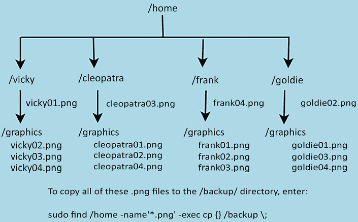

# 2

# 解读命令

为了履行其作为用户与操作系统内核之间接口的职责，Shell 必须执行五个不同的功能。这些功能包括解读命令、设置变量、启用输入/输出重定向、启用管道以及允许定制用户的工作环境。在本章中，我们将探讨`bash`和`zsh`是如何解读命令的。作为额外的收获，我们将在接下来的几章中讲解的内容也会帮助你准备一些 Linux 认证考试，比如 Linux 专业人员协会（LPI）或 CompTIA Linux+考试。

本章内容包括：

+   理解命令的结构

+   一次执行多个命令

+   递归运行命令

+   理解命令历史

+   转义和引用

为了跟着学习，你可以使用任何你喜欢的 Linux 发行版，只要它运行的是`bash`或`zsh`。你最好的选择是使用虚拟机，而不是生产工作站，以防不小心删除或更改一些不该更改的内容。

# 理解命令结构

对于现实生活和你可能参加的任何认证考试来说，了解命令的结构非常重要。命令可以由最多三个部分组成，并且这些部分有一定的顺序。以下是这些部分以及通常排列的顺序：

+   命令本身

+   命令选项

+   命令参数

如果你计划参加 Linux 认证考试，你肯定要记住这个排序规则。不过，稍后我们会看到一些命令并不总是遵循这个规则。

## 使用命令选项

有两种常见的**选项开关**：

+   **单字母选项**：对于大多数命令，单字母选项前面会有一个短横线。大多数情况下，两个或更多单字母选项可以与一个短横线结合使用。

+   **全字选项**：对于*大多数*命令，整个单词选项前面会有两个短横线。两个或更多的全字选项必须单独列出，因为它们不能与一对短横线结合使用。

为了向你展示我们的意思，请查看这个实践实验。

### 实践实验 – 使用命令选项的练习

在本实验中，我们将使用简单的`ls`工具。对于这个工具，选项和参数是可选的，因此我们将在实际操作中看到该命令的不同配置。

1.  让我们执行裸`ls`命令，以查看当前目录中的文件和目录。

    ```
    [donnie@fedora ~]$ ls
     4-2_Building_an_Alpine_Container.bak     Public
     4-2_Building_an_Alpine_Container.pptx    pwsafe.key
     addresses.txt                                                 python_container
     alma9_default.txt                                         rad-bfgminer
     alma9_future.txt                                           ramfetch
     alma_link.txt                                                read.me.first
    . . .
    . . .
    pCloudDrive                                                  yad-form.sh
     Pictures
    [donnie@fedora ~]$ 
    ```

1.  现在，让我们添加一个单字母选项。我们将使用`-l`选项来显示文件和目录及其一些特征。

    ```
    [donnie@fedora ~]$ ls -l
    total 40257473
    -rw-r--r--.  1 donnie donnie      754207 Apr  5 16:13  4-2_Building_an_Alpine_Container.bak
    -rw-r--r--.  1 donnie donnie      761796 Apr  8 14:49  4-2_Building_an_Alpine_Container.pptx
    -rw-r--r--.  1 donnie donnie         137 Apr  2 15:05  addresses.txt
    -rw-r--r--.  1 donnie donnie        1438 Nov  2  2022  alma9_default.txt
    . . .
    . . .
    -rwxr--r--.  1 donnie donnie         263 May 16 15:42  yad-form.sh
    [donnie@fedora ~]$ 
    ```

1.  使用`ls`命令配合`-a`选项，可以查看任何隐藏的文件或目录。（隐藏文件或目录的名字以一个句点开始。）

    ```
    [donnie@fedora ~]$ ls -a
     .                                                                     .pcloud
     ..                                       pCloudDrive
     4-2_Building_an_Alpine_Container.bak     Pictures
     4-2_Building_an_Alpine_Container.pptx    .pki
     addresses.txt                                                 .podman-desktop
     alma9_default.txt                                          .profile
    . . .
    . . .
    .mozilla                                                          .Xauthority
     Music                                                            .xscreensaver
     NetRexx                                                       .xsession-errors
     nikto                                                             yad-form.sh
    [donnie@fedora ~]$ 
    ```

1.  接下来，让我们结合这两个选项，以便我们可以看到隐藏文件和未隐藏文件以及目录的特点：

    ```
    [donnie@fedora ~]$ ls -la
    total 40257561
    drwx------.   1 donnie donnie         2820 Jul 25 13:53  .
    drwxr-xr-x.  1 root   root              12 Aug  9  2022  ..
    -rw-r--r--.    1 donnie donnie          137 Apr  2 15:05      addresses.txt
    -rw-------.    1 donnie donnie          15804 Jul 24 17:53  .bash_history
    -rw-r--r--.    1 donnie donnie          18 Jan 19  2022        .bash_logout
    -rw-r--r--.    1 donnie donnie          194 Apr  3 12:11      .bash_profile
    -rw-r--r--.    1 donnie donnie          513 Apr  3 12:11      .bashrc
    . . .
    . . .
    -rw-r--r--.    1 donnie donnie          9041 Feb  4 12:57     .xscreensaver
    -rw-------.    1 donnie donnie          0 Jul 25 13:53           .xsession-errors
    -rwxr--r--.   1 donnie donnie         263 May 16 15:42      yad-form.sh
    [donnie@fedora ~]$ 
    ```

在前面的例子中，`donnie donnie`部分表示这些文件和目录属于用户`donnie`，并与`donnie`组关联。在这个例子中，我们使用一个完整的选项`--author`，前面有两个破折号，来查看一些额外的信息。让我们将`--author`开关和`-l`开关一起使用，来查看这些文件的作者：

```
[donnie@fedora ~]$ ls -l --author
total 40257473
-rw-r--r--.  1 donnie donnie donnie         137 Apr  2 15:05     addresses.txt
-rw-r--r--.  1 donnie donnie donnie         1438 Nov  2  2022  alma9_default.txt
-rw-r--r--.  1 donnie donnie donnie         1297 Nov  2  2022  alma9_future.txt
. . .
. . .
rwxr--r--.  1 donnie donnie donnie          263 May 16 15:42  yad-form.sh
[donnie@fedora ~]$ 
```

所以，看起来那个 Donnie 角色也正是最初创建这些文件的人。（哦，那是我，不是吗？）

## 使用命令参数

参数是命令操作的对象。对于`ls`命令，参数将是文件或目录的名称。例如，假设我们只想查看某个文件的详细信息。我们可以这样做：

```
[donnie@fedora ~]$ ls -l yad-form.sh
-rwxr--r--. 1 donnie donnie 263 May 16 15:42 yad-form.sh
[donnie@fedora ~]$ 
```

我们可以使用`*` **通配符**查看某一类型的所有文件的详细信息，如下所示：

```
[donnie@fedora ~]$ ls -l *.sh
-rwxr--r--. 1 donnie donnie 116 May 16 15:04 root.sh
-rwxr--r--. 1 donnie donnie 263 May 16 15:42 yad-form.sh
[donnie@fedora ~]$ 
```

如果你不熟悉通配符的概念，可以把它们看作是执行模式匹配的一种方式。在上面的例子中，`*`通配符用于匹配一个或多个字符。正因如此，`ls -l *.sh`命令让我们能看到所有以.sh 为文件扩展名的文件。你还可以以其他方式使用这个通配符。例如，要查看所有以字母 w 开头的文件名和目录名，只需执行：

```
donnie@opensuse:~> ls -ld w*
drwxrwxr-x 1 donnie users    22 Mar  5  2022 windows
-rw-r--r-- 1 donnie users 82180 Dec  7  2019 wingding.ttf
drwxr-xr-x 1 donnie users   138 Mar 11  2023 wownero-x86_64-linux-gnu-v0.11
donnie@opensuse:~> 
```

要了解有关通配符的更多信息，请查阅*进一步阅读*部分中的参考资料。

在这个例子中，我们查看的是所有以`.sh`结尾的文件。

你并不总是仅限于指定一个参数。在这个例子中，我们正在查看三个不同的文件：

```
[donnie@fedora ~]$ ls -l missing_stuff.txt yad-form.sh Dylan-My_Back_Pages-tab.odt
-rw-r--r--. 1 donnie donnie 29502 Mar  7 18:30 Dylan-My_Back_Pages-tab.odt
-rw-r--r--. 1 donnie donnie   394 Dec  7  2022 missing_stuff.txt
-rwxr--r--. 1 donnie donnie   263 May 16 15:42 yad-form.sh
[donnie@fedora ~]$ 
```

使用`-ld`选项查看目录的特征，而不查看目录的内容，如下所示：

```
[donnie@fedora ~]$ ls -ld Downloads/
drwxr-xr-x. 1 donnie donnie 8100 Aug  4 12:37 Downloads/
[donnie@fedora ~]$ 
```

尽管你实际上可以改变选项和参数在许多命令中出现的顺序，但这样做并不是好习惯。为了避免混淆，并为你可能参加的任何 Linux 认证考试做好准备，还是遵循我在这里提供的顺序规则。也就是说，首先是命令本身，其次是命令选项，最后是命令参数。

命令结构部分就到这里。接下来，我们来看一下如何一次性执行多个命令。

# 一次性执行多个命令

无论是在命令行中还是在 shell 脚本中，了解如何将多个命令合并成一个单一命令都非常方便。在本节中，我将演示三种方法：

+   交互式运行命令

+   使用命令序列

+   使用`find`工具

## 交互式运行命令

这是一种 shell 脚本编程方式，只不过你只是从命令行执行所有命令，而不是实际编写、保存和执行脚本。在这里，你正在创建一个**for 循环**——循环中的每个命令都在各自的单独行上——来执行三次目录列出操作。

```
[donnie@fedora ~]$ for var in arg1 arg2 arg3
> do
> echo $var
> ls
> done
. . .
. . .
[donnie@fedora ~]$ 
```

在每一行的末尾，你需要按下*Enter*键。但在你输入`done`命令之后，什么也不会发生。`for`循环将会执行三次，每次使用列出的三个参数之一。每次执行时，参数的值都会被赋值给`var`变量，而`echo`命令将打印当前赋值的内容。输出看起来会像这样：

```
arg1
 4-2_Building_an_Alpine_Container.bak     Public
 4-2_Building_an_Alpine_Container.pptx    pwsafe.key
arg2
 4-2_Building_an_Alpine_Container.bak     Public
 4-2_Building_an_Alpine_Container.pptx    pwsafe.key
arg3
 4-2_Building_an_Alpine_Container.bak     Public
 4-2_Building_an_Alpine_Container.pptx    pwsafe.key 
```

接下来，按下键盘上的上箭头键，你会看到刚刚执行的`for`循环。如果你在`bash`中尝试这一操作，你会发现各个命令用分号分隔，如下所示：

```
[donnie@fedora ~]$ for var in arg1 arg2 arg3; do echo $var; ls; done 
```

在`zsh`中，按下上箭头键会使命令的各个部分出现在单独的行上，正如你在这里看到的那样：

```
donnie@opensuse:~> for var in arg1 arg2 arg3
do
echo $var
ls
done 
```

无论哪种方式，当你按下*Enter*键时，`for`循环将再次执行。

如果你对`for`循环的工作方式还有点不清楚，别担心。一旦我们开始实际创建 shell 脚本，我们将更详细地讲解它们。

## 使用命令序列

命令序列是另一种你会发现非常有用的编程结构。在这里，我演示了如何从命令行使用它们，以便你能掌握基本概念。在接下来的章节中，我会向你展示如何在 shell 脚本中使用它们的例子。

### 使用分号链式执行命令

你还可以使用分号来分隔你想在同一命令行中执行的独立命令。如果你想先`cd`到某个目录，再查看它的内容，你可以把每个命令写在单独的行中，或者把它们写在同一行。这种过程被称为**命令链式执行**，它的样子如下：

```
[donnie@fedora ~]$ cd /var ; ls
account  cache  db     ftp    kerberos  local  log   nis  preserve  spool  yp
adm      crash  empty  games  lib       lock   mail  opt  run       tmp
[donnie@fedora var]$
[donnie@fedora ~]$ cd /far ; ls
bash: cd: /far: No such file or directory
 4-2_Building_an_Alpine_Container.bak     Public
 4-2_Building_an_Alpine_Container.pptx    pwsafe.key
 addresses.txt                                                 python_container
 alma9_default.txt                                         rad-bfgminer
. . .
. . .
[donnie@fedora ~]$ 
```

第一个命令失败了，因为我尝试进入一个不存在的目录。但是，第二个命令仍然执行成功，它列出了我家目录中的文件。

### 使用双与符号进行条件命令执行

你也可以指示`bash`或`zsh`，仅在第一个命令成功完成时才执行第二个命令。只需用`&&`而不是分号来分隔命令，如下所示：

```
[donnie@fedora ~]$ cd /var && ls
account  cache  db     ftp    kerberos  local  log   nis  preserve  spool  yp
adm      crash  empty  games  lib       lock   mail  opt  run       tmp
[donnie@fedora var]$ 
```

如果第一个命令没有成功执行呢？请注意，第二个命令并不会执行：

```
[donnie@fedora ~]$ cd /far && ls
bash: cd: /far: No such file or directory
[donnie@fedora ~]$ 
```

### 使用双管道符进行条件命令执行

如果你希望`bash`或`zsh`仅在第一个命令*未*成功执行时才执行第二个命令，只需用`||`分隔命令。（这是两个管道符号，你可以在和反斜杠同一个键上找到它们。）举个例子，我们再次尝试输入一个小错误的命令来切换目录。

```
[donnie@fedora ~]$ ce /var || echo "This command didn't work."
bash: ce: command not found
This command didn't work.
[donnie@fedora ~]$
[donnie@fedora ~]$ cd /var || echo "This command didn't work."
[donnie@fedora var]$ 
```

作为一个更实际的例子，试着切换到一个目录，如果该目录不存在则创建它，然后在目录成功创建后切换到它。

```
[donnie@fedora ~]$ cd mydirectory || mkdir mydirectory && cd mydirectory
bash: cd: mydirectory: No such file or directory
[donnie@fedora mydirectory]$ 
```

你仍然会看到一个错误信息，提示你尝试访问的目录不存在。但请看看命令提示符，你会看到目录已经被创建，并且你已经进入了该目录。

## 使用`find`工具

我们现在暂时从多命令执行的讨论中休息一下，来介绍一下 `find` 工具，它真的是所有搜索工具中的酷炫大哥。介绍完之后，我会使用 `find` 展示更多同时运行多个命令的方法。

另外，我们有必要提到，`find` 不仅适用于命令行搜索。它在 Shell 脚本中也非常优秀，稍后你会看到。

如果你和我一样年纪大，你可能还记得 Windows XP 搜索助手，每次从 Windows XP 图形搜索工具进行文件搜索时，它会在屏幕上跳跃。它看起来挺可爱，但并没有增强你的搜索能力。而在 Linux 的 `find` 工具中，你可以根据你能想到的任何标准执行强大的搜索，然后——通过同一个命令行输入——调用另一个工具来处理搜索结果。我不会尝试讨论 `find` 的所有选项，因为它们太多了。我将简要介绍你可以用 `find` 做什么，然后让你通过查看其手册页面了解更多选项。（只需在命令行输入 `man find`，即可查看所有选项。）

要执行最基本的搜索，你需要指定两个要素：

+   **搜索路径**：你可以在指定的路径中，或者整个文件系统中进行搜索。由于 `find` 本身是递归的，搜索会自动扩展到你指定目录下的所有子目录。（当然，你也可以添加命令开关来限制搜索的深度。）

+   **你要搜索的内容**：有很多方法可以指定搜索内容。你可以按特定的文件名进行搜索，并决定是否区分大小写。你还可以使用通配符，或者搜索具有特定特征或特定年龄的文件。或者，你可以结合多个标准进行更为具体的搜索。限制你的唯一因素就是你的想象力。

假设你现在想要在整个文件系统中搜索所有以 `.conf` 结尾的文件。你需要在要搜索的文件描述前使用 `-name` 或 `-iname` 选项。否则，你会得到一个杂乱无章的目录列表，其中包含你搜索的每个目录，且你要找的信息混杂其中。对于区分大小写的搜索，使用 `-name`，对于不区分大小写的搜索，使用 `-iname`。在这种情况下，我们使用 `-iname`，因为我们希望搜索不区分大小写。

我知道，我之前告诉过你，大多数整字选项开关前面都有一对破折号。`find` 工具是这个规则的例外，因为它的整字选项开关前面只有一个破折号。

同时需要注意，在生产服务器上对整个文件系统进行搜索，尤其是当硬盘非常大的时候，可能会花费很长时间。有时候确实需要这么做，但尽可能最好将搜索限制在特定目录内。

如果在搜索条件中包含通配符字符，您需要将该搜索条件用引号括起来。这样可以防止 shell 将通配符字符解释为模糊的文件引用。例如，若要在当前工作目录及其所有子目录中执行不区分大小写的搜索，查找所有以 `.conf` 结尾的文件，我会这样操作：

```
[donnie@fedora ~]$ find -iname '*.conf'
./.cache/containers/short-name-aliases.conf
./.config/lxsession/LXDE/desktop.conf
./.config/pcmanfm/LXDE/desktop-items-0.conf
./.config/pcmanfm/LXDE/pcmanfm.conf
./.config/lxterminal/lxterminal.conf
./.config/Trolltech.conf
. . .
. . .
./tor-browser/Browser/TorBrowser/Data/fontconfig/fonts.conf
./rad-bfgminer/example.conf
./rad-bfgminer/knc-asic/RPi_system/raspi-blacklist.conf
./something.CONF
[donnie@fedora ~]$[donnie@fedora ~]$ 
```

通过使用 `-iname` 选项，我能够找到以 `.conf` 或 `.CONF` 结尾的文件。如果我使用的是 `-name` 选项，那么只会找到以 `.conf` 结尾的文件。

通常，您会将搜索路径指定为 `find` 命令的第一个组件。在 Linux 操作系统中包含的 GNU 实现的 `find` 中，如果省略搜索路径，`find` 将会默认搜索当前工作目录，就像我们刚才看到的那样。不幸的是，这个技巧对于 Unix/Unix-like 操作系统（如 FreeBSD、macOS 或 OpenIndiana）不适用。在这些操作系统中，您始终需要指定搜索路径。要使 `find` 搜索当前工作目录，只需使用点号来指定搜索路径。因此，在我的 FreeBSD 虚拟机上，命令如下所示：

```
donnie@freebsd-1:~ $ find . -iname '*.conf'
./anotherdir/yetanother.conf
./anotherthing.CONF
./something.conf
donnie@freebsd-1:~ $ 
```

好吧，我知道了。你可能会问，为什么我在这本本该是 Linux 书籍的内容里提到 FreeBSD、macOS 和 OpenIndiana。其实，是因为有时我们希望创建可以在多个操作系统上运行的 shell 脚本，而不仅仅是 Linux。如果您在这个命令中包含点号，它仍然能在 Linux 机器上运行，同时也能在您的 Unix/Unix-like 机器上运行。

您还可以指定不是当前工作目录的搜索路径。例如，您可以停留在自己的主目录，并像这样在整个文件系统中进行搜索：

```
[donnie@fedora ~]$ find / -iname '*.conf' 
```

当然，这将比仅搜索一个目录花费更多的时间。而且，您会遇到错误，因为您的普通用户账户没有权限进入所有目录。要搜索整个文件系统中的所有目录，只需在命令前加上 `sudo`，如以下所示：

```
[donnie@fedora ~]$ sudo find / -iname '*.conf' 
```

您可以使用多个搜索条件进行搜索。如果使用空格分隔条件，它就相当于在它们之间放置了一个 `and` 运算符。在这里，我们将使用 `-mtime -7` 选项来查找过去七天内修改过的 `.conf` 文件，并在最后使用 `-ls` 选项显示文件的详细信息：

```
[donnie@fedora ~]$ sudo find / -iname '*.conf' -mtime -7 -ls
       18      4 -rw-r--r--   1 root     root          328 Jul 24 17:50 /boot/loader/entries/81085aed13d34626859063e7ebf29da5-6.4.4-100.fc37.x86_64.conf
  3321176   4 -rw-r--r--   1 donnie   donnie        467 Jul 24 16:14 /home/donnie/.config/pcmanfm/LXDE/pcmanfm.conf
      370      4 -rw-r--r--   1 donnie   donnie       3272 Jul 19 16:21 /home/donnie/.config/Trolltech.conf
. . .
. . .
4120762      8 -rw-r--r--   2 root            root                7017 Jul 21 14:43 /var/lib/flatpak/app/com.notepadqq.Notepadqq/x86_64/stable/a049a1963430515aa15d950212fc1f0db7efb703a94ddd1f1d316b38ad12ec72/files/lib/node_modules/npm/node_modules/request/node_modules/http-signature/node_modules/jsprim/node_modules/verror/jsl.node.conf
[donnie@fedora ~]$ 
```

要查找修改时间超过七天的 `.conf` 文件，请将 `-7` 替换为 `+7`，如下所示：

```
[donnie@fedora ~]$ sudo find / -iname '*.conf' -mtime +7 -ls 
```

你还可以通过创建复合表达式来执行更复杂的搜索。它的工作原理像代数一样，表达式是从左到右评估的，除非你使用括号将某些项分组。但这样做时，有几个小陷阱。

由于括号符号在`bash`和`zsh`中有特殊含义，你需要在它们前面加上反斜杠，这样`bash`和`zsh`就不会误解它们的含义。你还需要在括号符号和它们所包含的内容之间留一个空格。

假设我们现在要查找`/etc/`目录下所有`.conf`文件，这些文件要么在过去七天内被修改，要么在 30 天前就被访问过。我们将使用`-atime`开关来设置访问时间条件。`or`运算符由`-o`表示。

```
[donnie@fedora ~]$ sudo find /etc -iname '*.conf' \( -mtime -7 -o -atime +30 \)
[sudo] password for donnie:
/etc/UPower/UPower.conf
/etc/X11/xinit/xinput.d/ibus.conf
/etc/X11/xinit/xinput.d/xcompose.conf
/etc/X11/xinit/xinput.d/xim.conf
. . .
. . .
/etc/appstream.conf
/etc/whois.conf
/etc/nfsmount.conf
[donnie@fedora ~]$ 
```

`/etc/`目录中有几个子目录需要 root 权限才能进入，所以我又使用了`sudo`，就像之前那样。在命令末尾添加`-ls`选项可以显示文件的时间戳，这可以告诉我每个具体文件满足哪一个搜索条件。

如果你想查找只属于某个特定用户的文件，可以使用`-user`开关。添加第二个条件来查找只属于某个特定用户的特定类型的文件。在这里，我正在搜索整个文件系统，寻找所有属于我的`.png`图形文件：

```
[donnie@fedora ~]$ sudo find / -user donnie -iname '*.png'
/home/donnie/.cache/mozilla/firefox/xgwvyw2p.default-release/thumbnails/9aa3453b0b6246665eb573e58a40fe7c.png
/home/donnie/.cache/mozilla/firefox/xgwvyw2p.default-release/thumbnails/96c0e5aa4c2e735c2ead0701d2348dd6.png
. . .
. . .
/home/donnie/rad-bfgminer/vastairent.png
find: '/run/user/1000/doc': Permission denied
find: '/run/user/1000/gvfs': Permission denied
/tmp/.org.chromium.Chromium.IpK3VA/pcloud1_16.png
find: '/tmp/.mount_pcloudWz4ji1': Permission denied
[donnie@fedora ~]$ 
```

即使拥有完全的`sudo`权限，仍然有一些目录我无法访问。但这没关系。

你可以使用`-group`开关来查找属于某个特定组的文件。在这里，我正在查看我自己主目录下，属于`nobody`组的文件或目录。

```
[donnie@fedora ~]$ sudo find -group nobody -ls
  3344421      0 drwxr-xr-x   1 nobody   nobody          0 Jul 25 18:36 ./share
  3344505      0 -rw-r--r--      1 donnie   nobody          0 Jul 25 18:38 ./somefile.txt
[donnie@fedora ~]$ 
```

请注意，我在这里仍然使用`sudo`，因为即使在我自己的主目录中，也有一些目录在没有它的情况下`find`是无法访问的。（这些目录包含有关 Docker 容器的信息。）

相反，你可以使用`-nogroup`开关来查找不属于`/etc/group`文件中列出的任何组的文件。

```
[donnie@fedora ~]$ sudo find -nogroup
./.local/share/containers/storage/overlay/994393dc58e7931862558d06e46aa2bb17487044f670f310dffe1d24e4d1eec7/diff/etc/shadow
./.local/share/containers/storage/overlay/ded7a220bb058e28ee3254fbba04ca90b679070424424761a53a043b93b612bf/diff/etc/shadow
./.local/share/containers/storage/overlay/8e012198eea15b2554b07014081c85fec4967a1b9cc4b65bd9a4bce3ae1c0c88/diff/etc/shadow
./.local/share/containers/storage/overlay/7cd52847ad775a5ddc4b58326cf884beee34544296402c6292ed76474c686d39/diff/etc/shadow
[donnie@fedora ~]$ 
```

在 Linux/Unix 世界中，系统上的一切都表示为文件。系统的普通用户通常只会遇到常规文件和目录，但对于系统管理员来说，还有许多其他类型的文件会很重要。各种文件类型包括：

+   **常规文件：** 这些是普通用户通常会访问的文件类型。图形文件、视频文件、数据库文件、电子表格文件、文本文件和可执行文件都是常规文件的例子。

+   **目录：** 目录作为一种文件类型可能会让人觉得奇怪，但在 Linux 和 Unix 的世界里，事情就是如此。

+   **字符设备：** 字符设备要么接受，要么提供一个串行数据流。声卡或终端会由字符设备文件表示。你会在`/dev/`目录中找到这些文件。

+   **块设备**：块设备文件代表可以随机访问的设备。示例包括硬盘、固态硬盘和驱动器分区。你还可以在`/dev/`目录中找到这些文件。

+   **命名管道**：这些设备接收一个系统进程的输出，并将其作为输入提供给另一个系统进程，从而实现进程间通信。

+   **套接字**：这些与命名管道相同，只是它们可以在通信流中发送和接收文件描述符。此外，与命名管道不同，套接字允许两个进程之间进行双向数据交换。

+   **符号链接**：这种类型的文件只是指向一个普通文件或目录。这允许用户从文件系统的多个位置访问文件和目录，或者通过不同的名称访问它们。

你可以通过执行`ls -l`命令来判断文件的类型。每个文件输出的第一个字符被称为**文件模式字符串**。这个文件模式字符串表示文件类型。例如，让我们看看我家目录中的内容：

```
[donnie@fedora ~]$ ls -l
total 137972
-rw-r--r--.      1 donnie donnie       12111206 Feb 18 13:41 dnf_list.txt
drwxr-xr-x. 15 donnie donnie               4096 Jul 27 16:39 orphaned_files
drwxr-xr-x.   2 donnie donnie                     6 Jul 29 16:53 perm_demo
-rw-r--r--.      1 donnie donnie                 643 Mar 26 15:53 sample.json
[donnie@fedora ~]$ 
```

以`-`开头的行表示普通文件，而以`d`开头的行表示目录。各种文件类型表示如下：

| **文件模式字符串** | **文件类型** |
| --- | --- |
| `-` | 普通文件 |
| `d` | 目录 |
| `c` | 字符设备 |
| `b` | 块设备 |
| `p` | 命名管道 |
| `s` | 套接字 |
| `l` | 符号链接 |

表 2.1：文件类型标识符

有时你可能需要定位所有某一类型的文件。你可以通过使用`-type`选项来做到这一点，像这样：

```
[donnie@fedora ~]$ sudo find / -type p -ls
      545    0 prw-------   1 root     root            0 Jul 31 15:20 /run/initctl
      542    0 prw-------   1 root     root            0 Jul 31 15:20 /run/dmeventd-client
      541    0 prw-------   1 root     root            0 Jul 31 15:20 /run/dmeventd-server
        6      0 p---------    1 donnie   donnie     0 Jul 31 15:29 /run/user/1000/systemd/inaccessible/fifo
     1228   0 prw-------   1 root     root            0 Jul 31 15:21 /run/systemd/inhibit/2.ref
     1193   0 prw-------   1 root     root            0 Jul 31 15:21 /run/systemd/inhibit/1.ref
     1324   0 prw-------   1 root     root            0 Jul 31 15:29 /run/systemd/sessions/3.ref
     1311   0 prw-------   1 root     root            0 Jul 31 15:29 /run/systemd/sessions/1.ref
        8      0 p---------    1 root     root            0 Jul 31 15:20 /run/systemd/inaccessible/fifo
      112    0 prw-------   1 root     root            0 Jul 31 15:20 /var/lib/nfs/rpc_pipefs/gssd/clntXX/gssd
  [donnie@fedora ~]$ 
```

如你所见，我使用`-type p`选项来搜索所有命名管道文件。

现在，让我们考虑之前的例子，在这个例子中我们搜索了所有以`.conf`文件扩展名结尾的文件：

```
[donnie@fedora ~]$ sudo find / -iname '*.conf' 
```

这个命令只找到了普通文件，因为它们是系统中唯一拥有`.conf`文件扩展名的文件类型。但是，现在假设我们想在`/etc/`目录中搜索所有包含`conf`文本字符串的子目录。如果我们没有指定文件类型，我们将看到普通文件、符号链接和目录：

```
[donnie@fedora ~]$ sudo find /etc -name '*conf*' -ls
   329486       4 -rw-r--r--   1 root     root          351 Jul 27 07:02 /etc/dnf/plugins/copr.conf
   329487       4 -rw-r--r--   1 root     root           30 Jul 27 07:02 /etc/dnf/plugins/debuginfo-install.conf
  8480155      4 -rw-r--r--   1 root     root           93 May 18 04:27 /etc/dnf/protected.d/dnf.conf
. . .
25325169      0 lrwxrwxrwx   1 root     root           43 Jul 29 18:19 /etc/crypto-policies/back-ends/bind.config -> /usr/share/crypto-policies/DEFAULT/bind.txt
 25325172      0 lrwxrwxrwx   1 root     root           45 Jul 29 18:19 /etc/crypto-policies/back-ends/gnutls.config -> /usr/share/crypto-policies/DEFAULT/gnutls.txt
. . .
5430579        0 drwxr-xr-x   2 root     root           25 Sep 19  2022 /etc/reader.conf.d
  8878157      0 drwxr-xr-x   3 root     root           27 Dec  8  2022 /etc/pkgconfig
  8927250      0 drwxr-xr-x   2 root     root           83 Nov 16  2022 /etc/krb5.conf.d
. . .
[donnie@fedora ~]$ 
```

我们将使用`-type d`选项来进一步缩小范围：

```
[donnie@fedora ~]$ sudo find /etc -name '*conf*' -type d -ls
 17060336      0 drwxr-xr-x    2 root     root           41 Dec  8  2022 /etc/fonts/conf.d
 25430579      0 drwxr-xr-x    2 root     root           25 Sep 19  2022 /etc/reader.conf.d
  8878157       0 drwxr-xr-x    3 root     root           27 Dec  8  2022 /etc/pkgconfig
  8927250       0 drwxr-xr-x    2 root     root           83 Nov 16  2022 /etc/krb5.conf.d
 25313333      0 drwxr-xr-x    2 root     root            6 Feb  1 17:58 /etc/security/pwquality.conf.d
 25395980      0 drwxr-xr-x    2 root     root           30 Dec  8  2022 /etc/X11/xorg.conf.d
 17060487      0 drwxr-xr-x    2 root     root            6 Aug  9  2022 /etc/pm/config.d
. . .
. . .
 16917753      0 drwxr-xr-x    2 root     root           33 Jul 29 18:11 /etc/containers/registries.conf.d
[donnie@fedora ~]$ 
```

很棒。现在我们只看到目录，这正是我们想要的。

如我之前所说，`find`工具有很多选项可以使用。（输入`man find`可以查看所有选项。）

现在，在介绍了`find`之后，让我们来看一下如何使用`find`通过一个命令执行多个操作。

## 使用`find`执行多个操作

我们接下来的技巧有点复杂。我们将使用`find`的`-exec`和`-ok`选项来使`find`对每个找到的文件执行某种操作。首先，`find`找到文件。然后，它会触发另一个命令来对文件执行某种操作。它是这样工作的：

`-exec` 和 `-ok` 开关告诉 shell 仅当第一个命令产生有效输出时，才执行第二个命令。然后，它将第一个命令（`find`）的输出作为第二个命令的参数。这两个开关之间的区别在于，`-exec` 会在不提示用户的情况下自动对每个文件执行所需操作。而 `-ok` 开关会在 `find` 找到每个文件后暂停，询问用户是否继续对该文件执行操作。在这里，我们正在搜索整个文件系统中所有超过 30 天的 `.zip` 文件，并将它们复制到 `/home/donnie/` 目录。（注意，我仍然使用 `sudo` 以便能够访问所有目录。）

```
[donnie@fedora ~]$ sudo find / \( -mtime +30 -iname '*.zip' \) -exec cp {} /home/donnie \; 
```

`cp` 命令后的 `{}` 告诉 `bash` 或 `zsh`，“获取 `find` 命令的结果，并将其作为参数放到这里”。注意，这个命令序列必须以分号结尾。但是，由于分号对 `bash` 和 `zsh` 有特殊含义，你必须在它前面加上反斜杠，以便 `bash` 和 `zsh` 能正确解释它。

另外，注意你必须在第一个括号后留一个空格，并在反斜杠前的括号之前再留一个空格。

现在，假设你只想复制找到的一部分文件。只需将 `-exec` 开关替换为 `-ok` 开关。它的工作方式与 `-exec` 相同，但在对文件执行操作之前会询问权限。你必须输入 *y* 或 *n*，然后才能继续执行下一个文件。

同样的原理也适用于删除文件。

```
[donnie@fedora ~]$ sudo find / \( -mtime +30 -iname '*.zip' \) -ok rm {} \; 
```

假设现在 Vicky、Cleopatra、Frank 和 Goldie 都在为某个项目创建图形文件。它们应该将图形文件放入各自主目录下的 `graphics` 子目录。有时他们会忘记，将文件放入各自的顶级主目录，如下图所示：



图 2.1：这些图形文件中的一些文件放错了位置。

现在，让我们动手实践一下这个操作。

### 实践实验 – 使用 find 执行其他命令

对于这个实验，使用 Fedora、Debian 或 Ubuntu 虚拟机。（我会提供它们的操作说明。）

假设我们想将每个人的图形文件复制到一个公共的备份目录。

1.  首先，像这样创建 `/backup` 目录：

    ```
    [donnie@fedora ~]$ sudo mkdir /backup 
    ```

就我们目前的目的而言，暂时保持文件的所有权和权限设置不变。

1.  接下来，创建 Vicky、Cleopatra、Frank 和 Goldie 的用户账户，并为每个账户分配密码。在 Fedora 上，命令如下所示：

    ```
    donnie@fedora:~$ sudo useradd frank
    donnie@fedora:~$ sudo passwd frank 
    ```

在 Debian 或 Ubuntu 上，使用交互式的 `adduser` 命令，该命令会同时创建用户账户并设置密码。命令如下：

```
donnie@debian12:~$ sudo adduser goldie 
```

1.  登录到每个用户的账户，在每个用户的主目录中创建一个 `graphics` 目录，然后创建一些假的图形文件。以下是执行这些操作的命令：

    ```
    goldie@fedora:~$ touch goldie02.png
    goldie@fedora:~$ mkdir graphics
    goldie@fedora:~$ cd graphics/
    goldie@fedora:~/graphics$ touch {goldie01.png,goldie03.png,goldie04.png}
    goldie@fedora:~/graphics$ 
    ```

`touch`命令实际上是为程序员设计的，用于一些我这里不打算深入讲解的用途。但它在这种情况下也很有用，尤其是当你只需要创建一些假文件进行测试时。通过将用逗号分隔的文件名列表放入一对大括号中，你可以通过一个命令创建多个文件。为了验证这一点，让我们看一下`graphics`目录：

```
goldie@fedora:~/graphics$ ls -l
total 0
-rw-r--r--. 1 goldie goldie 0 Mar 23 13:27 goldie01.png
-rw-r--r--. 1 goldie goldie 0 Mar 23 13:27 goldie03.png
-rw-r--r--. 1 goldie goldie 0 Mar 23 13:27 goldie04.png
goldie@fedora:~/graphics$ 
```

1.  在这一步，你需要重新登录到你的用户帐户。你要确保获取所有的图形文件，即使它们在用户的顶级主目录中，也要将它们复制到`/backup/`目录中。你的命令和结果应该像这样：

    ```
    [donnie@fedora ~]$ sudo find /home -name '*.png' -exec cp {} /backup \;
    [donnie@fedora ~]$ ls -l /backup/
    total 0
    -rw-r--r--. 1 root root 0 Jul 28 15:40 cleopatra01.png
    -rw-r--r--. 1 root root 0 Jul 28 15:40 cleopatra02.png
    -rw-r--r--. 1 root root 0 Jul 28 15:40 cleopatra03.png
    -rw-r--r--. 1 root root 0 Jul 28 15:40 cleopatra04.png
    -rw-r--r--. 1 root root 0 Jul 28 15:40 frank01.png
    -rw-r--r--. 1 root root 0 Jul 28 15:40 frank02.png
    -rw-r--r--. 1 root root 0 Jul 28 15:40 frank03.png
    -rw-r--r--. 1 root root 0 Jul 28 15:40 frank04.png
    -rw-r--r--. 1 root root 0 Jul 28 15:40 goldie01.png
    -rw-r--r--. 1 root root 0 Jul 28 15:40 goldie02.png
    -rw-r--r--. 1 root root 0 Jul 28 15:40 goldie03.png
    -rw-r--r--. 1 root root 0 Jul 28 15:40 goldie04.png
    -rw-r--r--. 1 root root 0 Jul 28 15:40 vicky01.png
    -rw-r--r--. 1 root root 0 Jul 28 15:40 vicky02.png
    -rw-r--r--. 1 root root 0 Jul 28 15:40 vicky03.png
    -rw-r--r--. 1 root root 0 Jul 28 15:40 vicky04.png
    [donnie@fedora ~]$ 
    ```

我在这里给你展示的内容只是`find`命令能做的事情的冰山一角。要查看你可以指定的所有搜索条件，请打开`find`的手册页面并滚动到**TESTS**部分。

稍后我们将再看一些`find`的示例。现在，我们来看看如何创建递归命令。

# 递归运行命令

我们已经展示过`find`工具是递归的。也就是说，它会自动搜索你指定的搜索路径下的子目录，而无需你额外告诉它。 然而，大多数 Linux 命令并不是这样。如果你希望它们递归工作，你必须告诉它们。大多数情况下，这是通过`-R`或`-r`选项来完成的。（有些命令使用`–R`，有些使用`–r`。你最终会发现，不同命令在选项开关的使用上并没有很大的统一性。）让我们通过一个实操实验来看看它是如何工作的。

本节中的示例涉及使用数字方式设置文件和目录权限。对于那些不熟悉如何操作的人，我在*进一步阅读*部分提供了参考。

## 实操实验 – 使用带递归的命令

在这个实验中，你将使用`ls`和`chmod`工具的递归选项。让我们深入了解一下。

首先，让我们创建一个带有嵌套子目录的新目录，像这样：

```
[donnie@fedora ~]$ sudo mkdir -p /perm_demo/level1/level2/level3/level4
[donnie@fedora ~]$ 
```

接下来，我们要查看整个目录嵌套的权限设置。所以，让我们这样做：

```
[donnie@fedora ~]$ ls -l /perm_demo/
total 0
drwxr-xr-x. 3 root root 20 Jul 29 17:09 level1
[donnie@fedora ~]$ 
```

哦，这并没有什么帮助，是吧？我们只能看到第一层子目录。

让我们尝试添加`-R`选项，看看是否有帮助：

```
[donnie@fedora ~]$ ls -lR /perm_demo/
/perm_demo/:
total 0
drwxr-xr-x. 3 root root 20 Jul 29 17:09 level1
/perm_demo/level1:
total 0
drwxr-xr-x. 3 root root 20 Jul 29 17:09 level2
/perm_demo/level1/level2:
total 0
drwxr-xr-x. 3 root root 20 Jul 29 17:09 level3
/perm_demo/level1/level2/level3:
total 0
drwxr-xr-x. 2 root root 6 Jul 29 17:09 level4
/perm_demo/level1/level2/level3/level4:
total 0
[donnie@fedora ~]$ 
```

这已经好多了，因为我们现在可以看到所有四个嵌套子目录的权限设置。但是，我们发现权限设置并不是我们想要的。根据当前的`755`权限设置，我们允许用户拥有读/写/执行权限，而组和其他用户只有读/执行权限。我们真正想要的是让用户和组都拥有读/写/执行权限，而其他人则完全没有访问权限。我们将通过使用`chmod`命令将权限设置更改为`770`来实现。`-R`选项将允许我们更改顶级目录以及所有四个嵌套子目录的设置。

使用以下命令递归地设置正确的权限：

```
[donnie@fedora ~]$ sudo chmod -R 770 /perm_demo/
[donnie@fedora ~]$ 
```

既然你已经为其他用户移除了访问权限，你将需要使用`sudo`来查看权限设置：

```
[donnie@fedora ~]$ sudo ls -lR /perm_demo/
/perm_demo/:
total 0
drwxrwx---. 3 root root 20 Jul 29 17:09 level1
/perm_demo/level1:
total 0
drwxrwx---. 3 root root 20 Jul 29 17:09 level2
/perm_demo/level1/level2:
total 0
drwxrwx---. 3 root root 20 Jul 29 17:09 level3
/perm_demo/level1/level2/level3:
total 0
drwxrwx---. 2 root root 6 Jul 29 17:09 level4
/perm_demo/level1/level2/level3/level4:
total 0
[donnie@fedora ~]$ 
```

你会看到权限设置现在是`770`，表示我们已经实现了极致的酷炫。

**提示**

你可能会在某个时刻被要求创建一个自动编译和安装程序的 shell 脚本。在编写这种脚本时，创建嵌套目录并递归地更改它们的权限设置将非常有用。

还有其他一些实用工具也具有递归功能。（在本书的学习过程中，你会遇到其中的一些。）小小的区别是，对于某些工具，递归选项是`-r`，而对于其他工具则是`-R`。不过，这没关系。如果不确定，可以查阅你需要使用的工具的手册页。

现在我们已经了解了递归，接下来让我们来上一节`history`课程。

# 理解命令历史

每当你使用命令行时，会有一些时候你需要输入某些命令不止一次。如果你刚刚输入了一个既长又复杂的命令，你可能不会太高兴再次输入它。不过不用担心。对于这一点，`bash`和`zsh`提供了回忆和/或编辑你之前输入的命令的功能。实现这一点有几种方法。

每当你输入命令时，它会存储在内存中，直到你退出 shell 会话。该命令会被添加到由`HISTFILE`变量指定的文件中。通常，这在`bash`中是`.bash_history`文件，在`zsh`中是`.histfile`文件。你可以在每个用户的主目录中找到这些文件。要验证这一点，你可以使用`echo`命令，像这样：

```
[donnie@fedora ~]$ echo $HISTFILE
/home/donnie/.bash_history
[donnie@fedora ~]$ 
```

在`zsh`中，你会看到以下内容：

```
donnie@opensuse:~> echo $HISTFILE
/home/donnie/.histfile
donnie@opensuse:~> 
```

保存在`.bash_history`文件或`.histfile`文件中的命令数量是由`/etc/profile`文件中的`HISTSIZE`变量设置的。（`bash`和`zsh`都参考了这个文件。）你可以使用`grep`来搜索该行，而无需打开文件，像这样：

```
[donnie@fedora ~]$ grep HISTSIZE /etc/profile
HISTSIZE=1000
export PATH USER LOGNAME MAIL HOSTNAME HISTSIZE HISTCONTROL
[donnie@fedora ~]$ 
```

你也可以使用`echo`来查看这个设置：

```
[donnie@fedora ~]$ echo $HISTSIZE
1000
[donnie@fedora ~]$ 
```

无论如何，我们可以看到系统被设置为将最后 1,000 条用户命令保存在`.bash_history`文件中。

大多数情况下，你可能会使用键盘上的上下箭头键来调用先前输入的命令。如果你不断按上箭头键，你将滚动浏览以前的命令列表，从最后输入的命令开始。如果你越过了你想要的命令，可以使用下箭头键返回到它。当你最终找到想要重复的命令时，你可以按*Enter*键直接输入，或者先编辑再按*Enter*键。

你也可以用各种方式使用`!`来回顾过去的命令。例如，输入`!!`将执行你输入的最后一个命令，就像你看到的这样：

```
[donnie@fedora ~]$ ls -l *.txt
-rw-r--r--. 1 donnie donnie 12111206 Feb 18 13:41 dnf_list.txt
-rw-r--r--. 1 donnie donnie     2356 Jul 29 18:46 md5sumfile.txt
-rw-r--r--. 1 donnie donnie     2356 Jul 29 18:49 newmd5sums.txt
[donnie@fedora ~]$ !!
ls -l *.txt
-rw-r--r--. 1 donnie donnie 12111206 Feb 18 13:41 dnf_list.txt
-rw-r--r--. 1 donnie donnie     2356 Jul 29 18:46 md5sumfile.txt
-rw-r--r--. 1 donnie donnie     2356 Jul 29 18:49 newmd5sums.txt
[donnie@fedora ~]$ 
```

使用`!`后跟一个文本字符串，来执行最后执行过的以该字符串开头的命令。假设我想重复我做过的最后一个`grep`命令，像这样：

```
[donnie@fedora ~]$ !grep
grep HISTSIZE /etc/profile
HISTSIZE=1000
export PATH USER LOGNAME MAIL HOSTNAME HISTSIZE HISTCONTROL
[donnie@fedora ~]$ 
```

使用`!?`后跟一个字符串来执行最后执行过的包含该字符串的命令，像这样：

```
[donnie@fedora ~]$ echo "The fat cat jumped over the skinny dog."
The fat cat jumped over the skinny dog.
[donnie@fedora ~]$ !?skinny
echo "The fat cat jumped over the skinny dog."
The fat cat jumped over the skinny dog.
[donnie@fedora ~]$ 
```

现在，最酷的部分来了。首先，我们查看历史列表，像这样：

```
[donnie@fedora ~]$ history
    1  sudo dnf -y upgrade
    2  sudo shutdown -r nowj
    3  sudo shutdown -r now
    4  cd /usr/share
. . .
. . .
  478  echo "The fat cat jumped over the skinny dog."
  479  clear
       [donnie@fedora ~]$ 
```

要执行此列表中的命令，请输入`!`后跟命令编号。例如，要再次执行`echo`命令，请输入`!478`，像这样：

```
[donnie@fedora ~]$ !478
echo "The fat cat jumped over the skinny dog."
The fat cat jumped over the skinny dog.
[donnie@fedora ~]$ 
```

在我展示的所有`history`技巧中，最后这个对我来说是最有用的。但等一下，这里还有一个你可能会觉得有用的技巧。也就是说，你可以显示命令历史记录，并带有显示每个命令执行时间戳的功能。在`bash`中，只需这样做：

```
donnie@opensuse:~> HISTTIMEFORMAT="%d/%m/%y %T " history 
```

输出将类似于这样：

```
49  22/03/24 14:02:29 ./start_mining.sh
50  22/03/24 14:02:29 vim start_mining.sh
51  22/03/24 14:02:29 ./start_mining.sh
52  22/03/24 14:02:29 cd
53  22/03/24 14:02:29 cd Downloads/
54  22/03/24 14:02:29 ls
. . .
. . .
1046  23/03/24 12:03:53 clear
1047  23/03/24 12:05:37 HISTTIMEFORMAT="%d/%m/%y %T " history
donnie@opensuse:~> 
```

这里发生的情况是，我们正在配置`HISTTIMEFORMAT`环境变量，以显示我们期望的时间戳格式，然后运行`history`命令。

在`zsh`中，这稍微容易一些，因为`zsh`允许我们使用带有`-f`选项开关的`history`，像这样：

```
donnie@opensuse:~> zsh
donnie@opensuse:~> history -f
   17  3/23/2024 11:58  echo $HISTFILE
   18  3/23/2024 11:58  cd /etc
   19  3/23/2024 11:58  ls
   20  3/23/2024 11:58  less zprofile
. . .
. . .
31  3/23/2024 11:58  echo $HISTFILE
32  3/23/2024 11:58  exit
donnie@opensuse:~> 
```

请注意，在`bash`上运行`history -f`会给出错误信息，如下所示：

```
donnie@opensuse:~> history -f
bash: history: -f: invalid option
history: usage: history [-c] [-d offset] [n] or history -anrw [filename] or history -ps arg [arg...]
donnie@opensuse:~> 
```

好的，我们继续下一个话题。

# 转义和引用

每当你在命令行中输入任何内容或在 Shell 脚本中输入时，你将使用普通的字母数字文本和非字母数字字符的混合。某些字符在 Shell 中具有特殊含义，会导致 Shell 以某种特殊方式执行。有时，你可能希望 Shell 将这些特殊字符视为普通文本，而不是具有魔法般的功能。为了实现这一点，你可以选择**转义**或**引用**这些特殊字符。

在 Shell 命令中，Shell 可以解释的字符通常分为两类。这些是：

+   **普通字符**：`bash`和`zsh`会字面解释这些字符。换句话说，它们对 Shell 没有特殊含义。

+   **元字符**：这些字符对`bash`和`zsh`有特殊的含义。可以说，元字符为这些 Shell 提供了某种特殊的指令。

这是一个由空格分隔的元字符列表，可以在 Shell 脚本或 Shell 命令中使用：

```
``&  ;  |  *  ?  '  "  `  [  ]  (  )  $  <  >  {  }  #  /  \  !  ~`` 
```

我现在不想解释每个元字符的功能，因为其中许多可以根据命令的上下文执行多个功能。不过，我们已经在前面的示例中看到了一些元字符的使用，接下来我们会在本书的后续内容中看到其余元字符的应用。

## 转义元字符

在前面的示例中，我们已经看到一些元字符的应用。为了进一步演示，让我们看看不起眼的`*`元字符，它可以用作通配符。我们先列出`/etc/`目录下所有的`.conf`文件，像这样：

```
[donnie@fedora ~]$ ls /etc/*.conf
/etc/anthy-unicode.conf  /etc/libaudit.conf       /etc/rsyncd.conf
/etc/appstream.conf        /etc/libuser.conf        /etc/rsyslog.conf
/etc/asound.conf             /etc/locale.conf         /etc/sestatus.conf
. . .
. . .
/etc/ld.so.conf                 /etc/resolv.conf
[donnie@fedora ~]$ 
```

你看到我刚刚列出了所有文件名以`.conf`扩展名结尾的文件。现在，让我们在`*`前面加上一个`\`，像这样：

```
[donnie@fedora ~]$ ls /etc/\*.conf
ls: cannot access '/etc/*.conf': No such file or directory
[donnie@fedora ~]$ 
```

在`*`前面加上`\`导致 Shell 按字面意义解释`*`，而不是将其视为元字符。现在，我们不是在查找所有以`.conf`结尾的文件，而是在查找名为`*.conf`的特定文件。由于没有这样的文件，`ls`返回了一个错误信息。

在我们之前的`find`示例中，当我们执行复合搜索时，我们必须在每个括号前加上`\`，以便 Shell 能正确解释它们。这就是当时的情况：

```
[donnie@fedora ~]$ sudo find / \( -mtime +30 -iname '*.zip' \)
/home/donnie/Downloads/Roboto_Condensed.zip
/home/donnie/Downloads/Bungee_Spice.zip
. . .
. . .
/home/donnie/dosbox/turboc/SAMPLES/simpwn18/SWTCPPRJ.ZIP
/home/donnie/dosbox/turboc/SAMPLES/simpwn18/SWH.ZIP
/home/donnie/dosbox/turboc/SAMPLES/simpwn18/SIMPWIN.ZIP
/home/donnie/dosbox/turboc/SAMPLES/simpwn18/SWTC.ZIP
/home/donnie/dosbox/turbocplusplus/TC/TC.zip
[donnie@fedora ~]$ 
```

现在，让我们试试不加`\`字符的情况：

```
[donnie@fedora ~]$ sudo find / ( -mtime +30 -iname '*.zip' )
bash: syntax error near unexpected token `('
[donnie@fedora ~]$ 
```

这次，我收到一个错误信息，因为`bash`不理解我正在尝试做什么。

现在，出于好玩，试试在你自己的机器上执行这对命令，并注意输出的差异：

```
echo I won $300.
echo I won \$300. 
```

我想我应该提到，当你在元字符前加上`\`，使得 Shell 按字面意思解释元字符时，这叫做**转义**元字符。这是你在执行普通 Shell 命令或编写 Shell 脚本时会广泛使用的技术。

好的，让我们看另一种让 Shell 按字面意义解释元字符的方法。

## 引号

在执行 Shell 命令或编写 Shell 脚本时，你有时可能需要引用文本字符串。这只需要将文本字符串用一对双引号（`"`)或一对单引号（`'`）括起来。如果你用一对单引号将文本字符串括起来，Shell 会将引号内的任何元字符解释为正常的字面字符。如果你用一对双引号将文本字符串括起来，Shell 会将大部分元字符（但不是全部）解释为正常的字面字符。为了展示这一点，让我们创建一个名为`name`的编程变量，并将其赋值为`charlie`，如下所示：

```
[donnie@fedora ~]$ name=charlie
[donnie@fedora ~]$ 
```

接下来，我们将尝试回显`name`的值，使用一对单引号：

```
[donnie@fedora ~]$ echo '$name'
$name
[donnie@fedora ~]$ 
```

你看到单引号使得 Shell 将`$`解释为字面字符。现在，让我们看看如果我们使用一对双引号会发生什么：

```
[donnie@fedora ~]$ echo "$name"
charlie
[donnie@fedora ~]$ 
```

这一次，我们看到了变量的实际值，因为`$`是一个元字符，双引号不会将其视为字面字符。

我们稍后会更深入地讲解编程变量的主题。所以目前，如果你还不完全理解这个概念，也不要太担心。

作为参考，以下是不会被解释为字面字符的元字符完整列表，方法是将它们用双引号括起来：

+   `"`

+   `\`

+   `` ` ``

+   `$`

为了澄清，列表包括双引号字符、反斜杠、反引号和美元符号。（目前，别担心这些元字符的作用。我们会在适当的时候讲解它们。）

对于所有其他元字符，是否使用双引号或单引号并不重要。我们来看这个使用通配符字符的例子：

```
[donnie@fedora ~]$ echo '*.txt'
*.txt
[donnie@fedora ~]$ echo "*.txt"
*.txt
[donnie@fedora ~]$ 
```

无论哪种方式，结果是相同的。每次，`*`都会被当作字面字符处理。要将`*`作为实际的元字符使用，只需省略引号，如下所示：

```
[donnie@fedora ~]$ echo *.txt
addresses.txt alma9_default.txt alma9_future.txt alma_link.txt centos7scan_modified.txt centos7scan.txt dnf_list.txt finances.txt missing_stuff.txt password_for_RHEL_VM.txt rpmfusion.txt somefile.txt temp.txt test.txt text.txt ubuntuscan_modified.txt ubuntuscan.txt withL3.txt withoutL3.txt
[donnie@fedora ~] 
```

好的，转义和引用部分差不多就到此为止，这一章也讲完了。让我们总结一下并继续。

# 总结

在本章中，我们已经覆盖了一些重要的基础知识。我们首先描述了 shell 命令的结构和组成部分，以及如何通过一个命令执行多个操作。接着，我们看了`find`工具以及你可以用它做的有趣事情。然后，我们讨论了如何递归执行命令，最后总结了转义和引用的内容。

在下一章中，我们将讨论变量和管道。我们在那里见。

# 问题

1.  以下哪个元字符集会使第二个命令仅在第一个命令成功执行后运行？

    1.  `||`

    1.  `&&`

    1.  `|`

    1.  `&`

1.  你想运行一个包含`$`元字符的命令，但你希望 shell 将该元字符按字面意思解释。你该怎么做？（选择两项）

    1.  在元字符前加上`/`。

    1.  将包含元字符的文本字符串用一对单引号括起来。

    1.  在元字符前加上`\`。

    1.  将包含元字符的文本字符串用一对双引号括起来。

    1.  这是不可能的。

1.  你正在使用`find`在 FreeBSD 系统上搜索文件。要在当前工作目录中搜索，在 FreeBSD 上必须做什么，而在 Linux 上不需要做的？

    1.  使用点符号指定搜索路径。

    1.  没有区别。这两个系统上的命令执行方式是相同的。

    1.  在 FreeBSD 系统上无法实现这一点。

    1.  使用`sudo`。

1.  你想用一个`mkdir`命令创建一个嵌套的目录结构。你该如何操作？

    1.  使用`-r`选项使`mkdir`递归运行。

    1.  使用`-R`选项使`mkdir`递归运行。

    1.  使用`-P`选项。

    1.  使用`-p`选项。

1.  你希望自动对`find`找到的每个文件执行某个操作，而不需要提示。你会使用哪个`find`选项来实现？

    1.  `-ok`

    1.  `-exec`

    1.  `--exec`

    1.  `--ok`

# 进一步阅读

+   Linux 文件权限解释：[`www.redhat.com/sysadmin/linux-file-permissions-explained`](https://www.redhat.com/sysadmin/linux-file-permissions-explained)

+   如何使用 Bash 通配符进行全局匹配？：[`www.shell-tips.com/bash/wildcards-globbing/#gsc.tab=0`](https://www.shell-tips.com/bash/wildcards-globbing/#gsc.tab=0)

+   如何在 Linux 中递归搜索目录名称：[`www.howtogeek.com/devops/how-to-recursively-search-directory-names-in-linux/`](https://www.howtogeek.com/devops/how-to-recursively-search-directory-names-in-linux/)

+   Linux 中的 Find 命令：[`linuxize.com/post/how-to-find-files-in-linux-using-the-command-line/`](https://linuxize.com/post/how-to-find-files-in-linux-using-the-command-line/)

+   使用 Linux find 命令的 10 种方法：[`www.redhat.com/sysadmin/linux-find-command`](https://www.redhat.com/sysadmin/linux-find-command)

+   什么是 Linux 元字符？你需要知道的一切：[`www.makeuseof.com/what-are-linux-metacharacters/`](https://www.makeuseof.com/what-are-linux-metacharacters/)

+   我喜欢在命令行上使用的 6 个 Linux 元字符：[`opensource.com/article/22/2/metacharacters-linux`](https://opensource.com/article/22/2/metacharacters-linux)

+   如何在 Linux 或 MacOS 终端中使用 Bash 历史记录：[`www.howtogeek.com/44997/how-to-use-bash-history-to-improve-your-command-line-productivity/`](https://www.howtogeek.com/44997/how-to-use-bash-history-to-improve-your-command-line-productivity/)

+   使用 Bash 历史记录 Ctrl+r：[`lornajane.net/posts/2011/navigating-bash-history-with-ctrlr`](https://lornajane.net/posts/2011/navigating-bash-history-with-ctrlr)

+   如何查找 Linux 中何时执行命令：[`ostechnix.com/find-when-a-command-is-executed-in-linux/`](https://ostechnix.com/find-when-a-command-is-executed-in-linux/)

+   在 Bash 中转义引号：[`linuxsimply.com/bash-scripting-tutorial/quotes/escape-quotes/`](https://linuxsimply.com/bash-scripting-tutorial/quotes/escape-quotes/)

# 答案

1.  b

1.  b 和 c

1.  a

1.  d

1.  b

# 加入我们的 Discord 社区！

与其他用户、Linux 专家以及作者本人一起阅读本书。

提问、为其他读者提供解决方案、通过“问我任何问题”环节与作者交流，还有更多。扫描二维码或访问链接加入社区。

[`packt.link/SecNet`](https://packt.link/SecNet)


