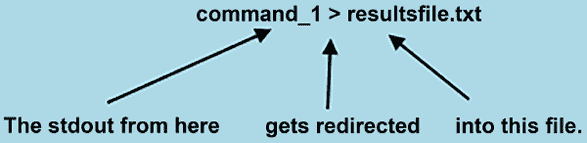

# 理解输入/输出重定向

在上一章中，我们讨论了如何在 shell 中使用变量和管道。这一次，我们将看看如何将命令的文本输出发送到终端以外的地方，终端是默认的输出设备。然后，我们将看看如何让命令从键盘以外的地方获取文本，键盘是默认的输入设备。最后，我们将讨论如何将错误消息发送到终端以外的地方。

本章的主题包括：

+   理解`stdout`

+   理解`stdin`

+   理解`stderr`

+   理解`tee`

好的，让我们开始吧。

# 输入/输出重定向简介

为了从不同的来源提取信息并进行格式化展示，我们通常需要使用各种实用工具，这些工具统称为**文本流过滤器**。当你使用文本流过滤工具时，提供输入显然是必要的。查看输出以及在出现问题时查看错误信息同样是必须的。为了这些目的，我们有了`stdin`、`stdout`和`stderr`。

+   `stdin`：这是*标准输入*的缩写。默认情况下，`stdin`来自键盘。然而，通过使用管道或重定向符号，你也可以从文件或另一个命令的输出中获取`stdin`。

+   `stdout`：这是*标准输出*的缩写。默认情况下，`stdout`会发送到你的计算机屏幕。你可以使用管道将`stdout`变成另一个命令的`stdin`，或者你可以使用重定向符号将`stdout`保存为存储设备上的文件。如果你不想看到任何输出，只需使用重定向符号将`stdout`发送到所谓的*垃圾桶*。

+   `stderr`：正如你可能猜到的，这是*标准错误*的缩写。如果命令执行不正确，你将收到一条错误消息。默认情况下，消息会显示在屏幕上。然而，你可以使用管道或重定向符号将`stderr`的输出目标改变，就像你可以操作`stdout`一样。

我之前告诉过你，在 Linux、Unix 或类似 Unix 的系统（如 FreeBSD 或 OpenIndiana）上，一切都表示为文件。`stdin`、`stdout`和`stderr`在 Linux 系统中由`/proc/`文件系统中的文件表示。在`/dev/`目录下，有指向这些文件的符号链接，正如我们所看到的：

```
[donnie@fedora ~]$ cd /dev
[donnie@fedora dev]$ ls -l std*
lrwxrwxrwx. 1 root root 15 Aug 11 13:29 stderr -> /proc/self/fd/2
lrwxrwxrwx. 1 root root 15 Aug 11 13:29 stdin -> /proc/self/fd/0
lrwxrwxrwx. 1 root root 15 Aug 11 13:29 stdout -> /proc/self/fd/1
[donnie@fedora dev]$ 
```

请注意，这些文件所在的最低级别子目录是`fd`，即**文件描述符**的缩写。所以，表示`stdin`、`stdout`和`stderr`的文件统称为文件描述符。

我不会深入探讨它是如何工作的细节，因为其实并不需要了解这些。你真正需要知道的唯一内容就是文件描述符的 ID 号，具体如下：

+   `0`：这是用于`stdin`。

+   `1`：这是用于`stdout`。

+   `2`：这是用于`stderr`。

记住这些文件描述符的编号，这些编号在所有 Linux、Unix/类 Unix 系统中都是相同的，这将帮助你理解本章稍后介绍的一些概念。

你可以使用重定向符号做以下事情：

+   将命令的输入（`stdin`）从键盘以外的地方获取。

+   让命令将其输出（`stdout`）发送到计算机屏幕以外的地方。

+   让命令将其错误消息（`stderr`）发送到计算机屏幕以外的地方。

你将会使用几个操作符符号与重定向符号搭配。大部分符号很容易理解，但你可能会发现与 `stderr` 相关的符号有点令人困惑。不过不用担心，因为我会帮你解答。我们从 `stdout` 系列的操作符开始，它包括 `>`、`>|` 和 `>>`。

# 理解标准输出（stdout）

假设你想查看某个目录中的文件列表。你不想将 `ls` 的输出通过管道传输到 `less`，而是希望将这个列表保存为文本文件，以便以后打印。以下是它如何工作的图示：



图 4.1：标准输出（stdout）是如何工作的

这是实践中的效果，我正在将 `ls` 命令的输出发送到 `filelist.txt` 文件：

```
[donnie@fedora ~]$ ls > filelist.txt
[donnie@fedora ~]$ 
```

如你所见，这相当简单。你几乎可以将任何通常将输出发送到计算机屏幕的命令，改为将其输出发送到文本文件。不过，有一点需要小心。如果你将命令的输出重定向到一个已经存在的文件，它将被覆盖，文件中所有之前的信息将会丢失。防止这种情况发生的方法有三种。

## 防止文件被覆盖

在本节中，我将展示两种防止覆盖现有文件的方法，分别是：

+   确保同名文件已经不存在，否则你将创建的新文件会覆盖它。

+   设置 `noclobber` 选项。

让我们来看一下这两种方法。

防止意外覆盖重要文件的第一种方法是最显而易见的。也就是说，在你将输出重定向到文件之前，确保同名的文件不存在。稍后我将展示如何轻松编写 Shell 脚本代码来检查这一点。

第二种方法是为你的 Shell 环境设置 `noclobber` 选项，如下所示：

```
[donnie@fedora ~]$ set -o noclobber
[donnie@fedora ~]$ 
```

你可以通过命令行或在 Shell 脚本中设置此选项。设置此选项后，如果你尝试使用重定向符号覆盖文件，`bash` 和 `zsh` 会发出错误消息，正如你在这里看到的：

```
[donnie@fedora ~]$ ls -la > filelist.txt
bash: filelist.txt: cannot overwrite existing file
[donnie@fedora ~]$ 
```

但是，如果你真的想在设置了此选项的情况下覆盖文件，你可以通过稍微修改重定向命令来实现。只需将操作符 `>` 替换为 `>|`，就像这样：

```
[donnie@fedora ~]$ ls -la >| filelist.txt
[donnie@fedora ~]$ 
```

这次没有错误消息，这意味着我确实覆盖了文件。

请注意，当你设置了 `noclobber` 选项时，这并不是一个永久设置。它会在你退出 `bash` 或 `zsh` 会话后消失。（包括你关闭终端模拟器窗口时。）同时要注意，`noclobber` 选项不会阻止你通过 `mv` 或 `cp` 命令覆盖文件从而丢失文件。它也不会阻止你通过 `rm` 命令删除文件。

## 使用文件描述符

我刚才告诉过你，`stdout` 的文件描述符是数字 `1`。如果你真的想，你可以在我展示的任何命令中包括这个文件描述符，看起来像这样：

```
[donnie@fedora ~]$ ls 1> filelist.txt
[donnie@fedora ~]$ 
```

“这有什么好处呢？”你可能会问。好吧，在这种情况下，没有任何好处。去掉 `1`，效果也一样好。但在接下来的几页中，我们会讨论 `stderr`。那时文件描述符的 ID 号*会*派上用场。

好的，关于输出的内容我们已经讲够了。现在，让我们来看看一些输入的内容。

# 理解 stdin

这样会更容易一些，因为只涉及一个运算符符号。以下是图形表示：


图 4.2：stdin 的工作原理

在我们的示例中，我们将简要介绍 `tr` 工具。（我们将在*第七章，文本流过滤器-第二部分*中更深入地解释 `tr`。目前，简单来说，它是一个用来*转换*内容的工具。）默认情况下，`tr` 会从键盘读取 `stdin`。

你可以做的一件事是输入一个全小写的文本字符串，然后让 `tr` 将其转换回全大写。输入 `tr [:lower:] [:upper:]` 命令后，按下*回车*键，再输入你的一行文本后再次按下回车。当大写的文本出现时，按下*Ctrl-d*退出 `tr`。它应该看起来像这样：

```
[donnie@fedora ~]$ tr [:lower:] [:upper:]
i only want to type in all upper-case letters.
I ONLY WANT TO TYPE IN ALL UPPER-CASE LETTERS.
[donnie@fedora ~]$ 
```

如果你需要 `tr` 从文件获取输入，只需添加适当的重定向运算符和文件名，像这样：

```
[donnie@fedora ~]$ tr [:lower:] [:upper:] < filelist.txt
15827_ZIP.ZIP
2023-08-01_15-23-31.MP4
2023-08-01_16-26-12.MP4
2023-08-02_13-57-37.MP4
21261.ZIP
. . .
. . .
YAD-FORM.SH
ZONEINFO.ZIP
[donnie@fedora ~]$ 
```

这不会改变原文件。它只会让文件内容以全大写字母显示在屏幕上。如果你想将这个转换后的输出保存到另一个文件中，只需添加一个 `stdout` 运算符和一个新文件名，像这样：

```
[donnie@fedora ~]$ tr [:lower:] [:upper:] < filelist.txt > filelist_2.txt
[donnie@fedora ~]$ 
```

当你使用这个技巧时，你总是需要为输出指定一个新文件名。如果你试图使用这个技巧只修改原文件，你最终会得到一个没有任何内容的文件。所以，输入这个命令会是一个糟糕的选择：

```
[donnie@localhost ~]$ tr [:lower:] [:upper:] < filelist.txt > filelist.txt
[donnie@localhost ~]$ 
```

当然，你也可以在这个技巧中使用 `>>` 运算符将新信息追加到原文件中，像这样：

```
 [donnie@localhost ~]$ tr [:lower:] [:upper:] < testfile.txt >> testfile.txt
    [donnie@localhost ~]$ 
```

`stdin` 和 `stdout` 运算符相对容易理解。`stderr` 运算符不难，但它的某些方面可能有点棘手。所以，在开始之前，坐下来，深呼吸，放松一下。准备好了吗？好，开始吧。

# 理解 stderr

用于`stderr`的重定向操作符是`2>`和`2>>`。如果你想知道为什么，那是因为我们几页前看过的文件描述符 ID 号码。`stderr`的 ID 号码恰好是`2`。一如既往，这里是图形表示：


图 4.3：stderr 的工作原理

如果你运行一个命令，出了问题，它会通过`stderr`输出一个错误消息。默认情况下，这条消息将被发送到计算机屏幕。同样默认情况下，`stderr`消息与`stdout`消息混合在一起。因此，如果你的命令同时输出良好的数据和错误消息，你需要在屏幕上滚动输出消息以区分两者。幸运的是，你可以使用重定向符来改变这种行为。为了展示这是如何工作的，让我们再次看一下我们在*第二章，解释命令*中讨论过的`find`实用程序。

如果你作为普通用户登录到计算机上，并使用`find`命令搜索整个文件系统，当`find`尝试访问你没有权限访问的目录时，你会收到错误消息。你也会得到良好的输出，但请注意，良好的输出在这个例子中和错误的输出混合在一起：

```
[donnie@fedora ~]$ find / -name README
find: '/boot/loader/entries': Permission denied
find: '/boot/lost+found': Permission denied
find: '/boot/efi': Permission denied
find: '/boot/grub2': Permission denied
find: '/dev/vboxusb': Permission denied
/home/donnie/.cache/go-build/README
. . .
. . .
/home/donnie/Downloads/lynis/README
/home/donnie/Downloads/lynis/extras/README
/home/donnie/Downloads/lynis/plugins/README
[donnie@fedora ~]$ 
```

如果你在这个命令后面加上一个`2>`重定向符和一个文件名，你可以将错误消息发送到一个文本文件中，这样你就可以在屏幕上只看到良好的数据。这是它的工作原理：

```
[donnie@fedora ~]$ find / -name README 2> find_error.txt
/home/donnie/.cache/go-build/README
/home/donnie/.local/share/containers/storage/overlay/994393dc58e7931862558d06e46aa2bb17487044f670f310dffe1d24e4d1eec7/diff/etc/profile.d/README
/home/donnie/.local/share/containers/storage/overlay/63ba8d57fba258ed8ccaec2ef1fd9e3e27e93f7f23d0683bd83687322a68ed29/diff/etc/fonts/conf.d/README
. . .
. . .
/home/donnie/Downloads/lynis/README
/home/donnie/Downloads/lynis/extras/README
/home/donnie/Downloads/lynis/plugins/README
[donnie@fedora ~]$ 
```

你可以结合重定向符，将`stdout`发送到一个文本文件，将`stderr`发送到另一个文本文件，像这样：

```
[donnie@fedora ~]$ find / -name README > find_results.txt 2> find_error.txt
[donnie@fedora ~]$ 
```

如果你不想看到任何错误消息，只需将`stderr`发送到`/dev/null`设备，有些圈子称之为臭名昭著的*位桶*。任何发送到那里的东西都永远不会见天日。这是它的外观：

```
[donnie@fedora ~]$ find / -name README 2> /dev/null
/home/donnie/.cache/go-build/README
/home/donnie/.local/share/containers/storage/overlay/994393dc58e7931862558d06e46aa2bb17487044f670f310dffe1d24e4d1eec7/diff/etc/profile.d/README
/home/donnie/.local/share/containers/storage/overlay/63ba8d57fba258ed8ccaec2ef1fd9e3e27e93f7f23d0683bd83687322a68ed29/diff/etc/fonts/conf.d/README
. . .
. . .
/home/donnie/Downloads/lynis/README
/home/donnie/Downloads/lynis/extras/README
/home/donnie/Downloads/lynis/plugins/README
[donnie@fedora ~]$ 
```

如果你想把好的数据发送到位桶，这样你就只会看到错误消息，你可以使用这个命令：

```
[donnie@fedora ~]$ find / -name README > /dev/null
find: '/boot/loader/entries': Permission denied
find: '/boot/lost+found': Permission denied
find: '/boot/efi': Permission denied
find: '/boot/grub2': Permission denied
. . .
. . .
find: '/var/tmp/systemd-private-075495f99a0e4571a4507a921ef61dab-chronyd.service-vVTD10': Permission denied
find: '/var/tmp/systemd-private-075495f99a0e4571a4507a921ef61dab-ModemManager.service-CG1GeZ': Permission denied
[donnie@fedora ~]$ 
```

你也可以使用`2>>`操作符将错误消息附加到现有文件中，就像这样：

```
[donnie@fedora ~]$ cd /far 2> error.txt
[donnie@fedora ~]$ cat error.txt
bash: cd: /far: No such file or directory
[donnie@fedora ~]$ cd /fat 2>> error.txt
[donnie@fedora ~]$ cat error.txt
bash: cd: /far: No such file or directory
bash: cd: /fat: No such file or directory
[donnie@fedora ~]$ 
```

到目前为止，一切都很顺利。现在，正如承诺的那样，我们来看一下可能会有点令人困惑的部分。嗯，实际上，它并不*那么*令人困惑。只是我们要使用一点缩写，需要一点时间来适应。

假设你想要将`stdout`和`stderr`同时发送到同一个地方。这意味着你必须用两个不同的重定向符输入目的地吗？多亏了这个简写，答案是*不用*。它是这样工作的。

如果你希望`stderr`和`stdout`都发送到同一个文本文件中，只需输入你的命令，带有常规的`stdout`操作符和目的地。然后，在最后追加`2>&1`。如果你需要一种帮助理解这一点的方法，只需记住`stderr`是文件描述符`2`，而`stdout`是文件描述符`1`。所以，你可以把它读作，`stderr`（ID`2`）*去*与`stdout`（ID`1`）*去同一个地方*。

要将`find`操作的`stderr`和`stdout`都发送到同一个文本文件中，你可以输入：

```
[donnie@fedora ~]$ find / -name README > find_results.txt 2>&1
[donnie@fedora ~]$ 
```

可能会有一些情况，你不希望从`stderr`或`stdout`中获取任何输出。例如，如果你需要在后台运行一个备份任务，你就不希望任何屏幕输出打乱你正在前台编辑的文本文件。（你也不需要将任何输出保存到文本文件。）为此，你可以输入如下内容：

```
[donnie@fedora ~]$ find \( -iname '*.txt' -mtime -1 \) -exec cp {} /backup/ \; > /dev/null 2>&1
[donnie@fedora ~]$ 
```

（注意，我已经设置了`/backup/`目录的权限，以便我可以用普通用户权限进行写操作。）

我认为这就是关于`stderr`的全部内容了。现在，作为额外的奖励，我会展示如何将输出同时发送到屏幕和文本文件。

# 理解 tee 命令

`tee`命令相当独特，因为它并不是一个普通的重定向器。它是一个工具，可以同时将命令的输出发送到屏幕和文件中。因此，和我们之前使用重定向符号的方式不同，你会通过管道将输入传递给它。

如果你需要同时查看命令的输出并将其保存为文本文件，可以像这样将命令的输出通过`tee`工具进行管道传输：

```
[donnie@fedora ~]$ ps a | tee ps.txt
    PID TTY      STAT   TIME COMMAND
    972 tty1     Ss+    0:00 -bash
   1005 pts/0    Ss     0:00 -bash
   1076 pts/0    R+     0:00 ps a
   1077 pts/0    S+     0:00 tee ps.txt
[donnie@fedora ~]$ ls -l ps.txt
-rw-r--r--. 1 donnie donnie 181 Aug 12 17:29 ps.txt
[donnie@fedora ~]$ 
```

请注意，你不需要在此命令中使用`stdout`操作符（`>`）。文本文件的名称作为`tee`的参数使用。

如果你用相同的文件名运行另一个命令，第一个创建的文件将被覆盖。（当然，你可以通过设置`noclobber`选项来防止这种情况，就像我刚才展示的那样。）如果你想将输出追加到现有文件中，可以使用`-a`选项，像这样：

```
[donnie@fedora ~]$ ps a | tee -a ps.txt
    PID TTY      STAT   TIME COMMAND
    972 tty1     Ss+    0:00 -bash
   1005 pts/0    Ss     0:00 -bash
   1087 pts/0    R+     0:00 ps a
   1088 pts/0    S+     0:00 tee -a ps.txt
[donnie@fedora ~]$ 
```

`tee`命令还有另一个你一定需要了解的用途。只不过有时候，你可能需要创建一个 shell 脚本，自动创建或更新`/etc/`目录中的配置文件。看似逻辑上，你应该使用`echo`命令，并使用`>`或`>>`操作符来完成这一操作。但看看当我尝试这么做时发生了什么：

```
[donnie@fedora ~]$ sudo echo "This is a new setting." > /etc/someconfig.cfg
-bash: /etc/someconfig.cfg: Permission denied
[donnie@fedora ~]$ sudo echo "This is a new setting." >| /etc/someconfig.cfg
-bash: /etc/someconfig.cfg: Permission denied
[donnie@fedora ~]$ sudo echo "This is a new setting." >> /etc/someconfig.cfg
-bash: /etc/someconfig.cfg: Permission denied
[donnie@fedora ~]$ 
```

如你所见，shell 不允许我将输出重定向到`/etc/`目录中的文件，即使我使用了`sudo`权限。（好吧，如果你实际登录 root 用户的 shell，是可以做到的，但假设我们不想这么做。）解决方法是使用`tee`，如你所见：

```
[donnie@fedora ~]$ echo "This is a new setting." | sudo tee /etc/someconfig.cfg
This is a new setting.
[donnie@fedora ~]$ ls -l /etc/someconfig.cfg
-rw-r--r--. 1 root root 23 Aug 12 17:47 /etc/someconfig.cfg
[donnie@fedora ~]$ 
```

当在命令行中运行时，我必须在`tee`命令前加上`sudo`。如果你将像这样的命令放入 shell 脚本中，你就可以省略`sudo`，因为你将以`sudo`权限运行整个脚本。

现在，尽管`tee`听起来很酷，但有一个小小的限制。也就是说，`tee`始终将正常输出和错误信息都发送到屏幕，但只会将正常输出发送到指定的文件。

到目前为止，在我解释的过程中，你应该很容易跟上并在你自己的 shell 中操作。现在事情有点复杂了，我们通过进行一个实际的实践实验室来把这些内容结合起来。

# 实践实验室 – 管道、重定向器和 find 命令

对于本次任务，你将使用管道和重定向器。为了看到这个练习的完整效果，你需要作为普通用户登录，而*不是*以 root 身份登录。

1.  输入以下内容，注意你故意输入了一个不存在的目录名来生成错误信息。

    ```
    find /far -iname '*' 
    ```

1.  注意输出，然后输入：

    ```
    find /far -iname '*' 2> error.txt
    cat error.txt 
    ```

1.  输入以下命令以创建文件列表并查看文件数量：

    ```
    find / -iname '*.txt' > filelist.txt 2> error_2.txt
    find / -iname '*.txt' 2> /dev/null | wc -l
    less filelist.txt
    less error_2.txt 
    ```

如果你作为普通用户登录，而不是 root 身份登录，这应该会生成一些错误信息，表示你没有权限查看某些目录。`.txt`文件的列表将被写入`filelist.txt`文件，错误信息将写入`error_2.txt`文件。

1.  输入以下命令以搜索 README 文件：

    ```
    find / -name README > files_and_errors.txt 2>&1
    less files_and_errors.txt 
    ```

这次，命令末尾追加的`2>&1`导致错误信息和文件列表都发送到了同一个文件。

1.  对于下一个操作，你将把文件列表同时发送到屏幕和文件中。请输入：

    ```
    find / -name README | tee filelist_2.txt
    less filelist_2.txt 
    ```

请注意，文件列表和错误信息都会打印在屏幕上，但只有文件列表会写入文件中。

1.  创建一个模拟的备份目录，如下所示：

    ```
    sudo mkdir /backup
    sudo chown your_user_name:your_user_name /backup 
    ```

1.  将过去一天内创建的所有.txt 文件复制到`/backup/`目录，并将所有屏幕输出发送到`/dev/null`设备：

    ```
    find \( -iname '*.txt' -mtime -1 \) -exec cp {} /backup/ \; > /dev/null 2>&1 
    ```

1.  查看`/backup/`目录中的文件：

    ```
    ls -l /backup 
    ```

实验结束

好的，本章内容差不多就这些。让我们总结一下并继续前进。

# 总结

本章我们讨论了输入/输出重定向的概念。其实这是一个简单的概念。它只是意味着我们要么从键盘之外的地方获取输入，要么将输出发送到屏幕之外的地方。我们了解了重定向操作符，如何使用它们，以及使用不当时的一些陷阱。

在下一章中，我们将探讨如何修改你的 shell 环境。到时见。

# 问题

1.  `stdin`的文件描述符号是多少？

    1.  `0`

    1.  `1`

    1.  `2`

    1.  `3`

1.  以下哪些操作符用于`stdin`？

    1.  `>`

    1.  `>>`

    1.  `<`

    1.  `<<`

1.  如果运行此命令，会发生什么？

    ```
    tr [:lower:] [:upper:] < filelist.txt > filelist.txt 
    ```

    1.  `filelist.txt`文件将被更新的输出覆盖。

    1.  `tr`的输出将会追加到文件末尾。

    1.  你将收到一条警告信息。

    1.  `filelist.txt`文件的内容将被清除，最终只会留下一个空文件。

1.  `stdin`的默认设备是什么？

    1.  键盘

    1.  终端

    1.  鼠标

    1.  命名管道

1.  你会使用哪个操作符将`stderr`和`stdout`发送到同一个地方？

    1.  `2>1&`

    1.  `2>&1`

    1.  `2&1`

    1.  `2>1`

# 进一步阅读

+   在 Bash 中使用重定向操作符的五种方式：[`www.redhat.com/sysadmin/redirect-operators-bash`](https://www.redhat.com/sysadmin/redirect-operators-bash)

+   如何在 Linux 中使用 shell 重定向和管道操作文件：[`www.redhat.com/sysadmin/linux-shell-redirection-pipelining`](https://www.redhat.com/sysadmin/linux-shell-redirection-pipelining)

+   如何重定向 Shell 命令输出：[`www.redhat.com/sysadmin/redirect-shell-command-script-output`](https://www.redhat.com/sysadmin/redirect-shell-command-script-output)

# 答案

1.  a

1.  c

1.  d

1.  a

1.  b

# 加入我们的 Discord 社区！

与其他用户、Linux 专家以及作者本人一起阅读本书。

提问、为其他读者提供解决方案、通过“问我任何问题”环节与作者交流，等等。扫描二维码或访问链接加入社区。

[`packt.link/SecNet`](https://packt.link/SecNet)


