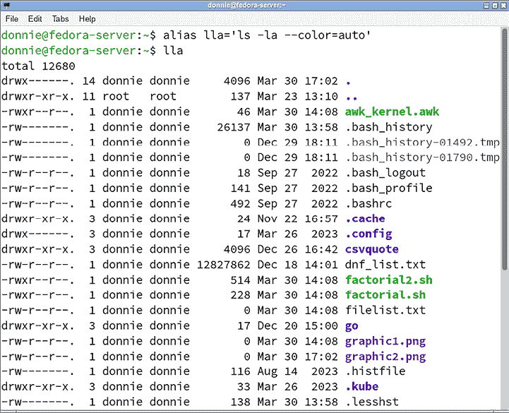
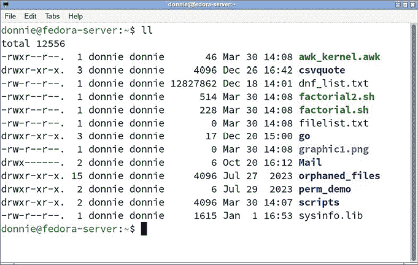
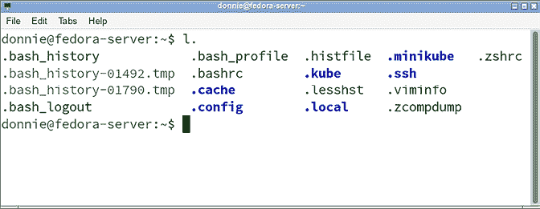

# 第五章：自定义环境

在本章中，我们将查看 `bash` shell 环境的各种配置文件。我们将看看如何自定义这些配置文件，以及如何从命令行设置某些环境选项。

本章的主题包括：

+   审查环境变量

+   理解配置文件

+   从命令行设置 shell 选项

我现在坚持使用 `bash`，但在*第二十二章，理解 Z Shell*中，我会解释如何设置 `zsh`。 

如果你已经迫不及待，我们就开始吧。

# 技术要求

对于本章，你需要一台 Fedora 虚拟机和一台 Debian 虚拟机。我不会提供本章的动手实验。相反，我会邀请你在阅读本章时跟随你的虚拟机操作。

# 审查环境变量

在*第三章，理解变量与管道*中，我介绍了环境变量的概念。在本章中，我将进一步展开这个话题。

我们已经看到，环境变量可以帮助自定义和控制你的 shell 环境。以下是一些常见环境变量的表格：

| **环境变量** | **用途** |
| --- | --- |
| `USER` | 当前登录系统的用户的用户名。 |
| `UID` | 当前登录用户的用户 ID。 |
| `EUID` | 运行某个进程的用户的有效用户 ID。 |
| `MAIL` | 这定义了当前登录用户的邮件队列路径。 |
| `SHELL` | 当前使用的 shell 路径。 |
| `PWD` | 当前工作目录。（PWD 代表“打印工作目录”）。 |
| `OLDPWD` | 上一个工作目录。 |
| `HOSTNAME` | 计算机的主机名。 |
| `PATH` | 一个以冒号分隔的目录列表，系统在你输入可执行程序名称时会搜索这些目录。这个变量是在多个配置文件中构建的，比如 `/etc/profile` 和用户主目录中的 `.bashrc` 文件。 |
| `HOME` | 这是当前用户的主目录路径。一些程序会使用这个变量来确定配置文件的位置或决定存储文件的默认位置。 |
| `PS1` | 主 shell 提示符。 |
| `PS2` | 次要 shell 提示符。 |
| `TERM` | 这指定了当前的终端类型。在非登录会话和通过远程图形界面终端模拟器的登录会话中，你可能会看到它被设置为 `xterm` 或某种形式的 `xterm`，而在本地控制台的登录会话中则通常为 `Linux`。（我将在下一节中解释会话类型。）系统需要知道当前使用的是哪种终端类型，这样它才能知道如何在文本模式程序中移动光标和显示文本效果。 |
| `DISPLAY` | 该变量允许你在同一台计算机上运行多个显示器。如果你只运行一个显示器，你会看到返回值为 `:0`。（这意味着当前计算机上的第一个显示器。） |
| `EDITOR` | 该变量设置你希望用于系统管理功能（如 `systemctl edit` 和 `crontab -e`）的默认文本编辑器。通常，最佳选择是 `nano` 或 `vim`。 |

表 5.1：更常见的环境变量

这里稍微复杂的地方是，环境变量在不同的 Linux 发行版中并不完全相同。例如，`EDITOR` 变量在我的 Fedora 工作站上有定义，但在任何 Debian 或 Ubuntu 发行版上都没有使用。相反，Debian 和 Ubuntu 使用另一种机制来设置默认编辑器，我们稍后会讨论。

现在，在我能完全解释 `bash` 配置文件之前，我需要先解释不同类型的 Shell 会话。

# 理解 Shell 会话

每次你启动与 Shell 的交互时，你都在创建一个 **Shell 会话**。Shell 会话可以按照以下方式分类：

+   **交互式 Shell：** 当你坐在计算机前并在命令行上输入命令时，你正在使用交互式 Shell。

+   **非交互式 Shell：** 当从 Shell 脚本中调用一个 Shell 会话时，你正在使用非交互式 Shell。

+   **登录 Shell：** 如果你登录到一台运行在文本模式下且没有图形界面的 Linux 机器，你正在使用登录 Shell。你也可以通过调用 *Ctrl-Alt-Function_Key* 组合键，在桌面机器上将桌面界面切换到文本模式终端，从而使用登录 Shell。（你可以使用 F1 到 F6 的功能键来完成此操作。）或者，你可以在正常的终端模拟器中调用 `bash -l` 命令来以登录模式打开一个子 `bash` 会话。启动登录 Shell 会话的最终方式是通过安全外壳（SSH）远程登录到一台机器。无论远程机器是文本模式还是图形用户界面（GUI）模式，你的远程会话都将是登录 Shell 类型的。

+   **非登录 Shell：** 每次你在桌面 Linux 机器上打开一个终端模拟器时，你正在使用非登录 Shell。

那么，这一切意味着什么呢？嗯，交互式 Shell 和非交互式 Shell 之间的区别比较明显，所以我就不再多说了。但我想指出两种方法，帮助你判断自己是否正在使用登录 Shell 或非登录 Shell。

第一种方法是使用 `shopt` 命令，像这样：

```
[donnie@fedora ~]$ shopt login_shell
login_shell    	off
[donnie@fedora ~]$ 
```

`shopt` 命令可以用来为 `bash` 会话设置各种配置选项。在这里，我没有使用任何选项开关，而只是查看 `login_shell` 设置。你可以看到 `login_shell` 设置为 `off`，这意味着我在 Fedora 工作站上使用的是非登录 Shell。而在我的文本模式 Fedora 服务器虚拟机上，`shopt` 输出是这样的：

```
[donnie@fedora-server ~]$ shopt login_shell
login_shell    	on
[donnie@fedora-server ~]$ 
```

如你所见，`login_shell` 参数是 `on`。

判断是否处于登录 shell 的第二种方法是使用 `echo $0` 命令，像这样：

```
[donnie@fedora ~]$ echo $0
bash
[donnie@fedora ~]$ 
```

`$0` 参数被称为 **位置参数**。我将在 *第八章，基本 Shell 脚本构建* 中深入讲解位置参数，所以现在不必担心它们。你现在需要知道的仅仅是，`echo $0` 命令显示的是当前使用的脚本或可执行文件的名称。

在这种情况下，我们处于一个 `bash` 会话中，这意味着正在使用 `bash` 可执行文件。但是，我们怎么知道自己是否使用的是登录 shell 呢？其实，`bash` 输出前面没有破折号，这意味着我们不在登录 shell 中。为了显示区别，以下是你在文本模式的 Fedora 服务器虚拟机上看到的内容：

```
[donnie@fedora-server ~]$ echo $0
-bash
[donnie@fedora-server ~]$ 
```

`-bash` 输出表示我在一个登录 shell 中。

即使从远处，我也能读懂你的心思。（是的，我知道这很吓人。）我知道你在想，为什么你需要了解这些不同类型的 Shell 会话。其实，是因为有几个不同的 `bash` 配置文件。你使用的 shell 会话类型决定了该会话访问哪些配置文件。所以，现在你已经了解了不同类型的 Shell 会话，我们可以来看看这些配置文件。

# 理解配置文件

如我们已经看到的，你可以通过命令行设置环境变量。但是，任何你以这种方式设置的变量只会在命令行会话期间有效。当你退出系统或关闭终端仿真窗口时，命令行中所做的任何环境更改都会丢失。

如果我们想让这些更改永久生效怎么办？有几个配置文件可以编辑以保存我们的更改。有些是全局的，会影响所有用户，而另一些则只会影响单个用户。稍微复杂的是，这些文件在不同的 Linux 发行版之间有所不同。我们先来看 Fedora 上的 `bash` 配置文件。之后，我们再看看 Debian。

## Fedora 上的 bash 全局配置文件

如我们已经看到的，在 `/etc/` 目录中有全局配置文件，在每个用户的主目录中有用户配置文件。对于全局配置，我们有这两个文件：

+   `/etc/profile`

+   `/etc/bashrc`

`/etc/profile` 文件为任何打开 `bash` 登录 shell 会话的用户设置环境，并在用户登录后立即执行。打开它并浏览，你会看到一个相当复杂的 Shell 脚本，执行以下功能：

+   它为 root 用户和所有使用登录 shell 的非 root 用户定义了默认的 `PATH` 设置。

+   它定义了与每个登录用户相关的各种环境变量。这些变量包括 `UID`、`EUID`、`USER`、`LOGNAME` 和 `MAIL`。

+   它设置了机器的 `HOSTNAME`。

+   它设置了`HISTSIZE`变量，该变量定义了每个用户的命令历史中将保留多少条过去的命令。

+   完成上述操作后，它会读取`/etc/profile.d/`目录中的各种配置脚本。大多数这些脚本定义了某些系统工具的系统范围行为。还有一个脚本用于设置自动打开文本编辑器的系统工具的默认`EDITOR`。

当然，到目前为止，我不指望你完全理解该配置文件中的内容。然而，你在这个文件中看到的正是我们将在本书后续部分覆盖的内容。一旦你完成了所有的学习，你将能更好地理解这个文件究竟在做什么。

另一个全局配置文件是`/etc/bashrc`文件，它影响非登录 Shell 会话。它为我们做了几件不同的事情，但就目前的目的而言，只需要知道这是为交互式会话定义`PS1`变量的地方，并且它为使用非登录 Shell 的用户定义了`PATH`设置。

除了这两个主要文件之外，`/etc/profile.d/`目录中还有一些补充的配置文件，如你所见：

```
[donnie@fedora profile.d]$ ls
bash_completion.sh  colorxzgrep.sh   gawk.csh  sh.local
colorgrep.csh           colorzgrep.csh     gawk.sh   vim-default-editor.csh
colorgrep.sh             colorzgrep.sh      lang.csh    vim-default-editor.sh
colorls.csh               csh.local              lang.sh      which2.csh
colorls.sh                debuginfod.csh     less.csh     which2.sh
colorxzgrep.csh      debuginfod.sh      less.sh
[donnie@fedora profile.d]$ 
```

每个文件包含了针对 Shell 环境的补充配置信息。通常，每个文件为我们做了以下两件事情中的一件：

+   为某些其他命令创建别名。（我们稍后将讨论别名。）

+   定义在`/etc/profile`或`/etc/bashrc`文件中尚未定义的环境变量。

作为第二个功能的简单示例，让我们看一下`EDITOR`变量的定义。在 Fedora 的服务器版本中，它将位于`/etc/profile.d/vim-default-editor.sh`文件中，而在 Fedora 的工作站版本中，它将位于`/etc/profile.d/nano-default-editor.sh`文件中。以下是服务器版本的内容：

```
# Ensure vim is set as EDITOR if it isn't already set
if [ -z "$EDITOR" ]; then
    export EDITOR="/usr/bin/vim"
fi 
```

再次说明，我并不期望你现在完全理解这一切。所以目前简单的解释是，如果`EDITOR`环境变量尚未设置，那么它将被设置为`/usr/bin/vim`。（在 Fedora 的工作站版本中，`EDITOR`将设置为`/usr/bin/nano`。）

有时候，管理员可能需要更改在`/etc/profile`或`/etc/bashrc`中定义的默认环境设置。你可以通过编辑`/etc/profile`或`/etc/bashrc`文件来实现，但这并不推荐。相反，应该将新的设置放入`/etc/profile.d/sh.local`文件中。目前，除了一个说明性注释外，该文件没有其他内容，如下所示：

```
#Add any required envvar overrides to this file, it is sourced from /etc/profile 
```

好的，这就是 Fedora 的全局配置文件的内容。现在让我们来看看用户的配置文件。

## Fedora 上的用户配置文件

用户主目录中的 Shell 配置文件被视为隐藏文件，因为它们的文件名以点号开头。要查看这些文件，你需要使用`ls`命令的`-a`选项，像这样：

```
[donnie@fedora ~]$ ls -la
total 20
drwx------. 3 donnie donnie  111 Aug 26 16:28 .
drwxr-xr-x. 3 root   root         20 Aug 19 18:15 ..
-rw-------. 1 donnie donnie 1926 Aug 26 15:51 .bash_history
-rw-r--r--. 1 donnie donnie      18 Feb  5  2023 .bash_logout
-rw-r--r--. 1 donnie donnie    141 Feb  5  2023 .bash_profile
-rw-r--r--. 1 donnie donnie    492 Feb  5  2023 .bashrc
-rw-------. 1 donnie donnie     37 Aug 26 16:28 .lesshst
drwx------. 2 donnie donnie   48 Aug 21 14:13 .ssh
[donnie@fedora ~]$ 
```

只有这三个文件对我们有关系，它们是：

+   `.bash_logout`：此文件目前为空，只有一条说明性注释。你放在此文件中的任何命令将会在从交互式登录 Shell 会话退出时执行，或者当在 Shell 脚本的末尾调用`exit`函数时执行。除了其他功能外，你可以使用此文件在用户退出 Shell 会话时自动清理临时文件，或者执行用户主目录中文件的自动备份。

+   `.bash_profile`：此文件仅用于登录 Shell 会话。因此，如果你在桌面计算机上打开终端模拟器，文件中的任何内容都不会产生影响。如果你查看该文件的内容，你会看到它默认唯一的作用就是读取`.bashrc`文件。

+   `.bashrc`：这是用户级的主要 bash 配置文件，直接影响非登录 Shell 会话。由于`.bash_profile`文件会使`.bashrc`文件在登录 Shell 会话中被读取，因此你放入`.bashrc`中的任何内容都会影响登录会话和非登录会话。

那么，这在实际操作中是如何运作的呢？假设你需要将`/opt/`目录添加到你的工作`PATH`中。当前，`PATH`看起来是这样的：

```
[donnie@fedora-server ~]$ echo $PATH
/home/donnie/.local/bin:/home/donnie/bin:/usr/local/bin:/usr/bin:/usr/local/sbin:/usr/sbin
[donnie@fedora-server ~]$ 
```

若要添加`/opt/`目录，请在文本编辑器中打开`.bashrc`文件，找到这一段内容：

```
if ! [[ "$PATH" =~ "$HOME/.local/bin:$HOME/bin:" ]]
then
    PATH="$HOME/.local/bin:$HOME/bin:$PATH"
fi 
```

将其更改为如下所示：

```
if ! [[ "$PATH" =~ "$HOME/.local/bin:$HOME/bin:" ]]
then
    PATH="$HOME/.local/bin:$HOME/bin:$PATH:/opt:"
fi 
```

登出并重新登录。你的`PATH`设置现在应该是这样的：

```
[donnie@fedora-server ~]$ echo $PATH
/home/donnie/.local/bin:/home/donnie/bin:/usr/local/bin:/usr/bin:/usr/local/sbin:/usr/sbin:/opt:
[donnie@fedora-server ~]$ 
```

现在，你可以将可执行脚本或二进制可执行文件放入`/opt/`目录，并且无需指定完整路径即可运行它们。

若要永久更改你的命令提示符设置，使其也能显示当前的日期和时间，请将以下这一行添加到`.bashrc`文件的末尾：

```
export PS1="[\d \t \u@\h \w] \$ " 
```

登出并重新登录。你的命令提示符现在应该是这样的：

```
[Tue Aug 29 17:13:55 donnie@fedora-server ~] $ 
```

所以，这一切看起来都很酷，对吧？为了增加更多的酷炫感，让我们继续讨论 Debian 的配置文件。

## Debian 上的 bash 全局配置文件

在 Debian 中，情况略有不同。`/etc/profile`文件仍然存在，但与 Fedora 上的版本有着根本的不同。你可以在你自己的虚拟机上查看它。你会看到，它所做的只是定义`PATH`和`PS1`变量，并读取`/etc/profile.d/`目录中的任何补充文件。如果会话是一个实际的`bash`会话，而不是`sh`会话，它还会读取`/etc/bash.bashrc`文件。此外，你会看到 Debian 在定义`PATH`时使用了一种与 Fedora 方法完全不同的方式。

与 Fedora 使用的`/etc/bashrc`文件不同，Debian 使用`/etc/bash.bashrc`文件。该文件为我们做了以下几件事：

+   它检查运行 `bash` 会话的窗口大小，以便在用户输入命令后正确显示行数和列数。

+   它定义了 `PS1` 变量。

+   如果用户输入 `bash` 找不到的命令，并且没有安装 `command-not-found` 软件包，它会调用 `command_not_found_handle` 函数。

在 `bash.bashrc` 文件的顶部，你会看到它会在交互式 shell 会话中被调用，并且如果 `profile` 文件引用了它，它也会在登录 shell 会话中被调用。我们已经看到 `profile` 文件确实引用了它，所以我们知道 `bash.bashrc` 会在登录和非登录的交互式会话中运行。

当一个配置文件从另一个配置文件中读取信息时，我们称第一个文件为**源文件**，第二个文件为被源文件引用的文件。

与 Fedora 不同，`/etc/profile.d/` 目录在 Debian 中默认没有什么作用。你在这里唯一能看到的就是 `bash_completion.sh` 脚本。正如你稍后会看到的那样，Fedora 上在 `/etc/profile.d/` 目录中定义的别名，在 Debian 中会定义在用户的配置文件里。

## Debian 上的用户配置文件

在 Debian 系统的每个用户主目录中，我们都有以下这些 bash 配置文件：

+   `.bash_logout`：这与 Fedora 上的 `.bash_logout` 文件相同，不同之处在于它包含一个命令，该命令在注销登录会话时会清屏。

+   `.profile`：这个文件替代了 Fedora 上的 `.bash_profile`，并且具有相同的作用。

+   `.bashrc`：它执行与 Fedora 上的 `.bashrc` 文件相同的操作，且更多。它还定义了一些在 Fedora 上全局定义的环境变量，并且定义了一些在 Fedora 的 `/etc/profile.d/` 目录中定义的别名。

正如我之前所说，我并不指望你阅读这些配置文件并完全理解它们的作用。这就是为什么我只展示了一些小片段，而不是详细解释每个文件。在你完全阅读完这本书后，你将对它们有更深入的理解。

我还应该指出，每个 Linux 发行版家庭的 `bash` 配置文件设置方式都不同。我无法覆盖所有的配置，但你可以根据我在这里讲的内容，大致了解它们的作用。

## 在 Debian 上设置默认编辑器

哎呀，我差点忘了向你展示如何更改 Debian 的默认编辑器，因为我们不能通过设置环境变量来做到这一点。那么，接下来让我们来看一下。

在 Debian 系统上，默认编辑器是通过一对符号链接定义的，如你所见：

```
donnie@debian:~$ ls -l /usr/bin/editor
lrwxrwxrwx 1 root root 24 Jan 18  2023 /usr/bin/editor -> /etc/alternatives/editor
donnie@debian:~$ cd /etc/alternatives/
donnie@debian:/etc/alternatives$ ls -l editor
lrwxrwxrwx 1 root root 9 Jan 18  2023 editor -> /bin/nano
donnie@debian:/etc/alternatives$ 
```

`/usr/bin/` 目录中的 `editor` 符号链接指向 `/etc/alternatives/` 目录中的 `editor` 符号链接，而后者又指向位于 `/bin/` 目录中的 `nano` 可执行文件。这告诉我们 `nano` 被设置为默认编辑器。要在 Debian 系统上更改默认编辑器，首先需要确保你想使用的编辑器已安装。然后，使用 `update-alternatives` 工具，如下所示：

```
donnie@debian:~$ sudo update-alternatives --config editor
[sudo] password for donnie:
There are 3 choices for the alternative editor (providing /usr/bin/editor).
  Selection    Path                Priority   Status
------------------------------------------------------------
* 0            /bin/nano            40        auto mode
  1            /bin/nano            40        manual mode
  2            /usr/bin/vim.basic   30        manual mode
  3            /usr/bin/vim.tiny    15        manual mode
Press <enter> to keep the current choice[*], or type selection number: 2   
update-alternatives: using /usr/bin/vim.basic to provide /usr/bin/editor (editor) in manual mode
donnie@debian:~$ 
```

我选择了 `2` 选项来将 `vim` 设置为默认编辑器。让我们看看这如何改变 `/etc/alternatives/` 目录中的符号链接：

```
donnie@debian:~$ ls -l /etc/alternatives/editor
lrwxrwxrwx 1 root root 18 Sep  2 15:26 /etc/alternatives/editor -> /usr/bin/vim.basic
donnie@debian:~$ 
```

非常酷。这让我可以使用我最喜欢的编辑器。

好的，现在我们已经查看了配置文件，接下来让我们看看另一种自定义 shell 会话的方法。

# 从命令行设置 Shell 选项

除了使用环境变量来修改 shell 会话外，你还可以使用 **shell 选项**。你可以使用 `set` 命令从命令行或 shell 脚本中设置 shell 选项。你还可以仅从命令行查看已设置的选项。

你可以使用 Fedora 或 Debian 虚拟机进行本节操作。除了涉及手册页的小差异外，其他部分在这两者上都是一样的。

首先，让我们调用不带任何选项或参数的 `set` 命令，如下所示：

```
[donnie@fedora-server ~]$ set
BASH=/bin/bash
BASHOPTS=checkwinsize:cmdhist:complete_fullquote:expand_aliases:extglob:extquote:force_fignore:globasciiranges:globskipdots:histappend:interactive_comments:login_shell:patsub_replacement:progcomp:promptvars:sourcepath
. . .
. . .
quote_readline ()
{
    local ret;
    _quote_readline_by_ref "$1" ret;
    printf %s "$ret"
}
[donnie@fedora-server ~]$ 
```

你将看到一个完整的环境变量和 **shell 函数** 列表，它们对于当前的 shell 会话是活动的。（我将在 *第十章，理解函数* 中详细讲解 shell 函数。）

使用 `set -o` 命令仅查看活动的 shell 选项列表，像这样：

```
[donnie@fedora-server ~]$ set -o
allexport      	off
braceexpand    	on
emacs          	on
errexit        	off
errtrace       	off
functrace      	off
hashall        	on
histexpand     	on
history        	on
. . .
. . .
xtrace         	off
[donnie@fedora-server ~]$ 
```

我不会详细讲解这些选项的作用，但我会告诉你如何找出它们的作用。唯一的诀窍是，有一点小技巧。也就是说，并没有专门为 `set` 命令提供的手册页。当你在 Fedora 系统上执行 `man set` 时，实际上会打开 `bash` 的手册页。在 Debian 系统上，你需要执行 `man bash`，因为 `man set` 根本无法使用。原因在于，`set` 命令是内建在 `bash` 可执行文件中的，并没有单独的可执行文件。一旦打开了 `bash` 的手册页，你需要在其中查找 `set` 命令及其所有选项的说明。现在，我们来看几个更有用的选项以及如何设置它们。

在 *第四章，理解输入/输出重定向* 中，我告诉过你 `noclobber` 选项如何帮助防止你不小心覆盖重要的文件。默认情况下，`noclobber` 是关闭的，如你所见：

```
[donnie@fedora-server ~]$ set -o | grep noclobber
noclobber      	off
[donnie@fedora-server ~]$ 
```

启用和禁用选项的方式完全违反直觉。你将使用 `set -o` 命令来启用选项，使用 `set +o` 命令来禁用选项，这正好与你想的相反。（我不知道为什么有人决定这样做。但不管了，对吧？）假设我们想要启用 `noclobber` 选项。如下所示：

```
[donnie@fedora-server ~]$ set -o noclobber
[donnie@fedora-server ~]$ set -o | grep noclobber
noclobber      	on
[donnie@fedora-server ~]$ 
```

现在，让我们把它关闭：

```
[donnie@fedora-server ~]$ set +o noclobber
[donnie@fedora-server ~]$ set -o | grep noclobber
noclobber      	off
[donnie@fedora-server ~]$ 
```

对于一些选项，例如 `noclobber`，你可以使用简写表示法。因此，为了减少输入，在开启或关闭 `noclobber` 时，只需这样操作：

```
[donnie@fedora-server ~]$ set -C
[donnie@fedora-server ~]$ set -o | grep noclobber
noclobber      	on
[donnie@fedora-server ~]$ set +C
[donnie@fedora-server ~]$ set -o | grep noclobber
noclobber      	off
[donnie@fedora-server ~]$ 
```

在这个示例中，`-C` 替代了 `-o noclobber`，`+C` 替代了 `+o noclobber`。

另一个你可能会发现有用的选项是 `allexport` 选项。为了看看你如何使用它，让我们从命令行设置一个编程变量，然后尝试在子 shell 中使用它。如下所示：

```
[donnie@fedora-server ~]$ car="1958 Edsel Corsair"
[donnie@fedora-server ~]$ echo $car
1958 Edsel Corsair
[donnie@fedora-server ~]$ bash
[donnie@fedora-server ~]$ echo $car
[donnie@fedora-server ~]$ exit
exit
[donnie@fedora-server ~]$ 
```

如你所见，一旦我通过 `bash` 命令打开子 shell，`car` 的值就不再对我可用了。解决这个问题的一种方法是，在变量定义前加上 `export`，如下所示：

```
[donnie@fedora-server ~]$ export car="1958 Edsel Corsair"
[donnie@fedora-server ~]$ bash
[donnie@fedora-server ~]$ echo $car
1958 Edsel Corsair
[donnie@fedora-server ~]$ exit
exit
[donnie@fedora-server ~]$ 
```

这次，`car` 的值在子 shell 中对我可用。这个方法的问题是，我必须记得在创建每个变量定义时都要加上 `export`。最简单的方法是设置 `allexport` 选项，这样我创建的每个变量都会自动导出。下面是实现的方式：

```
[donnie@fedora-server ~]$ set -o allexport
[donnie@fedora-server ~]$ set -o | grep allexport
allexport      	on
[donnie@fedora-server ~]$ car="1964 Ford Galaxie"
[donnie@fedora-server ~]$ bash
[donnie@fedora-server ~]$ echo $car
1964 Ford Galaxie
[donnie@fedora-server ~]$ exit
exit
[donnie@fedora-server ~]$ 
```

这次，`car` 变量自动导出了，因此它的值在子 shell 中可用。当你完成 `allexport` 后，可以像这样关闭它：

```
[donnie@fedora-server ~]$ set +o allexport
[donnie@fedora-server ~]$ set -o | grep allexport
allexport      	off
[donnie@fedora-server ~]$ 
```

`allexport` 也可以使用 `-a` 简写表示法，格式如下：

```
[donnie@fedora-server ~]$ set -a
[donnie@fedora-server ~]$ set -o | grep allexport
allexport      	on
[donnie@fedora-server ~]$ set +a
[donnie@fedora-server ~]$ set -o | grep allexport
allexport      	off
[donnie@fedora-server ~]$ 
```

现在，我的 shell 选项设置已恢复到默认值。

请记住，您设置的任何选项在退出 shell 会话时都会恢复到默认状态。

好的，关于 shell 选项的内容就到此为止，至少暂时是这样。在 *第二十一章，调试 Shell 脚本* 中，我会展示一些你可以用它们做的更多酷炫技巧。既然这些内容已经讲完，我们来进入本章的最后部分。

# 理解别名

如果你看过任何电视犯罪剧，你可能会看到一些犯罪分子使用多个名字。当然，只有一个名字是这个犯罪分子的真实姓名。其他所有名字都是假名，或者叫做别名，犯罪分子用它们来避免被警察找到。在操作系统的 shell 中，**别名**非常有用，且与犯罪活动毫无关系。事实上，你已经在不知不觉中使用它们了。

把别名当作一个可以替代另一个命令的命令。例如，假设你是那些大多数时间都被困在 Windows 系统里的可怜灵魂之一，偶尔才有机会使用 Linux。

假设每次你登录到 Linux 机器时，你本能地总是输入 Windows 命令，就像你在这里做的那样：

```
[donnie@fedora-server ~]$ ls
[donnie@fedora-server ~]$ ls -a
.  ..  .bash_history  .bash_logout  .bash_profile  .bashrc  .lesshst  .ssh  .viminfo
[donnie@fedora-server ~]$ cls
-bash: cls: command not found
[donnie@fedora-server ~]$ 
```

是的，你在 Windows 上总是使用的 `cls` 命令，在 Linux 上似乎不太好用，对吧？不过，有个简单的解决办法。只需创建一个指向 `clear` 命令的别名，像这样：

```
[donnie@fedora-server ~]$ alias cls=clear
[donnie@fedora-server ~]$ 
```

一旦你这么做了，你就能使用 `cls` 命令或 `clear` 命令清屏。请注意，在这种情况下，我不需要将别名定义用引号括起来，因为它不包含空格或特殊符号。如果创建的别名定义包含空格或特殊字符，格式会像这样：



图 5.1：在 Fedora 上使用我的新 `lla` 别名

很酷，效果不错。

要查看所有激活的别名列表，只需使用不带任何选项或参数的 `alias` 命令，像这样：

```
[donnie@fedora-server ~]$ alias
alias cls='clear'
alias egrep='egrep --color=auto'
alias fgrep='fgrep --color=auto'
alias grep='grep --color=auto'
alias l.='ls -d .* --color=auto'
alias ll='ls -l --color=auto'
alias lla='ls -la --color=auto'
alias ls='ls --color=auto'
alias which='(alias; declare -f) | /usr/bin/which --tty-only --read-alias --read-functions --show-tilde --show-dot'
. . .
. . .
alias zgrep='zgrep --color=auto'
[donnie@fedora-server ~]$ 
```

正如你所见，它们按字母顺序排列。在 Fedora 上，多个别名已经在 `/etc/profile.d/` 目录下的一组脚本中全局定义。举个例子，我们来看看 `/etc/profile.d/colorls.sh` 脚本。大部分脚本比较复杂，由定义与 `ls` 别名配合使用的颜色方案的命令组成。在脚本的底部，你会找到实际的别名，它们看起来像这样：

```
alias ll='ls -l --color=auto' 2>/dev/null
alias l.='ls -d .* --color=auto' 2>/dev/null
alias ls='ls --color=auto' 2>/dev/null 
```

在这里，我们看到：

+   `ll` 别名替换了 `ls -l --color=auto` 命令

+   `l.` 别名替换了 `ls -d .* --color=auto` 命令

+   `ls` 别名替换了 `ls --color=auto` 命令。

要查看这些别名是如何工作的，可以在 Fedora 虚拟机的主目录中创建一些文件和目录，像这样：

```
[donnie@fedora-server ~]$ touch somefile.sh anyfile.txt graphic1.png
[donnie@fedora-server ~]$ mkdir somedir
[donnie@fedora-server ~]$ chmod u+x somefile.sh
[donnie@fedora-server ~]$ 
```

当你执行普通的 `ls` 命令时，你会看到普通文本文件以黑色或白色字母显示，具体取决于你终端的背景颜色是黑色还是白色。目录会以蓝色字母显示，图形文件以品红色字母显示，可执行脚本以绿色字母显示。`ll` 别名执行的功能与 `ls -l` 命令相同，同样带有颜色编码，正如你所看到的：



图 5.2：在 Fedora 上使用 `ll` 别名

最后，`l.` 别名展示了以点号开头的文件和目录，同样带有颜色编码。它看起来像这样：



图 5.3：在 Fedora 上使用 `l.` 别名

Debian 开发者的做法与众不同。与其在全局层面定义别名，Debian 的开发者们选择在用户层面定义它们。你可以在每个用户的主目录下找到定义的别名列表，这些别名保存在 `.bashrc` 文件中。默认情况下，只有一个别名被启用，但你可以通过去掉前面的 `#` 符号来轻松启用任何或所有其他别名。

在 Fedora 机器上，有一个 `which` 别名替换了 `which` 命令。这个别名不仅会告诉你某个命令的可执行文件在哪，它还会告诉你该命令是否有别名。下面是它的效果：

```
[donnie@fedora-server ~]$ which ls
alias ls='ls --color=auto'
	/usr/bin/ls
[donnie@fedora-server ~]$ 
```

Debian 中没有 `which` 别名，因此你不能使用 `which` 查看是否存在其他命令的别名。以下是 Debian 输出的样子：

```
donnie@debian:~$ which ls
/usr/bin/ls
donnie@debian:~$ 
```

需要注意的是，如果你有一个别名与实际底层命令同名，则别名始终优先。你可以通过两种方式来覆盖这个问题，以便直接调用命令的可执行文件。第一种方式是直接指定可执行文件的完整路径，像这样：

```
[donnie@fedora-server ~]$ /usr/bin/ls
anyfile.txt  somedir  somefile.sh
[donnie@fedora-server ~]$ 
```

第二种方式是，在命令前加上反斜杠，像这样：

```
[donnie@fedora-server ~]$ \ls
anyfile.txt  somedir  somefile.sh
[donnie@fedora-server ~]$ 
```

你现在会看到没有颜色编码的 `ls` 输出。让我们再试一次，用 `which`，像这样：

```
[donnie@fedora-server ~]$ /usr/bin/which ls
/usr/bin/ls
[donnie@fedora-server ~]$ 
```

这次，`which` 只显示可执行文件的位置，忽略了别名。如果需要禁用一个别名，可以使用 `unalias` 命令，像这样：

```
[donnie@fedora-server ~]$ which which
alias which='(alias; declare -f) | /usr/bin/which --tty-only --read-alias --read-functions --show-tilde --show-dot'
	/usr/bin/which
[donnie@fedora-server ~]$ unalias which
[donnie@fedora-server ~]$ which which
/usr/bin/which
[donnie@fedora-server ~]$ 
```

在这种情况下，别名只会暂时禁用，直到你关闭 shell 会话。如果你使用 `unalias` 禁用任何从命令行创建的别名，该别名将永久禁用。

关于别名的最后一件事是，你在命令行设置的任何别名会在退出 shell 会话时消失。为了在 Debian 或 Fedora 上使别名永久生效，只需将它们放入你家目录下的 `.bashrc` 文件中。

好的，这几乎是本章的总结了。让我们总结一下，然后继续前进。

# 总结

在本章中，我们已经为接下来的章节打下了基础。我们解释了不同类型的 shell 会话，然后查看了影响 shell 环境的全局和用户级配置文件。接着，我们介绍了如何设置 shell 选项以及如何创建和使用别名。

现在你已经了解了 shell 操作的基本原理，接下来你可以开始处理更复杂的问题，比如如何使用文本流过滤器。我们将在下一章开始讨论。下次见。

# 问题

1.  以下哪两个命令会开启 `noclobber` 选项？（选择两个。）

    1.  `set +o noclobber`

    1.  `set -o noclobber`

    1.  `set -C`

    1.  `set +C`

1.  在 Fedora 机器上，以下哪一个用户级配置文件只会影响登录 shell 会话？

    1.  `profile`

    1.  `.bash_profile`

    1.  `.bash.bashrc`

1.  你刚在桌面 Linux 机器上打开了一个终端模拟器。你正在使用哪种类型的 shell 会话？（选择两个。）

    1.  非交互式

    1.  登录

    1.  交互式

    1.  非登录

# 深入阅读

+   如何列出 Linux 中的环境变量：[`www.howtogeek.com/842780/linux-list-environment-variables/`](https://www.howtogeek.com/842780/linux-list-environment-variables/)

+   Linux Shell 会话的类型：[`www.automationdojos.com/types-of-linux-shell-sessions/`](https://www.automationdojos.com/types-of-linux-shell-sessions/)

+   Linux set 命令及其使用方法（9 个示例）：[`phoenixnap.com/kb/linux-set`](https://phoenixnap.com/kb/linux-set)

# 答案

1.  b 和 c

1.  c

1.  c 和 d

# 加入我们的 Discord 社区！

和其他用户、Linux 专家以及作者本人一起阅读本书。

提出问题，为其他读者提供解决方案，通过“问我任何问题”环节与作者交流，等等。扫描二维码或访问链接加入社区。

[`packt.link/SecNet`](https://packt.link/SecNet)


