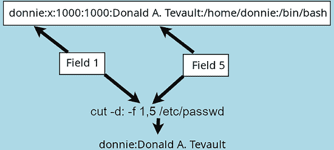
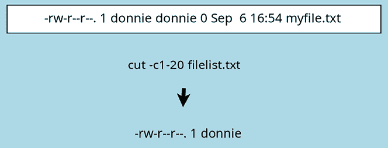
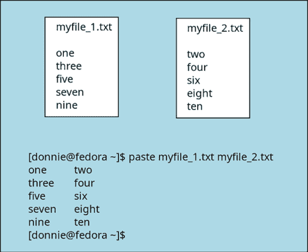
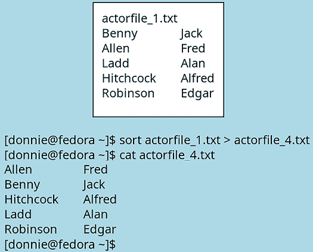

# 文本流过滤器 - 第一部分

这是介绍文本流过滤器概念的两章中的第一章。我们将讨论它们是什么以及如何从命令行使用它们。在接下来的章节中，我会展示这些过滤工具如何在 Shell 脚本中使用的一些例子。

你应该学习这些实用工具的原因有两个。首先，如果你需要创建能够自动生成不同类型文档（如报告）的脚本，这些工具非常有帮助。第二个原因是，它们会出现在某些 Linux 认证考试中，例如 CompTIA Linux+/Linux 专业人员协会考试。

本章的主题包括：

+   文本流过滤器简介

+   使用`cat`

+   使用`tac`

+   使用`cut`

+   使用`paste`

+   使用`join`

+   使用`sort`

好的，开始吧，怎么样？

# 技术要求

本章请使用你任何的 Linux 虚拟机，因为这些过滤工具在所有 Linux 系统上都一样有效。或者，如果你正好在主机上运行 Linux 或 macOS，也可以直接使用它，而不需要虚拟机。没有动手实验，所以可以在自己机器上尝试所有命令，边学边操作。

在这一章和下一章中，你将处理大量的文本文件。为了方便起见，我已将文件放入 GitHub 仓库。如果你使用的是 Linux，获取这些文件的最佳方式是通过你发行版的正常包管理器安装`git`。

然后，使用以下命令下载文件：

```
donnie@opensuse:~> git clone https://github.com/PacktPublishing/The-Ultimate-Linux-Shell-Scripting-Guide.git 
```

然后，`cd`进入`The-Ultimate-Linux-Shell-Scripting-Guide`目录，这是`git`命令创建的，你会找到各章节的子目录。

如果你使用的是 Mac，你需要打开 App Store 并安装`Xcode`包才能使用`git`。然后，使用我刚才给出的命令来下载文件。

我还包括了如何在 FreeBSD 和 OpenIndiana 上使用一些这些工具的例子。如果你愿意，可以创建一个 FreeBSD 和 OpenIndiana 的虚拟机，但目前还不是必须的。

# 文本流过滤器简介

作为 Linux 系统管理员或使用 Linux 桌面的办公室工作人员，你可能会有一定数量的文本文件需要处理。你甚至可能需要从这些文件中提取数据，并有效地展示这些数据。

或者，你可能需要从显示 Linux 系统状态的工具中提取数据，或者从自动抓取网络特定信息的脚本中提取数据。我在本节中介绍的**文本流过滤器工具**可以帮助简化这些任务。一旦你学会了它们，你甚至可能发现，使用这些工具提取和展示数据的速度比使用文本编辑器或文字处理软件还要快。


图 6.1：文本流过滤器的基本概念

除了一个例外，你不会使用这些工具来修改原始文本文件。你将使用它们来查看屏幕上的选定数据，将选定的数据传输到另一个工具，或者使用重定向符将选定的数据创建或附加到另一个文本文件中。

# 使用 cat

`cat` 工具与我们的猫咪朋友无关。它用于查看、创建或合并多个文本文件。（实际上，`cat` 是 *catenate* 的缩写，意思是“将两者连接起来，端对端”。）

我在介绍中提到过，Mac 用户可以在他们的 Mac 上执行本章的演示。不过现在，我必须加一点警告。因为至少有三个版本的 `cat`，它们有不同的选项开关。我将在过程中指出它们的差异。

有时，你需要编写可以跨各种操作系统使用的脚本。所以，了解这些小的细节很重要。

默认情况下，`stdin` 对于 cat 是键盘，`stdout` 是计算机屏幕。如果你在命令提示符下输入 `cat`，你可以开始输入文本，并且只要按下 *Enter*，它就会立即回显文本。它会一直这样做，直到你按下 *Ctrl-d* 结束它。下面是它的样子：

```
[donnie@fedora ~]$ cat
Hi there! 
```

我还没有按 *Enter*。看我按下之后会发生什么：

```
[donnie@fedora ~]$ cat
Hi there!
Hi there! 
```

这是我想要输入的唯一一行，所以我会通过 *Ctrl-d* 退出 `cat`：

```
[donnie@fedora ~]$ cat
Hi there!
Hi there!
[donnie@fedora ~]$ 
```

当然，仅凭这一点并不是特别有用。但你可以将 `cat` 与 `stdout` 重定向符一起使用来创建简单的文本文件。当你输入完消息后，再按一次 *Enter* 以跳到空白行，然后按 *Ctrl-d* 退出。它应该像这样：

```
[donnie@fedora ~]$ cat > newtext.txt
Hi there! I'm using cat to create a
text file. I hope that it turns out well.
[donnie@fedora ~]$ 
```

一旦你创建了文件，你可以使用 `cat` 来显示它。不过，它与 `less` 工具不同，因为 `cat` 会直接将文件中的所有内容显示到屏幕上，而没有分页。你不需要在 `cat` 中使用 `stdin` 重定向符，因为 `cat` 设计为使用参数而不是 `stdin` 重定向符。总之，下面是它的样子：

```
[donnie@fedora ~]$ cat newtext.txt
Hi there! I'm using cat to create a
text file. I hope that it turns out well.
[donnie@fedora ~]$ 
```

现在，使用 `cat` 创建第二个文件，像这样：

```
[donnie@fedora ~]$ cat > newtext_2.txt
I'm going to catenate this file to the first
file, just to see if it actually works.
[donnie@fedora ~]$ 
```

这就是合并操作的部分。再次调用 `cat`，但是将两个新文件的名称作为参数传入，像这样：

```
[donnie@fedora ~]$ cat newtext.txt newtext_2.txt
Hi there! I'm using cat to create a
text file. I hope that it turns out well.
I'm going to catenate this file to the first
file, just to see if it actually works.
[donnie@fedora ~]$ 
```


图 6.2：将两个文件的内容导入到第三个文件。

这次，你会看到两个文件会显示得像一个单独的文件一样。

现在，添加一个 `stdout` 重定向符，通过将前两个文件合并来创建一个新文件，像这样：

```
[donnie@fedora ~]$ cat newtext.txt newtext_2.txt > newtext_3.txt
[donnie@fedora ~]$ cat newtext_3.txt
Hi there! I'm using cat to create a
text file. I hope that it turns out well.
I'm going to catenate this file to the first
file, just to see if it actually works.
[donnie@fedora ~]$ 
```

理解这一点很重要：当你这么做时，你需要创建一个第三个文本文件。这是因为如果你将两个原始文件的输出重定向到其中任何一个原始文件中，你将完全覆盖该目标文件的内容。你剩下的只有第二个文件的内容。实际上，让我给你看一下：

```
[donnie@fedora ~]$ cat newtext.txt newtext_2.txt > newtext.txt
[donnie@fedora ~]$ cat newtext.txt
I'm going to catenate this file to the first
file, just to see if it actually works.
[donnie@fedora ~]$ 
```

如你所见，原来的 `newtext.txt` 文件中的文本已经不存在了。

`cat`有多个显示选项，你可以使用它们。为了查看如何使用它们，创建另一个文本文件。这次，添加一些标签和一大堆空行。它看起来大致如下：

```
[donnie@fedora ~]$ cat > newtext_4.txt
	I'm now adding tabs, spaces, and blank lines, to see if some
  of the options will work.
	Hopefully, they will.
	I hope.
[donnie@fedora ~]$ 
```

在`of the options will work`行的开头，我插入了一些空格。其他所有行我都通过按一次*Tab*键开始。

假设我们不需要这么多连续的空行，那也没问题。我只需使用`-s`选项将它们压缩掉，像这样：

```
[donnie@fedora ~]$ cat -s newtext_4.txt
	I'm now adding tabs, spaces, and blank lines, to see if some
  of the options will work.
	Hopefully, they will.
	I hope.
[donnie@fedora ~]$ 
```

看起来更好，对吧？

在 Linux、FreeBSD 和 macOS 上，你可以通过使用`-t`选项看到所有的标签，像这样：

```
[donnie@fedora ~]$ cat -t newtext_4.txt
^II'm now adding tabs, spaces, and blank lines, to see if some
  of the options will work.
^IHopefully, they will.
^II hope.
[donnie@fedora ~]$ 
```

你会看到现在所有的标签都显示为`^I`字符。

在 OpenIndiana 上，你需要将`-t`和`-v`选项结合使用才能看到标签字符，因为仅使用`-t`选项不会显示任何内容。以下是在 OpenIndiana 上的显示方式：

```
donnie@openindiana:~$ cat -tv test.txt
Testing, testing.
^IMore testing.
^I^IYet more testing.
Testing yet again,
^Iand again.
^I^I^IDone.
donnie@openindiana:~$ 
```

如果你想看到每行的结尾在哪里，请使用`-e`选项，像这样：

```
[donnie@fedora ~]$ cat -e newtext_4.txt
	I'm now adding tabs, spaces, and blank lines, to see if some$
  of the options will work.$
$
$
$
$
	Hopefully, they will.$
$
$
	I hope.$
[donnie@fedora ~]$ 
```

在 OpenIndiana 上，你需要将`-e`和`-v`选项结合使用，因为仅使用`-e`选项不会显示任何内容。以下是在 OpenIndiana 上的显示方式：

```
donnie@openindiana:~$ cat -ev test.txt
	I'm now adding tabs, spaces, and blank lines, to see if some$
  of the options will work.$
$
$
$
$
	Hopefully, they will.$
$
$
	I hope.$
donnie@openindiana:~$ 
```

正如你所看到的，每一行的末尾用`$`表示。

仅在 Linux 上，你可以通过使用`-A`选项查看标签的位置以及每行的结尾，像这样：

```
[donnie@fedora ~]$ cat -A newtext_4.txt
^II'm now adding tabs, spaces, and blank lines, to see if some$
  of the options will work.$
$
$
$
$
^IHopefully, they will.$
$
$
^II hope.$
[donnie@fedora ~]$ 
```

请注意，`-A`选项只在 Linux 版本的`cat`上有效。它在 OpenIndiana、FreeBSD 或 macOS 上不起作用。

此外，如果脚本的可移植性是一个问题，你可以在 Linux 机器上使用`cat -tv`和`cat -ev`，尽管在 Linux 上`-v`选项并不是必须的。

`-b`选项会为所有非空行编号，像这样：

```
[donnie@fedora ~]$ cat -b newtext_4.txt
     1		I'm now adding tabs, spaces, and blank lines, to see if some
     2	  of the options will work.
     3		Hopefully, they will.
     4		I hope.
[donnie@fedora ~]$ 
```

或者，使用`-n`选项让所有行都编号，像这样：

```
[donnie@fedora ~]$ cat -n newtext_4.txt
     1		I'm now adding tabs, spaces, and blank lines, to see if some
     2	  of the options will work.
     3	
     4	
     5	
     6	
     7		Hopefully, they will.
     8	
     9	
    10		I hope.
[donnie@fedora ~]$ 
```

这就是`cat`的内容，接下来我们来看一下`tac`。

# 使用 tac

`tac`--`cat`的反向拼写--一次按逆序显示一个或多个文件。为了查看它是如何工作的，我们首先创建两个看起来像这样的文本文件：

```
[donnie@fedora ~]$ cat > testfile_1.txt
one
two
three
four
five
six
[donnie@fedora ~]$ cat > testfile_2.txt
seven
eight
nine
ten
eleven
twelve
[donnie@fedora ~]$ 
```

让我们使用`cat`同时查看两个文件：

```
[donnie@fedora ~]$ cat testfile_1.txt testfile_2.txt
one
two
three
four
five
six
seven
eight
nine
ten
eleven
twelve
[donnie@fedora ~]$ 
```

你可以使用`tac`以逆序查看一个文件：

```
[donnie@fedora ~]$ tac testfile_1.txt
six
five
four
three
two
one
[donnie@fedora ~]$ 
```

或者，按逆序查看两个或更多文件：

```
[donnie@fedora ~]$ tac testfile_1.txt testfile_2.txt
six
five
four
three
two
one
twelve
eleven
ten
nine
eight
seven
[donnie@fedora ~]$ 
```

请注意，第一个文件的内容先显示，然后是第二个文件的内容。

当然，你可以使用`stdout`重定向器来创建一个新的文本文件，像这样：

```
[donnie@fedora ~]$ tac testfile_1.txt testfile_2.txt > testfile_3.txt
[donnie@fedora ~]$ 
```

你可能以为`tac`会使用和`cat`相同的选项，但事实并非如此。`cat`的选项都不能用于`tac`。

这就是`tac`的内容，接下来是`cut`。

# 使用 cut

顾名思义，这个实用程序用于从文本文件中剪切并显示选定的信息。你可以把它当作是从文本文件中提取一个垂直切片并将其发送到你选择的输出。指定你想要开始和结束切片的方式有两种。你可以通过指定开始和结束字符来指定，也可以通过指定字段来指定。

要按字段指定切片，你需要同时使用`-d`和`-f`选项。`-d`选项将指定分隔符，即分隔字段的字符。这样`cut`就能知道每个字段的开始和结束位置。`-f`选项将指定你想查看的字段。在这个图示中，你可以看到我使用`cut`从`/etc/passwd`文件中提取了用户名和真实姓名——字段`1`和`5`。



图 6.3：使用 cut 查看 passwd 文件的第 1 和第 5 字段

由于这个文件中的字段由冒号分隔，我使用了`-d:`作为分隔符选项。

另一种指定切片的方法是字符方法。使用这种方法，你可以选择要显示的文本行的开始字符和结束字符。在下图中，你可以看到我将当前目录中的文件列表保存到了`filelist.txt`中。

图 6.4：使用 cut 查看前 20 个字符

我决定只查看该文件每行的前 20 个字符，所以我使用了`-c`选项，并附加了适当的字符编号。（注意，你可以将命令输入为`cut -c1-20 filelist.txt`，也可以输入为`cut -c 1-20 filelist.txt`，`-c`与第一个数字之间的空格是可选的。）为了进一步说明它是如何工作的，下面让我展示一下切割一个实际的多行文件时的输出：

```
[donnie@fedora ~]$ cut -c 1-20 filelist.txt
total 2109597
drwxr-xr-x  1 donnie
-rw-r--r--  1 donnie
-rw-r--r--  1 donnie
-rw-r--r--  1 donnie
. . .
. . .
drwxr-xr-x  1 donnie
-rwxr--r--  1 donnie
-rwxr--r--  1 donnie
-rwxr--r--  1 donnie
[donnie@fedora ~]$ 
```

你可以看到`cut`对文件中的每一行都进行了操作。此外，你还看到第一行完整地打印了出来，因为它的字符数少于 20 个。（当你使用字段方法时，情况也是一样的。）

当然，对于上述两个例子，你可以选择使用`stdout`重定向器将提取的信息保存到文本文件。例如，你可以像这样操作：

```
[donnie@fedora ~]$ cut -d: -f 1,5 /etc/passwd > passwd_cut.txt
[donnie@fedora ~]$ cut -c1-20 myfile.txt > filelist_cut.txt
[donnie@fedora ~]$ 
```

和大多数文本流过滤工具一样，你可以将`cut`的输出通过管道传递给另一个工具，或者将另一个工具的输出通过管道传递给`cut`。在前面的例子中，我其实并不需要将`ls -l`的输出保存到文本文件中。我可以直接将`ls -l`的输出通过管道传递给`cut`，像这样操作：

```
[donnie@fedora ~]$ ls -l myfile.txt | cut -c1-20
-rw-r--r--. 1 donnie
[donnie@fedora ~]$ 
```

添加一个`stdout`重定向器，你还可以将其保存到文本文件中，如下所示：

```
[donnie@fedora ~]$ ls -l myfile.txt | cut -c1-20 > filelist_cut.txt
[donnie@fedora ~]$ 
```

这就是`cut`的所有内容。现在，让我们来看看如何进行粘贴。

# 使用 paste

与`cat`将两个或更多文件连接在一起不同，`paste`是将它们并排连接起来。当你有两个或更多列式数据的文件，并且你想在一个显示中查看所有数据时，这非常有用。请继续创建下图中所示的两个文本文件，然后尝试使用图示中的`paste`命令。



图 6.5：使用 paste 将两个文件合并

`paste`有两个选项可以使用。使用`-s`选项的串联模式，允许你将数据列水平显示。将`myfile_1.txt`和`myfile_2.txt`与`-s`选项一起粘贴，结果如下所示：

```
[donnie@fedora ~]$ paste -s myfile_1.txt myfile_2.txt
one	three	five	seven	nine
two	four	six	eight	ten
[donnie@fedora ~]$ 
```

`-d`开关设置的分隔符选项可以让你更改列之间的分隔方式。如果你没有使用`-d`开关，粘贴显示的列将用制表符分隔，就像前面的示例中看到的那样。要将制表符替换为其他字符，只需在`-d`开关后面放置所需的替代字符。在这里，我使用一对双引号，中间有一个空格，将每个制表符替换为正常空格：

```
[donnie@fedora ~]$ paste -d" " myfile_1.txt myfile_2.txt
one two
three four
five six
seven eight
nine ten
[donnie@fedora ~]$ 
```

现在，这里有一个非常酷的技巧，你可以用来给你的朋友留下深刻印象。首先，按如下方式创建四个新文本文件：

```
[donnie@fedora ~]$ cat > number_1.txt
one
1
uno
[donnie@fedora ~]$ cat > number_2.txt
two
2
dos
[donnie@fedora ~]$
[donnie@fedora ~]$ cat > number_3.txt
three
3
tres
[donnie@fedora ~]$ cat > number_4.txt
four
4
cuatro
[donnie@fedora ~]$ 
```

现在，将它们全部合并到一起，使用 paste 命令。这一次，在`-d`后面的引号中放置`+`、`-`和`=`符号，像这样：

```
[donnie@fedora ~]$ paste -d"+-=" number_3.txt number_2.txt number_1.txt number_4.txt
three+two-one=four
3+2-1=4
tres+dos-uno=cuatro
[donnie@fedora ~]$ 
```

如你所见，三个算术运算符已经被放置在了适当的位置。（哦，顺便说一下，如果你在想，uno、dos、tres 和 cuatro 是西班牙语的 1、2、3 和 4。）

这不仅仅是一个疯狂的派对技巧。我将在*第十一章，执行数学运算*中展示这个方法的实际应用。

好的，现在我们已经将一些文件粘贴在一起，接下来让我们将它们合并。

# 使用 join

这里有一个你可以用来合并两个文本文件的实用工具。（与我们之前讨论的其他工具不同，你只能用`join`合并两个文本文件，不能超过两个。）要了解它是如何工作的，查看下面的示意图，它展示了关于过去时代著名好莱坞演员的文本文件。然后，创建这些文件，在每个文件的两列之间用制表符分隔。接着，运行示意图中显示的命令。


图 6.6：使用 join 将两个文件合并在一起

如你所见，`join`工具将列之间的制表符替换为空格。

请注意，在每个输入文件中，第一个字段是相同的。（在这个例子中，它是每个演员的姓氏。）在输出中，**关键字段**——第一个字段——只列出一次。每个演员的姓氏——关键字段——从两个输入文件中获取。

这里需要记住的是，你必须确保两个输入文件中有一个字段是相同的。这个字段不一定是第一个字段，正如我们在下一个例子中将展示的那样。

如果你需要，还可以使用`-j`开关选择另一个字段。你可以通过下面这两个数字列表看到这一点：

```
[donnie@fedora ~]$ cat > num_1.txt
1	one
3	three
4	four
7	seven
5	five
[donnie@fedora ~]$ cat > num_2.txt
uno		one
tres		three
cuatro	four
siete	seven
cinco	five
[donnie@fedora ~]$ 
```

现在，让我们将它们合并起来：

```
[donnie@fedora ~]$ join -j 2 num_1.txt num_2.txt
one 1 uno
three 3 tres
four 4 cuatro
seven 7 siete
five 5 cinco
[donnie@fedora ~]$ 
```

在这里，第二个字段在每个输入文件中是相同的，因此我使用了`-j 2`选项将该字段指定为关键字段。

你可以将`join`的输出通过管道传递给其他工具，以获得定制化的输出。如果你想为输出编号，可以将其通过管道传递给`cat`并使用`-n`选项，像这样：

```
[donnie@fedora ~]$ join -j 2 num_1.txt num_2.txt | cat -n
     1	one 1 uno
     2	three 3 tres
     3	four 4 cuatro
     4	seven 7 siete
     5	five 5 cinco
[donnie@fedora ~]$ 
```

现在，很多人都喜欢创建**逗号分隔值**（**csv**）格式的电子表格文件，而不是使用电子表格程序的原生格式。这样做的好处是，文件可以在任何文本编辑器中创建，且任何电子表格程序都能读取这些文件。你可以通过使用`-t`开关来指定字段是由逗号而不是制表符分隔，从而让`join`与这些文件一起使用。要查看如何操作，可以将`actorfile_1.txt`和`actorfile_2.txt`文件复制为对应的`.csv`文件，如下所示：

```
[donnie@fedora ~]$ cp actorfile_1.txt actorfile_1.csv
[donnie@fedora ~]$ cp actorfile_2.txt actorfile_2.csv
[donnie@fedora ~]$ 
```

接下来，编辑这两个`.csv`文件，将制表符替换为逗号。第一个文件将如下所示：

```
[donnie@fedora ~]$ cat actorfile_1.csv
Benny,Jack
Allen,Fred
Ladd,Alan
Hitchcock,Alfred
Robinson,Edgar
[donnie@fedora ~]$ 
```

第二个文件将如下所示：

```
[donnie@fedora ~]$ cat actorfile_2.csv
Benny,comedy
Allen,comedy
Ladd,adventure
Hitchcock,mystery
Robinson,drama
[donnie@fedora ~]$ 
```

现在，看看当我尝试正常使用`join`时会发生什么：

```
[donnie@fedora ~]$ join actorfile_1.csv actorfile_2.csv
join: actorfile_1.csv:2: is not sorted: Allen,Fred
join: actorfile_2.csv:4: is not sorted: Hitchcock,mystery
join: input is not in sorted order
[donnie@fedora ~]$ 
```

它不起作用，因为`join`认为每个文件中只有一个字段。为了使其正常工作，我需要使用`-t`开关来指定逗号作为我的字段分隔符，如下所示：

```
[donnie@fedora ~]$ join -t, actorfile_1.csv actorfile_2.csv
Benny,Jack,comedy
Allen,Fred,comedy
Ladd,Alan,adventure
Hitchcock,Alfred,mystery
Robinson,Edgar,drama
[donnie@fedora ~]$ 
```

很酷，看起来好多了。当然，你也可以将输出重定向到一个第三个`.csv`文件，然后将其导入到任何电子表格程序中。

`join`还有更多的使用方式，你可以在`join`的手册页中查看。将`join`的强大功能与我们即将介绍的下一个工具的功能结合起来，你将拥有一个易于使用的工具，可以用来创建简单的数据库。

# 使用 sort

这是一个多功能的工具，你可以单独使用它，也可以与其他工具配合使用。你可以用它来排序一个文件，或者将多个文件一起排序。

有很多选项可以用于不同的目的。你可以选择如何格式化输出，如何对数据进行排序，以及你希望使用哪些字段进行排序。你甚至可以在两个或更多字段上同时进行排序，主排序基于一个字段，次排序基于其他字段。

你可以使用`sort`的方式有很多种。正如我之前所说，唯一的限制是你自己的想象力。首先，看看下面的图示。请在你的机器上创建文本文件，然后运行你看到的命令：



图 6.7：排序 actorfile_1.txt 文件

你在上面的图示中看到的是最简单的排序。默认情况下，排序是区分大小写的，并且是对输入文件的每一整行进行排序。

在下一个示例中，我将同时展示两个选项。第一个是`-k`选项，它允许你根据特定字段对输入文件进行排序。第二个是`-o`选项，它允许你将输出保存到文本文件中。当然，你仍然可以使用重定向器来实现这一点。但与重定向器不同，`-o`选项允许你将排序后的输出保存回原始输入文件，而不会清空其内容。

在我展示之前，我将把`actorfile_1.txt`文件复制到`actorfile_5.txt`文件，以便稍后我可以再次使用`actorfile_1.txt`文件：

```
[donnie@fedora ~]$ cp actorfile_1.txt actorfile_5.txt
[donnie@fedora ~]$ 
```

现在，让我们看看它是如何工作的：

```
[donnie@fedora ~]$ sort -k2 actorfile_5.txt -o actorfile_5.txt
[donnie@fedora ~]$ cat actorfile_5.txt
Ladd			Alan
Hitchcock		Alfred
Robinson		Edgar
Allen		Fred
Benny		Jack
[donnie@fedora ~]$ 
```

如你所见，原始输入文件现在已经按演员的名字排序。

假设你需要一个女演员列表来搭配你的男演员列表，而这个列表大致如下所示：

```
[donnie@fedora ~]$ cat > actorfile_6.txt
MacLaine		Shirley
Booth		Shirley
Stanwick		Barbara
Allen		Gracie
[donnie@fedora ~]$ 
```

将`actorfile_1.txt`文件和`actorfile_6.txt`文件一起排序，如下所示：

```
[donnie@fedora ~]$ sort actorfile_1.txt actorfile_6.txt
Allen		Fred
Allen		Gracie
Benny		Jack
Booth		Shirley
Hitchcock		Alfred
Ladd			Alan
MacLaine		Shirley
Robinson		Edgar
Stanwick		Barbara
[donnie@fedora ~]$ 
```

在屏幕上查看结果后，将结果保存到一个新文件中，如下所示：

```
[donnie@fedora ~]$ sort actorfile_1.txt actorfile_6.txt -o actorfile_7.txt
[donnie@fedora ~]$ 
```

你也可以通过`tee`工具将其管道传输，这样你既能在屏幕上看到输出，又能同时将其保存到文件中。

```
[donnie@fedora ~]$ sort actorfile_1.txt actorfile_6.txt | tee actorfile_8.txt
Allen		Fred
Allen		Gracie
Benny		Jack
Booth		Shirley
Hitchcock		Alfred
Ladd			Alan
MacLaine		Shirley
Robinson		Edgar
Stanwick		Barbara
[donnie@fedora ~]$ ls -l actorfile_8.txt
-rw-r--r--. 1 donnie donnie 130 Sep  6 19:02 actorfile_8.txt
[donnie@fedora ~]$ 
```

还有一些其他选项，可以在特殊情况下帮助你。为了演示，创建一个名为`fruit.txt`的文件，它将如下所示：

```
[donnie@fedora ~]$ cat > fruit.txt
Peach
Peach
apricot
peach
Apricot
[donnie@fedora ~]$ 
```

你会看到有一些重复条目。让我们看看正常排序会是什么样子：

```
[donnie@fedora ~]$ sort fruit.txt
apricot
Apricot
peach
Peach
Peach
[donnie@fedora ~]$ 
```

由于每种水果只需要一个条目，可以使用`-u`选项来去除重复条目，如下所示：

```
[donnie@fedora ~]$ sort -u fruit.txt
apricot
Apricot
peach
Peach
[donnie@fedora ~]$ 
```

这看起来稍微好一些。但是，你真的需要在大写和小写字母中重复显示水果名称吗？如果不需要，那么添加`-f`开关，使`sort`将所有字母视为大写字母进行排序，如下所示：

```
[donnie@fedora ~]$ sort -uf fruit.txt
apricot
Peach
[donnie@fedora ~]$ 
```

一些旧版 Linux 书籍可能会告诉你，文本文件中包含大小写字母混合的排序字段，除非使用`-f`开关，否则不会正确排序。

例如，名字“MacLeod”会排在“Mack”之前，因为大写字母 L 会排在小写字母 k 之前。`-f`开关会强制`sort`将列表项按正确的字母顺序排序，不论大小写。然而，在更新的 Linux 发行版中，这已不再是问题。`-f`开关仍然有其用途，正如你在上面的例子中看到的。但是，那些其他 Linux 书籍中提到的问题已经不复存在。

在下一个示例中，创建一个包含数字的文件。

```
[donnie@fedora ~]$ cat > numbers.txt
1
5
10
78
78034
10053
[donnie@fedora ~]$ 
```

这是你尝试排序列表时得到的结果：

```
[donnie@fedora ~]$ sort numbers.txt
1
10
10053
5
78
78034
[donnie@fedora ~]$ 
```

这可能不是你想要的。为了按正确的数字顺序排序，请使用`-n`开关，如下所示：

```
[donnie@fedora ~]$ sort -n numbers.txt
1
5
10
78
10053
78034
[donnie@fedora ~]$ 
```

添加`-r`开关，以便按逆序排序文件：

```
[donnie@fedora ~]$ sort -nr numbers.txt
78034
10053
78
10
5
1
[donnie@fedora ~]$ 
```

这次，玩一下，创建一个包含小数和负数的文本文件，以及一些正数：

```
[donnie@fedora ~]$ cat > numbers_2.txt
-68
57
2.6
1.24
10000
14
1.4
8
80
8.2
.8
-87
[donnie@fedora ~]$ 
```

现在，让我们看看在没有任何选项开关的情况下，排序结果如何：

```
[donnie@fedora ~]$ sort numbers_2.txt
10000
1.24
1.4
14
2.6
57
-68
.8
8
80
8.2
-87
[donnie@fedora ~]$ 
```

和之前一样，添加`-n`开关以按正确的数字顺序排序列表：

```
[donnie@fedora ~]$ sort -n numbers_2.txt
-87
-68
.8
1.24
1.4
2.6
8
8.2
14
57
80
10000
[donnie@fedora ~]$ 
```

在下一个示例中，让我们创建一个二手汽车的文件列表。我们将列出品牌、型号、年份、里程（以千英里为单位）和售价。（如果你不在美国，可以假装英里实际上是公里。）列表如下所示：

```
[donnie@fedora ~]$ cat > autos.txt
plymouth		satellite	1970	154	600
plymouth		fury		1970	73	2500
plymouth		breeze		1996	116	4300
chevy		malibu		2000	60	3000
ford			mustang	1965	45	10000
volvo		s80		1998	102	9850
ford			thunderbird	2003	15	3500
chevy		malibu		1999	50	3500
bmw	       		325i		1985	115	450
bmw			325i		1985	60	1000
honda		accord		2001	30	6000
ford			taurus		2004	10	17000
toyota		rav4		2002	180	750
chevy		impala		1985	85	1550
ford			explorer	2003	25	9500
jeep			wrangler	2003	54	1600
edsel		corsair	1958	47	750
ford			galaxie	1964	128	60
[donnie@fedora ~]$ 
```

我们将首先进行正常排序，如下所示：

```
[donnie@fedora ~]$ sort autos.txt
bmw			325i		1985	115	450
bmw			325i		1985	60	1000
chevy		impala		1985	85	1550
chevy		malibu		1999	50	3500
chevy		malibu		2000	60	3000
edsel		corsair	1958	47	750
ford			explorer	2003	25	9500
ford			galaxie	1964	128	60
ford			mustang	1965	45	10000
ford			taurus		2004	10	17000
ford			thunderbird	2003	15	3500
honda		accord		2001	30	6000
jeep			wrangler	2003	54	1600
plymouth		breeze		1996	116	4300
plymouth		fury		1970	73	2500
plymouth		satellite	1970	154	600
toyota		rav4		2002	180	750
volvo		s80		1998	102	9850
[donnie@fedora ~]$ 
```

默认情况下，排序操作将从文件的第一列开始，然后逐行处理，直到遇到非唯一条目。在这里，我们看到所有内容都按正确的顺序排序，直到年份列。（稍后我们会修复这个问题。）

当某个品牌的汽车超过一辆时，排序将继续到型号列。当某个型号超过一辆时，排序将继续到年份列。即使在这个示例中看起来没有，里程列也会参与排序。这是因为我在几页前展示过的数字排序问题。

为了按数字顺序排序数字而不是机器排序顺序，您必须使用`-n`选项。我们可以通过使用`-k`选项来指定要排序的单独列，如下所示：

```
[donnie@fedora ~]$ sort -k1,3 -k4n autos.txt
bmw			325i		1985	60	1000
bmw			325i		1985	115	450
chevy		impala		1985	85	1550
chevy		malibu		1999	50	3500
chevy		malibu		2000	60	3000
edsel		corsair	1958	47	750
ford			explorer	2003	25	9500
ford			galaxie	1964	128	60
ford			mustang	1965	45	10000
ford			taurus		2004	10	17000
ford			thunderbird	2003	15	3500
honda		accord		2001	30	6000
jeep			wrangler	2003	54	1600
plymouth		breeze		1996	116	4300
plymouth		fury		1970	73	2500
plymouth		satellite	1970	154	600
toyota		rav4		2002	180	750
volvo		s80		1998	102	9850
[donnie@fedora ~]$ 
```

`-k1,3`选项表示对第一个到第三个字段进行排序。（换句话说，按品牌、型号和年份字段排序。）`-k4n`选项表示还要按第四个（里程）字段以数字顺序排序。

请注意，您可以为单独的字段指定排序选项。还要注意，价格列在此排序中永远不会被考虑，因为直到里程列之前，没有任何行条目是完全相同的。

接下来，让我们先按制造商和价格对汽车列表进行排序。为此，您需要对第一个和第五个字段进行排序。由于我们已经知道需要使用`-n`选项来正确排序第五列，因此我们将继续添加它，如下所示：

```
[donnie@fedora ~]$ sort -k 1 -k5n autos.txt
bmw			325i		1985	115	450
bmw			325i		1985	60	1000
chevy		impala		1985	85	1550
chevy		malibu		1999	50	3500
chevy		malibu		2000	60	3000
edsel		corsair	1958	47	750
ford			explorer	2003	25	9500
ford			galaxie	1964	128	60
ford			mustang	1965	45	10000
ford			taurus		2004	10	17000
ford			thunderbird	2003	15	3500
honda		accord		2001	30	6000
jeep			wrangler	2003	54	1600
plymouth		breeze		1996	116	4300
plymouth		fury		1970	73	2500
plymouth		satellite	1970	154	600
toyota		rav4		2002	180	750
volvo		s80		1998	102	9850
[donnie@fedora ~]$ 
```

每当您指定两个或更多的`-k`选项时，`sort`将在多个回合中执行其操作。在第一次回合中，它将按第一个`-k`选项指定的字段进行排序。对其余指定字段的排序将在后续回合中执行。

在这里，我们看到`sort`忽略了第二个`-k`选项。这是因为第一个`-k`选项没有为其排序指定结束点。所以，`sort`在第一次回合中评估了每一整行，认为不需要第二次回合。

现在，让我们为第一个`-k`选项指定一个结束点，看看这是否会有所不同。

```
[donnie@fedora ~]$ sort -k1,1 -k5n autos.txt
bmw			325i		1985	115	450
bmw			325i		1985	60	1000
chevy		impala		1985	85	1550
chevy		malibu		2000	60	3000
chevy		malibu		1999	50	3500
edsel		corsair	1958	47	750
ford			galaxie	1964	128	60
ford			thunderbird	2003	15	3500
ford			explorer	2003	25	9500
ford			mustang	1965	45	10000
ford			taurus		2004	10	17000
honda		accord		2001	30	6000
jeep			wrangler	2003	54	1600
plymouth		satellite	1970	154	600
plymouth		fury		1970	73	2500
plymouth		breeze		1996	116	4300
toyota		rav4		2002	180	750
volvo		s80		1998	102	9850
[donnie@fedora ~]$ 
```

`-k1,1`选项表示我们希望第一次排序仅按照文件的第一个字段进行排序。通过添加该结束点，我们的排序就按预期工作了。

您不必从第一个字段开始排序。在下一个示例中，我们将首先按第三个字段（年份）排序，然后按第一个字段（品牌）排序。

```
[donnie@fedora ~]$ sort -k3 -k1 autos.txt
edsel		corsair		1958	47	750
ford			galaxie		1964	128	60
ford			mustang		1965	45	10000
plymouth		satellite	1970	154	600
plymouth		fury		1970	73	2500
bmw			325i		1985	115	450
bmw			325i		1985	60	1000
chevy		impala		1985	85	1550
plymouth		breeze		1996	116	4300
volvo		s80		1998	102	9850
chevy		malibu		1999	50	3500
chevy		malibu		2000	60	3000
honda		accord		2001	30	6000
toyota		rav4		2002	180	750
ford			thunderbird	2003	15	3500
ford			explorer	2003	25	9500
jeep			wrangler	2003	54	1600
ford			taurus		2004	10	17000
[donnie@fedora ~]$ 
```

再次，您可以看到当没有为第一个排序字段指定结束点时会发生什么。让我们再试一次。

```
[donnie@fedora ~]$ sort -k3,3 -k1 autos.txt
edsel		corsair		1958	47	750
ford			galaxie		1964	128	60
ford			mustang		1965	45	10000
plymouth		fury		1970	73	2500
plymouth		satellite	1970	154	600
bmw			325i		1985	115	450
bmw			325i		1985	60	1000
chevy		impala		1985	85	1550
plymouth		breeze		1996	116	4300
volvo		s80		1998	102	9850
chevy		malibu		1999	50	3500
chevy		malibu		2000	60	3000
honda		accord		2001	30	6000
toyota		rav4		2002	180	750
ford			explorer	2003	25	9500
ford			thunderbird	2003	15	3500
jeep			wrangler	2003	54	1600
ford			taurus		2004	10	17000
[donnie@fedora ~]$ 
```

好吧，它还是没有工作。所有内容仍然按年份正确排序，但没有按品牌排序。我们不是轻易放弃的人，所以再试一次。

```
[donnie@fedora ~]$ sort -b -k3,3 -k1 autos.txt
edsel		corsair		1958	47	750
ford			galaxie		1964	128	60
ford			mustang		1965	45	10000
plymouth		fury		1970	73	2500
plymouth		satellite	1970	154	600
bmw			325i		1985	115	450
bmw			325i		1985	60	1000
chevy		impala		1985	85	1550
plymouth		breeze		1996	116	4300
volvo		s80		1998	102	9850
chevy		malibu		1999	50	3500
chevy		malibu		2000	60	3000
honda		accord		2001	30	6000
toyota		rav4		2002	180	750
ford			explorer	2003	25	9500
ford			thunderbird	2003	15	3500
jeep			wrangler	2003	54	1600
ford			taurus		2004	10	17000
[donnie@fedora ~]$ 
```

请注意，在五个字段中的四个字段中，文本字符串的长度不同。理论上，较短文本字符串行中的额外空格应该会对我们执行的所有排序操作产生不利影响。然而，由于某种原因，只有最后一次排序操作受到了影响。通过添加`-b`选项，我们告诉`sort`忽略多余的空格。

好吧，也许你没有一辆古董汽车的收藏。但你可能有其他需要按各种方式排序的项目清单。请记住，你可以使用我在这里展示的技巧来处理任何类型的清单。

好的，这样就足够了，关于古董汽车的内容就到此为止。让我们现在看看如何排序月份列表。首先，让我们创建这个列表，像这样：

```
[donnie@fedora ~]$ cat > dates.txt
Dec	2023
jan	2023
Oct	2023
Sep	2022
Feb	2022
mar	2023
may	2022
[donnie@fedora ~]$ 
```

现在，使用 `-M` 开关按月份排序列表：

```
[donnie@fedora ~]$ sort -M dates.txt
jan	2023
Feb	2022
mar	2023
may	2022
Sep	2022
Oct	2023
Dec	2023
[donnie@fedora ~]$ 
```

如你所见，`-M` 开关不区分大小写。

现在，使用你在前面的示例中学到的技巧，先按年份排序，再按月份排序，像这样：

```
[donnie@fedora ~]$ sort -k2,2 -k1M dates.txt
Feb	2022
may	2022
Sep	2022
jan	2023
mar	2023
Oct	2023
Dec	2023
[donnie@fedora ~]$ 
```

最后，正如我承诺的，我现在将向你展示如何将 `join` 和 `sort` 一起使用，来大致模拟一个简单的关系数据库程序。让我们首先看一下输入文件，它们是我们之前使用的相同文件。首先，我们有 `actorfile_1.txt`：

```
[donnie@fedora ~]$ cat actorfile_1.txt
Benny		Jack
Allen		Fred
Ladd			Alan
Hitchcock		Alfred
Robinson		Edgar
[donnie@fedora ~]$ 
```

第二个输入文件是 `actorfile_2.txt`，内容如下：

```
[donnie@fedora ~]$ cat actorfile_2.txt
Benny		comedy
Allen		comedy
Ladd			adventure
Hitchcock		mystery
Robinson		drama
[donnie@fedora ~]$ 
```

现在，我们将它们连接起来，并将结果通过 `sort` 传递。（再一次，注意 `join` 如何将输入中的制表符转为普通空格。）

```
[donnie@fedora ~]$ join actorfile_1.txt actorfile_2.txt | sort
Allen Fred comedy
Benny Jack comedy
Hitchcock Alfred mystery
Ladd Alan adventure
Robinson Edgar drama
[donnie@fedora ~]$ 
```

好吧，这样看起来不太好，因为 `join` 无法保持列的正确对齐。让我们通过将输出管道传输到 `column -t` 命令来解决这个问题，像这样：

```
donnie@fedora:~$ join actorfile_1.txt actorfile_2.txt | sort | column -t
Allen         Fred       comedy
Benny         Jack       comedy
Hitchcock     Alfred     mystery
Ladd          Alan       adventure
Robinson      Edgar      drama
donnie@fedora:~$ 
```

我们可以使用已经学到的技巧按类别排序，然后按姓氏排序。

```
[donnie@fedora ~]$ join actorfile_1.txt actorfile_2.txt | sort -b -k3,3 -k1
Ladd Alan adventure
Allen Fred comedy
Benny Jack comedy
Robinson Edgar drama
Hitchcock Alfred mystery
[donnie@fedora ~]$ 
```

如你所见，这个话题有很多内容，但不要因此而气馁。通过一点点练习，你会像专业人士一样进行排序。

好的，这一章差不多就到此为止了。让我们总结一下并继续。

# 总结

作为一个 Linux 系统管理员、开发者，甚至是一个使用 Linux 的办公室文员，你可能需要从文本文件或系统命令的输出中提取并格式化数据。在本章中，你学习了各种文本流过滤器以及它们如何帮助你完成这些任务。还有很多其他过滤器需要覆盖，我们将在下一章中讨论。我会在那里等你。

# 问题

1.  以下哪个实用程序可以用来将两个或更多文件并排连接在一起？

    1.  `join`

    1.  `cat`

    1.  `tac`

    1.  `paste`

1.  以下哪两个实用程序可以一起使用来创建简单的数据库？（选择两个。）

    1.  `paste`

    1.  `sort`

    1.  `join`

    1.  `cat`

1.  以下哪个命令可以正确保存 `cat` 操作的输出？

    1.  `cat file1.txt file2.txt > file1.txt`

    1.  `cat file1.txt file2.txt > file2.txt`

    1.  `cat file1.txt file2.txt > file3.txt`

1.  如果你希望 `sort` 仅按文件的第 1 列进行排序，命令应该是什么样的？

    1.  `sort -F1 myfile.txt`

    1.  `sort -F1,1 myfile.txt`

    1.  `sort -k1 myfile.txt`

    1.  `sort -k1,1 myfile.txt`

1.  以下哪个选项开关可以与 `cat` 一起使用，以去除重复的空白行？

    1.  `-d`

    1.  `-s`

    1.  `-o`

    1.  `-u`

# 进一步阅读

+   Linux 专业认证考试 101 目标：[`www.lpi.org/our-certifications/exam-101-objectives`](https://www.lpi.org/our-certifications/exam-101-objectives)

+   如何在 Linux 上使用 join 命令: [`www.howtogeek.com/542677/how-to-use-the-join-command-on-linux/`](https://www.howtogeek.com/542677/how-to-use-the-join-command-on-linux/)

+   排序命令示例: [`linuxhandbook.com/sort-command/`](https://linuxhandbook.com/sort-command/)

# 答案

1.  d

1.  b 和 c

1.  c

1.  d

1.  b

# 加入我们的 Discord 社区！

与其他用户、Linux 专家以及作者本人一起阅读本书。

提问、为其他读者提供解决方案、通过问我任何问题环节与作者互动，更多内容。扫描二维码或访问链接加入社区。

[`packt.link/SecNet`](https://packt.link/SecNet)


