# 7

# 文本流过滤器 – 第二部分

在本章中，我们将继续探讨各种文本流过滤器。在学习本章时，我挑战你发挥想象力。不要把这些过滤器工具当作是因为我说了或者你需要通过 Linux 认证考试就必须学的东西，试着去想象每个工具是如何帮助你格式化自己的文本文件和报告的。相信我，你永远不会知道这些工具什么时候会派上用场。

本章将涵盖以下主题：

+   使用`expand`

+   使用`unexpand`

+   使用`nl`

+   使用`head`

+   使用`tail`

+   同时使用`head`和`tail`

+   使用`od`

+   使用`uniq`

+   使用`wc`

+   使用`fmt`

+   使用`split`

+   使用`tr`

+   使用`xargs`

+   使用`pr`

+   从命令行打印

它们并不难掌握，但涉及的内容很多。所以如果你准备好了，我们开始吧。

# 技术要求

使用任意一个虚拟机，因为在两者上效果是一样的。或者，如果你的主机正在运行 Linux 或 macOS，也可以直接使用主机，而不必使用虚拟机。我不会提供实际的实验室操作，因此你可以在阅读本章节时，随时在自己的机器上操作。同时，和之前一样，你可以从 GitHub 仓库下载所需的文本文件。

# 使用 expand

有时，你创建的包含列数据的文本文件在某些情况下可能无法正确显示。这可能是因为你用制表符而不是空格分隔列。有时，制表符显示不正确，你需要将它们替换为空格。

为了查看这一点，创建一个`expand.txt`文本文件。文件中将包含三列数据，每列之间有两个制表符。文件内容如下：

```
[donnie@fedora ~]$ cat > expand.txt
one			two		three
four			five		six
seven		eight		nine
[donnie@fedora ~]$ 
```

现在，展开文件并查看输出。它应该如下所示：

```
[donnie@fedora ~]$ expand expand.txt
one            		 two             	three
four           		 five          	six
seven         		 eight      	  	nine
[donnie@fedora ~]$ 
```

既然我还保留着阅读你心思的怪癖，我知道你一定在想，既然扩展后的输出与原文件看起来一样，究竟发生了什么。这时，外观可能会让人产生误导。当你扩展文件时，你在列之间放置的每个制表符都被若干空格所替换。空格的数量因行而异，取决于每个文本字符串中的字符数量。这样，列仍然可以保持对齐。

实际上，`expand`会将每个制表符字符替换为八个空格。但当文本字符串长度不一致时，它似乎不会这么做。这是因为`expand`会调整插入的空格数，以确保所有列都对齐。如果你的文本文件中列与列之间有多个制表符，且文本长度不一致，除了一个制表符，其他的都会被替换成恰好八个空格。

如果你想验证这一点，可以将扩展后的输出保存到一个新文件中，然后用你喜欢的文本编辑器打开新文件。在我的例子中，我将使用`vim`，像这样：

```
[donnie@fedora ~]$ expand expand.txt > expand_2.txt
[donnie@fedora ~]$ vim expand_2.txt 
```

现在，移动光标到两个列之间的空白区域。左右移动光标时，你会发现它每次只能移动一个空格。关闭此文件，打开原始文件。当你在此文件的列之间移动光标时，你会看到光标移动了一个制表符的长度，而不是一个空格。

`expand` 有两个可以使用的选项。第一个是 `-t` 选项。这个选项让你设置想要替换制表符的空格数，而不是使用默认的八个空格。这里，我们想将每个制表符替换为两个空格。

```
[donnie@fedora ~]$ expand -t2 expand.txt
one      two     three
four     five    six
seven    eight   nine
[donnie@fedora ~]$ 
```

由于每个制表符仅替换为两个空格，`expand` 未能保持列的正确对齐。你可以随意尝试其他 `-t` 值，看看会发生什么。

使用 `-i` 开关，你可以指示 `expand` 只替换每行开头的制表符。每行后续的制表符将保持不变。为了看看它是如何工作的，将 `expand_1.txt` 文件复制到 `expand_1a.txt` 文件中，如下所示：

```
donnie@fedora:~$ cp expand_1.txt expand_1a.txt
donnie@fedora:~$ 
```

在文本编辑器中打开 expand_1a.txt 文件，并在第 1 行的开头插入一个制表符，在第 2 行的开头插入两个制表符，在第 3 行的开头插入三个制表符。编辑后的文件应该如下所示：

```
donnie@fedora:~$ cat expand_1a.txt
	one	two	three
		four	five	six
			seven	eight	nine
donnie@fedora:~$ 
```

使用 -i 选项，将此文件展开到 expand_1b.txt 文件中，如下所示：

```
donnie@fedora:~$ expand -i expand_1a.txt > expand_1b.txt
donnie@fedora:~$ 
```

在文本编辑器中打开 `expand_1b.txt` 文件，并确认只有每行前面的制表符被替换为空格。

猜猜看？这就是我关于 `expand` 要说的全部内容。现在，让我们反向操作。

# 使用 unexpand

既然我已经告诉你 `expand` 做了什么，我还需要告诉你 `unexpand` 做了什么吗？没错，你猜对了。`unexpand` 会删除列之间的空格，并将其替换为制表符。不过，有几个小问题。默认情况下，`unexpand` 仅作用于行首的空格。这正好与 `expand` 用制表符的方式相反。因此，如果你想将一行中的所有空格都替换为制表符，就需要使用 `-a` 开关。第二个问题是，默认情况下，`unexpand` 只有在看到连续的八个空格时才会生效。少于八个连续空格的分组不会被替换为制表符。（你可以通过 `-t` 开关来更改这种行为，稍后你会看到。）

我将通过使用 `-a` 选项，来展示如何取消展开我在 `expand` 部分刚刚创建的 `expand_2.txt` 文件，如下所示：

```
[donnie@fedora ~]$ unexpand -a expand_2.txt
one			two		three
four			five		six
seven		eight		nine
[donnie@fedora ~]$ 
```

再次，你可能看不出区别。为了看到区别，将结果保存到一个新文件中，如下所示：

```
[donnie@fedora ~]$ unexpand -a expand_2.txt > unexpand.txt
[donnie@fedora ~]$ 
```

在你最喜欢的文本编辑器中打开新文件。现在，当你在列之间移动光标时，你会发现它跳过了一个制表符的长度，而不仅仅是一个空格。换句话说，它现在和我在上一节中展开的原始文件一样。

之所以这样工作，是因为当我使用 `expand` 创建 `expand_2.txt` 文件时，列之间的制表符都被替换为八个或更多的空格。

现在，我之前告诉过你，默认情况下，`unexpand` 只对位于行首的空白字符进行操作。要验证这一点，打开 `expand_3.txt` 文件，内容将如下所示：

```
donnie@fedora:~$ cat expand_3.txt
        one        two        three
    four         five     six
  seven           eight           nine
donnie@fedora:~$ 
```

这看起来有点乱，因为没有任何对齐，但在这种情况下正是我们想要的。第一行前面有八个空白字符，第二行前面有四个空白字符，第三行前面有两个空白字符。各列之间有不同数量的空白字符。

接下来，通过取消展开 `expand_3.txt` 文件来创建 `unexpand_2.txt` 文件，方法如下：

```
donnie@fedora:~$ unexpand expand_3.txt > unexpand_2.txt
donnie@fedora:~$ 
```

打开 `unexpand_2.txt` 文件，在文本编辑器中验证只有第一行开头的八个空白字符被替换为一个制表符。关闭文件，然后用 `-t4` 选项重新运行命令，如下所示：

```
donnie@fedora:~$ unexpand -t4 expand_3.txt > unexpand_2.txt
donnie@fedora:~$ 
```

这次，你应该看到第 1 行和第 2 行开头的空白字符已被制表符替代。再试一次，使用 `-t2` 选项，你会看到所有三行前面的空白字符都被制表符替代。最后，再次运行这些命令，使用 `-a` 选项来执行空白字符的全局替换。

我必须承认，长期以来，我从未认为自己会使用 `expand` 或 `unexpand` 做任何事。但我错了。几年前，一位前客户委托我教授一门 Kali Linux 课程。我使用的书中有一个 shell 脚本，本应该自动从 `ifconfig` 命令的输出中提取 IP 地址。但脚本并没有正常工作，因为书籍写作完成后，有人更改了 `ifconfig` 代码，导致输出格式发生了变化。

我不得不修改脚本才能使其正常工作，并且我使用了 `expand` 或 `unexpand` 作为修复的一部分。（那是很久以前的事了，所以我不记得具体用了哪个。不过，这不重要。）所以，这表明你永远不知道会发生什么。（是的，我是个诗人。）

好了，关于展开和取消展开的内容就到此为止。接下来让我们做一些编号。

# 使用 `nl`

`nl` 工具用于对文本文件的行进行编号。它很容易使用，且只有少数几个选项需要记住。让我们从创建一个包含十行连续内容的文件开始，如下所示：

```
[donnie@fedora ~]$ cat > lines.txt
This is line one.
This is line two.
This is line three.
This is line four.
This is line five
This is line six
This is line seven.
This is line eight.
This is line nine.
This is line ten.
[donnie@fedora ~]$ 
```

让我们按如下方式对文件中的行进行编号：

```
[donnie@fedora ~]$ nl lines.txt
     1 This is line one.
     2 This is line two.
     3 This is line three.
     4 This is line four.
     5 This is line five
     6 This is line six
     7 This is line seven.
     8 This is line eight.
     9 This is line nine.
    10 This is line ten.
[donnie@fedora ~]$ 
```

现在，我们创建另一个与此相同的文件，唯一的区别是我们插入了一些空行。

```
[donnie@fedora ~]$ cat > lines_2.txt
This is line one.
This is line two.
This is line three.
This is line four.
This is line five.
This is line six.
This is line seven.
This is line eight.
This is line nine.
This is line ten.
[donnie@fedora ~]$ 
```

再次，我们将对这个文件进行编号，但不指定任何选项。

```
[donnie@fedora ~]$ nl lines_2.txt
     1 This is line one.

     2 This is line two.

     3 This is line three.
     4 This is line four.
     5 This is line five.

     6 This is line six.

     7 This is line seven.
     8 This is line eight.
     9 This is line nine.

    10 This is line ten.
[donnie@fedora ~]$ 
```

如果你没有指定任何选项，只有非空行会被编号。使用 `-b` 开关和适当的选项可以改变这一行为。通过 `a` 选项，你可以编号所有的行，包括空白行。（顺便说一下，`-b` 开关代表**正文**。换句话说，这个开关设置了 `nl` 在文件正文中对行进行编号的方式。稍后我会展示这个开关如何发挥作用。）

```
[donnie@fedora ~]$ nl -ba lines_2.txt
     1 This is line one.
     2	
     3 This is line two.
     4	
     5 This is line three.
     6 This is line four.
     7 This is line five.
     8	
     9	
    10 This is line six.
    11	
    12 This is line seven.
    13 This is line eight.
    14 This is line nine.
    15	
    16	
    17 This is line ten.
[donnie@fedora ~]$ 
```

`-bt`选项使`nl`只对文本文件正文中非空的行进行编号，而`-bn`选项则告诉`nl`不对文本文件正文中的行进行编号。这可能对你来说有点奇怪，因为第一个选项定义了已经是默认行为的内容，而第二个选项似乎完全违背了使用`nl`的目的。稍后我会对此进行澄清。

当你创建文本文件时，可以使用一组特殊的分隔符来定义一个头部、正文和页脚，这些将由`nl`使用。

如下图所示，你可以通过在每个部分的开头放置适当的反斜杠和冒号来实现这一点。


图 7.1：文本文件的头部、正文和页脚部分

每个字符出现三次定义了头部，两个字符定义了正文，一个字符定义了页脚。`nl`工具允许你以不同的方式对这些部分进行编号。通过创建你自己的三部分文本文件来验证这一点，文件将如下所示：

```
[donnie@fedora ~]$ cat > line_number_1.txt
\:\:\:
This is the file header.
\:\:
This is the body of the file.
There's not a lot to say, so I'll
close it.
\:
This is the footer.
[donnie@fedora ~]$ 
```

当使用`nl`而不指定任何选项时，只有正文中非空的行会被编号，像这样：

```
[donnie@fedora ~]$ nl line_number_1.txt
       This is the file header.

     1	This is the body of the file.
     2	There's not a lot to say, so I'll
     3	close it.

       This is the footer.
[donnie@fedora ~]$ 
```

要对头部和页脚中的行进行编号，你需要使用`-h`和`-f`开关。这些开关的选项与`-b`开关的选项相同。因此，要对头部中的所有行以及正文中非空行进行编号，你可以使用`-ha`选项，如下所示：

```
[donnie@fedora ~]$ nl -ha line_number_1.txt
     1	This is the file header.
     2	
     1	This is the body of the file.
     2	There's not a lot to say, so I'll
     3	close it.

       This is the footer.
[donnie@fedora ~]$ 
```

要仅对头部和正文中的非空行进行编号，使用`-ht`选项，如下所示：

```
[donnie@fedora ~]$ nl -ht line_number_1.txt
     1	This is the file header.

     1	This is the body of the file.
     2	There's not a lot to say, so I'll
     3	close it.

       This is the footer.
[donnie@fedora ~]$ 
```

接下来，让我们为页脚中的所有行进行编号，如下所示：

```
[donnie@fedora ~]$ nl -fa line_number_1.txt
       This is the file header.

     1	This is the body of the file.
     2	There's not a lot to say, so I'll
     3	close it.

     1	This is the footer.
[donnie@fedora ~]$ 
```

这次，页脚被编号了，但头部没有。在这两种情况下，正文中的非空行被编号了，尽管我并没有指定让`nl`这么做。为了防止`nl`在编号页头和页脚的同时编号正文中的行，可以加上`-bn`选项，像这样：

```
[donnie@fedora ~]$ nl -bn -ha -fa line_number_1.txt
     1	This is the file header.
     2	
       This is the body of the file.
       There's not a lot to say, so I'll
       close it.

     1	This is the footer.
[donnie@fedora ~]$ 
```

你也可以让`nl`搜索包含特定文本字符串的行，并只对这些行进行编号。为此，你需要使用`p`选项。我们以第一个文本文件为例，称之为`lines.txt`，并仅对包含单词`seven`的行进行编号。（请注意，`p`和你要搜索的字符串之间不能有空格。）它的效果如下所示：

```
[donnie@fedora ~]$ nl -bpseven lines.txt
       This is line one.
       This is line two.
       This is line three.
       This is line four.
       This is line five
       This is line six
     1	This is line seven.
       This is line eight.
       This is line nine.
       This is line ten.
[donnie@fedora ~]$ 
```

现在，让我们创建一个稍微更现实的文件。我们甚至会做得更完整，给它加上头部、正文和页脚。

```
[donnie@fedora ~]$ cat > macgruder.txt
\:\:\:
This is the file outlining the strategy
for the MacGruder Corporation account.
\:\:
It is vitally important to maintain close
working relations with the IT gurus at
the MacGruder Corporation. This account                       
represents our company's best opportunity
in ages to make a huge sale of servers,
desktop computers, routers, and software
services. We must give full attention
to the needs and wants of the MacGruder
Corporation.
\:
This document contains sensitive
information about the MacGruder
Corporation.
[donnie@fedora ~]$ 
```

现在，对正文中包含单词`MacGruder`的每一行进行编号，像这样：

```
[donnie@fedora ~]$ nl -bpMacGruder macgruder.txt
       This is the file outlining the strategy
       for the MacGruder Corporation account.

       It is vitally important to maintain close
       working relations with the IT gurus at
     1	the MacGruder Corporation. This account
       represents our company's best opportunity
       in ages to make a huge sale of servers,
       desktop computers, routers, and software
       services. We must give full attention
     2	to the needs and wants of the MacGruder
       Corporation.

       This document contains sensitive
       information about the MacGruder
       Corporation.
[donnie@fedora ~]$ 
```

如果你指定`nl`只对头部和/或页脚中的`MacGruder`行进行编号，而没有指定正文部分，`nl`仍会按默认方式对正文中所有非空行进行编号，如下所示：

```
[donnie@fedora ~]$ nl -hpMacGruder -fpMacGruder macgruder.txt
       This is the file outlining the strategy
     1	for the MacGruder Corporation account.

     1	It is vitally important to maintain close
     2	working relations with the IT gurus at
     3	the MacGruder Corporation. This account
     4	represents our company's best opportunity
     5	in ages to make a huge sale of servers,
     6	desktop computers, routers, and software
     7	services. We must give full attention
     8	to the needs and wants of the MacGruder
     9	Corporation.

       This document contains sensitive
     1	information about the MacGruder
       Corporation.
[donnie@fedora ~]$ 
```

包含`-bn`选项，仅对头部和/或页脚中的`MacGruder`行进行编号，像这样：

```
[donnie@fedora ~]$ nl -bn -hpMacGruder -fpMacGruder macgruder.txt
       This is the file outlining the strategy
     1	for the MacGruder Corporation account.

       It is vitally important to maintain close
       working relations with the IT gurus at
       the MacGruder Corporation. This account
       represents our company's best opportunity
       in ages to make a huge sale of servers,
       desktop computers, routers, and software
       services. We must give full attention
       to the needs and wants of the MacGruder
       Corporation.

       This document contains sensitive
     1	information about the MacGruder
       Corporation.
[donnie@fedora ~]$ 
```

现在，你可能会想，什么时候你会创建一个带有`nl`风格头部和脚本的文本文件呢？答案是——请鼓掌——我也不知道。经过相当广泛的研究，我没有找到任何其他工具会像`nl`一样显示这些头部和脚本。事实上，我找到的一些将文本文件转换为其他格式的工具可以插入自己的头部和脚本，但它们会将`nl`风格的头部和脚本显示为普通文档的一部分。

然而，`nl`在需要向只有正文的文件插入行号时仍然有用。如果你计划参加 Linux 认证考试，你需要了解`nl`风格文本文件的头部、正文和脚本概念，因为你可能会看到相关的问题。

`nl`的手册页非常简略，所以你应该查看 info 页面，以获取更多关于`nl`的信息和选项。要查看 info 页面，可以运行以下命令：

```
[donnie@fedora ~]$ info nl 
```

这就是`nl`的内容。接下来我们继续。

# 使用 head

如果你只想查看文本文件开头的某些行，可以使用`head`命令。为了演示，我将展示一些在我 Fedora 工作站上的文件。如果你自己电脑上没有完全相同的文件，随时可以使用其他文件。

默认情况下，`head`会显示文件的前十行。稍后我会向你展示如何更改这一点。

让我们从进入`/var/log/`目录开始，然后查看`boot.log`文件的前十行，如下所示：

```
[donnie@fedora ~]$ cd /var/log
[donnie@fedora log]$ sudo head boot.log
[  OK  ] Finished logrotate.service - Rotate log files.
[FAILED] Failed to start vmware.ser… starts and stops VMware services.
See 'systemctl status vmware.service' for details.
         Starting vmware-USBArbitra…s and stops the USB Arbitrator....
[  OK  ] Started rsyslog.service - System Logging Service.
[  OK  ] Started chronyd.service - NTP client/server.
[  OK  ] Started vmware-USBArbitrat…rts and stops the USB Arbitrator..
         Starting livesys-late.serv…ate init script for live image....
[  OK  ] Started livesys-late.servi… Late init script for live image..
[  OK  ] Started dbus-broker.service - D-Bus System Message Bus.
[donnie@fedora log]$ 
```

使用`-n`开关可以更改你想查看的行数。要仅查看前五行，可以输入以下命令：

```
[donnie@fedora log]$ sudo head -n5 boot.log
[  OK  ] Finished logrotate.service - Rotate log files.
[FAILED] Failed to start vmware.ser… starts and stops VMware services.
See 'systemctl status vmware.service' for details.
         Starting vmware-USBArbitra…s and stops the USB Arbitrator....
[  OK  ] Started rsyslog.service - System Logging Service.
[donnie@fedora log]$ 
```

在这种情况下，`-n`是可选的。你可以通过以下命令得到相同的结果：

```
[donnie@fedora log]$ sudo head -5 boot.log 
```

数字前面的破折号意味着该数字是一个选项，并不表示数字是负数。但正如你很快会看到的那样，某些命令要求你使用`-n`。

你可以通过在命令中包含多个文件名，选择同时查看多个文件的前几行。在这里，我们查看的是`boot.log`文件和`cron`文件的前五行。

```
[donnie@fedora log]$ sudo head -n5 boot.log cron
[sudo] password for donnie:
==> boot.log <==
[  OK  ] Finished logrotate.service - Rotate log files.
[FAILED] Failed to start vmware.ser… starts and stops VMware services.
See 'systemctl status vmware.service' for details.
         Starting vmware-USBArbitra…s and stops the USB Arbitrator....
[  OK  ] Started rsyslog.service - System Logging Service.
==> cron <==
Sep  9 17:36:05 fedora crond[2062]: (CRON) INFO (Shutting down)
Sep 11 15:27:58 fedora crond[2038]: (CRON) STARTUP (1.6.1)
Sep 11 15:27:58 fedora crond[2038]: (CRON) INFO (Syslog will be used instead of sendmail.)
Sep 11 15:27:58 fedora crond[2038]: (CRON) INFO (RANDOM_DELAY will be scaled with factor 85% if used.)
Sep 11 15:27:58 fedora crond[2038]: (CRON) INFO (running with inotify support)
[donnie@fedora log]$ 
```

使用`-q`选项启用静默模式。这样，当你同时查看多个文件的行时，就不会看到文件的头部行。（如果你从脚本中运行`head`，这可能会很有用。）

另外，请注意你可以使用一个破折号来组合选项。在这种情况下，如果你想设置要查看的行数，使用`-n`是必须的。以下是它的样子：

```
[donnie@fedora log]$ sudo head -qn5 boot.log cron
[  OK  ] Finished logrotate.service - Rotate log files.
[FAILED] Failed to start vmware.ser… starts and stops VMware services.
See 'systemctl status vmware.service' for details.
         Starting vmware-USBArbitra…s and stops the USB Arbitrator....
[  OK  ] Started rsyslog.service - System Logging Service.
Sep  9 17:36:05 fedora crond[2062]: (CRON) INFO (Shutting down)
Sep 11 15:27:58 fedora crond[2038]: (CRON) STARTUP (1.6.1)
Sep 11 15:27:58 fedora crond[2038]: (CRON) INFO (Syslog will be used instead of sendmail.)
Sep 11 15:27:58 fedora crond[2038]: (CRON) INFO (RANDOM_DELAY will be scaled with factor 85% if used.)
Sep 11 15:27:58 fedora crond[2038]: (CRON) INFO (running with inotify support)
[donnie@fedora log]$ 
```

使用`-n`选项和负数，可以查看文件中除最后`n`行之外的所有内容。如果你想查看`boot.log`文件中除了最后 20 行之外的所有行，可以输入以下命令：

```
[donnie@fedora log]$ sudo head -n-20 boot.log 
```

再次强调，在这种情况下，使用`-n`是必须的。

你可以使用 `-c` 选项查看文件开头的字节数、千字节数或兆字节数。这里，我们查看的是 `boot.log` 文件的前 30 个字节：

```
[donnie@fedora log]$ sudo head -c30 boot.log
[  OK  ] Finished [donnie@fedora log]$ 
```

你会发现 `-c` 选项有一个小怪癖。由于某些原因，换行命令没有发出，你的新命令提示符会与输出显示在同一行。

现在，我们通过在 `2` 后面加上一个 `k`，来查看 `boot.log` 文件的前两个千字节，像这样：

```
[donnie@fedora log]$ sudo head -c2k boot.log 
```

要查看文件的前两个兆字节，你只需在 `2` 后加上一个 `m`，像这样：

```
[donnie@fedora log]$ sudo head -c2m boot.log 
```

如果你在想为什么使用 `c` 来表示字节数，那是因为 *c* 代表 *字符*。一个字符正好是一个字节。因此，当你告诉 `head` 或 `tail` 你想查看多少字节时，实际上是在告诉它你想查看多少个字符。

这就是 `head` 的所有内容。接下来，让我们回到 `tail`。

# 使用 `tail`

如你所猜测的，`tail` 允许你查看文件的最后几行。默认情况下，它会显示最后十行。让我们再看看 `boot.log` 文件：

```
[donnie@fedora log]$ sudo tail boot.log
[  OK  ] Reached target remote-fs-p…eparation for Remote File Systems.
[  OK  ] Reached target remote-fs.target - Remote File Systems.
         Starting rpc-statd-notify.…- Notify NFS peers of a restart...
         Starting systemd-user-sess…vice - Permit User Sessions...
[  OK  ] Started rpc-statd-notify.s…m - Notify NFS peers of a restart.
[  OK  ] Finished systemd-user-sess…ervice - Permit User Sessions.
[  OK  ] Started atd.service - Deferred execution scheduler.
[  OK  ] Started crond.service - Command Scheduler.
         Starting plymouth-quit-wai… until boot process finishes up...
         Starting plymouth-quit.ser… Terminate Plymouth Boot Screen...
[donnie@fedora log]$ 
```

要指定你想查看的行数或字节数，只需使用你为 `head` 使用的相同选项。不过，`head` 还有一些没有的选项。例如，如果你在数字前面加上一个 `+`，你就可以从某一行开始显示内容。在这里，我决定查看从第 33 行到文件末尾的所有内容。

```
[donnie@fedora log]$ sudo tail -n+33 boot.log 
```

请注意，`-n` 参数是必需的。

你可以使用相同的技巧，从文件中的两个千字节开始显示内容，像这样：

```
[donnie@fedora log]$ sudo tail -c+2k boot.log 
```

如果你在想为什么使用 `c` 来表示字节数，那是因为 *c* 代表 *字符*。一个字符正好是一个字节。因此，当你告诉 `head` 或 `tail` 你想查看多少字节时，实际上是在告诉它你想查看多少个字符。

`tail` 的最后一个选项是 `-f` 选项，代表 *follow*（跟踪）。这个选项提供了一个实时更新的日志文件显示。例如，要查看我在 Fedora 机器上的 `secure` 日志文件的最后十行，并且随着新事件的添加而实时更新显示，我会输入：

```
[donnie@fedora log]$ sudo tail -f secure 
```

当你完成时，只需按 *Ctrl-c* 退出。

如果你怀疑系统中可能发生了某些不良活动，这个功能可能会派上用场，因为它允许你不断监控安全事件的发生。或者，如果你需要进行故障排除，可以使用此选项来监控正常的系统日志。

接下来的技巧是一起使用 `head` 和 `tail`。

# 使用 `head` 和 `tail` 一起

你已经看到如何使用 `head` 从文件的开头查看行，以及如何使用 `tail` 从文件的末尾查看行。

这些都没问题，但如果你想查看文件中间某个位置的选定行怎么办？这很简单。只需一起使用 `head` 和 `tail`。下面是它的使用方法。

假设你想查看一个有 39 行的文件的第 11 到第 20 行，只需输入：

```
[donnie@fedora log]$ sudo head -n20 boot.log | tail 
```

你可以使用`nl`来证明你确实在查看第 11 到第 20 行，像这样：

```
[donnie@fedora log]$ sudo nl -ba boot.log | head -n20 | tail
    11	[  OK  ] Started rtkit-daemon.servi…timeKit Scheduling Policy Service.
    12	[  OK  ] Started avahi-daemon.service - Avahi mDNS/DNS-SD Stack.
    13	[  OK  ] Started abrtd.service - ABRT Daemon.
    14	[  OK  ] Started switcheroo-control… Switcheroo Control Proxy service.
    15	[  OK  ] Started abrt-journal-core.… ABRT coredumpctl message creator.
    16	[  OK  ] Started abrt-oops.service - ABRT kernel log watcher.
    17	[  OK  ] Started abrt-xorg.service - ABRT Xorg log watcher.
    18	[  OK  ] Started alsa-state.service…nd Card State (restore and store).
    19	[  OK  ] Reached target sound.target - Sound Card.
    20	[  OK  ] Started upower.service - Daemon for power management.
[donnie@fedora log]$ 
```

除了这个组合，你还可以做很多其他组合。（我再次强调，你的想象力是唯一的限制。）如果你想查看`boot.log`的第 10 到第 15 行，输入以下内容：

```
[donnie@fedora log]$ sudo head -n15 boot.log | tail -n6 
```

同样，你可以使用`nl`来证明你正在查看正确的行，像这样：

```
[donnie@fedora log]$ sudo nl -ba boot.log | head -n15 | tail -n6
    10	[  OK  ] Started dbus-broker.service - D-Bus System Message Bus.
    11	[  OK  ] Started rtkit-daemon.servi…timeKit Scheduling Policy Service.
    12	[  OK  ] Started avahi-daemon.service - Avahi mDNS/DNS-SD Stack.
    13	[  OK  ] Started abrtd.service - ABRT Daemon.
    14	[  OK  ] Started switcheroo-control… Switcheroo Control Proxy service.
    15	[  OK  ] Started abrt-journal-core.… ABRT coredumpctl message creator.
[donnie@fedora log]$ 
```

这就是`head`和`tail`的用法。接下来，让我们通过做一些八进制转储来真正玩得开心。

# 使用`od`

**八进制转储**（`od`）工具有很多选项，完全探究它们需要不少页数。但除非你是硬核程序员，否则你可能只会使用其中的少数选项。

如果你参加 Linux 认证考试，你可能会看到一两个关于`od`的问题。但是，你可能不会看到任何涉及`od`的深度问题。所以现在，我只介绍基础知识。

这个工具的名称有点误导。它默认情况下以八进制字节码的形式显示文件内容。但这并不是它的全部功能。通过使用适当的选项开关，你还可以使用`od`以其他几种格式显示文件内容。`od`通常用于显示二进制文件的内容，但你也可以用它来显示普通文本文件中的非打印字符。

你可以显示整个文件的内容，或者限制你想要显示的文件内容的数量。如果你选择显示整个文件，你可能希望将输出通过管道传递给`less`，或者将输出重定向到一个新的文本文件。我们首先来看一下来自`echo`二进制文件的`od`输出的一部分：

```
[donnie@fedora ~]$ od /bin/echo
0000000 042577 043114 000402 000001 000000 000000 000000 000000
0000020 000003 000076 000001 000000 030020 000000 000000 000000
0000040 000100 000000 000000 000000 104450 000000 000000 000000
0000060 000000 000000 000100 000070 000015 000100 000040 000037
0000100 000006 000000 000004 000000 000100 000000 000000 000000
0000120 000100 000000 000000 000000 000100 000000 000000 000000
. . .
. . . 
```

请注意，左侧列从零开始，并且从一行到下一行按 20（八进制）递增。可以将这一列视为地址列。这些地址可以用于标记并稍后找到文件中的某些特定数据。每一行的其余部分表示实际的数据。

要以其他格式查看文件，可以使用`-t`开关并选择适当的选项。例如，你可以这样查看`echo`二进制文件的十六进制格式：

```
[donnie@fedora ~]$ od -tx /bin/echo
0000000 464c457f 00010102 00000000 00000000
0000020 003e0003 00000001 00003010 00000000
0000040 00000040 00000000 00008928 00000000
0000060 00000000 00380040 0040000d 001f0020
0000100 00000006 00000004 00000040 00000000
0000120 00000040 00000000 00000040 00000000
. . .
. . . 
```

请注意，第一列保持不变，只有其他列发生了变化。

如果你是普通用户，除了查看文本文件中的非打印字符之外，你可能不需要`od`做其他事情。例如，你可能需要查找换行符或回车符。在这种情况下，你可以使用`-tc`选项，查找前面带有反斜杠的字符。在我们即将查看的示例中，`\n`代表换行符，`\r`代表回车符。

我将使用一本名为*《如何正确说话和写作》*的 Project Gutenberg 电子书文件进行演示。你可以从这里下载：[`www.gutenberg.org/cache/epub/6409/pg6409.txt`](https://www.gutenberg.org/cache/epub/6409/pg6409.txt)

或者，你也可以直接从 Github 仓库获取。无论哪种方式，文件名都将是`pg6409.txt`。

现在，让我们看一下文件的前十行，像这样：

```
[donnie@fedora ~]$ od -tc pg6409.txt | head
0000000 357 273 277 T  h   e       P   r   o   j   e   c   t       G
0000020 u t   e   n   b   e   r   g       e   B   o   o   k       o
0000040 f     H   o   w       t   o       S   p   e   a   k       a
0000060 n d       W   r   i   t   e       C   o   r   r   e   c   t
0000100 l y  \r  \n                  \r  \n   T   h   i   s       e
0000120 b o   o   k       i   s       f   o   r       t   h   e   
0000140 u s   e       o   f       a   n   y   o   n   e       a   n
0000160 y w   h   e   r   e       i   n       t   h   e       U   n
0000200 i t   e   d       S   t   a   t   e   s       a   n   d  \r
0000220 \n m   o   s   t       o   t   h   e   r       p   a   r   t
[donnie@fedora ~]$ 
```

你会看到文件中有多个`\n`和`\r`字符。那么，这意味着什么呢？首先，它意味着这个文件是用基于 Windows 的文本编辑器创建的，比如记事本或写字板。出于某种奇怪的原因，Windows 文本编辑器在每一行的末尾都插入了换行符（`\n`）和回车符（`\r`）。

Unix 和 Linux 文本编辑器只会在每一行末尾插入一个换行符。如果你在 Unix 或 Linux 机器上，只是想读取一个包含回车符的文本文件，一切会正常工作。但如果你想在文本文件中搜索某些内容，回车符可能会导致搜索无法正确执行。

此外，Unix 和 Linux 操作系统如果遇到包含回车符的 shell 脚本或配置文件，无法正确读取它们。

你可以使用`-ta`选项来查看不可打印字符的官方 ASCII 名称，像这样：

```
[donnie@fedora ~]$ od -ta pg6409.txt | head
0000000 o   ;   ?  T   h   e  sp   P   r   o   j   e   c   t  sp   G
0000020 u  t   e   n   b   e   r   g  sp   e   B   o   o   k  sp   o
0000040 f sp   H   o   w  sp   t   o  sp   S   p   e   a   k  sp   a
0000060 n  d  sp   W   r   i   t   e  sp   C   o   r   r   e   c   t
0000100 l  y  cr  nl  sp  sp  sp  sp  cr  nl   T   h   i   s  sp   e
0000120 b  o   o   k  sp   i   s  sp   f   o   r  sp   t   h   e  sp
0000140 u  s   e  sp   o   f  sp   a   n   y   o   n   e  sp   a   n
0000160 y  w   h   e   r   e  sp   i   n  sp   t   h   e  sp   U   n
0000200 i  t   e   d  sp   S   t   a   t   e   s  sp   a   n   d  cr
0000220 nl  m   o   s   t  sp   o   t   h   e   r  sp   p   a   r   t
[donnie@fedora ~]$ 
```

这一次，换行符和回车符由`nl`和`cr`表示，而不是`\n`和`\r`。

如果你想从文件的某个位置开始显示，而不是从文件开头，使用`-j`选项。例如，如果你想从地址`0000640`开始查看，输入：

```
[donnie@fedora ~]$ od -ta -j0000640 pg6409.txt | head
0000640 e  d  sp   S   t   a   t   e   s   ,  cr  nl   y   o   u  sp
0000660 w  i   l   l  sp   h   a   v   e  sp   t   o  sp   c   h   e
0000700 c  k  sp   t   h   e  sp   l   a   w   s  sp   o   f  sp   t
0000720 h  e  sp   c   o   u   n   t   r   y  sp   w   h   e   r   e
0000740 sp  y   o   u  sp   a   r   e  sp   l   o   c   a   t   e   d
0000760 cr nl   b   e   f   o   r   e  sp   u   s   i   n   g  sp   t
0001000 h  i   s  sp   e   B   o   o   k   .  cr  nl  cr  nl   T   i
0001020 t  l   e   :  sp   H   o   w  sp   t   o  sp   S   p   e   a
0001040 k sp  a   n   d  sp   W   r   i   t   e  sp   C   o   r   r
0001060 e  c  t   l   y  cr  nl  cr  nl  cr  nl   A   u   t   h   o
[donnie@fedora ~] 
```

如果你只想读取文件的某个部分，可以使用`-N`选项。这里，我正在读取我们文本文件的前`0000640`字节：

```
[donnie@fedora ~]$ od -ta -N0000640 pg6409.txt
0000000 o   ;  ?   T   h   e  sp   P   r   o   j   e   c   t  sp   G
0000020 u   t  e   n   b   e   r   g  sp   e   B   o   o   k  sp   o
0000040 f  sp  H   o   w  sp   t   o  sp   S   p   e   a   k  sp   a
. . .
. . .
0000600 sp  y   o   u  sp   a   r   e  sp   n   o   t  sp   l   o   c
0000620 a  t   e   d  sp   i   n  sp   t   h   e  sp   U   n   i   t
0000640
[donnie@fedora ~]$ 
```

最后，让我们将这两个选项结合起来。让我们从地址`0000400`开始，读取`0000640`字节的文件，如下所示：

```
[donnie@fedora ~]$ od -ta -j0000400 -N0000640 pg6409.txt
0000400 a  w   a   y  sp   o   r  sp   r   e   -   u   s   e  sp   i
0000420 t sp   u   n   d   e   r  sp   t   h   e  sp   t   e   r   m
0000440 s cr  nl   o   f  sp   t   h   e  sp   P   r   o   j   e   c
. . .
. . .
0001160 0  0   4  sp   [   e   B   o   o   k  sp   #   6   4   0   9
0001200 ] cr  nl  sp  sp  sp  sp  sp  sp  sp  sp  sp  sp  sp  sp  sp
0001220 sp sp  sp   M   o   s   t  sp   r   e   c   e   n   t   l   y
0001240
[donnie@fedora ~]$ 
```

请记住，地址列中的数字是八进制格式的。这就是为什么你需要在地址选项中使用类似`0000640`的数字。如果你使用`640`，`od`将把它视为十进制数，并给出与预期不同的结果。

```
donnie@fedora:~$ od -ta -j400 -N640 pg6409.txt
0000620   a   t   e   d  sp   i   n  sp   t   h   e  sp   U   n   i   t
0000640   e   d  sp   S   t   a   t   e   s   ,  cr  nl   y   o   u  sp
0000660   w   i   l   l  sp   h   a   v   e  sp   t   o  sp   c   h   e
. . .
. . .
0001740   E  sp   W   A   T   E   R   S  cr  nl  cr  nl  cr  nl  cr  nl
0001760  cr  nl   T   H   E  sp   C   H   R   I   S   T   I   A   N  sp
0002000   H   E   R   A   L   D  cr  nl   B   I   B   L   E  sp   H   O
0002020
donnie@fedora:~$ 
```

如你所见，这并不是你想要的。

这里有一个例子，展示如何使用`od`。假设你有几个文本文件需要用`cat`命令合并，但它们没有正确对齐。为了演示，创建一个文本文件，其中几行的开头有制表符，如下所示：

```
[donnie@fedora ~]$ cat > alignment_1.txt
This is line one.
This is line two.
        This is line three.
		This is line four.
			This is line five.
[donnie@fedora ~]$ 
```

创建一个与之相同的第二个文件，只是去掉了制表符，如下所示：

```
[donnie@fedora ~]$ cat > alignment_2.txt
This is line one.
This is line two.
This is line three.
This is line four.
This is line five.
[donnie@fedora ~]$ 
```

现在，假设你不知道第一个文件中有制表符。此外，假设它是一个如此大的文件，你没有机会浏览它以注意到这些制表符。考虑到这一点，试着将这两个文件通过`cat`命令合并，像这样：

```
[donnie@fedora ~]$ cat alignment_1.txt alignment_2.txt
This is line one.
This is line two.
	This is line three.
		This is line four.
			This is line five.
This is line one.
This is line two.
This is line three.
This is line four.
This is line five.
[donnie@fedora ~]$ 
```

现在，你可能有些困惑，想知道为什么文件没有正确对齐。一个快速的办法是通过`od`命令并使用`-ta`选项，将输出结果传递管道，像这样：

```
[donnie@fedora ~]$ cat alignment_1.txt alignment_2.txt | od -ta
0000000 T  h   i   s  sp   i   s  sp   l   i   n   e  sp   o   n   e
0000020 . nl   T   h   i   s  sp   i   s  sp   l   i   n   e  sp   t
0000040 w  o   .  nl  ht   T   h   i   s  sp   i   s  sp   l   i   n
0000060 e sp   t   h   r   e   e   .  nl  ht  ht   T   h   i   s  sp
0000100 i  s  sp   l   i   n   e  sp   f   o   u   r   .  nl  ht  ht
0000120 ht  T   h   i   s  sp   i   s  sp   l   i   n   e  sp   f   i
0000140 v  e   .  nl   T   h   i   s  sp   i   s  sp   l   i   n   e
0000160 sp  o   n   e   .  nl   T   h   i   s  sp   i   s  sp   l   i
0000200 n  e  sp   t   w   o   .  nl   T   h   i   s  sp   i   s  sp
0000220 l  i   n   e  sp   t   h   r   e   e   .  nl   T   h   i   s
0000240 sp  i   s  sp   l   i   n   e  sp   f   o   u   r   .  nl   T
0000260 h  i   s  sp   i   s  sp   l   i   n   e  sp   f   i   v   e
0000300 . nl
[donnie@fedora ~]$ 
```

所有你看到的`ht`实例表示硬制表符的存在，这为你提供了关于如何修正对齐问题的线索。你也可以分别使用`od`命令查看每个文件，以找出需要编辑的地方。

还有更多`od`选项可能对你有用。要查看它们，可以参考`od`的手册页或`od`的信息页面。

在实际应用中，你可以使用 `od` 来帮助排查 shell 脚本或 Linux/Unix 配置文件中的问题。记住，如果脚本或配置文件包含任何回车符，操作系统将无法读取它们。此外，近年来 Linux 操作系统开始更多地使用 .yaml 文件。除了回车符问题，`.yaml` 文件还要求每一行必须按照特定的方式缩进。使用 `od` 可以帮助确定每一行是否按照正确的制表符或空格数进行缩进。

接下来，让我们看看一些独特的不同之处。

# 使用 uniq

使用 `uniq` 工具处理包含连续重复行的文件。它的默认行为是只显示任何重复行中的一行。我们从创建 `fruit.txt` 文件开始，如下所示：

```
[donnie@fedora ~]$ cat > fruit.txt
Peach
Peach
peach
apricot
Apricot
peach
Apricot
[donnie@fedora ~]$ 
```

使用没有任何选项的 `uniq` 会得到如下结果：

```
[donnie@fedora ~]$ uniq fruit.txt
Peach
peach
apricot
Apricot
peach
Apricot
[donnie@fedora ~]$ 
```

这去除了那些在大小写上相同的重复行。但你仍然会有一些连续的单词，它们除了大小写不同外是相同的。使用 `-i` 开关可以让此操作不区分大小写，像这样：

```
[donnie@fedora ~]$ uniq -i fruit.txt
Peach
apricot
peach
Apricot
[donnie@fedora ~]$ 
```

在两个重复的对中，无论哪个单词在上面，它就会保留下来。在 `Peach` 对中，`Peach` 大写字母排在上面，因此它保留了下来。在 `Apricot` 对中，`apricot` 小写字母排在上面，因此它保留下来。

你可以使用 `-c` 开关获取有多少连续的重复行。将其与 `-i` 开关结合，可以使计数不区分大小写。操作方法如下：

```
[donnie@fedora ~]$ uniq -c fruit.txt
      2 Peach
      1 peach
      1 apricot
      1 Apricot
      1 peach
      1 Apricot
[donnie@fedora ~]$ uniq -ic fruit.txt
      3 Peach
      2 apricot
      1 peach
      1 Apricot
[donnie@fedora ~]$ 
```

`-u` 开关允许你仅显示没有重复的行。你还可以将其与 `-i` 开关结合使用，使其不区分大小写。如下所示：

```
[donnie@fedora ~]$ uniq -u fruit.txt
peach
apricot
Apricot
peach
Apricot
[donnie@fedora ~]$ uniq -iu fruit.txt
peach
Apricot
[donnie@fedora ~]$ 
```

使用 `-d` 开关可以显示每一行的一个副本，如果该行重复，并且不显示任何不重复的行。同样，你可以将其与 `-i` 开关结合使用，如下所示：

```
[donnie@fedora ~]$ uniq -d fruit.txt
Peach
[donnie@fedora ~]$ uniq -id fruit.txt
Peach
apricot
[donnie@fedora ~]$ 
```

你还可以让 `uniq` 对部分行而不是整行进行比较。为了演示这一点，创建一个包含两组语句的文件。其中一些语句仅在第一个词上有所不同，如下所示：

```
[donnie@fedora ~]$ cat > newfile.txt
The cat is sitting under the table.
Katelyn cat is sitting under the table.
Mr. Gray, the tomcat, is on the couch.
Mr. Gray, the tomcat, is on the couch.
Mister Gray, the tomcat, is on the couch.
[donnie@fedora ~]$ 
```

默认的 `uniq` 操作会得到如下结果：

```
[donnie@fedora ~]$ uniq newfile.txt
The cat is sitting under the table.
Katelyn cat is sitting under the table.
Mr. Gray, the tomcat, is on the couch.
Mister Gray, the tomcat, is on the couch.
[donnie@fedora ~]$ 
```

使用 `-f` 开关告诉 `uniq` 在比较时忽略字段。在这种情况下，字段是句子中的一个单词。`-f` 后面的数字告诉 `uniq` 忽略多少个字段。现在，让我们让 `uniq` 忽略第一个单词，如下所示：

```
[donnie@fedora ~]$ uniq -f1 newfile.txt
The cat is sitting under the table.
Mr. Gray, the tomcat, is on the couch.
[donnie@fedora ~]$ 
```

你可以以相同的方式使用 `-c` 开关，区别在于它会让 `uniq` 跳过一些字符，而不是跳过字段。如果行中有前导空格，这个功能可能会很有用。

如果你希望 `uniq` 在行末之前就停止比较，可以使用 `-w` 开关。`-w` 后面的数字告诉 `uniq` 在行的多少字符内进行比较。如果指定了 `-c` 或 `-f` 开关，计数将从满足 `-c` 或 `-f` 开关之后才开始。

为了演示这一点，再创建一个文本文件，内容如下：

```
[donnie@fedora ~]$ cat > newfile_2.txt
Mr. Gray is on the couch.
Mr. Gray is on the back of the couch.
Mister Gray is on the back of the couch.
[donnie@fedora ~]$ 
```

这次，我们希望比较从每个句子的第二个单词开始，到比较的第 14 个字符结束。以下是具体操作方法：

```
[donnie@fedora ~]$ uniq -f1 -w14 newfile_2.txt
Mr. Gray is on the couch.
[donnie@fedora ~]$ 
```

好的，到目前为止很简单，对吧？

在接下来的演示中，创建一对文件，以便你可以将`join`和`uniq`一起使用。首先，创建`actorfile_9.txt`文件，内容如下所示：

```
[donnie@fedora ~]$ cat > actorfile_9.txt
Wayne	John
Allen	Gracie
Allen	Fred
Price	Vincent
Davis   	Bette
[donnie@fedora ~]$ 
```

接下来，创建`actorfile_10.txt`文件，内容如下所示：

```
[donnie@fedora ~]$ cat > actorfile_10.txt
Wayne		drama
Allen		comedy
Allen		comedy
Price		horror
Davis		drama
[donnie@fedora ~]$ 
```

将这两个文件合并，看看会发生什么：

```
[donnie@fedora ~]$ join actorfile_9.txt actorfile_10.txt
Wayne John drama
Allen Gracie comedy
Allen Gracie comedy
Allen Fred comedy
Allen Fred comedy
Price Vincent horror
Davis Bette drama
[donnie@fedora ~]$ 
```

注意到当关键字段在两行连续的行中相同时，`join`会认为它必须在合并输出中列出每一行两次。你可以通过将输出通过`uniq`管道处理来解决这个问题，如下所示：

```
[donnie@fedora ~]$ join actorfile_9.txt actorfile_10.txt | uniq
Wayne John drama
Allen Gracie comedy
Allen Fred comedy
Price Vincent horror
Davis Bette drama
[donnie@fedora ~]$ 
```

好的，`uniq`部分就到这里。现在我们来做一些计数。

# 使用 `wc`

这个易于使用的工具为你提供了一种快速计数文本文件中行数、单词数和/或字节数的方法。因此，如果你正在编写一个只能包含特定单词数量的文档，你不必坐在那里手动数单词，随着文档在屏幕上滚动。直接使用`wc`即可。

`wc`的默认输出会显示行数、接着是单词数，然后是字节数。最后，它会显示输入文件的名称。以下是输出示例：

```
[donnie@fedora ~]$ wc actorfile_1.txt
 5 10 67 actorfile_1.txt
[donnie@fedora ~]$ 
```

所以，`actorfile_1.txt`文件包含五行、十个单词和 67 个字节。

如果你指定了多个文件，`wc`会分别为每个文件提供信息，并显示所有文件的总数，像这样：

```
[donnie@fedora ~]$ wc actorfile_1.txt actorfile_2.txt macgruder.txt
  5  10  67 actorfile_1.txt
  5  10  77 actorfile_2.txt
 19  77 510 macgruder.txt
 29  97 654 total
[donnie@fedora ~]$ 
```

如果你只想查看文件中的行数，可以使用`-l`（小写 L）选项。以下是输出示例：

```
[donnie@fedora ~]$ wc -l actorfile_1.txt
5 actorfile_1.txt
[donnie@fedora ~]$ 
```

`-w`选项显示文件中的单词数，像这样：

```
[donnie@fedora ~]$ wc -w actorfile_1.txt
10 actorfile_1.txt
[donnie@fedora ~]$ 
```

使用`-c`选项只显示字节数，如下所示：

```
[donnie@fedora ~]$ wc -c actorfile_1.txt
67 actorfile_1.txt
[donnie@fedora ~]$ 
```

要查看文件中字符的数量，使用`-m`，如下所示：

```
[donnie@fedora ~]$ wc -m actorfile_1.txt
67 actorfile_1.txt
[donnie@fedora ~]$ 
```

理论上，`-c`和`-m`的输出应该是相同的，如上所示，因为一个字符的大小就是一个字节。然而，对于大型文本文件，输出可能会略有不同，正如你在这里看到的那样：

```
[donnie@fedora ~]$ wc -c pg6409.txt
282605 pg6409.txt
[donnie@fedora ~]$ wc -m pg6409.txt
282419 pg6409.txt
[donnie@fedora ~]$ 
```

我不知道为什么会这样，因为我从未找到任何相关的解释。

最后一个选项是`-L`，它显示输入文件中最长行的长度，如下所示：

```
[donnie@fedora ~]$ wc -L pg6409.txt
87 pg6409.txt
[donnie@fedora ~]$ 
```

你可以将`wc`与其他工具结合使用。假设你有一个包含许多重复行的文本文件。将`wc`与`uniq`结合使用，以查看删除空白行会如何影响你从古腾堡计划下载的`pg6409.txt`文件的大小，如下所示：

```
[donnie@fedora ~]$ wc pg6409.txt
  6019  45875 282605 pg6409.txt
[donnie@fedora ~]$ uniq pg6409.txt | wc
   5785   45875  282137
[donnie@fedora ~]$ 
```

你会看到`uniq`减少了行数，但单词数保持不变。这告诉我们所有重复的行都是空白行。字节数也减少了，因为即使是空格也算作字符，每个字符占一个字节。

如果你是系统管理员，可以使用 `wc` 来帮助你进行安全审计。如果你知道系统中应该授权多少用户，你可以定期检查 `/etc/passwd` 文件中的行数。（记住，每一行代表一个用户。）这样你就能很容易地发现是否有用户未经授权被添加。

好的，我们完成了计数。现在是时候进行一些格式化了。

# 使用 fmt

`fmt` 工具的工作原理是尝试使文本文件中所有非空行的长度相同。它的默认行为是将每行的目标长度设置为 75 个字符。不过，如果你的文件过窄或过宽，无法正确显示，你可以更改这个设置。唯一的问题是，它并不适用于所有文件。如果你的文件中有表格、索引或目录，`fmt` 可能会弄乱它们的格式。（这很讽刺，因为 `fmt` 代表的是 *format* 的缩写。）在这种情况下，你需要手动编辑它们，以使它们看起来正确。

我应该指出，为了使这些示例在虚拟机上运行，你需要将虚拟机窗口的宽度设置为比默认宽度更宽。你可以通过打开虚拟机的 **视图** 菜单，选择 **缩放模式** 选项来做到这一点。这样你就可以根据需要调整虚拟机窗口的大小。

另一种选择是直接从主机机器的终端远程登录到虚拟机。然后你可以根据需要调整终端窗口的大小。

我们首先来看一下你已经从 Project Gutenberg 网站下载的 `pg6409.txt` 电子书文件的一个摘录。以下是未格式化的摘录文件的样子：

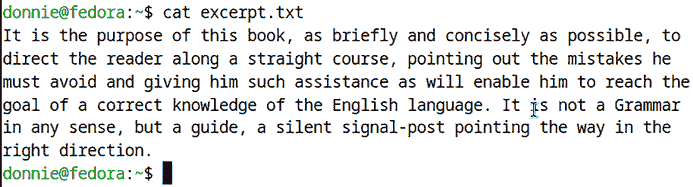

图 7.2：未格式化文本

我决定这有点宽，所以我将使用 `fmt`，它的默认目标设置为每行 75 个字符，如下所示：

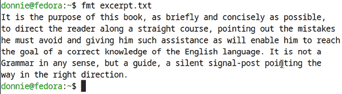

图 7.3：使用 fmt 与默认宽度

它看起来还是有点宽。所以，我们使用 `-w` 开关将宽度缩小到 60 个字符，如下所示：

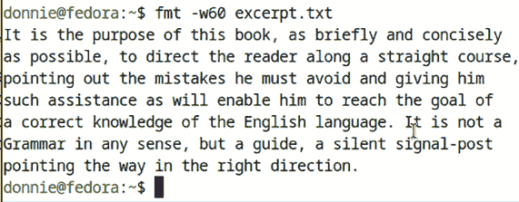

图 7.4：设置 60 个字符的宽度

再想想，咱们试试将行宽设置为 90 个字符，如下所示：

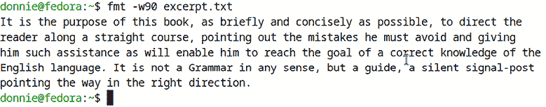

图 7.5：设置 90 个字符的宽度

`-u` 开关确保每个单词之间始终有一个空格，每个句子之间有两个空格，效果如下所示：

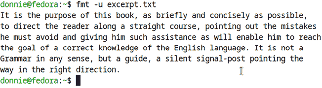

图 7.6：使用 -u 选项

如果你想让长行变短，但不想让短行变长，可以使用 `-s` 开关。（注意，你可以使用一个短划线来组合多个开关。）效果如下所示：

```
[donnie@fedora ~]$ fmt -sw60 excerpt.txt
It is the purpose of this book, as briefly and concisely
as possible, to
direct the reader along a straight course, pointing out
the mistakes he
must avoid and giving him such assistance as will enable
him to reach the
goal of a correct knowledge of the English language. It
is not a Grammar
in any sense, but a guide, a silent signal-post pointing
the way in the
right direction.
[donnie@fedora ~]$ 
```

是的，`-s` 在这个特定的文件中效果不太好，我自己也从来没找到过用它的地方。不过，这并不意味着你永远不会找到用它的情况。

一旦你最终决定喜欢看到的内容，使用重定向器将输出保存到新文件中，像这样：

```
[donnie@fedora ~]$ fmt -uw80 excerpt.txt > formatted_excerpt.txt
[donnie@fedora ~]$ 
```

既然我们已经做够了格式化，现在开始做一些分割吧。

# 使用 `split`

你可以使用 `split` 将一个大的文本文件分割成两个或更多较小的文件。默认情况下，它会将一个大文件分割成每个文件包含 1,000 行的小文件。（当然，最后一个文件可能会更小。）同样，默认情况下，这些新小文件的名称会是 `xaa`、`xab`、`xac` 等等。让我们开始看一下你从古腾堡计划下载的公共领域电子书文件的行数，像这样：

```
[donnie@fedora ~]$ wc -l pg6409.txt
6019 pg6409.txt
[donnie@fedora ~]$ 
```

由于该文件有 6,019 行，`split` 会将它分成六个包含 1,000 行的文件，以及一个仅包含 19 行的文件。它是这样工作的：

```
[donnie@fedora ~]$ split pg6409.txt
[donnie@fedora ~]$ ls -l x*
-rw-r--r--. 1 donnie donnie 38304 Sep 15 17:31 xaa
-rw-r--r--. 1 donnie donnie 48788 Sep 15 17:31 xab
-rw-r--r--. 1 donnie donnie 42676 Sep 15 17:31 xac
-rw-r--r--. 1 donnie donnie 42179 Sep 15 17:31 xad
-rw-r--r--. 1 donnie donnie 54845 Sep 15 17:31 xae
-rw-r--r--. 1 donnie donnie 55021 Sep 15 17:31 xaf
-rw-r--r--. 1 donnie donnie   792 Sep 15 17:31 xag
[donnie@fedora ~]$ 
```

为了验证这个方法，使用 `wc` 执行每个文件的行数统计：

```
[donnie@fedora ~]$ wc -l xaa xab xac xad xae xaf xag
  1000 xaa
  1000 xab
  1000 xac
  1000 xad
  1000 xae
  1000 xaf
    19 xag
  6019 total
[donnie@fedora ~]$ 
```

使用 `-a` 选项来改变新文件名的长度。以下命令将为文件名提供五个字符的后缀。

```
[donnie@fedora ~]$ split -a5 pg6409.txt
[donnie@fedora ~]$ ls -l xaaa*
-rw-r--r--. 1 donnie donnie 38304 Sep 15 17:37 xaaaaa
-rw-r--r--. 1 donnie donnie 48788 Sep 15 17:37 xaaaab
-rw-r--r--. 1 donnie donnie 42676 Sep 15 17:37 xaaaac
-rw-r--r--. 1 donnie donnie 42179 Sep 15 17:37 xaaaad
-rw-r--r--. 1 donnie donnie 54845 Sep 15 17:37 xaaaae
-rw-r--r--. 1 donnie donnie 55021 Sep 15 17:37 xaaaaf
-rw-r--r--. 1 donnie donnie   792 Sep 15 17:37 xaaaag
[donnie@fedora ~]$ 
```

你还可以将文件名的前缀从 `x` 改为你想要的任何内容。只需将所需的前缀添加到命令的末尾，像这样：

```
[donnie@fedora ~]$ split -a5 pg6409.txt pg6409.txt
[donnie@fedora ~]$ ls -l pg6409.txt*
-rw-r--r--. 1 donnie donnie 282605 Sep 13 17:39 pg6409.txt
-rw-r--r--. 1 donnie donnie  38304 Sep 15 17:40 pg6409.txtaaaaa
-rw-r--r--. 1 donnie donnie  48788 Sep 15 17:40 pg6409.txtaaaab
-rw-r--r--. 1 donnie donnie  42676 Sep 15 17:40 pg6409.txtaaaac
-rw-r--r--. 1 donnie donnie  42179 Sep 15 17:40 pg6409.txtaaaad
-rw-r--r--. 1 donnie donnie  54845 Sep 15 17:40 pg6409.txtaaaae
-rw-r--r--. 1 donnie donnie  55021 Sep 15 17:40 pg6409.txtaaaaf
-rw-r--r--. 1 donnie donnie    792 Sep 15 17:40 pg6409.txtaaaag
[donnie@fedora ~]$ 
```

如果你不想使用字母作为文件名的后缀，使用 `-d` 选项来使用数字前缀。（再一次，注意你可以将开关合并，只使用一个短横线。）像这样做：

```
[donnie@fedora ~]$ split -da5 pg6409.txt pg6409.txt
[donnie@fedora ~]$ ls -l pg6409.txt0000*
-rw-r--r--. 1 donnie donnie 38304 Sep 15 17:42 pg6409.txt00000
-rw-r--r--. 1 donnie donnie 48788 Sep 15 17:42 pg6409.txt00001
-rw-r--r--. 1 donnie donnie 42676 Sep 15 17:42 pg6409.txt00002
-rw-r--r--. 1 donnie donnie 42179 Sep 15 17:42 pg6409.txt00003
-rw-r--r--. 1 donnie donnie 54845 Sep 15 17:42 pg6409.txt00004
-rw-r--r--. 1 donnie donnie 55021 Sep 15 17:42 pg6409.txt00005
-rw-r--r--. 1 donnie donnie   792 Sep 15 17:42 pg6409.txt00006
[donnie@fedora ~]$ 
```

但是，如果 1,000 行对你的文件来说太长了怎么办？那就使用 `-l` 选项来将其改为其他值。在这里，我将每个文件设置为 400 行：

```
[donnie@fedora ~]$ split -da5 -l400 pg6409.txt pg6409.txt
[donnie@fedora ~]$ 
```

请注意，每当你使用两个或更多需要数字选项的选项开关时，你必须为每个选项使用单独的短横线。

你可以使用 `-b` 选项来创建特定字节大小的文件。在这里，我将文件分割成每个 900 字节的小块：

```
[donnie@fedora ~]$ split -da5 -b900 pg6409.txt pg6409.txt
[donnie@fedora ~]$ 
```

在数字选项后面加上 `k` 或 `m`，你就可以指定千字节或兆字节，而不是默认的字节。在这个例子中，我假装回到过去，我必须将文件分成两部分，这样我才能将它存储在两个老式的 180-Kbyte 软盘上：

```
[donnie@fedora ~]$ split -da5 -b180k pg6409.txt pg6409.txt
[donnie@fedora ~]$ ls -l pg6409.txt000*
-rw-r--r--. 1 donnie donnie 184320 Sep 15 17:55 pg6409.txt00000
-rw-r--r--. 1 donnie donnie  98285 Sep 15 17:55 pg6409.txt00001
[donnie@fedora ~]$ 
```

我要结束 `split` 的介绍了，我要做一个告白，以便卸下我的心灵负担。正如我在前一段中提到的，`split` 的最初目的是分割那些太大，无法存储在单一老式软盘上的文本文件。

在现代，我们拥有多达几个 TB 容量的硬盘和固态硬盘，以及容量达到几个 GB 的 USB 闪存盘。所以，你可能会发现 `split` 已经不像以前那样有用了。但如果你打算参加 Linux 认证考试，还是要记住它，因为你很可能会遇到一些关于它的问题。

好了，我们已经做够了分割，现在开始做一些翻译吧。

# 使用 `tr`

你可以使用 `tr` 来处理各种转换任务。（毕竟，`tr` 代表 *translate*）。`tr` 不像从一种语言翻译到另一种语言，而是将一个字符转换为另一个字符，或将一组字符转换为另一组字符，或者将一种字符类别转换为另一种字符类别。你还可以从文件中删除选定的字符或消除重复字符。

与我们到目前为止所查看的其他工具相比，`tr` 的操作方式有很大的不同。我们到目前为止查看的其他工具可以通过你在命令行中提供的参数来获取输入。因此，使用这些工具时，你不需要使用 `stdin` 重定向器。`tr` 工具无法使用参数，因此你必须使用 `stdin` 重定向器，或者通过管道从另一个命令传递输入。

对于第一个示例，创建文件 `translation.txt`，并使用 `tr` 更改每个字符的出现方式。让文件看起来像这样：

```
[donnie@fedora ~]$ cat > translation.txt
Let's translate all of the a's into A's.
[donnie@fedora ~]$ 
```

现在，让我们像这样进行实际转换：

```
[donnie@fedora ~]$ tr 'a' 'A' < translation.txt
Let's trAnslAte All of the A's into A's.
[donnie@fedora ~]$ 
```

在 `tr` 后，我将两个文本字符串放在单引号内。第一个字符串表示我要查找并更改的内容，第二个字符串表示我们希望第一个字符串变成什么样。在这个例子中，我希望将所有的小写字母 a 转换为大写字母 A。

你可以通过列出字符或指定字符范围来转换多个字符。在下一个示例中，我选择将 a 转换为 A，将 l 转换为 L。

```
[donnie@fedora ~]$ cat > translation_2.txt
Let's translate all of the a's into A's
and all of the l's into L's.
[donnie@fedora ~]$
[donnie@fedora ~]$ tr 'al' 'AL' < translation_2.txt
Let's trAnsLAte ALL of the A's into A's
And ALL of the L's into L's.
[donnie@fedora ~]$ 
```

使用短横线分隔字符来指定字符范围，例如：

```
[donnie@fedora ~]$ cat > translation_3.txt
Let's now convert everything from             
a through l to A through L.
[donnie@fedora ~]$
[donnie@fedora ~]$ tr 'a-l' 'A-L' < translation_3.txt
LEt's now ConvErt EvErytHInG From
A tHrouGH L to A tHrouGH L.
[donnie@fedora ~]$ 
```

你可以指定多个范围，如下所示：

```
[donnie@fedora ~]$ cat > translation_4.txt
Let's now convert everything from
a through l to A through L, and
everything from u through z to      
U through Z.
[donnie@fedora ~]$
[donnie@fedora ~]$ tr 'a-lu-z' 'A-LU-Z' < translation_4.txt
LEt's noW ConVErt EVErYtHInG From
A tHroUGH L to A tHroUGH L, AnD
EVErYtHInG From U tHroUGH Z to
U tHroUGH Z.
[donnie@fedora ~]$ 
```

其他类型的转换也是可能的。在这里，我将字母 a 到 e 转换为数字 1 到 5：

```
[donnie@fedora ~]$ cat > translation_5.txt
Let's now convert a through e to
1 through 5.
Are we ready?
[donnie@fedora ~]$
[donnie@fedora ~]$ tr 'a-e' '1-5' < translation_5.txt
L5t's now 3onv5rt 1 through 5 to
1 through 5.
Ar5 w5 r514y?
[donnie@fedora ~]$ 
```

与许多这些工具一样，`tr` 提供了多种方法来执行某些操作。例如，要将文件中的所有小写字母转换为大写字母，你可以在命令中指定范围‘a-z’和‘A-Z’，如下所示：

```
[donnie@fedora ~]$ cat > translation_6.txt
Let's now convert all lower-case letters
into upper-case letters.
[donnie@fedora ~]$
[donnie@fedora ~]$ tr 'a-z' 'A-Z' < translation_6.txt
LET'S NOW CONVERT ALL LOWER-CASE LETTERS
INTO UPPER-CASE LETTERS.
[donnie@fedora ~]$ 
```

你也可以使用字符类来执行此转换。**字符类** 由字符类型的名称组成，并置于方括号和冒号字符之间。例如，小写字母的字符类表示为 `[:lower:]`，而大写字母的字符类表示为 `[:upper:]`。因此，上述命令可以这样输入：

```
[donnie@fedora ~]$ tr [:lower:] [:upper:] < translation_6.txt
LET'S NOW CONVERT ALL LOWER-CASE LETTERS
INTO UPPER-CASE LETTERS.
[donnie@fedora ~]$ 
```

这是其余字符类别的表格。

| **类别名称** | **含义** |
| --- | --- |
| `[:alnum:]` | 字母和数字。（换句话说，字母数字混合。） |
| `[:alpha:]` | 字母 |
| `[:blank:]` | 空格 |
| `[:cntrl:]` | 控制字符 |
| `[:digit:]` | 数字 |
| `[:graph:]` | 所有可打印字符，但不包括空格 |
| `[:lower:]` | 所有小写字母 |
| `[:print:]` | 所有可打印字符，包括空格 |
| `[:punct:]` | 所有标点符号字符 |
| `[:space:]` | 垂直或水平空白字符 |
| `[:upper:]` | 所有大写字母 |
| `[:xdigit:]` | 十六进制数字 |

表 7.1：字符类

这看起来很简单，对吧？但不幸的是，这里有一些小问题。看看当我尝试将数字转换为十六进制数字时会发生什么：

```
[donnie@fedora ~]$ tr [:digit:] [:xdigit:] < numbers.txt
tr: when translating, the only character classes that may appear in
string2 are 'upper' and 'lower'
[donnie@fedora ~]$ 
```

这个难题的答案在`tr`的手册页中，其中提到“在转换时，`[:lower:]`和`[:upper:]`可以成对使用来指定大小写转换”。当然，它并没有明确说只有`[:lower:]`和`[:upper:]`可以成对使用，但这是它的含义。然而，你可以在其他类型的`tr`操作中使用这些字符类，稍后我们会讨论到。

如果你想从文本流中删除某些字符，使用`-d`选项。在这个例子中，我将删除文本中的所有元音字母。

注意，在使用`-d`选项时，你只需要指定一个文本字符串或字符类。

下面是这种情况的效果：

```
[donnie@fedora ~]$ cat > translation_7.txt
I will now show you how to delete
all vowels from a text stream. Are
you really ready for this?
[donnie@fedora ~]$
[donnie@fedora ~]$ tr -d 'aeiouAEIOU' < translation_7.txt
 wll nw shw y hw t dlt
ll vwls frm  txt strm. r
y rlly rdy fr ths?
[donnie@fedora ~]$ 
```

添加`-c`选项后，你可以让`tr`操作所有内容，除了你指定的部分。在这里，我将删除所有辅音字母、标点符号、空格和换行符。也就是说，我将删除所有不是元音的字符。准备好，你将看到的效果非常神奇：

```
[donnie@fedora ~]$ cat > translation_8.txt
I'll now show you how to delete
everything except for vowels from
a text stream.
[donnie@fedora ~]$
[donnie@fedora ~]$ tr -dc 'aeiouAEIOU' < translation_8.txt
Iooouooeeeeeieeooeoaeea[donnie@fedora ~]$ 
```

当我说这将删除除元音字母以外的所有内容时，我确实是指*所有内容*，包括不可见的换行符。这也解释了为什么所有元音字母都在同一行，以及为什么命令提示符现在与输出在同一行。

你可以通过指定字符类，而不是字符或字符范围，来做同样的事情。在这个例子中，我正在删除除小写字母之外的所有内容：

```
[donnie@fedora ~]$ tr -dc [:lower:] < translation_9.txt
histimewellremoveeverythingthatalowercaseletter[donnie@fedora ~]$ 
```

这次，让我们去除所有不可打印的控制字符，像这样：

```
[donnie@fedora ~]$ cat > translation_10.txt
Now, let's remove
all of the
control characters.
[donnie@fedora ~]$
[donnie@fedora ~]$ tr -d [:cntrl:] < translation_10.txt
Now, let's removeall of thecontrol characters.[donnie@fedora ~]$ 
```

当然，这个文件中唯一的控制字符是换行符，但没关系。如果你有一个文件，也包含了其他类型的控制字符，而你只想删除所有换行符，只需这样做：

```
[donnie@fedora ~]$ cat > translation_11.txt
Now,
I just want to
delete the
newline characters.
[donnie@fedora ~]$
[donnie@fedora ~]$ tr -d '\n' < translation_11.txt
Now,I just want todelete the newline characters.[donnie@fedora ~]$ 
```

如果你有连续出现的某个字符或字符类，可以使用`-s`选项将它们替换为单个出现。下面是这种情况的示例：

```
[donnie@fedora ~]$ cat > translation_12.txt
Take a look at the poor
yellow dog. The poor little
pooch isn't as peppy as he
used to be.
[donnie@fedora ~]$
[donnie@fedora ~]$ tr -s [:alpha:] < translation_12.txt
Take a lok at the por
yelow dog. The por litle
poch isn't as pepy as he
used to be.
[donnie@fedora ~]$ 
```

如果你指定了两个字符串，并使用了`-s`选项，`tr`会首先将第一个字符串中的字符替换成第二个字符串中的字符。然后，它会挤压出连续出现的字符。如前所述，准备好惊讶吧，你将看到的效果是这样的：

```
[donnie@fedora ~]$ cat > translation_13.txt
tennessee
[donnie@fedora ~]$
[donnie@fedora ~]$ tr -s 'tnse' 'srne' < translation_13.txt
serene
[donnie@fedora ~]$ 
```

所以，我把*tennessee*变成了*serene*。（下次派对上可以用这个技巧，给气氛带来一点活力。）

你可以将`tr`与其他文本流工具结合使用，像这样：

```
[donnie@fedora ~]$ sort autos.txt | tr [:lower:] [:upper:] | head
BMW			325I		1985	115	450
BMW			325I		1985	60	1000
CHEVY		IMPALA		1985	85	1550
CHEVY		MALIBU		1999	50	3500
CHEVY		MALIBU		2000	60	3000
EDSEL		CORSAIR	1958	47	750
FORD			EXPLORER	2003	25	9500
FORD			GALAXIE	1964	128	60
FORD			MUSTANG	1965	45	10000
FORD			TAURUS		2004	10	17000
[donnie@fedora ~]$ 
```

这是`tr`的一个更实用的例子。假设你得到了一个列式数据的文本文件，需要将其格式化以便打印。但这些列之间都是用一个空格分开的，导致一切都没有正确对齐，就像你在这里看到的：

```
[donnie@fedora ~]$ cat > spaces.txt
one two
three four
five six
seven eight
nine ten
[donnie@fedora ~]$ cat spaces.txt
one two
three four
five six
seven eight
nine ten
[donnie@fedora ~]$ 
```

你不能使用`unexpand`来将空格替换为制表符，因为你需要至少两个空格才能让`unexpand`起作用。

在这种情况下，你可以使用`tr`将空格替换为制表符。（注意，单引号之间有一个空格。所以，是的，你可以引号包括空格。）

```
[donnie@fedora ~]$ tr ' ' '\t' < spaces.txt
one		two
three	four
five		six
seven	eight
nine		ten
[donnie@fedora ~]$ 
```

即使你在列之间有多个空格，`unexpand`仍然可能不是最好的选择。在这里，我在列之间放了两个空格：

```
[donnie@fedora ~]$ cat > spaces_2.txt
one  two
three  four
five  six
seven  eight
nine  ten   
[donnie@fedora ~]$ 
```

我会使用`unexpand`和`-t2`选项，这样它只需要两个空格就能表示一个制表符，就像这样：

```
[donnie@fedora ~]$ unexpand -t2 spaces_2.txt
one	 	two
three	 four
five		six
seven	 eight
nine		ten
[donnie@fedora ~]$ 
```

这样稍微好一点了，但看起来还是有点凌乱。所以，我会使用`tr`将空格替换为制表符，像这样：

```
[donnie@fedora ~]$ tr ' ' '\t' < spaces_2.txt
one			two
three		four
five			six
seven		eight
nine			ten
[donnie@fedora ~]$ 
```

更好一点吧？但是，由于原来列之间有两个空格，所以现在列之间有两个制表符。我只想要一个制表符在列之间，所以我会使用`-s`选项来去除多余的制表符，就像这样：

```
[donnie@fedora ~]$ tr -s ' ' '\t' < spaces_2.txt
one		two
three	four
five		six
seven	eight
nine		ten
[donnie@fedora ~]$ 
```

对于最后一个例子，考虑一下我之前给你看的 Project Gutenberg 文件。记得它包含回车符，表示它是在 Windows 电脑上创建的。它看起来像这样：

```
[donnie@fedora ~]$ od -c pg6409.txt | head
0000000 357 273 277 T   h   e       P   r   o   j   e   c   t       G
0000020 u   t   e   n   b   e   r   g       e   B   o   o   k       o
0000040 f       H   o   w       t   o       S   p   e   a   k       a
0000060 n   d       W   r   i   t   e       C   o   r   r   e   c   t
0000100 l   y  \r  \n                  \r  \n   T   h   i   s       e
0000120 b   o   o   k       i   s       f   o   r       t   h   e   
0000140 u   s   e       o   f       a   n   y   o   n   e       a   n
0000160 y   w   h   e   r   e       i   n       t   h   e       U   n
0000200 i   t   e   d       S   t   a   t   e   s       a   n   d  \r
0000220 \n   m   o   s   t       o   t   h   e   r       p   a   r   t
[donnie@fedora ~]$ 
```

正如我之前指出的，每个`\r`表示一个回车符。现在，我们假设这是一个 Linux 配置文件，需要去除回车符，以便 Linux 能够正确读取它。将输出保存到一个新文件中，像这样：

```
[donnie@fedora ~]$ tr -d '\r' < pg6409.txt > pg6409_stripped.txt
[donnie@fedora ~]$ 
```

成功了吗？我们来看看：

```
[donnie@fedora ~]$ od -c pg6409_stripped.txt | head
0000000 357 273 277 T  h   e       P   r   o   j   e   c   t       G
0000020 u   t   e   n  b   e   r   g       e   B   o   o   k       o
0000040 f       H   o  w       t   o       S   p   e   a   k       a
0000060 n   d       W  r   i   t   e       C   o   r   r   e   c   t
0000100 l   y  \n                 \n   T   h   i   s       e   b   o
0000120 o   k       i  s       f   o   r       t   h   e       u   s
0000140 e       o   f      a   n   y   o   n   e       a   n   y   w
0000160 h   e   r   e      i   n       t   h   e       U   n   i   t
0000200 e   d       S  t   a   t   e   s       a   n   d  \n   m   o
0000220 s   t       o  t   h   e   r       p   a   r   t   s       o
[donnie@fedora ~]$ 
```

我没有看到任何回车符，所以它工作得很好。

实际上，大多数人只会使用`dos2unix`工具来去除回车符。但如果你打算参加任何 Linux 认证考试，你可能也想知道如何使用`tr`来完成这项工作。

我们接下来要看的工具会让你想要像海盗一样说话。

# 使用 xargs

我写这篇文章的时机恰到好处，因为今天是*国际海盗日*，而当你正确地发音这个工具的名字时，真的听起来像是海盗会说的那样。所以，现在大家一起用你最好的海盗语气来念一下……

*Xaaaaarrrrrgs!*

好了，够了，别再胡闹了。我们开始工作吧。

说真的，`xargs`是一个非常方便的工具，可以以几种不同的方式使用。不过，由于当前的话题是文本流过滤器，我们暂时只在这个上下文中讨论它。稍后，我会向你展示它的其他用法。

`xargs`本身不能独立工作，它总是与其他工具一起使用。它的目的是从一个源获取输出，并将其用作另一个命令的参数。它的工作方式有点像`find`命令的`-exec`选项，但也有一些不同之处。也就是说，`xargs`不仅可以与`find`一起使用，还可以与其他工具结合使用，它有更多的选项，且效率更高。我们来看几个例子。

如果你想对多个文件进行排序，你可以在调用`sort`时将它们都列出。为了演示这一点，让我们回顾一下我之前让你创建的`actorfile_1.txt`文件和`actorfile_6.txt`文件：

```
[donnie@fedora ~]$ cat actorfile_1.txt
Benny		Jack
Allen		Fred
Ladd			Alan
Hitchcock		Alfred
Robinson		Edgar
[donnie@fedora ~]$ cat actorfile_6.txt
MacLaine		Shirley
Booth		Shirley
Stanwick		Barbara
Allen		Gracie
[donnie@fedora ~]$ 
```

现在，我们把它们一起排序，就像这样：

```
[donnie@fedora ~]$ sort actorfile_1.txt actorfile_6.txt
Allen		Fred
Allen		Gracie
Benny		Jack
Booth		Shirley
Hitchcock		Alfred
Ladd			Alan
MacLaine		Shirley
Robinson		Edgar
Stanwick		Barbara
[donnie@fedora ~]$ 
```

如果你只有两个文件需要排序，这个方法很好用。但如果你有一堆文件需要排序呢？而且，如果你需要定期更新这些文件并在每次更新后重新排序该怎么办？在`sort`命令中列出每个文件很快就会变得繁琐且不方便。为了简化工作，你可以编写一个包含所有文件名的 shell 脚本，或者使用`xargs`配合所有文件的列表。由于我们还没有学习如何编写 shell 脚本，让我们先看看`xargs`。

首先，创建一个包含你要排序的文件列表的文件，如下所示：

```
[donnie@fedora ~]$ cat > xargs_sort.txt
actorfile_1.txt actorfile_6.txt
[donnie@fedora ~]$ 
```

如你所见，所有文件名可以都放在同一行，之间只用一个空格分开。或者，如果你愿意，你也可以将每个文件名放在单独的一行。无论哪种方式，都能正常工作。

现在，使用`xargs`和`sort`读取文件列表，然后对实际文件进行排序，如下所示：

```
[donnie@fedora ~]$ xargs sort < xargs_sort.txt
Allen		Fred
Allen		Gracie
Benny		Jack
Booth		Shirley
Hitchcock		Alfred
Ladd			Alan
MacLaine		Shirley
Robinson		Edgar
Stanwick		Barbara
[donnie@fedora ~]$ 
```

如我所说，如果你有很多需要频繁更新并排序的文件，这个方法非常方便。只需建立一个需要排序的文件列表，这样你就不必每次都输入所有文件的名称。

现在，让我们创建一个包含名称列表的文件，并使用`xargs`将列表传递给`echo`命令，如下所示：

```
[donnie@fedora ~]$ cat > howdy.txt
Jack,
Jane,
Joe,
and John.
[donnie@fedora ~]$
[donnie@fedora ~]$ xargs echo "Howdy" < howdy.txt
Howdy Jack, Jane, Joe, and John.
[donnie@fedora ~]$ 
```

看起来挺酷的吧？（我知道你一定很想在下次聚会上展示这个技巧。）不过，还有更多内容。

你可以使用`-i`选项和一组大括号，将参数放置在输出字符串中的任何位置。

请注意，为了确保这个示例能够正常工作，每个名字必须单独占一行输入文件。这是因为`-i`也会导致命令对输入文件中的每一行调用一次。

无论如何，下面是它的工作原理：

```
[donnie@fedora ~]$ cat > xargs_test.txt
Frank
Goldie
Vicky
[donnie@fedora ~]$
[donnie@fedora ~]$ xargs -i echo "Howdy {}.  Are you busy for lunch?" < xargs_test.txt
Howdy Frank.  Are you busy for lunch?
Howdy Goldie.  Are you busy for lunch?
Howdy Vicky.  Are you busy for lunch?
[donnie@fedora ~]$ 
```

如果我们使用`-n num`选项，我们可以告诉`xargs`在每`num`行输入后执行相关的命令一次。

```
[donnie@fedora ~]$ cat howdy.txt
Jack,
Jane,
Joe,
and John.
[donnie@fedora ~]$
[donnie@fedora ~]$ xargs -n1 echo "Howdy" < howdy.txt
Howdy Jack,
Howdy Jane,
Howdy Joe,
Howdy and
Howdy John.
[donnie@fedora ~]$ 
```

那个方法没有奏效，所以让我们试试`-n2`，看看是否有差别。

```
[donnie@fedora ~]$ xargs -n2 echo "Howdy" < howdy.txt
Howdy Jack, Jane,
Howdy Joe, and
Howdy John.
[donnie@fedora ~]$ 
```

看起来好多了。

最后，我们可以使用`-l num`选项来确定输出的行数。在这里，我们创建了两行输出。

```
[donnie@fedora ~]$ cat howdy.txt
Jack,
Jane,
Joe,
and John.
[donnie@fedora ~]$
[donnie@fedora ~]$ xargs -l2 echo "Howdy" < howdy.txt
Howdy Jack, Jane,
Howdy Joe, and John.
[donnie@fedora ~]$ 
```

目前就这些。`xargs`还有其他用法，我稍后会详细介绍。接下来，让我们为你重要的文本文件做一些最后的润色。

# 使用 pr

你一直在努力工作，使用各种文本流过滤器从文本文件中提取有意义的数据，并生成格式化报告。现在，是时候通过将工作提交到纸面上来回报你的辛勤付出了。当然，你可以在不使用`pr`的情况下打印文件。但是，为了更专业的外观，`pr`可以为你提供完美的修饰。

使用`pr`，你可以轻松地将文件准备好进行打印，通过将它们分成几页，并添加标题和页码。在这方面，它比使用常规文本编辑器更好。实际上，它几乎像是使用一个小型文字处理器。它还提供了其他文本编辑器无法提供的格式化选项。（稍后你会看到一些例子。）

一旦你使用 `pr` 完成了最终格式化，可以通过将 `pr` 的输出通过管道传递给 `lpr` 实用程序，或通过将文件名作为参数调用 `lpr` 来直接从命令行打印。（稍后我会告诉你更多关于 `lpr` 的信息。）你需要知道如何操作，原因有几个。

如果你使用没有安装 GUI 的 Linux 或 Unix 服务器，你需要知道如何从命令行打印，因为文本模式下的文本编辑器不包含打印功能。而且，如果你知道如何从命令行打印，你就能设置批处理作业，一次打印多个文件，并通过设置 `cron` 作业或 `systemd` 定时器来自动化打印。这在你需要定期打印日志文件或报告时非常有用。

默认情况下，`pr` 会将文件拆分为每页 66 行的单倍行距页面。它还会在每页的页眉中放入文件的最后修改日期和时间、文件名以及页码，后面跟着空白行的页脚。然而，使用适当的选项开关，可以更改所有这些设置。让我们先看一个 `pr` 默认行为的示例。以下是来自公共领域电子书《如何正确说话和写作》中的一段摘录：

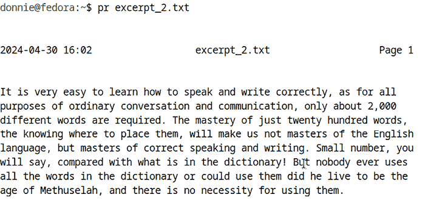

图 7.7：使用默认设置的 pr

由于书籍格式问题，我无法向你展示的是，在最后一行文本之后有很多空白行。这是因为 `pr` 识别到这段简短的摘录并没有填满页面。

你可以使用 `-h` 选项将文件名替换为你选择的页眉，如下所示：

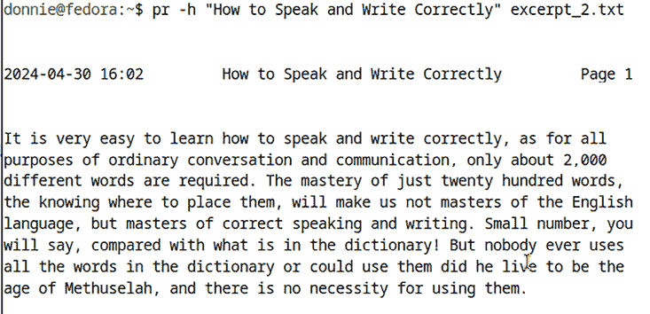

图 7.8：使用 pr 设置自定义页眉

如果你不需要在输出中插入页眉，但仍然需要使用 `pr` 的其他功能，可以使用 `-t` 开关来省略页眉，如下所示：

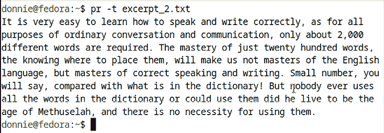

图 7.9：使用 -t 选项

`-d` 选项将使输出内容双倍行距：

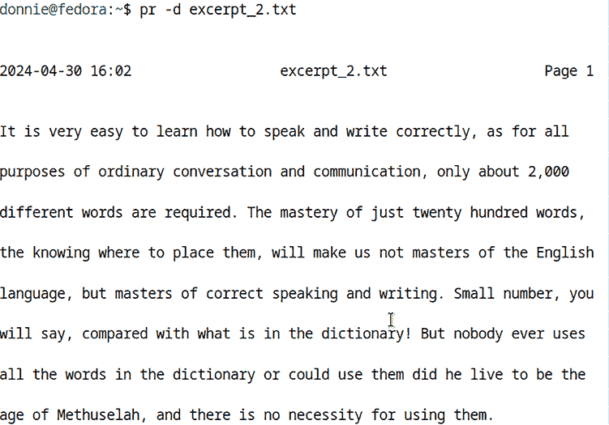

图 7.10：使用 -d 选项

使用 `-o` 选项和一个数字来设置左边距。（该数字代表左边距缩进的空格数。）在这里，我设置了一个八个空格的边距：

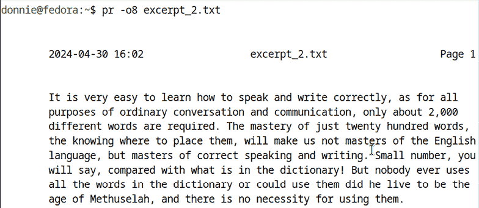

图 7.11：设置左边距

正如我之前所说，默认的页面长度为 66 行。你可以使用 `-l` 选项来更改这一设置。若要设置页面长度为 80 行，请输入：

```
[donnie@fedora ~]$ pr -l80 excerpt_2.txt 
```

默认情况下，`pr` 通过在每页的末尾插入多个换行符来分隔页面。要改为插入单个分页符，可以使用 `-f` 选项。如果需要插入行号，则使用 `-n` 选项。在这里，我将这两个选项合并成一个短横线：

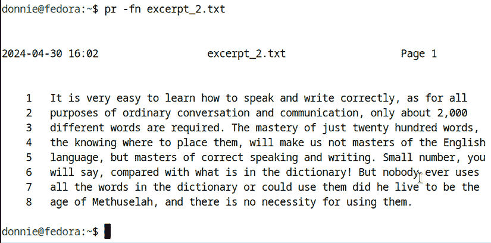

图 7.12：使用分页符并添加行号

要处理一系列页面，只需在第一个页面号前面加一个 `+`，并在最后一个页面号前面加上冒号。这里，我选择查看 `pg6409.txt` 文件的第 10 页到第 12 页：

```
[donnie@fedora ~]$ pr +10:12 pg6409.txt
2023-09-13 17:39                   pg6409.txt                    Page 10
_Thou_, _He_, _She_, and _It_, with their plurals, _We_, _Ye_ or _You_
and _They_.
. . .
. . .
[donnie@fedora ~]$ 
```

如果省略最后一个页面号，你将看到从第一页到文件结尾的所有内容。这里，我查看的是从 103 页到文件结尾的内容：

```
[donnie@fedora ~]$ pr +103 pg6409.txt
2023-09-13 17:39                   pg6409.txt                   Page 103
1.A. By reading or using any part of this Project Gutenberg™
electronic work, you indicate that you have read, understand, agree to
. . .
. . .
[donnie@fedora ~]$ 
```

我把列和合并选项放到最后，因为它们是最难使用的。

列选项允许你将文本输出为多个列。通过使用一个`-`符号后跟一个数字来设置它。诀窍是，你首先需要格式化你的文本，使其不至于过宽，无法适应列。以下是如果你尝试将我们的示例文本作为两列页面输出时的结果：

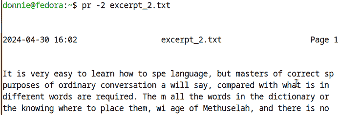

图 7.13：使用两列的第一次尝试

你可以看到这并不太有用，因为有太多内容被省略了。处理这个问题的最简单方法是使用`fmt`更改行宽，然后将输出管道传递给`pr`，像这样：

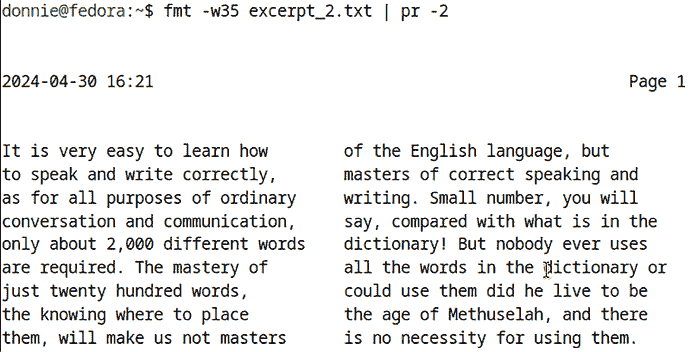

图 7.14：结合 fmt 和 pr

当然，你可能需要反复调整行宽，直到达到想要的效果。

你会在合并选项中遇到相同的问题。在这里，我使用`-m`开关来并排显示两个文件：

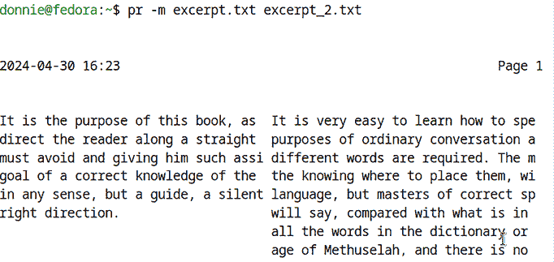

图 7.15：第一次尝试合并两个文件

再次，你会发现这些行太宽，无法在两列中正确显示。处理这个问题的最佳方法是使用`fmt`缩短行宽，但将输出保存到两个中间文件中。然后，使用`pr`合并这两个新文件。下面是这个过程的样子：

```
[donnie@fedora ~]$ fmt -w35 excerpt.txt > excerpt_fmt.txt
[donnie@fedora ~]$ fmt -w35 excerpt_2.txt > excerpt_2_fmt.txt 
```

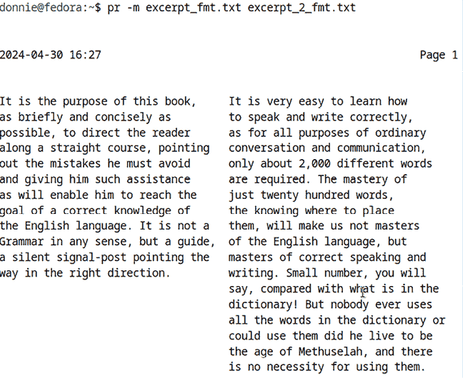

图 7.16：合并两个格式化的文件

一旦你在屏幕上看起来一切正常，你就可以准备将 `pr` 输出重定向到一个新的文本文件，然后打印它。

# 从命令行打印

正如我之前提到的几次，确实可以从命令行打印文本文件。（实际上，你还可以从命令行打印 PostScript 文件、`.pdf` 文件、图像文件以及其他一些类型的文档文件。但现在，我们只关注文本文件的打印。）为此，你的 Linux、Unix 或类 Unix 机器需要安装以下两项内容：

+   **常见的 Unix 打印软件** (**CUPS**)：这通常在 Linux 桌面版本中默认安装，但在 Linux 文本模式服务器版本中未安装。

+   **打印机的正确驱动程序**：CUPS 包括了许多现成的打印机驱动程序。然而，您的特定打印机可能不包括在内。如果是这种情况，您需要从打印机制造商处获取正确的驱动程序，并按照他们的安装说明进行安装。

安装 CUPS 通常很容易，因为它已经包含在大多数 Linux 发行版的仓库中。在任何类型的 Red Hat 风格机器上，如 Fedora、AlmaLinux、Rocky Linux、Oracle Linux 或 RHEL，只需执行：

```
sudo dnf install cups 
```

在 Debian 或其任何衍生版本中，你需要安装两个软件包。要安装它们，只需执行：

```
sudo apt install cups cups-bsd 
```

接下来，你需要找出 CUPS 是否包含你的打印机驱动程序。在 Red Hat 类型的系统上，可以使用`lpinfo -m`命令，在 Debian 类型的系统上，可以使用`sudo lpinfo -m`命令。

如果你想滚动查看整个列表，可以将输出管道传输到`less`。或者，如果你想查找特定打印机制造商，可以将输出管道传输到`grep`，这看起来像这样：

```
donnie@debian:~$ sudo lpinfo -m | grep -i brother
donnie@debian:~$ 
```

所以，Debian 版的 CUPS 并没有包含任何 Brother 打印机的驱动程序。但是，正如你在这里看到的，我的 Fedora 工作站上的 CUPS 却有相当多的 Brother 打印机驱动程序可供选择：

```
[donnie@fedora ~]$ lpinfo -m | grep -i brother
gutenprint.5.3://brother-dcp-1200/expert Brother DCP-1200 - CUPS+Gutenprint v5.3.4
gutenprint.5.3://brother-dcp-1200/simple Brother DCP-1200 - CUPS+Gutenprint v5.3.4 Simplified
gutenprint.5.3://brother-dcp-8045d/expert Brother DCP-8045D - CUPS+Gutenprint v5.3.4
gutenprint.5.3://brother-dcp-8045d/simple Brother DCP-8045D - CUPS+Gutenprint v5.3.4 Simplified
. . .
. . .
gutenprint.5.3://brother-mfc-9600/expert Brother MFC-9600 - CUPS+Gutenprint v5.3.4
gutenprint.5.3://brother-mfc-9600/simple Brother MFC-9600 - CUPS+Gutenprint v5.3.4 Simplified
MFC7460DN.ppd Brother MFC7460DN for CUPS
lsb/usr/MFC7460DN.ppd Brother MFC7460DN for CUPS
[donnie@fedora ~]$ 
```

唯一的问题是，Fedora 工作站没有为我的 Brother MFC7460DN 打印机提供驱动程序，所以我不得不从 Brother 官网上下载驱动并自行安装。（我安装的驱动程序在这个列表中的最后两个项目。）`lpstat -p -d`命令可以显示我的打印机状态，正如你在这里看到的：

```
[donnie@fedora ~]$ lpstat -p -d
printer MFC7460DN is idle.  enabled since Tue 19 Sep 2023 06:17:03 PM EDT
system default destination: MFC7460DN
[donnie@fedora ~]$ 
```

很棒。它已经准备好了。

一旦你设置好一切，就可以使用`lp`或`lpr`进行打印。（这两个是不同的工具，但它们执行的是相同的操作，只是选项开关不同。为了简化，我将只展示`lpr`。）要打印到特定的打印机，可以像这样操作：

```
[donnie@fedora ~]$ lpr -P MFC7460DN somefile.txt 
```

`-P`选项将打印作业定向到指定的打印机。如果你不想每次都指定打印机，可以像这样设置默认打印机：

```
[donnie@localhost ~]$ lpoptions -d MFC7460DN 
```

（注意，这在 Debian 类型的系统上需要`sudo`权限。）

一旦你指定了默认打印机，就可以像这样执行打印作业：

```
[donnie@fedora ~]$ lpr somefile.txt 
```

如果你有多个文件需要打印，不必发出多个`lpr`命令。相反，只需将你要打印的文件名放入一个单独的文本文件中，然后使用`xargs`读取列表。这样看起来会像这样：

```
[donnie@fedora ~]$ xargs lpr < print_list.txt
[donnie@fedora ~]$ 
```

很简单，对吧？事实上，你可以使用`lp`或`lpr`命令进行更多打印选项，不过现在我们就先从基础开始。要查看完整的`lp`和`lpr`打印教程，最好的方法是打开 Linux 桌面机器上的网页浏览器，然后导航到`http://localhost:631`。除了教程，你还会看到可以通过网页界面执行某些管理功能。

好的，我想这一章就到这里了。让我们总结一下并继续前进。

# 总结

在本章中，我向你展示了更多的工具，你可以使用它们将文本文件格式化为你或你的雇主可能需要的样式。最后，在章节结尾，我展示了在文本模式服务器上设置打印机的基本步骤。

这一切的美妙之处在于，您可以创建 shell 脚本，这些脚本会自动从各种来源获取信息，创建格式正确的文本文件，然后打印它们。您甚至可以通过创建 `cron` 作业或 `systemd` 定时器来让脚本自动运行。

哦，我还没给你展示如何创建 shell 脚本，对吧？没关系，因为这将是下一章的内容。我们到时候见。

# 问题

1.  以下哪两个命令可以用来检查一个文本文件是否包含回车符？（选择两个。）

    1.  `od -tx filename.txt`

    1.  `od -tc filename.txt`

    1.  `od -ta filename.txt`

    1.  `od -td filename.txt`

1.  您已经创建了一个包含其他文本文件列表的文本文件。现在，您想要对列表中的所有文件进行排序，并将输出保存到一个新文件中。您会使用以下哪个命令？

    1.  `sort sort_list.txt > combined_sorted.txt`

    1.  `xargs sort sort_list.txt > combined_sorted.txt`

    1.  `xargs sort < sort_list.txt > combined_sorted.txt`

    1.  `sort < sort_list.txt > combined_sorted.txt`

1.  以下哪个命令可以为文本文件中的所有行添加行号？

    1.  `nl -a file.txt`

    1.  `nl file.txt`

    1.  `nl -bn file.txt`

    1.  `nl -ba file.txt`

1.  在准备打印文本文件的最后一步中，您最可能使用哪个工具？

    1.  `fmt`

    1.  `pr`

    1.  `lp`

    1.  `lpr`

1.  以下哪个命令可以用来验证您的打印机驱动程序是否已安装在计算机上？

    1.  `lpinfo -m`

    1.  `lpstat -p -d`

    1.  `lpr -i`

    1.  `lp -i`

# 进一步阅读

+   nl 命令在 Linux 中的示例：[`linuxconfig.org/nl`](https://linuxconfig.org/nl)

+   Linux 中的 head 命令（5 个必备示例）：[`linuxhandbook.com/head-command/`](https://linuxhandbook.com/head-command/)

+   使用 od 查看文本格式：[`bash-prompt.net/guides/od/`](https://bash-prompt.net/guides/od/)

+   wc 命令在 Linux 中的示例：[`www.geeksforgeeks.org/wc-command-linux-examples/`](https://www.geeksforgeeks.org/wc-command-linux-examples/)

+   Linux 中的 tr 命令及示例：[`linuxize.com/post/linux-tr-command/`](https://linuxize.com/post/linux-tr-command/)

+   如何使用 Linux tr 命令：[`www.howtogeek.com/886723/how-to-use-the-linux-tr-command/`](https://www.howtogeek.com/886723/how-to-use-the-linux-tr-command/)

+   像海盗一样说话日：[`nationaltoday.com/talk-like-a-pirate-day/`](https://nationaltoday.com/talk-like-a-pirate-day/)

+   如何在 Linux 中使用 xargs 命令：[`www.howtogeek.com/435164/how-to-use-the-xargs-command-on-linux/`](https://www.howtogeek.com/435164/how-to-use-the-xargs-command-on-linux/)

+   我如何使用 Linux fmt 命令格式化文本：[`opensource.com/article/22/7/fmt-trivial-text-formatter`](https://opensource.com/article/22/7/fmt-trivial-text-formatter)

+   pr 命令在 Linux 中：[`www.geeksforgeeks.org/pr-command-in-linux/`](https://www.geeksforgeeks.org/pr-command-in-linux/)

+   精通 Linux “pr” 命令：全面指南：[`hopeness.medium.com/master-the-linux-pr-command-a-comprehensive-guide-b166865c933e`](https://hopeness.medium.com/master-the-linux-pr-command-a-comprehensive-guide-b166865c933e)

# 答案

1.  b 和 c

1.  c

1.  d

1.  b

1.  a

# 加入我们在 Discord 上的社区！

与其他用户、Linux 专家以及作者本人一起阅读本书。

提问、为其他读者提供解决方案、通过“问我任何问题”环节与作者交流，等等。扫描二维码或访问链接加入社区。

[`packt.link/SecNet`](https://packt.link/SecNet)


