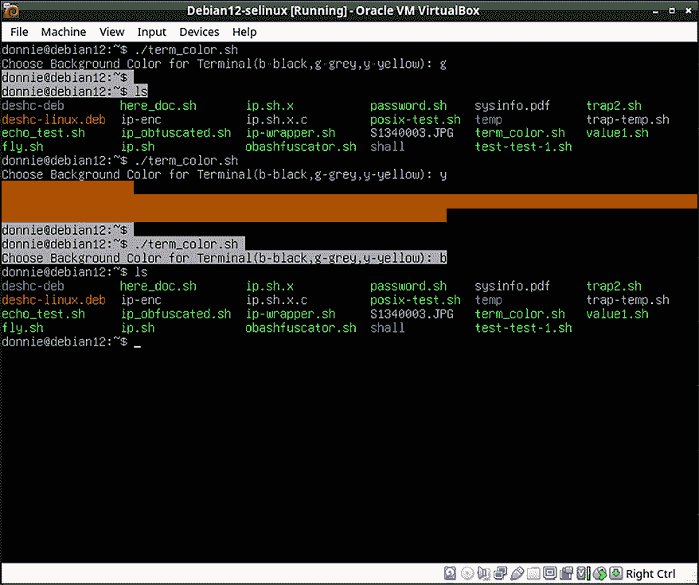

# 基本 Shell 脚本构建

是的，我知道，你迫不及待想开始编写一些 shell 脚本，但还没有机会做到。所以，在本章中，我们将学习 shell 脚本构建的基础知识。然后，我们将通过一些既实用又有用的 shell 脚本来总结内容。

本章中我介绍的许多技巧适用于任何 shell，但我也会介绍一些可能仅适用于`bash`的技巧。所以，为了简化起见，我现在将继续使用`bash`。在*第二十二章，使用 zsh Shell*中，我会向你展示一些特定于`zsh`的技巧。在*第十九章，Shell 脚本移植性*中，我会向你展示一些可以在各种 shell 上工作的技巧。

本章中将涉及的主题包括：

+   理解基本的 shell 脚本构建

+   执行测试

+   理解子 shell

+   理解脚本变量

+   理解数组变量

+   理解变量扩展

+   理解命令替换

+   理解决策和循环

+   理解位置参数

+   理解退出码

+   更多关于 echo 的信息

+   查看一些真实世界的例子

好的，如果你准备好了，我们就开始吧。

# 技术要求

使用任何已安装`bash`的 Linux 发行版。如果你是 Mac 用户，你可能需要使用其中一个 Linux 虚拟机，因为一些脚本使用的命令在 macOS 上无法运行。你可以在本地机器上跟随本章的内容，但也要知道，我将提供一些实际的动手实验。

我还包含了一个使用 FreeBSD 虚拟机的动手练习。创建 FreeBSD 虚拟机并安装`sudo`和`bash`，就像我在本书的*前言*中所展示的那样。

另外，正如我在*前言*中所解释的，你可以通过以下方式从 Github 仓库下载脚本：

```
git clone https://github.com/PacktPublishing/The-Ultimate-Linux-Shell-Scripting-Guide.git 
```

# 理解基本的 Shell 脚本构建

创建 shell 脚本时，你首先需要做的就是定义你希望使用的 shell 来解释脚本。

你可能有选择某个 shell 而非另一个的特定原因。这是我们将在*第十九章，Shell 脚本移植性*和*第二十二章，使用 Z Shell*中讨论的内容。

你将在**shebang 行**中定义要作为解释器使用的 shell，它是脚本的第一行。它的形式类似于这样：

```
#!/bin/bash 
```

通常情况下，以`#`符号开头的行表示注释，shell 会忽略这些行。而 shebang 行——请不要问我为什么它叫这个名字——是这个规则的例外。除了定义你想使用的特定 shell，比如`/bin/bash`或`/bin/zsh`，你还可以定义通用的`/bin/sh` shell，使得你的脚本更加便于移植，从而能在更广泛的 shell 和操作系统上运行。它是这样显示的：

```
#!/bin/sh 
```

这种通用的 `sh` shell 旨在让你可以在不同的系统上运行你的脚本，这些系统可能会或可能不会安装 `bash`。但它也有问题，因为 `sh` 代表的各种 shell 之间并不完全兼容。下面是它的工作原理：

+   在 FreeBSD 和可能的其他 **伯克利软件分发（Berkeley Software Distribution，简称 BSD）** 类型的系统中，`sh` 可执行文件是旧版 Bourne shell，它是 Bourne Again Shell（`bash`）的前身。

+   在 Red Hat 类型的系统中，`sh` 是指向 `bash` 可执行文件的符号链接。请注意，`bash` 可以使用其他 shell 无法使用的某些编程功能。（我将在*第十九章，Shell 脚本的可移植性*中进一步解释这一点。）

+   在 Debian/Ubuntu 类型的系统中，`sh` 是指向 `dash` 可执行文件的符号链接。`dash` 代表**Debian Almquist Shell**，它是 `bash` 的一种更快、更轻量的实现。

+   在 Alpine Linux 中，`sh` 是指向 `ash` 的符号链接，`ash` 是 `busybox` 可执行文件的一部分，是一个轻量级的 shell。（在 Alpine 中，`bash` 默认并未安装。）

+   在 OpenIndiana 中，这是 Oracle 的 Solaris 操作系统的**自由开源软件（Free Open Source Software，简称 FOSS）** 版本，`sh` 是指向 `ksh93` shell 的符号链接。这个 shell，也被称为 Korn shell，与 `bash` 有一定但不完全的兼容性。（它是由名为 David Korn 的人创建的，与任何蔬菜无关。）

+   在 macOS 中，`sh` 是指向 `bash` 的符号链接。（有趣的是，`zsh` 是 macOS 默认的登录 shell，但 `bash` 仍然是默认安装的，并且可以使用。）

要注意，使用 `#!/bin/sh` 在你的脚本中可能会有问题。因为不同操作系统上 `#!/bin/sh` 代表的各种 shell 之间并不完全兼容。举个例子，假设你在一个 Red Hat 机器上创建脚本，在该机器上 `sh` 指向 `bash`。那么，这个脚本在 Debian 或 FreeBSD 机器上可能无法运行，因为在 Debian 上 `sh` 指向 `dash`，在 FreeBSD 上 `sh` 指向 Bourne shell。由于这个原因，我们现在将专注于 `bash`，并使用 `#!/bin/bash` 作为我们的 shebang 行。如我之前所提到的，我们将在*第十九章，Shell 脚本的可移植性*中详细讨论这个话题。

一个 shell 脚本可以根据你的需求简单或复杂。它可以只是将一个或多个普通的 Linux/Unix 命令按顺序放在列表中执行。或者，你也可以编写接近高级编程语言（如 C）复杂度的脚本。

让我们先来看一个非常简单的单命令脚本。

```
#!/bin/bash
rsync -avhe ssh /var/www/html/course/images/ root@192.168.0.22:/var/www/html/course/images/ 
```

这是我以前用来将我的 `images` 目录从一台计算机备份到 Debian 计算机的备份目录的一个简单一行脚本。它使用 `rsync`，并带有适当的选项，通过安全 Shell (`ssh`) 会话同步这两个目录。（虽然我通常不喜欢允许 root 用户进行 `ssh` 登录，但在这种情况下它是必须的。显然，我只会在本地网络中进行此操作，绝不会在互联网上进行。）为了适当起见，我将脚本命名为 `rsync_with_debian`。在我运行脚本之前，我需要添加可执行权限，方法如下：

```
chmod u+x rsync_with_debian 
```

在 `rsync_with_debian` 脚本的第二行，也就是 shebang 行之后，你会看到与我如果没有脚本而直接在命令行输入的命令完全相同。可以看出，通过创建脚本，我大大简化了操作。

为了让所有系统用户都能使用这个脚本，需将它放在 `/usr/local/bin/` 目录下，这个目录应该在每个人的 `PATH` 设置中。

在继续之前，让我们通过一个动手实验来巩固你刚刚学到的内容。

## 实验 – 统计已登录的用户

这个实验将帮助你创建一个 Shell 脚本，显示当前登录的用户数量，然后修改它，使其只列出唯一的用户。（这个脚本使用了你在前两章中学到的一些文本流过滤器。）

1.  在你的某一台 Linux 虚拟机上，创建三个额外的用户账户。在你的 Fedora 虚拟机上，按以下方式操作，只需选择你自己的用户名：

    ```
    sudo useradd vicky
    sudo passwd vicky 
    ```

在 Debian 虚拟机上，按如下方式操作：

```
sudo adduser vicky 
```

1.  在虚拟机的本地终端上，获取其 IP 地址，方法如下：

    ```
    ip a 
    ```

1.  在你的主机上打开四个终端窗口。使用你虚拟机的 IP 地址，从一个窗口登录到自己的账户，然后从其他窗口登录到其他账户。命令如下所示：

    ```
    ssh vicky@192.168.0.9 
    ```

1.  从你登录的终端窗口中，查看所有当前登录的用户，方法如下：

    ```
    who 
    ```

你应该能看到五个用户，因为你的账户会显示一次本地终端登录的信息，并且显示一次远程 `ssh` 登录的信息。

1.  创建 `logged-in.sh` 脚本，并使其如下所示：

    ```
    #!/bin/bash
    users="$(who | wc -l)"
    echo "There are currently $users users logged in." 
    ```

我使用了 **命令替换** 的概念，将 `who | wc -l` 命令的输出赋值给 `users` 脚本变量。（稍后我会详细讲解命令替换，所以现在不必担心它。）

1.  让脚本具有可执行权限，方法如下：

    ```
    chmod u+x logged-in.sh 
    ```

1.  现在，运行脚本，方法如下：

    ```
    ./logged-in.sh 
    ```

输出应如下所示：

```
There are currently 5 users logged in. 
```

这里的问题是，实际上只有四个用户，因为你自己的用户名被计算了两次。所以，让我们来解决这个问题。

1.  修改 `logged-in.sh` 脚本，使其现在看起来如下：

    ```
    #!/bin/bash
    users="$(who | wc -l)"
    echo "There are currently $users users logged in."
    echo
    uniqusers="$(who | cut -d" " -f1 | sort | uniq | wc -l)"
    echo "There are currently $uniqusers unique users logged in." 
    ```

变量`uniqusers`是通过所有通过管道传递到彼此之间的命令创建的。`cut`操作通过空格（`-d" "`）分隔，并且第一个字段（`-f1`）是从`who`命令输出中切割出来的内容。该输出被传递到`sort`，然后再传递到`uniq`，这将只将唯一用户的名称传递给`wc -l`命令。

1.  再次运行脚本，输出应该像这样：

    ```
    There are currently 5 users logged in.
    There are currently 4 unique users logged in. 
    ```

1.  对脚本做最后的修改，以列出登录用户的唯一名称。完成的脚本将如下所示：

    ```
    #!/bin/bash
    users="$(who | wc -l)"
    echo "There are currently $users users logged in."
    echo
    uniqusers="$(who | cut -d" " -f1 | sort | uniq | wc -l)"
    echo "There are currently $uniqusers unique users logged in."
    echo
    listusers="$(who | cut -d" " -f1 | sort | uniq)"
    echo "These users are currently logged in: \n$listusers " 
    ```

1.  再次运行脚本，你应该会得到类似这样的输出：

    ```
    There are currently 5 users logged in.
    There are currently 4 unique users logged in.
    These users are currently logged in:
    cleopatra
    donnie
    frank
    vicky 
    ```

恭喜！你刚刚创建了你的第一个 Shell 脚本。现在，让我们进行一些测试。

# 执行测试

当你的脚本需要在做出行动决定之前测试某个条件时，会有一些情况。你可能需要检查某个文件或目录是否存在，文件或目录上是否设置了特定的权限，或者其他各种情况。有三种执行测试的方法，分别是：

+   使用关键字`test`，后跟一个测试条件，并用`&&`或`||`结构将另一个命令与其连接。

+   将测试条件括在一对方括号中。

+   使用`if...then`结构

让我们首先来看一下`test`关键字。

## 使用`test`关键字

对于第一个例子，让我们测试某个目录是否存在，如果不存在则创建它。操作如下：

```
[donnie@fedora ~]$ test -d graphics || mkdir graphics
[donnie@fedora ~]$ ls -ld graphics/
drwxr-xr-x. 1 donnie donnie 0 Sep 26 15:41 graphics/
[donnie@fedora ~]$ 
```

现在，让我们将其放入`test_graphics.sh`脚本中：

```
#!/bin/bash
cd
pwd
test -d graphics || mkdir graphics
cd graphics
pwd 
```

让我们运行这个脚本，看看结果如何：

```
[donnie@fedora ~]$ ./test_graphics.sh
/home/donnie
/home/donnie/graphics
[donnie@fedora ~]$ 
```

正如你可能已经猜到的，`-d`操作符代表*目录*。`||`结构会在`graphics`目录不存在时执行`mkdir`命令。当然，如果目录已经存在，它将不会被重新创建。这是一个很好的安全措施，可以防止你不小心覆盖现有的文件或目录。（稍后我会给你展示一个包含更多`test`操作符的表格。）

现在，让我们来看第二种执行测试的方法。

## 将测试条件括在方括号中

执行测试的第二种方法是将测试条件括在一对方括号中，如下所示：

```
[ -d graphics ] 
```

首先，注意在第一个括号后和第二个括号前必须有一个空格。这就像`test -d`结构一样，测试`graphics`目录是否存在。现在，让我们把它放到`test_graphics_2.sh`脚本中，如下所示：

```
#!/bin/bash
cd
pwd
[ -d graphics ] || mkdir graphics
cd graphics
pwd 
```

运行这个脚本将产生与第一个脚本完全相同的输出。现在，让我们来点不同的。修改`test_graphics_2.sh`脚本，使其看起来像这样：

```
#!/bin/bash
cd
pwd
[ ! -d graphics ] && mkdir graphics
cd graphics
pwd 
```

`!`是一个否定运算符，它使受影响的运算符做相反的事情。在这种情况下，`!`使`-d`运算符检查`graphics`目录的*不存在*。为了使其正确工作，我还需要将`||`运算符改为`&&`运算符。（另外，请注意`!`和`-d`之间必须有一个空格。）

你还可以测试数值，如下所示：

```
[ $var -eq 0 ] 
```

你看到我正在调用变量`var`的值，并测试它是否等于（`-eq`）0。与其在这里使用否定（`!`）来判断变量是否*不*等于 0，不如使用`-ne`运算符。我们来看一下`test_var.sh`脚本中是如何表现的：

```
#!/bin/bash
var1=0
var2=1
[ $var1 -eq 0 ] && echo "$var1 is equal to zero."
[ $var2 -ne 0 ] && echo "$var2 is not equal to zero." 
```

现在，让我们来运行一下：

```
[donnie@fedora ~]$ ./test_var.sh
0 is equal to zero.
1 is not equal to zero.
[donnie@fedora ~]$ 
```

执行测试的第三种方式是使用`if...then`结构，我们接下来会简要讲解。

## 使用`if...then`结构

使用`if...then`结构在你有更复杂的测试条件时非常有用。这里是一个最基本的例子，以`test_graphics_3.sh`脚本的形式：

```
#!/bin/bash
cd
pwd
if [ ! -d graphics ]; then
        mkdir graphics
fi
cd graphics
pwd 
```

这个结构以`if`语句开始，以`fi`语句结束。（这就是`if`倒写过来的样子。）在测试条件后加上分号，然后跟上关键字`then`。之后，指定你想执行的操作，在这个例子中是`mkdir graphics`。尽管在 Shell 脚本中不像在其他语言中那样强制缩进操作块，但缩进确实有助于提高脚本的可读性。

当然，`if...then`结构不仅仅是这样，还有更多内容。不过不用担心，因为在*理解决策和循环*部分，我会给你展示更多内容。在我们到达那里之前，我想先给你展示一些可以用来美化`if...then`结构的其他概念。

现在，让我们来看一下你可以进行的其他各种测试。

## 使用其他类型的测试

你可以进行更多种类的测试，包括文本字符串比较、数值比较、文件或目录是否存在以及它们上面设置了哪些权限。以下是更常用测试及其运算符的图表：

| **运算符** | **测试** |
| --- | --- |
| `-b filename` | 如果指定的文件名是块设备文件，则为真。 |
| `-c filename` | 如果指定的文件名是字符设备文件，则为真。 |
| `-d directory_name` | 如果指定的目录名称存在，则为真。 |
| `-e filename` | 如果指定的文件名存在任意类型的文件，则为真。 |
| `-f filename` | 如果指定的文件名是常规文件，则为真。 |
| `-g filename` | 如果文件或目录具有 SGID 权限，则为真。 |
| `-G filename` | 如果文件存在且属于有效的组 ID，则为真。 |
| `-h filename` | 如果文件存在且是符号链接，则为真。 |
| `-k filename` | 如果文件或目录存在且设置了粘滞位，则为真。 |
| `-L filename` | 如果文件存在且是符号链接。（这与`-h`相同。） |
| `-p filename` | 如果文件存在并且是一个命名管道，则为真 |
| `-O filename` | 如果文件存在并且属于有效用户 ID，则为真 |
| `-r filename` | 如果文件存在并且是可读的，则为真 |
| `-S filename` | 如果文件存在并且是一个套接字，则为真 |
| `-s filename` | 如果文件存在且大小大于零字节，则为真 |
| `-u filename` | 如果文件存在并且设置了 SUID 位，则为真 |
| `-w filename` | 如果文件存在并且是可写的，则为真 |
| `-x filename` | 如果文件存在并且是可执行文件，则为真 |
| `file1 -nt file2` | 如果 file1 比 file2 更新，则为真 |
| `file1 -ot file2` | 如果 file1 比 file2 旧，则为真 |
| `-z string` | 如果文本字符串的长度为 0，则为真 |
| `-n string` | 如果文本字符串的长度不为 0，则为真 |
| `string1 == string2` | 如果两个文本字符串相同，则为真 |
| `string1 != string2` | 如果两个文本字符串不相同，则为真 |
| `string1 < string2` | 如果 `string1` 在字母顺序上排在 `string2` 前面，则为真 |
| `string1 > string2` | 如果 `string1` 在字母顺序上排在 `string2` 后面，则为真 |
| `integer1 -eq integer2` | 如果两个整数相等，则为真 |
| `integer1 -ne integer2` | 如果两个整数不相等，则为真 |
| `integer1 -lt integer2` | 如果 `integer1` 小于 `integer2`，则为真 |
| `integer1 -gt integer2` | 如果 `integer1` 大于 `integer2`，则为真 |
| `integer1 -le integer2` | 如果 `integer1` 小于或等于 `integer2`，则为真 |
| `integer1 -ge integer2` | 如果 `integer1` 大于或等于 `integer2`，则为真 |
| `-o optionname` | 如果启用了某个 shell 选项，则为真 |

我知道，这信息量挺大的，不是吗？但没关系。如果你不想记住所有这些内容，只需随时参考这张表格即可。

接下来，让我们来谈谈子 Shell。

# 理解子 Shell

当你使用 `[ $var -ne 0 ]` 构造执行测试时，该测试会调用一个 **子 Shell**。为了防止测试调用子 Shell，使用以下构造：

```
[[ $var -ne 0 ]] 
```

这可以使你的脚本运行得更高效，这对你的特定脚本可能是一个大问题，也可能不是。

这种 `[[. . .]]` 类型的构造在执行需要匹配模式与正则表达式的测试时也非常必要。 (在 `[. . .]` 构造中无法使用正则表达式进行匹配。)

这个 `[[. . .]]` 构造的缺点是你不能在某些非 `bash` 的 Shell 中使用它，例如 `dash`、`ash` 或 `Bourne`。 (你将在 *第十九章，Shell 脚本的可移植性* 中看到这一点。)

当然，你现在可能还不知道什么是正则表达式，但没关系。*第九章，使用 grep、sed 和正则表达式过滤文本* 会详细介绍它们。

无论如何，你总是可以尝试在使用子 Shell 和不使用子 Shell 的情况下运行你的脚本，看看哪种方式对你更有效。

我们现在已经看过了执行测试的三种方法。那么，不妨来做一些实践，进行一次实验室操作？

# 实验室操作 – 测试条件

对于这一步，从 Github 仓库下载`tests-test.sh`脚本。（由于书籍格式的考虑，这个脚本比较长，我无法在这里重现。）在文本编辑器中打开脚本，并检查它是如何构建的。你首先会看到它在检查`myfile.txt`文件是否存在，如下所示：

```
#!/bin/bash
[ -f myfile.txt ] && echo "This file exists." || echo "This file does not exist." 
```

之后，你将看到创建文件的命令（如果文件不存在），如下所示：

```
echo "We will now create myfile.txt if it does not exist, and make it with only read permissions for $USER."
[ -f myfile.txt ] || touch myfile.txt 
```

接下来，你将看到命令将`400`设置为权限设置，这意味着用户有权限读取文件，但没有人有权限写入文件。然后，我们想验证所有写权限是否已被移除。如下所示：

```
chmod 400 myfile.txt
ls -l myfile.txt
echo
echo "We will now see if myfile.txt is writable."
[ -w myfile.txt ] && echo "This file is writable." || echo "This file is not writable." 
```

在进行了更多权限设置操作并进行了测试后，你将看到这个代码段，它测试一个目录是否存在，如果不存在则创建它：

```
[ -d somedir ] || echo "somedir does not exist."
[ -d somedir ] || mkdir somedir && echo "somedir has just been created."
ls -ld somedir 
```

最终你将看到一个代码段，测试`noclobber`选项，设置它，然后再次进行测试。

审查完脚本后，运行它看看会发生什么。

为了额外积分，重新键入脚本到你自己的脚本文件中。为什么？因为一个小秘密是，如果你自己键入代码，它会帮助你更好地理解这些概念。

对于下一步，创建`tests-test_2.sh`脚本，内容如下：

```
#!/bin/bash
echo "We will now compare text strings."
string1="abcd"
string2="efgh"
[[ $string1 > $string2 ]] && echo "string1 comes after string2 alphabetically." || echo "string1 comes before string2 alphabetically."
echo
echo "We will now compare numbers."
num1=10
num2=9
[[ $num1 -gt $num2 ]] && echo "num1 is greater than num2." || echo "num1 is less than num2." 
```

使脚本文件可执行，然后运行它查看结果。更改变量`string1`、`string2`、`num1`和`num2`的值，然后再次运行脚本并查看结果。

实验结束。

接下来，让我们更详细地了解变量。

# 理解脚本变量

我已经跟你简要介绍了脚本变量，并且你已经看到了它们的使用。但这个故事还有一些内容。

## 创建和删除变量

正如你已经看到的，有时在脚本中定义变量是必要的，或者更为方便。你也可以从命令行定义、查看和取消设置变量。以下是一个示例：

```
[donnie@fedora ~]$ car=Ford
[donnie@fedora ~]$ echo $car
Ford
[donnie@fedora ~]$ unset car
[donnie@fedora ~]$ echo $car
[donnie@fedora ~]$ 
```

在这里，我定义了变量`car`，并将其值设置为`Ford`。第一个`echo`命令显示分配的值。第二个`echo`命令验证我是否成功使用`unset`清除了该变量。

## 理解变量和 Shell 级别

当你在脚本开头放置一个 shebang 行，如`#!/bin/bash`或`#!/bin/sh`时，每次运行脚本时都会启动一个新的非交互式子 shell。脚本结束后，子 shell 会终止。子 shell 会继承父 shell 导出的任何变量，但父 shell 不会继承子 shell 的任何变量。为了演示这一点，我们在父 shell 中将`car`变量设置为`Volkswagen`，如下所示：

```
[donnie@fedora ~]$ export car="Volkswagen"
[donnie@fedora ~]$ echo $car
Volkswagen
[donnie@fedora ~]$ 
```

接下来，创建`car_demo.sh`脚本，如下所示：

```
#!/bin/bash
echo \$car is set to $car
export car=Toyota
echo "The $car is very fast."
echo \$car is set to $car 
```

使文件可执行，然后运行脚本。输出应该如下所示：

```
[donnie@fedora ~]$ ./car_demo.sh
$car is set to Volkswagen
The Toyota is very fast.
$car is set to Toyota
[donnie@fedora ~]$ 
```

注意`car`的`Volkswagen`值是如何从父 shell 继承过来的。这是因为我使用了`export`命令，确保这个值对脚本调用的子 shell 可用。让我们再试一次，不过这次我不会导出变量：

```
[donnie@fedora ~]$ unset car
[donnie@fedora ~]$ car=Studebaker
[donnie@fedora ~]$ ./car_demo.sh
$car is set to
The Toyota is very fast.
$car is set to Toyota
[donnie@fedora ~]$ 
```

为了让这工作，我首先需要取消设置`car`变量。除了清除`car`的值，它还清除了 export。当我这次运行脚本时，脚本无法找到我在父 shell 中设置的`car`的值。

那么，这为什么重要呢？问题在于，有时候你可能会编写调用另一个脚本的脚本，而这将有效地打开另一个子 shell。如果你希望变量对子 shell 可用，你必须导出它们。

## 理解大小写敏感性

变量名称是区分大小写的。所以，名为`car`的变量与名为`Car`或`CAR`的变量是完全不同的。

环境变量的名称是全大写字母，而编程变量的名称最好使用全小写字母或混合大小写字母。令人惊讶的是，Linux 和 Unix 的 shell 并没有强制要求编程变量遵循这个规则。但是，这是最佳实践，因为它有助于防止你不小心覆盖掉重要的环境变量的值。

令人遗憾的是，网上确实有一些 shell 脚本教程，作者让你创建全大写字母的编程变量名。实际上，我刚刚就看到一个这样的教程。在大多数情况下，作者让你创建的变量名不会与任何环境变量冲突。然而在某个地方，作者让你创建`USER`变量并为其赋值。当然，`USER`已经是一个环境变量的名字，因此将新值赋给它会覆盖它应有的值。这里的教训是，网上有很多优秀的教程，但也有很多提供错误信息的教程。

## 理解只读变量

你刚刚看到，当你以普通方式声明变量时，可以取消设置它或者给它赋予一个新值。你也可以将一个变量设置为只读，这样就无法重新定义或取消设置该变量。下面是它的工作原理：

```
[donnie@fedora ~]$ car=Nash
[donnie@fedora ~]$ echo $car
Nash
[donnie@fedora ~]$ readonly car
[donnie@fedora ~]$ unset car
bash: unset: car: cannot unset: readonly variable
[donnie@fedora ~]$ car=Hudson
bash: car: readonly variable
[donnie@fedora ~]$ 
```

设置只读属性后，我改变或删除`car`的唯一方法就是关闭终端窗口。

好吧，如果你没有 root 用户权限，这是你唯一能删除只读变量的方法。如果你有 root 用户权限，你可以使用**GNU bash 调试器**(`gbd`)来删除它。但这超出了本章的范围。（我们将在*第二十一章，调试 Shell 脚本*中讨论`gbd`。）

好的，如果你只需要定义一些单独的变量，这一切都很棒。但如果你需要一个完整的变量列表呢？那么，这时候数组就派上用场了。接下来我们来看看数组。

# 理解数组变量

数组允许你将一个列表收集到一个变量中。创建数组变量的简单方法是为其某个索引分配一个值，如下所示：

```
name[index]=value 
```

这里，`name`是数组的名称，`index`是数组中项的位置。（请注意，index 必须是数字。）`value`是为该数组项设置的值。

数组的编号系统从 0 开始。所以，`name[0]`就是数组中的第一个项。要创建一个有索引的数组，使用带有`-a`选项的`declare`命令，如下所示：

```
[donnie@fedora ~]$ declare -a myarray
[donnie@fedora ~]$ 
```

接下来，我们创建将被插入数组中的列表，如下所示：

```
[donnie@fedora ~]$ myarray=(item1 item2 item3 )
[donnie@fedora ~]$ 
```

你可以查看数组中任意单个项的值，但有一种特殊的方式来做到这一点。它的样子如下：

```
[donnie@fedora ~]$ echo ${myarray[0]}
item1
[donnie@fedora ~]$ echo ${myarray[1]}
item2
[donnie@fedora ~]$ echo ${myarray[2]}
item3
[donnie@fedora ~]$ 
```

注意我如何将`myarray[x]`结构用一对大括号包围起来。

要查看数组项的完整列表，可以用`*`或`@`代替索引数字，如下所示：

```
[donnie@fedora ~]$ echo ${myarray[*]}
item1 item2 item3
[donnie@fedora ~]$ echo ${myarray[@]}
item1 item2 item3
[donnie@fedora ~]$ 
```

要仅仅计算数组项的数量，在数组名称前插入一个`#`，像这样：

```
[donnie@fedora ~]$ echo ${#myarray[@]}
3
[donnie@fedora ~]$ echo ${#myarray[*]}
3
[donnie@fedora ~]$ 
```

好的，这就是数组的基础知识。让我们通过一个实际操作实验来做一些更有实用性的东西。

## 实操实验 – 使用数组

1.  要查看数组是如何构建的，创建一个`ip.sh`脚本，内容如下：

    ```
    #!/bin/bash
    echo "IP Addresses of intruder attempts"
    declare -a ip
    ip=( 192.168.3.78 192.168.3.4 192.168.3.9 )
    echo "ip[0] is ${ip[0]}, the first item in the list."
    echo "ip[2] is ${ip[2]}, the third item in the list."
    echo "*****************************"
    echo "The most dangerous intruder is ${ip[1]}, which is in ip[1]."
    echo "*****************************"
    echo "Here is the entire list of IP addresses in the array."
    echo ${ip[*]} 
    ```

1.  使文件可执行并运行它。

    ```
    chmod u+x ip.sh
    ./ip.sh 
    ```

1.  创建`/opt/scripts/`目录，用于存储你的脚本需要访问的数据文件，像这样：

    ```
    sudo mkdir /opt/scripts 
    ```

1.  在`/opt/scripts/`目录下，创建`banned.txt`文件。（请注意，在该目录下，打开文本编辑器时需要使用`sudo`。）将以下内容添加到文件中：

    ```
    192.168.0.48
    24.190.78.101
    38.101.148.126
    41.206.45.202
    58.0.0.0/8
    59.107.0.0/17
    59.108.0.0/15
    59.110.0.0/15
    59.151.0.0/17
    59.155.0.0/16
    59.172.0.0/15 
    ```

1.  在你自己的主目录下，创建`attackers.sh`脚本，它将根据文本文件中的列表构建一个被禁止的 IP 地址数组。将以下内容添加到文件中：

    ```
    #!/bin/bash
    badips=$(cat /opt/scripts/banned.txt)
    declare -a attackers
    attackers=( $badips )
    echo "Here is the complete list: "
    echo ${attackers[@]}
    echo
    echo "Let us now count the items in the list."
    num_attackers=${#attackers[*]}
    echo "There are $elements IP addresses in the list."
    echo
    echo "attackers[2] is ${attackers[2]}, which is the third address in the list."
    exit 
    ```

1.  设置可执行权限并运行脚本，如下所示：

    ```
    chmod u+x attackers.sh
    ./attackers.sh 
    ```

1.  修改脚本，使得索引为 0、5 和 8 的元素被打印到屏幕上，然后重新运行脚本。（你已经看过如何做了。）

实验结束

关于这个`attackers.sh`脚本，需要做一些解释。首先，在第二行，我使用命令替换与`cat`命令，将`banned.txt`文件的内容赋值给`badips`变量。（我知道，我一直给你展示命令替换的例子，但还没有完全解释清楚。不过不用担心，稍后我会解释的。）然而，这仍然不是一个数组。我在`declare -a`那行中单独创建了数组。在`attackers=`这一行，我引用了`badips`变量的值，然后用它构建了`attackers`数组。或者，我也可以跳过使用中间变量，直接从`cat`命令替换中构建数组，就像我在`attackers_2.sh`脚本中做的那样：

```
#!/bin/bash
declare -a badips
badips=( $(cat /opt/scripts/banned.txt) )
echo "Here is the complete list: "
echo ${badips[@]}
echo
echo "Let us now count the items in the list."
elements=${#badips[*]}
echo "There are $elements IP addresses in the list."
echo
echo "badips[2] is ${badips[2]}, which is the third address in the list."
exit 
```

两种方式都可以，但这种方式稍显简洁。

在实际场景中，你可以添加代码，自动调用一个防火墙规则，阻止`banned.txt`文件中的所有地址。但是，这需要使用一些我还没有向你展示的技术。因此，我们稍后再来看这部分内容。

接下来，让我们扩展一些变量。

# 理解变量扩展

**变量扩展**，也叫做**参数扩展**，允许 shell 通过使用被大括号包围并由`$`符号前缀的特殊修饰符（`${variable}`）来测试或修改变量的值，并将这些值用于脚本中。如果在`bash`中这个变量没有被设置，它将扩展为空字符串。最好的方式是先通过几个简单的例子来展示。

## 为未设置的变量替换值

首先，我会定义一个`cat`变量，给它赋值为我 16 岁灰色小猫的名字。然后，我会进行一个测试，看看`cat`是否真的有一个已设置的值，像这样：

```
[donnie@fedora ~]$ cat=Vicky
[donnie@fedora ~]$ echo ${cat-"This cat variable is not set."}
Vicky
[donnie@fedora ~]$ 
```

接下来，我会取消设置`cat`的值，并再次进行测试。看看会发生什么：

```
[donnie@fedora ~]$ unset cat
[donnie@fedora ~]$ echo ${cat-"This cat variable is not set."}
This cat variable is not set.
[donnie@fedora ~]$ 
```

那么，发生了什么呢？嗯，`cat`和`"This cat variable is not set."`之间的`-`用来测试`cat`变量是否有一个已设置的值。如果变量没有已设置的值，那么`-`后面的文本字符串就会替代变量的值。然而，替代的值并没有*被赋值*给变量，正如你在这里看到的：

```
[donnie@fedora ~]$ echo $cat
[donnie@fedora ~]$ 
```

现在，为`cat`赋一个空值，再试一次：

```
donnie@fedora:~$ cat=
donnie@fedora:~$ echo ${cat-"This cat variable is not set."}
donnie@fedora:~$ 
```

这次，我们只得到一个空白行作为输出，因为`cat`变量已经设置。只是它的值被设置为一个空值。我们再试一次，使用`:-`代替`-`，像这样：

```
donnie@fedora:~$ echo ${cat:-"This cat variable is not set."}
This cat variable is not set.
donnie@fedora:~$ 
```

这样是可行的，因为在`-`前面加上`:`会使那些已设置为空值的变量被视为未设置的变量。

好的，这就结束了未设置变量的内容。但有时候，我们可能需要处理那些已经设置了值的变量，正如你接下来将看到的。

## 为已设置的变量替换值

你可以通过为一个*有值*的变量替换一个值来反向操作，像这样：

```
[donnie@fedora ~]$ car="1958 Edsel Corsair"
[donnie@fedora ~]$ echo ${car+"car is set and might or might not be null"}
car is set and might or might not be null
[donnie@fedora ~]$ 
```

在这种情况下，`+`构造会使以下文本字符串替代变量的已赋值。注意，由于这个文本字符串中没有特殊字符需要转义，引用符号是可选的。不过，最佳实践是仍然使用引号，以确保安全。另外，注意这次替代并没有改变`car`变量的实际赋值，正如你在这里看到的：

```
[donnie@fedora ~]$ echo $car
1958 Edsel Corsair
[donnie@fedora ~]$ 
```

正如你刚才看到的，`–`操作符和`+`操作符会将具有空值的变量视为已设置。如果你想将空值变量视为未设置，则可以使用`:+`操作符。如果你创建一个变量并让它保持空值，它看起来会像这样：

```
[donnie@fedora ~]$ computer=
[donnie@fedora ~]$ echo ${computer:+"computer is set and is not null"}
[donnie@fedora ~]$ 
```

你会看到，使用空值时，`echo`命令没有任何输出。现在，由于我恰好在使用一台戴尔计算机，让我们将`computer`变量的值设置为`Dell`，就像你在这里看到的：

```
[donnie@fedora ~]$ computer=Dell
[donnie@fedora ~]$ echo ${computer:+"computer is set and might or might not be null"}
computer is set and might or might not be null
[donnie@fedora ~]$ 
```

正如我之前所提到的，我们刚刚看到的操作符会根据变量是否已经赋值来替换变量的值。但它们不会真正改变变量的值。不过，我们有时可能需要更改变量的值，接下来我们会看到这一点。

## 为变量赋值

下一个小技巧实际上会使用 `=` 和 `:=` 操作符为一个未设置的变量赋值。我们从给 `town` 变量赋值开始：

```
donnie@fedora:~$ unset town
donnie@fedora:~$ echo $town
donnie@fedora:~$ echo ${town="Saint Marys"}
Saint Marys
donnie@fedora:~$ echo $town
Saint Marys
donnie@fedora:~$ 
```

现在，让我们看看是否能给 `town` 赋一个不同的值：

```
donnie@fedora:~$ echo ${town="Kingsland"}
Saint Marys
donnie@fedora:~$ echo $town
Saint Marys
donnie@fedora:~$ 
```

如你之前所见，使用没有前导 `:` 的操作符，会将一个空值变量当作已设置的变量来处理。看看这个例子：

```
donnie@fedora:~$ unset town
donnie@fedora:~$ town=
donnie@fedora:~$ echo ${town="Saint Marys"}
donnie@fedora:~$ 
```

为了展示如何使用 `:=` 操作符，我们首先创建一个值为空的 `armadillo` 变量，然后给它分配一个默认值，如下所示：

```
[donnie@fedora ~]$ armadillo=
[donnie@fedora ~]$ echo ${armadillo:=Artie}
Artie
[donnie@fedora ~]$ echo $armadillo
Artie
[donnie@fedora ~]$ 
```

Artie 是我给最近开始在晚上来我后院的犰狳取的临时名字。但我还不知道这只犰狳是男是女，所以不确定 Artie 这个名字是否合适。如果我发现它是只母犰狳，我可能想把名字改成 Annie。所以，我们再试一下前面的练习，不过这次将 `armadillo` 设置为 `Annie`。然后我们看看能否通过变量扩展将它改为 `Artie`，像这样：

```
[donnie@fedora ~]$ armadillo=Annie
[donnie@fedora ~]$ echo ${armadillo:=Artie}
Annie
[donnie@fedora ~]$ echo $armadillo
Annie
[donnie@fedora ~]$ 
```

你会看到，由于 `armadillo` 变量已经赋值为 `Annie`，所以 `echo ${armadillo:=Artie}` 命令没有任何效果，除了显示我已经赋予的值。

现在，如果你不想替换变量的值，而只是想查看一个错误信息，怎么办呢？我们来看看。

## 显示错误信息

你并不总是希望为未设置的变量执行值替换或赋值。有时候，你可能只想看到一个错误（`stderr`）信息，如果变量未设置。可以使用 `:?` 构造来实现，如下所示：

```
[donnie@fedora ~]$ dog=
[donnie@fedora ~]$ echo ${dog:?The dog variable is unset or null.}
bash: dog: The dog variable is unset or null.
[donnie@fedora ~]$ 
```

让我们再试一次，使用一个叫 Rastus 的狗，它是我小时候奶奶养的那只英国牧羊犬的名字。它看起来像这样：

```
[donnie@fedora ~]$ dog=Rastus
[donnie@fedora ~]$ echo ${dog:?The dog variable is unset or null.}
Rastus
[donnie@fedora ~]$ 
```

我知道，你现在可能觉得这看起来和第一个例子一样，在那个例子中，我用 `-` 替换了未设置的 `cat` 变量的值。嗯，你说得对。只是 `-` 替换的是一个会显示在 `stdout` 的值，而 `:?` 替换的是一个会显示在 `stderr` 的信息。另一个区别是，如果在 shell 脚本中使用 `:?` 来处理未设置的变量，它会导致脚本退出。

试试这个，创建一个名为 `ex.sh` 的脚本，内容如下：

```
#!/bin/bash
var=
: ${var:?var is unset, you big dummy}
echo "I wonder if this will work." 
```

到目前为止，我一直在展示如何使用 `echo` 来执行变量扩展并显示结果。这个特定的构造允许你只测试变量，而不打印结果，只需要使用 `:` 替代 `echo`。现在，当我运行这个脚本时，你会看到它在最终的 `echo` 命令执行之前就退出了，如下所示：

```
[donnie@fedora ~]$ ./ex.sh
./ex.sh: line 3: var: var is unset, you big dummy
[donnie@fedora ~]$ 
```

等等！我刚才是不是称自己是个大傻瓜？哦，算了。不过，让我们修改脚本，让 `var` 有一个已赋值的值，就像在这个 `ex_2.sh` 脚本中一样：

```
#!/bin/bash
var=somevalue
: ${var:?"var is unset, you big dummy"}
echo "I wonder if this will work with a value of "$var"." 
```

现在脚本执行完毕，如下所示：

```
donnie@fedora:~$ ./ex_2.sh
I wonder if this will work with a value of somevalue.
donnie@fedora:~$ 
```

所以为了重申，使用`:`代替`echo`可以防止`${var:?"var is unset, you big dummy"}`结构打印出变量的值。我们可以通过将`:`改回`echo`来改变这一行为，就像在`ex_3.sh`中看到的那样：

```
#!/bin/bash
var=somevalue
echo ${var:?"var is unset, you big dummy"}
echo "I wonder if this will work with a value of "$var"." 
```

现在，让我们看看该更改的结果：

```
donnie@fedora:~$ ./ex_3.sh
somevalue
I wonder if this will work with a value of somevalue.
donnie@fedora:~$ 
```

这次，`var`的值确实被打印出来。

正如你刚刚看到的，使用`-`和`+`操作符时，前面加上`:`会导致操作符将一个空值创建的变量视为未设置。省略`:`会导致操作符将空值创建的变量视为已设置。

现在，让我们换个方式来看变量偏移量。

## 使用变量偏移量

我将向你展示的最后一种变量扩展类型涉及仅替换文本字符串的一个子集。这涉及使用**变量偏移量**，除非你能看到一个例子，否则理解起来有点困难。

当你设置一个变量时，它会有一个固定的大小，或者说是字符数。`${variable:offset}`结构使用偏移量或从指定位置开始的字符数。所以，如果偏移量是`4`，它将省略前四个字符，并且只会回显第四个字符之后的所有字符。通过使用`${variable:offset:length}`结构来添加长度参数，你还可以确定你想要使用的字符数。首先，让我们创建`text`变量，其值为`MailServer`，如下所示：

```
[donnie@fedora ~]$ text=MailServer
[donnie@fedora ~]$ echo $text
MailServer
[donnie@fedora ~]$ 
```

现在，假设我们只想查看第四个字母之后的文本。使用偏移量，如下所示：

```
[donnie@fedora ~]$ echo ${text:4}
Server
[donnie@fedora ~]$ 
```

很酷，它有效。现在，假设我们想要查看前四个字母。使用偏移量和长度，如下所示：

```
[donnie@fedora ~]$ echo ${text:0:4}
Mail
[donnie@fedora ~]$ 
```

这意味着我们从位置`0`开始，并且只查看前四个字母。

你还可以从文本字符串的中间提取文本，例如这样：

```
[donnie@fedora ~]$ echo ${text:4:5}
Serve
[donnie@fedora ~]$ 
```

在这里，我从第四个字符之后开始，提取接下来的五个字符。

对于一些稍微实际点的操作，让我们将`location`变量设置为一个美国城市及其州名，以及相关的邮政编码。（对任何不在美国的人来说，那就是*邮政编码*。）然后，假设我们想提取文本字符串中的邮政编码部分，如下所示：

```
[donnie@fedora ~]$ location="Saint Marys GA 31558"
[donnie@fedora ~]$ echo "Zip Code: ${location:14}"
Zip Code:  31558
[donnie@fedora ~]$ 
```

我可以不通过从文本字符串的开头开始计数来设置偏移量，而是使用负数来提取文本字符串的最后部分。由于邮政编码有五个数字，我可以使用`-5`，像这样：

```
[donnie@fedora ~]$ echo "Zip Code: ${location: -5}"
Zip Code: 31558
[donnie@fedora ~]$ 
```

为确保这始终正常工作，务必在`:`和`-`之间留一个空格。此外，由于城市名称的长度总是会有所不同，如果你需要从整个地点列表中提取邮政编码，这将是一个更好的选择。

关于偏移量的内容就是这些。现在，让我们匹配一些模式。

## 匹配模式

下一个变量扩展技巧涉及匹配模式。让我们从创建`pathname`变量开始，如下所示：

```
[donnie@fedora ~]$ pathname="/var/lib/yum"
[donnie@fedora ~]$ 
```

现在，假设我想去掉这个路径中的最低级目录。我会使用 `%` 和 `*` 来做到这一点，如下所示：

```
[donnie@fedora ~]$ echo ${pathname%/yum*}
/var/lib
[donnie@fedora ~]$ 
```

`%` 告诉 shell 忽略与模式匹配的字符串的最后一部分。在这种情况下，末尾的 `*` 并不是必须的，因为 `yum` 恰好在 `pathname` 的末尾。所以，去掉它也能得到相同的结果。但是，如果你想省略 `pathname` 的最低两级，你需要使用 `*`，这样模式才会正确匹配。这就是我所说的：

```
[donnie@fedora ~]$ echo ${pathname%/lib}
/var/lib/yum
[donnie@fedora ~]$ echo ${pathname%/lib*}
/var
[donnie@fedora ~]$ 
```

你看到没有，缺少 `*` 时，模式匹配不起作用。加上 `***` 后，匹配就正常工作了。所以，即使 `*` 并非绝对必要，最好还是加上它，确保万无一失。

另一方面，有时你可能只是想提取低级目录的名称。要做到这一点，只需将 `%` 替换为 `#`，如下所示：

```
[donnie@fedora ~]$ echo ${pathname#/var}
/lib/yum
[donnie@fedora ~]$ echo ${pathname#/var/lib}
/yum
[donnie@fedora ~]$ 
```

让我们用一个最终的小技巧来结束这一节。这次，我将匹配一个模式，然后替换其他内容。首先，我会创建一个字符串变量，如下所示：

```
[donnie@fedora ~]$ string="Hot and Spicy Food"
[donnie@fedora ~]$ echo $string
Hot and Spicy Food
[donnie@fedora ~]$ 
```

这样挺好，除非我决定不想在单词之间留空格。所以，我会用 `_` 字符替换，如下所示：

```
[donnie@fedora ~]$ echo ${string/[[:space:]]/_}
Hot_and Spicy Food
[donnie@fedora ~]$ 
```

结果不是很好，因为它只替换了第一个空格。为了执行全局替换，我需要在 `string` 后面加一个额外的正斜杠，像这样：

```
[donnie@fedora ~]$ echo ${string//[[:space:]]/_}
Hot_and_Spicy_Food
[donnie@fedora ~]$ 
```

这样看起来好多了。但是，这里到底发生了什么呢？嗯，我们使用了 `/pattern_to_be_replaced/` 构造来进行替换。你在两个正斜杠之间放置的是你想要替换的内容。你可以指定一个单独的字符、一个字符类，或者其他你想要替换的模式。最后，在最后一个正斜杠和右大括号之间，放置你想替换的字符。

变量展开的内容还有些许更多，但我已经给你展示了最实际的例子。如果你想查看更多内容，可以在 *进一步阅读* 部分找到相关参考。

好的，现在我们已经替换了一些模式，接下来让我们尝试替换命令。

# 理解命令替换

在 *计数登录用户* 和 *使用数组* 实战实验中，我向你展示了 **命令替换** 的一些实例，但我还没有完全解释清楚。现在该是时候讲解了。

命令替换是一个非常有用的工具，你会广泛使用它。我是说，真的。你可以用它做一些非常酷的事情。它涉及到获取 shell 命令的输出，然后将其用于另一个命令中，或者将其作为某个变量的值。你将把需要获取输出的命令放在 `$( )` 构造中。以下是一个非常简单的例子：

```
[donnie@fedora ~]$ echo "This machine is running kernel version $(uname -r)."
This machine is running kernel version 6.5.5-200.fc38.x86_64.
[donnie@fedora ~]$ 
```

你看到 `uname -r` 命令的输出吗？它显示了当前正在运行的 Linux 内核版本，已经被替换成了命令替换构造。

现在，让我们创建 `command_subsitution_1.sh` 脚本，并让它看起来像这样：

```
#!/bin/bash
[[ ! -d Daily_Reports ]] && mkdir Daily_Reports
cd Daily_Reports
datestamp=$(date +%F)
echo "This is the report for $datestamp" > daily_report_$datestamp.txt 
```

这里是具体的分析。在第二行，我正在测试`Daily_Reports 目录`是否存在。如果它不存在，我将创建它。在第四行，我使用命令替换来创建`datestamp`变量，并将当前日期赋值给它。当前日期由`date +%F`命令返回，格式为年-月-日（2023-10-03）。在最后一行，我将包含今天日期的消息输出到一个文件中，该文件名中包含今天的日期。以下是其具体样式：

```
[donnie@fedora ~]$ ls -l Daily_Reports/
total 4
-rw-r--r--. 1 donnie donnie 34 Oct  3 15:30 daily_report_2023-10-03.txt
[donnie@fedora ~]$ cat Daily_Reports/daily_report_2023-10-03.txt
This is the report for 2023-10-03
[donnie@fedora ~]$ 
```

这不酷吗？相信我，如果你需要编写能够自动生成报告的脚本，你会经常做这种事的。

提示

有许多不同的格式化选项可以与`date`命令一起使用。要查看它们的全部内容，只需查看`date`的手册页面。

但是，我们这里缺少了一个重要的元素。如果今天的报告已经创建了怎么办？你是否想要覆盖它？

不，在这种情况下，我不需要。所以，让我们创建`command_substitution_2.sh`脚本，在创建另一个报告之前，先检查今天的报告是否已经存在。这只需要增加一点额外的代码，如下所示：

```
#!/bin/bash
[[ ! -d Daily_Reports ]] && mkdir Daily_Reports
cd Daily_Reports
datestamp=$(date +%F)
[[ ! -f daily_report_$datestamp.txt ]] && echo "This is the report for $datestamp" > daily_report_$datestamp.txt || echo "This report has already been done today." 
```

那条看起来像三行的命令实际上只是单行命令，它在打印页面上换行了。

现在，准备好惊叹当我运行这个新的修改版脚本时发生了什么：

```
[donnie@fedora ~]$ ./command_substitution_2.sh
This report has already been done today.
[donnie@fedora ~]$ 
```

只是为了好玩，让我们看看一些其他酷炫的示例。

让我们创建一个脚本，叫做`am_i_root_1.sh`，它将如下所示：

```
#!/bin/bash
test $(whoami) != root && echo "You are not the root user."
test $(whoami) == root && echo "You are the root user." 
```

`whoami`命令返回运行该命令的用户的用户名。这是我在没有`sudo`的情况下运行命令，再在有`sudo`的情况下运行时的输出：

```
[donnie@fedora ~]$ whoami
donnie
[donnie@fedora ~]$ sudo whoami
root
[donnie@fedora ~]$ 
```

如你所见，使用`sudo`运行`whoami`命令显示我当前是 root 用户。第一个命令使用`!=`操作符来测试当前用户*不是*root 用户。第二个命令使用`==`操作符来测试当前用户*是*root 用户。现在，让我们运行脚本看看会发生什么：

```
[donnie@fedora ~]$ ./am_i_root_1.sh
You are not the root user.
[donnie@fedora ~]$ sudo ./am_i_root_1.sh
[sudo] password for donnie:
You are the root user.
[donnie@fedora ~]$ 
```

它有效，这意味着我们已经达到了酷炫的效果。但我们可以通过稍微简化一下流程变得更酷。修改脚本，使其看起来像这样：

```
#!/bin/bash
test $(whoami) != root && echo "You are not the root user." || echo "You are the root user." 
```

现在，这个脚本中只需要一个命令，而不是两个。但无论如何，输出是相同的。

与其将命令放入`$( )`结构中，你也可以将其用一对反引号包围，如下所示：

```
[donnie@fedora ~]$ datestamp=`date +%F`
[donnie@fedora ~]$ echo $datestamp
2023-10-03
[donnie@fedora ~]$ 
```

这样也行，但它是一个已弃用的方法，我不推荐使用。它最大的问题是，如果你的命令中包含任何可能被 Shell 错误解析的特殊字符，你必须确保用反斜杠进行转义。而使用更新的`$( )`结构，你就不需要太担心这个问题。我提到这个方法只是因为你可能仍然会看到其他人使用它的脚本。

这就完成了命令替换的部分。接下来，我们需要做出一些决策。

# 理解决策与循环

到目前为止，我已经向你展示了很多特定于 Shell 脚本的编程技巧和结构。在本节中，我将向你展示一些大多数编程语言都通用的结构。我将首先展示另一种决策方法。

## `if .. then`结构

虽然`&&`和`||`决策结构适用于简单脚本，但对于更复杂的脚本，你可能需要使用`if .. then`结构，特别是当你需要同时测试多个条件时。对于第一个例子，创建`am_i_root_2.sh`脚本，它应该是这样的：

```
#!/bin/bash
if [ $(id -u) == 0 ]; then
        echo "This user is root."
fi
if [ $(id -u) != 0 ]; then
        echo "This user is not root."
        echo "This user's name is $(id -un)."
fi 
```

请注意，每个决策语句块都是以`if`开始并以`fi`结束的。（是的，`fi`就是`if`倒过来拼的。）还需要注意的是，在`bash` Shell 脚本中，不像某些其他编程语言那样强制要求缩进，但它确实能使代码更具可读性。

这次我没有使用`whoami`命令，而是使用了`id`命令，后者提供了比`whoami`更多的选项。（详细信息请参见这两个命令的手册页。）至于脚本的其余部分，我不会逐一解释，而是让你自己研究这个脚本，看看它是如何工作的。这样对我来说更容易，对你来说也不那么无聊。而且，我相信你能搞定。

现在，让我们看看当我运行这个脚本时会发生什么：

```
[donnie@fedora ~]$ ./am_i_root_2.sh
This user is not root.
This user's name is donnie.
[donnie@fedora ~]$
[donnie@fedora ~]$ sudo ./am_i_root_2.sh
This user is root.
[donnie@fedora ~]$ 
```

当你需要为同一个决策测试多个条件时，使用一个`if .. then .. elif`结构会更合适，而不是使用两个`if .. then`结构。这可以使你的代码更加清晰，以便任何阅读它的人都能更容易理解。我们来创建`am_i_root_3.sh`脚本来展示这个技巧。它看起来应该是这样的：

```
#!/bin/bash
if [ $(id -u) == 0 ]; then
        echo "This user is root."
elif [ $(id -u) != 0 ]; then
        echo "This user is not root."
        echo "This user's name is $(id -un)."
fi 
```

这个脚本中的`elif`关键字是`else if`的缩写。除此之外，一切和之前的脚本几乎没有区别。当你运行它时，你将获得与之前脚本相同的输出。此外，请注意，你可以通过多个`elif`语句来测试多个条件。

另外，你也可以使用`if .. then .. else`结构。创建`am_i_root_4.sh`脚本，它应该是这样的：

```
#!/bin/bash
if [ $(id -u) == 0 ]; then
        echo "This user is root."
else
        echo "This user is not root."
        echo "This user's name is $(id -un)."
fi 
```

使用`else`非常方便，因为它定义了当任何`if`或`elif`语句中的条件没有得到满足时应该采取的默认动作。例如，看看这个检测机器运行哪个操作系统的脚本：

```
#!/bin/bash
os=$(uname)
if [[ $os == Linux ]]; then
        echo "This machine is running Linux."
elif [[ $os == Darwin ]]; then
        echo "This machine is running macOS."
elif [[ $os == FreeBSD ]]; then
        echo "This machine is running FreeBSD."
else
        echo "I don't know this $os operating system."
fi 
```

你会看到，这个脚本可以检测 Linux、macOS 或 FreeBSD 操作系统。如果机器没有运行这三种操作系统中的任何一种，那么最后的`else`语句会显示默认消息。另一个需要注意的事项是，你需要在每个`if`或`elif`语句的末尾添加分号和`then`关键字，但在`else`语句后则不需要添加它们。

这是我在 OpenIndiana 机器上运行脚本时的结果：

```
donnie@openindiana:~$ ./os-test.sh
I don't know this SunOS operating system.
donnie@openindiana:~$ 
```

当然，如果我愿意，我可以插入另一个`elif`语句来测试 SunOS。

这基本上涵盖了`if...then`的内容。现在让我们做一些事情，同时等待其他事情发生。

## `do...while`构造

这个构造会在某个条件为真时持续执行一组命令。这里有一个例子：

```
#!/bin/bash
x=10
while [[ $x -gt 0 ]]; do
        x=$(expr $x - 1)
        echo $x
done 
```

这个`while_demo.sh`脚本从给`x`变量赋值为`10`开始。只要`x`的值大于`0`，它就会从该值中减去`1`，并使用`expr $x-1`命令将新值赋给`x`，然后回显新值。输出如下所示：

```
[donnie@fedora ~]$ ./while_demo.sh
9
8
7
6
5
4
3
2
1
0
[donnie@fedora ~]$ 
```

请注意，在这个`while_demo.sh`脚本中，你可以使用简写的方式在每次循环中将`x`的值减去 1。只需将`x=$(expr $x - 1)`这一行替换为：

```
((x--)) 
```

这与你可能习惯在 C 或 C++语言程序中看到的构造是一样的。然而，这种构造并不具有可移植性，这意味着它在`bash`上能正常工作，但在其他 shell 上却不行。因此，如果你需要编写一个能够在 Bourne shell、`dash`或`ash`上运行的脚本，你需要避免使用这种构造，而是坚持使用`x=$(expr $x - 1)`构造。

你也可以使用`while`循环逐行读取文本文件。这是一个非常简单的`read_file.sh`脚本，用来读取`/etc/passwd`文件：

```
#!/bin/bash
file=/etc/passwd
while read -r line; do
        echo $line
done < "$file" 
```

如你所见，我首先创建了`file`变量，并将`/etc/passwd`赋值给它。`while`语句定义了`line`变量，`read -r`命令将值赋给`line`变量。在每次`while`循环时，`read -r`命令读取文件的一行，将这一行的内容赋给`line`变量，然后将该行内容回显到`stdout`。当文件的所有行都读取完毕时，循环终止。最后，你看到我使用了`stdin`重定向器，使`while`循环读取文件。通常情况下，`read`会将长行拆分成短行，并在每一部分的末尾加上反斜杠。`-r`选项禁用了这种行为。

你可能会有想要创建一个无限循环的情况，直到你手动停止它为止。（也可能会有某些时候你会不小心创建一个无限循环，但那是另外一个故事。现在，假设你是故意这么做的。）为了演示，创建`infinite_loop.sh`脚本，并使其看起来像这样：

```
#!/bin/bash
while :
do
        echo "This loop is infinite."
        echo "It will keep going until you stop it."
        echo "To stop it, hit Ctrl-c."
        sleep 1
done 
```

这是一个相当无用的脚本，除了回显一些信息外没有其他作用。`sleep 1`命令在每次循环迭代之间引入了一秒的延迟。这是我运行此脚本时发生的情况：

```
[donnie@fedora ~]$ ./infinite_loop.sh
This loop is infinite.
It will keep going until you stop it.
To stop it, hit Ctrl-c.
This loop is infinite.
It will keep going until you stop it.
To stop it, hit Ctrl-c.
^C
[donnie@fedora ~]$ 
```

我们仍然可以用`while..do`做一些其他的技巧，但目前就先到这里。现在让我们看看`for..in`。

## `for..in`构造

`for...in`构造将处理一个列表，并对列表中的每个项目执行一条命令。在这个`car_demo_2.sh`脚本中，`for`语句创建了`cars`变量。它的样子如下：

```
#!/bin/bash
for cars in Edsel Ford Nash Studebaker Packard Hudson
do
        echo "$cars"
done
echo "That's all, folks!" 
```

每次循环迭代时，`in` 关键字从列表中获取一个经典汽车的名称，并将其赋值给 `cars`。当循环到达列表末尾时，循环结束。以下是我运行脚本时发生的情况：

```
[donnie@fedora ~]$ ./car_demo_2.sh
Edsel
Ford
Nash
Studebaker
Packard
Hudson
That's all, folks!
[donnie@fedora ~]$ 
```

这很简单，让我们再试试另一个。这次，创建 `list_demo.sh` 脚本，如下所示：

```
#!/bin/bash
for filename in *
do
        echo "$filename"
done 
```

这个循环只是对当前目录中的文件进行 `ls` 样式的列出。我使用 `*` 通配符告诉 `for` 读取所有文件名，无论有多少文件。在 `echo` 行中，我需要用一对双引号将 `$filename` 括起来，以防文件名中包含空格。以下是我运行时的情况：

```
[donnie@fedora ~]$ ./list_demo.sh
15827_zip.zip
2023-08-01_15-23-31.mp4
2023-08-01_16-26-12.mp4
2023-08-02_13-57-37.mp4
. . .
. . .
xargs_test.txt
yad-form.sh
zoneinfo.zip
[donnie@fedora ~]$ 
```

之所以能这样工作，是因为如果你从命令行执行 `echo *`，你会看到目录中文件的混乱列表。`for..in` 循环会导致 `echo` 将每个文件名列出在单独的一行。

好的，我们刚刚看过 `for..in`。现在让我们来看一下 `for`。

## `for` 结构

这与 `for . . in` 结构类似，唯一不同的是它获取列表的方式。使用 `for` 时，用户在调用脚本时会将列表作为参数传入。让我们创建 `car_demo_3.sh` 脚本来演示这个：

```
#!/bin/bash
for cars
do
        echo "$cars"
done 
```

`cars` 变量在 `for` 行中创建，但没有汽车列表。那么，列表是从哪里来的呢？它来自用户在命令行中调用脚本时输入的参数。这次，我们不用经典的汽车名称，而是使用一组现代汽车名称，如下所示：

```
[donnie@fedora ~]$ ./car_demo_3.sh Toyota Volkswagen Subaru Honda
Toyota
Volkswagen
Subaru
Honda
[donnie@fedora ~]$ 
```

接下来，让我们看看 `break` 命令。

## 使用 break

使用 `break` 命令进一步控制 `for..in` 和 `while..do` 循环的操作方式。为了查看其工作原理，创建 `break_demo.sh` 脚本并使其如下所示：

```
#!/bin/bash
j=0
while [[ $j -lt 5 ]]
do
        echo "This is number: $j"
        j=$((j + 1))
        if [[ "$j" == '2' ]]; then
                echo "We have reached our goal: $j"
                break
        fi
done
echo "That's all, folks!" 
```

`while` 行告诉脚本在 `j` 的值小于 `5` 时运行。第六行的 `j=$((j + 1))` 结构是一个数学运算符，每次循环迭代时会将 `j` 的值加 `1`。第七行开始的 `if..then` 结构定义了当 `j` 的值等于 `2` 时应该发生的事情。然后 `break` 命令终止循环。以下是其表现：

```
[donnie@fedora ~]$ ./break_demo.sh
This is number: 0
This is number: 1
We have reached our goal: 2
That's all, folks!
[donnie@fedora ~]$ 
```

如同我在 `while_demo.sh` 脚本中所示，你可以用以下内容替换 `j=$((j + 1))` 结构：

```
((j++)) 
```

然而，`((j++))` 是特定于 `bash` 的，可能在其他非 `bash` 的 shell 中无法使用。

你还可以将其表示为 `j=$(expr j + 1)`，这也是便携式的，并且是我在 `while_demo.sh` 脚本中向你展示的形式。

（我将在 *第十一章：执行数学运算* 中向你展示更多关于在 shell 脚本中执行数学运算的内容。）

只是为了好玩，从脚本中删除 `break` 命令并重新运行。现在你应该看到以下内容：

```
[donnie@fedora ~]$ ./break_demo.sh
This is number: 0
This is number: 1
We have reached our goal: 2
This is number: 2
This is number: 3
This is number: 4
That's all, folks!
[donnie@fedora ~]$ 
```

这次，循环会继续执行直到数字 `2` 之后。

既然我们已经休息一下，接下来让我们继续。

## 使用 continue

`continue` 命令还会修改 `for..in` 和 `while..do` 循环的操作方式。这次，创建 `for_continue.sh` 脚本，并使其如下所示：

```
#!/bin/bash
for cars in Pontiac Oldsmobile Buick Chevrolet Ford Mercury
do
        if [[ $cars == Buick || $cars == Mercury ]]; then
                continue
        fi
        echo $cars
done 
```

在`for`循环的每次迭代中，都会将一个不同的经典汽车名称赋值给`cars`。`if..then`部分会判断`cars`的值是否为`Buick`或`Mercury`。`if..then`中的`continue`命令会导致循环跳过这两个汽车名称，以避免`echo`命令列出它们。你还会看到`||`结构的另一个用法。它在测试操作中作为`or`运算符使用。输出效果如下：

```
[donnie@fedora ~]$ ./for_continue.sh
Pontiac
Oldsmobile
Chevrolet
Ford
[donnie@fedora ~]$ 
```

接下来，让我们尝试使用`while..do`循环。像这样创建`while_continue.sh`脚本：

```
#!/bin/bash
j=0
while [[ $j -lt 6 ]]
do
        j=$((j + 1))
        [[ $j -eq 3 || $j -eq 6 ]] && continue
        echo "$j"
done 
```

这次，我们只是想跳过 3 和 6 这两个数字。输出如下：

```
[donnie@fedora ~]$ ./while_continue.sh
1
2
4
5
[donnie@fedora ~]$ 
```

好的，够了。让我们看看`until`结构。

## `until` 结构

`until`循环会一直执行，直到满足某个条件。你可以用它来做各种事情，比如玩猜谜游戏。通过创建`secret_word.sh`脚本来看看它是如何工作的，像这样：

```
#!/bin/bash
secretword=Donnie
word=
echo "Hi there, $USER!"
echo "Would you like to play a guessing game?"
echo "If so, then enter the correct secret word"
echo "to win a special prize."
echo
echo
until [[ "$word" = "$secretword" ]]
do
        echo -n "Enter your guess.  "
        read word
done
echo "Yay!  You win a pat on the back!" 
```

所以，我将`secretword`设置为`Donnie`。（嘿，那是我！）然后我将`word`设置为空值。`until`循环会一直执行，直到我输入正确的`secretword`值。（在这种情况下，`read`会暂停脚本，直到你输入猜测的内容。）它是这样工作的：

```
[donnie@fedora ~]$ ./secret_word.sh
Hi there, donnie!
Would you like to play a guessing game?
If so, then enter the correct secret word
to win a special prize.
Enter your guess.  Vicky
Enter your guess.  Cleopatra
Enter your guess.  Donnie
Yay!  You win a pat on the back!
[donnie@fedora ~]$ 
```

酷吧？我是说，这又是一个你可以在下次聚会时表演的小技巧。

好的，接下来让我们继续看看下一个。

## `case` 结构

`case` 结构提供了一种避免使用`if..then..else`结构的方法。它允许用户输入一个文本字符串，然后评估该字符串并提供相应的选项。下面是`case`的基本结构：

```
case $variable in
  match_1)
     commands_to_execute
     ;;
  match_2)
   commands_to_execute
     ;;
  match_3)
   commands_to_execute
     ;;
*)  Optional Information
    commands_to_execute_for_no_match
     ;;
esac 
```

`case` 语句会与多个值进行匹配，直到找到匹配项。当找到匹配项时，命令会被执行，直到遇到双分号（`;;`）。然后，`esac`行之后的命令会被执行。

如果没有匹配项，则执行`*)`和双分号之间的命令。`*)`的作用与`if...then`结构中的`else`相同，都是在没有匹配任何条件时提供默认操作。

仅为好玩，尝试创建`term_color.sh`脚本，效果如下：

```
#!/bin/bash
echo -n "Choose Background Color for Terminal(b-black,g-grey): "
read color
case "$color" in
b)
  setterm -background black -foreground white
  ;;
g)
  setterm -background white -foreground black
  ;;
*)
  echo "I do not understand"
  ;;
esac
exit 
```

这个脚本允许你更改终端的背景颜色。（是的，我知道我将`g`选项设置为`white`。这是因为当你运行这个脚本并选择`g`选项时，背景看起来会比白色更灰一些。）运行脚本的效果如下：

```
[donnie@fedora ~]$ ./term_color.sh
Choose Background Color for Terminal(b-black,g-grey): g
[donnie@fedora ~]$ 
```

在你自己的终端中运行脚本，选择`g`选项，你应该会看到命令提示符的背景变灰。（或者，如果你的终端已经设置为白色背景，可以选择`b`选项。）要让整个终端背景变灰，只需输入`clear`。

为了更有趣，编辑脚本并添加一个新的选项。首先，将顶部的`echo`行改成这样：

```
echo -n "Choose Background Color for Terminal(b-black,g-grey,y-yellow): " 
```

然后，在`g`选项后添加`y`选项。这个新选项会像这样：

```
y)
  setterm -background yellow -foreground red
  ;; 
```

要查看一些非常丑陋的内容，请再次运行脚本并选择`y`选项。（不过别担心，这个设置不是永久性的。）以下是使用各种选项的效果：



图 8.1：运行 term_color.sh 脚本

好的，你已经看过如何使用`for`在调用脚本时传递参数。现在，让我们看看另一种方式。

## 使用位置参数

当你运行一个 shell 脚本时，你还可以输入命令行参数，这些参数将在脚本中使用。你输入的第一个参数将指定为`$1`，第二个参数将指定为`$2`，以此类推。（`$9`是你能达到的最大值。）`$0`参数保留给脚本的名称。

要查看这如何工作，创建`position_demo.sh`脚本，它将如下所示：

```
#!/bin/bash
# position_demo
echo "I have a cat, whose name is $1."
echo "I have another cat, whose name is $2."
echo "I have yet another cat, whose name is $3."
echo
echo
echo "The script that I just ran is $0" 
```

要调用脚本，输入三个名字，格式如下：

```
[donnie@fedora ~]$ ./position_demo.sh Vicky Cleopatra Lionel
I have a cat, whose name is Vicky.
I have another cat, whose name is Cleopatra.
I have yet another cat, whose name is Lionel.
The script that I just ran is ./position_demo.sh
[donnie@fedora ~]$ 
```

在输出中，`$1`、`$2`和`$3`变量将被展开为我在命令行中输入的名字。`$0`变量将展开为脚本的完整路径和名称。

有三个特殊的定位参数，你可以用来增强脚本功能。以下是列表：

+   `$#`：这显示你输入的参数数量。

+   `$@`：这会列出你输入的所有参数，每个参数占一行。

+   `$*`：这会将你输入的所有参数列在一行上，每个参数之间用空格分隔。

你可以用`$#`参数进行错误检查。为了理解我的意思，请重新运行`position_demo.sh`脚本，但只输入一个名字作为参数。你应该会看到如下输出：

```
[donnie@fedora ~]$ ./position_demo.sh Vicky
I have a cat, whose name is Vicky.
I have another cat, whose name is .
I have yet another cat, whose name is .
The script that I just ran is ./position_demo.sh
[donnie@fedora ~]$ 
```

如你所见，它并没有警告我没有列出正确数量的名字。让我们稍微修改一下，以处理这个问题。创建`position_demo_2.sh`脚本，让它看起来像这样：

```
#!/bin/bash
# position_demo
if [[ $# -ne 3 ]]; then
        echo "This script requires three arguments."
        exit 1
fi
echo "I have a cat, whose name is $1."
echo "I have another cat, whose name is $2."
echo "I have yet another cat, whose name is $3."
echo
echo
echo "The script that I just ran is $0" 
```

用三个名字运行这个脚本，你会得到与第一个脚本相同的输出。然后，再用一个名字运行，你应该会看到如下输出：

```
[donnie@fedora ~]$ vim position_demo_2.sh
[donnie@fedora ~]$ ./position_demo_2.sh Vicky
You entered 1 argument(s).
This script requires two arguments.
[donnie@fedora ~]$ 
```

看起来好多了。

为了介绍我们的下一个技巧，请查看`date`命令的输出，不指定任何格式选项，像这样：

```
[donnie@fedora ~]$ date
Fri Oct  6 03:24:39 PM EDT 2023
[donnie@fedora ~]$ 
```

你可以看到输出中有七个字段，分别是：

+   星期几

+   月份

+   日期

+   时间

+   上午或下午

+   时区

+   年份

现在，创建`position_demo_3.sh`脚本，该脚本将把日期输出的每个字段作为位置参数处理。让它看起来像这样：

```
#!/bin/bash
set $(date)
echo $*
echo "Day, First Argument: $1"
echo "Month, Second Argument: $2"
echo "Date, Third Argument: $3"
echo "Time, Fourth and Fifth Arguments: $4, $5"
echo "Time Zone, Sixth Argument: $6"
echo "Year, Seventh Argument: $7"
echo "$2 $3, $7" 
```

在第二行，你看到了`set`命令的另一种用法，这是你之前没有见过的。你第一次看到`set`时，是使用`-o`选项来设置 shell 选项。这次，我没有使用任何选项，而是将`$(date)`作为参数传递。以下是`bash`手册页中关于以这种方式使用`set`的说明：

> 如果没有选项，则以一种可以重复使用的格式显示每个 shell 变量的名称和值，用于设置或重置当前设置的变量。

在这种情况下，`set` 获取 `$(date)` 的输出并以一种方式格式化它，使得各个字段可以作为位置参数使用。

在第三行，你可以看到真正的魔法发生的地方。`$*` 位置参数将 `$(date)` 的所有字段列在一行上。其余的 `echo` 命令只是输出一个文本字符串，后面跟上指定字段或字段的值。它的样子是这样的：

```
[donnie@fedora ~]$ ./position_demo_3.sh
Fri Oct 6 03:46:28 PM EDT 2023
Day, First Argument: Fri
Month, Second Argument: Oct
Date, Third Argument: 6
Time, Fourth and Fifth Arguments: 03:46:28, PM
Time Zone, Sixth Argument: EDT
Year, Seventh Argument: 2023
Oct 6, 2023
[donnie@fedora ~]$ 
```

它按预期工作，看起来相当酷。把这个加入到下次聚会时可以尝试的技巧清单里。

我认为关于位置参数的部分已经涵盖了。现在让我们来看看退出码。

# 理解退出码

你已经看过一些使用 `exit` 命令的例子，它可以正常终止脚本，或者在发生错误时提前终止。我还没有解释的是关于 **退出码** 的内容。退出码大体分为两类，它们是：

+   **标准 shell 退出码**：每个 shell 都有自己定义的退出码集合。（为了简化起见，本章只讨论 `bash` 退出码。）

+   **用户定义的退出码**：你也可以为不同的目的定义自己的退出码。

让我们首先讨论标准退出码。

## 标准 Shell 退出码

当程序或脚本成功运行时，它会返回 `0` 的退出码。否则，退出码将是一个非 `0` 的数字，范围从 `1` 到 `255`。为了演示，使用 `find` 搜索 `/etc/` 目录下的 `passwd` 文件，像这样：

```
[donnie@fedora ~]$ find /etc -name passwd
find: '/etc/audit': Permission denied
find: '/etc/cups/ssl': Permission denied
. . .
. . .
/etc/pam.d/passwd
find: '/etc/pki/rsyslog': Permission denied
find: '/etc/polkit-1/localauthority': Permission denied
find: '/etc/polkit-1/rules.d': Permission denied
. . .
. . .
find: '/etc/credstore.encrypted': Permission denied
/etc/passwd
[donnie@fedora ~]$ 
```

你看到 `find` 找到了文件，但我们也有很多 `Permission denied` 错误，因为有些目录我不能用普通用户权限进入。现在，验证退出码，像这样：

```
[donnie@fedora ~]$ echo $?
1
[donnie@fedora ~]$ 
```

`?` 是一个特殊变量，返回上一个执行命令的退出码。在这个例子中，退出码是 `1`，这告诉我发生了某种错误。具体的错误是 `find` 无法进入某些目录进行搜索。所以，我们再试一次，使用 `sudo`，像这样：

```
[donnie@fedora ~]$ sudo find /etc -name passwd
[sudo] password for donnie:
/etc/pam.d/passwd
/etc/passwd
[donnie@fedora ~]$ echo $?
0
[donnie@fedora ~]$ 
```

这次我得到的退出码是 `0`，意味着没有错误发生。

大多数时候，你会看到退出码是 `0` 或 `1`。你可能会看到的完整代码列表包括以下内容：

+   `1` 一般错误

+   `2` 错误使用了 shell 内置命令

+   `126` 无法调用请求的命令

+   `127` 找不到命令

+   `128` 退出命令的无效参数

+   `128+n` 致命错误信号 `n`

+   `130` 脚本被 *Ctrl-c* 中断

有可能演示其他的退出码。首先创建 `exit.sh` 脚本，像这样：

```
#!/bin/bash
exit n 
```

立刻，你可以看到错误。`exit` 命令需要一个数值参数，不能使用字母参数。但我们假装看不见这个错误，还是试着运行它。你会看到这样的结果：

```
[donnie@fedora ~]$ ./exit.sh
./exit.sh: line 2: exit: n: numeric argument required
[donnie@fedora ~]$ echo $?
2
[donnie@fedora ~]$ 
```

`2` 退出码表示我错误使用了 **shell 内置命令**。

**Shell 内建命令**只是一个没有独立可执行程序文件的命令，因为它是内置在 `bash` 可执行程序文件中的。你可能会认为我会得到 `128` 代码，因为我为 `exit` 提供了无效的参数，但事实并非如此。（事实上，我真的不确定我需要做什么才能得到 `128` 代码。但没关系。）要查看完整的 shell 内建命令列表，只需查看 `builtins` 手册页。

`126` 代码通常意味着你没有权限执行某个命令。例如，假设我忘记为脚本设置可执行权限，如你所见：

```
[donnie@fedora ~]$ ls -l somescript.sh
-rw-r--r--. 1 donnie donnie 0 Oct  7 16:26 somescript.sh
[donnie@fedora ~]$ 
```

看我尝试运行这个脚本时会发生什么：

```
[donnie@fedora ~]$ ./somescript.sh
bash: ./somescript.sh: Permission denied
[donnie@fedora ~]$ echo $?
126
[donnie@fedora ~]$ 
```

你可以通过尝试执行一个不存在的命令来生成 `127` 代码，比如这样：

```
[donnie@fedora ~]$ donnie
bash: donnie: command not found
[donnie@fedora ~]$ echo $?
127
[donnie@fedora ~]$ 
```

显然，我的名字不是一个命令。

`128+n` 代码表示发生了某种致命错误条件。`n` 是一个额外的数字，它加到 `128` 上。例如，如果你启动一个命令并在它完成之前按 *Ctrl-c* 停止它，你会得到 `128+2` 的代码，也就是 `130`。（在这种情况下，`2` 表示特定的致命条件。）

你可以在 shell 脚本中使用标准退出代码来处理不同的条件。要查看这一点，可以创建如下的 `netchk.sh` 脚本：

```
#!/bin/bash
if [[ $# -eq 0 ]]; then
        site="google.com"
else
        site="$1"
fi
ping -c 2 $site > /dev/null
if [[ $? != 0 ]]; then
        echo $(date +%F) . . . Network Failure!
        logger "Could not reach $site."
else
        echo $(date +%F) . . . Success!
        logger "$site is reachable."
fi 
```

这个脚本期望你传递一个主机名、域名或 IP 地址作为参数。在顶部的第一个 `if..then` 结构中，你会看到，如果你没有输入参数，脚本会默认使用 `google.com` 作为参数。 

否则，它会使用你指定的参数。然后它会尝试 ping 该站点。如果 ping 成功，退出代码将是 `0`。否则，它会是其他非 `0` 的值。

在第二个 `if..then` 结构中，你会看到，如果退出代码不是 `0`，它会回显 `Network Failure` 消息，并将一条记录写入系统日志文件，在 Fedora 机器上该文件是 `/var/log/messages`。否则，它会回显 `Success` 消息。它看起来是这样的：

```
[donnie@fedora ~]$ ./netchk.sh
2023-10-07 . . . Success!
[donnie@fedora ~]$ ./netchk.sh www.donnie.com
ping: www.donnie.com: Name or service not known
2023-10-07 . . . Network Failure!
[donnie@fedora ~]$ 
```

关于标准退出代码没有太多要说的了。那么，让我们说几句关于用户自定义退出代码的话。

## 用户自定义退出代码

你可以通过为 `exit` 指定一个数字参数来指定你自己的退出代码。这在你需要将某个特定的退出代码传递给外部程序时非常有用。Nagios 网络监控工具就是一个很好的例子。

Nagios 是一个可以监控你网络中几乎所有类型设备的工具。它可以监控各种类型的服务器、工作站、路由器、交换机，甚至是打印机。它之所以这么酷，是因为它是模块化的，这意味着它支持插件。如果你需要监控一个特定的设备，并发现没有现成的插件能完成这项工作，你可以自己编写插件。你可以使用多种编程语言来编写插件，其中包括 shell 脚本。

你可以在想要监控的服务器或工作站上安装一个 Nagios 监控代理，并创建一个生成 Nagios 期望看到的退出代码的 Shell 脚本。要了解它是如何工作的，可以查看以下来自更大脚本的代码片段：

```
#!/bin/bash
os=$(uname)
quantity=$(cut -f3 -d: /etc/passwd | grep -w 0 | wc -l)
if [ $os == Linux ]; then
        if [ $quantity -gt 1 ]; then
                echo "CRITICAL.  There are $quantity accounts with UID 0."
                exit 2
        else
                echo "OKAY.  There is only one account with UID 0."
                exit 1
        fi 
```

这个脚本正在查看`/etc/passwd`文件，看看是否有多个用户的 UID 为`0`。这很重要，因为 UID 0 赋予用户根用户权限。所以，在任何 Linux 系统中，你绝对不想看到有多个用户账户的 UID 是 0。在`if..then`结构中，你可以看到如果脚本发现多个 UID 0 账户，它会生成一个退出代码`2`。否则，它会生成一个退出代码`1`。

这个退出代码及其对应的`echo`命令被传递给 Nagios 监控代理。然后，监控代理将`echo`命令的输出传递给 Nagios 服务器，Nagios 服务器将在仪表板上显示该消息。（你将在稍后的*查看一些实际的例子*部分看到整个脚本。）

这就是退出代码的全部内容。现在，让我们更仔细地看看`echo`。

# 关于 echo 的更多信息

你已经看到了使用`echo`的最简单方法，即显示一条信息到屏幕上或将文本发送到文本文件中。你还没有看到的是`echo`的各种格式化选项。

如果你使用`-n`选项，它会阻止在文本输出的末尾创建新的一行，如下所示：

```
[donnie@fedora ~]$ echo -n "The fat cat jumped over the skinny dog."
The fat cat jumped over the skinny dog.[donnie@fedora ~]$ 
```

使用`-e`选项，你将能够使用一些反斜杠选项。例如，要在一行文本中插入垂直制表符，可以使用`-e`选项与`\v`选项，如下所示：

```
[donnie@fedora ~]$ echo -e "The fat cat jumped\v over the skinny dog."
The fat cat jumped
                   	over the skinny dog.
[donnie@fedora ~]$ 
```

要插入水平制表符，请使用`\t`选项，如下所示：

```
[donnie@fedora ~]$ echo -e "The fat cat jumped\t over the skinny dog."
The fat cat jumped	 	over the skinny dog.
[donnie@fedora ~]$ 
```

如果你想在文本中插入反斜杠，只需使用两个连续的反斜杠，如下所示：

```
[donnie@fedora ~]$ echo -e "The fat cat jumped over the thin\\skinny dog."
The fat cat jumped over the thin\skinny dog.
[donnie@fedora ~]$ 
```

你不仅可以回显文本消息。你还可以使用通配符字符显示当前目录中存在的文件列表，如下所示：

```
[donnie@fedora ~]$ echo *
1 15827_zip.zip 18.csv 2023-08-01_15-23-31.mp4 2023-08-01_16-26-12.mp4 2023-08-02_13-57-37.mp4 2023-10-25_price.txt 21261.zip 4-2_Building_an_Alpine_Container.bak 4-2_Building_an_Alpine_Container.pptx 46523.zip 48986.zip 50645.zip 54586.zip 70604.zip access_log_parse.sh access_log_parse.txt actorfile_10.txt actorfile_11.txt actorfile_1.txt actorfile_2.txt actorfile_4.txt actorfile_5.txt actorfile_6.txt actorfile_7.txt actorfile_8.txt actorfile_9.txt add_fields.awk add-repos.sh addresses.txt alignment_1.txt alignment_2.txt alma9_default.txt alma9_future.txt alma_link.t
. . .
. . .
donnie@fedora:~$ 
```

你也可以在文件列表中回显一条信息，如下所示：

```
[donnie@fedora ~]$ echo -e "These are my files:\n" *
These are my files:
 15827_zip.zip 2023-08-01_15-23-31.mp4 2023-08-01_16-26-12.mp4
. . .
. . .
test.txt yad-form.sh zoneinfo.zip
[donnie@fedora ~]$ 
```

只要稍加想象，你就能利用这些`echo`格式化选项来增强屏幕输出和文本文件的外观。

可惜，尽管这些`echo`的格式化选项很酷，但它们在某些非`bash`的 Shell 中效果不佳，例如`dash`。在*第十九章——Shell 脚本的可移植性*中，我将展示如何通过使用`printf`来替代`echo`解决这个问题。

这就是`echo`的全部内容。让我们进入现实世界吧。

# 查看一些实际的例子

在这一部分，我将展示一些实际的、现实中的技巧，你可以利用我们到目前为止介绍的一些技术。实际上，我不仅仅是展示，我还将让你亲自动手，参与一些有趣的实操实验。

### 实操实验：使用 if..then

这完全是一个现实生活中的例子。几年前，我将这个脚本作为插件添加到 Nagios 网络监控系统中。场景是我们希望确保恶意黑客没有在 Linux 和 FreeBSD 系统的 `/etc/passwd` 文件中添加一个不明的 `UID 0` 账户。因为任何在 `passwd` 文件中设置了 `UID 0` 的账户都拥有完整的 root 权限，我们不希望任何未经授权的账户拥有 root 权限。

问题在于，Linux 系统上应该只有一个 `UID 0` 用户账户，而在 FreeBSD 上有两个 `UID 0` 的账户。（一个 `UID 0` 的账户名为 `toor`，其默认 shell 为 `bash`。另一个 `UID 0` 的账户为 `root`，其默认 shell 为 `csh`。）因此，我们需要一个可以在这两个操作系统上都能运行的脚本。（请注意，您将会修改 `passwd` 文件，所以最好在虚拟机上进行此操作，而不是在生产环境中的真实机器上。）

请注意，您将看到的 `exit 1` 和 `exit 2` 状态代码是 Nagios 用来表示 `正常` 或 `严重` 的预期状态代码。还要注意，如果您想检查其他 UNIX 或类 UNIX 操作系统，可以添加更多的 `elif` 语句块。（事实上，您会看到我刚刚增加了用于检查 macOS 和 OpenIndiana 的代码。）引言部分讲解完毕，接下来让我们进入操作步骤。

1.  不幸的是，脚本太长，无法在书中完整显示。所以，请访问 Github 仓库并下载 `UID-0_check.sh` 脚本。将其传输到一个 Linux 虚拟机中，在文本编辑器中打开脚本，查看代码。

1.  运行脚本查看结果。您应该会看到如下消息：

    ```
    [donnie@fedora ~]$ ./UID-0_check.sh
    OKAY.  There is only one account with UID 0.
    [donnie@fedora ~]$ 
    ```

1.  **警告：再强调一遍，请在虚拟机上进行此操作，而不是在您的生产工作站上。**

在 Linux 虚拟机上，使用适合您 Linux 发行版的用户创建命令，创建另一个用户账户。用文本编辑器打开 `/etc/passwd` 文件，将新用户的 UID 改为 `0`。

这个 UID 字段是每行 `/etc/passwd` 文件中的第三个字段。例如，您可以看到这里 Vicky 的 UID 是 1001：

```
vicky:x:1001:1001::/home/vicky:/bin/bash 
```

将她的 UID 改为 `0` 后，行内容将如下所示：

```
vicky:x:0:1001::/home/vicky:/bin/bash 
```

1.  保存文件并再次运行脚本。您应该会看到如下所示的消息：

    ```
    [donnie@fedora ~]$ ./UID-0_check.sh
    CRITICAL.  There are 2 accounts with UID 0.
    [donnie@fedora ~]$ 
    ```

1.  删除新创建的用户账户。

1.  创建一个 FreeBSD 虚拟机，并按照我在 *前言* 章节中所示安装 `sudo` 和 `bash`。将 `UID-0_check.sh` 脚本传输到虚拟机，并重复步骤 3 到 5。此时，您应该看到 `2 个账户` 状态为 `正常`，`3 个账户` 状态为 `严重`。这将使您有机会查看脚本底部的 `elif [ $os == FreeBSD ]; then` 语句块，它能正确检测您运行的操作系统，从而执行正确的代码。

实验结束

## 实验操作 - 解析 Apache 访问日志

在这个实验中，我将向你展示一个单命令 Shell 脚本能有多强大。然而，构建这个单一命令可能有点棘手，所以我会一步一步地教你如何构建它，确保每一步都能正常运行，再继续下一步。如果你准备好了，我们就开始吧。

1.  设置一个带有桥接网络的 Fedora Server 虚拟机。（你需要桥接网络，这样才能从你网络中的其他机器访问这台虚拟机。）

1.  安装并激活 Apache 网络服务器，像这样：

    ```
    sudo dnf install httpd
    sudo systemctl enable --now httpd 
    ```

1.  打开虚拟机防火墙上的 80 端口，像这样：

    ```
    sudo firewall-cmd --permanent --add-service=http
    sudo firewall-cmd --reload 
    ```

1.  从你网络上的尽可能多的机器上，打开一个 Web 浏览器，并导航到虚拟机的 IP 地址。你输入的 URL 应该像这样：

    ```
    http://192.168.0.10 
    ```

请注意，你可以通过物理机或网络上其他虚拟机访问此页面。同时，请注意无需设置你自己的网页，因为默认的*Fedora Webserver Test Page*就能满足需求。

1.  查看 Apache 访问日志，像这样：

    ```
    sudo less /var/log/httpd/access_log 
    ```

注意每一行都以访问该网站的机器的 IP 地址开头。这里是一个例子：

```
192.168.0.25 - - [06/Oct/2023:16:44:15 -0400] "GET /poweredby.png HTTP/1.1" 200 5714 "http://192.168.0.10/" "Mozilla/5.0 (Windows NT 10.0; Win64; x64; rv:109.0) Gecko/20100101 Firefox/118.0" 
```

1.  你会看到源 IP 地址在第一列，并且各个字段通过空格分隔。所以，我们可以使用`cut`命令，通过指定空格作为分隔符来只查看第一列的内容。命令和输出应该像这样：

    ```
    [donnie@fedora-server ~]$ sudo cut -d" " -f1 /var/log/httpd/access_log
    ::1
    192.168.0.16
    192.168.0.16
    192.168.0.27
    . . .
    . . .
    192.168.0.25
    192.168.0.25
    192.168.0.9
    192.168.0.8
    192.168.0.8
    192.168.0.8
    192.168.0.8
    [donnie@fedora-server ~]$ 
    ```

除了一个例外，你会看到访问该服务器的机器的 IPv4 地址列表。唯一的例外是列表顶部的 IPv6 地址，它是 Fedora Server 机器的`localhost`地址。（除非你从虚拟机内部访问该页面，否则你可能看不到这个 IPv6 地址。）

1.  到目前为止，一切顺利。你已经成功地隔离了第一列。现在让我们添加第二部分，这将排序输出，以便`uniq`过滤器在下一步能够正常工作。它看起来是这样的：

    ```
    sudo cut -d" " -f1 /var/log/httpd/access_log | sort 
    ```

通过不使用`-n`选项的`sort`，列表不会按正确的数字顺序排序。但在这一步中，这无关紧要。

1.  下一步是从输出中去除重复的 IP 地址，并计算每个 IP 地址在源文件中的出现次数。它看起来是这样的：

    ```
    [donnie@fedora-server ~]$ sudo cut -d" " -f1 /var/log/httpd/access_log | sort | uniq -c
          1 ::1
         11 192.168.0.16
          4 192.168.0.25
          4 192.168.0.27
          4 192.168.0.8
          1 192.168.0.9
    [donnie@fedora-server ~]$ 
    ```

1.  现在，我们将对每个 IP 地址出现的次数进行反向数字排序，像这样：

    ```
    [donnie@fedora-server ~]$ sudo cut -d" " -f1 /var/log/httpd/access_log | sort | uniq -c | sort -nr
         11 192.168.0.16
          4 192.168.0.8
          4 192.168.0.27
          4 192.168.0.25
          1 192.168.0.9
          1 ::1
    [donnie@fedora-server ~]$ 
    ```

1.  现在你已经知道命令正常工作了，创建`ipaddress_count.sh`脚本，并使其看起来像这样：

    ```
    #!/bin/bash
    cut -d" " -f1 /var/log/httpd/access_log | sort | uniq -c | sort -nr 
    ```

请注意，你需要使用`sudo`来运行这个脚本。

1.  最后，让我们给它增添一些亮点。添加一些代码，将结果保存到一个带有时间戳的文本文件中。它应该像这样：

    ```
    #!/bin/bash
    timestamp=$(date +%F)
    echo "These addresses have accessed this webserver as of $timestamp." > ipaddress_list_$timestamp.txt
    cut -d" " -f1 /var/log/httpd/access_log | sort | uniq -c | sort -nr >> ipaddress_list_$timestamp.txt 
    ```

当然，也有其他可用的程序能够更全面地解析你的 Web 服务器日志文件。但这个脚本对于快速分析谁在访问你的服务器非常方便。

实验结束

让我们继续到最后一个实验。

## 动手实验 – 硬盘 Beta 测试

最后的示例涉及到我几年前的一个经历。那时，西部数据的好心人邀请我参与一个新型号硬盘的 Beta 测试。我真正需要做的就是在整个四个月的测试期间保持硬盘运行，然后在测试结束时从硬盘的 BIOS 中收集日志数据。但我做得更进一步，编写了一个 Shell 脚本，自动每天收集硬盘性能数据。和之前一样， 在你的 Fedora Server 虚拟机上进行操作。

1.  要收集硬盘性能数据，你需要安装几个软件包，方法如下：

    ```
    sudo dnf install sysstat smartmontools 
    ```

1.  启动`sysstat`服务并确保它处于活动状态，如下所示：

    ```
    sudo systemctl start sysstat
    systemctl status sysstat 
    ```

1.  你将使用`sysstat`包中的`sar`组件来收集数据。但在几分钟内，`sar`数据才会可用。在等待的过程中，可以通过执行系统更新来生成一些硬盘活动，方法如下：

    ```
    sudo dnf -y upgrade 
    ```

1.  查看` sar`的手册页面，并注意不同的` sar`选项开关所能收集的数据类型。你将在 Shell 脚本中看到其中一些选项。

这是另一个在书中无法完全复现的脚本。所以，从 Github 仓库中下载`hard_drive.sh`脚本。用你的文本编辑器打开并研究它。我已经涵盖了脚本中使用的所有概念，所以你应该能够理解它在做什么。

1.  脚本中的最后一个命令是`smartctl`命令，需要`sudo`权限。因此，你需要使用`sudo`来运行脚本，方法如下：

    ```
    sudo ./hard_drive.sh 
    ```

请耐心等待，因为这个过程需要几分钟。同时，请注意，你的虚拟机虚拟硬盘并不支持`smartmontools`，这意味着你在报告中会看到一些警告信息。

1.  脚本运行完成后，请查看`Drive_Reports`目录中生成的报告。

1.  随时在你的 Linux 主机上运行此脚本。只要你安装了`sysstat`和`smartmontools`包，并且`sysstat`服务正在运行，几乎所有 Linux 发行版上都可以运行此脚本。

实验结束

好的，这一章就到这里。让我们总结一下并继续前进。

# 总结

本章我们覆盖了大量内容，我希望没有让你感到不堪重负。我想做的是为你提供一个全面的概述，介绍你在构建可用的 Shell 脚本时会用到的概念和技术。我们从一些 Shell 脚本特有的技巧开始，然后跟进一些大多数编程语言通用的技巧。

而且，学习 shell 脚本的最酷之处之一是，它比 C、Java 或 Rust 等高级语言更容易学习，但它仍然非常有用。当你学习 shell 脚本时，你也会了解适用于高级语言的构造和概念。因此，如果你打算学习另一种编程语言，先学习 shell 脚本可以帮助你为此做好准备。

但是，即使我们已经讨论了所有这些内容，我们还没有完成。在下一章中，我会介绍几种更多的文本过滤和操作方法。到时见。

# 问题

1.  以下哪个代码片段代表执行命令替换的*首选*方法？

    1.  `` `command` ``

    1.  `%(command)`

    1.  `"command"`

    1.  `$(command)`

1.  你需要创建一个名字数组。你会怎么做？

    1.  `set array=names`

        ```
        `names=( Vicky Frank Cleopatra Katelyn )` 
        ```

    1.  `array=names`

        ```
        `names=( Vicky Frank Cleopatra Katelyn )` 
        ```

    1.  `array names`

        ```
        `names=( Vicky Frank Cleopatra Katelyn )` 
        ```

    1.  `declare names`

        ```
        `names=( Vicky Frank Cleopatra Katelyn )` 
        ```

    1.  `declare -a names`

        ```
        `names=( Vicky Frank Cleopatra Katelyn )` 
        ```

1.  如何查看刚刚运行的命令的退出代码？

    1.  `echo $#`

    1.  `echo $?`

    1.  `echo $$`

    1.  `echo $!`

1.  你想创建一个循环，读取一个名字列表，然后将名字回显到另一个文本文件中。但是，你想跳过两个名字。以下哪个命令可以让你的脚本实现这一点？

    1.  `break`

    1.  `skip`

    1.  `continue`

    1.  `stop`

1.  你想比较两个数值以查看它们是否相等。以下哪个运算符会使用？

    1.  `=`

    1.  `-eq`

    1.  `==`

    1.  `-ne`

# 进一步阅读

+   什么是 Bash Shebang 及其用法：[`www.rosehosting.com/blog/what-is-the-bash-shebang/`](https://www.rosehosting.com/blog/what-is-the-bash-shebang/)

+   bash 中参数扩展简介：[`opensource.com/article/17/6/bash-parameter-expansion`](https://opensource.com/article/17/6/bash-parameter-expansion)

+   Shell 参数扩展（Bash 参考手册）：[`www.gnu.org/software/bash/manual/html_node/Shell-Parameter-Expansion.html`](https://www.gnu.org/software/bash/manual/html_node/Shell-Parameter-Expansion.html)

+   if 入门：[`tldp.org/LDP/Bash-Beginners-Guide/html/sect_07_01.html`](https://tldp.org/LDP/Bash-Beginners-Guide/html/sect_07_01.html)

+   Bash while 循环：[`linuxize.com/post/bash-while-loop/`](https://linuxize.com/post/bash-while-loop/)

+   如何在 Linux 中查找最常用的磁盘空间目录和文件：[`www.tecmint.com/find-top-large-directories-and-files-sizes-in-linux/`](https://www.tecmint.com/find-top-large-directories-and-files-sizes-in-linux/)

+   Linux 标准退出状态码：[`www.baeldung.com/linux/status-codes`](https://www.baeldung.com/linux/status-codes)

+   如何在 Linux 上使用 sar 命令：[`www.howtogeek.com/793513/how-to-use-the-sar-command-on-linux/`](https://www.howtogeek.com/793513/how-to-use-the-sar-command-on-linux/)

# 答案

1.  d

1.  e

1.  b

1.  c

1.  b

# 加入我们的 Discord 社区！

与其他用户、Linux 专家和作者一起阅读本书。

提出问题，为其他读者提供解决方案，通过“问我任何问题”环节与作者聊天，等等。扫描二维码或访问链接加入社区。

[`packt.link/SecNet`](https://packt.link/SecNet)


