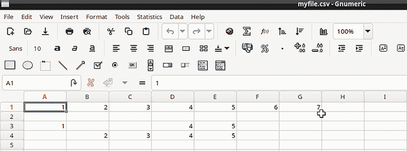

# 9

# 使用`grep`、`sed`和正则表达式进行文本过滤

到目前为止，我们已经看过了如何使用`find`进行文件搜索，以及如何使用文本流过滤工具从文本文件和程序输出流中提取和呈现数据。在本章中，我们将研究另外两个工具，`sed`和`grep`，它们将使你的搜索和文本操作更加强大。不过，在此之前，你需要了解正则表达式。

本章的内容包括：

+   理解正则表达式

+   理解`sed`

+   理解`grep`

+   使用 RegEx Buddy

+   使用 RegEx101

+   查看一些实际案例

如果你准备好了，我们就开始吧。

# 技术要求

使用任何一台 Linux 虚拟机或你的 Linux 主机。

另外，像往常一样，你可以从 Github 获取脚本和文本文件，方法如下：

```
git clone https://github.com/PacktPublishing/The-Ultimate-Linux-Shell-Scripting-Guide.git 
```

# 理解正则表达式

当你在*第六章，文本流过滤器第一部分*和*第七章，文本流过滤器第二部分*中使用文本流过滤器时，你操作的是简单的文本字符串。也就是说，你在处理字母字符、数字和允许你在文本文件中插入制表符、空格和换行符的控制字符。**正则表达式**（Regular Expressions），有时你会看到它缩写为**regexp**或**regex**，可以包括文本字符串，甚至可以是一个文本字符串。它们还可以包括特殊字符，统称为**元字符**，这些元字符赋予了理解它们的工具强大的功能。事实上，你可以把正则表达式看作一种编程语言，文本字符串是单词，元字符是标点符号。正则表达式不仅能让你搜索简单的文本字符串，它还允许你搜索模式。例如，如果你需要在文件中查找所有电话号码或所有信用卡号码，你可以创建一个正则表达式来查找与这些模式匹配的文本字符串。

我需要澄清一件有些混淆的事情。*正则表达式*（Regular Expressions），总是以复数形式书写，并且每个单词的首字母都大写，是一种模式匹配语言的名称。它与*正则表达式*（regular expression）不同，后者是你可以用*正则表达式*语言构建的一个模式匹配结构。

不过，要理解的是，正则表达式的主题是非常庞大的，关于它的内容甚至可以写成整本书。现在，我会给你一些基础知识，让你理解如何在`grep`和`sed`中使用它们。让我们首先来看一下正则表达式中你会使用的两类字符。

## 字面量和元字符

你将会使用两种类型的字符来构造正则表达式。**字面字符**是任何需要被按字面意思匹配的字符。换句话说，字面字符就是你希望当作普通文本对待的任何东西。**元字符**则使你能够根据需要修改模式匹配。例如，你可以使用元字符查找发生在行首或行尾的文本模式，而如果模式出现在行中的其他地方则不进行匹配。你还可以使用元字符执行不同类型的通配符模式匹配。

有三种类型的元字符，它们是：

+   **位置锚点**：这些定义了你希望在文件或行中的哪个位置找到匹配项。

+   **字符集**：这些定义了你想要匹配的字符范围或特定类型的字面字符。换句话说，如果你想找到一个只包含小写字母的文本字符串，你不必在正则表达式中列出每一个小写字母。相反，只需使用小写字母字符集。

+   **修饰符**：主要来说，这些元字符允许你定义你希望一次匹配的字面字符或字面字符串的个数。其他修饰符包括或操作符和分组操作符。

**位置锚点**，如以下表格所示：

| **位置锚点** | **描述** |
| --- | --- |
| `^` | 这允许你匹配发生在行首的模式。你总是将其放置在你想要匹配的模式左侧，像这样：`^pattern` |
| `$` | 这允许你匹配发生在行尾的模式。你总是将其放置在你想要匹配的模式右侧，像这样：`pattern$` |
| `\<pattern\>` | 这一对符号标记了单词边界。例如，如果你要搜索模式*and*，使用这个元字符将只匹配整个单词*and*，而不是包含文本字符串*and*的任何单词。 |

以下表格解释了各种**字符集**。

| **字符集示例** | **描述** |
| --- | --- |
| `[abc]``[a-z]``[:lower:]``[:digit:]` | 这应该已经对你来说是熟悉的了。它定义了一个字符集或字符范围，用于在模式中匹配。你还可以使用与文本流过滤器相同的字符类。 |
| `[^abc]``[^a-z]` | 在前面的表格中，我向你展示了如何使用`^`作为位置锚点。但是，当`^`作为字符集的第一个字符时，它充当否定操作符。所以，虽然`[abc]`匹配包含 a、b 或 c 的任何内容，`[^abc]`则匹配不包含 a、b 或 c 的任何内容。 |

元字符的最后一种类型是**修饰符**，如表格所示：

| **基本修饰符** | **扩展修饰符** | **描述** |
| --- | --- | --- |
| `*` | `*` | 匹配前面单个字符或单字符正则表达式的零次或多次出现的通配符。请注意，这种行为不同于你在正常命令行操作中看到的 `*`，例如在 `ls -l *.txt` 命令中。 |
| `\?` | `?` | 匹配前面单个字符或正则表达式零次或一次出现的通配符。 |
| `\+` | `+` | 必须有匹配项的通配符。匹配前面单个字符或正则表达式的一次或多次出现。 |
| `\{n\}` | `{n}` | 匹配前面单个字符或正则表达式的*n*次出现。 |
| `\{n,\}` | `{n,}` | 匹配前面单个字符或正则表达式至少*n*次出现。 |
| `\&#124;` | `&#124;` | 这叫做**交替**，但可以理解为 `or` 运算符。 |
| `\(regex\)` | `(regex)` | 这表示分组。它匹配括号内的正则表达式，但可以整体进行修改。它也可以用于反向引用。 |

现在不必担心**基本修饰符**和**扩展修饰符**之间的区别。我会在我们讨论*理解 grep*这一部分时讲解这些内容。

正如我之前所说，正则表达式的主题非常庞大和复杂。我没有足够的篇幅提供完整的教程，所以我会在 `sed` 和 `grep` 部分提供一些使用各种正则表达式的示例。

你可以通过查看 `regex` 的手册页面来获得更多关于正则表达式的信息，这个页面位于手册的第七部分。（不过不要指望通过阅读它成为正则表达式专家。）你可以通过以下命令查看相应的手册页面：

`man 7 regex`

既然我已经向你介绍了正则表达式，现在让我向你介绍一个使用正则表达式的工具。

# 理解 `sed`

`sed`，即**流编辑器**的缩写，是一个非常强大的工具，关于它有许多书籍专门进行讲解。这里的目标是帮助你学习基础知识，并激发你今后深入学习的兴趣。

如果你曾经需要对大型文本文件进行错误检查或编辑，你会很欣赏 `sed` 的强大功能。对于简单的任务，一条命令——即所谓的**sed 脚本**——可能就足够了。对于更复杂的任务，比如你可能需要对一个或多个文档进行多次修改时，你可以编写较长的程序文件，并通过 `sed` 执行它们。唯一的限制就是你自己的想象力。但在我们谈论如何用 `sed` 做酷炫的事情之前，我们需要简要讨论一下 `sed` 的可移植性问题。

## 理解 `sed` 可移植性问题

如果你需要使用非 Linux 操作系统，你将会遇到两种不同的 `sed` 实现。Linux 操作系统使用 GNU 实现，而 macOS、BSD 发行版和 OpenIndiana 上使用的是 BSD 实现。

BSD 代表 **伯克利软件发行版**，而 GNU 是一个递归缩写，代表 **GNU 不是 Unix**。

区别在于，GNU 实现具有 BSD 实现所没有的非常酷的高级功能。因此，我将在本节中向你展示的许多示例——特别是附加（`a`）、插入（`i`）和更改（`c`）命令，以及任何使用正则表达式的命令——在 BSD 实现中无法使用。不过幸运的是，所有这些操作系统都有一个简单的解决办法。只需安装 `gsed` 包，然后创建指向 `gsed` 可执行文件的 `sed` 别名。以下是各操作系统的具体指引。

### 在 FreeBSD 上安装 gsed

在 FreeBSD 上，像这样安装 `gsed`：

```
donnie@freebsd14:~ $ sudo pkg install gsed 
```

然后，编辑你主目录中的 `.shrc` 文件，在别名部分添加以下行：

```
alias sed='/usr/local/bin/gsed' 
```

注销终端，然后重新登录。通过执行以下命令验证别名是否已生效：

```
donnie@freebsd14:~ $ type sed
sed is an alias for /usr/local/bin/gsed
donnie@freebsd14:~ $ 
```

### 在 macOS 上安装 gsed

在 macOS 上安装 `gsed` 同样简单，但你首先需要安装 Homebrew 系统。

你可以在以下网站找到有关如何安装 Homebrew 的说明：[`brew.sh/`](https://brew.sh/)

然后，执行以下命令安装 `gsed`：

```
macmini@MacMinis-Mac-mini ~ % brew install gsed 
```

将别名添加到你主目录中的 `.zprofile` 文件，方法是添加以下行：

```
alias sed='/usr/local/bin/gsed' 
```

关闭终端窗口，然后再打开它。然后，验证别名是否已生效：

```
macmini@MacMinis-Mac-mini ~ % type sed
sed is an alias for /usr/local/bin/gsed
macmini@MacMinis-Mac-mini ~ % 
```

### 在 OpenIndiana 上安装 gsed

OpenIndiana 的正常软件库中没有 `gsed`。因此，你需要安装一个第三方库来获取它。首先，在你的 OpenIndiana 机器上打开 Firefox 并访问：[`buildfarm.opencsw.org/opencsw/official/`](http://buildfarm.opencsw.org/opencsw/official/)

下载你将看到的 `pkgutil.pkg` 文件。

通过执行以下命令安装该包：

```
donnie@openindiana:~$ sudo pkgadd -d ./pkgutil.pkg 
```

这将把 `pkgutil` 安装到 `/opt/csw/bin/` 目录，如下所示：

```
donnie@openindiana:/opt/csw/bin$ ls -l
total 209
-rwxr-xr-x   1 root     bin       106397 Nov 12  2013 pkgutil
donnie@openindiana:/opt/csw/bin$ 
```

这个目录不在你的 `PATH` 中，因此你需要修复它。最简单的方法是在 `/usr/sbin/` 目录中创建一个符号链接，如下所示：

```
donnie@openindiana:/opt/csw/bin$ sudo ln -s /opt/csw/bin/pkgutil /usr/sbin/pkgutil
Password:
donnie@openindiana:/opt/csw/bin$ which pkgutil
/usr/sbin/pkgutil
donnie@openindiana:/opt/csw/bin$ 
```

接下来，安装 `gsed` 包，方法如下：

```
donnie@openindiana:~$ sudo pkgutil -i gsed 
```

最后，你准备好创建别名了。在 OpenIndiana 上，你需要在两个不同的文件中创建它。为了在本地机器上打开终端时启用别名，你需要将其添加到主目录中的 `.bashrc` 文件中，如下所示：

```
alias sed='/usr/bin/gsed' 
```

为了在通过 `ssh` 远程登录时启用别名，你需要在主目录中创建 `.bash_profile` 文件，并将相同的别名行添加到其中。

现在你已经安装了`gsed`并在非 Linux 系统上创建了别名，你将能够从命令行运行任何`sed`命令。不幸的是，如果你将任何`sed`命令放入 shell 脚本中，这将无法工作，因为 shell 脚本不会读取包含别名的`.bashrc`、`.shrc`、`.bash_profile`或`.zprofile`文件。现在没关系，因为我稍后会告诉你如何解决这个问题。不过，首先，我需要向你展示如何使用各种`sed`命令。

既然已经完成了，让我们来看看如何实际使用`sed`。有几个不同的`sed`函数是你需要了解的。我们从替换函数开始。

## 使用 sed 进行替换

在下图中，你可以看到一个典型的`sed`替换脚本的结构。


图 9.1：一个典型的 sed 替换脚本

现在，让我们看看一些具体的例子。

### 示例 1：修改办公室备忘录

让我们从一个简单的办公室备忘录开始。创建一个`tom.txt`文件，正如你所看到的那样：

```
Memo:  tom tinker
    We regret to inform you that tom
    Tinker will no longer be working
    with us.  Tom tinker is leaving to
    embark on his own business venture.
    We wish tom tinker well.  Good-bye, tom.
cc: tom Tinker 
```

你可以看到文档中存在一些问题。最明显的一点是专有名词并没有总是大写。我们需要一种方法来自动化这些修改过程。

虽然可以一次性完成所有的修改，但首先，我们来看看如何将*tom*替换为*Tom*。你可以这样做：

```
[donnie@fedora ~]$ sed 's/tom/Tom/' tom.txt
Memo:  Tom tinker
    We regret to inform you that Tom
    Tinker will no longer be working
    with us.  Tom tinker is leaving to
    embark on his own business venture.
    We wish Tom tinker well.  Good-bye, tom.
cc: Tom Tinker
[donnie@fedora ~]$ 
```

在单引号中，你首先看到字母`s`。它告诉`sed`执行替换操作。接下来，你会看到你正在处理的两个模式。第一个是你要替换的模式，第二个是你用作替换的内容。关闭表达式后，列出你想要修改的文本文件。（注意，你不需要`stdin`重定向符。）

现在，这个方法在大多数情况下有效，但我们仍然在正文的最后一行有一个小写的*tom*。这是因为默认情况下，`sed`的`s`命令只会替换给定行中的第一个匹配项。为了修复这个问题，使用带有全局（`g`）选项的`s`命令。这样，给定行中的每一个匹配项都会被替换。以下是这样做的效果：

```
[donnie@fedora ~]$ sed 's/tom/Tom/g' tom.txt
Memo:  Tom tinker
    We regret to inform you that Tom
    Tinker will no longer be working
    with us.  Tom tinker is leaving to
    embark on his own business venture.
    We wish Tom tinker well.  Good-bye, Tom.
cc: Tom Tinker
[donnie@fedora ~]$ 
```

这样效果好多了。但是，我们仍然需要替换小写的姓氏。让我们将两个命令结合起来，一次性替换姓和名，像这样：

```
[donnie@fedora ~]$ sed 's/tom/Tom/g ; s/tinker/Tinker/g' tom.txt
Memo:  Tom Tinker
    We regret to inform you that Tom
    Tinker will no longer be working
    with us.  Tom Tinker is leaving to
    embark on his own business venture.
    We wish Tom Tinker well.  Good-bye, Tom.
cc: Tom Tinker
[donnie@fedora ~]$ 
```

你只需要创建两个独立的`sed`脚本，并用分号将它们组合在一起。你可以将两个脚本放在一对单引号内。

默认情况下，`sed`会读取你想修改的文本文件，并将整个修改后的文件发送到`stdout`。

如果你只想查看实际被修改的行怎么办？

为此，你需要使用`-n`开关作为`sed`选项，`p`开关作为`s`命令选项。首先，我们来看看只使用其中一个开关时会发生什么。以下是如果你只使用`-n`而没有`p`的结果：

```
[donnie@fedora ~]$ sed -n 's/tom/Tom/g ; s/tinker/Tinker/g' tom.txt
[donnie@fedora ~]$ 
```

如果没有`s`命令的`p`开关，`-n`开关会抑制所有输出，这不是我们想要的效果。因为`-n`开关是*静默*开关，它会取消`sed`默认将处理后的文件输出到`stdout`的行为。

接下来，让我们尝试只用`p`而不加`-n`，它会是这样的：

```
[donnie@fedora ~]$ sed 's/tom/Tom/g ; s/tinker/Tinker/gp' tom.txt
Memo:  Tom Tinker
Memo:  Tom Tinker
    We regret to inform you that Tom
    Tinker will no longer be working
    with us.  Tom Tinker is leaving to
    with us.  Tom Tinker is leaving to
    embark on his own business venture.
    We wish Tom Tinker well.  Good-bye, Tom.
    We wish Tom Tinker well.  Good-bye, Tom.
cc: Tom Tinker
[donnie@fedora ~]$ 
```

如果没有`-n`选项，`s`命令的`p`选项会导致`sed`打印默认输出，此外还会将修改后的行再次打印一次。（实际上，我们在这里看到有两行被打印了三次，因为每行做了多次替换。）这是因为没有静默选项（`-n`）时，`sed`默认会将处理过的文件打印出来。然后，`s`命令的`p`选项会导致所有被修改过的行再次打印出来。

现在，为了只查看修改后的行，让我们将选项合并，像这样：

```
[donnie@fedora ~]$ sed -n 's/tom/Tom/gp ; s/tinker/Tinker/gp' tom.txt
Memo:  Tom tinker
Memo:  Tom Tinker
    We regret to inform you that Tom
    with us.  Tom Tinker is leaving to
    We wish Tom tinker well.  Good-bye, Tom.
    We wish Tom Tinker well.  Good-bye, Tom.
cc: Tom Tinker
[donnie@fedora ~]$ 
```

所以这里的教训是，你必须同时使用`-n`和`p`选项，因为只使用其中一个选项并不能达到你想要的效果。

等等，不过你还没完呢。看来你的老板有点爱开玩笑。所以，他告诉你将最后一个*Tinker*替换为*Stinker*。他转身离开时，眨了眨眼，说：“是的，这样一定能让他生气。”这时，地址选项派上了用场。

由于你知道最后一个*Tinker*是文件最后一行的最后一个单词，你可以通过在地址中放置*行尾*元字符（`$`）来指示`sed`只替换该出现。它看起来像这样：

```
[donnie@fedora ~]$ sed 's/tom/Tom/g ; s/tinker/Tinker/g ; $s/Tinker/Stinker/' tom.txt
Memo:  Tom Tinker
    We regret to inform you that Tom
    Tinker will no longer be working
    with us.  Tom Tinker is leaving to
    embark on his own business venture.
    We wish Tom Tinker well.  Good-bye, Tom.
cc: Tom Stinker
[donnie@fedora ~]$ 
```

好的，让我们进入下一个示例。

### 示例 2：修改好莱坞演员列表

仍然有很多其他方法可以使用`sed`进行替换。为了演示，创建一个名为`actorsfile_11.txt`的文件，并填入以下好莱坞演员的名单：

```
Jessel		George
Marx			Groucho
Cantor		Eddie
Allen		Fred
Burns		George
Wayne		John
Price		Vincent
Besser		Joe
Greenstreet		Sidney
Conrad		William 
```

你决定将 Groucho Marx 替换为他的兄弟 Zeppo。查找所有以 Marx 开头的行，并且仅在这些行上进行替换，像这样：

```
[donnie@fedora ~]$ sed '/^Marx/s/Groucho/Zeppo/' actorfile_11.txt
Jessel		George
Marx			Zeppo
Cantor		Eddie
Allen		Fred
Burns		George
Wayne		John
Price		Vincent
Besser		Joe
Greenstreet		Sidney
Conrad		William
[donnie@fedora ~]$ 
```

在这个例子中，你使用了一个正则表达式作为地址。也就是说，你将字面字符串*Marx*放在了`sed`的默认分隔符（正斜杠）内，然后在它前面加上了`^`元字符。这使得替换命令只查找以*Marx*开头的行中的*Marx*出现。再看一下这个地址是如何紧接在`s`命令之前的。你不需要为`s`命令使用全局选项，因为你已经知道每行中给定单词只有一个出现。

你现在决定将 Joe Besser 替换为 Joe DeRita。（这是合理的，因为在现实生活中，《三傻大闹宝莱坞》的确在 Joe Besser 离开照顾生病的妻子后，用 Joe DeRita 替换了 Joe Besser。）这次，你想要查找以*Joe*结尾的行，并且仅在这些行上进行替换，像这样：

```
[donnie@fedora ~]$ sed '/Joe$/s/Besser/DeRita/' actorfile_11.txt
Jessel		George
Marx			Groucho
Cantor		Eddie
Allen		Fred
Burns		George
Wayne		John
Price		Vincent
DeRita		Joe
Greenstreet		Sidney
Conrad		William
[donnie@fedora ~]$ 
```

这一次，你在地址中使用了`$`元字符来告诉`s`查看行尾。请注意，你必须将这个元字符放在字面字符串的末尾。

好了，演员部分说完了。我们来看一些经典汽车。

### 示例 3：修改汽车列表

你也可以替换单个字符。创建一个名为`cars_2.txt`的文件，内容如下：

```
[donnie@fedora ~]$ cat > cars_2.txt
edsel
Edsel
Edsel
desoto
desoto
Desoto
Desoto
nash
Nash
nash
Hudson
hudson
hudson
[donnie@fedora ~]$ 
```

在这个文件中，你看到需要大写一些列出的汽车名称。现在，我们只关注将*Desoto*大写。如果你告诉`sed`将每个*d*替换为*D*，你会得到这个结果：

```
[donnie@fedora ~]$ sed 's/d/D/' cars_2.txt
eDsel
EDsel
EDsel
Desoto
Desoto
Desoto
Desoto
nash
Nash
nash
HuDson
huDson
huDson
[donnie@fedora ~]$ 
```

这不是你想要的。但是，你知道*desoto*只出现在第 4 行和第 5 行。因此，你可以告诉`sed`仅在这两行中替换小写的*d*，就像这样：

```
[donnie@fedora ~]$ sed '4,5s/d/D/' cars_2.txt
edsel
Edsel
Edsel
Desoto
Desoto
Desoto
Desoto
nash
Nash
nash
Hudson
hudson
hudson
[donnie@fedora ~]$ 
```

请注意，两个行号之间的逗号表示*第 4 行到第 5 行*，而不是*第 4 行和第 5 行*。

你可以告诉`sed`在行的开头查找*desoto*，像这样：

```
[donnie@fedora ~]$ sed '/^desoto/s/d/D/' cars_2.txt
edsel
Edsel
Edsel
Desoto
Desoto
Desoto
Desoto
nash
Nash
nash
Hudson
hudson
hudson
[donnie@fedora ~]$ 
```

如果你只想查看更改的行，可以插入`-n`和`p`开关，如下所示：

```
[donnie@fedora ~]$ sed -n '/^desoto/s/d/D/p' cars_2.txt
Desoto
Desoto
[donnie@fedora ~]$ 
```

有三种方法可以保存你的修改。你可以使用`stdout`重定向器创建一个新文件，如下所示：

```
[donnie@fedora ~]$ sed -n '/^desoto/s/d/D/p' cars_2.txt > cars_cap.txt
[donnie@fedora ~]$ 
```

你可以将`w`开关与`s`命令一起使用，将修改保存到新文件中，如下所示：

```
[donnie@fedora ~]$ sed '/^desoto/s/d/D/w newcarsfile.txt' cars_2.txt
edsel
Edsel
Edsel
Desoto
Desoto
Desoto
Desoto
nash
Nash
nash
Hudson
hudson
hudson
[donnie@fedora ~]$ 
```

这里唯一的诀窍是，尽管`w`开关会在屏幕上显示整个修改后的文件内容，但它只会将修改后的行保存到新文件中，如你所见：

```
[donnie@fedora ~]$ cat newcarsfile.txt
Desoto
Desoto
[donnie@fedora ~]$ 
```

保存修改的最终方法是使用`-i`开关来修改原始文件，如下所示：

```
[donnie@fedora ~]$ sed -i '/^desoto/s/d/D/' cars_2.txt
[donnie@fedora ~]$ 
```

与使用`w`开关时不同，`-i`会保存整个修改后的文件，如你所见：

```
[donnie@fedora ~]$ cat cars_2.txt
edsel
Edsel
Edsel
Desoto
Desoto
Desoto
Desoto
nash
Nash
nash
Hudson
hudson
hudson
[donnie@fedora ~]$ 
```

如果你想在修改原始文件之前创建一个备份，只需在`-i`开关后添加你想要附加到备份文件名的后缀，如下所示：

```
[donnie@fedora ~]$ sed -i.bak '/^desoto/s/d/D/' cars_2.txt
[donnie@fedora ~] 
```

请注意，`-i`和`.bak`之间不能有空格。验证操作是否成功，如下所示：

```
[donnie@fedora ~]$ ls -l cars_2.txt.bak
-rw-r--r--. 1 donnie donnie 82 Oct 11 13:58 cars_2.txt.bak
[donnie@fedora ~]$ 
```

接下来，我们来做一些全字替换。

### 示例 4：执行全字替换

如果你有一个模式，它可能是其他单词的一部分，但你只想在它是一个完整单词时才执行替换呢？为此，创建一个名为`ing.txt`的文件，内容如下：

```
It began raining just as the
baseball team began their spring
training.  Meanwhile, Susan began
singing as she was playing the
piano.  Just being alive was great,
and Michael was thinking about how
he was going to begin working on
his new novel.  Writing was like
a tonic to him.  It was just like
acting out all of his fantasies.
I think I've used ing enough in this
story to illustrate my point about ing.
So, ing away, and then ing some more. 
```

现在，假设你想将单词*ing*替换为*ING*。尝试这个命令看看你会得到什么：

```
[donnie@fedora ~]$ sed 's/ing/ING/g' ing.txt
It began rainING just as the
baseball team began their sprING
trainING.  Meanwhile, Susan began
sINGING as she was playING the
piano.  Just beING alive was great,
and Michael was thinkING about how
he was goING to begin workING on
his new novel.  WritING was like
a tonic to him.  It was just like
actING out all of his fantasies.
I think I've used ING enough in this story to illustrate my point about ING. So, ING away, and then ING some more. 
```

你原本只想将整个单词*ing*替换为*ING*，但也替换了其他单词中的*ing*。这时你需要使用词边界，如下所示：

```
[donnie@fedora ~]$ sed 's/\<ing\>/ING/g' ing.txt
It began raining just as the
baseball team began their spring
training.  Meanwhile, Susan began
singing as she was playing the
piano.  Just being alive was great,
and Michael was thinking about how
he was going to begin working on
his new novel.  Writing was like
a tonic to him.  It was just like
acting out all of his fantasies.
I think I've used ING enough in this
story to illustrate my point about ING.
So, ING away, and then ING some more. 
```

你只需要将你想替换的字符串放入`\< \>`结构中。

当你查看我几页前展示的元字符表时，你可能会想，“嘿，我发现了另一种方法。 我可以只使用通配符字符”。确实，在这种情况下，它会起作用，如你所见：

```
[donnie@fedora ~]$ sed 's/ \+ing/ ING/g' ing.txt
It began raining just as the
baseball team began their spring
training.  Meanwhile, Susan began
singing as she was playing the
piano.  Just being alive was great,
and Michael was thinking about how
he was going to begin working on
his new novel.  Writing was like
a tonic to him.  It was just like
acting out all of his fantasies.
I think I've used ING enough in this
story to illustrate my point about ING.
So, ING away, and then ING some more. 
```

在这里，你使用了 `\+` 元字符来替换所有前面有一个或多个空格的 *ing*。 （请注意，我在 `s` 命令中的第一个正斜杠和 `\+` 元字符之间留了一个空格。我还必须在 *ING* 前面留一个空格，以便在输出中也能留出一个空格。）然而，在这种情况下，这并不是最优雅的解决方案，因为它并不适用于所有情况。为了说明这一点，创建 `ing_2.txt` 文件，并使其如下所示：

```
I'm writing yet another story about
the suffix ing.  I hope that this
ing story will help illustrate our point. 
```

再次执行前面的命令，你应该得到如下结果：

```
[donnie@fedora ~]$ sed 's/ \+ing/ ING/g' ing_2.txt
I'm writing yet another story about
the suffix ING.  I hope that this
ing story will help illustrate our point.
[donnie@fedora ~]$ 
```

最后一行中的 *ing* 没有被替换，因为它位于行首。因此，前面不能有空格。通配符元字符是很方便的工具，并且确实有它们的合法用途。但在这里，我们发现它们并不是最好的解决方案。

这就是替换的内容。接下来我们进行一些删除操作。

## 使用 sed 删除

你可以使用 `d` 命令来执行删除操作。这比替换过程简单，因为你只需要地址和 `d` 命令。我们将从删除列表中的一些项开始。

### 示例 1：从列表中删除项

让我们再看一下我们的 `cars_2.txt` 文件，并尝试删除所有与 Edsel 相关的内容。 （我们想忘记 Edsel 曾经被生产过，正如福特公司自 1960 年以来一直试图做的那样。）首先，作为提醒，原始文件看起来是这样的：

```
[donnie@fedora ~]$ cat cars_2.txt
edsel
Edsel
Edsel
Desoto
Desoto
Desoto
Desoto
nash
Nash
nash
Hudson
hudson
hudson
[donnie@fedora ~]$ 
```

好吧，这并不完全是原创的，因为我忘了之前修改它，使所有的 *desoto* 都大写了。不过，这不重要。要删除所有与 Edsel 相关的内容，请尝试这样做：

```
[donnie@fedora ~]$ sed '/edsel/d' cars_2.txt
Edsel
Edsel
Desoto
Desoto
Desoto
Desoto
nash
Nash
nash
Hudson
hudson
hudson
[donnie@fedora ~]$ 
```

这个命令只删除了小写的 *edsel*。但是，我需要一种方法来删除所有与 Edsel 相关的内容。幸运的是，你可以使用正则表达式在地址中指定多个字符，如下所示：

```
[donnie@fedora ~]$ sed '/[eE]dsel/d' cars_2.txt
Desoto
Desoto
Desoto
Desoto
nash
Nash
nash
Hudson
hudson
hudson
[donnie@fedora ~]$ 
```

你只需将 *e* 和 *E* 放在括号中，并将其作为地址中的第一个字符。

如果你想删除除了 *Edsel* 以外的所有内容，可以使用 `!` 来取反命令。现在，你可能认为应该把取反符号放在你正在查找的地址前面，但实际情况并非如此。相反，你需要将取反符号放在命令字符本身之前。所以，在这种情况下，你应该把感叹号放在 `d` 前面，如下所示：

```
[donnie@fedora ~]$ sed '/[eE]dsel/!d' cars_2.txt
edsel
Edsel
Edsel
[donnie@fedora ~]$ 
```

你刚刚看到的示例展示了不同的 shell 脚本工具并非始终一致地实现功能。之前，你看到 `^` 是正则表达式的取反操作符。在这里，你看到 `!` 是 `sed` 命令的取反操作符。你还看到 `^` 也可以用来表示行的开头。所以，是的，事情有时候确实会变得有些混乱。

你还可以选择行号范围作为地址。这一次，我们删除所有与 Nash 相关的内容，它们正好出现在第八行到第十行之间，如下所示：

```
[donnie@fedora ~]$ sed '8,10d' cars_2.txt
edsel
Edsel
Edsel
Desoto
Desoto
Desoto
Desoto
Hudson
hudson
hudson
[donnie@fedora ~]$ 
```

在 `d` 前面加上感叹号，删除所有内容，除了第八行到第十行之间的内容，如下所示：

```
[donnie@fedora ~]$ sed '8,10!d' cars_2.txt
nash
Nash
nash
[donnie@fedora ~]$ 
```

到此为止，我们已经处理完经典车型。接下来，我将展示如果文件中有太多空行该怎么做。

### 示例 2：删除空行

对于我们最后的删除技巧，下面是如何从文件中删除空行的。只需使用行首元字符（`^`）与行尾元字符（`$`）创建一个地址。首先创建`blank_lines.txt`文件，如下所示：

```
One non-blank line.
Another non-blank line.
Yet another non-blank line.
And one last non-blank line. 
```

现在，执行删除操作，使用`^$`作为正则表达式，如下所示：

```
[donnie@fedora ~]$ sed '/^$/d' blank_lines.txt
One non-blank line.
Another non-blank line.
Yet another non-blank line.
And one last non-blank line.
[donnie@fedora ~]$ 
```

请注意，这与我们之前在替换脚本中使用*行尾*元字符的方式不同。由于我们正在使用两个元字符组合形成正则表达式，因此必须将它们放在两个正斜杠之间。

现在，进行下一个技巧。

## 使用 sed 进行追加和插入

`a`命令在 Linux 实现的`sed`中用于在另一行文本后附加一行文本。让我们来看一下它是如何工作的。

### 示例 1：追加文本行

你可以使用这个功能将一些模型名称添加到汽车列表中。像这样，为 Nash 车型添加*Ambassador*型号：

```
[donnie@fedora ~]$ sed '/[nN]ash/aAmbassador' cars_2.txt
edsel
Edsel
. . .
. . .
nash
Ambassador
Nash
Ambassador
nash
Ambassador
Hudson
hudson
hudson
[donnie@fedora ~]$ 
```

那很好，但你可以做得更好。首先通过缩进模型名称来改进。方法是添加一个制表符，如下所示：

```
[donnie@fedora ~]$ sed '/[nN]ash/a\\tAmbassador' cars_2.txt
edsel
Edsel
. . .
. . .
nash
	Ambassador
Nash
	Ambassador
nash
	Ambassador
Hudson
hudson
hudson
[donnie@fedora ~]$ 
```

请注意，由于书籍排版的限制，我只能在这里显示部分输出。

制表符的控制字符是`\t`。但请注意，你必须添加另一个反斜杠，这样`sed`才能正确识别它。

你也可以通过使用行地址来做到这一点。让我们向第六行追加一个型号，如下所示：

```
[donnie@fedora ~]$ sed '6a\\tFiredome' cars_2.txt
edsel
Edsel
Edsel
Desoto
Desoto
Desoto
	Firedome
Desoto
nash
Nash
nash
Hudson
hudson
hudson 
```

但是，这还不能覆盖所有的*Desoto*车型。让我们向第四到第七行追加型号，如下所示：

```
[donnie@fedora ~]$ sed '4,7a\\tFiredome' cars_2.txt
edsel
Edsel
Edsel
Desoto
	Firedome
Desoto
	Firedome
Desoto
	Firedome
Desoto
	Firedome
nash
. . .
[donnie@fedora ~]$ 
```

现在，让我们结合一些操作。首先编辑`cars_2.txt`文件，使其重新包含一些小写的*desoto*。它应该像这样：

```
edsel
Edsel
Edsel
desoto
desoto
Desoto
desoto
nash
Nash
nash
Hudson
hudson
hudson 
```

但是，你不仅仅限于一次执行一个操作。那么，让我们看看如何将多个操作结合在一起。

### 示例 2：一次执行多个操作

你将为 Edsel 和 Desoto 车型添加一个新型号，并删除所有不是大写字母开头的车型。注意，你不能将所有内容放在一对引号中，或使用分号来分隔操作。为此，你必须为每个操作单独提供一组引号，并在每个操作前加上`-e`开关。因为这些操作是顺序执行的，这意味着第一个操作必须完成后，第二个操作才能开始。下面是它的样子：

```
[donnie@fedora ~]$ sed -e '6a\\tFiredome' -e '/Edsel/a\\tCorsair' -e '/^[a-z]/d' cars_2.txt
Edsel
	Corsair
Edsel
	Corsair
Desoto
	Firedome
Nash
Hudson
[donnie@fedora ~]$ 
```

现在我们已经看过了如何追加文本，让我们来看看如何插入文本。

### 示例 3：插入文本行

`i`命令与此相同，不同之处在于它会在另一行文本之前插入一行文本，如下所示：

```
[donnie@fedora ~]$ sed -e '/Edsel/i1958' -e '/^[[:lower:]]/d' cars_2.txt
1958
Edsel
1958
Edsel
Desoto
Nash
Hudson
[donnie@fedora ~]$ 
```

作为额外的奖励，我还展示了另一种去除所有以小写字母开头的车名的方法。

这就是这个技巧的全部内容。让我们继续下一个技巧。

## 使用 sed 进行更改

你可以使用 `c` 命令来更改一串文本。（你也可以使用 `s` 命令来更改文本，但这个命令更简短。）让我们来看一下如何操作。

### 示例 1：将 Edsel 替换为 Studebaker

和之前一样，你将使用 `cars_2.txt` 文件。从将 *Edsel* 和 *edsel* 替换为 *Studebaker* 开始，像这样：

```
[donnie@fedora ~]$ sed '/[eE]dsel/cStudebaker' cars_2.txt
Studebaker
Studebaker
Studebaker
desoto
desoto
Desoto
desoto
nash
Nash
nash
Hudson
hudson
hudson
[donnie@fedora ~]$ 
```

你也可以通过行号来指定要进行的更改。以下是使用 *edsel* 和 *Edsel* 行号作为地址时的效果：

```
[donnie@fedora ~]$ sed '1,3cStudebaker' cars_2.txt
Studebaker
desoto
desoto
Desoto
desoto
nash
Nash
nash
Hudson
hudson
hudson
[donnie@fedora ~]$ 
```

你会发现这次的操作与之前有所不同。与其他命令逐行修改不同，这里命令告诉 `sed` 将一组行整体替换。

我知道这看起来很惊艳，但你还没见识到真正的精彩。看看下一个令人惊叹的技巧吧。

### 示例 2：更改整行文本

为了更好的示例，创建 `cars_4.txt` 文件，像这样：

```
donnie@fedora:~$ cat cars_4.txt
1958 Edsel Corsair
1949 Oldsmobile 88
1959 Edsel Ranger
1960 Edsel Ranger
1958 Edsel Bermuda
1964 Ford Galaxie
1954 Nash Ambassador
donnie@fedora:~$ 
```

现在，准备好惊叹吧，当你运行这个 `sed` 命令时：

```
donnie@fedora:~$ sed '/[eE]dsel/c1963 Studebaker Avanti' cars_4.txt
1963 Studebaker Avanti
1949 Oldsmobile 88
1963 Studebaker Avanti
1963 Studebaker Avanti
1963 Studebaker Avanti
1964 Ford Galaxie
1954 Nash Ambassador
donnie@fedora:~$ 
```

所以现在，你看到了 `s` 和 `c` 两个 `sed` 命令之间的最大区别。`c` 命令并不是仅仅替换你指定的文本字符串或模式，而是替换包含该文本字符串或模式的整个行。在这个例子中，所有包含文本字符串 *Edsel* 的整行都被替换为 *1963 Studebaker Avanti*。很酷吧？

## 其他杂项 `sed` 技巧

我们还没结束。这里有几个你可以用 `sed` 做的很酷的技巧。

### 示例 1：使用 q 命令

`q` 命令让 `sed` 像 `head` 工具一样工作。它告诉 `sed` 读取指定数量的行，然后退出。如果你想显示我们的公共领域电子书的前十行，可以输入以下命令：

```
[donnie@fedora ~]$ sed '10q' pg6409.txt
The Project Gutenberg eBook of How to Speak and Write Correctly

This ebook is for the use of anyone anywhere in the United States and
most other parts of the world at no cost and with almost no restrictions
whatsoever. You may copy it, give it away or re-use it under the terms
of the Project Gutenberg License included with this ebook or online
at www.gutenberg.org. If you are not located in the United States,
you will have to check the laws of the country where you are located
before using this eBook.
[donnie@fedora ~]$ 
```

如果你想查看一个大文件中间的某些选定行，你会发现 `sed` 比 `head`/`tail` 组合更容易使用。以下是查看我们电子书文件中第 1,005 行到第 1,010 行的方法：

```
[donnie@fedora ~]$ sed -n '1005,1010p' pg6409.txt
                Present                     Perfect
              To be loved              To have been loved
                              PARTICIPLES
[donnie@fedora ~]$ 
```

请注意，我在这里使用的 `p` 与 *substitute* 命令中的 `p` 选项有所不同。这个 `print` 命令本身是一个独立的命令。不过，它必须与 `sed` 的 `-n` 选项一起使用，才能获得你想要的结果。

### 示例 2：使用 w 命令

使用 `w` 命令将选定的文本行写入新文件。你可以像上面对 `p` 命令那样使用正则表达式作为地址，或者也可以像这样使用行号：

```
[donnie@fedora ~]$ sed '11,13whudson_cars.txt' cars_2.txt
edsel
Edsel
Edsel
desoto
desoto
Desoto
desoto
nash
Nash
nash
Hudson
hudson
hudson
[donnie@fedora ~]$ 
```

如果前面的命令看起来有点混乱，你可以插入一些空格，使其更清晰，像这样：

```
[donnie@fedora ~]$ sed '11,13 w hudson_cars.txt' cars_2.txt 
```

尽管你看到的是整个文件的内容，但只有选中的内容会保存在你新建的文件中，如你所见：

```
[donnie@fedora ~]$ cat hudson_cars.txt
Hudson
hudson
hudson
[donnie@fedora ~]$ 
```

输出将与之前一样。这展示了`sed`中可能让人困惑的一些地方。在`sed`脚本的某些位置，空格是可选的。而在其他地方，比如我之前展示如何使用`-i`选项和文件名后缀来备份文件时，就不能使用空格。正如我之前所说，关于这些规则，并不总是很一致。

### 示例 3：使用`r`命令

`r`命令将读取一个选定的文件，并将其附加到你正在处理的文件中的指定位置。要查看这个效果，创建`cars_3.txt`文件，像这样：

```
Packard
Kaiser
Frazer 
```

现在，把`cars_3.txt`文件插入到`cars_2.txt`文件的第二行之后，像这样：

```
[donnie@fedora ~]$ sed '2rcars_3.txt' cars_2.txt
edsel
Edsel
Packard
Kaiser
Frazer
Edsel
desoto
desoto
Desoto
. . .
. . .
hudson
[donnie@fedora ~]$ 
```

再次，如果这让你读起来感到困惑，可以使用可选的空格，像这样：

```
[donnie@fedora ~]$ sed '2 r cars_3.txt' cars_2.txt 
```

无论哪种方式都能同样有效。

## 使用`sed`程序文件

如果你有需要定期执行的复杂任务，比如必须对一个或多个文档进行多次编辑，可以创建程序文件。然后，使用`-f`选项调用`sed`，从文件中读取脚本。让我们来看几个例子：

### 示例 1：在文本文件中追加行

为了查看如何工作，创建`myfile_3.txt`文件，它看起来像这样：

```
This here is line one.
And here is the second line.
The third.
Line four.
This is the fifth sentence.
Six
This here is line seven.
Eighth and final. 
```

接下来，创建`demo_append.txt`文件，它将作为`sed`程序文件。让它看起来像这样：

```
2a\
I'll place this line after line two. 
```

像这样调用程序文件：

```
[donnie@fedora ~]$ sed -f demo_append.txt myfile_3.txt
This here is line one.
And here is the second line.
I'll place this line after line two.
The third.
Line four.
This is the fifth sentence.
Six
This here is line seven.
Eighth and final.
[donnie@fedora ~]$ 
```

注意我如何将程序文件中的单个脚本拆分成两行。为了实现这一点，我必须在第一行末尾放一个反斜杠，告诉`sed`脚本将在下一行继续。稍后我会向你展示为什么这样做很重要。

现在，让我们尝试一个插入一些行的程序文件。这次，我将使用文本字符串作为地址。像这样创建`demo_insert.txt`程序文件：

```
/This/i\
I'll insert this line before all lines that contain "This". 
```

调用程序，你会看到如下结果：

```
[donnie@fedora ~]$ sed -f demo_insert.txt myfile_3.txt
I'll insert this line before all lines that contain "This".
This here is line one.
And here is the second line.
The third.
Line four.
I'll insert this line before all lines that contain "This".
This is the fifth sentence.
Six
I'll insert this line before all lines that contain "This".
This here is line seven.
Eighth and final.
[donnie@fedora ~]$ 
```

### 示例 2：更改文本文件中的行

现在，让我们把第四到第六行改成其他内容。像这样创建`demo_change.txt`文件：

```
4,6c\
Let's replace lines\
four through six\
to something else. 
```

注意，我再次必须使用反斜杠来表示脚本在下一行继续。运行程序，你会看到如下结果：

```
[donnie@fedora ~]$ sed -f demo_change.txt myfile_3.txt
This here is line one.
And here is the second line.
The third.
Let's replace lines
four through six
to something else.
This here is line seven.
Eighth and final.
[donnie@fedora ~]$ 
```

### 示例 3：替换文本

接下来，创建`demo_sub.txt`程序文件，它将*sentence*替换为*line*，并且只将修改过的行发送到`stdout`。让它看起来像这样：

```
s/line/sentence/p 
```

像这样调用程序文件：

```
[donnie@fedora ~]$ sed -nf demo_sub.txt myfile_3.txt
This here is sentence one.
And here is the second sentence.
This here is sentence seven.
[donnie@fedora ~]$ 
```

注意，我必须使用`-n`选项来调用`sed`程序，因为我在程序文件中使用了`p`选项。

再试一次，不过这次使用写入选项，将更改后的输出发送到新文件。像这样创建`demo_write.txt`程序文件：

```
s/line/sentence/w new_myfile.txt 
```

调用程序并查看新文件，像这样：

```
[donnie@fedora ~]$ sed -nf demo_write.txt myfile_3.txt
[donnie@fedora ~]$ cat new_myfile.txt
This here is sentence one.
And here is the second sentence.
This here is sentence seven.
[donnie@fedora ~]$ 
```

### 示例 4：从一个文件复制行到另一个文件

最后，创建`demo_write_2.txt`程序文件，它将把从一个文件中选定的行复制到另一个文件中。让它看起来像这样：

```
4,7w new_2_myfile.txt 
```

调用它，查看结果，像这样：

```
[donnie@fedora ~]$ sed -nf demo_write_2.txt myfile_3.txt
[donnie@fedora ~]$ cat new_2_myfile.txt
Line four.
This is the fifth sentence.
Six
This here is line seven.
[donnie@fedora ~]$ 
```

这就是简单程序文件的内容。现在让我们稍微复杂一点。

## `sed` 程序文件中的复合脚本

到目前为止，我只向你展示了包含一个 `sed` 脚本的程序文件。你也可以拥有包含两个或更多脚本的程序文件。首先创建 `demo_compound.txt` 程序文件，内容如下：

```
1,3s/Edsel/Packard/
2,4s/Packard/Lasalle/
3d 
```

现在，创建 `riding.txt` 文件，内容如下：

```
Let's go for a ride in my Edsel.
Let's go for a ride in my Edsel.
Let's go for a ride in my Edsel.
Let's go for a ride in my Edsel. 
```

按如下方式调用程序文件：

```
[donnie@fedora ~]$ sed -f demo_compound.txt riding.txt
Let's go for a ride in my Packard.
Let's go for a ride in my Lasalle.
Let's go for a ride in my Edsel.
[donnie@fedora ~]$ 
```

这是详细说明：

+   这个程序首先让 `sed` 在第一到第三行中将 *Edsel* 替换为 *Packard*。

+   在第二到第四行，它用 `sed` 将 *Packard* 替换为 *Lasalle*。

+   最后，最后一个脚本删除了第三行。请注意，由于没有脚本延续到下一行，你不必在这里使用反斜杠。

要查看第二个示例，请创建 `demo_compound_2.txt` 程序文件，如下所示：

```
2a\
No, I'd rather ride in the Hudson Hornet with the Twin-H Power Six.\
He'd rather ride in the Pierce-Arrow.
3p 
```

按如下方式调用程序：

```
[donnie@fedora ~]$ sed -f demo_compound_2.txt riding.txt
Let's go for a ride in my Edsel.
Let's go for a ride in my Edsel.
No, I'd rather ride in the Hudson Hornet with the Twin-H Power Six.
He'd rather ride in the Pierce-Arrow.
Let's go for a ride in my Edsel.
Let's go for a ride in my Edsel.
Let's go for a ride in my Edsel.
[donnie@fedora ~]$ 
```

这一次，你有一个脚本在第二行之后附加了两行新内容，另一个脚本使第三行重复打印一次。

只是为了好玩，再做一次相同的事情，不过这次删除第二行。创建 `demo_compound_3.txt` 程序文件，如下所示：

```
2a\
No, I'd rather ride in the Hudson Hornet with the Twin-H Power six.\
He'd rather ride in the Pierce-Arrow.
2d 
```

按如下方式运行程序：

```
[donnie@fedora ~]$ sed -f demo_compound_3.txt riding.txt
Let's go for a ride in my Edsel.
No, I'd rather ride in the Hudson Hornet with the Twin-H Power six.
He'd rather ride in the Pierce-Arrow.
Let's go for a ride in my Edsel.
Let's go for a ride in my Edsel.
[donnie@fedora ~]$ 
```

即使你删除了第二行，你仍然能够将新行附加到它之后。

让我们用一些更复杂的内容来结束 `sed` 的讨论。创建 `tab.txt` 程序文件，如下所示：

```
2,4s/^./\t&/
8c\
This really is the last line.
1d 
```

当你运行这个程序时，你会感到非常惊讶。以下是你将看到的内容：

```
[donnie@fedora ~]$ sed -f tab.txt myfile_3.txt
	And here is the second line.
	The third.
	Line four.
This is the fifth sentence.
Six
This here is line seven.
This really is the last line.
[donnie@fedora ~]$ 
```

第一个脚本在每个非空行的开头添加一个制表符。（`^.` 组合意味着查找以非空字符开头的每一行。制表符后的 `&` 防止 `sed` 将每行的第一个字符替换为制表符。相反，它只是将制表符插入到第一个字符之前。）第二个脚本更改了第八行的文本。最后，第三个脚本删除了第一行。

## 在 Shell 脚本中使用 `sed`

如果你只打算在 Linux 系统上运行你的脚本，使用 `sed` 编写 Shell 脚本非常简单。例如，你可以像这样编写 `sed_test_0.sh` 脚本：

```
#!/bin/bash
sed '/[Ee]dsel/i1958' cars_2.txt 
```

这是我在我的 Fedora 工作站上运行它时的情况：

```
donnie@fedora:~$ ./sed_test_0.sh
1958
edsel
1958
Edsel
1958
Edsel
desoto
. . .
. . .
Hudson
hudson
hudson
donnie@fedora:~$ 
```

但是，这在 FreeBSD、OpenIndiana 或 macOS 的默认 `sed` 实现中不起作用。事实上，以下是我在 FreeBSD 机器上运行上述脚本时得到的结果：

```
donnie@freebsd14:~ $ ./sed_test_0.sh
sed: 1: "/[Ee]dsel/i1958": command i expects \ followed by text
donnie@freebsd14:~ $ 
```

根据错误信息，我应该能够通过在 *1958* 前加上反斜杠来使其生效。但我试过了，还是不行。

正如我在前几页的*理解 sed 的可移植性问题*一节中提到的，大多数非 Linux 系统中自带的`sed`实现缺少 Linux 版本的一些功能。具体来说，非 Linux 版本的`sed`不支持使用追加（`a`）、插入（`i`）和更改（`c`）命令，也不能处理正则表达式。因此，如果你想在非 Linux 系统上体验`sed`的全部功能，你需要安装`gsed`，并在你的 shell 配置文件中创建一个别名。第二个问题是你的 shell 脚本无法读取你主目录中的 shell 配置文件，这意味着它们无法找到你在配置文件中创建的`sed`别名。这里有一个解决方案，可以在`sed_test_1.sh`脚本中修复这个问题：

```
#!/bin/bash
if [[ $(uname) == "Darwin" || $(uname) == "FreeBSD" || $(uname) == "SunOS" ]]; then
        gsed="gsed"
elif [[ $(uname) == "Linux" ]]; then
        gsed="sed"
else
        echo "I don't know that OS."
fi
$gsed '/[Ee]dsel/i1958' cars_2.txt 
```

所以，我们想在 Linux 机器上调用`sed`，但希望在其他所有系统上调用`gsed`。为了实现这一点，我使用`$(uname)`获取操作系统的名称。在第一个`if`语句中，我使用`||`构造作为`or`运算符。这样，我就能用这一句`if`语句测试 Darwin、FreeBSD 或 SunOS。然后，我创建了`gsed`变量，并根据需要将`gsed`或`sed`赋值给它。最后，在下面的`$gsed`行中，我调用`gsed`变量的值，以调用`gsed`或`sed`命令。它能工作吗？我们来看一下它在 FreeBSD 上的表现：

```
donnie@freebsd14:~ $ ./sed_test_1.sh
1958
edsel
1958
Edsel
1958
Edsel
. . .
. . .
hudson
hudson
donnie@freebsd14:~ $ 
```

哦，没错。它工作得非常好。我也在 macOS、Linux 和 OpenIndiana 上测试过，它在这些系统上都能正常运行。

我知道，我以前从未向你展示过你可以用命令的变量赋值来调用它。不过，你可以看到，这个小技巧非常方便，你可能会发现它非常有用。

这基本上涵盖了我们关于`sed`的讨论。不过，关于`sed`还有很多内容需要学习。正如我之前所说，它是一个可以写成整本书的主题。这个部分会为你提供一个很好的起点，足以让你通过入门级 Linux 认证考试中的`sed`部分。

接下来，我们来谈谈`grep`。

# 理解 grep

我已经向你展示了一些在系统上搜索文件的高级方法。那么，如果你需要在文件中搜索某些内容呢？如果你不知道自己到底在找什么呢？更糟糕的是，如果你甚至不知道该在哪个文件中查找呢？别担心，`grep`可以帮忙。

`grep`是*全球正则表达式打印*（Global Regular Expression Print）的缩写，它是一个强大的命令行工具，几乎在所有 Unix 或 Unix 衍生操作系统中都有提供。（包括 Linux 和 macOS。）Windows 也有可用版本。

你可以让`grep`搜索一个文件或多个文件。你还可以将其他工具的输出通过管道传输给`grep`，这样你只会看到你想看的信息。而且，`grep`支持正则表达式，这让你即使只有一个大概的搜索方向，也能进行搜索。

`grep`并不难，但确实需要一些练习。如果你准备好了，我们就开始吧。

## 使用 grep 进行基本搜索

我已经在*第七章，文本流过滤器 第二部分*和*第八章，基本 Shell 脚本构建*中给你展示了一些使用`grep`的例子，但没关系。我仍然想从基础开始，并提供如何使用它的解释。我将从你已经创建的文本文件开始演示。

使用`grep`最基本的方式是搜索一个文件中的文本字符串，如下所示：

```
[donnie@fedora ~]$ grep 'Edsel' cars_2.txt
Edsel
Edsel
[donnie@fedora ~]$ 
```

在这里，我列出了要查找的文本字符串，然后列出了包含该文本字符串的文件名。我用一对单引号将搜索词包围起来，但在这种情况下其实不需要这样做。只有当搜索词包含 shell 会错误解释的字符时，我才需要加引号。（我通常总是使用单引号，这也是一种习惯。）

默认情况下，`grep`是区分大小写的。使用`-i`开关可以使搜索不区分大小写，如下所示：

```
[donnie@fedora ~]$ grep -i 'Edsel' cars_2.txt
edsel
Edsel
Edsel
[donnie@fedora ~]$ 
```

如果你需要查看文件中哪些行包含搜索词，可以使用`-n`开关，如下所示：

```
[donnie@fedora ~]$ grep -in 'Edsel' cars_2.txt
1:edsel
2:Edsel
3:Edsel
[donnie@fedora ~]$ 
```

你可以使用通配符一次搜索多个文件，如下所示：

```
[donnie@fedora ~]$ grep -in 'Edsel' cars*
cars_2.txt:1:edsel
cars_2.txt:2:Edsel
cars_2.txt:3:Edsel
cars_2.txt.bak:1:edsel
cars_2.txt.bak:2:Edsel
cars_2.txt.bak:3:Edsel
cars_2.txtbak:1:edsel
cars_2.txtbak:2:Edsel
cars_2.txtbak:3:Edsel
cars.txt:1:edsel
cars.txt:2:Edsel
cars.txt:3:Edsel
[donnie@fedora ~]$ 
```

注意，现在文件名已经包含在输出中了。

`-v`开关表示反向。使用它可以显示所有*不*包含指定搜索词的行，如下所示：

```
[donnie@fedora ~]$ grep -inv 'Edsel' cars*
cars_2.txt:4:desoto
cars_2.txt:5:desoto
cars_2.txt:6:Desoto
cars_2.txt:7:desoto
cars_2.txt:8:nash
cars_2.txt:9:Nash
cars_2.txt:10:nash
. . .
. . .
cars.txt:11:Hudson
cars.txt:12:hudson
cars.txt:13:hudson
[donnie@fedora ~]$ 
```

`-c`开关显示搜索模式在文件中出现的次数，但不会显示包含搜索模式的行。它看起来是这样的：

```
[donnie@fedora ~]$ grep -ic 'edsel' cars*
cars_2.txt:3
cars_2.txt.bak:3
cars_2.txtbak:3
cars_3.txt:0
cars_cap.txt:0
cars.txt:3
[donnie@fedora ~]$ 
```

在这些例子中，我展示了如何将`grep`选项开关与单个`-`结合使用。当然，如果你需要的话，你也可以一次只使用一个选项。

好的，这些例子相对简单，你可能会说：“嘿，那什么时候才是重点？”别着急，重点快来了。

## 更高级的 grep 搜索

这里有一些更酷的 grep 选项。

### 示例 1：搜索完整单词

默认情况下，`grep`不会搜索完整单词。因此，如果你搜索文本字符串*and*，它会显示包含*land*、*hand*、*sand*和*and*的行。我们通过在公共领域电子书中搜索文本字符串*noun*来看看这个效果。（输出很长，所以我只展示一部分。）我会让它变成区分大小写的搜索，如下所示：

```
[donnie@fedora ~]$ grep 'noun' pg6409.txt
Noun, Adjective, Pronoun, Verb, Adverb, Preposition, Conjunction and
_Gender_ has the same relation to nouns that sex has to individuals, but
_Case_ is the relation one noun bears to another or to a verb or to a
An _Article_ is a word placed before a noun to show whether the latter is
An _Adjective_ is a word which qualifies a noun, that is, which shows
some distinguishing mark or characteristic belonging to the noun.
A _Pronoun_ is a word used for or instead of a noun to keep us from
repeating the same noun too often. Pronouns, like nouns, have case,
number, gender and person. There are three kinds of pronouns, _personal_,
of speech in properly pronouncing them.
. . .
. . .
[donnie@fedora ~]$ 
```

这个搜索不仅返回了包含单词*noun*的行，还返回了包含*nouns*、*pronouns*、*Pronouns*和*Pronoun*的行。还有一行包含了*pronouncing*这个词。如果你只想搜索单词*noun*，且仅仅是*noun*，那么你需要添加`-w`开关，如下所示：

```
[donnie@fedora ~]$ grep -w 'noun' pg6409.txt
_Case_ is the relation one noun bears to another or to a verb or to a
An _Article_ is a word placed before a noun to show whether the latter is
An _Adjective_ is a word which qualifies a noun, that is, which shows
some distinguishing mark or characteristic belonging to the noun.
A _Pronoun_ is a word used for or instead of a noun to keep us from
repeating the same noun too often. Pronouns, like nouns, have case,
An _Article_ is a word placed before a noun to show whether the noun is
thing but indicates the noun in its widest sense; thus, _a_ man means any
_Number_ is that inflection of the noun by which we indicate whether it
_Gender_ is that inflection by which we signify whether the noun is the
. . .
. . .
[donnie@fedora ~]$ 
```

你已经大大缩小了搜索范围。（你仍然会在其中看到一些*代词*，但只是因为它们和*名词*在同一行上。）

##### 示例 2：进行不区分大小写的搜索

现在，添加`-i`选项来使搜索不区分大小写，像这样：

```
[donnie@fedora ~]$ grep -iw 'noun' pg6409.txt
Noun, Adjective, Pronoun, Verb, Adverb, Preposition, Conjunction and
Interjection. Of these, the Noun is the most important, as all the others
are more or less dependent upon it. A Noun signifies the name of any
_Case_ is the relation one noun bears to another or to a verb or to a
An _Article_ is a word placed before a noun to show whether the latter is
An _Adjective_ is a word which qualifies a noun, that is, which shows
some distinguishing mark or characteristic belonging to the noun.
A _Pronoun_ is a word used for or instead of a noun to keep us from
repeating the same noun too often. Pronouns, like nouns, have case,
An _Article_ is a word placed before a noun to show whether the noun is
thing but indicates the noun in its widest sense; thus, _a_ man means any
NOUN
. . .
[donnie@fedora ~]$ 
```

在搜索模式的左侧添加`^`元字符，`grep`将只显示那些模式出现在行首的行，像这样：

```
[donnie@fedora ~]$ grep -iw '^noun' pg6409.txt
Noun, Adjective, Pronoun, Verb, Adverb, Preposition, Conjunction and
NOUN
[donnie@fedora ~]$ 
```

仅仅出于好奇，使用`-c`选项来计算一下整个单词*名词*在文档中出现了多少次，像这样：

```
[donnie@fedora ~]$ grep -iwc 'noun' pg6409.txt
33
[donnie@fedora ~]$ 
```

那么，如果我省略`-i`选项来使搜索区分大小写，会有什么不同吗？让我们看看：

```
donnie@fedora:~$ grep -wc 'noun' pg6409.txt
29
donnie@fedora:~$ 
```

所以，我们总共有 33 个不区分大小写的*名词*字符串，以及 29 个区分大小写的。这告诉我，至少有四个*名词*字符串包含至少一个大写字母。

##### 示例 3：处理回车符

这是一个你可能在 Linux 工作中遇到的实际场景。直到你最终弄明白它，这个问题可能会让你有点烦恼。

你刚刚学会了如何执行不区分大小写的搜索，以查找每一行开头的*名词*。你发现了一个单独的*NOUN*。那么，按照这个逻辑，你也应该能够通过执行不区分大小写的搜索，查找到行尾的*名词*。所以，现在，试试看：

```
[donnie@fedora ~]$ grep -iw 'noun$' pg6409.txt
[donnie@fedora ~]$ 
```

等一下，为什么没有找到任何结果呢？我们知道应该能找到一个。这里有个线索。

几章前，我告诉过你我从 Project Gutenberg 网站下载了这个文件。所以，文件很可能是用 DOS 或 Windows 文本编辑器创建的。

这很重要，因为 DOS 和 Windows 文本编辑器会在文本文件的每一行末尾插入回车符，而 Unix 和 Linux 文本编辑器则只使用换行符。如果`grep`在搜索过程中遇到换行符，它会忽略它。然而，它不会忽略回车符。现在，让我们来验证一下我们的理论。我将从向你展示如何使用另一个正则表达式元字符开始。

如果在搜索模式中放置一个点号，这意味着你会接受该位置存在任何单个字符，只要其余模式能够匹配正确。所以，将一个点号放在你的搜索模式的末尾。然后，将输出通过`od -c`命令传递，像这样：

```
[donnie@fedora ~]$ grep -iw 'noun.$' pg6409.txt | od -c
0000000   N   O   U   N  \r  \n
0000006
[donnie@fedora ~]$ 
```

是的，问题来了。`\r`是回车控制字符。不过不用担心，只需使用`tr`命令加上`-d`选项来去掉那些讨厌的家伙。然后将转换后的输出保存到一个新文件中，像这样：

```
[donnie@fedora ~]$ tr -d '\r' < pg6409.txt > linux_pg6409.txt
[donnie@fedora ~]$ 
```

验证回车符已经消失，并且`grep`搜索现在可以正确工作，方法是进行不带点号的模式搜索。它应该像这样：

```
[donnie@fedora ~]$ grep -iw 'noun$' linux_pg6409.txt | od -c
0000000   N   O   U   N  \n
0000005
[donnie@fedora ~]$ grep -iw 'noun$' linux_pg6409.txt
NOUN
[donnie@fedora ~]$ 
```

现在，当你将搜索输出通过`od`命令处理时，你会发现回车符已经消失了。然后，当你尝试原始搜索时，你会得到你应该得到的结果。

不过，你还没完成。如果行尾的 *noun* 恰好是一个句子的结尾呢？那么，*noun* 后面会跟着一个句号，而你刚才执行的搜索是无法捕捉到这一点的。让我们回到前面几步，再次使用点号元字符进行搜索，像这样：

```
[donnie@fedora ~]$ grep -iw 'noun.$' linux_pg6409.txt
some distinguishing mark or characteristic belonging to the noun.
_s_ and these phrases are now idioms of the language. All plural nouns
verb, _summons_, a noun.
[donnie@fedora ~]$ 
```

现在换行符已经去掉，这个搜索现在能找到 *noun.* 和 *nouns.*，但是，你不想找到 *nouns*。你只想找到单数形式的 *noun*。我会通过引入另一个元字符来告诉你怎么做，像这样：

```
[donnie@fedora ~]$ grep -iw 'noun\.\?$' linux_pg6409.txt
some distinguishing mark or characteristic belonging to the noun.
NOUN
verb, _summons_, a noun.
[donnie@fedora ~]$ 
```

通过在点号前放置反斜杠，你将点号元字符变成了一个普通的句点。` \? ` 告诉 `grep` 尝试找到前面字符的匹配，但如果找不到也没关系。所以，在这里，你告诉 `grep` 执行一个不区分大小写的搜索，查找行尾的整个单词 *noun*，无论是否有句号。（你开始明白正则表达式有多有趣了吗？）

好了，你已经看过一些酷东西了，但还没完成。接下来，让我们继续。

## 使用 grep 进行更高级的搜索

你可以将 `grep` 与其他工具结合，进行更高级的搜索。下面是如何操作的。

### 示例 1：审计源代码文件

要演示这个，使用你的 Fedora 服务器或 Debian 虚拟机，这样你就可以安装一个你可能不想在 Linux 工作站上安装的包，如果你正在使用的是工作站的话。在 Fedora 服务器上，安装 `cairo-devel` 包，像这样：

```
[donnie@fedora-server ~]$ sudo dnf install cairo-devel 
```

如果你更倾向于使用 Debian 虚拟机，请安装 `libghc-cairo-dev` 包，像这样：

```
donnie@debian:~$ sudo apt install libghc-cairo-dev 
```

接下来，查看 `/usr/include/cairo/` 目录中的源代码文件，查找包含字符串 `#include` 的行，像这样：

```
[donnie@fedora-server ~]$ grep -ihr '#include' /usr/include/cairo/* | sort | uniq -c
      1 #include "cairo-deprecated.h"
      1 #include "cairo-features.h"
      9 #include "cairo.h"
      1 #include <cairo.h>
      1 #include "cairo-version.h"
      1 #include <fontconfig/fontconfig.h>
      1 #include <ft2build.h>
      1 #include FT_FREETYPE_H
      2 #include <stdio.h>
      1 #include <X11/extensions/Xrender.h>
      2 #include <X11/Xlib.h>
      1 #include <xcb/render.h>
      1 #include <xcb/xcb.h>
[donnie@fedora-server ~]$ 
```

如果你不想显示文本字符串所在的文件名，可以使用 `-h` 开关。然后将这些行通过 `sort` 排序，再通过 `uniq` 进行去重。这样，你就会得到排序后的输出，并且所有重复的行都会被删除。

同时，通过在 `uniq` 命令中使用 `-c` 开关，我们将得知每一行被重复了多少次。

### 示例 2：搜索社会保障号码

这是一个使用正则表达式进行搜索的更复杂示例。首先，创建一个 `ssn.txt` 文件，列出姓名、出生日期和美国社会保障号码，像这样：

```
Knockwurst,     Ronald J.       899-98-1247
Born 28 April 1954
Liverwurst,     Alex            988-45-7898
Born 1 Feb 1933
Saurbraten,     Alicia          978-98-6987
Born 5 Apr 1956
Hassenfeffer,   Gerald          999-87-1258
Born 10 Jan 1961 
```

请注意，这些都是虚构的，因此我们没有侵犯任何人的隐私。此外，我也不知道为什么我选择了德国食物作为姓氏，也许是因为我饿了？

然后，构建一个 `grep` 命令，只显示包含社会保障号码的行，像这样：

```
[donnie@fedora ~]$ grep '[0-9]\{3\}-[0-9]\{2\}-[0-9]\{4\}' ssn.txt
Knockwurst,	Ronald J.	899-98-1247
Liverwurst,	Alex		988-45-7898
Saurbraten,	Alicia		978-98-6987
Hassenfeffer,	Gerald		999-87-1258
[donnie@fedora ~]$ 
```

在这里，每个`[0-9]`表示你正在搜索任何数字。被反斜杠和大括号包围的数字表示你要找到特定数量的连续数字。所以，`[0-9]\{3\}`结构表示你要寻找三个连续的数字。在这个正则表达式中，包含了三个这样的分组，每个分组之间用连字符分隔。

### 示例 3：使用 ^ 元字符

在我们继续讨论下一个话题之前，再来看一个例子。这是一个关于`^`元字符的例子，取决于它在正则表达式中的位置，它可以有两种不同的含义。请看下面的`grep`命令，了解它是如何工作的：

```
[donnie@fedora ~]$ grep '^[^a-zA-Z]' pg6409.txt | less 
```

在这个命令中，`'^[^a-zA-Z]'`正则表达式表示查找所有**不**以字母开头的行。这是因为在方括号外，`^`表示只在行首查找匹配。在方括号内，它则表示显示所有**不**匹配该词项的内容。

当然，你还会看到很多连续的空行，因为空行不以字母开头。如果你不想看到这些空行，可以将`grep`的输出传递给`uniq`，像这样：

```
[donnie@fedora ~]$ grep '^[^a-zA-Z]' pg6409.txt | uniq | less 
```

一定要滚动查看这两个命令的输出，并注意它们之间的差异。

好了，我们继续看接下来能否进一步扩展。

## 在`grep`中使用扩展正则表达式

正如你在几页前的*理解正则表达式*部分中看到的正则表达式元字符图表，`grep`有两种命令语法。我到目前为止展示的就是*基本*语法。另一种是*扩展*语法。以下是它们之间的两个区别：

+   基本语法要求在某些元字符前使用反斜杠，而扩展语法则不需要。

+   扩展语法要求你使用`egrep`代替`grep`，或者使用带有`-E`选项开关的`grep`。（需要注意的是，虽然`egrep`目前仍然有效，但它已被视为过时，并可能在未来停止工作。所以，你应该始终使用`grep -E`。）

好了，这里有一些例子。

### 示例 1：使用扩展语法进行基本搜索

让我们再看一个之前的例子。这里是使用普通基本语法的命令：

```
[donnie@fedora ~]$ grep -iw 'noun\.\?$' linux_pg6409.txt
some distinguishing mark or characteristic belonging to the noun.
NOUN
verb, _summons_, a noun.
[donnie@fedora ~]$ 
```

下面是使用扩展语法的完全相同命令：

```
[donnie@fedora ~]$ grep -E -iw 'noun\.?$' linux_pg6409.txt
some distinguishing mark or characteristic belonging to the noun.
NOUN
verb, _summons_, a noun.
[donnie@fedora ~]$ 
```

好吧，这里没什么大问题，因为使用扩展语法只消除了一个需要输入的反斜杠。但是，如果你的`grep`命令需要使用基本语法来转义很多字符，那么扩展语法可以大大减少输入量。

### 示例 2：搜索连续的重复单词

下一个例子稍微复杂一些。你正在查看`/etc/services`文件，寻找所有包含连续重复单词的行，像这样：

```
[donnie@fedora ~]$ grep -Ei '\<([a-z]+) +\1\>' /etc/services
http            80/tcp          www www-http    # WorldWideWeb HTTP
http            80/udp          www www-http    # HyperText Transfer Protocol
nextstep        178/tcp         NeXTStep NextStep       # NeXTStep window
nextstep        178/udp         NeXTStep NextStep       # server
[donnie@fedora ~]$ 
```

这里是具体的解析：

+   `\<. . .\>`构造表示一个单词边界。这个构造内的模式将仅匹配一个单一的单词。

+   `[a-z]`表示我们在寻找一个单一的字母字符。当然，你看到的全是小写字母，这通常意味着它只会匹配小写字母。但是，`grep -Ei`命令中的`i`使得这次搜索不区分大小写。

+   `[a-z]`末尾的`+`称为**重复字符**。这意味着我们希望匹配一个或多个在它前面出现的字符或字符集。在这个例子中，我们希望匹配只包含两个方括号之间字符集的模式。

+   将`[a-z]+`放在一对括号中表示我们希望在评估第二部分之前先评估这一部分的正则表达式。

+   最后，正则表达式第二部分中的`+\1`表示我们希望找到与第一部分描述的模式的第二次匹配。换句话说，我们要查找`/etc/services`文件中包含两个连续相同单词的所有行。

现在，通过省略`-i`选项，使搜索区分大小写，像这样：

```
[donnie@fedora ~]$ grep -E '\<([a-z]+) +\1\>' /etc/services
http            80/tcp          www www-http    # WorldWideWeb HTTP
http            80/udp          www www-http    # HyperText Transfer Protocol
[donnie@fedora ~]$ 
```

### 示例 3：搜索以特定字母开头的单词

接下来，浏览`/etc/`目录，查找所有名称以* p *或* q *开头的文件和目录，像这样：

```
[donnie@fedora ~]$ ls /etc/ | grep -E '^[pq]'
pam.d
paperspecs
passwd
. . .
. . .
purple
qemu-ga
[donnie@fedora ~]$ 
```

再试一次，不过这次查找文件和目录，要求它们的第一个字母是*p*或*q*，而且第二个字母也是*p*，像这样：

```
[donnie@fedora ~]$ ls /etc/ | grep -E '^[pq]p+'
ppp
[donnie@fedora ~]$ 
```

现在，列出`/etc/`目录中所有名称以*se*开头并且可选的第三个字母为*r*的文件和目录，像这样：

```
[donnie@fedora ~]$ ls /etc/ | grep -E '^ser?'
security
selinux
services
sestatus.conf
setroubleshoot
[donnie@fedora ~]$ 
```

再试一次，但这次*要求*文件和目录名称的第三个字母是*r*。（我这次不会告诉你如何做，但我会给你个提示。只需要看看之前的例子。）

在下一个示例中，我将向你展示一些简写。列出`/etc/`目录中所有名称中包含非字母数字字符的文件和目录，像这样：

```
[donnie@fedora ~]$ ls /etc/ | grep -E '\W'
anthy-unicode.conf
appstream.conf
asound.conf
at.deny
bash_completion.d
. . .
. . .
vmware-vix
whois.conf
xattr.conf
yum.repos.d
[donnie@fedora ~]$ 
```

你会看到包含点、下划线和连字符等字符的文件和目录名称。任何没有这些非字母数字字符的文件或目录名称将不会显示。这个示例中的`\W`只是`[^_[:alnum:]]`的简写。`^`表示取反，这会导致`grep`搜索非字母数字字符。

使用小写的*w*（`\w`）将替代`[_[:alnum:]]`，这会导致`grep`搜索所有字母数字字符。

### 示例 4：搜索包含数字的单词

接下来，搜索`/etc/`中的所有文件和目录，查找名称中包含数字的文件，像这样：

```
[donnie@fedora ~]$ ls /etc/ | grep -E '[[:digit:]]'
dbus-1
grub2.cfg
grub2-efi.cfg
ImageMagick-7
. . .
. . .
tpm2-tss
udisks2
X11
[donnie@fedora ~]$ 
```

在最后一个示例中，使用替代符号运算符来创建一种“或者/或”的正则表达式，像这样：

```
[donnie@fedora ~]$ ls /etc/ | grep -E '(cron|yum)'
anacrontab
cron.d
cron.daily
cron.deny
cron.hourly
cron.monthly
crontab
cron.weekly
yum.repos.d
[donnie@fedora ~]$ 
```

在`(cron|yum)`结构中的`|`符号充当了`或`运算符，这使得`grep`可以搜索包含*cron*或*yum*的目录和文件名。（顺便说一下，如果你在 Debian 机器上而不是 Fedora 机器上进行此操作，只需将*yum*替换为*apt*。）

这就是扩展`grep`的全部内容。让我们将注意力转向固定字符串。

## 使用固定字符串正则表达式与 grep

无论是`fgrep`还是`grep -F`，它们都会将你输入的任何模式解释为字面量表达式。因此，如果你在`grep -F`或`fgrep`后面跟上正则表达式，你实际上是在搜索该正则表达式，而不是解析后的模式。例如，让我们将之前使用的`ssn.txt`文件复制到`ssn_2.txt`，并添加一行。新文件将如下所示：

```
Knockwurst,     Ronald J.       899-98-1247
Born 28 April 1954
Liverwurst,     Alex            988-45-7898
Born 1 Feb 1933
Saurbraten,     Alicia          978-98-6987
Born 5 Apr 1956
Hassenfeffer,   Gerald          999-87-1258
Born 10 Jan 1961
'[0-9]\{3\}-[0-9]\{2\}-[0-9]\{4\}' 
```

这新增加的最后一行是你用来搜索文件的正则表达式。使用不带选项的`grep`，正如你之前看到的，将返回包含社会保障号的行列表，如下所示：

```
[donnie@fedora ~]$ grep '[0-9]\{3\}-[0-9]\{2\}-[0-9]\{4\}' ssn_2.txt
Knockwurst,		Ronald J.	899-98-1247
Liverwurst,		Alex		988-45-7898
Saurbraten,		Alicia		978-98-6987
Hassenfeffer,	Gerald		999-87-1258
[donnie@fedora ~]$ 
```

但是，看看如果你使用`fgrep`或`grep -F`会发生什么：

```
[donnie@fedora ~]$ grep -F '[0-9]\{3\}-[0-9]\{2\}-[0-9]\{4\}' ssn_2.txt
'[0-9]\{3\}-[0-9]\{2\}-[0-9]\{4\}'
[donnie@fedora ~]$ 
```

使用`fgrep`或`grep -F`时，正则表达式被解释为仅仅是另一个文本字符串。

和`egrep`一样，`fgrep`被认为是过时的，并且可能会在不久的将来停止工作。因此，你最好的选择是开始习惯使用`grep -E`和`grep -F`，而不是`egrep`和`fgrep`。（我提到它们的主要原因是，你可能会在其他教程中看到它们。）

现在你已经看过一些正则表达式的使用，接下来让我们看看如何简化创建它们的过程。

# 使用正则表达式助手程序

好了，现在你已经看到了这么多示例，你现在可以创建正则表达式来完成任何你需要做的事情。

什么？！*不行*，你说？

别难过。我已经告诉过你，正则表达式是相当复杂的，并且它是许多书籍的主题。正是在这种情况下，助手程序就派上了用场。让我们看看一些示例。

## RegexBuddy 和 RegexMagic

RegexBuddy 和 RegexMagic 是由*Just Great Software*公司发布的一对助手程序。它们之间的区别在于，RegexBuddy 主要是一个用于构建正则表达式的点击式界面。它有一个预构建的正则表达式库，你可以使用它，但要构建其他任何东西，你仍然需要了解一些正则表达式语言。

RegexMagic 对于正则表达式初学者来说非常棒，因为你只需输入一些示例文本并标记出你想要转换为正则表达式的区域。然后，RegexMagic 会为你生成正则表达式。

RegexBuddy 和 RegexMagic 真的只有两个小缺点。首先，它们都是闭源的商业程序，所以你需要为它们付费。但是，价格相当合理，每个仅需 39.95 美元。（如果你将它们一起购买，还可以享受折扣。）

第二个小缺点是它们仅为 Windows 操作系统编写。然而，你会很高兴地知道，它们都能在 Linux 机器上通过 WINE 良好运行。（事实上，我已经在这台 Fedora 工作站上安装了这两个工具。）RegexBuddy 和 RegexMagic 的网站甚至提供了如何在 WINE 下安装这些程序的指南。

WINE 是一个递归缩写，代表 *WINE is Not an Emulator*（WINE 不是一个模拟器）。它是一个翻译层，将 Windows 可执行代码转换为 Linux 可执行代码，并且几乎所有的 Linux 发行版都包含了这个工具。

另外，请知道我与 Just Great Software 的员工没有任何财务安排，因此我提到他们的产品并不会得到任何报酬。

要查看这些很酷的产品，只需访问它们的网站。你可以在这里找到 RegexBuddy：[`www.regexbuddy.com/index.html`](https://www.regexbuddy.com/index.html)

你可以在这里找到 RegexMagic：[`www.regexmagic.com/`](https://www.regexmagic.com/)

现在，让我们来看看一个免费的工具。

## Regex101

如果你更倾向于使用免费的工具，可以查看 Regex101。它是基于网页的，因此无需下载或安装。虽然它没有 RegexBuddy 和 RegexMagic 那些丰富的功能，但足够让你开始使用。登录账号是可选的，但登录后会有一些好处。请注意，你不会创建一个新账号，而是通过你的 Google 或 Github 账号进行登录。

你可以在这里查看 Regex101：[`regex101.com/`](https://regex101.com/)

我想我们已经覆盖了足够的理论。接下来，让我们进入实际应用。

# 查看一些实际的例子

我有一些关于如何在实际生活中使用 `sed`、`grep` 和正则表达式的有趣案例研究。继续阅读并享受吧！

## 一次修改多个文件

如果你有多个文件需要以相同方式修改，可以通过使用文件名中的 `*` 通配符，让 `sed` 在一个命令中处理所有文件。几年前，我帮助一个网站维护者将一组基于 PHP 的网站从 CentOS 5 服务器迁移到 CentOS 6 服务器。为了使网站能够兼容更新版的 PHP，她需要在每个 `.php` 文件中添加一行新代码。这可能会有些麻烦，因为她需要修改大约 2,000 个文件，这比你手动编辑的数量要多。我建议她使用 `sed` 一次性修改所有文件，她立刻明白我在说什么。（我通过这个建议唤起了她的记忆。）

## 通过 Apache Webserver 日志搜索跨站脚本攻击

大约 15 年前，我的一位安全工作者朋友给我打电话，急切地求助。他在信用合作社工作的老板交给他一个 USB 存储设备，里面存储着四个 GB——没错，就是四个*GB*——的压缩 Apache 访问日志，并要求他查看其中是否有**跨站脚本攻击**的迹象。像我这样一位可怜的安全管理员，在这种情况下该怎么办呢？

跨站脚本攻击，通常简称为**XSS**，是恶意黑客用来窃取信息或操控网站的一种手段。我知道这个名字可能让人感到困惑，它并没有准确地描述 XSS 攻击的真实作用。更准确的说法应该是将这种攻击称为**Javascript 注入攻击**，因为这才是它真正的工作方式。

当攻击者发现一个易受此类攻击的网站时，他或她可以使用攻击工具，如 Kali Linux 中的一些工具，来执行攻击。或者至少，现在是这样。15 年前我朋友打电话给我时，仍然可以通过简单的网页浏览器执行 XSS 攻击。攻击者只需要将一些特殊的 Javascript 代码附加到网站 URL 的末尾，如下所示：

```
https://www.mybigbank.com/<BR SIZE="&{alert('XSS')}"> 
```

现在，已经不可能通过网页浏览器执行 XSS 攻击了，因为现代版本的所有网页浏览器现在都会对输入进行过滤。所以，现在 URL 中的 Javascript 代码已经没有任何效果了。

但，我偏题了。

在我朋友打电话给我之后，我搭建了一台装有 Apache Web 服务器的机器，然后从另一台机器对其执行了几次 XSS 攻击。我发现，作为 XSS 攻击结果的日志文件条目，在`GET`部分会有一个`%`模式，像这样：

```
192.168.0.252 – - [05/Aug/2009:15:16:42 -0400] "GET /%27%27;!–%22%3CXSS%3E=&{()
} HTTP/1.1″ 404 310 "-" "Mozilla/5.0 (X11; U; Linux x86_64; en-US; rv:1.9.0.12)
Gecko/2009070812 Ubuntu/8.04 (hardy) Firefox/3.0.12″ 
```

`GET /%27%27` 这一部分告诉我们这是来自 XSS 攻击的痕迹。没有任何由正常网站访问生成的日志条目会包含这种模式。

这个模式还有一些变体，我首先需要做的是创建正则表达式来匹配所有这些变体。我创建的正则表达式有`GET /%`、`GET /.%`和`GET /.=%`。（点号是一个通配符，表示脚本在该位置查找任意字符。）接下来，我创建了脚本，使用`find`工具来查找并读取所有的 Apache 日志文件。这里是我创建的脚本：

```
#!/bin/bash
inputpath=$1
output_file=$2
if [ -f $output_file ]; then
        echo "This file already exists.  Choose another filename."
        exit;
fi
find $inputpath -iname '*.gz' -exec zcat {} \; | grep 'GET /%' > $output_file
find $inputpath -iname '*.gz' -exec zcat {} \; | grep 'GET /.%' >> $output_file
find $inputpath -iname '*.gz' -exec zcat {} \; | grep 'GET /.=%' >> $output_file
less $output_file
exit 
```

首先，你会看到我使用了位置参数`$1`来指定 USB 存储设备的挂载点，使用位置参数`$2`来指定报告文件的文件名。`if..then`结构是一个安全特性，用来防止用户覆盖已有文件。调用脚本的命令大概长这样：

```
./cross-site-search /media/PATRIOT/ ~/cross-site-search-results.txt 
```

Linux 系统的日志文件通常都会被`gzip`压缩，文件名会以`.gz`结尾。因此，我让`find`命令搜索 USB 存储设备中的所有`.gz`文件，使用`zcat`读取它们，然后将输出传递给`grep`。最后，我让报告自动在`less`中打开。

幸运的是，我的朋友能够验证这个脚本确实有效。前一个秋天，信用合作社雇佣了一家渗透测试公司进行安全测试，其中 XSS 攻击是测试的一部分。脚本找到了所有渗透测试人员的攻击实例，大家都很高兴。

## 自动化第三方仓库安装

接下来我要给你展示的另一个真实脚本，很遗憾，你将无法运行。那是因为我是在 2010 年或 2011 年创建的，当时我正在为 Nagios 监控系统编写培训文档和插件。我和客户当时都在使用 CentOS 5 和 CentOS 6，这两个版本现在都已经过时了。

这个场景是一个更大场景的一部分，涉及在 CentOS 服务器上自动下载并编译 Nagios Core 源代码。一个前提是安装 RPMForge 和 EPEL 第三方软件仓库。那时，在 CentOS 上安装第三方仓库还需要配置每个仓库的优先级，以防止一个仓库的包覆盖另一个仓库安装的包。由于我和客户经常需要进行新的 Nagios 安装，我写了一个脚本来帮助自动化这个过程。这个脚本太大，无法在这里重现，所以我邀请你从 Github 下载`add-repos.sh`脚本。然而，我会在这里展示一些片段来解释一下。

在脚本的顶部，你会看到这个`if..then..else`结构：

```
if [ $(uname -m) == x86_64 ]; then
        rpm -Uvh http://pkgs.repoforge.org/rpmforge-release/rpmforge-release-0.5.3-1.el6.rf.x86_64.rpm
else
        rpm -Uvh http://pkgs.repoforge.org/rpmforge-release/rpmforge-release-0.5.3-1.el6.rf.i686.rpm
fi 
```

那时，计算机行业还在从 32 位转向 64 位 CPU。所以，已经废弃的 RPMForge 仓库的维护者为每种架构提供了单独的安装包。（我想完全切换到 64 位，但我的客户坚持仍然支持 32 位。）这个结构会自动检测安装了哪种版本的 CentOS，然后下载并安装适当的 RPMForge 包。

接下来是安装 EPEL 仓库包和设置仓库优先级的那一行。它看起来是这样的：

```
yum install -y epel-release yum-plugin-priorities 
```

最后一步是使用`sed`自动设置每个不同仓库配置文件中各部分的优先级。下面是其中一个文件的片段：

```
[base]
name=CentOS-$releasever - Base
mirrorlist=http://mirrorlist.centos.org/?release=$releasever&arch=$basearch&repo
=os&infra=$infra
#baseurl=http://mirror.centos.org/centos/$releasever/os/$basearch/
gpgcheck=1
gpgkey=file:///etc/pki/rpm-gpg/RPM-GPG-KEY-CentOS-6 
```

文件的其他部分分别命名为`[updates]`、`[extras]`、`[centosplus]`和`[contrib]`。（要查看整个文件，请从 GitHub 下载`CentOS-Base.repo`文件。）其他配置文件也分为不同名称的部分。目标是使用`sed`自动将`priority=`这一行附加到每个文件中每个部分的`[section_name]`行下方。

下面是这些`sed`脚本的样子：

```
sed -i '/\[base\]/apriority=1' /etc/yum.repos.d/CentOS-Base.repo
sed -i '/\[updates\]/apriority=1' /etc/yum.repos.d/CentOS-Base.repo
sed -i '/\[extras\]/apriority=1' /etc/yum.repos.d/CentOS-Base.repo
sed -i '/\[centosplus\]/apriority=2' /etc/yum.repos.d/CentOS-Base.repo
sed -i '/\[contrib\]/apriority=2' /etc/yum.repos.d/CentOS-Base.repo
sed -i '/\[rpmforge\]/apriority=10' /etc/yum.repos.d/rpmforge.repo
sed -i '/\[rpmforge-extras\]/apriority=11' /etc/yum.repos.d/rpmforge.repo
sed -i '/\[rpmforge-testing\]/apriority=11' /etc/yum.repos.d/rpmforge.repo
sed -i '/\[epel\]/apriority=12' /etc/yum.repos.d/epel.repo
sed -i '/\[epel-debuginfo\]/apriority=13' /etc/yum.repos.d/epel.repo
sed -i '/\[epel-source\]/apriority=13' /etc/yum.repos.d/epel.repo 
```

你会看到每个`sed`脚本都将适当的优先级设置添加到它们应放置的位置。结果看起来大致是这样的：

```
[base]
priority=1
name=CentOS-$releasever - Base
. . .
. . . 
```

现在，让我们看看最后一个真实场景。

## 在.csv 文件中填充空字段

如果你曾经需要处理列数据，你可能会遇到必须使用 **逗号分隔值** (`.csv`) 文件的情况。顾名思义，这些文件包含多行数据，每行都有相同数量的字段。字段之间都由逗号分隔，如下所示：

```
donnie@fedora:~$ cat inventory_2.csv
Kitchen spatula,$4.99,Housewares,Sale Over
Raincoat,$36.99,Clothing,On Sale!
Claw hammer,$7.99,Tools,On Sale Next Week
donnie@fedora:~$ 
```

`.csv` 文件的美妙之处在于，你可以使用普通的纯文本编辑器来创建它们。然后，你可以在任何电子表格程序中打开它们，就像这样：


图 9.2：将 .csv 文件作为电子表格打开

有时，你可能会遇到包含空字段的 `.csv` 文件，如下所示：

```
donnie@fedora:~$ cat myfile.csv
1,2,3,4,5,6,7
,,,,,,
1,,,4,5,,
,2,3,4,5,,
donnie@fedora:~$ 
```

你会看到逗号存在，但字段之间没有值。在电子表格程序中打开该文件时，应该是这样的：



图 9.3：打开一个包含空字段的 .csv 文件

好的，看起来不像完全的灾难，但你可能想要一些看起来更好的东西。因此，你需要找到一种简单的方法，在所有空字段中填充值。你可能想要插入一些占位符值，或者你可能想要插入一些解释字段为何为空的文本。无论哪种方式，`sed` 都能轻松完成这项工作。

但是，我得坦白说，别人已经为这个问题创建了解决方案，我真的无法在此基础上做出改进。所以，与其自己解释解决方案，不如邀请你访问作者的原始文章，里面包含了解决方案，链接如下：[`linuxconfig.org/how-to-fill-all-empty-valued-cells-within-a-csv-file-with-sed-and-bash-shell`](https://linuxconfig.org/how-to-fill-all-empty-valued-cells-within-a-csv-file-with-sed-and-bash-shell)

好的，本章的内容就到这里了。让我们结束这部分，继续前进。

# 总结

正如我们通常做的那样，在本章中我们覆盖了很多内容。我首先向你解释了正则表达式、正则表达式的基本概念、`sed` 和 `grep`。接着，我展示了如何将正则表达式与 `sed` 和 `grep` 配合使用。我还展示了一些很棒的工具，这些工具可以帮助简化正则表达式的创建过程。最后，我展示了一些实际场景，在这些场景中，我在自己的脚本中使用了这些概念。

下一章将讲解函数。我们在那里见。

# 问题

1.  以下哪一项是使用扩展语法的 `grep` 的首选方法？

    1.  `Egrep`

    1.  `egrep`

    1.  `grep -e`

    1.  `grep -E`

1.  以下哪两种字符是正则表达式中使用的两种通用字符？（选择两个。）

    1.  digits

    1.  字母

    1.  字面量

    1.  数字

    1.  元字符

1.  在创建正则表达式时，以下哪一项你会用作 `or` 运算符？

    1.  `or`

    1.  `-o`

    1.  `-or`

    1.  `|`

    1.  `?`

1.  正则表达式中有哪三种元字符？（选择三个。）

    1.  字面量

    1.  位置锚点

    1.  数字

    1.  字符集

    1.  修饰符

1.  你会使用 `sed` 的哪个选项开关来保存更改到源文件中？

    1.  `-o`

    1.  `-i`

    1.  `-s`

    1.  `-n`

# 进一步阅读

+   正则表达式教程——如何编写正则表达式：[`www.geeksforgeeks.org/write-regular-expressions/`](https://www.geeksforgeeks.org/write-regular-expressions/)

+   正则表达式信息：[`www.regular-expressions.info/`](https://www.regular-expressions.info/)

+   学习正则表达式：初学者指南：[`www.sitepoint.com/learn-regex/`](https://www.sitepoint.com/learn-regex/)

+   正则表达式实用指南：[`www.freecodecamp.org/news/practical-regex-guide-with-real-life-examples/`](https://www.freecodecamp.org/news/practical-regex-guide-with-real-life-examples/)

+   正则表达式备忘单和快速参考：[`quickref.me/regex.html`](https://quickref.me/regex.html)

+   如何在 Linux 上使用 sed 命令：[`www.howtogeek.com/666395/how-to-use-the-sed-command-on-linux/`](https://www.howtogeek.com/666395/how-to-use-the-sed-command-on-linux/)

+   如何使用 sed 查找并替换文件中的字符串：[`linuxize.com/post/how-to-use-sed-to-find-and-replace-string-in-files/`](https://linuxize.com/post/how-to-use-sed-to-find-and-replace-string-in-files/)

+   如何在 Linux 上使用 grep 命令：[`www.howtogeek.com/496056/how-to-use-the-grep-command-on-linux/`](https://www.howtogeek.com/496056/how-to-use-the-grep-command-on-linux/)

+   如何使用 Linux grep 命令：[`opensource.com/article/21/3/grep-cheat-sheet`](https://opensource.com/article/21/3/grep-cheat-sheet)

# 答案

1.  d

1.  c 和 e

1.  d

1.  b, d 和 e

1.  b

# 加入我们的 Discord 社区！

和其他用户、Linux 专家以及作者本人一起阅读本书。

提问、为其他读者提供解决方案、通过“问我任何问题”环节与作者交流，等等。扫描二维码或访问链接加入社区。

[`packt.link/SecNet`](https://packt.link/SecNet)


# 留下评论！

感谢您从 Packt Publishing 购买本书——我们希望您喜欢它！您的反馈非常宝贵，帮助我们改进和成长。阅读完本书后，请花几分钟时间在 Amazon 上留下评论；这只需要一分钟，但对像您这样的读者来说，它能带来巨大的影响。

扫描下方二维码，领取您选择的免费电子书。

[`packt.link/NzOWQ`](https://packt.link/NzOWQ)


